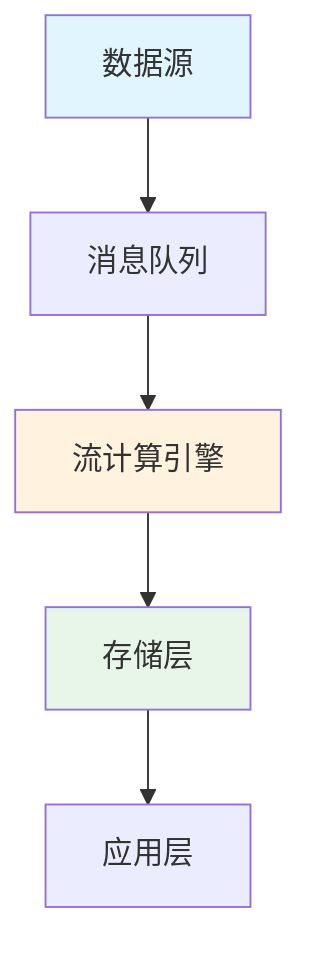

<!--
================================================================================
                        🏭 流计算工业案例征集模板
================================================================================
感谢您愿意分享贵司的流计算生产实践！您的案例将帮助社区成员了解
真实工业场景下的技术选型、架构设计和最佳实践。

填写提示：
- [x] 表示已完成的复选框
- <!-- --> 包裹的是提示说明，提交前可删除
- 敏感信息可用 **脱敏** 方式处理或标注为 [内部信息]
================================================================================
-->

## 📋 基本信息

### 公司名称
<!-- 请填写公司/组织全称，如：某某科技有限公司 -->
**必填**


### 所属行业
<!-- 请选择或填写：电商 / 金融 / 物流 / 游戏 / 物联网 / 社交 / 广告 / 其他 -->
**必填**


### 案例提交人
<!-- 您的姓名或昵称，用于贡献者名录 -->
**必填**


### 联系人信息
<!-- 邮箱或其他联系方式（不公开显示，仅用于审核沟通） -->
**必填**

- 邮箱：
- GitHub ID：
- 其他（可选）：

---

## 🎯 使用场景

### 业务场景概述
<!-- 
请用1-2句话概括核心业务场景，例如：
- 实时风控决策系统
- 电商大促实时大屏
- 物联网设备异常检测
-->
**必填**


### 详细业务描述
<!--
请详细描述：
1. 业务背景与挑战
2. 为什么选择流计算方案
3. 系统要解决的核心问题
-->
**必填**


### 业务价值
<!-- 该系统的业务价值，如：提升转化率、降低风险损失、提高运营效率等 -->


---

## 📊 数据规模

### 吞吐量指标
<!-- 请提供峰值和日常数据 -->
**必填**

| 指标项 | 峰值 | 日常 | 备注 |
|--------|------|------|------|
| 事件吞吐量 | ___ 事件/秒 | ___ 事件/秒 | |
| 数据量 | ___ GB/天 | ___ GB/天 | |
| 数据摄入速率 | ___ MB/s | ___ MB/s | |

### 集群规模
**必填**

| 组件 | 数量 | 配置规格 |
|------|------|----------|
| JobManager | ___ 个 | ___ CPU / ___ GB 内存 |
| TaskManager | ___ 个 | ___ CPU / ___ GB 内存 / ___ GB 磁盘 |
| 其他组件 | ___ 个 | |

### 状态与窗口规模
**必填**

| 指标项 | 数值 | 说明 |
|--------|------|------|
| 总状态大小 | ___ GB | |
| 单作业最大状态 | ___ GB | |
| 窗口时间跨度 | ___ 小时/天 | |
| 窗口内数据量 | ___ 条/GB | |

### 延迟要求
<!-- 端到端延迟、处理延迟等 SLA 指标 -->

- 端到端延迟要求：< ___ ms
- 处理延迟（Processing Time）：< ___ ms
- 容错恢复时间（RTO）：< ___ 分钟

---

## 🏗️ 架构图

### 系统架构图
<!--
请使用以下方式之一提供架构图：
1. Mermaid 图表（推荐）
2. 图片链接（上传到 GitHub 或图床）
3. 文字描述架构
-->
**必填 - 至少提供文字描述**



### 数据流描述
<!-- 详细描述数据从产生到消费的完整流程 -->


### 技术栈清单
**必填**

| 层级 | 技术组件 | 版本 | 用途说明 |
|------|----------|------|----------|
| 数据采集 | | | |
| 消息队列 | | | |
| 流计算引擎 | | | |
| 状态存储 | | | |
| 数据存储 | | | |
| 资源调度 | | | |
| 监控告警 | | | |

---

## 🎓 经验总结

### 技术选型决策
<!-- 为什么选择当前技术栈？考虑过哪些替代方案？ -->


### 核心挑战与解决方案
<!-- 至少描述1-2个关键挑战 -->
**必填**

#### 挑战1：
- **问题描述**：
- **解决方案**：
- **关键配置/代码**：

#### 挑战2：
- **问题描述**：
- **解决方案**：
- **关键配置/代码**：

### 最佳实践建议
<!-- 给社区其他成员的建议，至少3条 -->
**必填**

1. 
2. 
3. 

### 踩过的坑
<!-- 希望其他人避免的问题 -->

1. 
2. 

### 性能优化经验
<!-- 调优参数、优化前后对比等 -->


---

## 📈 项目成果

### 量化指标
<!-- 尽可能提供数据支撑的改进效果 -->

| 指标项 | 优化前 | 优化后 | 提升幅度 |
|--------|--------|--------|----------|
| 吞吐量 | | | |
| 延迟 | | | |
| 资源利用率 | | | |
| 故障恢复时间 | | | |
| 业务指标 | | | |

### 成本效益分析（可选）
<!-- 硬件成本、人力成本、运维成本等 -->


---

## 🔒 隐私与授权

### 敏感信息处理
<!-- 说明已脱敏或隐藏的内容 -->
- [ ] 已移除内部主机名/IP地址
- [ ] 已脱敏业务敏感指标
- [ ] 已移除内部项目代号
- [ ] 其他：

### 授权声明
**必填 - 请勾选所有适用项**

- [ ] 我确认提交的信息不包含公司机密数据和敏感信息
- [ ] 我确认已获公司授权分享此案例（如适用）
- [ ] 我授权项目方将此案例用于以下用途：
  - [ ] 收录到项目案例库
  - [ ] 在项目文档中展示（可匿名）
  - [ ] 在技术会议/社区分享中引用（可匿名）
  - [ ] 用于项目宣传和推广
- [ ] 我确认所提供信息真实准确

### 公开级别
<!-- 选择您希望的公开程度 -->
- [ ] **完全公开** - 可以公开公司名称和所有细节
- [ ] **半匿名** - 公开行业类型和案例内容，隐藏公司名称
- [ ] **完全匿名** - 仅展示技术细节，不透露任何公司信息

---

## 📎 附加材料

### 相关文档链接
<!-- 博客文章、技术分享幻灯片、视频等 -->

- 
- 

### 代码片段（可选）
<!-- 关键配置或代码示例，注意脱敏 -->

```yaml
# 示例配置
```

### 其他补充说明


---

<!--
================================================================================
                              提交后流程
================================================================================
1. 提交后，维护团队将在 3-5 个工作日内进行初步审核
2. 如有问题，我们会通过 Issue 评论与您沟通
3. 审核通过后，案例将被收录到 case-studies/verified/ 目录
4. 您将被添加到项目贡献者名录

感谢您的分享！🎉
================================================================================
-->
