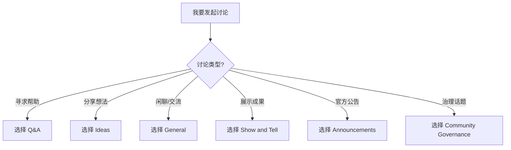

# GitHub Discussions 分类指南

> **版本**: v1.0 | **最后更新**: 2026-04-12

---

## 分类概述

本项目的 GitHub Discussions 分为以下几个分类，请根据您的讨论内容选择合适的分类。

---

## 分类说明

### 💬 一般讨论 (General)

**用途**: 进行一般性讨论、分享观点或交流想法

**适用场景**:
- 行业趋势观察和分享
- 技术选型思考
- 学习心得分享
- 项目经验交流
- 社区建设建议

**模板**: [general.yml](../DISCUSSION_TEMPLATE/general.yml)

---

### ❓ 问答 (Q&A)

**用途**: 提出问题并寻求社区帮助

**适用场景**:
- 概念理解问题
- 使用方法的疑问
- 贡献流程咨询
- 技术实现困惑
- 最佳实践请教

**提问建议**:
1. 先搜索是否已有类似问题
2. 清晰描述您的问题
3. 提供相关上下文信息
4. 标记正确答案（解决后）

**模板**: [q-a.yml](../DISCUSSION_TEMPLATE/q-a.yml)

---

### 💡 想法 (Ideas)

**用途**: 分享创意、提出建议或新功能想法

**适用场景**:
- 新主题内容建议
- 文档结构改进
- 工具/流程优化
- 社区活动创意
- 合作机会探讨

**模板**: [ideas.yml](../DISCUSSION_TEMPLATE/ideas.yml)

---

### 🚀 展示 (Show and Tell)

**用途**: 展示您使用本项目的工作成果

**适用场景**:
- 基于本项目的学习笔记
- 流计算实践案例分享
- 相关工具/项目推广
- 论文/文章分享
- 演讲/视频分享

**格式建议**:
```markdown
## 标题

### 背景
简要说明项目背景

### 成果展示
图片、链接或详细说明

### 经验分享
您学到的关键经验

### 相关资源
代码仓库、文档链接等
```

---

### 📢 公告 (Announcements)

**用途**: 项目官方公告（仅维护者使用）

**内容类型**:
- 版本发布通知
- 重要更新说明
- 社区活动预告
- 维护计划通知

---

### 🏘️ 社区治理 (Community Governance)

**用途**: 讨论社区治理相关话题

**适用场景**:
- 治理结构建议
- 行为准则讨论
- 贡献者晋升提名
- 社区规则修订

---

## 分类选择指南



---

## 讨论礼仪

请遵守以下基本礼仪：

1. **尊重他人** - 保持友善和尊重的态度
2. **清晰表达** - 标题明确，内容条理清晰
3. **搜索先行** - 发起前先搜索是否已有相关讨论
4. **及时反馈** - 问题解决后及时标记或回复
5. **遵守准则** - 遵守项目的行为准则

---

## 讨论与 Issue 的区别

| 场景 | 使用 Discussions | 使用 Issues |
|-----|-----------------|-------------|
| 提问求助 | ✅ | ❌ |
| 分享想法 | ✅ | ❌ |
| 一般交流 | ✅ | ❌ |
| 报告 Bug | ❌ | ✅ |
| 功能请求 | ❌ | ✅ |
| 文档改进 | ❌ | ✅ |
| 需要跟踪的任务 | ❌ | ✅ |

---

## 相关文档

- [COMMUNITY.md](../../COMMUNITY.md) - 社区指南
- [CODE_OF_CONDUCT.md](../../CODE_OF_CONDUCT.md) - 行为准则
- [CONTRIBUTING.md](../../CONTRIBUTING.md) - 贡献指南

---

*让我们一起构建活跃的流计算社区！* 💬
