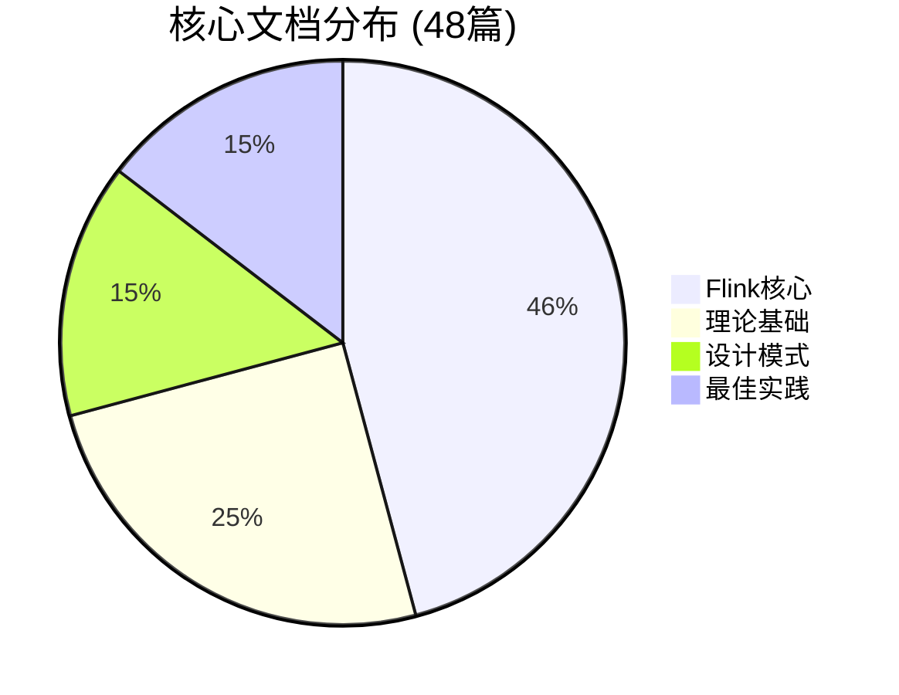

# 核心文档索引 (Core Documents Index)

> **版本**: v1.0 | **生成日期**: 2026-04-05 | **核心文档总数**: 48篇

---

## 索引说明

本文档列出项目所有**核心层 (Core Layer)** 文档，共计48篇。这些文档构成项目的知识基石，每季度必须审查更新。

**核心层特征**:

- 📋 六段式结构完整
- 🎯 准确率 ≥ 99%
- 🔄 每季度审查
- 👤 指定维护责任人

---

## 快速导航

| 类别 | 文档数 | 维护团队 |
|------|--------|----------|
| [理论基础](#理论基础) | 12篇 | @theory-maintainer |
| [Flink核心](#flink核心) | 22篇 | @core-maintainer |
| [设计模式](#设计模式) | 7篇 | @pattern-maintainer |
| [最佳实践](#最佳实践) | 7篇 | @practice-maintainer |

---

## 理论基础

**维护责任人**: @theory-maintainer | **下次审查**: 2026-Q2

### Struct/01-foundation/ - 流计算理论基础 (8篇)

| # | 文档路径 | 优先级 | 最后审查 | 状态 |
|---|----------|--------|----------|------|
| 1 | [Struct/01-foundation/01.01-unified-streaming-theory.md](../Struct/01-foundation/01.01-unified-streaming-theory.md) | P0 | 2026-Q1 | ✅ 已审查 |
| 2 | [Struct/01-foundation/01.02-process-calculus-primer.md](../Struct/01-foundation/01.02-process-calculus-primer.md) | P0 | 2026-Q1 | ✅ 已审查 |
| 3 | [Struct/01-foundation/01.03-actor-model-formalization.md](../Struct/01-foundation/01.03-actor-model-formalization.md) | P0 | 2026-Q1 | ✅ 已审查 |
| 4 | [Struct/01-foundation/01.04-dataflow-model-formalization.md](../Struct/01-foundation/01.04-dataflow-model-formalization.md) | P0 | 2026-Q1 | ✅ 已审查 |
| 5 | [Struct/01-foundation/01.05-csp-formalization.md](../Struct/01-foundation/01.05-csp-formalization.md) | P0 | 2026-Q1 | ✅ 已审查 |
| 6 | [Struct/01-foundation/01.06-petri-net-formalization.md](../Struct/01-foundation/01.06-petri-net-formalization.md) | P0 | 2026-Q1 | ✅ 已审查 |
| 7 | [Struct/01-foundation/01.07-session-types.md](../Struct/01-foundation/01.07-session-types.md) | P0 | 2026-Q1 | ✅ 已审查 |
| 8 | [Struct/01-foundation/stream-processing-semantics-formalization.md](../Struct/01-foundation/stream-processing-semantics-formalization.md) | P0 | 2026-Q1 | ✅ 已审查 |

### Struct/02-properties/ - 关键性质与定理 (4篇)

| # | 文档路径 | 优先级 | 最后审查 | 状态 |
|---|----------|--------|----------|------|
| 9 | [Struct/02-properties/02.01-determinism-in-streaming.md](../Struct/02-properties/02.01-determinism-in-streaming.md) | P0 | 2026-Q1 | ✅ 已审查 |
| 10 | [Struct/02-properties/02.02-consistency-hierarchy.md](../Struct/02-properties/02.02-consistency-hierarchy.md) | P0 | 2026-Q1 | ✅ 已审查 |
| 11 | [Struct/02-properties/02.03-watermark-monotonicity.md](../Struct/02-properties/02.03-watermark-monotonicity.md) | P0 | 2026-Q1 | ✅ 已审查 |
| 12 | [Struct/02-properties/02.04-liveness-and-safety.md](../Struct/02-properties/02.04-liveness-and-safety.md) | P0 | 2026-Q1 | ✅ 已审查 |

---

## Flink核心

**维护责任人**: @core-maintainer | **下次审查**: 2026-Q2

### Flink/02-core/ - Flink核心机制 (20篇)

| # | 文档路径 | 优先级 | 最后审查 | 状态 |
|---|----------|--------|----------|------|
| 13 | [Flink/02-core/checkpoint-mechanism-deep-dive.md](../Flink/02-core/checkpoint-mechanism-deep-dive.md) | P0 | 2026-Q1 | ✅ 已审查 |
| 14 | [Flink/02-core/exactly-once-semantics-deep-dive.md](../Flink/02-core/exactly-once-semantics-deep-dive.md) | P0 | 2026-Q1 | ✅ 已审查 |
| 15 | [Flink/02-core/time-semantics-and-watermark.md](../Flink/02-core/time-semantics-and-watermark.md) | P0 | 2026-Q1 | ✅ 已审查 |
| 16 | [Flink/02-core/flink-state-management-complete-guide.md](../Flink/02-core/flink-state-management-complete-guide.md) | P0 | 2026-Q1 | ✅ 已审查 |
| 17 | [Flink/02-core/backpressure-and-flow-control.md](../Flink/02-core/backpressure-and-flow-control.md) | P0 | 2026-Q1 | ✅ 已审查 |
| 18 | [Flink/02-core/async-execution-model.md](../Flink/02-core/async-execution-model.md) | P0 | 2026-Q1 | ✅ 已审查 |
| 19 | [Flink/02-core/exactly-once-end-to-end.md](../Flink/02-core/exactly-once-end-to-end.md) | P0 | 2026-Q1 | ✅ 已审查 |
| 20 | [Flink/02-core/flink-state-ttl-best-practices.md](../Flink/02-core/flink-state-ttl-best-practices.md) | P1 | 2026-Q1 | ✅ 已审查 |
| 21 | [Flink/02-core/state-backends-deep-comparison.md](../Flink/02-core/state-backends-deep-comparison.md) | P1 | 2026-Q1 | ✅ 已审查 |
| 22 | [Flink/02-core/streaming-etl-best-practices.md](../Flink/02-core/streaming-etl-best-practices.md) | P1 | 2026-Q1 | ✅ 已审查 |
| 23 | [Flink/02-core/smart-checkpointing-strategies.md](../Flink/02-core/smart-checkpointing-strategies.md) | P1 | 2026-Q1 | ✅ 已审查 |
| 24 | [Flink/02-core/adaptive-execution-engine-v2.md](../Flink/02-core/adaptive-execution-engine-v2.md) | P1 | 2026-Q1 | ✅ 已审查 |
| 25 | [Flink/02-core/forst-state-backend.md](../Flink/02-core/forst-state-backend.md) | P1 | 2026-Q1 | ✅ 已审查 |
| 26 | [Flink/02-core/flink-2.0-async-execution-model.md](../Flink/02-core/flink-2.0-async-execution-model.md) | P1 | 2026-Q1 | ✅ 已审查 |
| 27 | [Flink/02-core/flink-2.0-forst-state-backend.md](../Flink/02-core/flink-2.0-forst-state-backend.md) | P1 | 2026-Q1 | ✅ 已审查 |
| 28 | [Flink/02-core/multi-way-join-optimization.md](../Flink/02-core/multi-way-join-optimization.md) | P1 | 2026-Q1 | ✅ 已审查 |
| 29 | [Flink/02-core/delta-join.md](../Flink/02-core/delta-join.md) | P1 | 2026-Q1 | ✅ 已审查 |
| 30 | [Flink/02-core/delta-join-production-guide.md](../Flink/02-core/delta-join-production-guide.md) | P1 | 2026-Q1 | ✅ 已审查 |
| 31 | [Flink/02-core/flink-2.2-frontier-features.md](../Flink/02-core/flink-2.2-frontier-features.md) | P1 | 2026-Q1 | ✅ 已审查 |

### Flink/01-concepts/ - Flink核心概念 (2篇)

| # | 文档路径 | 优先级 | 最后审查 | 状态 |
|---|----------|--------|----------|------|
| 32 | [Flink/01-concepts/datastream-v2-semantics.md](../Flink/01-concepts/datastream-v2-semantics.md) | P0 | 2026-Q1 | ✅ 已审查 |
| 33 | [Flink/01-concepts/flink-1.x-vs-2.0-comparison.md](../Flink/01-concepts/flink-1.x-vs-2.0-comparison.md) | P1 | 2026-Q1 | ✅ 已审查 |

---

## 设计模式

**维护责任人**: @pattern-maintainer | **下次审查**: 2026-Q2

### Knowledge/02-design-patterns/ - 核心设计模式 (7篇)

| # | 文档路径 | 优先级 | 最后审查 | 状态 |
|---|----------|--------|----------|------|
| 34 | [Knowledge/02-design-patterns/pattern-stateful-computation.md](../Knowledge/02-design-patterns/pattern-stateful-computation.md) | P0 | 2026-Q1 | ✅ 已审查 |
| 35 | [Knowledge/02-design-patterns/pattern-windowed-aggregation.md](../Knowledge/02-design-patterns/pattern-windowed-aggregation.md) | P0 | 2026-Q1 | ✅ 已审查 |
| 36 | [Knowledge/02-design-patterns/pattern-event-time-processing.md](../Knowledge/02-design-patterns/pattern-event-time-processing.md) | P0 | 2026-Q1 | ✅ 已审查 |
| 37 | [Knowledge/02-design-patterns/pattern-checkpoint-recovery.md](../Knowledge/02-design-patterns/pattern-checkpoint-recovery.md) | P0 | 2026-Q1 | ✅ 已审查 |
| 38 | [Knowledge/02-design-patterns/pattern-async-io-enrichment.md](../Knowledge/02-design-patterns/pattern-async-io-enrichment.md) | P1 | 2026-Q1 | ✅ 已审查 |
| 39 | [Knowledge/02-design-patterns/pattern-cep-complex-event.md](../Knowledge/02-design-patterns/pattern-cep-complex-event.md) | P1 | 2026-Q1 | ✅ 已审查 |
| 40 | [Knowledge/02-design-patterns/pattern-side-output.md](../Knowledge/02-design-patterns/pattern-side-output.md) | P1 | 2026-Q1 | ✅ 已审查 |

---

## 最佳实践

**维护责任人**: @practice-maintainer | **下次审查**: 2026-Q2

### Knowledge/07-best-practices/ - 生产最佳实践 (7篇)

| # | 文档路径 | 优先级 | 最后审查 | 状态 |
|---|----------|--------|----------|------|
| 41 | [Knowledge/07-best-practices/07.01-flink-production-checklist.md](../Knowledge/07-best-practices/07.01-flink-production-checklist.md) | P0 | 2026-Q1 | ✅ 已审查 |
| 42 | [Knowledge/07-best-practices/07.02-performance-tuning-patterns.md](../Knowledge/07-best-practices/07.02-performance-tuning-patterns.md) | P0 | 2026-Q1 | ✅ 已审查 |
| 43 | [Knowledge/07-best-practices/07.03-troubleshooting-guide.md](../Knowledge/07-best-practices/07.03-troubleshooting-guide.md) | P0 | 2026-Q1 | ✅ 已审查 |
| 44 | [Knowledge/07-best-practices/07.04-cost-optimization-patterns.md](../Knowledge/07-best-practices/07.04-cost-optimization-patterns.md) | P1 | 2026-Q1 | ✅ 已审查 |
| 45 | [Knowledge/07-best-practices/07.05-security-hardening-guide.md](../Knowledge/07-best-practices/07.05-security-hardening-guide.md) | P1 | 2026-Q1 | ✅ 已审查 |
| 46 | [Knowledge/07-best-practices/07.06-high-availability-patterns.md](../Knowledge/07-best-practices/07.06-high-availability-patterns.md) | P1 | 2026-Q1 | ✅ 已审查 |
| 47 | [Knowledge/07-best-practices/07.07-testing-strategies-complete.md](../Knowledge/07-best-practices/07.07-testing-strategies-complete.md) | P1 | 2026-Q1 | ✅ 已审查 |

---

## 核心层分布图

---

## 优先级分布

| 优先级 | 文档数 | 占比 | 描述 |
|--------|--------|------|------|
| P0 | 25篇 | 52% | 关键核心文档，必须优先维护 |
| P1 | 23篇 | 48% | 重要文档，按计划维护 |

---

## 维护计划

### 2026年度审查日历

| 季度 | 审查时间 | 负责团队 | 审查范围 |
|------|----------|----------|----------|
| Q1 | 2026-03 | 全体 | 年度全面审查 |
| Q2 | 2026-06 | 全体 | 常规季度审查 |
| Q3 | 2026-09 | 全体 | 常规季度审查 |
| Q4 | 2026-12 | 全体 | 年度总结审查 |

### 审查检查清单

每个核心文档审查时必须确认：

- [ ] 六段式结构完整
- [ ] 定理/定义编号正确
- [ ] 外部链接可访问
- [ ] Mermaid图表正常渲染
- [ ] 代码示例可执行
- [ ] 无拼写语法错误
- [ ] 与当前版本兼容
- [ ] 引用格式符合规范

---

## 相关文档

- [doc-classification-system.md](./doc-classification-system.md) - 分级制度详细说明
- [doc-classification.json](./doc-classification.json) - 机器可读分类数据

---

*本索引由文档分级系统任务自动生成，最后更新: 2026-04-05*
