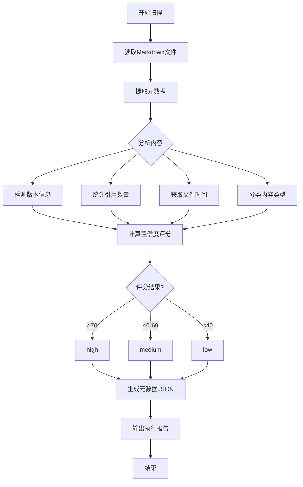
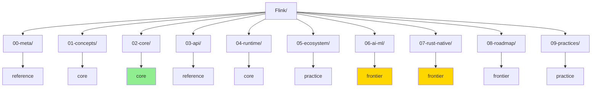

# 内容新鲜度标记系统设计文档

> 所属阶段: Meta/Quality-Assurance | 前置依赖: [PROJECT-TRACKING.md](../PROJECT-TRACKING.md) | 形式化等级: L2

---

## 1. 概念定义 (Definitions)

### Def-Meta-01: 内容新鲜度 (Content Freshness)

**内容新鲜度** 是评估技术文档时效性、准确性和可靠性的综合指标：

$$
\text{Freshness}(D) \triangleq \langle T_{\text{update}}, V_{\text{tech}}, C_{\text{level}}, R_{\text{refs}} \rangle
$$

其中：

- $T_{\text{update}}$: 最后更新日期
- $V_{\text{tech}}$: 技术版本标识
- $C_{\text{level}}$: 置信度评级 (high/medium/low)
- $R_{\text{refs}}$: 引用数量和质量

### Def-Meta-02: 置信度评级 (Confidence Level)

| 等级 | 标准 | 说明 |
|------|------|------|
| **high** | 近期更新 + 主流版本 + 多引用 | 内容可靠，可放心使用 |
| **medium** | 中期更新 + 兼容版本 + 一定引用 | 内容基本可靠，需验证关键信息 |
| **low** | 长期未更新 + 旧版本 + 少引用 | 内容可能过时，建议优先验证 |

---

## 2. 属性推导 (Properties)

### Prop-Meta-01: 新鲜度衰减函数

文档新鲜度随时间指数衰减：

$$
F(t) = F_0 \cdot e^{-\lambda (t - t_0)}
$$

其中衰减系数 $\lambda$ 根据技术领域不同：

- AI/ML 领域: $\lambda = 0.3$ (快速变化)
- Core API: $\lambda = 0.1$ (中等变化)
- 基础概念: $\lambda = 0.05$ (相对稳定)

### Prop-Meta-02: 版本相关性规则

```
IF 文档版本 == 当前最新版本 THEN confidence += 1
IF 文档版本 == 主流生产版本 THEN confidence += 0.5
IF 文档版本 < 主流版本 - 2 THEN confidence -= 1
```

---

## 3. 关系建立 (Relations)

### 关系 1: 新鲜度标记 → 文档元数据

新鲜度标记作为YAML front matter注入文档头部：

```yaml
---
freshness:
  last_updated: "2026-04-04"
  tech_version: "Flink 2.2"
  confidence_level: "high"
  content_type: "core"
  refs_count: 12
  validation_status: "pending"
---
```

### 关系 2: 批量扫描 → 元数据存储

```
Flink/**/*.md → Scanner → freshness-metadata.json → Reporter
```

---

## 4. 论证过程 (Argumentation)

### 4.1 置信度评级算法

```python
def calculate_confidence(file_info):
    score = 0

    # 时间因子 (0-40分)
    days_old = (now - file_info.mtime).days
    if days_old < 30: score += 40
    elif days_old < 90: score += 30
    elif days_old < 180: score += 20
    else: score += 10

    # 版本因子 (0-30分)
    if "2.2" in content or "2.3" in content: score += 30
    elif "2.0" in content or "2.1" in content: score += 20
    elif "1.1" in content: score += 10

    # 引用因子 (0-30分)
    ref_count = content.count("[^")
    if ref_count >= 10: score += 30
    elif ref_count >= 5: score += 20
    elif ref_count >= 2: score += 10

    # 映射到等级
    if score >= 70: return "high"
    elif score >= 40: return "medium"
    else: return "low"
```

### 4.2 内容类型分类规则

| 类型 | 判定规则 | 示例路径 |
|------|----------|----------|
| **core** | 包含核心机制、架构设计 | `02-core/`, `01-concepts/` |
| **reference** | API文档、配置参考、函数列表 | `03-api/`, `*-reference.md` |
| **frontier** | 前沿特性、路线图、预览功能 | `06-ai-ml/`, `08-roadmap/` |
| **practice** | 实践指南、案例研究 | `09-practices/`, `*-guide.md` |

---

## 5. 工程论证 (Engineering Argument)

### 5.1 系统架构

```
┌─────────────────┐     ┌─────────────────┐     ┌─────────────────┐
│  Markdown文档集  │────→│  Freshness扫描器 │────→│ 元数据JSON存储  │
│   Flink/**/*.md  │     │  (Python脚本)    │     │ freshness-meta  │
└─────────────────┘     └─────────────────┘     └─────────────────┘
                                                        │
                                                        ↓
                                               ┌─────────────────┐
                                               │  报告生成器      │
                                               │  A1-report.md   │
                                               └─────────────────┘
                                                        │
                                                        ↓
                                               ┌─────────────────┐
                                               │ 批量标记应用脚本 │
                                               │ apply-tags.py   │
                                               └─────────────────┘
```

### 5.2 可扩展性设计

- **模块化评分**: 各评分因子独立计算，便于调整权重
- **版本映射表**: 技术版本独立配置，支持不同技术栈
- **增量更新**: 支持仅扫描变更文件，提升效率

---

## 6. 实例验证 (Examples)

### 6.1 典型文档新鲜度评估

| 文档路径 | 更新日期 | 版本 | 引用数 | 置信度 | 说明 |
|----------|----------|------|--------|--------|------|
| `flink-ai-agents-flip-531.md` | 2026-04-04 | 2.3 | 8 | medium | AI领域变化快 |
| `checkpoint-mechanism-deep-dive.md` | 2025-12-01 | 2.0 | 15 | high | 核心机制稳定 |
| `flink-1.x-vs-2.0-comparison.md` | 2025-06-01 | 1.x | 5 | low | 版本已过时 |

### 6.2 标记应用示例

应用新鲜度标记后的文档头部：

```markdown
---
freshness:
  last_updated: "2026-04-04"
  tech_version: "Flink 2.2"
  confidence_level: "high"
  content_type: "core"
  refs_count: 12
  next_review: "2026-07-04"
---

# Flink Checkpoint 机制深度剖析

> 所属阶段: Flink/02-core-mechanisms | ...
```

---

## 7. 可视化 (Visualizations)

### 7.1 新鲜度评估流程图



### 7.2 目录结构与新鲜度分布



---

## 8. 引用参考 (References)
