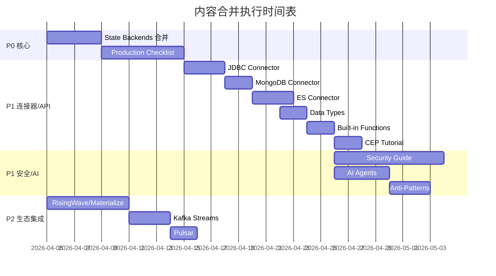

# 内容合并计划文档

> **生成日期**: 2026-04-05
> **版本**: v1.0
> **状态**: 待执行

---

## 执行摘要

本计划旨在解决 AnalysisDataFlow 项目中的内容重复和碎片化问题。通过系统化的合并策略，将 56 个重复文件整合为 15 个高质量主文档，预计节省 52 小时维护工作量。

### 关键指标

| 指标 | 数值 |
|------|------|
| 重复组数量 | 15 |
| 涉及文件总数 | 56 |
| 待删除文件 | 41 |
| 保留主文档 | 15 |
| 预计工作量 | 52 小时 |

---

## 第一阶段：核心层重复合并 (P0)

### 任务 1.1: State Backends 深度对比合并

**优先级**: P0 (最高)
**预计时间**: 4 小时
**截止日期**: 2026-04-12

#### 文件清单

| 角色 | 文件路径 | 操作 |
|------|----------|------|
| **主文档** | `Flink/02-core/state-backends-deep-comparison.md` | 保留并增强 |
| 从文档 | `Flink/flink-state-backends-comparison.md` | 合并后删除 |
| 从文档 | `Flink/3.9-state-backends-deep-comparison.md` | 合并后删除 |
| 从文档 | `Flink/state-backends-comparison.md` | 合并后删除 |

#### 合并策略

1. **定义统一**: 采用 `02-core` 版本的六段式模板，统一使用 `Def-F-02-*` 编号
2. **内容整合**:
   - 从 `3.9` 版本提取：ForStStateBackend (Flink 2.0+) 的详细分析
   - 从 `flink-` 版本提取：选型决策树的 Mermaid 图
   - 从根目录版本提取：基准测试数据对比表
3. **格式标准化**: 确保所有数学公式使用 LaTeX 格式
4. **引用更新**: 更新所有指向被删除文件的链接

#### 质量检查项

- [ ] 六段式结构完整
- [ ] 所有定义有唯一编号
- [ ] Mermaid 图可正常渲染
- [ ] 外部链接可访问

---

### 任务 1.2: Production Checklist 合并

**优先级**: P0 (最高)
**预计时间**: 6 小时
**截止日期**: 2026-04-15

#### 文件清单

| 角色 | 文件路径 | 操作 |
|------|----------|------|
| **主文档** | `Knowledge/07-best-practices/07.01-flink-production-checklist.md` | 保留并增强 |
| 从文档 | `Knowledge/3.10-flink-production-checklist.md` | 合并后删除 |
| 从文档 | `Flink/04-runtime/04.02-operations/production-checklist.md` | 合并后删除 |
| 从文档 | `Knowledge/production-checklist.md` | 合并后删除 |
| 从文档 | `Knowledge/production-deployment-checklist.md` | 合并后删除 |

#### 合并策略

1. **结构统一**: 采用 `07-best-practices` 版本的目录结构
2. **检查项整合**:
   - P0 检查项：以 `3.10` 版本的 Critical Path Item 定义为准
   - P1 检查项：整合两个版本的详细检查表
   - P2 检查项：保留 `07-best-practices` 的优化建议
3. **模板分离**: 将可打印检查清单提取为独立模板文件
4. **交叉引用**: 建立与 Anti-Patterns 检查清单的双向链接

#### 质量检查项

- [ ] 检查项覆盖完整生命周期
- [ ] P0/P1/P2 分级明确
- [ ] 每个检查项包含检查方法
- [ ] 提供配置模板链接

---

## 第二阶段：连接器文档合并 (P1)

### 任务 2.1: JDBC Connector 合并

**优先级**: P1
**预计时间**: 3 小时
**截止日期**: 2026-04-18

#### 文件清单

| 角色 | 文件路径 | 操作 |
|------|----------|------|
| **主文档** | `Flink/05-ecosystem/05.01-connectors/jdbc-connector-complete-guide.md` | 保留并增强 |
| 从文档 | `Flink/05-ecosystem/05.01-connectors/flink-jdbc-connector-guide.md` | 合并后删除 |
| 从文档 | `Flink/jdbc-connector-guide.md` | 合并后删除 |

#### 合并策略

1. 以 `jdbc-connector-complete-guide.md` 为基础
2. 整合 `flink-jdbc-connector-guide.md` 中的故障排查章节
3. 添加根目录版本的快速开始示例

---

### 任务 2.2: MongoDB Connector 合并

**优先级**: P1
**预计时间**: 2 小时
**截止日期**: 2026-04-18

#### 文件清单

| 角色 | 文件路径 | 操作 |
|------|----------|------|
| **主文档** | `Flink/05-ecosystem/05.01-connectors/mongodb-connector-complete-guide.md` | 保留并增强 |
| 从文档 | `Flink/mongodb-connector-guide.md` | 合并后删除 |

---

### 任务 2.3: Elasticsearch Connector 合并

**优先级**: P1
**预计时间**: 3 小时
**截止日期**: 2026-04-20

#### 文件清单

| 角色 | 文件路径 | 操作 |
|------|----------|------|
| **主文档** | `Flink/05-ecosystem/05.01-connectors/elasticsearch-connector-complete-guide.md` | 保留并增强 |
| 从文档 | `Flink/05-ecosystem/05.01-connectors/flink-elasticsearch-connector-guide.md` | 合并后删除 |
| 从文档 | `Flink/elasticsearch-connector-guide.md` | 合并后删除 |

---

## 第三阶段：API 参考文档合并 (P1)

### 任务 3.1: Data Types 参考合并

**优先级**: P1
**预计时间**: 2 小时
**截止日期**: 2026-04-22

#### 文件清单

| 角色 | 文件路径 | 操作 |
|------|----------|------|
| **主文档** | `Flink/03-api/03.02-table-sql-api/data-types-complete-reference.md` | 保留并增强 |
| 从文档 | `Flink/data-types-complete-reference.md` | 合并后删除 |
| 从文档 | `Flink/flink-data-types-reference.md` | 合并后删除 |

---

### 任务 3.2: Built-in Functions 参考合并

**优先级**: P1
**预计时间**: 2 小时
**截止日期**: 2026-04-22

#### 文件清单

| 角色 | 文件路径 | 操作 |
|------|----------|------|
| **主文档** | `Flink/03-api/03.02-table-sql-api/built-in-functions-complete-list.md` | 保留并增强 |
| 从文档 | `Flink/built-in-functions-reference.md` | 合并后删除 |
| 从文档 | `Flink/flink-built-in-functions-reference.md` | 合并后删除 |

---

### 任务 3.3: CEP 教程合并

**优先级**: P1
**预计时间**: 2 小时
**截止日期**: 2026-04-22

#### 文件清单

| 角色 | 文件路径 | 操作 |
|------|----------|------|
| **主文档** | `Flink/flink-cep-complete-tutorial.md` | 保留并增强 |
| 从文档 | `Knowledge/cep-complete-tutorial.md` | 合并后删除 |

#### 特殊说明

将 Knowledge 版本中的概念解释迁移到 Flink 版本，保留 Flink 版本的完整示例代码。

---

## 第四阶段：生态集成文档合并 (P2)

### 任务 4.1: RisingWave 集成合并

**优先级**: P2
**预计时间**: 3 小时
**截止日期**: 2026-04-25

#### 文件清单

| 角色 | 文件路径 | 操作 |
|------|----------|------|
| **主文档** | `Flink/05-ecosystem/ecosystem/risingwave-integration-guide.md` | 保留并增强 |
| 从文档 | `Flink/risingwave-integration-guide.md` | 合并后删除 |
| 参考文档 | `Knowledge/06-frontier/risingwave-integration-guide.md` | 整合后保留为业务视角 |

#### 合并策略

保留两个视角：Flink 版本侧重技术集成，Knowledge 版本侧重业务场景对比。

---

### 任务 4.2: Materialize 对比合并

**优先级**: P2
**预计时间**: 3 小时
**截止日期**: 2026-04-25

#### 文件清单

| 角色 | 文件路径 | 操作 |
|------|----------|------|
| **主文档** | `Flink/05-ecosystem/ecosystem/materialize-comparison.md` | 保留并增强 |
| 从文档 | `Flink/materialize-comparison.md` | 合并后删除 |
| 参考文档 | `Knowledge/06-frontier/materialize-comparison-guide.md` | 整合后保留 |

---

### 任务 4.3: Kafka Streams 迁移合并

**优先级**: P2
**预计时间**: 3 小时
**截止日期**: 2026-04-25

#### 文件清单

| 角色 | 文件路径 | 操作 |
|------|----------|------|
| **主文档** | `Knowledge/05-mapping-guides/migration-guides/05.2-kafka-streams-to-flink-migration.md` | 保留并增强 |
| 从文档 | `Flink/05-ecosystem/ecosystem/kafka-streams-migration.md` | 合并后删除 |
| 从文档 | `Knowledge/kafka-streams-migration.md` | 合并后删除 |

---

### 任务 4.4: Pulsar Functions 集成合并

**优先级**: P2
**预计时间**: 2 小时
**截止日期**: 2026-04-25

#### 文件清单

| 角色 | 文件路径 | 操作 |
|------|----------|------|
| **主文档** | `Flink/05-ecosystem/ecosystem/pulsar-functions-integration.md` | 保留并增强 |
| 从文档 | `Flink/pulsar-functions-integration.md` | 合并后删除 |

---

## 第五阶段：安全与最佳实践合并 (P1)

### 任务 5.1: Security 安全指南合并

**优先级**: P1
**预计时间**: 8 小时
**截止日期**: 2026-04-30

#### 文件清单

| 角色 | 文件路径 | 操作 |
|------|----------|------|
| **主文档** | `Flink/09-practices/09.04-security/flink-security-complete-guide.md` | 保留并重构 |
| 子主题 | `Flink/09-practices/09.04-security/security-hardening-guide.md` | 整合为主文档章节 |
| 子主题 | `Flink/09-practices/09.04-security/streaming-security-best-practices.md` | 整合为主文档章节 |
| 子主题 | `Knowledge/07-best-practices/07.05-security-hardening-guide.md` | 整合为主文档章节 |
| 参考 | `Knowledge/08-standards/streaming-security-compliance.md` | 保留为标准参考 |

#### 合并策略

采用主题拆分方式，将主文档拆分为：

- 认证与授权
- 数据加密
- 网络安全
- 审计与合规

---

### 任务 5.2: AI Agents / FLIP-531 合并

**优先级**: P1
**预计时间**: 4 小时
**截止日期**: 2026-04-28

#### 文件清单

| 角色 | 文件路径 | 操作 |
|------|----------|------|
| **主文档** | `Flink/06-ai-ml/flink-ai-agents-flip-531.md` | 保留并重命名 |
| 从文档 | `Flink/06-ai-ml/flink-agents-flip-531.md` | 合并后删除 |
| 从文档 | `Flink/06-ai-ml/flip-531-ai-agents-ga-guide.md` | 合并后删除 |

#### 特殊说明

统一命名为 `flink-ai-agents-flip-531.md`，删除其他变体命名。

---

### 任务 5.3: Anti-Patterns 反模式合并

**优先级**: P1
**预计时间**: 3 小时
**截止日期**: 2026-04-28

#### 文件清单

| 角色 | 文件路径 | 操作 |
|------|----------|------|
| **主文档** | `Knowledge/09-anti-patterns/anti-pattern-checklist.md` | 保留并增强 |
| 从文档 | `Knowledge/09-anti-patterns/streaming-anti-patterns.md` | 合并后删除 |

---

## 代码示例去重计划

### 目标

识别并提取重复的代码示例，建立统一的代码片段库。

### 实施方案

```
.improvement-tracking/
└── code-snippets/
    ├── sql/
    │   ├── window-aggregation-examples.sql
    │   ├── join-patterns.sql
    │   └── cep-pattern-examples.sql
    ├── java/
    │   ├── checkpoint-config-examples.java
    │   ├── state-backend-config.java
    │   └── watermark-strategies.java
    └── python/
        └── pyflink-examples.py
```

### 引用方式

在 Markdown 中使用引用语法：

```markdown
```sql
-- @snippet: window-aggregation-examples/tumble-window
-- 代码内容...
```

```

---

## 执行时间表



---

## 风险管理

### 风险识别

| 风险 | 可能性 | 影响 | 缓解措施 |
|------|--------|------|----------|
| 合并过程中丢失内容 | 中 | 高 | 执行前完整备份；分步骤验证 |
| 链接断裂 | 高 | 中 | 使用脚本批量更新链接；事后全面检查 |
| 编号冲突 | 中 | 中 | 使用定理注册表验证唯一性 |
| 合并质量不达标 | 中 | 高 | 每阶段结束后质量审查 |

### 回滚计划

1. 合并前创建 Git 分支 `content-merge-2026-04`
2. 每个任务完成后提交独立 commit
3. 如发现问题，可回滚到任意提交点

---

## 成功标准

1. **覆盖率**: 100% 的重复文件得到处理
2. **完整性**: 主文档包含所有从文档的独特内容
3. **一致性**: 所有保留文档符合六段式模板
4. **零断裂**: 所有内部链接可正常访问
5. **可验证**: 通过自动化链接检查

---

## 附录：文件删除清单

### 待删除文件 (41个)

#### Flink/ 根目录 (10个)

- `Flink/flink-state-backends-comparison.md`
- `Flink/3.9-state-backends-deep-comparison.md`
- `Flink/state-backends-comparison.md`
- `Flink/jdbc-connector-guide.md`
- `Flink/mongodb-connector-guide.md`
- `Flink/elasticsearch-connector-guide.md`
- `Flink/data-types-complete-reference.md`
- `Flink/flink-data-types-reference.md`
- `Flink/built-in-functions-reference.md`
- `Flink/flink-built-in-functions-reference.md`
- `Flink/risingwave-integration-guide.md`
- `Flink/materialize-comparison.md`
- `Flink/pulsar-functions-integration.md`

#### Knowledge/ 根目录 (3个)

- `Knowledge/production-checklist.md`
- `Knowledge/production-deployment-checklist.md`
- `Knowledge/kafka-streams-migration.md`
- `Knowledge/cep-complete-tutorial.md`

#### 结构化目录重复 (24个)

- `Flink/04-runtime/04.02-operations/production-checklist.md`
- `Flink/05-ecosystem/05.01-connectors/flink-jdbc-connector-guide.md`
- `Flink/05-ecosystem/05.01-connectors/flink-elasticsearch-connector-guide.md`
- `Flink/05-ecosystem/ecosystem/kafka-streams-migration.md`
- `Flink/05-ecosystem/ecosystem/risingwave-integration-guide.md`
- `Flink/05-ecosystem/ecosystem/materialize-comparison.md`
- `Flink/05-ecosystem/ecosystem/pulsar-functions-integration.md`
- `Flink/06-ai-ml/flink-agents-flip-531.md`
- `Flink/06-ai-ml/flip-531-ai-agents-ga-guide.md`
- `Flink/09-practices/09.04-security/security-hardening-guide.md`
- `Flink/09-practices/09.04-security/streaming-security-best-practices.md`
- `Knowledge/3.10-flink-production-checklist.md`
- `Knowledge/09-anti-patterns/streaming-anti-patterns.md`

---

*本计划由自动化工具生成，需人工审核后执行。*
