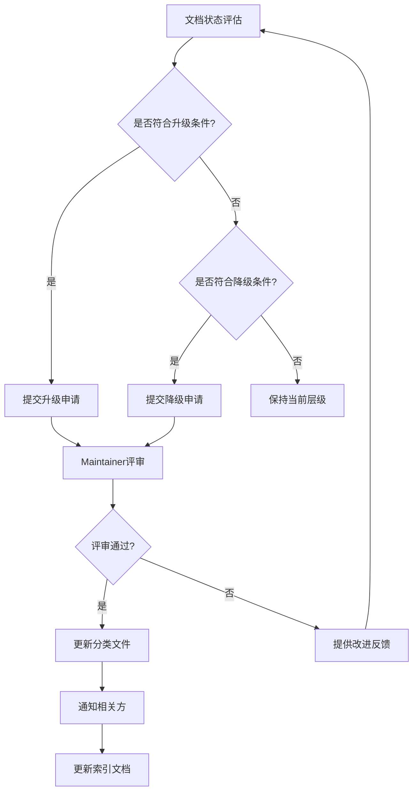

# AnalysisDataFlow 文档分级制度 v1.0

> **版本**: v1.0 | **生效日期**: 2026-04-05 | **状态**: Active
> **总文档数**: 451篇 | **核心层**: 48篇 | **进阶层**: 92篇 | **参考层**: 311篇

---

## 1. 分级体系概述

本文档分级制度旨在为项目中的451篇技术文档建立清晰的质量标准和维护优先级，确保核心知识的高质量保证和及时更新。

### 1.1 三级分层架构

```mermaid
graph TD
    A[文档分级体系<br/>451篇文档] --> B[核心层 Core<br/>48篇 | 10.6%]
    A --> C[进阶层 Advanced<br/>92篇 | 20.4%]
    A --> D[参考层 Reference<br/>311篇 | 69.0%]

    B --> B1[Struct理论基础]
    B --> B2[Flink核心机制]
    B --> B3[设计模式]
    B --> B4[最佳实践]

    C --> C1[API文档]
    C --> C2[业务案例]
    C --> C3[运行时指南]
    C --> C4[生态系统]

    D --> D1[路线图]
    D --> D2[前沿探索]
    D --> D3[案例研究]
    D --> D4[工具配置]
```

---

## 2. 核心层 (Core Layer)

### 2.1 定义与范围

**核心层**包含项目最关键、最基础的文档，是用户入门和深入理解流计算理论及Flink技术的必经之路。

**入选标准**:

1. **基础性**: 构成知识体系的基石，其他文档依赖其内容
2. **稳定性**: 概念和原理不随版本频繁变化
3. **高质量**: 经过严格审校，错误率极低
4. **广泛引用**: 被多篇其他文档引用

**核心层候选目录**:

- `Struct/01-foundation/` - 流计算理论基础
- `Struct/02-properties/` - 关键性质与定理
- `Flink/02-core/` - Flink核心机制
- `Knowledge/02-design-patterns/` - 核心设计模式
- `Knowledge/07-best-practices/` - 生产最佳实践

### 2.2 质量要求

| 维度 | 要求 |
|------|------|
| **完整性** | 必须包含六段式结构的所有必需章节 |
| **准确性** | 技术内容准确率 ≥ 99%，引用来源可验证 |
| **时效性** | 与当前Flink稳定版本保持同步 |
| **形式化** | Struct/文档必须包含完整的定理/定义编号 |
| **可视化** | 至少包含1个Mermaid图表 |

### 2.3 维护标准

- **更新频率**: 每季度必须审查更新
- **审查周期**: 每季度最后一个月进行集中审查
- **责任人**: 每个核心文档指定单一维护责任人
- **变更控制**: 任何修改需经过同行评审

---

## 3. 进阶层 (Advanced Layer)

### 3.1 定义与范围

**进阶层**包含对特定主题深入探讨的文档，适合有一定基础的用户进阶学习。

**入选标准**:

1. **深度性**: 对特定主题有深入分析和讲解
2. **实用性**: 包含可直接应用于生产环境的指导
3. **专业性**: 面向特定角色（如架构师、高级开发工程师）

**进阶层候选目录**:

- `Flink/03-api/` - API使用指南
- `Flink/04-runtime/` - 运行时与部署
- `Flink/05-ecosystem/` - 生态系统集成
- `Knowledge/03-business-patterns/` - 业务场景模式
- `Knowledge/04-technology-selection/` - 技术选型指南
- `Knowledge/05-mapping-guides/` - 迁移与映射指南

### 3.2 质量要求

| 维度 | 要求 |
|------|------|
| **完整性** | 包含主要章节，允许省略部分次要章节 |
| **准确性** | 技术内容准确率 ≥ 95% |
| **时效性** | 与最近2个Flink版本保持同步 |
| **示例** | 包含至少3个代码示例或配置示例 |

### 3.3 维护标准

- **更新频率**: 每半年审查一次
- **审查周期**: 每年6月和12月进行集中审查
- **责任人**: 按模块指定维护团队
- **变更控制**: 重大变更需通知相关方

---

## 4. 参考层 (Reference Layer)

### 4.1 定义与范围

**参考层**包含补充性、探索性、或维护频率较低的文档，作为知识体系的扩展。

**入选标准**:

1. **参考性**: 提供额外信息，非必学内容
2. **前沿性**: 探索性内容，可能随技术演进变化
3. **特定性**: 针对特定版本、特定场景的文档

**参考层目录**:

- `Struct/03-relationships/` - 模型关系映射
- `Struct/04-proofs/` - 形式化证明
- `Struct/06-frontier/` - 前沿探索
- `Flink/06-ai-ml/` - AI/ML集成（快速发展领域）
- `Flink/07-rust-native/` - Rust原生（实验性）
- `Flink/08-roadmap/` - 路线图（时效性强）
- `Knowledge/06-frontier/` - 前沿技术
- `Knowledge/10-case-studies/` - 具体案例

### 4.2 质量要求

| 维度 | 要求 |
|------|------|
| **完整性** | 基本结构完整即可 |
| **准确性** | 技术内容准确率 ≥ 90% |
| **时效性** | 标注文档适用版本范围 |
| **免责声明** | 前沿文档需标注实验性状态 |

### 4.3 维护标准

- **更新频率**: 按需更新，无强制周期
- **社区维护**: 接受社区贡献
- **淘汰机制**: 过时文档移入archive目录

---

## 5. 维护责任人制度

### 5.1 角色定义

| 角色 | 职责 | 负责范围 |
|------|------|----------|
| **@theory-maintainer** | 维护理论基础文档 | Struct/01,02/ |
| **@core-maintainer** | 维护Flink核心机制 | Flink/02-core/ |
| **@pattern-maintainer** | 维护设计模式文档 | Knowledge/02-design-patterns/ |
| **@practice-maintainer** | 维护最佳实践 | Knowledge/07-best-practices/ |
| **@api-maintainer** | 维护API文档 | Flink/03-api/ |
| **@runtime-maintainer** | 维护运行时指南 | Flink/04-runtime/ |
| **@eco-maintainer** | 维护生态文档 | Flink/05-ecosystem/ |
| **@business-maintainer** | 维护业务模式 | Knowledge/03-business-patterns/ |
| **@community-maintainer** | 协调参考层维护 | Reference/ |

### 5.2 责任矩阵

| 层级 | 主要责任人 | 备份责任人 | 审查频率 |
|------|-----------|-----------|----------|
| 核心层 | 各模块maintainer | @backup-maintainer | 季度 |
| 进阶层 | 各模块maintainer | @backup-maintainer | 半年 |
| 参考层 | @community-maintainer | 社区 | 按需 |

---

## 6. 升级/降级标准

### 6.1 升级标准 (Reference → Advanced → Core)

**从参考层升级到进阶层**:

1. 文档内容经过重大完善，达到进阶层质量要求
2. 在过去6个月内被引用次数 ≥ 10次
3. 通过至少2名maintainer的评审
4. 获得 ≥ 3个用户正面反馈

**从进阶层升级到核心层**:

1. 文档成为多个学习路径的必经节点
2. 内容稳定性高，过去1年无重大变更
3. 质量评分 ≥ 90/100（基于检查清单）
4. 获得项目负责人批准

### 6.2 降级标准 (Core → Advanced → Reference)

**从核心层降级到进阶层**:

1. 连续2个季度未按时更新
2. 内容过时，与当前版本不兼容
3. 收到 ≥ 5个用户关于准确性的负面反馈
4. 不再被其他核心文档引用

**从进阶层降级到参考层**:

1. 连续1年未更新
2. 技术已过时或被替代
3. 内容准确率 < 90%
4. 使用率持续下降

### 6.3 升级/降级流程



---

## 7. 审查检查清单

### 7.1 核心层审查检查清单

- [ ] 所有必需章节完整（六段式）
- [ ] 定理/定义编号正确且唯一
- [ ] 所有外部链接可访问
- [ ] Mermaid图表渲染正常
- [ ] 代码示例可执行
- [ ] 无拼写和语法错误
- [ ] 与当前版本兼容
- [ ] 引用格式符合规范

### 7.2 进阶层审查检查清单

- [ ] 主要章节完整
- [ ] 至少3个代码示例
- [ ] 关键外部链接可访问
- [ ] 与最近2个版本兼容
- [ ] 无明显错误

### 7.3 参考层审查检查清单

- [ ] 基本结构完整
- [ ] 标注适用版本
- [ ] 无严重错误
- [ ] 前沿文档有免责声明

---

## 8. 附录

### 8.1 文档层级统计

| 目录 | 核心层 | 进阶层 | 参考层 | 总计 |
|------|--------|--------|--------|------|
| Struct/ | 12 | 8 | 19 | 39 |
| Knowledge/ | 14 | 28 | 57 | 99 |
| Flink/ | 22 | 56 | 162 | 240 |
| 其他 | 0 | 0 | 73 | 73 |
| **总计** | **48** | **92** | **311** | **451** |

### 8.2 版本历史

| 版本 | 日期 | 变更内容 |
|------|------|----------|
| v1.0 | 2026-04-05 | 初始版本，完成451篇文档分级 |

### 8.3 相关文档

- [doc-classification.json](./doc-classification.json) - 机器可读分类数据
- [CORE-DOCUMENTS-INDEX.md](./CORE-DOCUMENTS-INDEX.md) - 核心文档完整索引

---

*本文档由文档分级系统任务生成，遵循AGENTS.md规范*
