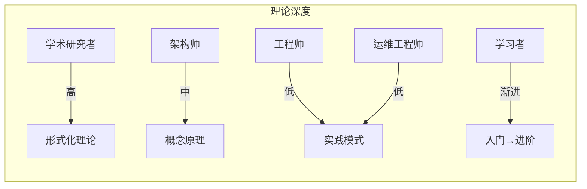

# 用户画像定义 (User Personas)

> **目标**: 为AnalysisDataFlow项目定义典型用户画像，指导内容组织与导航设计
> **版本**: 1.0 | **日期**: 2026-04-05

---

## 📋 用户画像概览

| 画像 | 名称 | 核心目标 | 主要痛点 | 内容偏好 |
|------|------|---------|---------|---------|
| P1 | 学术研究者 | 理论研究、论文写作 | 工程细节过多 | 形式化定义、定理证明 |
| P2 | 后端工程师 | 开发流处理应用 | 缺乏最佳实践 | 设计模式、代码示例 |
| P3 | 系统架构师 | 技术选型决策 | 对比信息分散 | 决策树、对比矩阵 |
| P4 | 运维工程师 | 保障系统稳定 | 故障排查困难 | 运维指南、故障案例 |
| P5 | 技术学习者 | 入门流计算领域 | 学习路径不清晰 | 渐进式教程 |

---

## 🎓 P1: 学术研究者 (Researcher)

### 基本信息

- **背景**: 高校教师、博士生、研究机构研究员
- **专业领域**: 分布式系统、形式化方法、数据库理论、编程语言
- **技术栈**: LaTeX、Coq/TLA+、Python/R (数据分析)

### 核心目标

1. 理解流计算的理论基础与形式化模型
2. 寻找研究问题的理论支撑和已有证明
3. 对比不同计算模型的表达能力
4. 发现新的研究切入点和开放问题

### 主要痛点

| 痛点 | 具体表现 | 期望解决方案 |
|------|---------|-------------|
| **工程噪音** | 大量代码/配置分散注意力 | 提供纯理论视角的导航 |
| **符号不统一** | 不同文档符号体系不一致 | 统一的数学符号表 |
| **证明不完整** | 缺少关键引理的详细证明 | 完整的定理-证明链 |
| **引用分散** | 经典论文引用散落在各处 | 集中式参考文献库 |
| **前沿滞后** | 难以跟踪最新研究进展 | 前沿技术追踪章节 |

### 推荐内容路径

```
Struct/00-INDEX.md (起点)
    ↓
Struct/01-foundation/01.01-unified-streaming-theory.md (核心理论)
    ↓
├─ Struct/01-foundation/01.02-process-calculus-primer.md (进程演算)
├─ Struct/01-foundation/01.03-actor-model-formalization.md (Actor模型)
├─ Struct/02-properties/02.02-consistency-hierarchy.md (一致性)
    ↓
Struct/04-proofs/ (形式证明)
    ↓
Struct/06-frontier/ (前沿研究)
```

### 关键文档

- **必读**: [统一流计算理论](Struct/01-foundation/01.01-unified-streaming-theory.md)
- **深度**: [Checkpoint正确性证明](Struct/04-proofs/04.01-flink-checkpoint-correctness.md)
- **工具**: [Smart Casual验证](Struct/07-tools/smart-casual-verification.md)
- **前沿**: [流计算开放问题](Struct/06-frontier/)

### 使用建议

- 直接从 `Struct/` 目录开始，避免被工程内容干扰
- 重点关注带有 "形式化等级: L5-L6" 标记的文档
- 使用 [THEOREM-REGISTRY.md](THEOREM-REGISTRY.md) 查找特定定理

---

## 👨‍💻 P2: 后端工程师 (Backend Engineer)

### 基本信息

- **背景**: 互联网公司后端开发，2-5年经验
- **专业领域**: Java/Scala/Python后端开发
- **技术栈**: Spring Boot、Kafka、Redis、Flink (初级)

### 核心目标

1. 快速掌握Flink开发技能
2. 写出高性能、可靠的流处理代码
3. 避免常见的设计陷阱
4. 解决实际业务问题

### 主要痛点

| 痛点 | 具体表现 | 期望解决方案 |
|------|---------|-------------|
| **概念混淆** | Watermark/Checkpoint/State概念不清 | 清晰的概念解释+实例 |
| **代码陷阱** | 不知道哪些写法会导致问题 | 反模式清单+正确示例 |
| **性能瓶颈** | 作业运行慢但不知优化方向 | 性能调优指南 |
| **调试困难** | 流处理难以本地调试 | 调试技巧与工具 |
| **缺乏模式** | 每个问题都从头解决 | 可复用的设计模式 |

### 推荐内容路径

```
tutorials/00-5-MINUTE-QUICK-START.md (快速入门)
    ↓
tutorials/02-first-flink-job.md (第一个作业)
    ↓
Knowledge/02-design-patterns/ (设计模式)
    ↓
├─ pattern-event-time-processing.md
├─ pattern-stateful-computation.md
├─ pattern-windowed-aggregation.md
    ↓
Knowledge/09-anti-patterns/ (避坑指南)
    ↓
Flink/09-practices/09.03-performance-tuning/ (性能调优)
```

### 关键文档

- **入门**: [5分钟快速上手](tutorials/00-5-MINUTE-QUICK-START.md)
- **核心**: [Checkpoint恢复模式](Knowledge/02-design-patterns/pattern-checkpoint-recovery.md)
- **避坑**: [10大反模式](Knowledge/09-anti-patterns/)
- **实战**: [第一个Flink作业](tutorials/02-first-flink-job.md)
- **调优**: [性能调优指南](Flink/09-practices/09.03-performance-tuning/performance-tuning-guide.md)

### 使用建议

- 从 `tutorials/` 开始，边学边练
- 遇到具体问题先查 `Knowledge/09-anti-patterns/`
- 需要写代码时参考 `Knowledge/02-design-patterns/`

---

## 🏗️ P3: 系统架构师 (System Architect)

### 基本信息

- **背景**: 5-10年经验，负责系统整体架构设计
- **专业领域**: 分布式系统架构、技术选型、容量规划
- **技术栈**: 熟悉多种流处理引擎，关注云原生技术

### 核心目标

1. 为业务场景选择合适的技术栈
2. 设计高可用、可扩展的流处理架构
3. 评估技术方案的利弊与风险
4. 制定团队技术标准和规范

### 主要痛点

| 痛点 | 具体表现 | 期望解决方案 |
|------|---------|-------------|
| **信息碎片化** | 对比信息散落在不同文档 | 集中式对比矩阵 |
| **决策困难** | 不知道哪种方案适合自己 | 决策树/选型指南 |
| **缺乏案例** | 想了解业界如何实施 | 真实案例研究 |
| **前瞻性** | 需要了解技术趋势 | 路线图与趋势分析 |
| **ROI评估** | 难以量化技术投入产出 | 成本模型分析 |

### 推荐内容路径

```
Knowledge/04-technology-selection/engine-selection-guide.md (选型起点)
    ↓
├─ flink-vs-risingwave.md
├─ flink-vs-spark-streaming.md
    ↓
visuals/matrix-engines.md (对比矩阵)
    ↓
Flink/01-concepts/deployment-architectures.md (部署架构)
    ↓
Knowledge/03-business-patterns/ (业务场景)
    ↓
CASE-STUDIES.md (案例研究)
    ↓
ROADMAP.md (技术路线图)
```

### 关键文档

- **选型**: [引擎选型决策树](Knowledge/04-technology-selection/engine-selection-guide.md)
- **对比**: [Flink vs RisingWave](Knowledge/04-technology-selection/flink-vs-risingwave.md)
- **架构**: [部署架构指南](Flink/01-concepts/deployment-architectures.md)
- **案例**: [CASE-STUDIES.md](CASE-STUDIES.md)
- **趋势**: [ROADMAP.md](ROADMAP.md)

### 使用建议

- 从 `visuals/` 目录的可视化图表快速建立全局认知
- 使用决策树辅助技术选型
- 参考 `CASE-STUDIES.md` 了解业界实践

---

## 🔧 P4: 运维工程师 (SRE/DevOps)

### 基本信息

- **背景**: 负责线上系统稳定性，3-5年经验
- **专业领域**: Kubernetes、监控告警、故障排查
- **技术栈**: K8s、Prometheus、Grafana、Flink运维

### 核心目标

1. 保障流处理系统7x24稳定运行
2. 快速定位和解决生产问题
3. 建立完善的监控告警体系
4. 优化资源利用率和成本

### 主要痛点

| 痛点 | 具体表现 | 期望解决方案 |
|------|---------|-------------|
| **故障排查慢** | 问题出现时找不到排查路径 | 故障排查手册 |
| **告警噪音** | 大量无效告警淹没关键信息 | 合理的监控指标 |
| **缺乏预案** | 常见故障没有标准处理流程 | SOP操作手册 |
| **资源浪费** | 不清楚如何合理配置资源 | 容量规划指南 |
| **版本升级** | 升级时担心引入新问题 | 升级检查清单 |

### 推荐内容路径

```
Flink/04-runtime/04.01-deployment/kubernetes-deployment-production-guide.md
    ↓
Flink/04-runtime/04.03-observability/metrics-and-monitoring.md
    ↓
OBSERVABILITY-GUIDE.md (可观测性)
    ↓
TROUBLESHOOTING.md (故障排查)
    ↓
Knowledge/07-best-practices/ (最佳实践)
    ↓
Flink/04-runtime/04.04-security/ (安全配置)
```

### 关键文档

- **部署**: [K8s生产部署指南](Flink/04-runtime/04.01-deployment/kubernetes-deployment-production-guide.md)
- **监控**: [监控指标详解](Flink/04-runtime/04.03-observability/metrics-and-monitoring.md)
- **排障**: [故障排查手册](TROUBLESHOOTING.md)
- **背压**: [背压与流控](Flink/02-core/backpressure-and-flow-control.md)
- **安全**: [流数据安全合规](Knowledge/08-standards/streaming-security-compliance.md)

### 使用建议

- 将 [TROUBLESHOOTING.md](TROUBLESHOOTING.md) 加入书签
- 重点关注 `Flink/04-runtime/` 运维相关内容
- 建立基于 [Knowledge/07-best-practices/](Knowledge/07-best-practices/) 的SOP

---

## 📚 P5: 技术学习者 (Learner)

### 基本信息

- **背景**: 在校学生或刚入行的开发者
- **专业领域**: 计算机科学/软件工程相关
- **技术栈**: 基础编程能力，对流计算了解较少

### 核心目标

1. 系统学习流计算知识体系
2. 从理论到实践建立完整认知
3. 获得 hands-on 经验
4. 为求职或转型做准备

### 主要痛点

| 痛点 | 具体表现 | 期望解决方案 |
|------|---------|-------------|
| **不知从何开始** | 文档太多，无从下手 | 清晰的学习路径 |
| **理论枯燥** | 纯理论难以坚持 | 理论+实践结合 |
| **缺乏练习** | 看完就忘，没有实践 | 配套练习题 |
| **难度跳跃** | 入门到进阶断层 | 渐进式难度设计 |
| **缺乏反馈** | 不知道学得对不对 | 自测/验证方式 |

### 推荐内容路径

```
tutorials/00-5-MINUTE-QUICK-START.md (5分钟快速了解)
    ↓
Knowledge/01-concept-atlas/streaming-models-mindmap.md (概念图谱)
    ↓
tutorials/01-environment-setup.md (环境搭建)
    ↓
tutorials/02-first-flink-job.md (第一个作业)
    ↓
Knowledge/02-design-patterns/ (设计模式 - 初级)
    ↓
Knowledge/98-exercises/ (练习题)
    ↓
Struct/01-foundation/ (理论深化)
```

### 关键文档

- **起点**: [5分钟快速上手](tutorials/00-5-MINUTE-QUICK-START.md)
- **概念**: [流计算概念图谱](Knowledge/01-concept-atlas/streaming-models-mindmap.md)
- **环境**: [环境搭建指南](tutorials/01-environment-setup.md)
- **练习**: [渐进式练习](Knowledge/98-exercises/)
- **FAQ**: [FAQ.md](FAQ.md) - 常见问题解答

### 使用建议

- 严格按照 `tutorials/` 顺序学习
- 每学完一个阶段完成对应的练习题
- 有问题先查 [FAQ.md](FAQ.md)
- 理论看不懂先跳过，先建立直觉

---

## 📊 画像交叉分析

### 内容偏好对比



### 文档使用频率预测

| 文档类型 | 学术研究者 | 工程师 | 架构师 | 运维工程师 | 学习者 |
|---------|-----------|-------|-------|-----------|-------|
| Struct/ | ⭐⭐⭐⭐⭐ | ⭐⭐ | ⭐⭐⭐ | ⭐ | ⭐⭐ |
| Knowledge/ | ⭐⭐ | ⭐⭐⭐⭐⭐ | ⭐⭐⭐⭐ | ⭐⭐⭐ | ⭐⭐⭐⭐ |
| Flink/ | ⭐⭐ | ⭐⭐⭐⭐⭐ | ⭐⭐⭐⭐ | ⭐⭐⭐⭐⭐ | ⭐⭐⭐⭐ |
| tutorials/ | ⭐ | ⭐⭐⭐ | ⭐ | ⭐ | ⭐⭐⭐⭐⭐ |
| visuals/ | ⭐⭐ | ⭐⭐⭐ | ⭐⭐⭐⭐⭐ | ⭐⭐ | ⭐⭐⭐ |

### 导航需求优先级

| 需求 | 优先级 | 目标画像 |
|------|-------|---------|
| 快速开始路径 | P0 | 所有用户 |
| 角色专属导航 | P0 | 学术研究者、工程师、架构师 |
| 问题驱动入口 | P1 | 运维工程师、工程师 |
| 渐进式学习路径 | P1 | 学习者 |
| 决策树/对比矩阵 | P1 | 架构师 |
| 高级搜索功能 | P2 | 学术研究者 |

---

## 🎯 优化建议

### 基于画像的内容优化

1. **学术研究者**
   - 增加纯理论视图的导航筛选
   - 提供PDF导出功能便于离线阅读
   - 建立引用关系图谱

2. **工程师**
   - 增加代码片段的可复制性
   - 提供IDE插件/代码模板
   - 建立问题-解决方案速查表

3. **架构师**
   - 增强决策树的可交互性
   - 提供更多真实案例
   - 增加成本计算工具

4. **运维工程师**
   - 建立故障排查决策树
   - 提供监控Dashboard模板
   - 建立应急响应SOP

5. **学习者**
   - 增加学习进度追踪
   - 提供更多可视化解释
   - 增加自测题目

---

*文档维护: Agent C3 | 最后更新: 2026-04-05*
