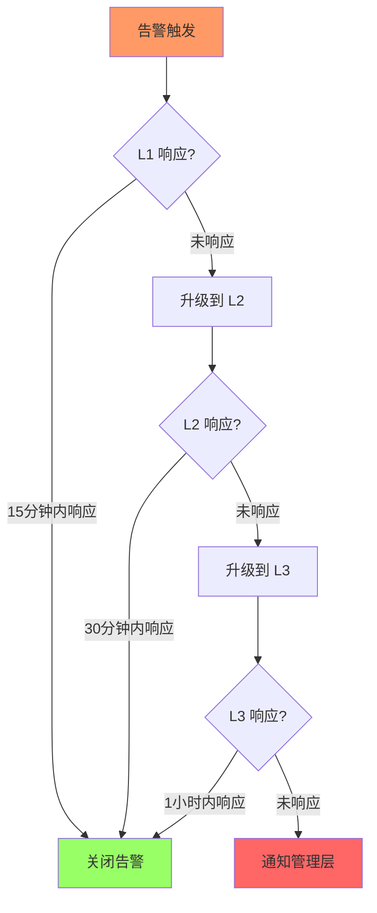

# 通知规则说明文档

> **文档版本**: v1.0 | **更新日期**: 2026-04-04 | **状态**: Production

## 目录

1. [概述](#1-概述)
2. [通知优先级](#2-通知优先级)
3. [触发条件](#3-触发条件)
4. [渠道路由规则](#4-渠道路由规则)
5. [升级策略](#5-升级策略)
6. [消息模板](#6-消息模板)
7. [接收人管理](#7-接收人管理)
8. [配置示例](#8-配置示例)

---

## 1. 概述

本文档定义了通知系统的完整规则体系，包括：

- **优先级分级**: 根据事件重要性划分5个级别
- **触发条件**: 自动触发通知的各类事件
- **渠道路由**: 消息如何路由到不同的通知渠道
- **升级策略**: 未处理通知的自动升级机制
- **消息模板**: 预定义的消息格式

---

## 2. 通知优先级

### 2.1 优先级定义

| 优先级 | 级别 | 描述 | 响应要求 |
|--------|------|------|----------|
| **CRITICAL** | 1 | 关键告警 | 立即响应，所有渠道通知 |
| **HIGH** | 2 | 高优先级 | 15分钟内响应，主要渠道 |
| **MEDIUM** | 3 | 中优先级 | 1小时内响应，标准渠道 |
| **LOW** | 4 | 低优先级 | 当日处理，批量通知 |
| **INFO** | 5 | 信息提示 | 仅记录，不发送 |

### 2.2 优先级判定标准

```yaml
优先级判定:
  CRITICAL:
    - 生产环境服务完全不可用
    - 数据丢失或损坏
    - 安全事件（入侵、数据泄露）
    - 核心业务流程中断
    - P99 延迟 > 10s 持续 5 分钟
    
  HIGH:
    - 生产环境性能严重下降
    - 非核心服务不可用
    - 错误率 > 5%
    - 资源使用率 > 90%
    
  MEDIUM:
    - 开发/测试环境问题
    - 性能轻微下降
    - 非关键功能异常
    - 资源使用率 > 80%
    
  LOW:
    - 日常系统报告
    - 定期维护通知
    - 统计信息
    
  INFO:
    - 操作审计日志
    - 成功状态通知
    - 调试信息
```

---

## 3. 触发条件

### 3.1 自动触发事件

#### 3.1.1 监控告警

| 事件类型 | 触发条件 | 默认优先级 | 模板 |
|----------|----------|------------|------|
| CPU 使用率 | > 90% 持续 5min | HIGH | alert_warning |
| 内存使用率 | > 85% 持续 5min | HIGH | alert_warning |
| 磁盘使用率 | > 90% | MEDIUM | alert_warning |
| 服务宕机 | 健康检查失败 | CRITICAL | alert_critical |
| 错误率激增 | 5min 内错误率 > 5% | HIGH | alert_critical |
| P99 延迟 | > 2s 持续 3min | HIGH | alert_warning |
| 连接数 | > 80% 连接池 | MEDIUM | alert_warning |

#### 3.1.2 CI/CD 事件

| 事件类型 | 触发时机 | 默认优先级 | 模板 |
|----------|----------|------------|------|
| 部署开始 | 流水线启动 | INFO | deployment_started |
| 部署成功 | 流水线完成 | LOW | deployment_success |
| 部署失败 | 流水线失败 | HIGH | deployment_failure |
| 回滚完成 | 回滚操作结束 | MEDIUM | deployment_failure |

#### 3.1.3 安全事件

| 事件类型 | 触发条件 | 优先级 | 渠道 |
|----------|----------|--------|------|
| 异常登录 | 异地/非常规时间登录 | HIGH | slack, email |
| 权限变更 | 管理员权限修改 | HIGH | slack, email |
| 漏洞检测 | 高危漏洞发现 | CRITICAL | 全渠道 |
| 入侵检测 | IDS 告警 | CRITICAL | 全渠道 |

### 3.2 手动触发

```python
# 代码示例
from notification_service import NotificationService, Priority

service = NotificationService()

# 手动发送告警
await service.send(
    title="自定义告警",
    content="需要关注的事件",
    priority=Priority.HIGH,
    channels=[ChannelType.SLACK, ChannelType.EMAIL]
)
```

---

## 4. 渠道路由规则

### 4.1 优先级路由表

```
┌─────────────────────────────────────────────────────────────────┐
│                      优先级路由矩阵                              │
├──────────┬──────────────────────────────────────────────────────┤
│ 优先级    │ 默认渠道                                              │
├──────────┼──────────────────────────────────────────────────────┤
│ CRITICAL │ Slack + Email + 企业微信 + 钉钉 (全部渠道)            │
│ HIGH     │ Slack + Email + 企业微信                              │
│ MEDIUM   │ Slack + 企业微信                                      │
│ LOW      │ Email (批量)                                          │
│ INFO     │ 仅日志记录                                            │
└──────────┴──────────────────────────────────────────────────────┘
```

### 4.2 消息类型路由

```yaml
路由规则:
  deployment:
    成功:
      channels: ["slack", "dingtalk"]
      recipients: ["#deployments"]
    
    失败:
      channels: ["slack", "email", "dingtalk"]
      recipients: ["#deployments", "platform@company.com"]
      priority: HIGH

  alert:
    关键:
      channels: ["slack", "email", "wechat_work", "dingtalk"]
      priority: CRITICAL
      escalation: true
    
    警告:
      channels: ["slack", "wechat_work"]
      priority: HIGH
    
    提醒:
      channels: ["slack"]
      priority: MEDIUM

  report:
    日报:
      channels: ["email"]
      schedule: "0 9 * * *"
      recipients: ["team@company.com"]
    
    周报:
      channels: ["email"]
      schedule: "0 9 * * 1"
      recipients: ["team@company.com", "manager@company.com"]
```

### 4.3 时间窗口路由

```yaml
# 工作时间 vs 非工作时间
时间路由:
  work_hours:  # 工作日 9:00-19:00
    CRITICAL: ["slack", "email", "wechat_work"]
    HIGH: ["slack", "email"]
    
  after_hours:  # 非工作时间
    CRITICAL: ["slack", "wechat_work", "phone"]  # 增加电话通知
    HIGH: ["slack", "wechat_work"]
    
  weekend:
    CRITICAL: ["wechat_work", "phone"]
    HIGH: ["wechat_work"]
    MEDIUM: ["slack"]  # 降低优先级
```

---

## 5. 升级策略

### 5.1 升级流程



### 5.2 升级配置

```yaml
升级策略:
  enabled: true
  
  时间窗口:
    L1_to_L2: 15分钟    # L1 未响应，升级到 L2
    L2_to_L3: 30分钟    # L2 未响应，升级到 L3
    L3_to_manager: 60分钟  # L3 未响应，通知管理层
  
  升级渠道:
    L1:
      channels: ["slack"]
      recipients: ["oncall-l1"]
      
    L2:
      channels: ["slack", "email"]
      recipients: ["oncall-l2", "team-lead"]
      message: "[升级] L1 未响应，升级到 L2"
      
    L3:
      channels: ["slack", "email", "wechat_work", "dingtalk"]
      recipients: ["oncall-l3", "sre-manager"]
      message: "[升级] L2 未响应，升级到 L3"
      
    manager:
      channels: ["slack", "email", "wechat_work"]
      recipients: ["director"]
      message: "[紧急] 关键告警未处理超过1小时"
```

### 5.3 响应确认

```yaml
响应确认:
  # 响应方式
  methods:
    - slack_reaction: "✅"  # 在 Slack 消息添加反应
    - slack_thread_reply   # 在 Slack 线程回复
    - web_dashboard        # 在 Web 控制台确认
    - api_call            # API 调用
  
  # 自动关闭条件
  auto_resolve:
    - metric_recovered: true    # 指标恢复正常
    - duration: 30min           # 30分钟后自动关闭
```

---

## 6. 消息模板

### 6.1 模板变量

所有模板支持以下通用变量：

| 变量名 | 说明 | 示例 |
|--------|------|------|
| `{timestamp}` | 事件时间戳 | 2026-04-04 10:30:00 |
| `{service}` | 服务名称 | api-gateway |
| `{environment}` | 环境 | production |
| `{priority}` | 优先级 | CRITICAL |
| `{duration}` | 持续时间 | 5m 30s |

### 6.2 告警模板

#### 关键告警 (alert_critical)

```markdown
🚨 【关键告警】{service}

━━━━━━━━━━━━━━━━━━━━━━━━━━━━

**告警级别**: 🔴 {priority}
**服务**: {service}
**环境**: {environment}
**时间**: {timestamp}
**持续时间**: {duration}

**告警详情**:
```
{details}
```

**建议操作**:
1. 立即检查服务状态
2. 查看日志: {log_url}
3. 执行 Runbook: {runbook_url}

━━━━━━━━━━━━━━━━━━━━━━━━━━━━
⚠️ 请立即处理！未响应将在 15 分钟后升级。
```

#### 部署通知 (deployment_success)

```markdown
✅ 部署成功 - {project}

━━━━━━━━━━━━━━━━━━━━━━━━━━━━

**项目**: {project}
**版本**: `{version}`
**环境**: {environment}
**部署者**: {deployer}
**触发方式**: {trigger}
**耗时**: ⏱️ {duration}

**变更内容**:
{changelog}

**相关链接**:
- [查看部署]({deploy_url})
- [查看日志]({log_url})
- [监控仪表板]({dashboard_url})

━━━━━━━━━━━━━━━━━━━━━━━━━━━━
```

---

## 7. 接收人管理

### 7.1 团队配置

```yaml
团队配置:
  platform_team:
    name: "平台团队"
    slack: "#platform-team"
    email: "platform@company.com"
    oncall_rotation: "platform-oncall"
    members:
      - user: "alice"
        role: "lead"
      - user: "bob"
        role: "engineer"
  
  data_team:
    name: "数据团队"
    slack: "#data-team"
    email: "data@company.com"
    oncall_rotation: "data-oncall"
```

### 7.2 个人配置

```yaml
个人配置:
  alice:
    name: "Alice Wang"
    email: "alice@company.com"
    slack: "@alice"
    wechat: "alice_wechat_id"
    phone: "+86-138-xxxx-xxxx"
    timezone: "Asia/Shanghai"
    working_hours: "09:00-18:00"
    notification_preferences:
      CRITICAL: ["slack", "wechat", "sms"]
      HIGH: ["slack", "wechat"]
      MEDIUM: ["slack"]
      LOW: ["email"]
```

### 7.3 值班轮换

```yaml
值班轮换:
  platform-oncall:
    type: "weekly"  # weekly, daily
    members:
      - "alice"      # 本周值班
      - "bob"        # 下周值班
      - "charlie"    # 第三周
    backup: "david"   # 后备人员
    
  data-oncall:
    type: "weekly"
    members:
      - "eve"
      - "frank"
```

---

## 8. 配置示例

### 8.1 完整配置示例

```yaml
# config.yaml 完整示例

email:
  smtp_host: "smtp.gmail.com"
  smtp_port: 587
  smtp_user: "${EMAIL_USER}"
  smtp_password: "${EMAIL_PASSWORD}"

slack:
  webhook_url: "${SLACK_WEBHOOK_URL}"
  bot_token: "${SLACK_BOT_TOKEN}"
  default_channel: "#notifications"

webhooks:
  wechat_work:
    platform: "wechat_work"
    url: "${WECHAT_WEBHOOK_URL}"
    secret: "${WECHAT_SECRET}"

rules:
  priority_routing:
    critical:
      channels: ["slack", "email", "wechat_work"]
      immediate: true
      retry_count: 5
    high:
      channels: ["slack", "email"]
      retry_count: 3

  escalation:
    enabled: true
    time_windows:
      - 15
      - 60
    levels:
      L1:
        channels: ["slack"]
        recipients: ["oncall-l1"]
      L2:
        channels: ["slack", "email"]
        recipients: ["oncall-l2"]

recipients:
  teams:
    platform:
      slack: "#platform-team"
      email: ["platform@company.com"]
```

### 8.2 代码使用示例

```python
import asyncio
from notification_service import NotificationService, Priority, ChannelType

async def main():
    service = NotificationService()
    
    # 启动服务
    await service.start()
    
    # 发送关键告警
    await service.send(
        template_name="alert_critical",
        template_data={
            "service": "payment-service",
            "environment": "production",
            "details": "数据库连接池耗尽",
            "log_url": "https://logs.example.com/xxx"
        },
        priority=Priority.CRITICAL
    )
    
    # 发送部署通知
    await service.send(
        template_name="deployment_success",
        template_data={
            "project": "api-gateway",
            "version": "v2.5.1",
            "environment": "production",
            "deployer": "ci-cd",
            "duration": "3m 42s"
        },
        priority=Priority.LOW
    )
    
    # 停止服务
    await service.stop()

if __name__ == "__main__":
    asyncio.run(main())
```

---

## 附录

### A. 变更日志

| 版本 | 日期 | 变更内容 |
|------|------|----------|
| v1.0 | 2026-04-04 | 初始版本 |

### B. 相关文档

- [notification-service.py](notification-service.py) - 统一通知服务
- [slack-integration.py](slack-integration.py) - Slack 集成
- [email-notifier.py](email-notifier.py) - 邮件通知
- [webhook-handler.py](webhook-handler.py) - Webhook 处理
- [config.yaml](config.yaml) - 配置文件

### C. 术语表

| 术语 | 说明 |
|------|------|
| L1/L2/L3 | 一线/二线/三线支持 |
| Oncall | 值班人员 |
| Escalation | 升级策略 |
| Runbook | 运维操作手册 |
| P99 | 99分位延迟 |
