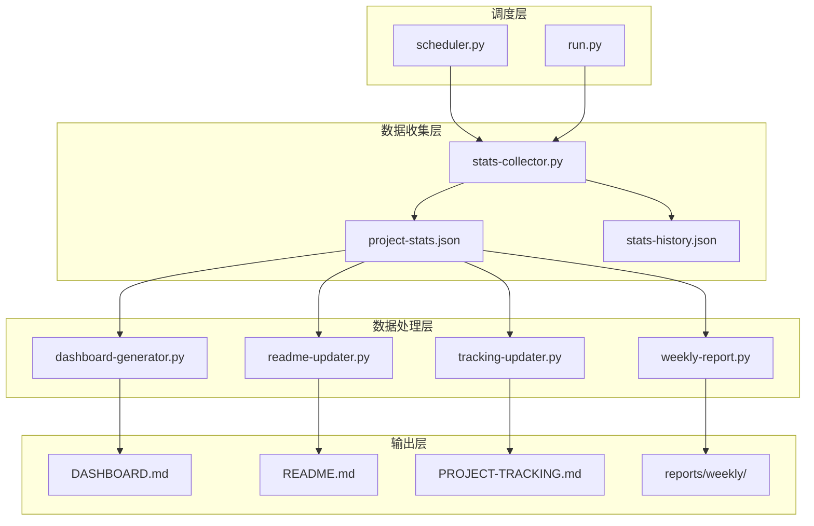

# 📊 AnalysisDataFlow 项目统计自动更新系统

> 自动化统计收集、仪表盘生成、文档更新的一站式解决方案

---

## 系统概览



---

## 文件结构

```
.scripts/stats-updater/
├── config.json              # 配置文件
├── requirements.txt         # Python依赖
├── README.md               # 本文档
├── run.py                  # 主运行脚本 ⭐
├── scheduler.py            # 定时任务调度器
│
├── stats-collector.py      # 统计收集器 ⭐
├── dashboard-generator.py  # 仪表盘生成器
├── readme-updater.py       # README更新器
├── tracking-updater.py     # PROJECT-TRACKING更新器
└── weekly-report.py        # 周报生成器
```

---

## 快速开始

### 1. 运行完整更新

```bash
cd .scripts/stats-updater
python run.py
```

### 2. 仅收集统计

```bash
python run.py --collect-only
```

### 3. 更新指定文档

```bash
python run.py --readme-only
python run.py --tracking-only
python run.py --dashboard-only
```

### 4. 生成周报

```bash
python run.py --weekly-only
```

### 5. 查看帮助

```bash
python run.py --help
python run.py --status
```

---

## 功能说明

### 📈 stats-collector.py

**功能**: 收集项目统计信息

**统计项**:
- 文档数量（按目录）
- 代码行数、字数
- 形式化元素（定理/定义/引理/命题/推论）
- 代码示例数量
- Mermaid图表数量

**输出**:
- `.stats/project-stats.json` - 当前统计
- `.stats/stats-history.json` - 历史记录

---

### 📊 dashboard-generator.py

**功能**: 生成统计仪表盘

**特性**:
- 概览卡片
- ASCII进度条
- Mermaid趋势图表
- 增长分析
- 对比矩阵
- 质量指标

**输出**: `DASHBOARD.md`

---

### 📝 readme-updater.py

**功能**: 自动更新README.md

**更新项**:
- 文档数量徽章
- 总计统计行
- 形式化元素表
- 内容规模表
- 进度部分
- 最后更新时间

**输出**: `README.md`

---

### 📋 tracking-updater.py

**功能**: 自动更新PROJECT-TRACKING.md

**更新项**:
- 头部信息
- 总体进度ASCII图
- 项目统计表
- 形式化指标表
- 目录进度
- 最后更新时间

**输出**: `PROJECT-TRACKING.md`

---

### 📅 weekly-report.py

**功能**: 生成项目周报

**内容**:
- 本周概览
- 新增内容统计
- 贡献者统计
- Git变更摘要
- 趋势分析
- 下周计划

**输出**: `reports/weekly/weekly-report-W{周数}-{日期}.md`

---

### 🚀 scheduler.py

**功能**: 定时任务调度器

**用法**:
```bash
python scheduler.py run          # 启动调度器
python scheduler.py daily        # 立即执行每日任务
python scheduler.py weekly       # 立即执行每周任务
python scheduler.py install      # 安装Windows任务计划
python scheduler.py uninstall    # 卸载Windows任务计划
python scheduler.py status       # 查看状态
```

**默认调度**:
- 每日 06:00 - 执行统计更新
- 每周日 23:00 - 生成周报

---

## 配置文件

`config.json`:

```json
{
  "version": "1.0.0",
  "project": {
    "name": "AnalysisDataFlow",
    "root_dir": "../..",
    "directories": {
      "struct": "Struct",
      "knowledge": "Knowledge",
      "flink": "Flink",
      "visuals": "visuals"
    }
  },
  "statistics": {
    "formal_elements": {
      "patterns": {
        "theorem": ["Thm-", "**定理**"],
        "definition": ["Def-", "**定义**"],
        "lemma": ["Lemma-", "**引理**"],
        "proposition": ["Prop-", "**命题**"],
        "corollary": ["Cor-", "**推论**"]
      }
    }
  },
  "schedule": {
    "daily_stats_time": "06:00",
    "weekly_report_day": "Sunday",
    "weekly_report_time": "23:00"
  },
  "git": {
    "enable_commit": false,
    "commit_message_template": "📊 自动更新项目统计 - {timestamp}"
  }
}
```

---

## 定时执行

### 方法1: 使用调度器（推荐）

```bash
# 前台运行
python scheduler.py run

# 安装Windows任务计划
python scheduler.py install
```

### 方法2: 使用Windows任务计划程序

1. 打开"任务计划程序"
2. 创建基本任务
3. 设置触发器（每日/每周）
4. 操作: 启动程序
   - 程序: `python`
   - 参数: `.scripts/stats-updater/run.py`

### 方法3: 使用GitHub Actions

创建 `.github/workflows/stats-update.yml`:

```yaml
name: Update Statistics

on:
  schedule:
    - cron: '0 6 * * *'  # 每天6点
  workflow_dispatch:

jobs:
  update-stats:
    runs-on: ubuntu-latest
    steps:
      - uses: actions/checkout@v3
      
      - name: Set up Python
        uses: actions/setup-python@v4
        with:
          python-version: '3.10'
      
      - name: Update statistics
        run: |
          cd .scripts/stats-updater
          python run.py --full
      
      - name: Commit changes
        run: |
          git config user.name "github-actions"
          git config user.email "actions@github.com"
          git add -A
          git diff --quiet && git diff --staged --quiet || git commit -m "📊 自动更新项目统计"
          git push
```

---

## 统计说明

### 形式化元素识别

系统自动识别以下格式的形式化元素:

| 类型 | 识别模式 |
|------|----------|
| 定理 | `Thm-S-01-01` 或 `**定理**` |
| 定义 | `Def-K-02-01` 或 `**定义**` |
| 引理 | `Lemma-S-01-01` 或 `**引理**` |
| 命题 | `Prop-K-03-01` 或 `**命题**` |
| 推论 | `Cor-S-02-01` 或 `**推论**` |

### 代码示例识别

识别以下语言的代码块:
`java`, `scala`, `python`, `go`, `rust`, `sql`, `yaml`, `json`, `xml`, `bash`

最少2行代码才被计为有效示例。

### Mermaid图表识别

识别所有 ````mermaid` 代码块。

---

## 日志

日志文件: `.stats/update.log`

```
[2026-04-04 10:00:00] [INFO] 🚀 启动完整统计更新流程
[2026-04-04 10:00:01] [INFO] 开始执行: 收集项目统计
[2026-04-04 10:00:05] [INFO] ✅ 完成: 收集项目统计
...
```

---

## 故障排查

### 问题1: 统计数字不准确

**原因**: 形式化元素格式不标准

**解决**: 检查文档中的定理/定义格式是否符合规范

### 问题2: Git提交失败

**原因**: Git配置问题或未安装Git

**解决**: 
```bash
git config --global user.name "Your Name"
git config --global user.email "your@email.com"
```

### 问题3: 定时任务不执行

**原因**: 计算机休眠或权限问题

**解决**: 
- 检查Windows任务计划程序权限
- 确保计算机在任务时间处于运行状态
- 使用`--status`检查调度器状态

---

## 开发指南

### 添加新的统计项

1. 修改 `stats-collector.py`:
   - 添加新的正则表达式模式
   - 在 `collect_all()` 中添加统计逻辑

2. 更新 `dashboard-generator.py`:
   - 添加新的可视化图表

3. 更新配置文件:
   - 在 `config.json` 中添加新配置项

### 自定义输出格式

修改各生成器的模板字符串，保持Markdown格式一致。

---

## 贡献

欢迎提交Issue和PR！

---

## 许可证

Apache License 2.0

---

*AnalysisDataFlow Project - 统计自动更新系统 v1.0.0*
