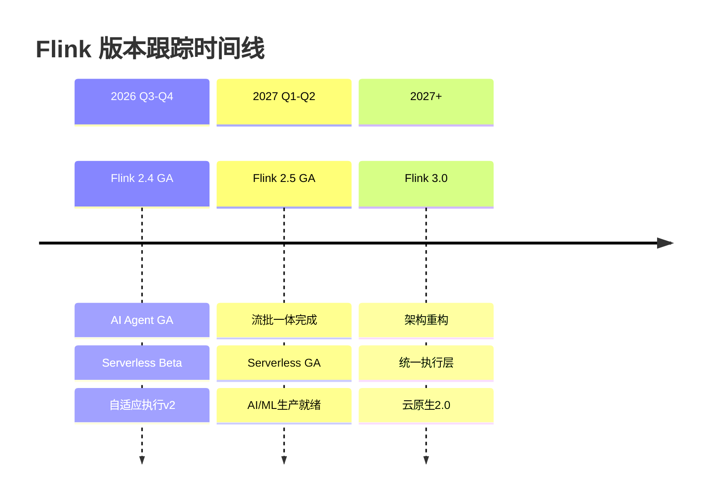

# Flink 版本发布跟踪系统 - 完整文档

> **系统版本**: v1.0 | **创建日期**: 2026-04-04 | **维护状态**: 运行中 | **最后更新**: 2026-04-15

## 系统架构概览

```
┌─────────────────────────────────────────────────────────────────────────────┐
│                     Flink 版本发布跟踪系统                                   │
├─────────────────────────────────────────────────────────────────────────────┤
│                                                                             │
│  ┌─────────────────────────────────────────────────────────────────────┐   │
│  │                    检测层 (Detection Layer)                          │   │
│  │  ┌──────────────┐  ┌──────────────┐  ┌──────────────┐              │   │
│  │  │ GitHub API   │  │ Maven Central│  │ Flink Website│              │   │
│  │  │ (Releases)   │  │ (Artifacts)  │  │ (Downloads)  │              │   │
│  │  └──────┬───────┘  └──────┬───────┘  └──────┬───────┘              │   │
│  │         └─────────────────┼─────────────────┘                      │   │
│  │                           ▼                                        │   │
│  │              ┌────────────────────────────┐                        │   │
│  │              │  flink-release-monitor.py  │                        │   │
│  │              └────────────┬───────────────┘                        │   │
│  └───────────────────────────┼────────────────────────────────────────┘   │
│                              │                                             │
│  ┌───────────────────────────▼────────────────────────────────────────┐   │
│  │                    处理层 (Processing Layer)                        │   │
│  │  ┌─────────────────────────────────────────────────────────────┐   │   │
│  │  │  GitHub Actions Workflow                                    │   │   │
│  │  │  ├── Schedule: 每6小时运行                                   │   │   │
│  │  │  ├── Detect new releases                                    │   │   │
│  │  │  ├── Update tracking document                               │   │   │
│  │  │  └── Create GitHub Issue / Send notifications               │   │   │
│  │  └─────────────────────────────────────────────────────────────┘   │   │
│  └────────────────────────────────────────────────────────────────────┘   │
│                              │                                             │
│  ┌───────────────────────────▼────────────────────────────────────────┐   │
│  │                    响应层 (Response Layer)                          │   │
│  │  ┌─────────────┐  ┌─────────────┐  ┌─────────────┐                │   │
│  │  │ 通知系统    │  │ 文档更新    │  │ 任务跟踪    │                │   │
│  │  │ (Slack/邮件)│  │ (批量脚本)  │  │ (GitHub)    │                │   │
│  │  └─────────────┘  └─────────────┘  └─────────────┘                │   │
│  └────────────────────────────────────────────────────────────────────┘   │
│                                                                             │
└─────────────────────────────────────────────────────────────────────────────┘
```

## 组件清单

### 1. 跟踪文档

| 文件 | 说明 |
|------|------|
| `.tasks/flink-release-tracker.md` | 主跟踪文档，包含版本状态、文档清单、历史记录 |
| `.tasks/FLINK-24-25-30-MASTER-TASK.md` | 详细任务分解清单 |
| `.tasks/FLINK-RELEASE-TRACKING-SYSTEM.md` | 本系统文档 |

### 2. 自动化脚本

| 脚本 | 路径 | 功能 |
|------|------|------|
| 主监控脚本 | `.scripts/flink-release-monitor.py` | 综合监控GitHub/Maven/官网 |
| FLIP跟踪 | `.scripts/flink-version-tracking/fetch-flip-status.py` | 获取FLIP状态 |
| 版本检查 | `.scripts/flink-version-tracking/check-new-releases.py` | 检查新版本发布 |
| 文档更新 | `.scripts/flink-version-tracking/update-version-docs.py` | 自动更新版本文档 |
| 批量更新 | `.scripts/flink-version-tracking/update-docs-on-release.py` | 版本发布后批量更新 |
| 通知发送 | `.scripts/flink-version-tracking/notify-changes.py` | 发送变更通知 |

### 3. GitHub Actions 工作流

| 工作流 | 路径 | 触发条件 | 功能 |
|--------|------|---------|------|
| 版本跟踪 | `.github/workflows/flink-release-tracker.yml` | 每6小时/手动 | 自动检测并响应新版本发布 |

### 4. 配置文件

| 配置 | 路径 | 说明 |
|------|------|------|
| 监控配置 | `.scripts/flink-monitor-config.json` | 主监控脚本配置 |
| 详细配置 | `.scripts/flink-version-tracking/config.json` | 版本跟踪脚本配置 |
| 依赖 | `.scripts/flink-version-tracking/requirements.txt` | Python依赖 |

## 跟踪版本



### 版本状态说明

| 状态 | 图标 | 说明 |
|------|------|------|
| 前瞻/规划中 | 🔍 | 版本尚未发布，文档为预测性质 |
| RC可用 | 🔄 | Release Candidate已发布，等待GA |
| 已发布 | ✅ | 官方GA版本已发布 |
| 前瞻文档完成 | 📝 | 前瞻文档已创建 |
| 文档更新中 | 🔄 | 版本已发布，文档正在更新 |
| 文档已更新 | ✅ | 文档已更新为发布版本内容 |

## 使用说明

### 本地运行监控脚本

```bash
# 1. 运行主监控脚本
cd .scripts
python flink-release-monitor.py --verbose

# 2. 查看结果
cat flink-release-status.json | jq
```

### 本地运行详细版本跟踪

```bash
cd .scripts/flink-version-tracking

# 安装依赖
pip install -r requirements.txt

# 检查新版本
python check-new-releases.py --stable-only

# 获取FLIP状态
python fetch-flip-status.py --detailed

# 预览文档更新
python update-docs-on-release.py --version 2.4 --dry-run
```

### 手动触发 GitHub Actions

```bash
# 使用 GitHub CLI
gh workflow run flink-release-tracker.yml

# 带参数运行
gh workflow run flink-release-tracker.yml -f check_type=all -f notify=true
```

## 版本发布后的文档更新流程

### 自动化流程 (Day 1)

1. **检测**: GitHub Actions 每6小时自动检查
2. **通知**: 发现新版本时自动:
   - 创建 GitHub Issue (带 `release-tracking` 标签)
   - 发送 Slack 通知 (如配置了 Webhook)
   - 更新跟踪文档

### 手动更新流程 (Day 2-3)

```bash
# Step 1: 拉取最新代码
git pull

# Step 2: 预览变更
python .scripts/flink-version-tracking/update-docs-on-release.py \
  --version 2.4 \
  --ga-date 2026-10-15 \
  --dry-run

# Step 3: 执行更新
python .scripts/flink-version-tracking/update-docs-on-release.py \
  --version 2.4 \
  --ga-date 2026-10-15

# Step 4: 验证更新
# - 检查 Markdown 语法
# - 验证链接有效性
# - 检查形式化元素

# Step 5: 提交更改
git add -A
git commit -m "docs: 更新 Flink 2.4.0 发布后文档

- 更新版本状态标记: preview → released
- 更新代码示例版本标记
- 添加官方发布链接

Fixes #<issue-number>"
git push
```

## 文档更新检查清单

### 每个前瞻文档的必更新项

- [ ] **头部信息**
  - [ ] 版本状态: `status: preview` → `status: released`
  - [ ] 添加实际发布日期
  - [ ] 更新前瞻声明为发布声明

- [ ] **概念定义章节**
  - [ ] 验证定义与实际发布一致
  - [ ] 验证配置参数可用性
  - [ ] 验证API签名正确性

- [ ] **代码示例**
  - [ ] Maven依赖: 移除 "前瞻" 标记
  - [ ] 配置示例: 验证配置键有效性
  - [ ] 代码片段: 验证API可用性

- [ ] **其他**
  - [ ] 特性状态: 更新实现状态
  - [ ] 破坏性变更: 补充实际列表
  - [ ] 迁移指南: 验证步骤有效性

## 版本标记规范

### HTML 注释标记 (机器可读)

```markdown
<!-- 版本状态标记: status=preview, target=2026-Q3-Q4 -->
<!-- 版本状态标记: status=released, ga=2026-10-15 -->
<!-- 版本状态标记: status=vision, target=2027-Q1-Q2 -->
```

### Markdown 表格标记 (人类可读)

```markdown
| 属性 | 值 |
|------|-----|
| **文档状态** | 🔍 前瞻 (Preview) |
| **目标版本** | Flink 2.4.0 |
| **预计发布时间** | 2026 Q3-Q4 |
| **最后更新** | 2026-04-04 |
| **跟踪系统** | [.tasks/flink-release-tracker.md](../../.tasks/flink-release-tracker.md) |
```

### 代码示例标记

```java
// [Flink 2.4 前瞻] 该API为规划特性，可能变动 → 发布前
// [Flink 2.4] GA版本可用 → 发布后
```

```xml
<!-- [Flink 2.4 前瞻] 版本号尚未发布 → 发布前
<!-- [Flink 2.4] GA版本 → 发布后
<version>2.4.0</version>
```

## 通知配置

### Slack 通知

1. 创建 Slack App 并获取 Webhook URL
2. 在仓库 Settings → Secrets 中添加 `SLACK_WEBHOOK_URL`
3. 新发布检测时将自动发送通知

### 邮件通知

1. 在 `.scripts/flink-version-tracking/config.json` 中配置 SMTP
2. 在仓库 Secrets 中添加 `EMAIL_USERNAME` 和 `EMAIL_PASSWORD`

## 故障排除

### 常见问题

**Q: 脚本运行失败，提示缺少依赖**

```bash
pip install requests beautifulsoup4 packaging
```

**Q: GitHub Actions 运行失败**

- 检查 Secrets 配置是否正确
- 查看 Actions 日志获取详细错误

**Q: 批量更新脚本没有更新某些文件**

- 检查文件是否包含正确的版本标记
- 使用 `--dry-run` 查看哪些文件会被更新

### 调试模式

```bash
# 启用详细日志
python flink-release-monitor.py --verbose

# 测试单个文件更新
python update-docs-on-release.py \
  --version 2.4 \
  --files Flink/08-roadmap/flink-2.4-tracking.md \
  --dry-run
```

## 维护责任

| 任务 | 频率 | 责任人 |
|------|------|--------|
| 监控脚本运行状态 | 每日 | 自动化 |
| 验证检测结果准确性 | 每周 | 维护者 |
| 更新跟踪文档 | 按需 | 自动化/维护者 |
| 版本发布后文档更新 | 3天内 | 文档维护者 |
| 系统功能升级 | 每季度 | 维护者 |

## 扩展计划

- [ ] 支持更多通知渠道 (钉钉、企业微信)
- [ ] 集成 LLM 自动分析 Release Notes
- [ ] 自动生成迁移指南草稿
- [ ] 添加版本差异对比可视化

---

## FLIP 状态跟踪

| FLIP ID | 标题 | 状态 | 目标版本 | 备注 |
|---------|------|------|----------|------|
| FLIP-555 | Native S3 FileSystem | Accepted (正在实现) | 2.6 | S3 FileSystem 原生支持，进度约 15% |
| FLIP-564 | FROM_CHANGELOG/TO_CHANGELOG Built-in PTFs | 正在讨论 | 2.7 | 标题已修正，社区讨论中 |
| FLIP-566 | IMMUTABLE Columns Constraint | 正在讨论 | 2.7 | 列不可变性约束，进度约 5% |

### Flink 2.3 计划状态

- **状态**: 进行中 (Planning)
- **预计窗口**: 2026 年中
- **跟踪文档**: `Flink/00-meta/version-tracking/flink-23-status.md` (如存在)

---

*系统维护: AnalysisDataFlow 项目团队*
*最后更新: 2026-04-15*
