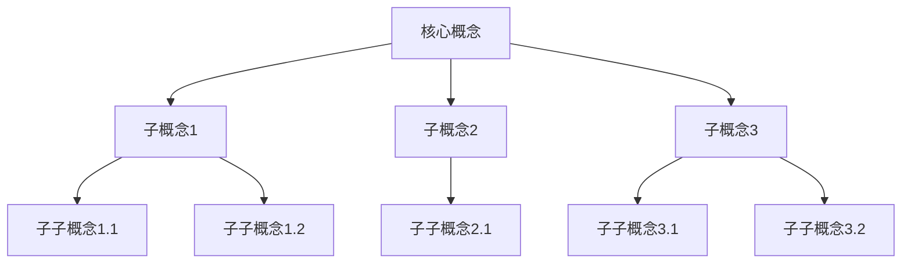
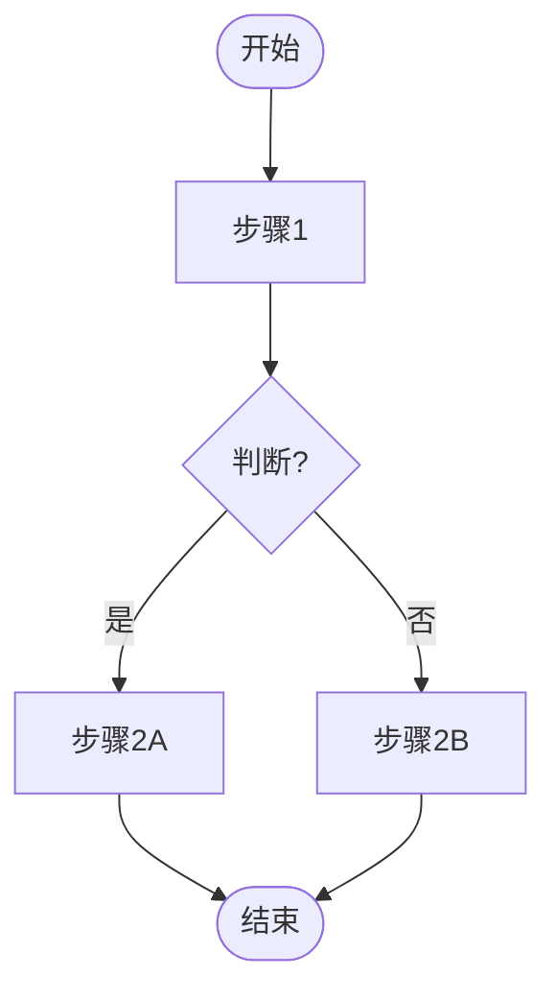
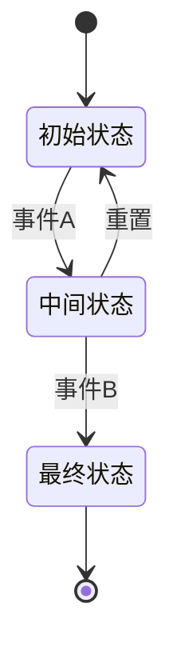

# 文档标题

> **所属阶段**: Struct | **前置依赖**: [前置文档链接] | **形式化等级**: L3

---

## 1. 概念定义 (Definitions)

本节提供核心概念的严格形式化定义。

### Def-S-01-01: 流处理系统定义

**定义**（直观描述）:

> 流处理系统是一个能够对无界数据流进行持续处理的计算系统。

**形式化描述**:
$$
\mathcal{S} = (\mathcal{I}, \mathcal{O}, \mathcal{F}, \mathcal{T})
$$

其中：

- $\mathcal{I}$: 输入数据流集合
- $\mathcal{O}$: 输出数据流集合
- $\mathcal{F}$: 处理函数集合
- $\mathcal{T}$: 时间模型

**解释**:

- 符号说明: $\mathcal{S}$ 表示流处理系统
- 约束条件: 输入输出数据流必须是连续无界的
- 边界情况: 系统启动和停止时的处理

### Def-S-01-02: 事件时间语义

**定义**:

> 事件时间语义是指以数据产生的时间戳作为处理依据的时间模型。

$$
\forall e \in \mathcal{E}: \tau_{event}(e) \leq \tau_{processing}(e)
$$

其中 $\mathcal{E}$ 是事件集合，$\tau_{event}$ 是事件发生时间，$\tau_{processing}$ 是处理时间。

---

## 2. 属性推导 (Properties)

从定义直接推导的引理与性质。

### Prop-S-01-01: 流处理系统的单调性

**命题**:

> 在事件时间语义下，流处理系统的输出随输入单调递增。

$$
\forall t_1, t_2 \in \mathcal{T}: t_1 < t_2 \Rightarrow \mathcal{O}(t_1) \subseteq \mathcal{O}(t_2)
$$

**证明概要**:

1. 根据定义 Def-S-01-01，输出是输入的函数
2. 根据定义 Def-S-01-02，事件时间单调递增
3. 因此输出随时间单调递增

### Lemma-S-01-01: 水印推进引理

**引理**:

> 水印的推进保证了事件时间的进展。

$$
W(t) = \min_{e \in \mathcal{E}_{pending}} \tau_{event}(e)
$$

其中 $W(t)$ 是时间 $t$ 时的水印值，$\mathcal{E}_{pending}$ 是待处理事件集合。

**证明**:

详细证明过程...

---

## 3. 关系建立 (Relations)

与其他概念、模型、系统的关联、映射、编码关系。

### 3.1 概念映射

| 本概念 | 相关概念 | 关系类型 | 说明 |
|--------|----------|----------|------|
| A | B | 等价/包含/扩展 | 关系描述 |

### 3.2 系统对比

与现有系统的对比分析：

- **系统X**: 对比点说明
- **系统Y**: 对比点说明

---

## 4. 论证过程 (Argumentation)

辅助定理、反例分析、边界讨论、构造性说明。

### 4.1 构造性说明

展示关键概念的构造过程：

1. 步骤一
2. 步骤二
3. 步骤三

### 4.2 边界情况分析

讨论边界条件和特殊情况：

- **情况A**: 分析...
- **情况B**: 分析...

### 4.3 反例

如果适用，提供反例说明：

> **反例**: ...

---

## 5. 形式证明 / 工程论证 (Proof / Engineering Argument)

主要定理的完整证明，或工程选型的严谨论证。

### Thm-S-01-01: 流处理一致性定理

**定理陈述**:

$$
\forall \mathcal{S} \in \text{StreamSystems}: \text{ExactlyOnce}(\mathcal{S}) \iff \text{Idempotent}(\mathcal{F}) \land \text{Durable}(\mathcal{I})
$$

**证明**:

```
证明步骤1: 假设系统满足Exactly-Once语义
证明步骤2: 由Def-S-01-01，处理函数必须幂等
证明步骤3: 输入必须持久化以保证可重放
...
结论: ∎
```

**工程论证**（如适用）:

如果选择此方案的原因分析：

1. 论证点1
2. 论证点2
3. 论证点3

---

## 6. 实例验证 (Examples)

简化实例、代码片段、配置示例、真实案例。

### 6.1 简化示例

**场景**: 描述示例场景

```
输入: ...
处理: ...
输出: ...
```

### 6.2 代码示例

```python
# Python代码示例
def example_function():
    """
    函数说明
    """
    # 实现细节
    pass
```

```java
// Java代码示例
public class Example {
    public void method() {
        // 实现细节
    }
}
```

### 6.3 配置示例

```yaml
# YAML配置示例
key: value
nested:
  subkey: subvalue
```

---

## 7. 可视化 (Visualizations)

至少一个 Mermaid 图（思维导图 / 层次图 / 执行树 / 对比矩阵 / 决策树 / 场景树）。

### 7.1 概念层次图



### 7.2 流程图（如适用）



### 7.3 状态图（如适用）



---

## 8. 引用参考 (References)

使用 `[^n]` 上标格式，在文档末尾集中列出引用。


---

## 附录：文档质量自检清单

在提交前，请确认以下检查项：

- [ ] 遵循六段式模板结构
- [ ] 包含至少3个形式化元素（Def/Thm/Lemma/Prop）
- [ ] 形式化元素编号符合规范（如 Def-S-01-01）
- [ ] 包含至少1个Mermaid图表
- [ ] 代码示例语法正确、可运行
- [ ] 引用使用 `[^n]` 格式
- [ ] 所有引用在文档末尾定义
- [ ] 文件名使用小写和连字符（如 `my-new-doc.md`）
- [ ] 文档头部信息完整（所属阶段、前置依赖、形式化等级）

---

*文档创建时间: YYYY-MM-DD*
*最后更新: YYYY-MM-DD*
*作者: [作者名]*
