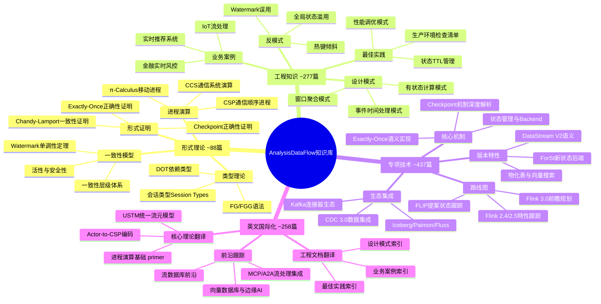
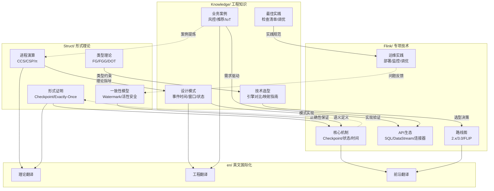
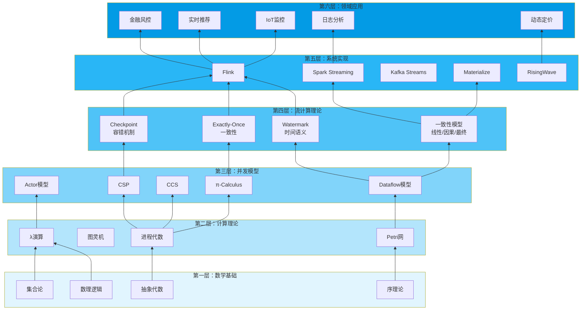
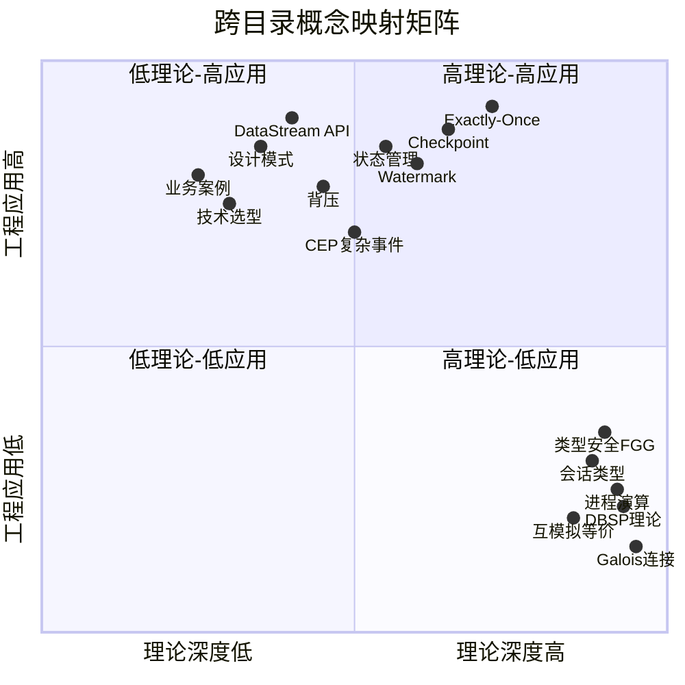
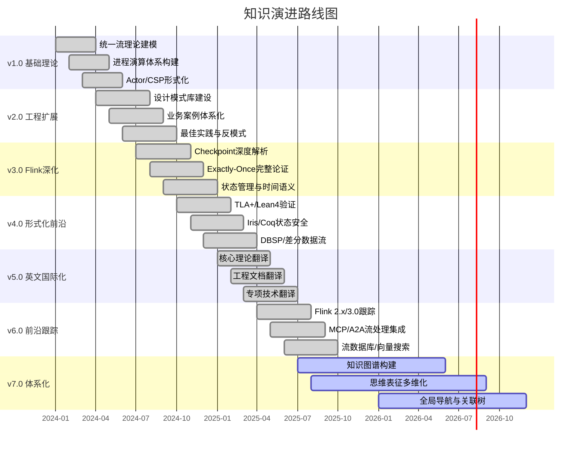

# 项目总体逻辑框架关联树 (Global Knowledge Graph)

> **所属阶段**: 全局导航 | **版本**: v1.0 | **更新日期**: 2026-04-24
> **说明**: 本文档以多种思维表征方式展示 AnalysisDataFlow 知识库的整体结构、核心概念关联与跨目录知识流动。

## 目录

- [项目总体逻辑框架关联树 (Global Knowledge Graph)](#项目总体逻辑框架关联树-global-knowledge-graph)
  - [目录](#目录)
  - [1. 项目总体架构思维导图](#1-项目总体架构思维导图)
  - [2. 四大目录关联树](#2-四大目录关联树)
  - [3. 核心理论-工程-技术推理树](#3-核心理论-工程-技术推理树)
  - [4. 跨目录概念映射矩阵](#4-跨目录概念映射矩阵)
  - [5. 知识演进路线图](#5-知识演进路线图)
  - [6. 快速导航索引](#6-快速导航索引)
    - [Struct/ 形式理论核心](#struct-形式理论核心)
    - [Knowledge/ 工程知识核心](#knowledge-工程知识核心)
    - [Flink/ 专项技术核心](#flink-专项技术核心)
    - [en/ 英文国际化核心](#en-英文国际化核心)
  - [附录：统计概览](#附录统计概览)

---

## 1. 项目总体架构思维导图

下图以放射状思维导图展示 AnalysisDataFlow 知识库的顶层架构，中心为项目本体，向外逐层展开四大目录及其核心子领域与代表性文档。

---

## 2. 四大目录关联树

下图展示 Struct、Knowledge、Flink、en 四大目录之间的知识流动关系。实线箭头表示从理论到工程再到技术的正向推导；虚线箭头表示工程实践反馈驱动理论修正的逆向循环；en 作为国际化层覆盖全部三大知识域。

---

## 3. 核心理论-工程-技术推理树

下图采用自底向上的层次结构（graph BT），展示从数学基础到工业应用的完整知识推导链条。不同颜色区分六大层级，体现"理论奠基 → 模型抽象 → 系统设计 → 领域落地"的递进关系。

---

## 4. 跨目录概念映射矩阵

下图以象限图（quadrantChart）展示核心概念在"理论深度"（X轴，左低右高）与"工程应用"（Y轴，下低上高）两个维度的定位分布，直观呈现各概念从纯理论到工程实践的覆盖光谱。

---

## 5. 知识演进路线图

下图以甘特图形式展示 AnalysisDataFlow 项目从 v1.0 到 v7.0 的知识建设时间线，体现项目从基础理论到思维表征体系化的持续演进过程。

---

## 6. 快速导航索引

以下提供各目录核心文档的快速链接，便于读者按需深入特定知识域。

### Struct/ 形式理论核心

| 主题 | 核心文档 |
|------|----------|
| 统一流理论 | [Struct/01-foundation/01.01-unified-streaming-theory.md](./Struct/01-foundation/01.01-unified-streaming-theory.md) |
| 进程演算基础 | [Struct/01-foundation/01.02-process-calculus-primer.md](./Struct/01-foundation/01.02-process-calculus-primer.md) |
| Actor模型形式化 | [Struct/01-foundation/01.03-actor-model-formalization.md](./Struct/01-foundation/01.03-actor-model-formalization.md) |
| CSP形式化 | [Struct/01-foundation/01.05-csp-formalization.md](./Struct/01-foundation/01.05-csp-formalization.md) |
| Dataflow模型形式化 | [Struct/01-foundation/01.04-dataflow-model-formalization.md](./Struct/01-foundation/01.04-dataflow-model-formalization.md) |
| 跨模型映射 | [Struct/03-relationships/03.05-cross-model-mappings.md](./Struct/03-relationships/03.05-cross-model-mappings.md) |
| Checkpoint正确性证明 | [Struct/04-proofs/04.01-flink-checkpoint-correctness.md](./Struct/04-proofs/04.01-flink-checkpoint-correctness.md) |
| Exactly-Once正确性证明 | [Struct/04-proofs/04.02-flink-exactly-once-correctness.md](./Struct/04-proofs/04.02-flink-exactly-once-correctness.md) |
| 一致性层级 | [Struct/02-properties/02.02-consistency-hierarchy.md](./Struct/02-properties/02.02-consistency-hierarchy.md) |
| 形式理论总索引 | [Struct/00-INDEX.md](./Struct/00-INDEX.md) |

### Knowledge/ 工程知识核心

| 主题 | 核心文档 |
|------|----------|
| 设计模式索引 | [Knowledge/02-design-patterns/](./Knowledge/02-design-patterns/) |
| 事件时间处理模式 | [Knowledge/02-design-patterns/pattern-event-time-processing.md](./Knowledge/02-design-patterns/pattern-event-time-processing.md) |
| 窗口聚合模式 | [Knowledge/02-design-patterns/pattern-windowed-aggregation.md](./Knowledge/02-design-patterns/pattern-windowed-aggregation.md) |
| 有状态计算模式 | [Knowledge/02-design-patterns/pattern-stateful-computation.md](./Knowledge/02-design-patterns/pattern-stateful-computation.md) |
| 业务案例索引 | [Knowledge/03-business-patterns/](./Knowledge/03-business-patterns/) |
| 金融实时风控 | [Knowledge/03-business-patterns/fintech-realtime-risk-control.md](./Knowledge/03-business-patterns/fintech-realtime-risk-control.md) |
| 实时推荐系统 | [Knowledge/03-business-patterns/real-time-recommendation.md](./Knowledge/03-business-patterns/real-time-recommendation.md) |
| IoT流处理 | [Knowledge/03-business-patterns/iot-stream-processing.md](./Knowledge/03-business-patterns/iot-stream-processing.md) |
| 最佳实践索引 | [Knowledge/07-best-practices/](./Knowledge/07-best-practices/) |
| 生产检查清单 | [Knowledge/07-best-practices/07.01-flink-production-checklist.md](./Knowledge/07-best-practices/07.01-flink-production-checklist.md) |
| 性能调优模式 | [Knowledge/07-best-practices/07.02-performance-tuning-patterns.md](./Knowledge/07-best-practices/07.02-performance-tuning-patterns.md) |
| 工程知识总索引 | [Knowledge/00-INDEX.md](./Knowledge/00-INDEX.md) |

### Flink/ 专项技术核心

| 主题 | 核心文档 |
|------|----------|
| Checkpoint机制 | [Flink/02-core/checkpoint-mechanism-deep-dive.md](./Flink/02-core/checkpoint-mechanism-deep-dive.md) |
| Exactly-Once语义 | [Flink/02-core/exactly-once-semantics-deep-dive.md](./Flink/02-core/exactly-once-semantics-deep-dive.md) |
| 端到端Exactly-Once | [Flink/02-core/exactly-once-end-to-end.md](./Flink/02-core/exactly-once-end-to-end.md) |
| 状态管理完整指南 | [Flink/02-core/flink-state-management-complete-guide.md](./Flink/02-core/flink-state-management-complete-guide.md) |
| 背压与流量控制 | [Flink/02-core/backpressure-and-flow-control.md](./Flink/02-core/backpressure-and-flow-control.md) |
| 时间语义与Watermark | [Flink/02-core/time-semantics-and-watermark.md](./Flink/02-core/time-semantics-and-watermark.md) |
| 连接器生态 | [Flink/05-ecosystem/05.01-connectors/flink-connectors-ecosystem-complete-guide.md](./Flink/05-ecosystem/05.01-connectors/flink-connectors-ecosystem-complete-guide.md) |
| Kafka集成 | [Flink/05-ecosystem/05.01-connectors/kafka-integration-patterns.md](./Flink/05-ecosystem/05.01-connectors/kafka-integration-patterns.md) |
| Flink总索引 | [Flink/00-meta/00-INDEX.md](./Flink/00-meta/00-INDEX.md) |

### en/ 英文国际化核心

| 主题 | 核心文档 |
|------|----------|
| 英文文档总索引 | [en/00-INDEX.md](./en/00-INDEX.md) |
| USTM统一流理论 | [en/struct-unified-streaming-theory.md](./en/struct-unified-streaming-theory.md) |
| 进程演算基础 | [en/process-calculus-primer.md](./en/process-calculus-primer.md) |
| Checkpoint正确性证明 | [en/flink-checkpoint-correctness-proof.md](./en/flink-checkpoint-correctness-proof.md) |
| Exactly-Once正确性证明 | [en/flink-exactly-once-correctness-proof.md](./en/flink-exactly-once-correctness-proof.md) |
| 设计模式-实时特征工程 | [en/pattern-realtime-feature-engineering.md](./en/pattern-realtime-feature-engineering.md) |
| 金融实时风控 | [en/fintech-realtime-risk-control.md](./en/fintech-realtime-risk-control.md) |
| Flink生产检查清单 | [en/flink-production-checklist.md](./en/flink-production-checklist.md) |

---

## 附录：统计概览

| 指标 | 数量 | 说明 |
|------|------|------|
| 总文档数 | 1,545+ | 四大目录合计 |
| 形式化元素 | 7,750+ | Thm/Def/Lemma/Prop/Cor |
| Mermaid图表 | 5,020+ | 跨文档可视化 |
| 交叉引用 | 26,650+ | 内部链接网络 |
| 英文文档 | 258 | 国际化覆盖 |

---

*Document version: v1.0 | 创建日期: 2026-04-24*
