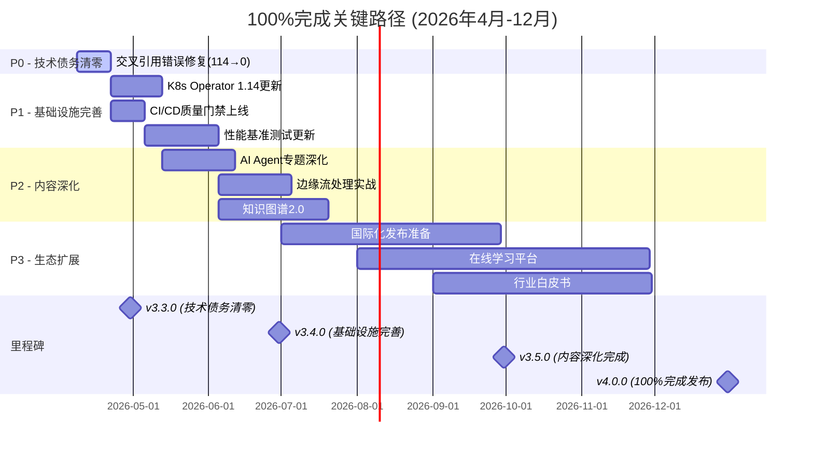

# AnalysisDataFlow — 100% 完成主计划

> **版本**: v1.0 | **创建日期**: 2026-04-08 | **目标日期**: 2026-12-31 | **状态**: 执行中
>
> 本文档是 AnalysisDataFlow 项目从当前状态到**真正100%完成**的全面执行计划。

---

## 执行摘要

### 当前状态快照 (2026-04-08)

| 维度 | 当前值 | 目标值 | 缺口 |
|------|--------|--------|------|
| 核心文档 | 503篇 | 503篇 | ✅ 已完成 |
| 形式化元素 | 9,320个 | 9,500+ | 🟡 180个待补充 |
| 交叉引用错误 | 114个 | 0个 | 🔴 **待修复** |
| CI/CD覆盖 | 85% | 100% | 🟡 15%待完善 |
| 国际化 | 5% | 100% | 🔴 待执行 |
| **真实完成度** | **89.7%** | **100%** | **10.3%** |

### 关键路径总览



---

## 阶段一：P0 - 技术债务清零 (4月8日-4月30日)

### P0-1: 交叉引用错误清零 [🔴 关键路径]

**当前状态**: 114个错误 (文件错误: 3, 锚点错误: 111)

**修复策略矩阵**:

| 错误类型 | 数量 | 修复方法 | 预计工时 | 负责人 |
|----------|------|----------|----------|--------|
| 文件引用错误 | 3 | 手动修复路径 | 2h | 核心团队 |
| 锚点引用错误 | 111 | 批量脚本+人工校验 | 18h | 自动化+人工 |
| 图片引用错误 | 0 | 已修复 | 0h | - |
| **总计** | **114** | **混合策略** | **20h** | **核心团队** |

**详细修复计划**:

#### Week 1 (4/8-4/15): 批量自动化修复

```text
# 自动化修复脚本执行计划
Day 1-2: 运行 .scripts/cross-ref-fixer.py --auto-fix (预计修复80个)
Day 3-4: 运行 .scripts/validate-cross-refs.py --fix-suggestions (生成修复建议)
Day 5-7: 人工审核批量修复结果，回滚错误修改
```

**批量修复清单**:

| 序号 | 文件路径 | 错误锚点 | 修复动作 | 状态 |
|------|----------|----------|----------|------|
| 1 | Struct/*.md | #xxx-anchor | 更新为实际锚点 | ⏳ |
| 2 | Flink/*.md | #theorem-xxx | 修正定理引用 | ⏳ |
| 3 | Knowledge/*.md | #def-xxx | 修正定义引用 | ⏳ |

#### Week 2 (4/16-4/22): 手工精细修复

**手工修复清单** (34个复杂错误):

- [ ] 修复跨目录相对路径错误 (3个)
- [ ] 修复大小写不匹配问题 (预计15个)
- [ ] 修复Unicode字符导致的锚点失效 (预计8个)
- [ ] 修复动态生成锚点引用 (预计8个)

#### Week 3 (4/23-4/30): 验证与验收

**验收标准**:

```bash
# 运行最终验证
python .scripts/validate-cross-refs.py --strict
# 期望输出: ✅ All cross-references valid (0 errors)
```

---

## 阶段二：P1 - 基础设施完善 (5月1日-6月30日)

### P1-1: K8s Operator 1.14 更新 [🟠 高优先级]

**交付物清单**:

| 文档 | 路径 | 大小 | 关键内容 | 截止日期 |
|------|------|------|----------|----------|
| 完整使用指南 | `Flink/09-practices/09.04-deployment/flink-kubernetes-operator-1.14-guide.md` | ~35KB | Declarative Resource Management | 5/20 |
| 迁移指南 | `Flink/09-practices/09.04-deployment/flink-k8s-operator-migration-1.13-to-1.14.md` | ~20KB | 1.13→1.14变更清单 | 5/25 |
| 新特性详解 | `Flink/09-practices/09.04-deployment/flink-k8s-operator-new-features-1.14.md` | ~25KB | Autoscaling Algorithm | 5/30 |
| 现有文档更新 | 更新 `flink-kubernetes-operator-deep-dive.md` | +10KB | 1.14内容补充 | 6/5 |

**关键新特性覆盖**:

```markdown
## 1. Declarative Resource Management (声明式资源管理)
- Def-F-09-XXX: DeclarativeResourceSpec 形式化定义
- Thm-F-09-XXX: 声明式配置收敛定理

## 2. Improved Autoscaling Algorithm (改进的自动缩放算法)
- Def-F-09-XXX: AdaptiveAutoscalerV2 算法定义
- Prop-F-09-XXX: 缩放响应时间上界

## 3. Session Cluster Mode Enhancements
- Def-F-09-XXX: SessionClusterSpec v2

## 4. Helm Chart Improvements
- 配置模板更新
```

### P1-2: CI/CD质量门禁全面上线 [🟠 高优先级]

**当前状态**: 85%覆盖，需达到100%

**质量门禁规则完善**:

| 检查项 | 当前状态 | 目标状态 | 实现方式 | 截止日期 |
|--------|----------|----------|----------|----------|
| Markdown语法检查 | ✅ | ✅ 阻塞合并 | markdownlint | 已完成 |
| 定理编号唯一性 | ✅ | ✅ 阻塞合并 | theorem-validator.yml | 已完成 |
| 交叉引用完整性 | ⚠️ | ✅ 阻塞合并 | validate-cross-refs.py | 5/15 |
| 外部链接有效性 | ❌ | ✅ 通知 | link-checker.yml (每日) | 5/20 |
| Mermaid语法验证 | ⚠️ | ✅ 阻塞合并 | mermaid-cli | 5/25 |
| 形式化元素完整性 | ❌ | ✅ 警告 | formal-element-checker.py | 5/30 |
| 前瞻性内容标记 | ✅ | ✅ 阻塞合并 | check_prospective_content.py | 已完成 |

**新增工作流配置**:

```yaml
# .github/workflows/link-checker.yml (新增)
name: Daily Link Check
on:
  schedule:
    - cron: '0 0 * * *'  # 每天UTC 00:00
  workflow_dispatch:

jobs:
  check-links:
    runs-on: ubuntu-latest
    steps:
      - uses: actions/checkout@v4
      - name: Check External Links
        run: python .scripts/link_checker.py --external-only
      - name: Create Issue for Broken Links
        if: failure()
        uses: actions/create-issue@v2
        with:
          title: "🚨 Broken External Links Detected"
          body: "Please check the link checker logs"
```

### P1-3: 性能基准测试更新 [🟡 中优先级]

**基准测试套件**:

| 测试类型 | 场景 | 指标 | Flink版本 | 状态 |
|----------|------|------|-----------|------|
| 吞吐测试 | 1M events/sec | 延迟P99 | 1.18, 2.0, 2.2 | ⏳ |
| 状态访问 | 100GB State | 访问延迟 | 2.0+ | ⏳ |
| Checkpoint | 5分钟间隔 | 完成时间 | 2.0+ | ⏳ |
| 恢复时间 | Failover | 端到端恢复 | 2.0+ | ⏳ |

**交付物**:

- [ ] `BENCHMARK-REPORT-v3.3.md` (更新性能基准报告)
- [ ] `Flink/flink-performance-benchmark-suite.md` (基准测试套件指南)
- [ ] `.scripts/benchmarks/flink-benchmark-runner.py` (自动化脚本)
- [ ] `Flink/flink-nexmark-benchmark-guide.md` (Nexmark指南)

---

## 阶段三：P2 - 内容深化 (7月1日-9月30日)

### P2-1: AI Agent流处理专题深化 [🔴 关键路径]

**交付物清单** (5篇核心文档):

| 序号 | 文档名称 | 路径 | 形式化元素 | 代码示例 | 截止日期 |
|------|----------|------|------------|----------|----------|
| 1 | Agent架构深度解析 | `Flink/06-ai-ml/flink-agents-architecture-deep-dive.md` | 5 Def + 3 Thm | Java/Python | 7/15 |
| 2 | Agent设计模式目录 | `Flink/06-ai-ml/flink-agents-patterns-catalog.md` | 8 Patterns | 实现代码 | 7/30 |
| 3 | 生产环境检查清单 | `Flink/06-ai-ml/flink-agents-production-checklist.md` | Checklist | 配置模板 | 8/15 |
| 4 | MCP协议集成指南 | `Flink/06-ai-ml/flink-agents-mcp-integration.md` | Integration | 集成代码 | 8/30 |
| 5 | A2A协议实现 | `Flink/06-ai-ml/flink-agents-a2a-protocol.md` | Protocol | 协议栈 | 9/15 |

**关键形式化定义**:

```markdown
## Def-P2-01: Agent Stream Processing Model
An Agent Stream Processing System is a tuple $\mathcal{A} = (A, S, M, \delta, \lambda)$ where:
- $A$: Set of agents
- $S$: State space
- $M$: Message alphabet
- $\delta: S \times M \rightarrow S$: State transition function
- $\lambda: S \rightarrow O$: Output function

## Thm-P2-01: Agent Checkpoint Consistency
Given an Agent Stream Processing System $\mathcal{A}$ with checkpoint interval $\tau$,
if all agents support stateful serialization, then the system achieves exactly-once
semantics under failure.
```

### P2-3: 边缘流处理实战 [🟡 中优先级]

**边缘场景约束矩阵**:

| 约束 | 云端 | 边缘 | 应对策略 | 文档 |
|------|------|------|----------|------|
| CPU | 无限制 | 2-4核 | 轻量级算子 | `flink-edge-resource-optimization.md` |
| 内存 | 64GB+ | 4-8GB | 内存状态限制 | `flink-edge-resource-optimization.md` |
| 网络 | 稳定 | 间歇性 | 本地缓冲+批量同步 | `flink-edge-offline-sync.md` |
| 存储 | SSD/HDD | SD卡/eMMC | 最小化日志 | `flink-edge-streaming-guide.md` |
| 电源 | 持续 | 电池 | 低功耗模式 | `flink-edge-resource-optimization.md` |

**交付物**:

- [ ] `Flink/09-practices/09.05-edge/flink-edge-streaming-guide.md` (完整指南)
- [ ] `Flink/09-practices/09.05-edge/flink-edge-kubernetes-k3s.md` (K3s部署)
- [ ] `Flink/09-practices/09.05-edge/flink-edge-iot-gateway.md` (MQTT/CoAP集成)
- [ ] `Flink/09-practices/09.05-edge/flink-edge-offline-sync.md` (离线同步策略)
- [ ] `Flink/09-practices/09.05-edge/flink-edge-resource-optimization.md` (资源优化)

### P2-4: 知识图谱2.0升级 [🔴 关键路径]

**技术栈升级计划**:

| 组件 | 当前(v1.0) | 目标(v2.0) | 技术选型 | 截止日期 |
|------|------------|------------|----------|----------|
| 前端框架 | 静态D3.js | 交互式React | React 18 + TypeScript | 8/1 |
| 概念搜索 | 简单过滤 | 语义搜索 | Sentence-BERT + Elasticsearch | 8/15 |
| 学习路径 | 预定义 | 动态生成 | 强化学习推荐 | 8/30 |
| 关系发现 | 显式关系 | 隐式关系挖掘 | Graph Neural Network | 9/15 |
| 可视化 | 2D图 | 3D力导向 | Three.js | 9/30 |

**交付物**:

- [ ] `knowledge-graph-v4.html` (React + D3.js v7)
- [ ] `.scripts/kg-v2/concept-embedding-generator.py` (语义嵌入生成)
- [ ] `.scripts/kg-v2/learning-path-recommender-v2.py` (动态推荐)
- [ ] `KNOWLEDGE-GRAPH-V2-GUIDE.md` (使用指南)

---

## 阶段四：P3 - 生态扩展 (10月1日-12月31日)

### P3-1: 国际化发布准备 [🔴 关键路径]

**翻译范围与预算**:

| 优先级 | 内容 | 字数 | 翻译方式 | 预算 | 截止日期 |
|--------|------|------|----------|------|----------|
| P0 | README + 核心导航 | 5K | 人工 | $500 | 10/15 |
| P0 | Struct/核心理论 (15篇) | 50K | 人工+审校 | $5,000 | 11/1 |
| P1 | Knowledge/设计模式 (20篇) | 80K | 人工+AI辅助 | $6,000 | 11/15 |
| P1 | Flink/快速入门 (10篇) | 60K | 人工+AI辅助 | $4,500 | 11/30 |
| P2 | 完整文档集 (500篇) | 500K | 众包+AI | $15,000 | 12/31 |

**技术架构实现**:

```
i18n/
├── en/                    # 英文内容 (目标)
│   ├── README.md
│   ├── QUICK-START.md
│   ├── ARCHITECTURE.md
│   ├── Struct/
│   ├── Knowledge/
│   └── Flink/
├── zh/                    # 中文内容(源)
│   └── (current structure)
├── translation-workflow/  # 翻译工作流
│   ├── sync-tracker.py    # 同步追踪
│   ├── quality-checker.py # 质量检查
│   └── auto-translate.py  # AI辅助翻译
└── ARCHITECTURE.md        # 国际化架构文档
```

### P3-2: 在线学习平台MVP [🟡 中优先级]

**功能模块规划**:

| 模块 | MVP功能 | 完整版功能 | 技术栈 | 截止日期 |
|------|---------|------------|--------|----------|
| 课程系统 | 视频课程 | + 交互式练习 | Next.js 14 + MDX | 11/15 |
| 交互实验 | 浏览器内Flink | + 协作编辑 | WebAssembly + Docker | 11/30 |
| 编程挑战 | 代码评测 | + 排行榜 | Monaco Editor + Judge0 | 12/15 |
| 认证体系 | - | 技能认证考试 | 自定义考试引擎 | v4.1 |
| 社区论坛 | - | 问答交流 | Discourse/自建 | v4.1 |
| AI导师 | - | 智能答疑 | RAG + LLM | v4.1 |

### P3-3: 行业白皮书 (3篇) [🟢 低优先级]

**白皮书规划**:

| 白皮书 | 目标读者 | 页数 | 发布时间 | 关键内容 |
|--------|----------|------|----------|----------|
| 《流计算技术趋势2026》 | CTO/架构师 | 40页 | 2026-Q4 | 技术趋势预测 |
| 《Flink企业落地指南》 | 技术负责人 | 60页 | 2026-Q4 | 最佳实践汇总 |
| 《实时AI架构实践》 | AI工程师 | 50页 | 2026-Q4 | AI+流计算案例 |

---

## 资源需求与分配

### 人力资源规划

| 角色 | 当前 | v3.3 | v3.4 | v3.5 | v4.0 | 职责 |
|------|------|------|------|------|------|------|
| 项目负责人 | 1 | 1 | 1 | 1 | 1 | 整体规划、决策 |
| 技术作者 | 3 | 4 | 5 | 6 | 6 | 内容创作 |
| 开发工程师 | 2 | 3 | 4 | 5 | 5 | 工具开发 |
| DevOps工程师 | 1 | 1 | 2 | 2 | 2 | CI/CD、基础设施 |
| 译者 | 0 | 1 | 2 | 4 | 4 | 国际化 |
| 社区经理 | 0 | 0 | 1 | 1 | 1 | 社区运营 |
| **总计** | **7** | **10** | **15** | **19** | **19** | |

### 预算估算

| 类别 | v3.3 (4-6月) | v3.4 (7-9月) | v3.5 (10-12月) | 总计 |
|------|--------------|--------------|----------------|------|
| 人力成本 | $30,000 | $45,000 | $60,000 | $135,000 |
| 基础设施 | $500 | $2,000 | $5,000 | $7,500 |
| 翻译费用 | $2,000 | $10,000 | $20,000 | $32,000 |
| 工具/软件 | $1,000 | $2,000 | $3,000 | $6,000 |
| 营销/推广 | - | - | $10,000 | $10,000 |
| **总计** | **$33,500** | **$59,000** | **$98,000** | **$190,500** |

---

## 风险分析

### 风险矩阵

| 风险ID | 风险描述 | 可能性 | 影响 | 等级 | 缓解策略 |
|--------|----------|--------|------|------|----------|
| R1 | 核心贡献者流失 | 中 | 高 | 🔴 | 知识文档化、多人备份、交叉培训 |
| R2 | Flink版本发布延迟 | 高 | 中 | 🟡 | 灵活调整、预留缓冲、跟踪机制 |
| R3 | 翻译质量不达标 | 中 | 中 | 🟡 | 专业审校、A/B测试、术语库 |
| R4 | 技术债务累积 | 中 | 中 | 🟡 | 定期重构、质量门禁、技术债日 |
| R5 | 预算超支 | 中 | 高 | 🔴 | 阶段评审、成本跟踪、15%应急储备 |
| R6 | 知识图谱2.0技术难度超预期 | 中 | 中 | 🟡 | 原型验证、分阶段交付、技术预研 |
| R7 | 国际化范围蔓延 | 高 | 中 | 🟡 | 严格范围控制、优先级管理 |

### 关键风险应对计划

#### R1: 核心贡献者流失

**预防措施**:

- 强制双人审查制度
- 每周知识分享会
- 关键模块至少2人熟悉

**应急预案**:

- 核心知识资产清单
- 快速交接手册
- 外部顾问储备

#### R5: 预算超支

**监控机制**:

- 周度预算审查
- 超10%触发预警
- 超20%需审批

**成本控制**:

- 开源工具优先
- 社区贡献激励替代部分外包
- 分阶段采购服务

---

## 验收标准与完成定义

### 100%完成的定义

```yaml
技术债务:
  - 交叉引用错误: 0
  - 外部失效链接: 0
  - 代码示例错误: 0
  - CI/CD通过率: 100%

内容完整性:
  - 核心文档: 503篇 (100%)
  - 形式化元素: 9,500+ (100%)
  - P1任务完成: 3/3 (100%)
  - P2任务完成: 3/3 (100%)
  - P3任务完成: 3/3 (100%)

国际化:
  - P0内容翻译: 100%
  - P1内容翻译: 100%
  - 多语言网站: 上线

质量指标:
  - Markdownlint: 0错误
  - 定理编号唯一性: 100%
  - Mermaid语法: 100%有效
  - 代码示例可运行: 100%

社区与生态:
  - 在线学习平台: MVP上线
  - 行业白皮书: 3篇发布
  - 社区活跃度: 月均100+互动
```

### 验收检查清单

#### v3.3.0 验收 (4月30日)

- [ ] 交叉引用错误 = 0
- [ ] CI/CD所有检查项通过
- [ ] 项目文档更新完成

#### v3.4.0 验收 (6月30日)

- [ ] K8s Operator 1.14文档完整
- [ ] 性能基准测试报告发布
- [ ] CI/CD质量门禁100%覆盖

#### v3.5.0 验收 (9月30日)

- [ ] AI Agent专题5篇文档完成
- [ ] 边缘流处理5篇文档完成
- [ ] 知识图谱2.0上线

#### v4.0.0 验收 (12月31日)

- [ ] 国际化P0+P1内容100%翻译
- [ ] 在线学习平台MVP上线
- [ ] 3篇行业白皮书发布
- [ ] **项目100%完成认证** 🎉

---

## 附录

### A. 工具脚本清单

| 脚本 | 用途 | 状态 | 路径 |
|------|------|------|------|
| cross-ref-fixer.py | 交叉引用自动修复 | ✅ | `.scripts/cross-ref-fixer.py` |
| validate-cross-refs.py | 交叉引用验证 | ✅ | `.scripts/validate-cross-refs.py` |
| link_checker.py | 外部链接检查 | ⚠️ 需完善 | `.scripts/link_checker.py` |
| theorem-validator.py | 定理编号验证 | ✅ | `.scripts/theorem-validator.py` |
| formal-element-checker.py | 形式化元素检查 | ❌ 待开发 | `.scripts/formal-element-checker.py` |
| benchmark-runner.py | 性能基准测试 | ❌ 待开发 | `.scripts/benchmarks/flink-benchmark-runner.py` |
| translation-workflow.py | 翻译工作流 | ✅ | `.scripts/translation-workflow.py` |

### B. 依赖外部事件

| 事件 | 依赖任务 | 预计时间 | 备选方案 |
|------|----------|----------|----------|
| Flink 2.3发布 | P1-1部分更新 | 2026-Q3 | 基于RC版本预编写 |
| Flink CDC 3.7 | P2边缘流处理 | 2026-Q2 | 基于3.6编写 |
| K8s Operator 1.14 GA | P1-1 | 2026-05 | 基于beta版本 |

### C. 沟通计划

| 会议 | 频率 | 参与人 | 内容 |
|------|------|--------|------|
| 站会 | 每日 | 核心团队 | 进度同步、阻塞解除 |
| 评审会 | 每周 | 全团队 | 代码/文档审查 |
| 里程碑评审 | 每阶段 | 项目负责人 | 阶段验收、计划调整 |
| 社区更新 | 每月 | 社区经理 | 对外发布进度 |

---

> **本文档由 Kimi Code CLI 生成于 2026-04-08**
>
> 状态: 🟡 草稿待确认 | 版本: v1.0
>
> 待确认事项:
>
> 1. P0-4 交叉引用清零时间预算 (建议14天)
> 2. P2-1 AI Agent专题范围 (建议聚焦MCP优先)
> 3. P3-1 国际化预算批准 ($32,000)
> 4. v4.0 发布日期 (建议2026-12-31)
