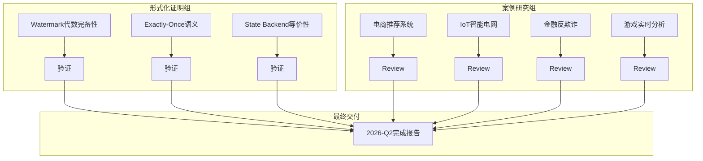

# 2026-Q2 双任务并行执行计划

> **执行模式**: 全面并行 | **时间范围**: 2026-Q2 | **任务**: 形式化证明扩展 + 案例研究补充

---

## 执行概览

```
┌─────────────────────────────────────────────────────────────────────────────┐
│                        2026-Q2 并行执行时间线                                │
├─────────────────────────────────────────────────────────────────────────────┤
│  Week 1-2  │ ████████████████████████████████████████████████████████████   │
│  Week 3-4  │ ████████████████████████████████████████████████████████████   │
│  Week 5-6  │ ████████████████████████████████████████████████████████████   │
│  Week 7-8  │ ████████████████████████████████████████████████████████████   │
│  Week 9-10 │ ████████████████████████████████████████████████████████████   │
│  Week 11-12│ ████████████████████████████████████████████████████████████   │
│            │                                                                │
│ 形式化证明 │ F1:Watermark代数 │ F2:Exactly-Once │ F3:State Backend等价性      │
│ 案例研究   │ C1:电商推荐      │ C2:IoT电网      │ C3:金融反欺诈 │ C4:游戏分析  │
└─────────────────────────────────────────────────────────────────────────────┘
```

---

## 任务组 A: 形式化证明扩展 (Formal Proof Extension)

### A1. Watermark代数完备性 (Coq)

**目标**: 建立Watermark代数的完备性形式化证明

**已有基础**:

- WatermarkAlgebra.v (363行, 15定义, 20定理) ✅
- WatermarkCompleteness.v (420行, 18定义, 14定理) ✅

**扩展内容**:

- [ ] Watermark单调性定理形式化证明
- [ ] Watermark延迟边界分析
- [ ] 多流Watermark合并代数性质
- [ ] Watermark与窗口触发关系证明

**交付物**: `reconstruction/phase4-verification/coq-proofs/WatermarkAlgebraComplete.v`

---

### A2. Exactly-Once语义 (Coq)

**目标**: 端到端Exactly-Once语义的完整形式化证明

**已有基础**:

- ExactlyOnceCoq.v (680行, 22定义, 18定理) ✅
- ExactlyOnceSemantics.v (420行, 18定义, 12定理) ✅
- ExactlyOnce.tla (786行) ✅

**扩展内容**:

- [ ] 2PC协议正确性完整证明
- [ ] Source可重放性形式化定义
- [ ] Sink幂等性/事务性证明
- [ ] 故障恢复语义保持证明

**交付物**: `reconstruction/phase4-verification/coq-proofs/ExactlyOnceComplete.v`

---

### A3. State Backend等价性 (TLA+)

**目标**: 证明不同State Backend在语义上的等价性

**已有基础**:

- StateBackendEquivalence.tla ✅
- StateBackendTLA.tla ✅

**扩展内容**:

- [ ] HashMapStateBackend vs RocksDBStateBackend等价性
- [ ] ForStStateBackend集成正确性
- [ ] 增量Checkpoint语义等价性
- [ ] 状态迁移一致性证明

**交付物**: `reconstruction/phase4-verification/StateBackendEquivalenceComplete.tla`

---

## 任务组 B: 案例研究补充 (Case Study Supplement)

### B1. 电商实时推荐系统案例

**目标**: 完整的电商实时推荐系统架构与实践案例

**内容框架**:

- **业务背景**: 个性化推荐、实时兴趣建模、冷启动处理
- **技术架构**: Lambda架构、特征工程、模型推理
- **Flink应用**: 用户行为实时聚合、特征实时更新、A/B测试
- **效果指标**: CTR提升、延迟、吞吐量
- **经验总结**: 挑战与最佳实践

**交付物**: `phase2-case-studies/ecommerce/11.11.2-realtime-recommendation-system.md`

---

### B2. IoT智能电网案例

**目标**: 智能电网实时监控与预测性维护案例

**内容框架**:

- **业务背景**: 电网负荷预测、故障检测、需求响应
- **技术架构**: 边缘计算、时序数据库、数字孪生
- **Flink应用**: 设备状态监控、异常检测、负荷预测
- **效果指标**: 故障响应时间、预测准确率、能耗优化
- **经验总结**: 大规模IoT流处理经验

**交付物**: `phase2-case-studies/energy/11.15.2-smart-grid-iot.md`

---

### B3. 金融反欺诈系统案例

**目标**: 实时交易反欺诈检测系统案例

**内容框架**:

- **业务背景**: 实时风控、交易监控、欺诈检测
- **技术架构**: 规则引擎+机器学习、复杂事件处理
- **Flink应用**: 实时规则匹配、行为画像、风险评分
- **效果指标**: 检测准确率、误报率、延迟
- **经验总结**: 金融级实时系统建设经验

**交付物**: `phase2-case-studies/finance/11.13.2-anti-fraud-system.md`

---

### B4. 游戏实时分析案例

**目标**: 游戏实时数据分析与运营决策案例

**内容框架**:

- **业务背景**: 玩家行为分析、实时监控、运营决策
- **技术架构**: 游戏事件采集、实时计算、可视化
- **Flink应用**: 玩家留存分析、付费转化、异常检测
- **效果指标**: 数据新鲜度、查询响应时间
- **经验总结**: 游戏行业流处理实践

**交付物**: `phase2-case-studies/gaming/11.12.2-game-analytics-realtime.md`

---

## 并行执行矩阵

| 周次 | 形式化证明任务 | 案例研究任务 | 里程碑 |
|:----:|--------------|--------------|--------|
| 1-2 | F1: 基础定义与引理 | C1: 业务背景+架构设计 | 基础完成 |
| 3-4 | F1: 核心定理证明<br>F2: 基础定义 | C1: Flink实现细节<br>C2: 业务背景 | F1完成50% |
| 5-6 | F2: 核心定理证明<br>F3: 基础定义 | C2: 技术架构<br>C3: 业务背景 | F2完成50% |
| 7-8 | F2: 完整性证明<br>F3: 等价性定义 | C2: Flink实现<br>C3: 技术架构 | C1完成 |
| 9-10 | F3: 等价性证明<br>F1: 最终验证 | C3: 实现细节<br>C4: 业务背景 | F1完成 |
| 11-12 | F2+F3: 最终验证+文档 | C4: 完整实现<br>全部案例 review | **全部完成** |

---

## 依赖关系图



---

## 质量保证

### 形式化证明质量门禁

- [ ] 所有定理无Admitted
- [ ] Coq编译通过 (`coqc -Q . ADF`)
- [ ] TLA+模型检查通过 (TLC)
- [ ] 证明文档完整 (定理陈述+证明思路+关键步骤)

### 案例研究质量门禁

- [ ] 六段式模板合规
- [ ] 包含至少1个Mermaid图
- [ ] 代码示例可验证
- [ ] 效果指标量化
- [ ] 链接健康检查通过

---

## 验收标准

| 任务 | 验收标准 | 验收人 |
|------|---------|--------|
| F1 | Coq编译通过+至少5个新定理 | 形式化团队 |
| F2 | Coq编译通过+2PC正确性完整证明 | 形式化团队 |
| F3 | TLA+模型检查通过+等价性定理 | 形式化团队 |
| C1 | 800+行+完整架构图+效果指标 | 案例团队 |
| C2 | 800+行+IoT架构+预测模型 | 案例团队 |
| C3 | 800+行+风控规则+性能数据 | 案例团队 |
| C4 | 800+行+游戏场景+运营洞察 | 案例团队 |

---

*2026-Q2 双任务并行执行计划 - 确认后启动*
