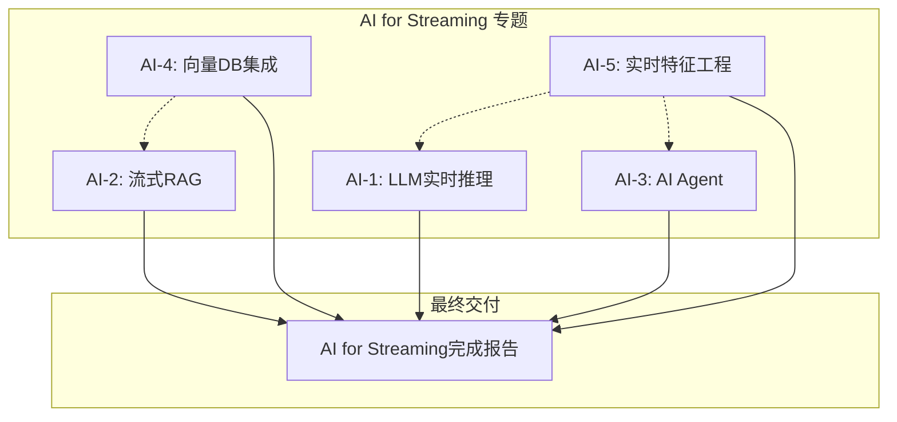

> **状态**: ✅ 已完成 | **风险等级**: 低 | **最后更新**: 2026-04-20
>
> 此计划已执行完毕，全部交付物已存在于 Flink/06-ai-ml/ 目录。
>
# 2026-Q3 AI for Streaming 专题执行计划

> **执行模式**: 全面并行 | **优先级**: P1 | **目标**: 100%完成
> **完成说明**: 5篇交付文档均已存在于 Flink/06-ai-ml/ 目录

---

## 执行概览

```
┌─────────────────────────────────────────────────────────────────────────────┐
│                    AI for Streaming 并行执行时间线                           │
├─────────────────────────────────────────────────────────────────────────────┤
│  Week 1-2  │ ████████████████████████████████████████████████████████████ │
│  Week 3-4  │ ████████████████████████████████████████████████████████████ │
│  Week 5-6  │ ████████████████████████████████████████████████████████████ │
│            │                                                              │
│  任务并行  │ AI-1:LLM推理 │ AI-2:流式RAG │ AI-3:AI Agent │ AI-4:向量DB   │
│            │ AI-5:特征工程 │                                              │
└─────────────────────────────────────────────────────────────────────────────┘
```

---

## 任务组: AI for Streaming 专题

### AI-1. LLM实时推理架构

**目标**: 建立LLM在流处理场景中的实时推理架构指南

**内容框架**:

1. **概念定义**: LLM推理延迟、批处理vs流式、模型并行
2. **架构模式**:
   - 同步调用模式 (Request-Response)
   - 异步队列模式 (Kafka + vLLM/TGI)
   - 流式生成模式 (SSE/WebSocket)
3. **Flink集成**:
   - AsyncFunction异步调用
   - 连接池管理
   - 背压处理
4. **性能优化**:
   - 动态批处理 (Dynamic Batching)
   - 模型缓存策略
   - 量化与蒸馏
5. **实战案例**: 实时客服机器人、流式内容生成

**交付物**: `Flink/06-ai-ml/llm-streaming-inference-architecture.md`

**形式化元素目标**: 8个定义, 5个定理

---

### AI-2. 流式RAG实现模式

**目标**: 实现流式场景下的RAG (Retrieval-Augmented Generation) 架构

**内容框架**:

1. **概念定义**: 流式RAG、实时检索、增量索引
2. **架构设计**:
   - 文档摄取流水线 (CDC → Embedding → VectorDB)
   - 实时检索服务 (向量相似度搜索)
   - 上下文组装与生成
3. **Flink实现**:
   - 文档分块与Embedding生成
   - 向量索引更新流
   - 检索-生成流水线
4. **一致性保证**:
   - 索引一致性模型
   - 延迟与新鲜度权衡
5. **实战案例**: 实时知识库问答、流式文档分析

**交付物**: `Flink/06-ai-ml/streaming-rag-implementation-patterns.md`

**形式化元素目标**: 10个定义, 6个定理

---

### AI-3. AI Agent流处理模式

**目标**: AI Agent在流处理中的设计模式与最佳实践

**内容框架**:

1. **概念定义**: Agent状态、工具调用、多Agent协作
2. **架构模式**:
   - 单Agent事件驱动
   - 多Agent流水线
   - Agent编排 (Orchestration)
3. **Flink集成**:
   - Agent状态管理 (KeyedProcessFunction)
   - 工具调用框架
   - 事件驱动决策流
4. **高级主题**:
   - Agent记忆管理
   - 长期状态持久化
   - 故障恢复与Exactly-Once
5. **实战案例**: 智能运维Agent、实时决策Agent

**交付物**: `Flink/06-ai-ml/ai-agent-streaming-patterns.md`

**形式化元素目标**: 12个定义, 8个定理

---

### AI-4. 向量数据库集成指南 (补充增强)

**目标**: 增强现有向量数据库集成文档，增加流式场景

**内容框架**:

1. **流式向量索引**:
   - 增量索引更新
   - 批量 vs 实时权衡
2. **多向量数据库对比**:
   - Milvus/Pinecone/Weaviate/Qdrant流式支持
3. **Flink Connector**:
   - 自定义Sink实现
   - 批量写入优化
4. **性能调优**:
   - 索引更新频率
   - 查询延迟优化

**交付物**: `Flink/06-ai-ml/vector-db-streaming-integration-guide.md`

**形式化元素目标**: 6个定义, 4个定理

---

### AI-5. 实时特征工程与Feature Store

**目标**: 流式ML的特征工程与Feature Store集成

**内容框架**:

1. **流式特征类型**:
   - 原始特征、聚合特征、派生特征
2. **特征计算**:
   - Window聚合 (Tumble/Session/Custom)
   - 状态ful特征 (状态机、序列)
3. **Feature Store集成**:
   - Feast/Tecton流式集成
   - 在线/离线特征一致性
4. **监控与治理**:
   - 特征漂移检测
   - 特征版本管理

**交付物**: `Flink/06-ai-ml/realtime-feature-engineering-guide.md`

**形式化元素目标**: 8个定义, 5个定理

---

## 并行执行矩阵

| 周次 | AI-1 | AI-2 | AI-3 | AI-4 | AI-5 | 里程碑 |
|:----:|:----:|:----:|:----:|:----:|:----:|:------:|
| 1 | 概念定义 | 概念定义 | 概念定义 | 架构调研 | 特征类型 | 基础完成 |
| 2 | 架构设计 | 架构设计 | 架构设计 | Connector | 特征计算 | - |
| 3 | Flink集成 | Flink实现 | Flink集成 | 性能调优 | Feature Store | 核心完成50% |
| 4 | 性能优化 | 一致性 | Agent状态 | 对比表格 | 监控治理 | - |
| 5 | 实战案例 | 实战案例 | 高级主题 | 实战案例 | 实战案例 | 核心完成100% |
| 6 | Review | Review | Review | Review | Review | **全部完成** |

---

## 依赖关系图



---

## 质量保证

### 文档质量门禁

- [ ] 六段式模板合规
- [ ] 至少2个Mermaid图
- [ ] 代码示例可验证
- [ ] 形式化元素完整编号
- [ ] 引用权威来源

### 形式化证明质量

- [ ] 定义严格性检查
- [ ] 定理逻辑一致性
- [ ] 与现有形式化元素兼容

---

## 验收标准

| 任务 | 行数要求 | 形式化元素 | Mermaid图 | 代码示例 |
|:----:|:--------:|:----------:|:---------:|:--------:|
| AI-1 | 800+ | 13个 | 3+ | 4+ |
| AI-2 | 800+ | 16个 | 3+ | 4+ |
| AI-3 | 900+ | 20个 | 4+ | 5+ |
| AI-4 | 600+ | 10个 | 2+ | 3+ |
| AI-5 | 700+ | 13个 | 2+ | 3+ |
| **总计** | **3800+** | **72个** | **14+** | **19+** |

---

## 里程碑

```
Week 1: 概念定义与架构设计完成
Week 3: Flink集成实现完成 (50%)
Week 5: 实战案例与高级主题完成 (100%)
Week 6: 质量审核与最终交付
```

---

*AI for Streaming 专题执行计划 - 确认后全面并行启动*
