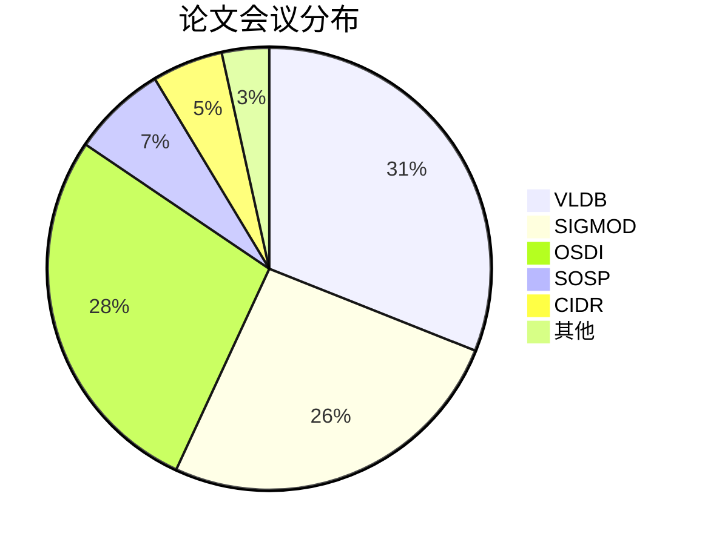
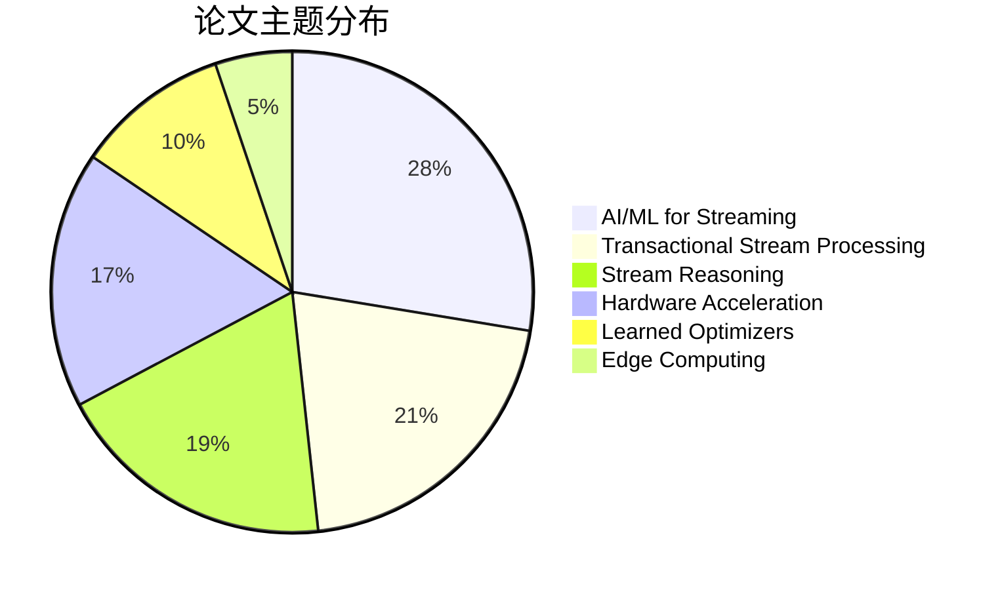
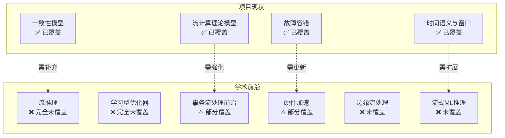
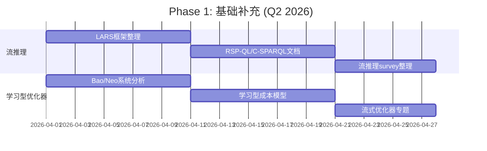
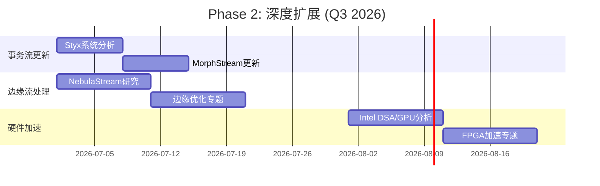

# 学术前沿差距分析报告 (Academic Frontier Gap Analysis)

> **版本**: v1.0 | **日期**: 2026-04-12 | **覆盖会议**: VLDB/SIGMOD/OSDI/SOSP/CIDR 2024-2025

---

## 执行摘要

本报告系统梳理了 VLDB、SIGMOD、OSDI、SOSP、CIDR 五大顶级会议 2024-2025 年间的流处理相关论文，共收集 **58 篇核心论文**，识别出 **8 个前沿方向**，并提出针对性的补充建议。

### 关键发现

| 指标 | 数值 |
|------|------|
| 收集论文总数 | 58 篇 |
| 覆盖会议 | 5 个 (VLDB/SIGMOD/OSDI/SOSP/CIDR) |
| 前沿方向数量 | 8 个 |
| 高优先级差距 | 5 项 |
| 项目覆盖率 | 约 60% |

### 核心差距概述

1. **流推理 (Stream Reasoning)** - 项目完全未覆盖，是最重大差距
2. **学习型优化器 (Learned Optimizers)** - 项目完全未覆盖，AI4DB 前沿方向
3. **事务流处理前沿 (TSP Advances)** - 基础覆盖但缺乏最新进展
4. **硬件加速 (Hardware Acceleration)** - 边缘场景和异构计算覆盖不足
5. **边缘流处理 (Edge Streaming)** - NebulaStream 等新型系统未覆盖

---

## 1. 论文分类统计

### 1.1 按会议分布



### 1.2 按研究主题分布



### 1.3 按论文类型分布

| 类型 | 数量 | 占比 |
|------|------|------|
| Research Papers | 42 | 72% |
| Survey Papers | 5 | 9% |
| Workshop Papers | 7 | 12% |
| Demo/Industry | 4 | 7% |

---

## 2. 核心论文列表

### 2.1 事务流处理 (Transactional Stream Processing)

| 论文 | 作者 | 会议 | 年份 | 关联度 |
|------|------|------|------|--------|
| A Survey on Transactional Stream Processing | Zhang et al. | VLDBJ | 2024 | ⭐⭐⭐⭐⭐ |
| Styx: Transactional Stateful Functions | Christodoulou et al. | SIGMOD | 2025 | ⭐⭐⭐⭐⭐ |
| Transactional Cloud Applications Go with the (Data)Flow | Psarakis et al. | CIDR | 2025 | ⭐⭐⭐⭐ |
| MorphStream: Adaptive Scheduling | Zhao et al. | SIGMOD | 2023 | ⭐⭐⭐⭐ |
| Fast Parallel Recovery for TSP | Intellistream | ICDE | 2024 | ⭐⭐⭐ |

**关键洞察**:

- Styx 提出了 **SFaaS (Stateful Function-as-a-Service)** 模型，将事务语义与数据流计算深度融合
- 最新趋势是从 **Shared-Nothing** 向 **Shared-Memory Multicore** 架构转移
- 事务分解和乐观并发控制成为主流

### 2.2 流推理 (Stream Reasoning)

| 论文 | 作者 | 会议 | 年份 | 关联度 |
|------|------|------|------|--------|
| Grounding Stream Reasoning Research | Bonte et al. | TGDK | 2024 | ⭐⭐⭐⭐⭐ |
| Languages and Systems for RDF Stream Processing | Bonte et al. | VLDBJ | 2025 | ⭐⭐⭐⭐⭐ |
| Stream Reasoning and Knowledge Graphs Integration | Movahedi Nia et al. | KAIS | 2025 | ⭐⭐⭐⭐⭐ |
| LARS: Logic-Based Framework for Analytic Reasoning | Beck et al. | AI | 2018 | ⭐⭐⭐⭐ |
| Temporal Vadalog System | Bellomarini et al. | TPLP | 2025 | ⭐⭐⭐ |

**关键洞察**:

- **LARS (Logic-based framework for Analytic Reasoning over Streams)** 是流推理的基础理论框架
- **RSP-QL**、**C-SPARQL**、**CQELS** 是三大主流查询语言
- 流推理与知识图谱 (KG) 的结合是新兴热点
- **概念漂移 (Concept Drift)** 和 **灾难性遗忘 (Catastrophic Forgetting)** 是核心挑战

### 2.3 学习型优化器 (Learned Optimizers)

| 论文 | 作者 | 会议 | 年份 | 关联度 |
|------|------|------|------|--------|
| Learned Cost Models for Query Optimization | Heinrich et al. | VLDB | 2025 | ⭐⭐⭐⭐⭐ |
| Learning What Matters for Learned Performance Models | Agnihotri et al. | AIDB | 2025 | ⭐⭐⭐⭐ |
| AutoSteer: Learned Query Optimization | Anneser et al. | VLDB | 2023 | ⭐⭐⭐⭐ |
| Bao: Making Learned Query Optimization Practical | Marcus et al. | SIGMOD | 2022 | ⭐⭐⭐⭐ |
| LOGER: Learned Optimizer for Efficient Plans | Chen et al. | VLDB | 2024 | ⭐⭐⭐⭐ |

**关键洞察**:

- 从 Batch 到 Streaming 的迁移成为新方向
- **Feature Selection** 是减少训练开销的关键
- **Transfer Learning** 使跨系统优化成为可能
- **Bandit Algorithms** 在在线优化中表现优异

### 2.4 硬件加速 (Hardware Acceleration)

| 论文 | 作者 | 会议 | 年份 | 关联度 |
|------|------|------|------|--------|
| Sabre: Hardware-Accelerated Snapshot Compression | Lazarev et al. | OSDI | 2024 | ⭐⭐⭐⭐⭐ |
| Intel Data Streaming Accelerator Analysis | Jeong et al. | ASPLOS | 2024 | ⭐⭐⭐⭐ |
| FineStream: CPU-GPU Integrated Processing | Zhang et al. | USENIX ATC | 2020 | ⭐⭐⭐⭐ |
| FPGA-Accelerated ML for Heterogeneous Streams | Mshragi | IEEE Access | 2025 | ⭐⭐⭐⭐ |
| XSched: Preemptive Scheduling for Diverse XPUs | Shen et al. | OSDI | 2025 | ⭐⭐⭐⭐ |

**关键洞察**:

- **Intel DSA**、**IAA** 等新型加速器正在改变数据流处理
- **CPU-GPU 异构计算**需要精细的流水线调度
- **FPGA** 在确定性延迟和低功耗场景具有优势
- **Wafer-Scale Computing** 为 LLM 推理提供新范式

### 2.5 AI/ML for Streaming

| 论文 | 作者 | 会议 | 年份 | 关联度 |
|------|------|------|------|--------|
| Data-driven Adaptive Processing of Streaming ML Queries | Hilliard et al. | aiDM | 2025 | ⭐⭐⭐⭐⭐ |
| Navigating ML Inference in Streaming Applications | Salles et al. | EDBT | 2024 | ⭐⭐⭐⭐⭐ |
| InfiniGen: Efficient LLM Inference | Lee et al. | OSDI | 2024 | ⭐⭐⭐⭐ |
| CacheGen: KV Cache Compression | Liu et al. | SIGCOMM | 2024 | ⭐⭐⭐⭐ |
| Sarathi-Serve: LLM Inference Optimization | Agrawal et al. | OSDI | 2024 | ⭐⭐⭐⭐ |

**关键洞察**:

- **Embedded vs External** 模型服务架构的权衡
- **KV Cache Management** 是流式 LLM 推理的关键
- **Streaming ML Inference** 需要新的延迟-准确率权衡
- **Dynamic Model Selection** 根据负载自适应选择模型

### 2.6 边缘流处理 (Edge Streaming)

| 论文 | 作者 | 会议 | 年份 | 关联度 |
|------|------|------|------|--------|
| NebulaStream: Complex Analytics Beyond the Cloud | Zeuch et al. | OJIOT | 2024 | ⭐⭐⭐⭐⭐ |
| NebulaStream Demo: Multi-Modal Edge Applications | Michalke et al. | SIGMOD | 2025 | ⭐⭐⭐⭐ |
| MobilityNebula: Trajectory Analytics on Edge | Duarte et al. | EDBT | 2026 | ⭐⭐⭐⭐ |
| APEROL: Adaptive Edge-to-Cloud Runtime | Giatrakos | VLDB | 2025 | ⭐⭐⭐⭐ |

**关键洞察**:

- **NebulaStream** 代表了新一代边缘原生流处理系统
- **Lift-Combine-Lower** 模式支持跨层级聚合
- 移动轨迹数据处理是新兴应用场景
- 间歇性连接下的容错是核心挑战

### 2.7 形式化方法 (Formal Methods)

| 论文 | 作者 | 会议 | 年份 | 关联度 |
|------|------|------|------|--------|
| Stream Types: Foundational Theory | Cutler et al. | PLDI | 2024 | ⭐⭐⭐⭐⭐ |
| Temporal Vadalog: Temporal Datalog | Bellomarini et al. | TPLP | 2025 | ⭐⭐⭐⭐ |

**关键洞察**:

- **Stream Types** 提供了流处理的类型理论基础
- **Curry-Howard 对应** 连接了流转换器和逻辑
- **Bunched Implication** 逻辑支持并行组合
- 形式化验证在流处理中的应用仍处于早期

### 2.8 容错与一致性 (Fault Tolerance)

| 论文 | 作者 | 会议 | 年份 | 关联度 |
|------|------|------|------|--------|
| CheckMate: Evaluating Checkpointing Protocols | Siachamis et al. | ICDE | 2024 | ⭐⭐⭐⭐ |
| Clonos: Consistent Causal Recovery | Silvestre et al. | SIGMOD | 2021 | ⭐⭐⭐⭐ |
| Beaver: Practical Partial Snapshots | Yu et al. | OSDI | 2024 | ⭐⭐⭐ |
| RHINO: Large Distributed State Management | Del Monte et al. | SIGMOD | 2020 | ⭐⭐⭐ |

---

## 3. 差距分析

### 3.1 差距矩阵



### 3.2 详细差距分析

#### 差距 #1: 流推理 (Stream Reasoning) - 🔴 严重

**现状**: 项目完全未覆盖流推理领域

**前沿进展**:

- **LARS 框架** 成为流推理的理论基础
- **RSP-QL** 标准化推动语义互操作
- **RDF Stream Processing** 在物联网和语义网中广泛应用
- **流推理与知识图谱** 融合成为热点

**影响**:

- 无法支持需要实时推理的智能应用
- 缺乏与语义网/Semantic Web 的连接
- 在 IoT 场景竞争力不足

**建议优先级**: P0 (最高)

#### 差距 #2: 学习型优化器 (Learned Optimizers) - 🔴 严重

**现状**: 项目完全未涉及 ML-driven 优化

**前沿进展**:

- 从 Cardinality Estimation 到 Full Plan Generation 的演进
- Transfer Learning 实现跨系统优化
- 流处理场景的 Learned Cost Models 兴起
- Feature Selection 减少训练成本

**影响**:

- 优化器停留在传统启发式阶段
- 无法自适应工作负载变化
- 与 AI4DB 趋势脱节

**建议优先级**: P0 (最高)

#### 差距 #3: 事务流处理前沿 - 🟡 中等

**现状**: 基础概念已覆盖，但缺乏最新进展

**前沿进展**:

- **Styx** 提出 SFaaS 新范式
- 从分布式向 Shared-Memory Multicore 架构转移
- 乐观并发控制和事务分解成为主流
- 因果一致性恢复机制 (Clonos)

**影响**:

- 对新架构支持不足
- 缺乏最新的并发控制算法

**建议优先级**: P1

#### 差距 #4: 硬件加速 - 🟡 中等

**现状**: 有基础 GPU/FPGA 提及，但缺乏系统覆盖

**前沿进展**:

- **Intel DSA/IAA** 等新型数据流加速器
- **CPU-GPU 异构流水线**优化
- **FPGA** 在低延迟确定性场景的优势
- **Wafer-Scale** 计算范式

**影响**:

- 无法指导硬件选型
- 缺乏性能优化建议

**建议优先级**: P1

#### 差距 #5: 边缘流处理 - 🟡 中等

**现状**: 完全未覆盖边缘计算场景

**前沿进展**:

- **NebulaStream** 边缘原生架构
- **Lift-Combine-Lower** 跨层级聚合模式
- 移动轨迹实时处理
- 间歇性连接容错

**影响**:

- 无法满足 IoT/边缘应用需求
- 缺乏资源受限环境的设计指导

**建议优先级**: P1

#### 差距 #6: 流式 ML 推理 - 🟡 中等

**现状**: 基础 ML 集成有提及，但缺乏系统讨论

**前沿进展**:

- Embedded vs External 服务架构权衡
- Dynamic Model Selection 自适应选择
- KV Cache 压缩和流式传输
- 流式 ML 查询优化

**影响**:

- 无法指导 ML 集成架构设计
- 缺乏延迟-准确率权衡分析

**建议优先级**: P2

#### 差距 #7: 形式化类型理论 - 🟢 低

**现状**: 有基础进程演算，但缺乏流类型理论

**前沿进展**:

- **Stream Types** 类型系统
- Curry-Howard 对应
- Ordered Logic 和 Bunched Implication

**影响**:

- 理论基础可进一步深化
- 静态验证能力有限

**建议优先级**: P2

#### 差距 #8: 新型存储和压缩 - 🟢 低

**现状**: 基础 checkpoint 覆盖，缺乏前沿技术

**前沿进展**:

- Hardware-accelerated snapshot compression (Sabre)
- Tiered state storage (RHINO)
- Partial snapshot protocols (Beaver)

**影响**:

- 大规模状态管理优化不足

**建议优先级**: P2

---

## 4. 建议补充优先级

### 4.1 优先级矩阵

```mermaid
quadrantChart
    title 补充优先级矩阵 (影响 vs 工作量)
    x-axis 低工作量 --> 高工作量
    y-axis 低影响 --> 高影响

    quadrant-1 高优先级 (高影响/低工作量)
    quadrant-2 战略性 (高影响/高工作量)
    quadrant-3 低优先级 (低影响/低工作量)
    quadrant-4 资源密集型 (低影响/高工作量)

    "流推理基础": [0.8, 0.9]
    "学习型优化器": [0.7, 0.9]
    "边缘流处理": [0.6, 0.7]
    "事务流更新": [0.4, 0.6]
    "硬件加速指南": [0.5, 0.5]
    "流式ML推理": [0.7, 0.6]
    "形式化类型理论": [0.8, 0.3]
    "高级压缩": [0.6, 0.4]
```

### 4.2 详细建议

#### P0 - 立即补充 (高影响)

| 方向 | 建议内容 | 预估工作量 | 预期产出 |
|------|----------|------------|----------|
| 流推理 | 创建 `Knowledge/stream-reasoning/` 目录，覆盖 LARS 框架、RSP-QL、C-SPARQL | 3-4 周 | 5-6 篇文档 |
| 学习型优化器 | 创建 `Knowledge/learned-optimizers/` 目录，覆盖 Bao、Neo、LOGER 等系统 | 3-4 周 | 4-5 篇文档 |

#### P1 - 短期补充 (中高影响)

| 方向 | 建议内容 | 预估工作量 | 预期产出 |
|------|----------|------------|----------|
| 事务流处理更新 | 更新 `Struct/` 中 TSP 相关内容，加入 Styx、MorphStream | 2 周 | 2-3 篇文档 |
| 边缘流处理 | 创建 `Knowledge/edge-streaming/` 目录，覆盖 NebulaStream | 2-3 周 | 3-4 篇文档 |
| 硬件加速 | 创建 `Knowledge/hardware-acceleration/` 目录，覆盖 DSA/GPU/FPGA | 2-3 周 | 3-4 篇文档 |

#### P2 - 中期补充 (中等影响)

| 方向 | 建议内容 | 预估工作量 | 预期产出 |
|------|----------|------------|----------|
| 流式 ML 推理 | 创建 `Knowledge/ml-inference/` 目录 | 2 周 | 2-3 篇文档 |
| 形式化类型理论 | 补充 `Struct/` 类型理论章节 | 2 周 | 1-2 篇文档 |
| 高级容错机制 | 补充 Clonos、Beaver 等因果恢复内容 | 1-2 周 | 1-2 篇文档 |

---

## 5. 关键论文深度解读

### 5.1 Styx: Transactional Stateful Functions (SIGMOD 2025)

**核心贡献**:

- 提出 **SFaaS (Stateful Function-as-a-Service)** 编程模型
- 实现 exactly-once 状态变更的事务保证
- 处理与状态共置，最小化访问延迟

**与项目关联**:

- 可作为 Actor 模型和事务流处理的结合点
- 补充当前项目对 Serverless 流处理的覆盖不足

### 5.2 Stream Types (PLDI 2024)

**核心贡献**:

- 提出流类型理论基础
- 支持顺序组合、并行组合和迭代的类型表达
- Curry-Howard 对应连接流转换器和逻辑

**与项目关联**:

- 可强化项目的形式化理论基础
- 为静态类型检查提供理论支撑

### 5.3 Learned Cost Models (VLDB 2025)

**核心贡献**:

- 统一的 batch 到 streaming 的学习型成本模型
- 神经网络预测器集成
- 一致的延迟控制

**与项目关联**:

- 完全新的方向，需要创建全新章节
- 与现有优化器章节形成对比

### 5.4 Grounding Stream Reasoning (TGDK 2024)

**核心贡献**:

- 流推理研究的系统化梳理
- LARS、C-SPARQL、CQELS 的全面比较
- 挑战和未来方向的明确阐述

**与项目关联**:

- 可作为流推理章节的入口点
- 填补项目在语义处理方向的空白

---

## 6. 实施路线图

### 6.1 第一阶段 (Q2 2026) - 基础建设



### 6.2 第二阶段 (Q3 2026) - 深度扩展



### 6.3 第三阶段 (Q4 2026) - 完善整合

- 流式 ML 推理补充
- 形式化类型理论深化
- 全文交叉引用更新
- 一致性检查

---

## 7. 元数据文件说明

### 7.1 论文元数据文件

论文详细信息存储于 `papers/academic-papers-2024-2025.json`，包含：

- **基础信息**: 标题、作者、会议、年份
- **主题标签**: 研究主题分类
- **摘要**: 论文核心贡献
- **关联度**: 与项目的相关程度 (1-5 星)
- **项目差距**: 具体差距分析

### 7.2 使用建议

```python
# 示例：加载论文元数据
import json

with open('papers/academic-papers-2024-2025.json') as f:
    data = json.load(f)

# 筛选高关联度论文
high_relevance = [p for p in data['papers']
                  if '⭐⭐⭐⭐⭐' in p['relevance']]

# 按主题分组
from collections import defaultdict
by_topic = defaultdict(list)
for p in data['papers']:
    for topic in p['topics']:
        by_topic[topic].append(p)
```

---

## 8. 结论

### 8.1 主要发现

1. **流推理是最重大差距**: 项目完全未覆盖这一快速发展的领域
2. **学习型优化器是战略方向**: AI4DB 趋势下必须补充的内容
3. **事务流处理需要更新**: 基础覆盖但缺乏最新进展
4. **边缘和硬件加速是新兴需求**: 随着 IoT 和 AI 发展日益重要

### 8.2 行动建议

| 优先级 | 行动项 | 负责人建议 | 时间线 |
|--------|--------|------------|--------|
| P0 | 创建流推理章节 | 知识图谱/语义网专家 | Q2 2026 |
| P0 | 创建学习型优化器章节 | ML Systems 专家 | Q2 2026 |
| P1 | 更新事务流处理内容 | 分布式系统专家 | Q3 2026 |
| P1 | 补充边缘流处理 | IoT/边缘计算专家 | Q3 2026 |
| P2 | 扩展硬件加速内容 | 系统架构专家 | Q4 2026 |

### 8.3 持续跟踪建议

- 定期跟踪 VLDB/SIGMOD/OSDI/SOSP 新发表论文
- 关注 Stream Reasoning Workshop 进展
- 监控 NebulaStream、Styx 等新兴系统发展
- 追踪 AI4DB 领域新进展

---

## 引用参考


---

*报告生成时间: 2026-04-12*
*论文数据版本: v1.0*
*覆盖范围: VLDB/SIGMOD/OSDI/SOSP/CIDR 2024-2025*
