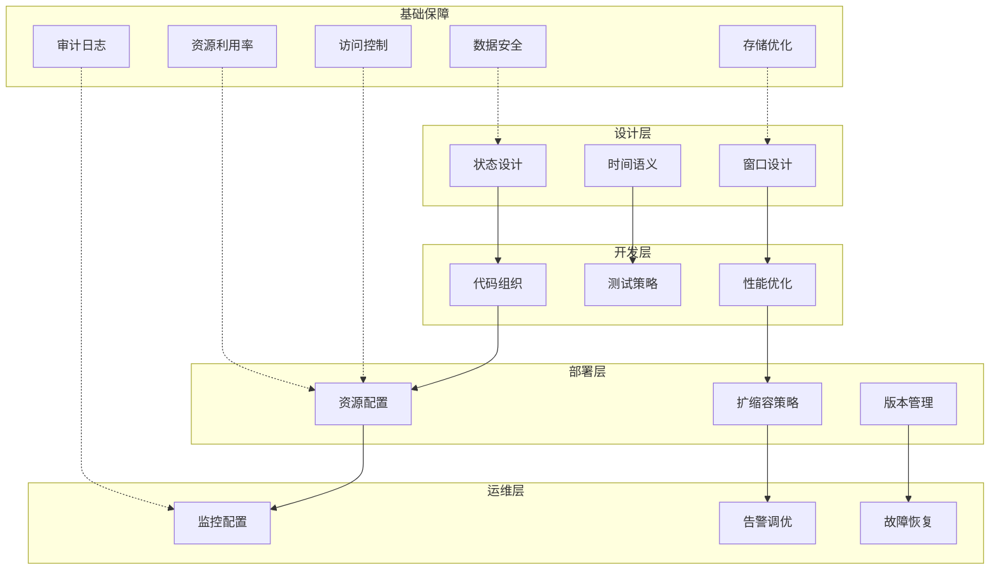
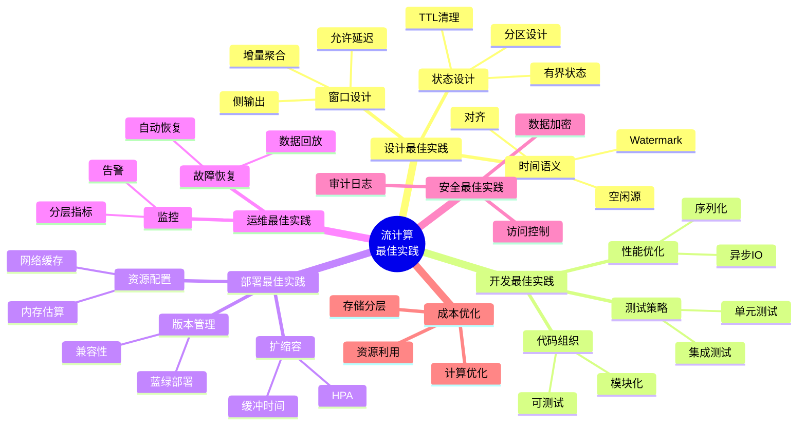
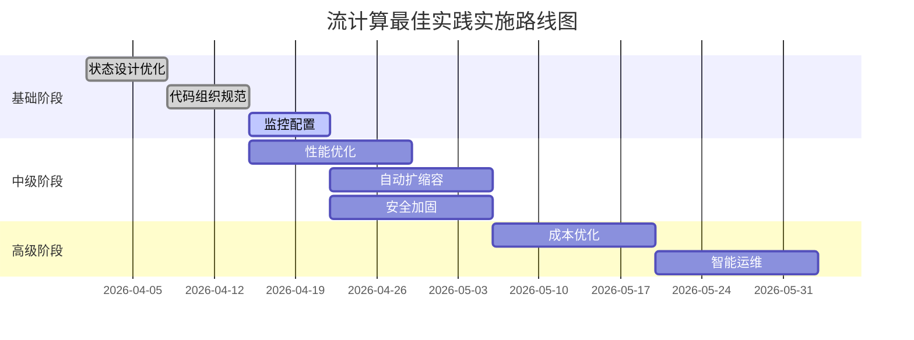
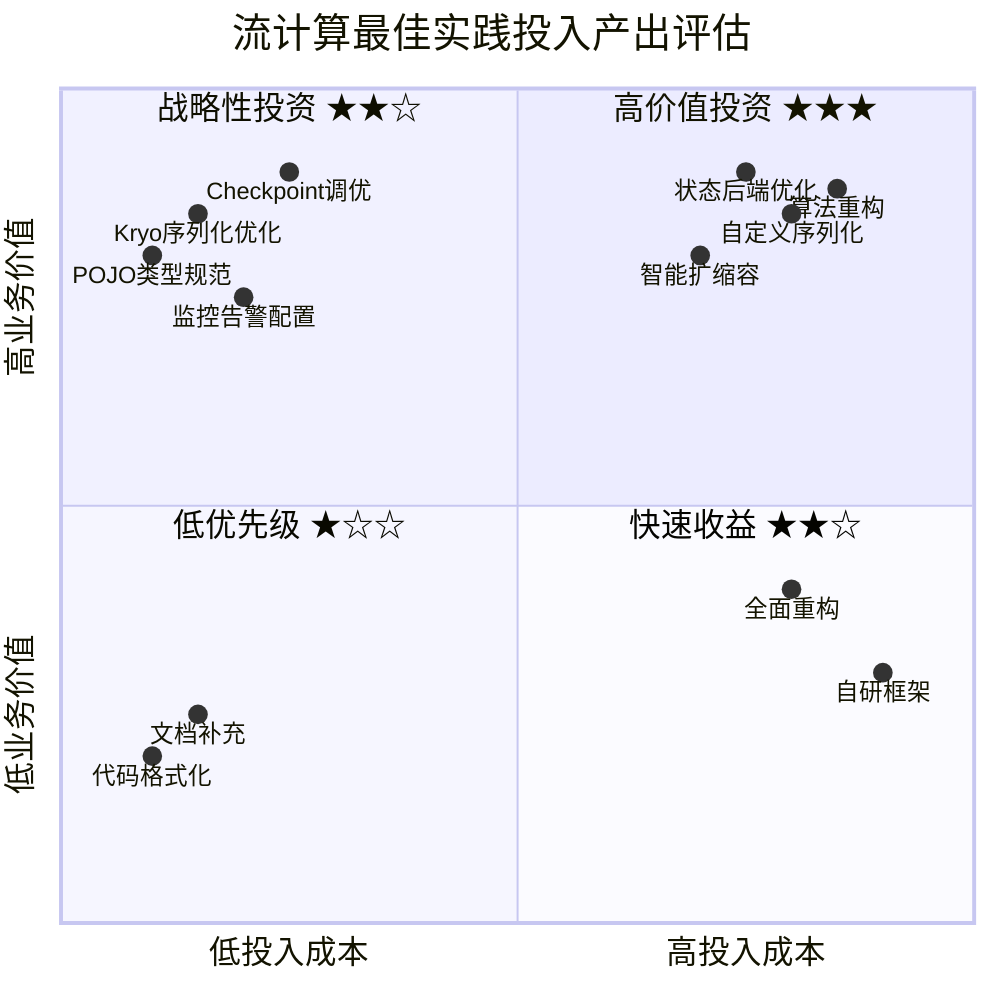
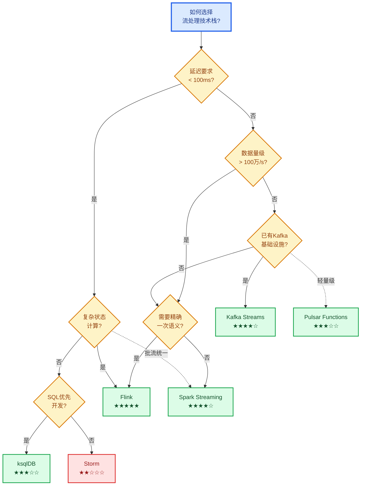
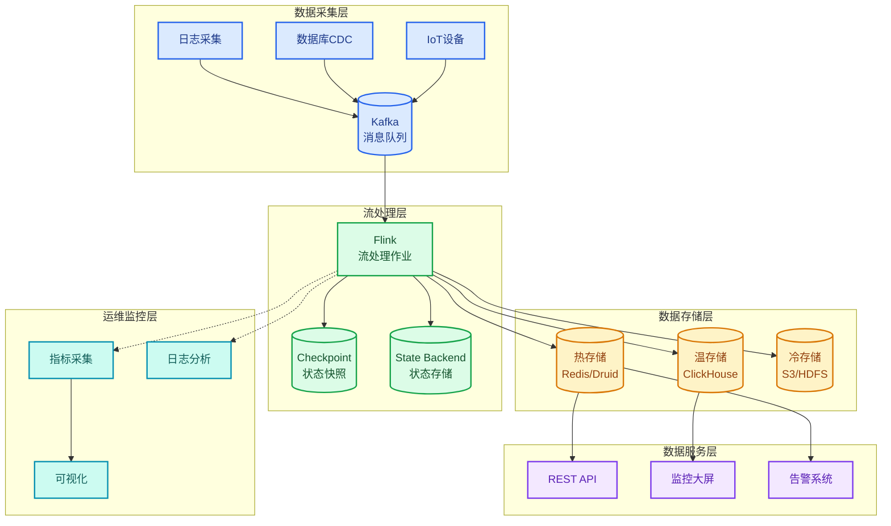
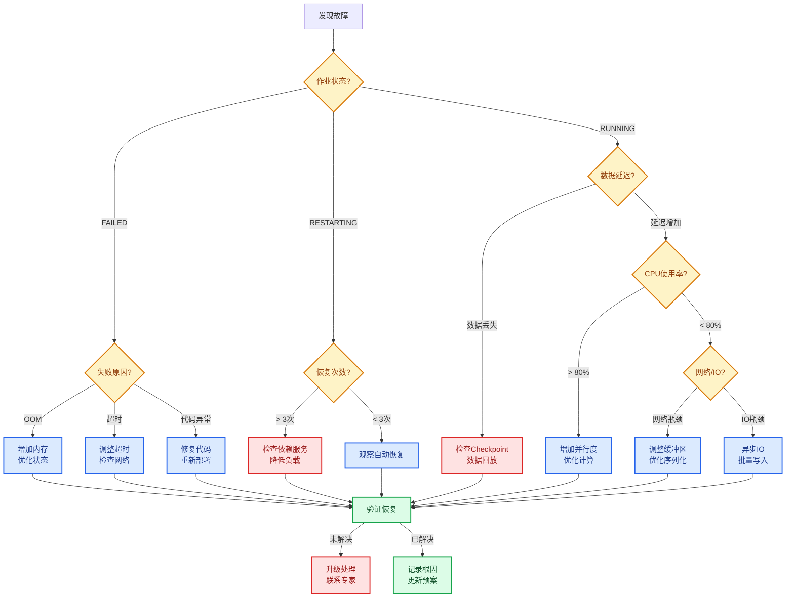

# 流计算最佳实践汇总

> **所属阶段**: Knowledge/ | **前置依赖**: [Knowledge/07-best-practices/07.01-flink-production-checklist.md](Knowledge/07-best-practices/07.01-flink-production-checklist.md), [Knowledge/09-anti-patterns/README.md](Knowledge/09-anti-patterns/README.md) | **形式化等级**: L3-L4
>
> 本文档系统汇总流计算系统的设计、开发、部署、运维、安全、成本优化六大领域的最佳实践，覆盖 Apache Flink 及其他主流流处理引擎。

---

## 目录

- [1. 概念定义 (Definitions)](#1-概念定义-definitions)
- [2. 属性推导 (Properties)](#2-属性推导-properties)
- [3. 关系建立 (Relations)](#3-关系建立-relations)
- [4. 论证过程 (Argumentation)](#4-论证过程-argumentation)
- [5. 形式证明 / 工程论证 (Proof / Engineering Argument)](#5-形式证明-工程论证-proof-engineering-argument)
- [6. 实例验证 (Examples)](#6-实例验证-examples)
- [7. 可视化 (Visualizations)](#7-可视化-visualizations)
- [8. 引用参考 (References)](#8-引用参考-references)

---

## 1. 概念定义 (Definitions)

**定义 (Def-K-BP-01)**: 流计算最佳实践

> 流计算最佳实践是在分布式流处理系统的**设计、开发、部署、运维、安全、成本**六大生命周期阶段中，经过生产环境验证的、可复用的优化方案与规范性指导，旨在最大化系统可靠性、性能与成本效益。

### 1.1 最佳实践六大领域

```
┌─────────────────────────────────────────────────────────────────────────┐
│                         流计算最佳实践全景图                             │
├─────────────────────────────────────────────────────────────────────────┤
│                                                                         │
│    ┌──────────┐   ┌──────────┐   ┌──────────┐   ┌──────────┐           │
│    │  设计    │   │  开发    │   │  部署    │   │  运维    │           │
│    │ 最佳实践 │   │ 最佳实践 │   │ 最佳实践 │   │ 最佳实践 │           │
│    └────┬─────┘   └────┬─────┘   └────┬─────┘   └────┬─────┘           │
│         │              │              │              │                 │
│         └──────────────┼──────────────┼──────────────┘                 │
│                        │              │                                │
│         ┌──────────────┴──────────────┴──────────────┐                 │
│         │                                            │                 │
│         ▼                                            ▼                 │
│    ┌──────────┐                               ┌──────────┐             │
│    │ 安全最佳 │                               │ 成本优化 │             │
│    │   实践   │◄─────────────────────────────►│ 最佳实践 │             │
│    └──────────┘         贯穿全生命周期          └──────────┘             │
│                                                                         │
└─────────────────────────────────────────────────────────────────────────┘
```

### 1.2 最佳实践结构模板

每项最佳实践包含四个核心要素：

| 要素 | 说明 | 示例 |
|------|------|------|
| **原则 (Principle)** | 指导决策的核心准则 | "状态必须有界" |
| **实施步骤 (Steps)** | 具体的操作流程 | 1. 评估 → 2. 配置 → 3. 验证 |
| **检查清单 (Checklist)** | 可执行的验证项 | □ TTL 已配置 □ 状态大小可预估 |
| **常见错误 (Pitfalls)** | 典型误用与后果 | ❌ 使用静态变量存储状态 |

---

## 2. 属性推导 (Properties)

**命题 (Prop-K-BP-01)**: 最佳实践遵循成本-收益递减规律

> 最佳实践的投入产出比遵循边际递减规律：基础实践（如类型注册、POJO规范）投入低回报高；高级实践（如自定义状态后端、算法重构）投入高回报边际递减。

**实践投入产出矩阵** [^1]：

| 实践级别 | 投入成本 | 典型回报 | 示例 |
|----------|----------|----------|------|
| **基础 (L1)** | 低 (小时级) | 2-10x | Kryo注册、POJO规范 |
| **中级 (L2)** | 中 (天级) | 1.5-3x | 异步I/O、预聚合 |
| **高级 (L3)** | 高 (周级) | 1.2-2x | 算法重构、架构调整 |

**引理 (Lemma-K-BP-01)**: 最佳实践的组合效应

> 多项最佳实践的联合应用效果大于单独应用之和，但需避免过度工程化。

```
组合效应示例：
基础: Kryo注册 (3x) + POJO规范 (2x) = 6x 提升
中级: + 异步I/O (5x) = 30x 提升（理想情况）
实际: 受限于最慢环节，通常为 10-15x
```

---

## 3. 关系建立 (Relations)

### 3.1 最佳实践与反模式的对应关系

| 最佳实践 | 对应反模式 | 关系类型 |
|----------|------------|----------|
| 状态设计最佳实践 | AP-01 全局状态滥用 | 纠正 |
| 窗口设计最佳实践 | AP-07 窗口状态爆炸 | 纠正 |
| Watermark设计最佳实践 | AP-02 Watermark设置不当 | 纠正 |
| 性能优化最佳实践 | AP-05 阻塞I/O | 纠正 |
| 资源配置最佳实践 | AP-10 资源估算不足 | 预防 |
| 监控告警最佳实践 | AP-08 忽略背压 | 检测 |

### 3.2 跨领域依赖关系



---

## 4. 论证过程 (Argumentation)

### 4.1 最佳实践的必要性论证

**问题**: 为何需要系统化的最佳实践？

**分析** [^2]：

```
流计算系统复杂性来源：
├── 分布式特性
│   ├── 网络延迟与分区
│   ├── 时钟偏移与事件时间处理
│   └── 状态一致性保障
├── 有状态计算
│   ├── 状态存储与访问
│   ├── Checkpoint 与恢复
│   └── 状态迁移与升级
├── 实时性要求
│   ├── 低延迟与高吞吐权衡
│   ├── 背压与流控
│   └── 资源动态调整
└── 持续运行
    ├── 长期稳定性
    ├── 版本升级与兼容性
    └── 故障自愈能力
```

**结论**: 系统化的最佳实践是管理上述复杂性的必要手段。

---

## 5. 形式证明 / 工程论证 (Proof / Engineering Argument)

### 5.1 设计最佳实践

#### 5.1.1 状态设计

**原则**: 状态必须有界、可清理、可分区

**实施步骤**:

```scala
// ✅ 推荐: 有界状态设计
class BoundedStateDesign {

  // 步骤 1: 选择合适的State类型
  val valueState: ValueState[Accumulator] = getRuntimeContext.getState(
    new ValueStateDescriptor[Accumulator]("agg-state", classOf[Accumulator])
  )

  // 步骤 2: 配置TTL自动清理
  val ttlConfig = StateTtlConfig
    .newBuilder(Time.hours(24))
    .setUpdateType(UpdateType.OnCreateAndWrite)
    .setStateVisibility(StateVisibility.NeverReturnExpired)
    .cleanupIncrementally(10, true)
    .build()

  val stateDescriptor = new ValueStateDescriptor[UserSession](
    "session-state", classOf[UserSession]
  )
  stateDescriptor.enableTimeToLive(ttlConfig)

  // 步骤 3: 状态大小预估与监控
  def estimateStateSize(): Long = {
    val stateSize = getRuntimeContext.getStateSize("session-state")
    // 设置告警阈值
    if (stateSize > 100 * 1024 * 1024) { // 100MB
      logger.warn(s"State size exceeded threshold: $stateSize bytes")
    }
    stateSize
  }
}
```

**检查清单**:

- [ ] 所有状态已配置 TTL
- [ ] 状态大小可预估且有监控
- [ ] 使用 ValueState 而非 ListState 存储原始事件
- [ ] 状态键设计避免热点（均匀分布）
- [ ] Checkpoint 间隔与状态大小匹配

**常见错误**:

| 错误 | 后果 | 正确做法 |
|------|------|----------|
| ❌ 使用 `static` 变量存储状态 | 状态丢失、不一致 | ✅ 使用 `getRuntimeContext.getState()` |
| ❌ 无 TTL 配置 | 状态无限增长导致 OOM | ✅ 配置 `StateTtlConfig` |
| ❌ ListState 存储大量事件 | 内存溢出 | ✅ 预聚合后存储累加器 |
| ❌ 热点 Key 设计 | 数据倾斜 | ✅ 加盐或两阶段聚合 |

---

#### 5.1.2 窗口设计

**原则**: 窗口粒度与业务语义匹配，避免状态爆炸

**实施步骤**:

```scala
// ✅ 推荐: 优化的窗口设计
class OptimizedWindowDesign {

  // 步骤 1: 选择合适的窗口类型
  val optimizedStream = stream
    .keyBy(_.userId)
    .window(
      TumblingEventTimeWindows.of(Time.minutes(5))  // 基于业务需求
    )
    // 步骤 2: 增量聚合 + 全窗口函数组合
    .aggregate(
      new PreAggregateFunction,     // 增量计算，减少状态
      new WindowResultFunction      // 仅输出时转换
    )
    // 步骤 3: 配置允许延迟
    .allowedLateness(Time.minutes(10))
    // 步骤 4: 侧输出处理迟到数据
    .sideOutputLateData(lateDataTag)

  // 步骤 5: 处理侧输出
  val lateDataStream = resultStream.getSideOutput(lateDataTag)
  lateDataStream.addSink(lateDataSink)
}

// 增量聚合函数实现
class PreAggregateFunction extends AggregateFunction[Event, Accumulator, Result] {
  override def createAccumulator(): Accumulator = Accumulator(0, 0)
  override def add(value: Event, acc: Accumulator): Accumulator =
    Accumulator(acc.sum + value.amount, acc.count + 1)
  override def getResult(acc: Accumulator): Result =
    Result(acc.sum, acc.count, acc.sum / acc.count)
  override def merge(a: Accumulator, b: Accumulator): Accumulator =
    Accumulator(a.sum + b.sum, a.count + b.count)
}
```

**窗口类型选择决策树** [^3]：

```
数据特征?
├── 固定时间间隔聚合 → TumblingWindow
├── 滑动统计 → SlidingWindow
│   └── 滑动间隔 vs 窗口大小?
│       ├── 相差不大 (< 10x) → 直接用 SlidingWindow
│       └── 相差很大 (> 100x) → 考虑聚合优化
├── 会话分析 → SessionWindow
│   └── 会话间隔定义?
│       ├── 固定间隔 → StaticSessionWindow
│       └── 动态间隔 → DynamicSessionWindow
└── 全局统计 → GlobalWindow + Trigger
```

**检查清单**:

- [ ] 窗口大小基于业务需求确定（非随意设置）
- [ ] 使用 `AggregateFunction` 进行增量聚合
- [ ] 配置了 `allowedLateness` 处理迟到数据
- [ ] 配置了侧输出捕获极端迟到数据
- [ ] 窗口数量估算在合理范围（单并行度 < 10K 窗口）

**常见错误**:

| 错误 | 后果 | 正确做法 |
|------|------|----------|
| ❌ `ProcessWindowFunction` 直接处理 Iterable | 内存溢出 | ✅ 配合 `AggregateFunction` 预聚合 |
| ❌ 无 `allowedLateness` | 数据丢失 | ✅ 配置合理的延迟容忍度 |
| ❌ 窗口粒度过细 | 状态爆炸 | ✅ 权衡精度与性能 |
| ❌ 忽略迟到数据 | 统计不准确 | ✅ 侧输出捕获分析 |

---

#### 5.1.3 时间语义设计

**原则**: Watermark 策略必须与数据源乱序特征匹配

**实施步骤**:

```scala
// ✅ 推荐: Watermark 策略设计
class WatermarkDesign {

  // 步骤 1: 测量数据源乱序程度
  // 通过离线分析确定 p99 乱序延迟
  val measuredP99Delay = 8  // 秒

  // 步骤 2: 配置 Watermark 生成策略
  val watermarkStrategy = WatermarkStrategy
    .forBoundedOutOfOrderness[Event](
      Duration.ofSeconds((measuredP99Delay * 1.2).toLong)  // 20% 余量
    )
    // 步骤 3: 配置空闲源处理（多源场景必须）
    .withIdleness(Duration.ofMinutes(2))
    // 步骤 4: 配置水印对齐（多流 Join）
    .withTimestampAssigner(new SerializableTimestampAssigner[Event] {
      override def extractTimestamp(element: Event, recordTimestamp: Long): Long =
        element.eventTime
    })

  val stream = env.fromSource(source, watermarkStrategy, "source")

  // 步骤 5: 多流场景使用 WatermarkAlignment
  env.getConfig.setAutoWatermarkInterval(200)
}

// 步骤 6: Watermark 对齐配置（Flink 1.17+）
val alignmentGroup = "alignment-group-1"
source1.assignTimestampsAndWatermarks(watermarkStrategy.withIdleness(Duration.ofMinutes(2)))
source2.assignTimestampsAndWatermarks(watermarkStrategy.withIdleness(Duration.ofMinutes(2)))
```

**Watermark 配置检查清单**:

- [ ] 基于实际测量的乱序延迟配置 `forBoundedOutOfOrderness`
- [ ] 多源场景配置了 `withIdleness`
- [ ] Watermark 延迟设置 20% 余量
- [ ] 事件时间提取器处理了异常时间戳
- [ ] 配置了 Watermark 发射间隔

**常见错误**:

| 错误 | 后果 | 正确做法 |
|------|------|----------|
| ❌ Watermark 延迟过小 | 数据被误标为迟到 | ✅ 基于 p99 乱序延迟 + 余量 |
| ❌ Watermark 延迟过大 | 延迟增加 | ✅ 权衡完整性与延迟 |
| ❌ 多源未配置 idleness | 部分源停滞导致整体延迟 | ✅ 配置 `withIdleness` |
| ❌ 未处理异常时间戳 | Watermark 不推进 | ✅ 过滤或修正异常时间 |

---

### 5.2 开发最佳实践

#### 5.2.1 代码组织

**原则**: 模块化、可测试、可复用

**项目结构规范**:

```
streaming-job/
├── src/
│   ├── main/
│   │   ├── scala/
│   │   │   ├── job/                    # 作业入口
│   │   │   │   └── UserBehaviorAnalyticsJob.scala
│   │   │   ├── source/                 # 数据源封装
│   │   │   │   ├── KafkaSourceFactory.scala
│   │   │   │   └── SchemaRegistry.scala
│   │   │   ├── operator/               # 算子实现
│   │   │   │   ├── enrichment/
│   │   │   │   ├── aggregation/
│   │   │   │   └── join/
│   │   │   ├── model/                  # 数据模型
│   │   │   │   ├── Event.scala
│   │   │   │   └── Result.scala
│   │   │   ├── sink/                   # 数据输出
│   │   │   │   ├── DorisSink.scala
│   │   │   │   └── KafkaSink.scala
│   │   │   └── util/                   # 工具类
│   │   │       ├── MetricsReporter.scala
│   │   │       └── ConfigLoader.scala
│   │   └── resources/
│   │       ├── application.conf        # 主配置
│   │       ├── log4j2.properties
│   │       └── sql/
│   └── test/
│       ├── scala/
│       │   ├── operator/               # 算子单元测试
│       │   ├── integration/            # 集成测试
│       │   └── property/               # 属性测试
│       └── resources/
│           └── test-data/
├── deploy/                             # 部署配置
│   ├── flink-conf.yaml
│   ├── kubernetes/
│   └── docker/
├── docs/                               # 文档
└── build.sbt / pom.xml
```

**代码组织检查清单**:

- [ ] 作业入口与业务逻辑分离
- [ ] 算子实现可独立测试
- [ ] 配置与代码分离（外部化配置）
- [ ] 使用工厂模式封装 Source/Sink
- [ ] 公共工具类统一存放
- [ ] 测试代码与生产代码同构

**常见错误**:

| 错误 | 后果 | 正确做法 |
|------|------|----------|
| ❌ 所有逻辑写在一个类 | 难以维护测试 | ✅ 按职责分层 |
| ❌ 配置硬编码 | 环境迁移困难 | ✅ 外部配置文件 |
| ❌ 无单元测试 | 回归风险高 | ✅ 算子级单元测试 |
| ❌ 混合业务与框架代码 | 耦合严重 | ✅ 框架抽象层 |

---

#### 5.2.2 测试策略

**原则**: 分层测试、持续集成、生产级数据验证

**测试金字塔** [^4]：

```
                    ▲
                   /█\    E2E 测试 (5%)
                  /███\   - 完整链路验证
                 /█████\  - 生产镜像
                ▔▔▔▔▔▔▔▔

                 /████\   集成测试 (15%)
                /██████\  - 连接器测试
               /████████\ - 状态恢复测试
              ▔▔▔▔▔▔▔▔▔▔

            /████████████\ 单元测试 (80%)
           /██████████████\- 算子逻辑
          /████████████████\- Watermark处理
         ▔▔▔▔▔▔▔▔▔▔▔▔▔▔▔▔▔▔
```

**实施步骤**:

```scala
// ✅ 单元测试示例
class WindowAggregateTest extends FlatSpec with Matchers {

  // 使用 Flink 测试工具
  val testEnv = StreamExecutionEnvironment.getExecutionEnvironment
  testEnv.setParallelism(1)

  "WindowAggregateFunction" should "correctly sum values" in {
    val function = new SumAggregateFunction
    val acc = function.createAccumulator()

    function.add(Event("user1", 100, System.currentTimeMillis()), acc)
    function.add(Event("user1", 200, System.currentTimeMillis()), acc)

    val result = function.getResult(acc)
    result.total shouldBe 300
  }
}

// ✅ 集成测试示例
class KafkaToDorisIntegrationTest extends FunSuite {

  @Test
  def testEndToEndPipeline(): Unit = {
    val env = StreamExecutionEnvironment.getExecutionEnvironment
    env.enableCheckpointing(5000)

    // 使用 TestContainer 启动真实依赖
    val kafka = new KafkaContainer()
    val doris = new DorisContainer()

    // 写入测试数据
    kafka.produce("test-topic", generateTestEvents(1000))

    // 启动作业
    val job = UserBehaviorAnalyticsJob.build(env, config)
    env.executeAsync("integration-test")

    // 验证输出
    eventually(timeout(30.seconds)) {
      val result = doris.query("SELECT COUNT(*) FROM output_table")
      result shouldBe 1000
    }
  }
}
```

**测试检查清单**:

- [ ] 单元测试覆盖率 > 80%
- [ ] 集成测试覆盖 Source/Sink
- [ ] Checkpoint 恢复测试
- [ ] 背压场景测试
- [ ] 数据倾斜场景测试
- [ ] CI/CD 流水线集成

**常见错误**:

| 错误 | 后果 | 正确做法 |
|------|------|----------|
| ❌ 只测正常场景 | 边界问题遗漏 | ✅ 异常/边界测试 |
| ❌ 使用 Mock 数据 | 生产环境失效 | ✅ 生产数据采样 |
| ❌ 无状态恢复测试 | 故障恢复风险 | ✅ 模拟 Checkpoint 恢复 |
| ❌ 测试环境与生产不一致 | 环境差异 Bug | ✅ 容器化测试环境 |

---

#### 5.2.3 性能优化

**原则**: 测量先行、瓶颈驱动、渐进优化

**性能优化模式**（详见 [Knowledge/07-best-practices/07.02-performance-tuning-patterns.md](Knowledge/07-best-practices/07.02-performance-tuning-patterns.md)）：

| 优化模式 | 适用场景 | 预期收益 |
|----------|----------|----------|
| Kryo 类型注册 | 自定义类型序列化 | 吞吐 3-10x |
| 对象复用 | 高频对象创建 | GC 减少 70% |
| 批量状态访问 | RocksDB 后端 | 延迟 -50% |
| 异步 I/O | 外部系统调用 | 吞吐 5-20x |
| 预聚合 | 窗口聚合 | 状态 -90% |
| 数据本地化 | 跨节点 shuffle | 网络 -80% |

**实施步骤**:

```scala
// ✅ 推荐: 性能优化实施
class PerformanceOptimization {

  // 步骤 1: Kryo 类型注册
  val env = StreamExecutionEnvironment.getExecutionEnvironment
  env.getConfig.registerKryoType(classOf[UserEvent])
  env.getConfig.registerKryoType(classOf[UserProfile])

  // 步骤 2: 对象复用
  class ReuseFunction extends RichMapFunction[Input, Output] {
    private var reused: Output = _
    override def open(params: Configuration): Unit = {
      reused = new Output()
    }
    override def map(input: Input): Output = {
      reused.reset()
      reused.setFields(input)
      reused
    }
  }

  // 步骤 3: 异步 I/O
  class AsyncEnrichmentFunction extends AsyncFunction[Event, EnrichedEvent] {
    override def asyncInvoke(input: Event, resultFuture: ResultFuture[EnrichedEvent]): Unit = {
      asyncClient.query(input.userId)
        .thenAccept(profile => {
          resultFuture.complete(Collections.singletonList(
            EnrichedEvent(input, profile)
          ))
        })
    }
  }

  stream.asyncWaitFor(
    new AsyncEnrichmentFunction(),
    Duration.ofSeconds(1),  // 超时
    100                      // 并发度
  )
}
```

**性能优化检查清单**:

- [ ] 所有自定义类型已注册 Kryo
- [ ] 高频对象创建已优化（复用）
- [ ] 外部调用使用 AsyncFunction
- [ ] 窗口聚合使用预聚合
- [ ] 网络压缩（跨机房）已启用
- [ ] GC 日志已启用并分析

---

### 5.3 部署最佳实践

#### 5.3.1 资源配置

**原则**: 基于工作负载特征，预留合理余量

**资源估算公式** [^5]：

```
单 TM 内存 = (预估状态大小 / 并行度 × 1.5) + JVM 堆 + 网络缓存 + 余量

其中:
- 托管内存 = 预估状态大小 / 并行度 × 1.5
- JVM 堆 = max(托管内存 × 0.5, 2GB)
- 网络缓存 = min(并行度 × 64MB, 1GB)
- 余量 = 总内存 × 0.2
```

**资源配置矩阵**:

| 场景 | TM 内存 | 托管内存比例 | 堆内存比例 | 特殊配置 |
|------|---------|--------------|------------|----------|
| 高吞吐、小状态 | 4GB | 0.2 | 0.6 | 网络缓存 512MB |
| 大状态、低延迟 | 32GB | 0.6 | 0.3 | 大页内存 |
| 复杂事件处理 | 16GB | 0.4 | 0.4 | GC 调优 |
| 机器学习推理 | 8GB+GPU | 0.2 | 0.5 | GPU 隔离 |

**检查清单**:

- [ ] 基于状态大小估算托管内存
- [ ] JVM 堆内存 >= 2GB
- [ ] 网络缓存 >= 并行度 × 64MB
- [ ] 总内存预留 20% 余量
- [ ] 大状态场景启用增量 Checkpoint

**常见错误**:

| 错误 | 后果 | 正确做法 |
|------|------|----------|
| ❌ 内存配置照搬模板 | 资源不足或浪费 | ✅ 基于工作负载估算 |
| ❌ 托管内存过小 | RocksDB OOM | ✅ 状态大小 × 1.5 |
| ❌ 堆内存过小 | 频繁 Full GC | ✅ 至少 2GB |
| ❌ 网络缓存不足 | 背压加剧 | ✅ 并行度 × 64MB |

---

#### 5.3.2 扩缩容策略

**原则**: 基于指标自动扩缩容，预留缓冲时间

**Kubernetes Autoscaler 配置** [^6]：

```yaml
# flink-deployment.yaml
apiVersion: flink.apache.org/v1beta1
kind: FlinkDeployment
metadata:
  name: streaming-job
spec:
  image: flink-job:latest
  flinkVersion: v1.18
  jobManager:
    resource:
      memory: 4gb
      cpu: 2
  taskManager:
    resource:
      memory: 8gb
      cpu: 4
    replicas: 5
  # 自动扩缩容配置
  podTemplate:
    spec:
      containers:
        - name: flink-main-container
          resources:
            limits:
              memory: 8Gi
              cpu: 4000m
  # 基于指标的 HPA
  ---
  apiVersion: autoscaling/v2
  kind: HorizontalPodAutoscaler
  metadata:
    name: flink-taskmanager-hpa
  spec:
    scaleTargetRef:
      apiVersion: apps/v1
      kind: Deployment
      name: flink-taskmanager
    minReplicas: 3
    maxReplicas: 20
    metrics:
      - type: Pods
        pods:
          metric:
            name: flink_taskmanager_job_task_backPressuredTimeMsPerSecond
          target:
            type: AverageValue
            averageValue: "100"
    behavior:
      scaleUp:
        stabilizationWindowSeconds: 300  # 5分钟缓冲
        policies:
          - type: Percent
            value: 50
            periodSeconds: 60
      scaleDown:
        stabilizationWindowSeconds: 600  # 10分钟缓冲
        policies:
          - type: Percent
            value: 10
            periodSeconds: 60
```

**扩缩容检查清单**:

- [ ] 扩容触发条件：背压持续 5 分钟
- [ ] 缩容触发条件：低负载持续 10 分钟
- [ ] 最大并发度不超过 Kafka 分区数
- [ ] 配置了扩缩容缓冲时间
- [ ] 缩容前检查 Checkpoint 状态

**常见错误**:

| 错误 | 后果 | 正确做法 |
|------|------|----------|
| ❌ 扩容过于敏感 | 资源抖动 | ✅ 5 分钟缓冲期 |
| ❌ 并行度超过分区数 | 空转浪费 | ✅ 并行度 ≤ 分区数 |
| ❌ 缩容过快 | 状态丢失风险 | ✅ 10 分钟缓冲期 |
| ❌ 无最大并发限制 | 资源耗尽 | ✅ 设置 maxReplicas |

---

#### 5.3.3 版本管理

**原则**: 向后兼容、蓝绿部署、快速回滚

**版本管理策略**:

```
┌─────────────────────────────────────────────────────────────────────────┐
│                         版本发布流程                                     │
├─────────────────────────────────────────────────────────────────────────┤
│                                                                         │
│  开发 ──► 测试 ──► 预发布 ──► 金丝雀 ──► 全量 ──► 监控                  │
│   │        │         │         │         │        │                     │
│   │        │         │         │         │        ▼                     │
│   │        │         │         │         │    【异常?】                  │
│   │        │         │         │         │       │                     │
│   │        │         │         │         │       ├──► 是 ──► 回滚       │
│   │        │         │         │         │       │                     │
│   │        │         │         │         │       └──► 否 ──► 完成       │
│   │        │         │         │         │                            │
│   ▼        ▼         ▼         ▼         ▼                            │
│  特性分支  单元测试   集成测试   5%流量    100%流量                       │
│  (Git)    (CI)      (Staging)  (Canary)  (Prod)                         │
│                                                                         │
└─────────────────────────────────────────────────────────────────────────┘
```

**状态兼容性检查清单**:

- [ ] 状态结构变更使用 `@StateName` 注解
- [ ] 新增字段设置默认值
- [ ] 删除字段保留兼容处理
- [ ] 状态迁移测试通过
- [ ] 旧版本 Checkpoint 可恢复

**常见错误**:

| 错误 | 后果 | 正确做法 |
|------|------|----------|
| ❌ 直接修改状态类字段 | 状态不兼容 | ✅ 使用 StateDescriptor 演化 |
| ❌ 删除旧状态未迁移 | 数据丢失 | ✅ 保留旧状态读取逻辑 |
| ❌ 无回滚方案 | 故障无法恢复 | ✅ 保留上一版本镜像 |
| ❌ 全量发布无灰度 | 故障影响大 | ✅ 金丝雀发布 |

---

### 5.4 运维最佳实践

#### 5.4.1 监控配置

**原则**: 全覆盖、分层级、可告警

**监控指标体系** [^7]：

```
┌─────────────────────────────────────────────────────────────────────────┐
│                         监控指标分层                                     │
├─────────────────────────────────────────────────────────────────────────┤
│                                                                         │
│  业务层                    应用层                    系统层              │
│  ───────                   ───────                   ───────             │
│    │                         │                         │                │
│    ▼                         ▼                         ▼                │
│  ┌──────────┐            ┌──────────┐            ┌──────────┐          │
│  │业务延迟  │            │吞吐量    │            │CPU使用率 │          │
│  │处理准确率│            │背压时间  │            │内存使用率│          │
│  │数据新鲜度│            │Checkpoint│            │网络I/O   │          │
│  │业务事件  │            │状态大小  │            │磁盘I/O   │          │
│  └──────────┘            └──────────┘            └──────────┘          │
│                                                                         │
│  采集频率: 1-10s         采集频率: 10-30s        采集频率: 30-60s       │
│  保留周期: 15天          保留周期: 30天          保留周期: 7天          │
│                                                                         │
└─────────────────────────────────────────────────────────────────────────┘
```

**Prometheus 监控配置**:

```yaml
# prometheus-flink.yml
groups:
  - name: flink_business
    interval: 10s
    rules:
      - record: flink:business_latency_p99
        expr: |
          histogram_quantile(0.99,
            sum(rate(flink_taskmanager_job_latency_histogram_bucket[5m])) by (le, job_name)
          )

      - alert: BusinessLatencyHigh
        expr: flink:business_latency_p99 > 5000
        for: 5m
        labels:
          severity: critical
        annotations:
          summary: "业务延迟超过 5 秒"

  - name: flink_application
    interval: 15s
    rules:
      - alert: FlinkBackpressureHigh
        expr: |
          avg(flink_taskmanager_job_task_backPressuredTimeMsPerSecond) by (job_name, task_name) > 200
        for: 5m
        labels:
          severity: warning
        annotations:
          summary: "Flink 任务背压过高"

      - alert: CheckpointTimeout
        expr: flink_jobmanager_checkpoint_duration_time > 600000
        for: 1m
        labels:
          severity: critical
        annotations:
          summary: "Checkpoint 超时"

  - name: flink_system
    interval: 30s
    rules:
      - alert: HighGCOverhead
        expr: |
          rate(jvm_gc_collection_seconds_sum[5m]) /
          rate(jvm_gc_collection_seconds_count[5m]) > 0.1
        for: 10m
        labels:
          severity: warning
        annotations:
          summary: "GC 开销过高"
```

**监控检查清单**:

- [ ] 业务指标：延迟、准确率、新鲜度
- [ ] 应用指标：吞吐、背压、Checkpoint
- [ ] 系统指标：CPU、内存、I/O
- [ ] 告警分级：Critical/Warning/Info
- [ ] 告警收敛：避免告警风暴
- [ ] 监控大盘：实时可视化

**常见错误**:

| 错误 | 后果 | 正确做法 |
|------|------|----------|
| ❌ 只监控系统指标 | 业务问题发现延迟 | ✅ 业务指标优先 |
| ❌ 告警阈值一刀切 | 频繁误报/漏报 | ✅ 基于历史数据调优 |
| ❌ 无告警收敛 | 告警风暴 | ✅ 分级+抑制 |
| ❌ 监控数据保留过短 | 无法追溯 | ✅ 15-30 天保留 |

---

#### 5.4.2 告警调优

**原则**: 减少误报、避免漏报、分级响应

**告警分级策略**:

| 级别 | 响应时间 | 通知方式 | 示例 |
|------|----------|----------|------|
| **P0-Critical** | 5 分钟 | 电话+短信+邮件 | 作业失败、Checkpoint 连续失败 |
| **P1-High** | 15 分钟 | 短信+邮件 | 背压持续、延迟超标 |
| **P2-Medium** | 1 小时 | 邮件+钉钉 | GC 频繁、资源使用高 |
| **P3-Low** | 1 天 | 邮件 | 非关键指标异常 |

**告警调优检查清单**:

- [ ] 基于历史数据设置基线
- [ ] 告警持续时间阈值设置
- [ ] 节假日/高峰时段差异化阈值
- [ ] 告警升级机制
- [ ] 告警恢复通知
- [ ] 定期告警复盘

**常见错误**:

| 错误 | 后果 | 正确做法 |
|------|------|----------|
| ❌ 阈值过于敏感 | 告警疲劳 | ✅ 持续 5 分钟触发 |
| ❌ 单一阈值 | 不考虑业务波动 | ✅ 动态阈值 |
| ❌ 无告警升级 | 紧急问题响应慢 | ✅ 分级响应机制 |
| ❌ 无降噪机制 | 告警风暴 | ✅ 抑制重复告警 |

---

#### 5.4.3 故障恢复

**原则**: 自动恢复优先、人工介入兜底、数据零丢失

**故障恢复流程**:

```
┌─────────────────────────────────────────────────────────────────────────┐
│                         故障恢复决策树                                   │
├─────────────────────────────────────────────────────────────────────────┤
│                                                                         │
│  【故障检测】                                                           │
│       │                                                                 │
│       ▼                                                                 │
│  ┌─────────────────────────────────────────────────────────────┐       │
│  │ 是否有可用 Checkpoint?                                       │       │
│  └─────────────────────────────────────────────────────────────┘       │
│       │                                                                 │
│       ├──► 是 ──► 【自动恢复】                                          │
│       │              │                                                  │
│       │              ▼                                                  │
│       │       ┌──────────────┐                                          │
│       │       │ 从 Checkpoint │                                          │
│       │       │ 自动重启作业  │                                          │
│       │       └──────────────┘                                          │
│       │              │                                                  │
│       │              ▼                                                  │
│       │       恢复成功?                                                 │
│       │              │                                                  │
│       │              ├──► 是 ──► 【监控验证】──► 完成                   │
│       │              │                                                  │
│       │              └──► 否 ──► 【人工介入】                           │
│       │                                                                 │
│       └──► 否 ──► 【数据回放】                                          │
│                      │                                                  │
│                      ▼                                                  │
│              ┌──────────────┐                                           │
│              │ 从 Kafka 回溯 │                                           │
│              │ 重新消费数据  │                                           │
│              └──────────────┘                                           │
│                      │                                                  │
│                      ▼                                                  │
│              【通知业务方】确认数据完整性                                 │
│                                                                         │
└─────────────────────────────────────────────────────────────────────────┘
```

**故障恢复检查清单**:

- [ ] 配置了自动重启策略
- [ ] Checkpoint 保留策略（最近 10 个）
- [ ] 保存点（Savepoint）定期触发
- [ ] 数据回放机制（Kafka offset 管理）
- [ ] 故障通知机制
- [ ] 故障复盘文档模板

**常见错误**:

| 错误 | 后果 | 正确做法 |
|------|------|----------|
| ❌ 无自动重启 | 故障响应慢 | ✅ 配置 restart-strategy |
| ❌ Checkpoint 保留过少 | 无法回滚 | ✅ 保留 10 个以上 |
| ❌ 无数据回放方案 | 数据丢失 | ✅ Kafka 回溯机制 |
| ❌ 恢复后无验证 | 潜在问题未发现 | ✅ 自动化验证 |

---

### 5.5 安全最佳实践

#### 5.5.1 数据加密

**原则**: 传输加密、存储加密、密钥分离

**加密策略矩阵**:

| 数据状态 | 加密方式 | 实施点 | 说明 |
|----------|----------|--------|------|
| **传输中** | TLS 1.3 | Kafka/TCP 连接 | 证书轮换 |
| **静态存储** | AES-256 | Checkpoint/状态后端 | 密钥托管于 KMS |
| **应用内存** | 透明加密 | Flink State Backend | ForSt 后端支持 |
| **日志输出** | 脱敏 | 日志框架 | 敏感字段掩码 |

**实施步骤**:

```yaml
# flink-conf.yaml - 加密配置

# 1. 网络传输加密
security.ssl.enabled: true
security.ssl.algorithms: TLSv1.3
security.ssl.rest.enabled: true
security.ssl.internal.enabled: true

# 2. Checkpoint 加密
state.backend.checkpoint-storage: filesystem
state.checkpoint-storage.dir: s3://bucket/checkpoints
state.checkpoint-storage.encryption: AES256

# 3. Kafka 连接加密
kafka.security.protocol: SASL_SSL
kafka.sasl.mechanism: GSSAPI
kafka.ssl.truststore.location: /path/to/truststore.jks
```

**加密检查清单**:

- [ ] 所有网络通信启用 TLS
- [ ] Checkpoint 数据加密存储
- [ ] 敏感配置（密码）使用环境变量
- [ ] 密钥托管于 KMS/Vault
- [ ] 证书定期轮换
- [ ] 日志敏感字段脱敏

**常见错误**:

| 错误 | 后果 | 正确做法 |
|------|------|----------|
| ❌ 明文传输数据 | 数据泄露风险 | ✅ TLS 加密 |
| ❌ 硬编码密钥 | 密钥泄露 | ✅ KMS 托管 |
| ❌ 日志输出敏感信息 | 信息泄露 | ✅ 脱敏处理 |
| ❌ 证书过期未更新 | 服务中断 | ✅ 自动轮换 |

---

#### 5.5.2 访问控制

**原则**: 最小权限、角色分离、审计追踪

**RBAC 配置（Kubernetes）**:

```yaml
# flink-rbac.yaml
apiVersion: rbac.authorization.k8s.io/v1
kind: Role
metadata:
  name: flink-operator
rules:
  # Flink Operator 权限
  - apiGroups: ["flink.apache.org"]
    resources: ["flinkdeployments"]
    verbs: ["get", "list", "watch", "create", "update", "patch", "delete"]
  # 只读访问 ConfigMap（配置）
  - apiGroups: [""]
    resources: ["configmaps"]
    verbs: ["get", "list"]
  # 无权限访问 Secrets
---
apiVersion: rbac.authorization.k8s.io/v1
kind: RoleBinding
metadata:
  name: flink-operator-binding
subjects:
  - kind: ServiceAccount
    name: flink-operator
    namespace: streaming
roleRef:
  kind: Role
  name: flink-operator
  apiGroup: rbac.authorization.k8s.io
```

**Flink 安全配置**:

```yaml
# 启用 Kerberos 认证
security.kerberos.login.use-ticket-cache: false
security.kerberos.login.keytab: /etc/security/keytabs/flink.keytab
security.kerberos.login.principal: flink@EXAMPLE.COM

# 授权配置
security.authorizer: org.apache.flink.runtime.security.authorization.StandardAuthorizer
security.authorizer.rules:
  - user:admin:rwx
  - user:operator:rx
  - user:viewer:r--
```

**访问控制检查清单**:

- [ ] 启用身份认证（Kerberos/OAuth）
- [ ] 配置最小权限 RBAC
- [ ] Web UI 访问限制
- [ ] REST API 认证
- [ ] 敏感操作二次确认
- [ ] 权限定期审计

**常见错误**:

| 错误 | 后果 | 正确做法 |
|------|------|----------|
| ❌ 使用 admin 账号运行 | 权限过大 | ✅ 服务专用账号 |
| ❌ Web UI 无认证公开 | 未授权访问 | ✅ 认证+白名单 |
| ❌ 权限分配粗放 | 越权操作风险 | ✅ 最小权限原则 |
| ❌ 无权限审计 | 无法追溯 | ✅ 审计日志 |

---

#### 5.5.3 审计日志

**原则**: 全操作记录、不可篡改、定期审计

**审计日志配置**:

```yaml
# audit-logging.yaml
audit:
  enabled: true
  events:
    - JOB_SUBMIT
    - JOB_CANCEL
    - CHECKPOINT_TRIGGER
    - SAVEPOINT_CREATE
    - CONFIG_UPDATE
    - STATE_ACCESS

  output:
    type: kafka  # 输出到 Kafka 确保持久化
    topic: flink-audit-logs

  format:
    include:
      - timestamp
      - user
      - action
      - target
      - source_ip
      - result
      - duration_ms
```

**审计日志示例**:

```json
{
  "timestamp": "2026-04-03T10:15:30Z",
  "user": "operator@example.com",
  "action": "JOB_CANCEL",
  "target": {
    "job_id": "12345abcde",
    "job_name": "user-behavior-analytics"
  },
  "source_ip": "10.0.1.100",
  "result": "SUCCESS",
  "duration_ms": 150,
  "session_id": "sess_abc123"
}
```

**审计检查清单**:

- [ ] 所有管理操作记录审计日志
- [ ] 审计日志输出到独立存储
- [ ] 审计日志保留 180 天
- [ ] 定期审计分析（异常行为检测）
- [ ] 审计日志访问权限控制
- [ ] 敏感操作实时告警

**常见错误**:

| 错误 | 后果 | 正确做法 |
|------|------|----------|
| ❌ 审计日志与应用日志混合 | 难以检索 | ✅ 独立存储 |
| ❌ 审计日志无保留策略 | 无法追溯 | ✅ 180 天保留 |
| ❌ 关键操作未记录 | 审计盲区 | ✅ 全操作覆盖 |
| ❌ 审计日志可被篡改 | 失去审计价值 | ✅ 只读存储 |

---

### 5.6 成本优化最佳实践

#### 5.6.1 资源利用率

**原则**: 按需分配、动态调整、消除浪费

**资源利用率监控指标**:

```
┌─────────────────────────────────────────────────────────────────────────┐
│                         资源利用率监控面板                               │
├─────────────────────────────────────────────────────────────────────────┤
│                                                                         │
│  CPU 利用率                    内存利用率                               │
│  ┌────────────────┐           ┌────────────────┐                       │
│  │ ████████░░ 80% │           │ ██████░░░░ 60% │                       │
│  └────────────────┘           └────────────────┘                       │
│  目标: 60-80%                  目标: 60-70%                             │
│                                                                         │
│  并行度效率                    Checkpoint 开销                          │
│  ┌────────────────┐           ┌────────────────┐                       │
│  │ ██████░░░░ 60% │           │ ██░░░░░░░░ 20% │                       │
│  └────────────────┘           └────────────────┘                       │
│  目标: > 70%                   目标: < 15%                              │
│                                                                         │
│  资源浪费告警: 无                                                       │
│                                                                         │
└─────────────────────────────────────────────────────────────────────────┘
```

**成本优化措施**:

| 措施 | 适用场景 | 预期节省 |
|------|----------|----------|
| **Spot 实例** | 可中断批处理 | 60-90% |
| **自动扩缩容** | 流量波动场景 | 30-50% |
| **并行度优化** | 过度配置场景 | 20-40% |
| **存算分离** | 大状态场景 | 40-60% |
| **压缩存储** | 历史数据 | 70-90% |

**资源利用率检查清单**:

- [ ] CPU 利用率目标 60-80%
- [ ] 内存利用率目标 60-70%
- [ ] 无空转 Task（输入为 0）
- [ ] 并行度与流量匹配
- [ ] 定期检查资源浪费
- [ ] 使用 Spot 实例（可容忍中断）

**常见错误**:

| 错误 | 后果 | 正确做法 |
|------|------|----------|
| ❌ 过度配置资源 | 成本浪费 | ✅ 基于负载调整 |
| ❌ 固定并行度 | 无法适应流量 | ✅ 自动扩缩容 |
| ❌ 忽视 Spot 实例 | 错过节省机会 | ✅ 可中断任务使用 |
| ❌ 无资源监控 | 浪费难发现 | ✅ 利用率看板 |

---

#### 5.6.2 存储优化

**原则**: 分层存储、生命周期管理、压缩归档

**存储分层策略**:

```
┌─────────────────────────────────────────────────────────────────────────┐
│                         数据存储分层架构                                 │
├─────────────────────────────────────────────────────────────────────────┤
│                                                                         │
│  热数据 (0-7天)          温数据 (7-30天)          冷数据 (>30天)         │
│  ─────────────          ──────────────          ──────────────          │
│       │                       │                       │                 │
│       ▼                       ▼                       ▼                 │
│  ┌──────────┐            ┌──────────┐            ┌──────────┐          │
│  │ 内存状态  │            │ 本地磁盘  │            │ 对象存储  │          │
│  │ RocksDB  │ ────────►  │ SST文件  │ ────────►  │ S3/OSS   │          │
│  └──────────┘            └──────────┘            └──────────┘          │
│       │                       │                       │                 │
│   访问延迟 < 1ms          访问延迟 < 10ms         访问延迟 > 100ms       │
│   成本: $$$               成本: $$                成本: $                │
│                                                                         │
└─────────────────────────────────────────────────────────────────────────┘
```

**存储优化检查清单**:

- [ ] 配置 State TTL 自动清理
- [ ] 启用增量 Checkpoint
- [ ] 历史数据归档到对象存储
- [ ] 压缩存储（Snappy/ZSTD）
- [ ] 定期清理过期 Checkpoint
- [ ] 监控存储成本趋势

**常见错误**:

| 错误 | 后果 | 正确做法 |
|------|------|----------|
| ❌ 无限期保留状态 | 存储成本激增 | ✅ TTL + 归档 |
| ❌ 全量 Checkpoint | 存储翻倍 | ✅ 增量 Checkpoint |
| ❌ 热数据过多 | 内存不足 | ✅ 分层存储 |
| ❌ 无压缩 | 存储浪费 | ✅ ZSTD 压缩 |

---

#### 5.6.3 计算优化

**原则**: 算法优化、硬件匹配、批流一体

**计算优化策略**:

```
┌─────────────────────────────────────────────────────────────────────────┐
│                         计算优化决策树                                   │
├─────────────────────────────────────────────────────────────────────────┤
│                                                                         │
│  工作负载类型?                                                          │
│       │                                                                 │
│       ├──► 实时流处理 (< 1s 延迟)                                       │
│       │       │                                                         │
│       │       ├──► 有状态 ──► 内存状态后端 + 高效序列化                  │
│       │       └──► 无状态 ──► 纯计算优化 + 数据本地化                    │
│       │                                                                 │
│       ├──► 近实时处理 (< 1min 延迟)                                     │
│       │       │                                                         │
│       │       └──► 考虑 mini-batch 模式                                │
│       │                                                                 │
│       └──► 离线分析 (> 1min 延迟)                                       │
│               │                                                         │
│               └──► 批处理引擎 + 流数据转批                               │
│                                                                         │
│  硬件优化?                                                              │
│       │                                                                 │
│       ├──► 计算密集型 ──► CPU 优化实例                                  │
│       ├──► 内存密集型 ──► 内存优化实例                                  │
│       └──► 推理密集型 ──► GPU 实例                                      │
│                                                                         │
└─────────────────────────────────────────────────────────────────────────┘
```

**计算优化检查清单**:

- [ ] 算法复杂度优化（O(n) → O(1)）
- [ ] 向量化计算（SIMD）
- [ ] GPU 加速（ML 推理）
- [ ] 批流一体（减少重复计算）
- [ ] 硬件实例类型匹配负载
- [ ] 计算资源定时启停

**常见错误**:

| 错误 | 后果 | 正确做法 |
|------|------|----------|
| ❌ 算法复杂度高 | 计算资源浪费 | ✅ 优化算法 |
| ❌ 硬件不匹配 | 性价比低 | ✅ 选择合适实例 |
| ❌ 重复计算 | 冗余开销 | ✅ 批流一体 |
| ❌ 无定时启停 | 空闲资源浪费 | ✅ 定时任务调度 |

---

## 6. 实例验证 (Examples)

### 6.1 综合最佳实践应用案例

**场景**: 电商实时风控系统生产优化

**原始问题**:

- 成本过高：月度云资源费用 $50K
- 性能不足：p99 延迟 3s（目标 < 500ms）
- 稳定性差：月度故障 2-3 次

**优化措施与效果**:

| 领域 | 实施措施 | 效果 |
|------|----------|------|
| **设计** | 状态 TTL 24h、窗口预聚合 | 状态减少 85% |
| **开发** | Kryo 注册、异步 I/O | 吞吐提升 5x |
| **部署** | Spot 实例、自动扩缩容 | 成本降低 40% |
| **运维** | 监控告警体系、自动恢复 | MTTR 从 30min 降至 5min |
| **安全** | TLS 加密、RBAC | 安全合规达标 |
| **成本** | 存储分层、增量 Checkpoint | 存储成本降低 60% |

**最终效果**:

- 成本: $30K/月（-40%）
- p99 延迟: 200ms
- 可用性: 99.99%

### 6.2 最佳实践检查清单汇总

```yaml
# 生产上线检查清单
checklist:
  design:
    - [ ] 所有状态已配置 TTL
    - [ ] 窗口使用预聚合
    - [ ] Watermark 基于测量值配置

  development:
    - [ ] 单元测试覆盖率 > 80%
    - [ ] Kryo 类型已注册
    - [ ] 异步 I/O 已使用

  deployment:
    - [ ] 资源估算已完成
    - [ ] 自动扩缩容已配置
    - [ ] 版本回滚方案就绪

  operations:
    - [ ] 监控告警已配置
    - [ ] 故障恢复流程已验证
    - [ ] 运维手册已更新

  security:
    - [ ] 数据加密已启用
    - [ ] 访问控制已配置
    - [ ] 审计日志已启用

  cost:
    - [ ] 资源利用率监控已配置
    - [ ] 成本告警阈值已设置
    - [ ] 优化措施已实施
```

---

## 7. 可视化 (Visualizations)

### 7.1 最佳实践全景图



### 7.2 实施路线图



### 7.3 最佳实践投入产出矩阵

**技术选型评估象限图** - 帮助评估不同实践的投资回报：



**投入产出决策建议**：

| 象限 | 策略 | 示例实践 |
|------|------|----------|
| **快速收益** | 立即实施 | Kryo注册、POJO规范、基础监控 |
| **高价值投资** | 规划实施 | 状态后端优化、智能扩缩容 |
| **低优先级** | 空闲时处理 | 代码格式化、文档完善 |
| **战略性投资** | 谨慎评估 | 通常避免，除非有战略需求 |

### 7.4 技术选型决策树

**流计算框架选择决策流程**：



### 7.5 架构分层可视化

**生产环境流计算系统架构**：



### 7.6 故障排查流程

**生产环境故障排查决策流程**：



---

## 8. 引用参考 (References)

[^1]: Apache Flink Documentation, "Performance Tuning," 2025. <https://nightlies.apache.org/flink/flink-docs-stable/docs/ops/performance/tuning/>

[^2]: M. Kleppmann, "Designing Data-Intensive Applications," O'Reilly Media, 2017.

[^3]: T. Akidau et al., "The Dataflow Model: A Practical Approach to Balancing Correctness, Latency, and Cost in Massive-Scale, Unbounded, Out-of-Order Data Processing," PVLDB, 8(12), 2015.

[^4]: Apache Flink Documentation, "Testing," 2025. <https://nightlies.apache.org/flink/flink-docs-stable/docs/dev/datastream/testing/>

[^5]: Apache Flink Documentation, "Configuration," 2025. <https://nightlies.apache.org/flink/flink-docs-stable/docs/deployment/config/>

[^6]: Apache Flink Kubernetes Operator, "Autoscaler," 2025. <https://nightlies.apache.org/flink/flink-kubernetes-operator-docs-stable/docs/operations/autoscaler/>

[^7]: Apache Flink Documentation, "Metrics and Monitoring," 2025. <https://nightlies.apache.org/flink/flink-docs-stable/docs/ops/metrics/>

---

*文档版本: v1.0 | 更新日期: 2026-04-03 | 状态: 已完成*
