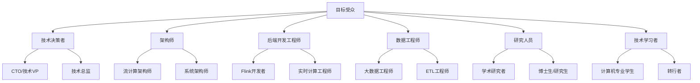
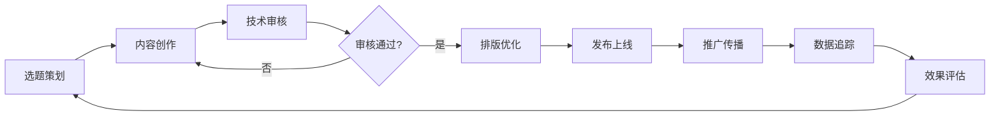
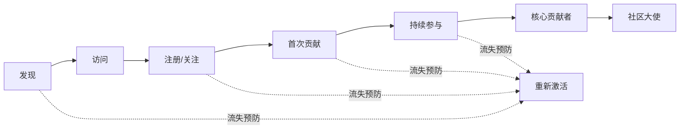
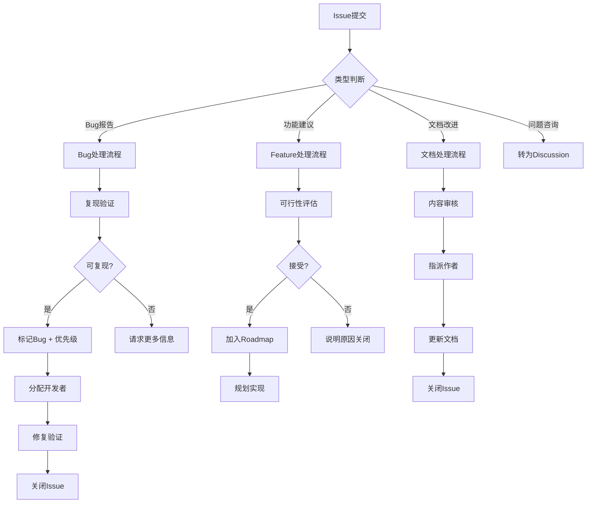

# AnalysisDataFlow 社区运营手册

> **版本**: v1.0 | **生效日期**: 2026-04-12 | **状态**: 正式发布 | **文档类型**: 运营指南

---

## 1. 社区运营策略

### 1.1 愿景与目标

**愿景**: 打造流计算领域最活跃、最专业、最友好的技术社区

**年度目标**:

| 指标 | 2026年目标 | 测量方式 |
|-----|-----------|---------|
| 活跃贡献者 | 50+ | 月度PR提交者 |
| GitHub Stars | 500+ | 仓库统计 |
| 月讨论数 | 30+ | Discussion统计 |
| 文档覆盖度 | 95%+ | 内容审计 |
| 问题解决率 | 90%+ | Issue关闭率 |

### 1.2 目标受众



### 1.3 内容定位

| 内容层级 | 目标读者 | 内容特点 | 更新频率 |
|---------|---------|---------|---------|
| **基础入门** | 初学者 | 概念解释、快速上手 | 每周 |
| **实践指南** | 开发者 | 代码示例、配置说明 | 每周 |
| **深度分析** | 架构师 | 架构设计、性能优化 | 每两周 |
| **前沿研究** | 研究人员 | 论文解读、理论探讨 | 每月 |
| **案例研究** | 决策者 | 业务场景、ROI分析 | 每月 |

### 1.4 社区文化

**核心价值观**:

- 🎯 **严谨**: 追求技术准确性，拒绝模糊表述
- 🤝 **开放**: 欢迎多元观点，鼓励建设性讨论
- 🚀 **实用**: 理论与实践结合，解决真实问题
- 📚 **共享**: 知识共享，共同成长

**社区氛围营造**:

1. 及时响应新成员问题（24小时内）
2. 公开感谢贡献者
3. 定期分享成员成功案例
4. 建立导师制度帮助新人

---

## 2. 内容发布计划

### 2.1 内容矩阵

| 内容类型 | 发布平台 | 频率 | 负责人 |
|---------|---------|------|-------|
| 技术博客 | GitHub Wiki + 知乎专栏 | 每周2篇 | 内容团队 |
| 代码示例 | examples/ 目录 | 每周1个 | 开发者 |
| 视频教程 | B站/YouTube | 每月2个 | 视频团队 |
| 案例研究 | Knowledge/ 目录 | 每月1篇 | 案例团队 |
| 周报/月报 | GitHub Discussion | 每周/每月 | 运营团队 |
| 版本发布说明 | GitHub Releases | 按需 | 维护团队 |

### 2.2 内容生产流程



### 2.3 内容质量标准

**技术文章检查清单**:

- [ ] 标题准确反映内容
- [ ] 有清晰的结构化大纲
- [ ] 包含至少一个代码示例
- [ ] 关键概念有定义说明
- [ ] 有实际应用场景
- [ ] 引用来源可靠
- [ ] 经过至少一人技术审核
- [ ] 无错别字和格式问题

**代码示例检查清单**:

- [ ] 代码可直接运行
- [ ] 有详细的注释说明
- [ ] 包含运行环境要求
- [ ] 有预期输出示例
- [ ] 经过实际测试验证

### 2.4 内容分发策略

| 渠道 | 内容类型 | 发布时间 | 互动策略 |
|-----|---------|---------|---------|
| GitHub | 全部内容 | 即时 | Discussion引导讨论 |
| 知乎 | 技术文章 | 周二/周五 10:00 | 评论区答疑 |
| 掘金 | 代码实践 | 周三/周六 14:00 | 技术讨论 |
| 微信公众号 | 精选文章 | 周一/周四 20:00 | 读者互动 |
| Twitter/X | 英文内容 | 工作日上午 | 话题参与 |
| LinkedIn | 专业内容 | 工作日上午 | 行业讨论 |

---

## 3. 用户互动指南

### 3.1 用户生命周期管理



### 3.2 互动响应标准

| 互动类型 | 首次响应时间 | 解决/关闭时间 | 负责人 |
|---------|-------------|--------------|-------|
| Issue提交 | 4小时内 | 7天内 | 维护团队 |
| Discussion提问 | 8小时内 | 视问题复杂度 | 社区成员 |
| PR提交 | 24小时内 | 14天内 | 代码审核员 |
| 安全报告 | 1小时内 | 48小时内 | 安全团队 |
| 邮件咨询 | 24小时内 | 3天内 | 运营团队 |

### 3.3 用户分层运营

| 用户层级 | 识别标准 | 运营策略 | 权益 |
|---------|---------|---------|------|
| **新访客** | 首次访问 | 欢迎引导、入门推荐 | 基础访问权限 |
| **关注者** | Star/Fork项目 | 内容推送、活动邀请 | 参与讨论权限 |
| **贡献者** | 提交PR/Issue | 贡献指导、即时反馈 | 贡献者徽章 |
| **活跃贡献者** | 3+ 合并PR | 深度协作、优先支持 | 核心群权限 |
| **核心成员** | 10+ 合并PR | 决策参与、管理权限 | 维护者权限 |
| **社区大使** | 突出贡献 | 品牌合作、演讲机会 | 官方认可 |

### 3.4 互动场景话术

**新成员欢迎**:

```
欢迎 @username 加入 AnalysisDataFlow 社区！🎉

这是一个专注于流计算领域的开源知识库项目。建议您：
1. 📖 阅读 [快速入门](QUICK-START.md) 了解项目
2. 🎯 查看 [学习路径](LEARNING-PATHS/) 找到适合您的方向
3. 💬 有问题随时在 Discussion 中提问

期待您的贡献！
```

**首次贡献感谢**:

```
感谢 @username 的第一份贡献！🙏

您的 PR #xxx 已成功合并。这不仅改善了项目质量，
也帮助了更多社区成员。

已为您颁发「首次贡献者」徽章，欢迎继续参与！
```

**问题解答模板**:

```
@username 您好！感谢您的提问。

关于您的问题，建议从以下几个方向排查：

1. **[方向一]**：...
2. **[方向二]**：...

如果问题仍然存在，请提供：
- 具体的错误信息
- 相关的环境配置
- 复现步骤

这样我们可以更准确地帮助您。
```

---

## 4. 问题响应流程

### 4.1 Issue处理流程



### 4.2 优先级定义

| 优先级 | 标签 | 定义 | 响应时间 | 解决时间 |
|-------|-----|------|---------|---------|
| P0 - 紧急 | `priority:critical` | 系统崩溃、数据丢失 | 1小时 | 24小时 |
| P1 - 高 | `priority:high` | 核心功能失效 | 4小时 | 3天 |
| P2 - 中 | `priority:medium` | 功能异常有 workaround | 24小时 | 14天 |
| P3 - 低 | `priority:low` | 轻微问题、优化建议 | 48小时 | 30天 |

### 4.3 讨论区管理

**分类管理**:

- 📢 **Announcements**: 官方公告，仅维护者可发帖
- 💡 **Ideas**: 功能建议与创意分享
- ❓ **Q&A**: 问题求助与解答
- 💬 **General**: 一般性技术讨论
- 🎯 **Show and Tell**: 成员作品展示

**讨论引导策略**:

1. **新问题**: 24小时内给予首次回应
2. **无回应**: 48小时后 @相关专家
3. **已解决**: 标记答案并感谢参与者
4. **偏离主题**: 友善引导至合适分类

### 4.4 冲突处理机制

| 冲突类型 | 处理原则 | 具体措施 |
|---------|---------|---------|
| 技术分歧 | 求同存异 | 提供实验数据、引用权威来源 |
| 意见不合 | 尊重包容 | 引导建设性讨论、避免人身攻击 |
| 违反准则 | 严格处理 | 警告 → 删除 → 封禁 |
| 垃圾信息 | 零容忍 | 立即删除 + 封禁 |

**升级处理流程**:

1. **首次违规**: 私信警告
2. **重复违规**: 公开警告
3. **严重违规**: 临时封禁 (7天)
4. **持续违规**: 永久封禁

---

## 5. 数据追踪与分析

### 5.1 关键指标仪表板

| 指标类别 | 具体指标 | 目标值 | 追踪频率 |
|---------|---------|-------|---------|
| **增长** | 新增Stars | +50/月 | 每日 |
| **增长** | 新增Forks | +20/月 | 每日 |
| **参与** | 活跃Discussion | 30+/月 | 每周 |
| **参与** | PR提交数 | 15+/月 | 每周 |
| **参与** | Issue创建数 | 20+/月 | 每周 |
| **质量** | PR合并率 | >70% | 每月 |
| **质量** | Issue关闭率 | >85% | 每月 |
| **满意度** | 首次响应时间 | <8小时 | 实时 |

### 5.2 报告机制

| 报告类型 | 频率 | 受众 | 内容 |
|---------|-----|------|------|
| 运营日报 | 每日 | 运营团队 | 关键指标快照 |
| 运营周报 | 每周 | 核心团队 | 趋势分析、问题汇总 |
| 社区月报 | 每月 | 全体社区 | 成长回顾、亮点展示 |
| 季度复盘 | 每季度 | 核心团队 | 深度分析、策略调整 |

---

## 6. 资源与支持

### 6.1 运营工具

| 用途 | 工具 | 说明 |
|-----|------|------|
| 数据分析 | GitHub Insights | 仓库数据统计 |
| 内容管理 | Notion | 内容日历、素材库 |
| 设计制作 | Canva/Figma | 活动海报、信息图 |
| 视频制作 | OBS + 剪映 | 教程录制与剪辑 |
| 社交媒体 | Buffer | 多平台内容发布 |

### 6.2 预算规划

| 项目 | 年度预算 | 用途 |
|-----|---------|------|
| 工具订阅 | ¥5,000 | 设计、分析工具 |
| 活动运营 | ¥10,000 | 线上活动奖品、宣传 |
| 内容制作 | ¥15,000 | 视频制作、翻译 |
| 社区激励 | ¥5,000 | 贡献者奖励 |
| **总计** | **¥35,000** | - |

---

## 7. 附录

### 7.1 快捷链接

| 资源 | 链接 |
|-----|------|
| 内容日历 | [community/content-calendar-2026.md](./community/content-calendar-2026.md) |
| 欢迎指南 | [community/welcome-guide.md](./community/welcome-guide.md) |
| 讨论话题库 | [community/discussion-topics.md](./community/discussion-topics.md) |
| 活动计划 | [community/events-2026.md](./community/events-2026.md) |
| 启动公告 | [community/launch-announcement.md](./community/launch-announcement.md) |

### 7.2 联系信息

- **运营团队**: <ops@analysisdataflow.org>
- **内容团队**: <content@analysisdataflow.org>
- **紧急联系**: <community@analysisdataflow.org>

---

*最后更新: 2026-04-12*

*本手册将定期更新以反映最新的运营策略和最佳实践*
