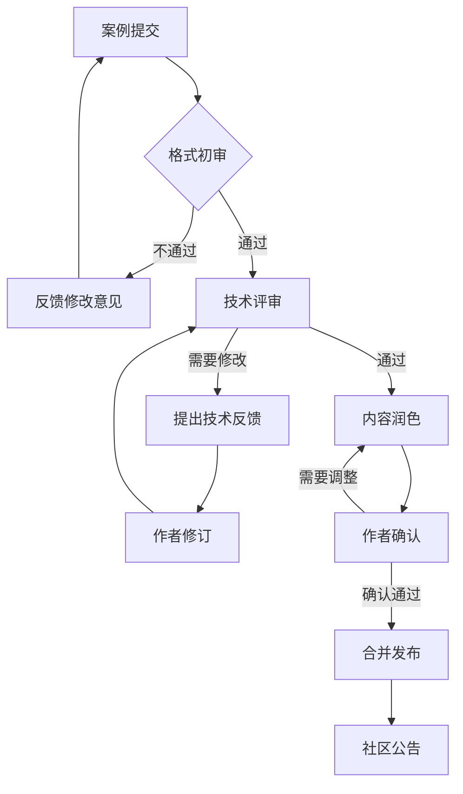

# 生产案例审核流程

本文档定义了生产案例从提交到发布的完整审核流程，确保案例质量符合项目标准。

---

## 流程概览



---

## 阶段一：格式初审

### 审核人员

社区维护者（Maintainer）

### 审核时限

1-2 个工作日

### 检查清单

| 检查项 | 要求 | 权重 |
|--------|------|------|
| **模板遵循** | 使用标准模板，结构完整 | 必须 |
| **必填字段** | 公司/行业、场景、规模、架构、挑战、方案、成果均填写 | 必须 |
| **格式规范** | Markdown 格式正确，表格/代码块渲染正常 | 必须 |
| **敏感信息** | 无敏感商业信息或已脱敏 | 必须 |
| **授权确认** | 已勾选所有授权声明 | 必须 |
| **基础质量** | 语句通顺，无明显错别字 | 建议 |

### 处理结果

- **通过** → 进入技术评审阶段
- **不通过** → 在 Issue/PR 中反馈具体问题，标记 `status:needs-revision`

---

## 阶段二：技术评审

### 审核人员

技术专家（具有相关领域经验）

### 审核时限

3-5 个工作日

### 评审维度

#### 1. 技术准确性

| 检查项 | 评分标准 |
|--------|----------|
| 架构描述 | 技术选型合理，架构图清晰 |
| 配置参数 | 关键配置正确，有解释说明 |
| 问题分析 | 根因分析准确，逻辑清晰 |
| 解决方案 | 方案可行，有实施细节 |
| 成果数据 | 数据合理，有说服力 |

#### 2. 内容深度

| 等级 | 标准 | 处理建议 |
|------|------|----------|
| ⭐⭐⭐⭐⭐ | 架构完整、挑战典型、方案创新、数据详实 | 优先发布，推荐社区 |
| ⭐⭐⭐⭐ | 内容完整，有技术亮点，可复用性强 | 正常发布 |
| ⭐⭐⭐ | 内容基本完整，但深度不足 | 建议补充后发布 |
| ⭐⭐ | 内容单薄，缺乏技术细节 | 需要大幅补充 |
| ⭐ | 不符合案例要求 | 建议改为问题讨论 |

#### 3. 实用价值

- 对社区的借鉴意义
- 问题场景的普遍性
- 解决方案的可复现性
- 经验教训的普适性

### 评审反馈模板

```markdown
## 技术评审反馈

### 总体评价
[优秀/良好/需要改进] - 简要评价

### 亮点
1.
2.

### 建议改进
#### 高优先级（建议必改）
- [ ]

#### 中优先级（建议优化）
- [ ]

#### 低优先级（可选）
- [ ]

### 疑问/需要澄清
1.

### 评审结论
- [ ] 通过，可直接进入发布流程
- [ ] 需要修订，请针对上述建议修改
- [ ] 需要补充更多信息

评审人：@username
日期：YYYY-MM-DD
```

---

## 阶段三：内容优化

### 协作方式

- 维护者与作者通过 Issue/PR 评论进行沟通
- 可使用建议修改（Suggested Changes）功能提高效率
- 重大修改建议通过 commit 直接提交到作者分支

### 优化重点

1. **可读性** - 语言流畅，逻辑清晰
2. **一致性** - 术语使用与项目其他文档一致
3. **完整性** - 补充必要的上下文信息
4. **可视化** - 建议添加架构图或流程图

---

## 阶段四：发布确认

### 最终检查清单

- [ ] 技术内容已通过评审
- [ ] 格式符合项目规范
- [ ] 敏感信息已脱敏
- [ ] Mermaid 图表渲染正常
- [ ] 链接可正常访问
- [ ] 作者确认最终内容

### 发布步骤

1. **合并到主分支**
   - 通过 PR 合并到 `main` 分支
   - 添加标签 `type:production-case`, `status:published`

2. **文件归档**
   - 文档放入 `phase2-case-studies/` 目录
   - 命名格式：`{行业}-{场景简称}-{公司简称}.md`
   - 示例：`ecommerce-realtime-risk-xxx-tech.md`

3. **索引更新**
   - 更新 `CASE-STUDIES.md` 总览文档
   - 添加案例到相关目录的索引

4. **社区公告**
   - 发布 GitHub Release Note（可选）
   - 在 Discussions 发布介绍帖

---

## 标签体系

在审核流程中使用以下标签管理案例状态：

| 标签 | 含义 | 使用阶段 |
|------|------|----------|
| `type:production-case` | 生产案例类型 | 全程 |
| `status:triage` | 待初审 | 初审阶段 |
| `status:under-review` | 技术评审中 | 评审阶段 |
| `status:needs-revision` | 需要修改 | 反馈阶段 |
| `status:approved` | 审核通过待发布 | 发布前 |
| `status:published` | 已发布 | 发布后 |
| `quality:excellent` | 优秀案例 | 发布后 |
| `industry:{名称}` | 行业分类 | 全程 |

---

## 特殊情况处理

### 敏感信息处理

如果发现案例包含敏感信息：

1. **标记** - 添加 `status:needs-redaction` 标签
2. **沟通** - 私下联系作者说明情况
3. **脱敏** - 协助作者进行信息脱敏
4. **复核** - 脱敏后重新进入审核流程

### 技术争议

如果评审过程中出现技术观点分歧：

1. 邀请更多专家参与讨论
2. 在 Discussions 开设专题讨论
3. 必要时进行技术验证
4. 以多数专家共识为准

### 作者无响应

如果作者超过 2 周未响应修改建议：

1. 发送提醒 @mention
2. 超过 4 周无响应，标记 `status:stale`
3. 超过 8 周可关闭 Issue/PR，标记 `status:abandoned`
4. 作者后续可随时重新开启

---

## 评审标准参考

### 优秀案例特征

- **真实可靠**：基于真实生产环境，数据准确
- **问题典型**：挑战具有代表性，社区普遍存在
- **方案创新**：解决方案有创新点或独特见解
- **细节丰富**：包含具体配置、代码、参数
- **成果量化**：用数据说话，有前后对比
- **经验可复用**：经验教训对其他团队有参考价值

### 常见问题

| 问题 | 表现 | 改进建议 |
|------|------|----------|
| 内容空泛 | 大量概念描述，缺乏实操细节 | 补充具体配置、代码、参数 |
| 数据缺失 | 只说"提升明显"，没有具体数字 | 补充性能测试数据 |
| 架构不清 | 技术栈罗列，缺乏整体架构图 | 绘制架构图，说明组件关系 |
| 问题模糊 | 挑战描述不具体 | 用具体场景说明问题 |
| 方案笼统 | 解决方案缺乏可操作性 | 提供配置示例和实现步骤 |

---

## 参与评审

欢迎社区成员参与案例评审！

### 如何成为评审员

1. 在流计算领域有实际生产经验
2. 熟悉本项目的文档规范
3. 在相关 Issue/PR 中表达评审意愿
4. 维护者确认后邀请加入评审团队

### 评审员职责

- 及时响应分配的案例评审任务
- 提供建设性的技术反馈
- 保持客观中立，尊重作者工作
- 遵守项目的行为准则

---

## 流程优化

本流程将持续优化，欢迎通过 Issue 提出改进建议。

---

> 最后更新：2026-04-12
