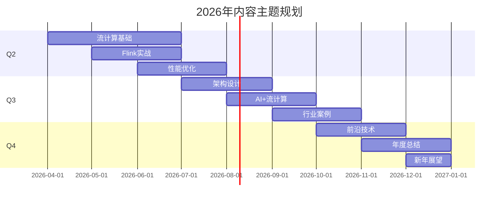
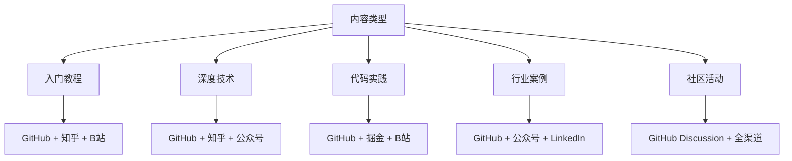

# AnalysisDataFlow 2026年内容日历

> **周期**: 2026年4月-12月 | **状态**: 已发布 | **版本**: v1.1
>
> **v4.3更新**: 已纳入10篇前沿新文档的Q2-Q3推广计划 | **更新日期**: 2026-04-18

---

## 内容日历概览

---

## 月度主题规划

### 📅 第二季度 (4月-6月)

#### 4月主题：流计算基础月

**主题描述**: 帮助新手建立流计算基础认知，普及核心概念

| 周次 | 主题 | 内容类型 | 发布渠道 |
|-----|------|---------|---------|
| W1 | 什么是流计算？入门指南 | 博客文章 | GitHub, 知乎 |
| W1 | 流计算 vs 批处理：核心差异 | 对比文章 | 掘金, 公众号 |
| W2 | Flink架构解析：从宏观到微观 | 技术深度 | GitHub, 知乎 |
| W2 | 第一个Flink程序：WordCount实战 | 代码教程 | GitHub, B站 |
| W3 | 时间语义详解：Event Time与Processing Time | 概念讲解 | 知乎, 公众号 |
| W3 | Watermark机制深入解析 | 技术文章 | GitHub, 掘金 |
| W4 | 窗口操作完全指南 | 实践教程 | GitHub, B站 |
| W4 | 4月社区月报 & 话题盘点 | 社区周报 | GitHub Discussion |

#### 5月主题：Flink实战月

**主题描述**: 深入Flink实战技巧，提升开发能力

| 周次 | 主题 | 内容类型 | 发布渠道 |
|-----|------|---------|---------|
| W1 | Flink状态管理最佳实践 | 实践指南 | GitHub, 知乎 |
| W1 | Checkpoint机制深度解析 | 技术文章 | GitHub, 掘金 |
| W2 | 容错机制：Exactly-Once实现原理 | 深度分析 | 知乎, 公众号 |
| W2 | 背压处理：Backpressure优化技巧 | 性能优化 | GitHub, B站 |
| W3 | Flink SQL入门到精通 | 系列教程 | GitHub, B站 |
| W3 | 连接器开发：自定义Source/Sink | 代码实践 | GitHub, 掘金 |
| W4 | Flink on Kubernetes部署指南 | 运维实践 | GitHub, 知乎 |
| W4 | 5月社区月报 & 问答精选 | 社区周报 | GitHub Discussion |

#### 6月主题：性能优化月

**主题描述**: 聚焦性能调优，提升流计算系统效率

| 周次 | 主题 | 内容类型 | 发布渠道 |
|-----|------|---------|---------|
| W1 | 流计算性能指标全解析 | 技术指南 | GitHub, 知乎 |
| W1 | 内存优化：避免OOM实战 | 问题排查 | GitHub, 掘金 |
| W2 | 网络优化：序列化与传输 | 性能调优 | 知乎, 公众号 |
| W2 | 并行度设置的艺术 | 配置优化 | GitHub, B站 |
| W3 | RocksDB StateBackend调优 | 深度优化 | GitHub, 掘金 |
| W3 | 监控告警体系建设 | 运维指南 | GitHub, 知乎 |
| W4 | 半年度性能优化案例集 | 案例汇总 | GitHub, 公众号 |
| W4 | Q2季度总结 & Q3展望 | 季度报告 | GitHub Discussion |

---

### 📅 第三季度 (7月-9月)

#### 7月主题：架构设计月

**主题描述**: 系统架构设计方法论，构建可扩展的流计算系统

| 周次 | 主题 | 内容类型 | 发布渠道 |
|-----|------|---------|---------|
| W1 | Lambda架构与Kappa架构对比 | 架构分析 | GitHub, 知乎 |
| W1 | 流计算系统分层设计 | 设计模式 | 掘金, 公众号 |
| W2 | 实时数仓架构实践 | 架构案例 | GitHub, 知乎 |
| W2 | 多租户资源隔离设计 | 架构设计 | GitHub, B站 |
| W3 | 边缘计算与流计算融合 | 前沿架构 | 知乎, 公众号 |
| W3 | 微服务架构下的流处理 | 架构实践 | GitHub, 掘金 |
| W4 | 架构评审：真实案例剖析 | 案例分析 | GitHub, B站 |
| W4 | 7月社区月报 | 社区周报 | GitHub Discussion |

#### 8月主题：AI+流计算月

**主题描述**: 探索AI与流计算的结合，实时智能应用

| 周次 | 主题 | 内容类型 | 发布渠道 |
|-----|------|---------|---------|
| W1 | 机器学习模型实时推理 | AI应用 | GitHub, 知乎 |
| W1 | 实时特征工程架构 | 技术实践 | 掘金, 公众号 |
| W2 | 流式异常检测算法 | 算法应用 | GitHub, B站 |
| W2 | Flink ML入门指南 | 工具教程 | GitHub, 知乎 |
| W3 | 实时推荐系统架构 | 业务案例 | 知乎, 公众号 |
| W3 | 在线学习：模型实时更新 | 前沿技术 | GitHub, 掘金 |
| W4 | AI+流计算案例集 | 案例汇总 | GitHub, B站 |
| W4 | 8月社区月报 | 社区周报 | GitHub Discussion |

#### 9月主题：行业案例月

**主题描述**: 深入行业应用，分享真实落地经验

| 周次 | 主题 | 内容类型 | 发布渠道 |
|-----|------|---------|---------|
| W1 | 电商实时大屏：双11案例 | 业务案例 | GitHub, 知乎 |
| W1 | 金融风控：实时反欺诈系统 | 行业应用 | 公众号, 掘金 |
| W2 | 物联网：边缘流处理案例 | IoT案例 | GitHub, B站 |
| W2 | 游戏：实时玩家行为分析 | 游戏行业 | GitHub, 知乎 |
| W3 | 物流：实时轨迹追踪系统 | 物流案例 | 知乎, 公众号 |
| W3 | 医疗：实时健康监测平台 | 医疗行业 | GitHub, 掘金 |
| W4 | 跨行业案例对比分析 | 综合分析 | GitHub, B站 |
| W4 | Q3季度总结 & 国庆活动预告 | 季度报告 | GitHub Discussion |

---

### 📅 第四季度 (10月-12月)

#### 10月主题：前沿技术月

**主题描述**: 追踪流计算前沿技术，探索未来方向

| 周次 | 主题 | 内容类型 | 发布渠道 |
|-----|------|---------|---------|
| W1 | 流计算技术趋势报告2026 | 趋势分析 | GitHub, 知乎 |
| W1 | Apache Flink 2.0前瞻 | 版本前瞻 | 公众号, 掘金 |
| W2 | 云原生流计算：Serverless方向 | 技术趋势 | GitHub, B站 |
| W2 | 流批一体：统一计算引擎 | 架构演进 | GitHub, 知乎 |
| W3 | 向量化执行引擎解析 | 底层技术 | 知乎, 公众号 |
| W3 | 新型存储引擎：流数据持久化 | 存储技术 | GitHub, 掘金 |
| W4 | 开源社区动态与贡献指南 | 社区建设 | GitHub, B站 |
| W4 | 10月社区月报 | 社区周报 | GitHub Discussion |

#### 11月主题：年度总结月

**主题描述**: 回顾全年成果，表彰社区贡献者

| 周次 | 主题 | 内容类型 | 发布渠道 |
|-----|------|---------|---------|
| W1 | 2026年度技术文章Top10 | 年度盘点 | GitHub, 知乎 |
| W1 | 2026年度贡献者表彰 | 社区活动 | 公众号, GitHub |
| W2 | 项目发展里程碑回顾 | 项目总结 | GitHub, B站 |
| W2 | 社区成长数据报告 | 数据分析 | GitHub, 知乎 |
| W3 | 最佳实践：年度精华合集 | 精华汇总 | 知乎, 公众号 |
| W3 | 会员故事：社区成员专访 | 人物故事 | GitHub, B站 |
| W4 | 感恩节：感谢所有贡献者 | 社区活动 | GitHub Discussion |
| W4 | 11月社区月报 & 年度调查 | 社区周报 | GitHub Discussion |

#### 12月主题：新年展望月

**主题描述**: 展望2027年，规划社区发展

| 周次 | 主题 | 内容类型 | 发布渠道 |
|-----|------|---------|---------|
| W1 | 2027技术路线图发布 | 规划发布 | GitHub, 知乎 |
| W1 | 新年学习计划推荐 | 学习指南 | 公众号, 掘金 |
| W2 | 2026年度最受欢迎内容 | 年度盘点 | GitHub, B站 |
| W2 | 社区2027年目标与计划 | 规划分享 | GitHub, 知乎 |
| W3 | 圣诞节特别活动 | 社区活动 | GitHub Discussion |
| W3 | 新年寄语：核心团队致辞 | 新年祝福 | 公众号 |
| W4 | 年终总结 & 新年展望 | 年度报告 | GitHub Discussion |
| W4 | 年度假期通知 | 运营公告 | GitHub Discussion |

---

## v4.3 前沿内容推广计划 (2026 Q2-Q3)

> **背景**: v4.3前沿补全已于2026-04-18完成，新增10篇新文档 + 2篇现有文档更新 + 188个形式化元素
> **推广目标**: 提升前沿技术内容的社区认知度，引导技术雷达ASSESS→TRIAL阶段迁移
> **核心受众**: 研究员路径、架构师路径、专家贡献者路径学习者

### v4.3 新文档清单

| 序号 | 文档标题 | 路径 | 技术雷达定位 | 学习路径对齐 |
|------|---------|------|-------------|-------------|
| 1 | LLM辅助形式化证明自动化 | `Struct/06-frontier/llm-guided-formal-proof-automation.md` | ASSESS — AI+形式化 | 研究员路径 L5 |
| 2 | Veil Framework (Lean 4) | `formal-methods/06-tools/veil-framework-lean4.md` | ASSESS — 验证工具 | 研究员路径 L5-L6 |
| 3 | 最小会话类型理论 | `Struct/01-foundation/minimal-session-types-theory.md` | ASSESS — 类型理论 | 研究员路径 阶段1 |
| 4 | DBSP理论框架 | `Struct/06-frontier/dbsp-theory-framework.md` | ASSESS — 流数据库 | 研究员路径 L6 |
| 5 | Calvin确定性执行与流处理 | `Struct/06-frontier/calvin-deterministic-streaming.md` | ASSESS — 确定性执行 | 架构师路径 第2周 |
| 6 | CD-Raft跨域共识 | `Knowledge/06-frontier/cd-raft-cross-domain-consensus.md` | TRIAL — 共识算法 | 架构师路径 第2周 |
| 7 | NIST CAISI Agent标准 | `Knowledge/06-frontier/nist-caisi-agent-standards.md` | ASSESS — AI治理 | 专家贡献者路径 |
| 8 | Flink Dynamic Iceberg Sink | `Flink/05-ecosystem/flink-dynamic-iceberg-sink-guide.md` | TRIAL — Lakehouse集成 | 数据工程师路径 |
| 9 | Agent行为契约验证 | `formal-methods/08-ai-formal-methods/agent-behavior-contract-verification.md` | ASSESS — AI安全 | 研究员路径 L5-L6 |
| 10 | Streaming Database形式化定义 | `Struct/01-foundation/streaming-database-formal-definition.md` | ASSESS — 流数据库 | 研究员路径 L6 |
| 11 | Fluss 0.8集成更新 | `Flink/05-ecosystem/fluss-integration.md` | TRIAL — 流存储 | 数据工程师路径 |
| 12 | Paimon 1.0集成更新 | `Flink/05-ecosystem/flink-paimon-integration.md` | ADOPT — 数据湖 | 数据工程师路径 |

---

### 📅 5月：形式化验证专题月（v4.3特别推广）

**主题描述**: 聚焦LLM与形式化方法的交叉前沿，推广v4.3形式化验证新文档

| 周次 | 主题 | 内容类型 | 发布渠道 | 对应v4.3文档 |
|-----|------|---------|---------|-------------|
| W1 | LLM辅助形式化证明：从理论到实践 | 技术深度 | GitHub, 知乎 | #1 LLM形式化证明 |
| W2 | Veil Framework：用Lean 4验证分布式系统 | 工具教程 | GitHub, B站 | #2 Veil Framework |
| W3 | 最小会话类型：流通信的类型安全保证 | 概念讲解 | 知乎, 公众号 | #3 最小会话类型 |
| W4 | v4.3形式化验证专题综述 | 专题汇总 | GitHub Discussion | #1-#3综合 |

**技术演讲/网络研讨会**:

- **主题**: "LLM × 形式化验证：自动化证明的新范式"
- **时间**: 5月第3周 周四 20:00
- **讲师**: 形式化验证领域贡献者
- **平台**: B站直播 + Zoom

---

### 📅 6月：分布式共识与确定性执行月（v4.3特别推广）

**主题描述**: 深入分布式系统前沿，探索确定性执行与跨域共识在流处理中的应用

| 周次 | 主题 | 内容类型 | 发布渠道 | 对应v4.3文档 |
|-----|------|---------|---------|-------------|
| W1 | Calvin模型：确定性流处理的状态管理新范式 | 技术深度 | GitHub, 知乎 | #5 Calvin确定性执行 |
| W2 | CD-Raft：跨域场景下的共识优化实践 | 架构分析 | GitHub, 掘金 | #6 CD-Raft跨域共识 |
| W3 | v4.3分布式系统前沿综述 | 综述文章 | 知乎, 公众号 | #5-#6综合 |
| W4 | 6月v4.3推广月报 & 社区问答 | 社区周报 | GitHub Discussion | - |

**技术演讲/网络研讨会**:

- **主题**: "确定性执行：从Calvin到现代流处理引擎"
- **时间**: 6月第2周 周四 20:00
- **讲师**: 分布式系统架构师
- **平台**: B站直播 + Zoom

**案例研究发布**:

- **主题**: "跨地域Flink集群的共识优化案例"
- **发布日期**: 6月第3周
- **对齐**: 架构师路径 + 专家性能调优路径

---

### 📅 7月：AI Agent治理与标准化月（v4.3特别推广）

**主题描述**: 解读NIST CAISI政策，探索AI Agent在流计算系统中的行为契约验证

| 周次 | 主题 | 内容类型 | 发布渠道 | 对应v4.3文档 |
|-----|------|---------|---------|-------------|
| W1 | NIST CAISI解读：AI Agent从"Wild West"到产业规范 | 政策解读 | GitHub, 知乎 | #7 NIST CAISI标准 |
| W2 | Agent行为契约：构建可验证的AI流处理系统 | 技术深度 | GitHub, 掘金 | #9 Agent行为契约验证 |
| W3 | AI Agent安全治理：标准落地实践指南 | 实践指南 | 公众号, B站 | #7-#9综合 |
| W4 | v4.3 AI Agent专题网络研讨会 | 网络研讨会 | 全渠道 | #7-#9综合 |

**技术演讲/网络研讨会**:

- **主题**: "AI Agent标准化之路：NIST CAISI与流计算系统的安全治理"
- **时间**: 7月第4周 周四 20:00
- **讲师**: AI安全与政策专家
- **平台**: B站直播 + Zoom + Twitter Spaces

**社交媒体推广时间线**:

- 7/1: Twitter/X 发布NIST政策解读Thread (英文)
- 7/8: LinkedIn 发布Agent治理专业文章
- 7/15: 知乎发布"AI Agent行为契约"深度问答
- 7/22: 公众号发布安全治理实践长文

---

### 📅 8月：流数据库与Lakehouse工程月（v4.3特别推广）

**主题描述**: 从DBSP理论到Flink Dynamic Iceberg Sink实战，打通流数据库的理论与工程

| 周次 | 主题 | 内容类型 | 发布渠道 | 对应v4.3文档 |
|-----|------|---------|---------|-------------|
| W1 | DBSP理论：流即数据库的数学基础 | 技术深度 | GitHub, 知乎 | #4 DBSP理论框架 |
| W2 | Flink Dynamic Iceberg Sink完整实战 | 代码实践 | GitHub, B站 | #8 Flink Iceberg Sink |
| W3 | Streaming Database：形式化定义与产业落地 | 架构分析 | 知乎, 公众号 | #10 Streaming Database定义 |
| W4 | Fluss 0.8 + Paimon 1.0：流存储新选择 | 工具评测 | GitHub, 掘金 | #11 Fluss / #12 Paimon |

**技术演讲/网络研讨会**:

- **主题**: "流数据库时代：DBSP理论与Flink Lakehouse实践"
- **时间**: 8月第3周 周四 20:00
- **讲师**: 数据平台架构师
- **平台**: B站直播 + Zoom

**案例研究发布节奏**:

- 8/15: 发布《基于Flink Dynamic Iceberg Sink的实时数仓改造案例》
- 8/22: 发布《Streaming Database在电商场景的形式化验证实践》
- 对齐: 行业电商推荐路径 + 数据工程师路径

---

### v4.3 推广效果评估指标

| 指标 | 目标值 | 评估周期 |
|------|--------|---------|
| v4.3文档页面浏览量 | 单篇≥500次 | 发布后30天 |
| 技术研讨会参与人数 | ≥200人在线 | 单场活动 |
| 社交媒体互动量 | 单篇≥50转发/点赞 | 发布后7天 |
| 学习路径完成率提升 | 研究员路径+15% | Q3末 |
| GitHub Discussion讨论数 | v4.3专题≥20条 | Q3末 |

---

## 重要日期标记

### 技术节日与活动

| 日期 | 节日/活动 | 内容安排 |
|-----|---------|---------|
| 5月1-5日 | 五一劳动节 | 休息，发布假期阅读清单 |
| 5月11日 | Apache Flink生日 | 特别文章：Flink发展历程 |
| 6月1-7日 | 科技周 | 流计算科普系列 |
| 6月18日 | 电商节 | 电商实时计算案例专题 |
| 7-8月 | 暑期学习季 | 入门教程系列推送 |
| 9月10日 | 教师节 | 感谢技术导师活动 |
| 10月1-7日 | 国庆假期 | 休息，发布假期学习资源 |
| 10月24日 | 程序员节 | 技术分享会 + 互动活动 |
| 11月11日 | 双十一 | 电商技术专题 |
| 11月第四个周四 | 感恩节 | 贡献者感谢活动 |
| 12月25日 | 圣诞节 | 社区庆祝活动 |

### 版本发布计划

| 版本 | 预计发布 | 内容安排 |
|-----|---------|---------|
| v3.10 | 2026-05-15 | 内容扩展更新 |
| v3.11 | 2026-07-20 | 夏季功能更新 |
| v4.0-beta | 2026-09-30 | 重大版本预览 |
| v4.0 | 2026-11-15 | 年度大版本发布 |
| **v4.3** | **2026-07-15** | **前沿内容深化 — 10篇新文档 + 150+形式化元素** |

---

## 发布渠道分配

### 渠道矩阵

| 渠道 | 内容类型 | 发布频率 | 最佳发布时间 |
|-----|---------|---------|-------------|
| **GitHub** | 全部内容 | 实时 | 随时 |
| **知乎专栏** | 技术深度文章 | 每周2篇 | 周二/周五 10:00 |
| **微信公众号** | 精选内容 | 每周2篇 | 周一/周四 20:00 |
| **掘金** | 代码实践 | 每周2篇 | 周三/周六 14:00 |
| **B站** | 视频教程 | 每周1个 | 周六 19:00 |
| **Twitter/X** | 英文技术内容 | 每天1-2条 | 工作日上午 |
| **LinkedIn** | 专业内容 | 每周2篇 | 工作日上午 |

### 内容类型与渠道匹配

---

## 内容生产排期

### 每周内容生产节奏

| 星期 | 工作内容 | 负责角色 |
|-----|---------|---------|
| 周一 | 周会、上周数据分析、本周选题确认 | 运营团队 |
| 周二 | 技术文章撰写（知乎/公众号） | 内容作者 |
| 周三 | 代码示例开发与测试 | 开发者 |
| 周四 | 文章编辑与排版、视频录制 | 内容团队 |
| 周五 | 内容发布、社区互动 | 运营团队 |
| 周六 | 视频剪辑与发布、社区活动 | 视频团队 |
| 周日 | 数据复盘、下周规划 | 运营团队 |

### 月度内容产量规划

| 内容类型 | 月度产量 | 累计年产量 |
|---------|---------|-----------|
| 技术博客文章 | 8篇 | 72篇 |
| 代码示例 | 4个 | 36个 |
| 视频教程 | 4个 | 36个 |
| 社区周报 | 4期 | 36期 |
| 季度报告 | - | 4期 |
| 年度报告 | - | 1期 |

---

## 附录

### 快速参考

- **内容日历负责人**: @content-team
- **内容审核流程**: 撰写 → 技术审核 → 排版 → 发布
- **紧急内容发布**: 联系 <ops@analysisdataflow.org>
- **内容素材库**: [Notion链接]

### 模板资源

| 模板类型 | 位置 |
|---------|------|
| 技术文章模板 | `.templates/tech-article.md` |
| 视频脚本模板 | `.templates/video-script.md` |
| 周报模板 | `.templates/weekly-report.md` |
| 社媒文案模板 | `.templates/social-post.md` |

---

*最后更新: 2026-04-18 (v4.3推广计划已纳入)*

*本日历将根据实际运营情况进行动态调整*
