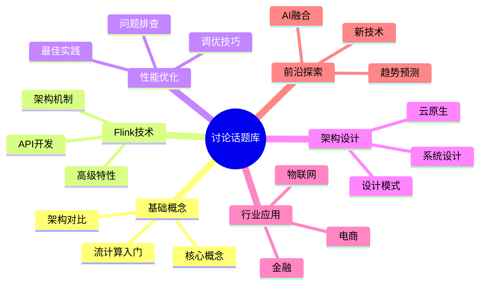

# AnalysisDataFlow 讨论话题库

> **50个精选讨论话题** | 按技术领域分类 | 最后更新: 2026-04-12

---

## 话题分类概览

---

## 一、基础概念类（8个话题）

### 1. 流计算 vs 批处理：何时选择什么？

**分类**: 基础概念 | **难度**: ⭐⭐

**话题描述**: 流计算和批处理各有适用场景，探讨在不同业务场景下的技术选型。

**引导问题**:

- 你的业务场景中，延迟要求是什么级别？
- 数据到达模式是批量还是持续？
- 计算复杂度是否适合流式处理？
- 你遇到过哪些选型的坑？

---

### 2. 时间语义深度解析：三种时间如何选择？

**分类**: 基础概念 | **难度**: ⭐⭐⭐

**话题描述**: Event Time、Processing Time、Ingestion Time 的选择策略和权衡。

**引导问题**:

- 在你的项目中使用了哪种时间语义？
- 乱序数据处理遇到过什么挑战？
- Watermark设置有哪些经验？

---

### 3. 窗口操作的艺术：从Tumbling到Session

**分类**: 基础概念 | **难度**: ⭐⭐⭐

**话题描述**: 深入探讨各种窗口类型的适用场景和使用技巧。

**引导问题**:

- 你最喜欢用哪种窗口类型？为什么？
- Session窗口的gap设置有什么讲究？
- 自定义窗口实现遇到过哪些坑？

---

### 4. 状态管理基础：有状态 vs 无状态

**分类**: 基础概念 | **难度**: ⭐⭐

**话题描述**: 理解流计算中的状态概念，以及何时需要维护状态。

**引导问题**:

- 什么场景必须使用有状态算子？
- 状态大小如何影响系统设计？
- 你如何实现跨窗口的状态共享？

---

### 5. 一致性模型：从At-Most-Once到Exactly-Once

**分类**: 基础概念 | **难度**: ⭐⭐⭐⭐

**话题描述**: 探讨不同一致性保证的实现原理和成本。

**引导问题**:

- 你的业务能接受哪种一致性级别？
- Exactly-Once的代价是什么？
- 端到端Exactly-Once如何实现？

---

### 6. 流计算系统架构对比

**分类**: 基础概念 | **难度**: ⭐⭐⭐

**话题描述**: Flink、Spark Streaming、Storm、Kafka Streams等框架对比。

**引导问题**:

- 你使用过哪些流计算框架？
- 各框架最吸引你的特性是什么？
- 迁移经验分享？

---

### 7. 数据倾斜：识别、诊断与解决

**分类**: 基础概念 | **难度**: ⭐⭐⭐⭐

**话题描述**: 流计算中常见的数据倾斜问题及解决方案。

**引导问题**:

- 如何发现数据倾斜？
- 两阶段聚合怎么实现？
- 动态负载均衡有方案吗？

---

### 8. 反压机制：保护你的流计算系统

**分类**: 基础概念 | **难度**: ⭐⭐⭐

**话题描述**: 理解反压原理，学会识别和处理反压问题。

**引导问题**:

- 反压的常见原因有哪些？
- 如何监控反压？
- 反压调优的最佳实践？

---

## 二、Flink技术类（10个话题）

### 9. Flink架构演进：从1.x到2.x的变化

**分类**: Flink技术 | **难度**: ⭐⭐⭐

**话题描述**: 追踪Flink版本的架构变化和重要特性演进。

**引导问题**:

- 你目前使用哪个Flink版本？
- 版本升级遇到过什么挑战？
- 最期待的新特性是什么？

---

### 10. Checkpoint机制：原理与调优

**分类**: Flink技术 | **难度**: ⭐⭐⭐⭐

**话题描述**: 深入理解Flink Checkpoint的实现和优化策略。

**引导问题**:

- Checkpoint间隔如何设置？
- 增量Checkpoint的优势？
- Checkpoint失败的常见原因？

---

### 11. Savepoint实战：升级与迁移

**分类**: Flink技术 | **难度**: ⭐⭐⭐

**话题描述**: 使用Savepoint进行作业升级、迁移和恢复。

**引导问题**:

- Savepoint和Checkpoint的区别？
- 跨版本兼容性如何处理？
- 状态迁移的最佳实践？

---

### 12. DataStream API设计模式

**分类**: Flink技术 | **难度**: ⭐⭐⭐

**话题描述**: 分享DataStream API的编程模式和最佳实践。

**引导问题**:

- 你常用的算子组合有哪些？
- 如何处理复杂的数据转换？
- Async I/O的使用经验？

---

### 13. Table API & SQL：流批一体实践

**分类**: Flink技术 | **难度**: ⭐⭐⭐

**话题描述**: 使用Table API和SQL简化流计算开发。

**引导问题**:

- SQL vs DataStream API，何时选择？
- 动态表的概念理解？
- SQL优化的经验分享？

---

### 14. Flink Connectors：开发自定义连接器

**分类**: Flink技术 | **难度**: ⭐⭐⭐⭐

**话题描述**: 学习如何开发自定义Source和Sink。

**引导问题**:

- 开发Connector的关键接口？
- 如何保证Source的Exactly-Once？
- Sink的幂等性设计？

---

### 15. Flink on Kubernetes：云原生实践

**分类**: Flink技术 | **难度**: ⭐⭐⭐⭐

**话题描述**: 在K8s上部署和运维Flink作业。

**引导问题**:

- Native K8s vs Standalone？
- 资源调度策略？
- 自动扩缩容方案？

---

### 16. Flink Metrics与监控体系

**分类**: Flink技术 | **难度**: ⭐⭐⭐

**话题描述**: 构建完善的Flink监控告警体系。

**引导问题**:

- 最关键的监控指标有哪些？
- 如何自定义Metrics？
- 监控Dashboard设计？

---

### 17. Flink与Pulsar/Kafka集成

**分类**: Flink技术 | **难度**: ⭐⭐⭐

**话题描述**: 消息队列与Flink的深度集成。

**引导问题**:

- Pulsar vs Kafka，如何选择？
- 消费偏移管理策略？
- 动态分区发现？

---

### 18. PyFlink：Python流计算

**分类**: Flink技术 | **难度**: ⭐⭐⭐

**话题描述**: 使用Python进行Flink开发。

**引导问题**:

- PyFlink的适用场景？
- Python UDF开发经验？
- 与Java API的功能差异？

---

## 三、性能优化类（8个话题）

### 19. JVM GC优化：流计算场景专项

**分类**: 性能优化 | **难度**: ⭐⭐⭐⭐

**话题描述**: 针对流计算场景的JVM调优策略。

**引导问题**:

- 选择哪种GC算法？
- 堆内存如何分配？
- G1 vs ZGC vs Shenandoah？

---

### 20. 序列化优化：从Kryo到Protobuf

**分类**: 性能优化 | **难度**: ⭐⭐⭐

**话题描述**: 提升数据传输和状态存储的效率。

**引导问题**:

- 各种序列化方案对比？
- Avro/Protobuf集成经验？
- POJO类型注册优化？

---

### 21. RocksDB StateBackend深度调优

**分类**: 性能优化 | **难度**: ⭐⭐⭐⭐⭐

**话题描述**: 大规模状态存储的性能优化。

**引导问题**:

- RocksDB参数调优经验？
- 增量Checkpoint配置？
- SSD vs 内存状态？

---

### 22. 网络缓冲区优化

**分类**: 性能优化 | **难度**: ⭐⭐⭐

**话题描述**: Flink网络层的性能调优。

**引导问题**:

- 网络缓冲区如何配置？
- Credit-based反压机制？
- 网络压缩是否开启？

---

### 23. 并行度设置的科学方法

**分类**: 性能优化 | **难度**: ⭐⭐⭐

**话题描述**: 合理设置作业并行度，平衡资源与性能。

**引导问题**:

- 如何计算最优并行度？
- 热点任务的并行度调整？
- 资源受限时的策略？

---

### 24. 内存诊断与OOM解决

**分类**: 性能优化 | **难度**: ⭐⭐⭐⭐

**话题描述**: 排查和解决内存相关问题。

**引导问题**:

- 常见OOM场景分析？
- 内存泄漏如何发现？
- 堆外内存管理？

---

### 25. Latency vs Throughput：权衡的艺术

**分类**: 性能优化 | **难度**: ⭐⭐⭐

**话题描述**: 根据业务需求平衡延迟和吞吐。

**引导问题**:

- 你的业务更看重哪个指标？
- 微批 vs 纯流的选择？
- 调优经验分享？

---

### 26. 生产环境性能调优案例集

**分类**: 性能优化 | **难度**: ⭐⭐⭐⭐

**话题描述**: 分享真实的生产环境调优经验。

**引导问题**:

- 印象最深的调优案例？
- 性能提升最显著的一次？
- 调优工具和技巧？

---

## 四、架构设计类（8个话题）

### 27. Lambda架构 vs Kappa架构

**分类**: 架构设计 | **难度**: ⭐⭐⭐

**话题描述**: 大数据架构模式的选择与演进。

**引导问题**:

- 你的系统采用哪种架构？
- Lambda架构的痛点？
- Kappa架构的适用场景？

---

### 28. 实时数仓架构设计

**分类**: 架构设计 | **难度**: ⭐⭐⭐⭐

**话题描述**: 构建实时数据仓库的技术方案。

**引导问题**:

- 实时数仓分层设计？
- ODS/DWD/DWS/ADS如何划分？
- 实时与离线数据一致性？

---

### 29. 多租户流计算平台设计

**分类**: 架构设计 | **难度**: ⭐⭐⭐⭐⭐

**话题描述**: 构建企业级多租户流计算平台。

**引导问题**:

- 资源隔离方案？
- 权限管理设计？
- 计量计费实现？

---

### 30. 事件驱动架构(EDA)实践

**分类**: 架构设计 | **难度**: ⭐⭐⭐

**话题描述**: 基于事件驱动的系统设计。

**引导问题**:

- EDA的优势和挑战？
- 事件 schema 管理？
- Saga 模式实现？

---

### 31. CQRS模式在流计算中的应用

**分类**: 架构设计 | **难度**: ⭐⭐⭐⭐

**话题描述**: 命令查询职责分离模式的流计算实现。

**引导问题**:

- CQRS适合什么场景？
- 读写模型同步策略？
- 最终一致性保证？

---

### 32. 微服务中的流处理

**分类**: 架构设计 | **难度**: ⭐⭐⭐

**话题描述**: 在微服务架构中集成流处理能力。

**引导问题**:

- 服务间通信选型？
- 流处理服务的边界？
- 数据一致性保障？

---

### 33. 边缘计算与流计算融合

**分类**: 架构设计 | **难度**: ⭐⭐⭐⭐

**话题描述**: 边缘侧的流数据处理架构。

**引导问题**:

- 边缘-中心协同架构？
- 边缘资源受限下的优化？
- 断网续传机制？

---

### 34. 流计算系统的容错设计

**分类**: 架构设计 | **难度**: ⭐⭐⭐⭐

**话题描述**: 构建高可用的流计算系统。

**引导问题**:

- 单点故障如何消除？
- 故障自动切换方案？
- 灾备架构设计？

---

## 五、行业应用类（8个话题）

### 35. 电商实时大屏技术方案

**分类**: 行业应用 | **难度**: ⭐⭐⭐

**话题描述**: 双11大促实时数据展示的技术实现。

**引导问题**:

- GMV实时计算如何保证准确？
- 高并发下的性能优化？
- 大屏可视化选型？

---

### 36. 金融实时风控系统

**分类**: 行业应用 | **难度**: ⭐⭐⭐⭐

**话题描述**: 毫秒级反欺诈系统的架构设计。

**引导问题**:

- 规则引擎与模型结合？
- 低延迟要求如何实现？
- 风控特征实时计算？

---

### 37. 物联网实时数据处理

**分类**: 行业应用 | **难度**: ⭐⭐⭐

**话题描述**: 海量IoT设备数据的实时处理。

**引导问题**:

- 设备数据接入方案？
- 时序数据处理？
- 设备状态实时监控？

---

### 38. 游戏实时玩家行为分析

**分类**: 行业应用 | **难度**: ⭐⭐⭐

**话题描述**: 游戏运营中的实时数据分析。

**引导问题**:

- 玩家行为实时画像？
- 实时推荐系统？
- 反作弊检测？

---

### 39. 物流实时追踪系统

**分类**: 行业应用 | **难度**: ⭐⭐⭐

**话题描述**: 全链路物流信息实时同步。

**引导问题**:

- 多源数据融合？
- 实时路径规划？
- 异常预警机制？

---

### 40. 社交媒体实时推荐

**分类**: 行业应用 | **难度**: ⭐⭐⭐⭐

**话题描述**: 内容推荐的实时计算架构。

**引导问题**:

- 实时特征计算？
- 在线学习模型更新？
- A/B测试集成？

---

### 41. 视频直播实时分析

**分类**: 行业应用 | **难度**: ⭐⭐⭐

**话题描述**: 直播场景的实时数据处理。

**引导问题**:

- 实时弹幕分析？
- 礼物收入实时统计？
- 内容审核实时处理？

---

### 42. 工业互联网实时监测

**分类**: 行业应用 | **难度**: ⭐⭐⭐⭐

**话题描述**: 工业设备的实时状态监测与预测。

**引导问题**:

- 设备传感器数据处理？
- 异常检测算法？
- 预测性维护？

---

## 六、前沿探索类（8个话题）

### 43. AI与流计算的融合：实时推理

**分类**: 前沿探索 | **难度**: ⭐⭐⭐⭐

**话题描述**: 在流计算中集成机器学习模型推理。

**引导问题**:

- 模型服务架构选型？
- TensorFlow/PyTorch集成？
- 模型版本管理？

---

### 44. 流式特征工程平台

**分类**: 前沿探索 | **难度**: ⭐⭐⭐⭐

**话题描述**: 实时机器学习特征的计算与管理。

**引导问题**:

- 特征实时计算方案？
- 特征存储选型？
- 特征一致性保障？

---

### 45. 流计算中的图处理

**分类**: 前沿探索 | **难度**: ⭐⭐⭐⭐⭐

**话题描述**: 实时图数据分析技术。

**引导问题**:

- 动态图算法？
- 图流处理框架？
- 实时关系分析？

---

### 46. Serverless流计算

**分类**: 前沿探索 | **难度**: ⭐⭐⭐

**话题描述**: 无服务器架构下的流处理。

**引导问题**:

- 冷启动问题如何解决？
- 按需付费的成本优化？
- 厂商方案对比？

---

### 47. WebAssembly与流计算

**分类**: 前沿探索 | **难度**: ⭐⭐⭐⭐

**话题描述**: WASM在流计算中的应用探索。

**引导问题**:

- WASM UDF的可行性？
- 性能对比分析？
- 多语言支持？

---

### 48. 流计算标准化与互操作

**分类**: 前沿探索 | **难度**: ⭐⭐⭐

**话题描述**: 流计算领域的标准与协议。

**引导问题**:

- SQL标准的进展？
- 云厂商互操作性？
- 数据格式标准化？

---

### 49. 流计算安全与隐私

**分类**: 前沿探索 | **难度**: ⭐⭐⭐⭐

**话题描述**: 流数据的安全处理和隐私保护。

**引导问题**:

- 流数据加密方案？
- 隐私计算集成？
- 合规性要求？

---

### 50. 2027流计算技术趋势预测

**分类**: 前沿探索 | **难度**: ⭐⭐⭐

**话题描述**: 展望流计算技术的未来发展方向。

**引导问题**:

- 最看好的技术方向？
- 云原生化趋势？
- 流批一体的演进？
- AI Native的流计算？

---

## 话题使用指南

### 如何发起讨论

1. **选择合适的话题** —— 根据技术领域和难度选择
2. **查看现有讨论** —— 避免重复发起相同话题
3. **添加话题标签** —— 使用格式：`[话题编号] 话题标题`
4. **提出具体问题** —— 结合引导问题深入讨论

### 话题标签建议

| 标签 | 用途 |
|-----|------|
| `help wanted` | 寻求帮助 |
| `experience share` | 经验分享 |
| `best practice` | 最佳实践 |
| `question` | 提问 |
| `discussion` | 开放讨论 |

### 话题活动计划

| 周期 | 活动 | 话题范围 |
|-----|------|---------|
| 每周 | 话题精选 | 1-2个热门话题 |
| 每月 | 主题月 | 某个分类深度讨论 |
| 每季度 | 话题评选 | 最佳讨论、最佳回答 |

---

## 话题统计

| 分类 | 话题数量 | 难度分布 |
|-----|---------|---------|
| 基础概念 | 8 | ⭐⭐-⭐⭐⭐⭐ |
| Flink技术 | 10 | ⭐⭐⭐-⭐⭐⭐⭐ |
| 性能优化 | 8 | ⭐⭐⭐-⭐⭐⭐⭐⭐ |
| 架构设计 | 8 | ⭐⭐⭐-⭐⭐⭐⭐⭐ |
| 行业应用 | 8 | ⭐⭐⭐-⭐⭐⭐⭐ |
| 前沿探索 | 8 | ⭐⭐⭐-⭐⭐⭐⭐⭐ |
| **总计** | **50** | - |

---

*最后更新: 2026-04-12*

*话题库将持续更新，欢迎提出新话题建议！*
