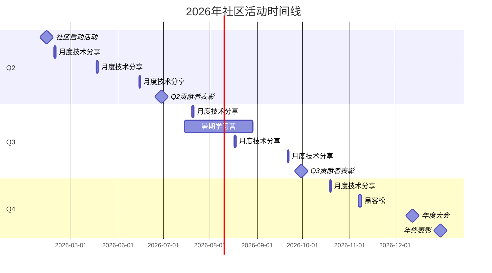
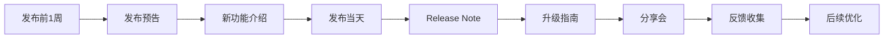

# AnalysisDataFlow 2026年社区活动计划

> **年度活动时间线** | 覆盖全年 | 最后更新: 2026-04-12

---

## 年度活动概览



---

## 线上活动规划

### 1. 月度技术分享会

**活动定位**: 核心常规活动，每月一次技术深度分享

| 项目 | 详情 |
|-----|------|
| **频率** | 每月第三个周一 20:00-21:30 (UTC+8) |
| **形式** | 线上直播 + 录播回放 |
| **平台** | B站直播 + GitHub Discussion互动 |
| **时长** | 60分钟分享 + 30分钟Q&A |
| **目标受众** | 所有社区成员 |

**年度分享主题规划**:

| 月份 | 主题 | 分享者 | 难度 |
|-----|------|-------|------|
| 4月 | 流计算入门：从零开始 | 核心维护者 | ⭐⭐ |
| 5月 | Flink Checkpoint机制深度解析 | 高级贡献者 | ⭐⭐⭐⭐ |
| 6月 | 生产环境性能调优实战 | 外部专家 | ⭐⭐⭐⭐ |
| 7月 | 实时数仓架构设计案例 | 架构师分享 | ⭐⭐⭐ |
| 8月 | AI+流计算：实时智能应用 | AI专家 | ⭐⭐⭐⭐ |
| 9月 | 流计算在电商大促中的应用 | 行业嘉宾 | ⭐⭐⭐ |
| 10月 | 云原生流计算最佳实践 | K8s专家 | ⭐⭐⭐ |
| 11月 | 2026技术趋势回顾与展望 | 核心团队 | ⭐⭐ |
| 12月 | 年度总结与新年规划 | 核心团队 | ⭐⭐ |

**分享会流程**:

```
20:00-20:05  开场介绍与社区动态
20:05-20:55  主题分享（含Demo）
20:55-21:20  问答环节
21:20-21:30  下月预告与结束
```

### 2. 在线问答会 (AMA - Ask Me Anything)

**活动定位**: 开放的问答互动，解答社区成员疑问

| 项目 | 详情 |
|-----|------|
| **频率** | 每两月一次 |
| **形式** | GitHub Discussion 异步问答 |
| **时长** | 24小时开放提问，集中4小时回复 |
| **嘉宾** | 核心维护者 + 特邀专家 |

**2026年AMA排期**:

| 日期 | 主题 | 嘉宾 |
|-----|------|------|
| 2026-05-10 | Flink使用问答 | @luyanruyr |
| 2026-07-12 | 架构设计问答 | 架构师团队 |
| 2026-09-13 | 性能优化问答 | 性能专家 |
| 2026-11-09 | 年终综合问答 | 核心团队 |

**AMA规则**:

1. 提前一周发布AMA预告
2. 活动当天开放Discussion专帖
3. 任何问题都可以提，不限制范围
4. 嘉宾在4小时内集中回复
5. 活动结束后整理FAQ文档

### 3. 线上黑客松 (Hackathon)

**活动定位**: 鼓励创新实践，促进社区协作

| 项目 | 详情 |
|-----|------|
| **时间** | 2026年11月7-8日（周末） |
| **形式** | 48小时线上编程挑战 |
| **平台** | GitHub + Discord/腾讯会议 |
| **规模** | 10-20支队伍 |

**主题方向**:

| 方向 | 描述 | 示例项目 |
|-----|------|---------|
| 🛠️ 工具创新 | 流计算开发/调试工具 | Flink作业诊断工具 |
| 📊 可视化 | 流数据可视化方案 | 实时数据大屏 |
| 🔗 连接器 | 新的数据源接入 | 特殊数据源Connector |
| 🤖 AI融合 | AI+流计算应用 | 实时异常检测 |
| 📚 教育 | 学习工具或内容 | 交互式教程 |

**奖项设置**:

| 奖项 | 数量 | 奖励 |
|-----|------|------|
| 🥇 最佳项目奖 | 1 | 证书 + 定制周边 |
| 🥈 技术创新奖 | 1 | 证书 + 技术书籍 |
| 🥉 最佳展示奖 | 1 | 证书 + 周边礼包 |
| 🌟 最佳新人奖 | 1 | 证书 + 学习资源 |
| 🏅 参与奖 | 全体 | 电子证书 |

---

## 技术分享安排

### 分享主题库

#### 基础系列

| 序号 | 主题 | 预计时长 | 目标受众 |
|-----|------|---------|---------|
| B01 | 流计算基础概念串讲 | 60分钟 | 初学者 |
| B02 | Flink开发环境搭建 | 45分钟 | 开发者 |
| B03 | 第一个Flink程序：WordCount | 45分钟 | 初学者 |
| B04 | 窗口与水印详解 | 60分钟 | 中级开发者 |
| B05 | 状态管理入门 | 60分钟 | 中级开发者 |

#### 进阶系列

| 序号 | 主题 | 预计时长 | 目标受众 |
|-----|------|---------|---------|
| A01 | Checkpoint原理与调优 | 90分钟 | 高级开发者 |
| A02 | 反压机制与处理 | 75分钟 | 高级开发者 |
| A03 | 内存管理深度解析 | 90分钟 | 高级开发者 |
| A04 | 连接器开发实战 | 90分钟 | 高级开发者 |
| A05 | SQL优化技巧 | 75分钟 | 开发者 |

#### 架构系列

| 序号 | 主题 | 预计时长 | 目标受众 |
|-----|------|---------|---------|
| S01 | 实时数仓架构设计 | 90分钟 | 架构师 |
| S02 | 多租户平台设计 | 90分钟 | 架构师 |
| S03 | 云原生流计算实践 | 75分钟 | 架构师 |
| S04 | 高可用架构设计 | 90分钟 | 架构师 |
| S05 | 性能优化方法论 | 75分钟 | 高级开发者 |

#### 案例系列

| 序号 | 主题 | 预计时长 | 目标受众 |
|-----|------|---------|---------|
| C01 | 电商实时大屏案例 | 60分钟 | 开发者 |
| C02 | 金融风控系统案例 | 75分钟 | 架构师 |
| C03 | IoT数据处理案例 | 60分钟 | 开发者 |
| C04 | 实时推荐系统案例 | 75分钟 | 架构师 |
| C05 | 游戏数据分析案例 | 60分钟 | 开发者 |

### 分享嘉宾招募

**嘉宾要求**:

- 流计算领域实战经验
- 良好的表达能力
- 愿意为社区贡献

**嘉宾权益**:

- 社区专家认证
- 优先参与社区活动
- 个人品牌曝光

**申请方式**: 发送邮件至 <speakers@analysisdataflow.org>

---

## 问答会计划

### 定期问答活动

| 活动类型 | 频率 | 形式 | 特点 |
|---------|------|------|------|
| 月度AMA | 每月 | 异步Discussion | 深度技术问题 |
| 答疑 office hours | 每周 | 在线会议 | 实时互动 |
| 新手问答专场 | 每月 | 异步Discussion | 入门问题 |

### Office Hours 安排

| 时间 | 主题 | 值班人员 |
|-----|------|---------|
| 每周三 14:00-15:00 | 技术答疑 | 轮值维护者 |
| 每周五 20:00-21:00 | 新手辅导 | 社区志愿者 |

---

## 版本发布活动

### 版本发布计划

| 版本 | 计划发布 | 活动安排 |
|-----|---------|---------|
| v3.10 | 2026-05-15 | 发布说明 + 升级指南 |
| v3.11 | 2026-07-20 | 功能亮点分享会 |
| v4.0-beta | 2026-09-30 | Beta测试活动 |
| v4.0 | 2026-11-15 | 重大版本发布会 |

### 版本发布活动流程



### v4.0 重大版本发布会

**时间**: 2026年11月15日 20:00
**形式**: 线上直播发布会
**议程**:

| 时间 | 内容 | 主讲人 |
|-----|------|-------|
| 20:00-20:10 | 开场 & 项目回顾 | 项目负责人 |
| 20:10-20:30 | v4.0新特性介绍 | 技术负责人 |
| 20:30-20:50 | 性能提升对比 | 性能专家 |
| 20:50-21:10 | 迁移升级指南 | 架构师 |
| 21:10-21:30 | 未来路线图 | 产品负责人 |
| 21:30-21:45 | Q&A | 全体 |

---

## 季度特别活动

### Q2: 社区启动季

**时间**: 2026年4月-6月
**主题**: 社区基础建设与新成员招募

| 活动 | 时间 | 内容 |
|-----|------|------|
| 社区启动派对 | 4月15日 | 线上庆祝社区正式运营 |
| 新成员招募月 | 5月整月 | 多渠道推广，吸引新成员 |
| Q2贡献者表彰 | 6月30日 | 首批贡献者表彰 |

### Q3: 技术深耕季

**时间**: 2026年7月-9月
**主题**: 技术深度内容与学习活动

| 活动 | 时间 | 内容 |
|-----|------|------|
| 暑期学习营 | 7月15日-8月31日 | 系列学习活动 |
| 技术深度月 | 8月整月 | 深度技术文章挑战 |
| Q3贡献者表彰 | 9月30日 | 季度贡献者表彰 |

### Q4: 年度总结季

**时间**: 2026年10月-12月
**主题**: 年度总结与社区庆典

| 活动 | 时间 | 内容 |
|-----|------|------|
| 年度调查 | 10月整月 | 社区满意度调查 |
| 线上黑客松 | 11月7-8日 | 编程挑战赛 |
| 年度技术大会 | 12月12日 | 年度技术盛宴 |
| 年终表彰大会 | 12月31日 | 年度贡献者表彰 |

---

## 年度大会 (Community Summit 2026)

### 基本信息

| 项目 | 详情 |
|-----|------|
| **时间** | 2026年12月12日 13:00-18:00 |
| **形式** | 线上直播 |
| **平台** | B站 + 腾讯会议 |
| **规模** | 预计200+参与者 |

### 大会议程

```
13:00-13:15  开幕致辞 & 2026年度回顾
13:15-13:45  主题演讲：流计算技术趋势

13:45-14:30  Session 1: 架构实践
             - 实时数仓架构演进
             - 云原生流计算实践

14:30-14:45  茶歇

14:45-15:30  Session 2: 性能优化
             - 大规模集群优化经验
             - 性能调优案例分享

15:30-16:15  Session 3: 行业应用
             - 电商场景实践
             - 金融行业应用

16:15-16:30  茶歇

16:30-17:15  Session 4: 前沿探索
             - AI与流计算
             - 新技术展望

17:15-17:45  年度贡献者表彰
17:45-18:00  2027路线图发布 & 闭幕
```

---

## 活动资源

### 宣传物料

| 物料 | 用途 | 规格 |
|-----|------|------|
| 活动海报 | 各渠道宣传 | 1080x1920 |
| 社交媒体图 | 微信/微博 | 900x500 |
| 直播封面 | B站/视频号 | 1280x720 |
| PPT模板 | 分享会使用 | 16:9标准 |

### 活动平台配置

| 平台 | 用途 | 配置 |
|-----|------|------|
| GitHub Discussion | 活动预告 & 讨论 | 活动专帖 |
| B站 | 直播 & 回放 | 官方账号 |
| 腾讯会议 | 线上会议 | 付费版 |
| 问卷星 | 活动报名 | 免费版 |

---

## 活动数据统计

### 年度活动汇总

| 活动类型 | 次数 | 预计参与人次 |
|---------|------|-------------|
| 月度技术分享 | 9次 | 900+ |
| 问答会 (AMA) | 4次 | 400+ |
| Office Hours | 52次 | 500+ |
| 黑客松 | 1次 | 100+ |
| 版本发布会 | 4次 | 800+ |
| 年度大会 | 1次 | 200+ |
| **总计** | **71次** | **2900+** |

---

## 附录

### 活动日历订阅

```
ICS订阅链接: https://analysisdataflow.org/events/calendar.ics
Google Calendar: analysisdataflow.org@gmail.com
```

### 联系信息

- **活动策划**: <events@analysisdataflow.org>
- **嘉宾合作**: <speakers@analysisdataflow.org>
- **赞助咨询**: <sponsor@analysisdataflow.org>

### 相关文档

- [COMMUNITY-OPERATIONS-PLAYBOOK.md](../COMMUNITY-OPERATIONS-PLAYBOOK.md) - 运营手册
- [content-calendar-2026.md](./content-calendar-2026.md) - 内容日历

---

*最后更新: 2026-04-12*

*活动计划可能根据实际情况调整，请关注最新公告*
