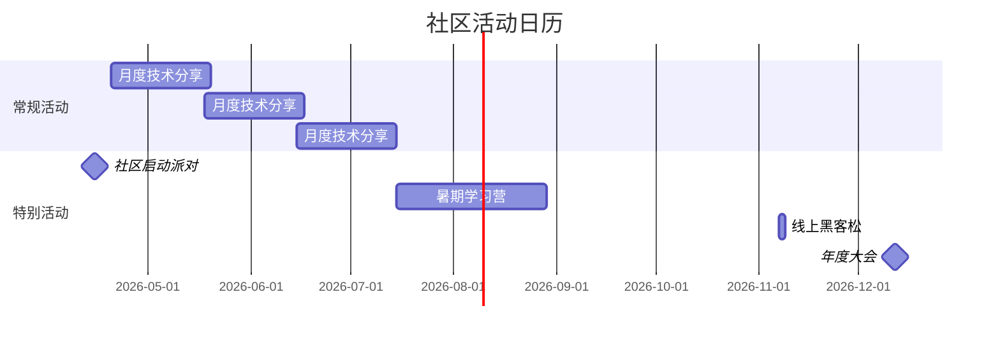
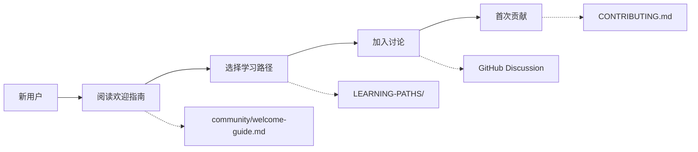

# 🎉 AnalysisDataFlow 社区正式启航

> **发布日期**: 2026年4月12日 | **阅读时间**: 3分钟

---

亲爱的开发者、架构师、研究员朋友们：

今天，我们怀着激动的心情宣布：**AnalysisDataFlow 社区正式启航！** 🚀

经过长期的筹备和建设，我们的社区基础设施已完善，现在正式向所有对流计算感兴趣的朋友敞开大门。

---

## 🌟 我们是谁

**AnalysisDataFlow** 是一个专注于流计算领域的开源知识库项目，致力于：

- 📚 **构建最全面的流计算知识体系** —— 从理论到实践，从入门到精通
- 🎯 **提供最严谨的技术内容** —— 采用形式化方法，确保知识准确性
- 🤝 **打造最友好的技术社区** —— 无论你是新手还是专家，都能找到归属感

### 我们的成果

```
📖 核心文档        250+ 篇
🔢 形式化元素      9,300+ 个 (定理/定义/引理)
⚡ Flink专项       382 篇深度文档
🎓 学习路径        4 条完整路径
🌍 英文文档        4 篇核心内容
```

---

## 🎁 社区为你准备了什么

### 1. 丰富的学习资源

| 资源 | 内容 | 适合人群 |
|-----|------|---------|
| 📚 **Struct/** | 形式理论、严格证明 | 研究者、理论爱好者 |
| 🧠 **Knowledge/** | 知识结构、设计模式 | 架构师、开发者 |
| ⚡ **Flink/** | Flink专项深度内容 | Flink开发者 |
| 🗺️ **学习路径** | 结构化学习路线 | 所有学习者 |
| 📺 **视频教程** | 视频形式学习 | 视觉学习者 |

### 2. 活跃的技术社区

- 💬 **GitHub Discussion** —— 技术交流、问题求助、经验分享
- ❓ **问答专区** —— 快速获得问题解答
- 💡 **创意讨论** —— 分享你的想法和建议
- 🎯 **Show and Tell** —— 展示你的项目和成果

### 3. 定期的社区活动



**即将举行的活动**：

| 日期 | 活动 | 主题 |
|-----|------|------|
| 4月15日 | 🎊 社区启动派对 | 庆祝社区正式运营 |
| 4月20日 | 📺 月度技术分享 | 流计算入门：从零开始 |
| 5月10日 | ❓ AMA问答会 | Flink使用问题答疑 |
| 5月18日 | 📺 月度技术分享 | Checkpoint机制深度解析 |

### 4. 完善的贡献体系

无论你是：

- 🐛 发现并报告问题
- 📝 改进文档内容
- 💻 分享代码示例
- 💬 回答社区问题
- 🔗 传播推广项目

每一份贡献都会被认可，每一次参与都有价值！

---

## 🚀 如何加入社区

### 第一步：关注我们

| 平台 | 链接 | 用途 |
|-----|------|------|
| ⭐ GitHub | [github.com/luyanruyr/AnalysisDataFlow](https://github.com/luyanruyr/AnalysisDataFlow) | 代码仓库、Issue、PR |
| 💬 Discussion | [GitHub Discussions](https://github.com/luyanruyr/AnalysisDataFlow/discussions) | 社区讨论 |
| 📺 B站 | 搜索 "AnalysisDataFlow" | 视频教程、直播 |
| 📱 微信公众号 | 搜索 "AnalysisDataFlow" | 精选文章 |

### 第二步：开始探索



1. 📖 **阅读欢迎指南** —— [community/welcome-guide.md](./welcome-guide.md)
2. 🗺️ **选择学习路径** —— 根据背景选择合适的学习路线
3. 💬 **加入讨论** —— 在 GitHub Discussion 中自我介绍
4. ✨ **首次贡献** —— 从修复一个错别字开始

### 第三步：参与活动

- 📅 **关注活动日历** —— [community/events-2026.md](./events-2026.md)
- 🔔 **订阅通知** —— 开启 GitHub Watch 获取最新动态
- 📧 **加入邮件列表** —— 重要活动邮件通知

---

## 🎯 我们的承诺

作为社区运营团队，我们承诺：

| 承诺 | 具体措施 |
|-----|---------|
| ✅ **及时响应** | 问题通常在24小时内得到回应 |
| ✅ **尊重包容** | 无论经验水平，每个人都受到尊重 |
| ✅ **持续更新** | 每周新内容，持续完善知识体系 |
| ✅ **透明开放** | 所有决策公开，欢迎参与讨论 |
| ✅ **贡献认可** | 每一份贡献都会被记录和感谢 |

---

## 📣 特别感谢

在社区建设过程中，我们得到了许多朋友的帮助和支持：

- 每一位提出建议和反馈的朋友
- 所有参与内容审核和贡献的志愿者
- 关注和支持项目发展的每一位朋友

**谢谢你们！** 🙏

---

## 🎊 加入我们，一起创造

流计算是一个快速发展的领域，我们坚信：**开放协作的力量**。

无论你是：

- 🎓 刚开始学习的学生
- 💼 寻找解决方案的开发者
- 🏗️ 设计系统的架构师
- 🔬 探索前沿的研究者

这里都有属于你的位置。

**让我们一起**：

- 📚 构建最全面的流计算知识库
- 🌉 连接理论与实践
- 🤝 帮助更多人掌握流计算技术
- 🚀 推动流计算领域的发展

---

## 🔗 快速导航

| 资源 | 链接 |
|-----|------|
| 📖 欢迎指南 | [community/welcome-guide.md](./welcome-guide.md) |
| 🤝 社区指南 | [COMMUNITY.md](../COMMUNITY.md) |
| 📝 贡献指南 | [CONTRIBUTING.md](../CONTRIBUTING.md) |
| 📅 活动日历 | [community/events-2026.md](./events-2026.md) |
| 💬 讨论话题 | [community/discussion-topics.md](./discussion-topics.md) |
| 📋 运营手册 | [COMMUNITY-OPERATIONS-PLAYBOOK.md](../COMMUNITY-OPERATIONS-PLAYBOOK.md) |

---

## 📞 联系我们

- 💬 **社区讨论**: [GitHub Discussion](https://github.com/luyanruyr/AnalysisDataFlow/discussions)
- 📧 **社区邮箱**: <community@analysisdataflow.org>
- 🐦 **Twitter/X**: @AnalysisDataFlow
- 📱 **微信公众号**: AnalysisDataFlow

---

**准备好了吗？**

⭐ **Star 我们的项目**，支持社区发展
💬 **加入 Discussion**，开始你的社区之旅
🔔 **分享给朋友**，让更多人知道我们

**AnalysisDataFlow 社区，期待你的加入！** 🎉

---

*发布日期: 2026年4月12日*
*社区运营团队*
*AnalysisDataFlow*

---

## 附录：社区基础设施一览

```
AnalysisDataFlow 社区运营体系
│
├── 📋 运营文档
│   ├── COMMUNITY-OPERATIONS-PLAYBOOK.md  (运营手册)
│   └── community/
│       ├── content-calendar-2026.md      (内容日历)
│       ├── welcome-guide.md              (欢迎指南)
│       ├── discussion-topics.md          (讨论话题库)
│       ├── events-2026.md                (活动计划)
│       └── launch-announcement.md        (本文件)
│
├── 🤝 社区指南
│   ├── COMMUNITY.md                      (社区指南)
│   ├── CONTRIBUTING.md                   (贡献指南)
│   ├── CODE_OF_CONDUCT.md                (行为准则)
│   └── LEARNING-PATHS/                   (学习路径)
│
├── 📅 活动平台
│   ├── GitHub Discussion                 (核心讨论区)
│   ├── B站/视频号                         (视频内容)
│   └── 微信公众号                         (精选文章)
│
└── 📊 运营数据
    ├── 内容日历覆盖: 2026年4月-12月
    ├── 活动计划: 71场
    └── 讨论话题: 50个
```

---

**再次欢迎！让我们一起构建最好的流计算知识库！** 🚀
