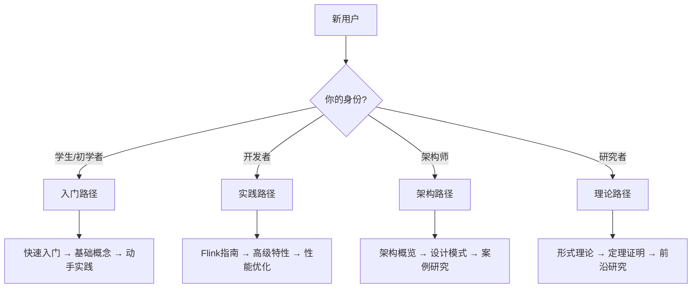

# 🎉 欢迎来到 AnalysisDataFlow 社区

> **新用户指南** | 阅读时间: 5分钟 | 最后更新: 2026-04-12

---

## 👋 你好，新朋友

欢迎加入 **AnalysisDataFlow** —— 流计算领域最全面的开源知识库！

无论你是：

- 🎓 **初学者** —— 刚开始学习流计算
- 💼 **开发者** —— 正在使用Flink或其他流计算框架
- 🏗️ **架构师** —— 设计流计算系统
- 🔬 **研究者** —— 探索流计算理论
- 👔 **决策者** —— 评估流计算技术选型

这里都有适合你的内容和社区支持！

---

## 🚀 5分钟快速开始

### 第一步：了解项目（1分钟）

**AnalysisDataFlow** 是一个开源的流计算知识库，包含：

| 模块 | 内容 | 规模 |
|-----|------|------|
| 📚 **Struct/** | 形式理论、严格证明 | 78篇文档，380+定理 |
| 🧠 **Knowledge/** | 知识结构、设计模式 | 241篇文档，80+定理 |
| ⚡ **Flink/** | Flink专项深度内容 | 391篇文档，700+定理 |
| 🌍 **en/** | 英文核心文档 | 14篇文档 |

**核心价值**：

- ✅ **系统性** —— 从理论到实践的完整知识体系
- ✅ **严谨性** —— 形式化方法确保准确性
- ✅ **实用性** —— 结合实际案例，可直接应用

### 第二步：找到你的学习路径（2分钟）

根据你的背景选择合适的路径：



### 第三步：加入社区（1分钟）

| 行动 | 链接 | 说明 |
|-----|------|------|
| ⭐ Star项目 | [GitHub仓库](https://github.com/luyanruyr/AnalysisDataFlow) | 支持项目发展 |
| 💬 加入讨论 | [GitHub Discussion](https://github.com/luyanruyr/AnalysisDataFlow/discussions) | 参与技术交流 |
| 🐛 报告问题 | [Issues](https://github.com/luyanruyr/AnalysisDataFlow/issues) | 帮助我们改进 |

### 第四步：开始探索（1分钟）

从以下文档开始：

1. 📖 [QUICK-START.md](../QUICK-START.md) —— 5分钟项目概览
2. 🗺️ [LEARNING-PATHS/](../LEARNING-PATHS/) —— 结构化学习路线
3. 📋 [INDEX.md](../INDEX.md) —— 完整内容索引

---

## 📚 快速开始路径

### 🌱 路径一：入门路径（适合初学者）

**目标**: 建立流计算基础认知，完成第一个流处理程序

**预计时间**: 2-4周

| 阶段 | 内容 | 文档链接 | 预计时间 |
|-----|------|---------|---------|
| 1 | 流计算基础概念 | [快速入门](../QUICK-START.md) | 1天 |
| 2 | 环境搭建 | Flink官方文档 | 1天 |
| 3 | WordCount实战 | examples/wordcount/ | 2天 |
| 4 | 核心概念深入学习 | Knowledge/基础概念/ | 1周 |
| 5 | 小项目实践 | 实时词频统计 | 1周 |
| 6 | 复习与巩固 | 参与社区问答 | 1周 |

**里程碑**: 能够独立编写简单的Flink程序

### 💻 路径二：实践路径（适合开发者）

**目标**: 掌握Flink开发技能，能够完成生产级应用

**预计时间**: 4-8周

| 阶段 | 内容 | 文档链接 | 预计时间 |
|-----|------|---------|---------|
| 1 | Flink架构理解 | Flink/架构/ | 3天 |
| 2 | DataStream API | Flink/DataStream/ | 1周 |
| 3 | 状态管理 | Flink/状态/ | 1周 |
| 4 | Checkpoint与容错 | Flink/容错/ | 1周 |
| 5 | 窗口与时间语义 | Flink/窗口/ | 1周 |
| 6 | 连接器开发 | Flink/连接器/ | 1周 |
| 7 | 性能调优 | Flink/性能优化/ | 1周 |
| 8 | 生产实践 | CASE-STUDIES.md | 1周 |

**里程碑**: 能够设计和实现生产级流计算应用

### 🏗️ 路径三：架构路径（适合架构师）

**目标**: 掌握流计算系统设计方法论

**预计时间**: 6-10周

| 阶段 | 内容 | 文档链接 | 预计时间 |
|-----|------|---------|---------|
| 1 | 流计算架构概览 | ARCHITECTURE.md | 1周 |
| 2 | 设计模式学习 | Knowledge/设计模式/ | 2周 |
| 3 | 系统设计原则 | DESIGN-PRINCIPLES.md | 1周 |
| 4 | 性能与扩展性 | BENCHMARK-REPORT.md | 1周 |
| 5 | 容错与高可用 | Knowledge/可靠性/ | 1周 |
| 6 | 案例研究 | CASE-STUDIES.md | 2周 |
| 7 | 架构评审实践 | 参与讨论 | 2周 |

**里程碑**: 能够设计可扩展、高可用的流计算系统架构

### 🔬 路径四：理论路径（适合研究者）

**目标**: 深入理解流计算理论基础

**预计时间**: 8-12周

| 阶段 | 内容 | 文档链接 | 预计时间 |
|-----|------|---------|---------|
| 1 | 形式化方法基础 | Struct/基础/ | 2周 |
| 2 | 进程演算 | Struct/进程演算/ | 2周 |
| 3 | Dataflow模型 | Struct/Dataflow/ | 2周 |
| 4 | 一致性理论 | Struct/一致性/ | 2周 |
| 5 | 类型理论 | Struct/类型/ | 2周 |
| 6 | 前沿研究 | 论文阅读 | 2周 |

**里程碑**: 能够阅读和理解流计算领域的学术论文

---

## ❓ 常见问题解答

### 关于项目

**Q: AnalysisDataFlow 是什么？**

A: AnalysisDataFlow 是一个开源的流计算知识库项目，致力于构建从理论到实践的完整、严谨的流计算知识体系。项目包含形式理论、工程实践、案例分析等多个维度的内容。

**Q: 项目内容免费吗？**

A: 是的，所有内容完全免费开源，遵循项目LICENSE协议。

**Q: 项目多久更新一次？**

A: 我们采用持续更新的方式，每周都会有新内容发布。重大版本更新通常在季度末。

### 关于贡献

**Q: 我可以贡献内容吗？**

A: 非常欢迎！请查看 [CONTRIBUTING.md](../CONTRIBUTING.md) 了解详细的贡献流程。

**Q: 贡献需要什么条件？**

A: 任何对流计算感兴趣的人都可以贡献。无论是修复一个错别字，还是贡献一篇技术文章，都是有价值的贡献。

**Q: 贡献有奖励吗？**

A: 是的！我们会为贡献者颁发徽章、在月报中致谢，优秀贡献者还会获得社区荣誉证书。

**Q: 我不确定我的贡献是否合适？**

A: 可以先在 GitHub Discussion 中提出你的想法，社区会给予反馈。

### 关于使用

**Q: 内容可以用于商业用途吗？**

A: 请查看项目LICENSE了解具体的使用条款。一般情况下，注明出处后可以使用。

**Q: 发现内容有误怎么办？**

A: 欢迎通过 GitHub Issue 报告问题，或直接提交 PR 修复。

**Q: 有PDF版本可以下载吗？**

A: 部分核心文档提供PDF导出，请查看 [PDF-EXPORT-GUIDE.md](../PDF-EXPORT-GUIDE.md)。

**Q: 有英文版本吗？**

A: 核心文档已提供英文版本，位于 `en/` 目录下。

### 关于社区

**Q: 如何参与社区讨论？**

A: 加入我们的 [GitHub Discussion](https://github.com/luyanruyr/AnalysisDataFlow/discussions)，选择相应的分类参与讨论。

**Q: 遇到问题可以在哪里求助？**

A: 推荐顺序：

1. 搜索文档和已有Discussion
2. 在 Q&A 分类下提问
3. 在相关文档下评论

**Q: 有微信群/QQ群吗？**

A: 目前主要通过 GitHub Discussion 进行异步交流，这样可以保留知识沉淀。

---

## 🤝 贡献方式说明

### 你可以这样贡献

| 贡献方式 | 难度 | 说明 |
|---------|-----|------|
| ⭐ Star项目 | ⭐ | 给项目点个Star，帮助我们获得更多关注 |
| 🐛 报告问题 | ⭐ | 发现错误？报告Issue帮助我们改进 |
| 📝 建议改进 | ⭐⭐ | 对文档有改进建议？提出你的想法 |
| 💬 参与讨论 | ⭐⭐ | 在Discussion中回答问题、分享经验 |
| 🔗 分享传播 | ⭐⭐ | 将项目分享给更多人 |
| 🌍 翻译文档 | ⭐⭐⭐ | 帮助翻译文档到更多语言 |
| ✏️ 撰写内容 | ⭐⭐⭐ | 贡献技术文章、教程或案例 |
| 💻 提交代码 | ⭐⭐⭐⭐ | 贡献代码示例、工具脚本 |
| 🧪 验证内容 | ⭐⭐⭐ | 测试文档中的代码示例 |

### 首次贡献指南

**最简单的首次贡献**：

1. 找到项目中的一个错别字或失效链接
2. Fork 项目仓库
3. 在 fork 的仓库中修复问题
4. 提交 Pull Request
5. 等待审核合并

**首次贡献示例**（修复错别字）：

```bash
# 1. Fork 项目后克隆你的 fork
git clone https://github.com/YOUR_USERNAME/AnalysisDataFlow.git
cd AnalysisDataFlow

# 2. 创建分支
git checkout -b fix-typo-in-readme

# 3. 修改文件（修复错别字）
# ... 编辑文件 ...

# 4. 提交修改
git add .
git commit -m "docs: fix typo in README.md"

# 5. 推送到你的 fork
git push origin fix-typo-in-readme

# 6. 在 GitHub 上创建 Pull Request
```

### 贡献者成长路径


---

## 📞 获取帮助

### 自助资源

| 资源 | 链接 | 适用场景 |
|-----|------|---------|
| 📖 文档中心 | [INDEX.md](../INDEX.md) | 查找特定主题 |
| 🔍 搜索指南 | [SEARCH-GUIDE.md](../SEARCH-GUIDE.md) | 学习如何搜索 |
| ❓ FAQ | [FAQ.md](../FAQ.md) | 常见问题 |
| 🗺️ 路线图 | [ROADMAP.md](../ROADMAP.md) | 了解项目规划 |

### 人工支持

| 渠道 | 响应时间 | 适用场景 |
|-----|---------|---------|
| GitHub Discussion | 24小时内 | 一般性问题 |
| GitHub Issue | 48小时内 | Bug报告、功能建议 |
| 邮件 | 3天内 | 私密问题、商业合作 |

### 紧急联系

- **安全问题**: <security@analysisdataflow.org>
- **社区事务**: <community@analysisdataflow.org>

---

## 🎯 下一步行动

选择一项行动，立即开始：

- [ ] ⭐ Star [项目仓库](https://github.com/luyanruyr/AnalysisDataFlow)
- [ ] 📖 阅读 [快速入门](../QUICK-START.md)
- [ ] 💬 加入 [GitHub Discussion](https://github.com/luyanruyr/AnalysisDataFlow/discussions) 并自我介绍
- [ ] 🗺️ 选择一条 [学习路径](#-快速开始路径) 开始
- [ ] 🐛 报告发现的第一个问题
- [ ] ✏️ 提出第一个改进建议

---

## 🌟 社区承诺

我们承诺为每一位社区成员提供：

- ✅ **尊重与包容** —— 无论你的经验水平如何
- ✅ **及时响应** —— 问题通常在24小时内得到回应
- ✅ **建设性反馈** —— 帮助你持续成长
- ✅ **知识共享** —— 共同构建最好的流计算知识库

---

## 📚 延伸阅读

- [COMMUNITY.md](../COMMUNITY.md) —— 完整的社区指南
- [CONTRIBUTING.md](../CONTRIBUTING.md) —— 贡献指南
- [CODE_OF_CONDUCT.md](../CODE_OF_CONDUCT.md) —— 行为准则
- [COMMUNITY-OPERATIONS-PLAYBOOK.md](../COMMUNITY-OPERATIONS-PLAYBOOK.md) —— 运营手册

---

**再次欢迎来到 AnalysisDataFlow 社区！**

我们期待着你的参与和贡献。让我们一起构建最好的流计算知识库！ 🚀

---

*最后更新: 2026-04-12*
