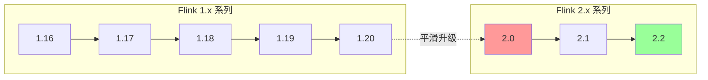

# Flink 兼容性矩阵

> 所属阶段: Knowledge | 前置依赖: [Flink生态体系](Knowledge/) | 形式化等级: L2

本文档提供 Apache Flink 全生态系统的兼容性矩阵，涵盖版本升级、连接器、语言绑定、云平台及生态组件的完整兼容性信息。

---

## 1. Flink 版本兼容性

### 1.1 版本支持生命周期

| 版本 | 发布日期 | 终止支持 | 状态 | 推荐场景 |
|:---:|:---:|:---:|:---:|:---|
| Flink 1.16 | 2022-10 | 2024-03 | ⚠️ EOL | 遗留系统维护 |
| Flink 1.17 | 2023-03 | 2024-09 | ⚠️ EOL | 遗留系统维护 |
| Flink 1.18 | 2023-10 | 2025-03 | ⚠️ EOL | 过渡期系统 |
| Flink 1.19 | 2024-03 | 2025-09 | ✅ 维护中 | 稳定生产环境 |
| Flink 1.20 | 2024-08 | 2026-03 | ✅ 维护中 | 稳定生产环境 |
| Flink 2.0 | 2024-11 | 2026-08 | ✅ 维护中 | 新架构采用 |
| Flink 2.1 | 2025-03 | 2027-03 | ✅ 维护中 | 推荐新版本 |
| Flink 2.2 | 2025-08 | 2027-08 | ✅ 维护中 | 最新稳定版 |

### 1.2 核心特性兼容性矩阵

| 特性/版本 | 1.16 | 1.17 | 1.18 | 1.19 | 1.20 | 2.0 | 2.1 | 2.2 |
|:---|:---:|:---:|:---:|:---:|:---:|:---:|:---:|:---:|
| **Checkpointing** |
| Unaligned Checkpoint | ✅ | ✅ | ✅ | ✅ | ✅ | ✅ | ✅ | ✅ |
| Incremental Checkpoint | ✅ | ✅ | ✅ | ✅ | ✅ | ✅ | ✅ | ✅ |
| Native Incremental (RocksDB) | ✅ | ✅ | ✅ | ✅ | ✅ | ✅ | ✅ | ✅ |
| Generic Incremental | ❌ | ❌ | ✅ | ✅ | ✅ | ✅ | ✅ | ✅ |
| Checkpoint Cleanup (TTL) | ❌ | ✅ | ✅ | ✅ | ✅ | ✅ | ✅ | ✅ |
| **Watermarking** |
| Watermark Alignment | ✅ | ✅ | ✅ | ✅ | ✅ | ✅ | ✅ | ✅ |
| Watermark Propagation | ✅ | ✅ | ✅ | ✅ | ✅ | ✅ | ✅ | ✅ |
| Idle Source Handling | ✅ | ✅ | ✅ | ✅ | ✅ | ✅ | ✅ | ✅ |
| Watermark Fusion | ❌ | ❌ | ❌ | ❌ | ✅ | ✅ | ✅ | ✅ |
| **State Backend** |
| HashMap State Backend | ✅ | ✅ | ✅ | ✅ | ✅ | ✅ | ✅ | ✅ |
| RocksDB State Backend | ✅ | ✅ | ✅ | ✅ | ✅ | ✅ | ✅ | ✅ |
| ForStDB State Backend | ❌ | ❌ | ❌ | ❌ | ❌ | ✅ | ✅ | ✅ |
| Disaggregated State (Preview) | ❌ | ❌ | ❌ | ❌ | ❌ | ❌ | ✅ | ✅ |
| **Connector API** |
| Source API (New) | ✅ | ✅ | ✅ | ✅ | ✅ | ✅ | ✅ | ✅ |
| Sink API (New) | ✅ | ✅ | ✅ | ✅ | ✅ | ✅ | ✅ | ✅ |
| Async Sink | ✅ | ✅ | ✅ | ✅ | ✅ | ✅ | ✅ | ✅ |
| Hybrid Source | ✅ | ✅ | ✅ | ✅ | ✅ | ✅ | ✅ | ✅ |
| **部署模式** |
| Session Cluster | ✅ | ✅ | ✅ | ✅ | ✅ | ✅ | ✅ | ✅ |
| Per-Job Cluster (Deprecated) | ✅ | ✅ | ⚠️ | ❌ | ❌ | ❌ | ❌ | ❌ |
| Application Mode | ✅ | ✅ | ✅ | ✅ | ✅ | ✅ | ✅ | ✅ |
| Native K8s | ✅ | ✅ | ✅ | ✅ | ✅ | ✅ | ✅ | ✅ |
| Standalone | ✅ | ✅ | ✅ | ✅ | ✅ | ✅ | ✅ | ✅ |
| **Table API/SQL** |
| SQL Gateway | ✅ | ✅ | ✅ | ✅ | ✅ | ✅ | ✅ | ✅ |
| SQL Client | ✅ | ✅ | ✅ | ✅ | ✅ | ✅ | ✅ | ✅ |
| Materialized Table | ❌ | ❌ | ❌ | ❌ | ❌ | ✅ | ✅ | ✅ |
| Time Travel Query | ❌ | ❌ | ❌ | ❌ | ❌ | ❌ | ✅ | ✅ |
| **Streaming SQL** |
| Match Recognize | ✅ | ✅ | ✅ | ✅ | ✅ | ✅ | ✅ | ✅ |
| Window Top-N | ✅ | ✅ | ✅ | ✅ | ✅ | ✅ | ✅ | ✅ |
| Window Deduplicate | ✅ | ✅ | ✅ | ✅ | ✅ | ✅ | ✅ | ✅ |
| Async Lookup Join | ✅ | ✅ | ✅ | ✅ | ✅ | ✅ | ✅ | ✅ |
| **Batch SQL** |
| SQL/ML (AI Functions) | ❌ | ❌ | ❌ | ❌ | ❌ | ❌ | ✅ | ✅ |
| Adaptive Batch Scheduler | ❌ | ✅ | ✅ | ✅ | ✅ | ✅ | ✅ | ✅ |

### 1.3 升级路径与破坏性变更

#### 升级路径图



#### 主要破坏性变更 (Breaking Changes)

| 版本 | 变更项 | 影响范围 | 迁移建议 |
|:---:|:---|:---|:---|
| **1.17** | 移除 `setParallelism()` 旧重载 | DataStream API | 使用新签名 `setParallelism(int, boolean)` |
| **1.17** | Scala API 独立发布 | Scala 用户 | 添加 `flink-scala` 显式依赖 |
| **1.18** | 弃用 `DataSet` API | 批处理用户 | 迁移至 DataStream (统一模式) 或 Table API |
| **1.18** | `QueryableState` 移除 | 状态查询 | 使用 Embedded Journal 或外部存储 |
| **1.19** | 默认 Checkpoint 格式变更 | 状态管理 | 显式指定 `checkpointStorage` |
| **1.19** | `StreamExecutionEnvironment` 简化 | 环境配置 | 使用 `Configuration` 对象替代 |
| **2.0** | **统一批流 API (DataStream)** | 所有用户 | 强制迁移，`DataSet` 彻底移除 |
| **2.0** | 状态存储格式 V2 | 有状态作业 | 使用 `state.backend.incremental` 迁移 |
| **2.0** | 默认 Checkpoint 间隔调整 | 容错配置 | 显式配置 `execution.checkpointing.interval` |
| **2.0** | 移除 `flink-runtime-web` 默认依赖 | Web UI | 显式添加依赖 |
| **2.0** | 新的序列化框架 (PojoSerializer V2) | 自定义类型 | 测试序列化兼容性 |
| **2.1** | Source/Sink 接口调整 | 自定义连接器 | 实现新接口方法 |
| **2.2** | Checkpoint 存储路径变更 | 状态后端 | 更新 `state.checkpoints.dir` 配置 |

---

## 2. 连接器兼容性

### 2.1 Kafka 连接器兼容性

| Flink 版本 | Kafka Client | Kafka Broker | 功能特性 | 状态 |
|:---:|:---:|:---:|:---|:---:|
| **Flink 1.16** | 2.8.x - 3.2.x | 0.11+ | 基础 Source/Sink, 精确一次 | ⚠️ EOL |
| **Flink 1.16** | 3.0+ | 2.0+ | 新 Source API, 分区发现 | ⚠️ EOL |
| **Flink 1.17** | 2.8.x - 3.3.x | 0.11+ | 水印传播优化 | ⚠️ EOL |
| **Flink 1.17** | 3.0+ | 2.0+ | 动态分区发现增强 | ⚠️ EOL |
| **Flink 1.18** | 2.8.x - 3.4.x | 0.11+ | 事务超时优化 | ⚠️ EOL |
| **Flink 1.18** | 3.0+ | 2.0+ | 客户端配置改进 | ⚠️ EOL |
| **Flink 1.19** | 2.8.x - 3.5.x | 0.11+ | 异步提交增强 | ✅ 稳定 |
| **Flink 1.19** | 3.0+ | 2.0+ | 初始偏移量策略改进 | ✅ 稳定 |
| **Flink 1.20** | 2.8.x - 3.6.x | 0.11+ | 性能优化 | ✅ 稳定 |
| **Flink 1.20** | 3.0+ | 2.0+ | Schema Registry 集成 | ✅ 稳定 |
| **Flink 2.0** | 2.8.x - 3.7.x | 1.0+ | 统一批流 Source | ✅ 推荐 |
| **Flink 2.0** | 3.4+ | 2.4+ | KRaft 模式支持 | ✅ 推荐 |
| **Flink 2.1** | 2.8.x - 3.8.x | 1.0+ | 元数据列增强 | ✅ 最新 |
| **Flink 2.1** | 3.4+ | 2.4+ | 消费者组协议 KIP-848 | ✅ 最新 |
| **Flink 2.2** | 2.8.x - 3.9.x | 1.0+ | 性能调优 | ✅ 最新 |
| **Flink 2.2** | 3.5+ | 2.5+ | 完整 KRaft 支持 | ✅ 最新 |

**说明:**

- `kafka-client` 版本需与 Flink 连接器版本匹配
- Kafka 0.11+ 支持事务消息（精确一次语义）
- Kafka 2.4+ 推荐使用 `kafka` 连接器（非 `kafka-0.x`）

### 2.2 存储系统兼容性

| 存储系统 | Flink 版本 | 连接器版本 | 读取 | 写入 | 精确一次 | 流批一体 |
|:---|:---:|:---:|:---:|:---:|:---:|:---:|
| **HDFS** | 1.16-1.20 | 内置 | ✅ | ✅ | ✅ | ✅ |
| **HDFS** | 2.0-2.2 | 内置 | ✅ | ✅ | ✅ | ✅ |
| **S3** | 1.16-1.20 | 内置 | ✅ | ✅ | ✅ | ✅ |
| **S3** | 2.0-2.2 | 内置 | ✅ | ✅ | ✅ | ✅ |
| **GCS** | 1.16-1.20 | `flink-gs-fs-hadoop` | ✅ | ✅ | ✅ | ✅ |
| **GCS** | 2.0-2.2 | `flink-gs-fs-hadoop` | ✅ | ✅ | ✅ | ✅ |
| **Azure Blob** | 1.16-1.20 | `flink-azure-fs-hadoop` | ✅ | ✅ | ✅ | ✅ |
| **Azure Blob** | 2.0-2.2 | `flink-azure-fs-hadoop` | ✅ | ✅ | ✅ | ✅ |
| **OSS** | 1.16-1.20 | `flink-oss-fs-hadoop` | ✅ | ✅ | ✅ | ✅ |
| **OSS** | 2.0-2.2 | `flink-oss-fs-hadoop` | ✅ | ✅ | ✅ | ✅ |
| **COS** | 1.16-1.20 | `flink-cos-fs-hadoop` | ✅ | ✅ | ✅ | ✅ |
| **COS** | 2.0-2.2 | `flink-cos-fs-hadoop` | ✅ | ✅ | ✅ | ✅ |
| **MinIO** | 1.16-2.2 | S3 兼容 | ✅ | ✅ | ✅ | ✅ |
| **Ceph** | 1.16-2.2 | S3 兼容 | ✅ | ✅ | ✅ | ✅ |

**Checkpoint 存储兼容性:**

| 存储系统 | 状态后端 | 增量Checkpoint | 原生增量 | 推荐场景 |
|:---|:---:|:---:|:---:|:---|
| HDFS | RocksDB/HashMap | ✅ | ✅ | 大规模生产 |
| S3 | RocksDB/HashMap | ✅ | ✅ | 云原生部署 |
| GCS | RocksDB/HashMap | ✅ | ⚠️ | GCP 环境 |
| Azure Blob | RocksDB/HashMap | ✅ | ✅ | Azure 环境 |
| NAS/NFS | RocksDB/HashMap | ✅ | ❌ | 本地测试 |

### 2.3 数据库连接器兼容性

| 数据库 | Flink 版本 | 连接器 | 版本 | Source | Sink | Lookup Join | CDC |
|:---|:---:|:---|:---:|:---:|:---:|:---:|:---:|
| **JDBC (Generic)** | 1.16-2.2 | `flink-connector-jdbc` | 3.x | ✅ | ✅ | ✅ | ❌ |
| **MySQL** | 1.16-2.2 | `flink-connector-jdbc` | 3.x | ✅ | ✅ | ✅ | ❌ |
| **MySQL** | 1.16-2.2 | `flink-cdc-connectors` | 2.x-3.x | ✅ | ❌ | ✅ | ✅ |
| **PostgreSQL** | 1.16-2.2 | `flink-connector-jdbc` | 3.x | ✅ | ✅ | ✅ | ❌ |
| **PostgreSQL** | 1.16-2.2 | `flink-cdc-connectors` | 2.x-3.x | ✅ | ❌ | ✅ | ✅ |
| **Oracle** | 1.16-2.2 | `flink-connector-jdbc` | 3.x | ✅ | ✅ | ✅ | ❌ |
| **Oracle** | 1.16-2.2 | `flink-cdc-connectors` | 2.x-3.x | ✅ | ❌ | ✅ | ✅ |
| **SQL Server** | 1.16-2.2 | `flink-connector-jdbc` | 3.x | ✅ | ✅ | ✅ | ❌ |
| **SQL Server** | 1.16-2.2 | `flink-cdc-connectors` | 2.x-3.x | ✅ | ❌ | ✅ | ✅ |
| **MongoDB** | 1.16-2.2 | `flink-connector-mongodb` | 1.x | ✅ | ✅ | ✅ | ⚠️ |
| **Elasticsearch** | 1.16-1.17 | `flink-connector-elasticsearch` | 7.x | ✅ | ✅ | ❌ | ❌ |
| **Elasticsearch** | 1.18-2.2 | `flink-connector-elasticsearch` | 8.x | ✅ | ✅ | ❌ | ❌ |
| **OpenSearch** | 1.16-2.2 | `flink-connector-opensearch` | 1.x | ✅ | ✅ | ❌ | ❌ |
| **Redis** | 1.16-2.2 | `flink-connector-redis` | 社区版 | ❌ | ✅ | ✅ | ❌ |
| **Cassandra** | 1.16-2.2 | `flink-connector-cassandra` | 3.x | ✅ | ✅ | ❌ | ❌ |
| **DynamoDB** | 1.16-2.2 | `flink-connector-dynamodb` | 内置 | ✅ | ✅ | ❌ | ❌ |
| **BigQuery** | 1.16-2.2 | `flink-connector-bigquery` | 社区版 | ✅ | ✅ | ❌ | ❌ |
| **ClickHouse** | 1.16-2.2 | `flink-connector-clickhouse` | 社区版 | ✅ | ✅ | ✅ | ❌ |
| **StarRocks** | 1.16-2.2 | `flink-connector-starrocks` | 社区版 | ✅ | ✅ | ✅ | ❌ |
| **Doris** | 1.16-2.2 | `flink-connector-doris` | 社区版 | ✅ | ✅ | ✅ | ❌ |
| **HBase** | 1.16-2.2 | `flink-connector-hbase` | 2.4+ | ✅ | ✅ | ✅ | ❌ |
| **Hive** | 1.16-2.2 | `flink-connector-hive` | 3.x | ✅ | ✅ | ❌ | ❌ |

**CDC 连接器详细兼容性:**

| 数据源 | CDC 版本 | Flink CDC 版本 | 支持版本 | 初始快照 | 增量捕获 |
|:---|:---:|:---:|:---:|:---:|:---:|
| MySQL | 5.6-8.0 | 2.4-3.1 | 全版本 | ✅ | ✅ |
| PostgreSQL | 10-16 | 2.4-3.1 | 全版本 | ✅ | ✅ |
| Oracle | 11-21 | 2.4-3.1 | 全版本 | ✅ | ✅ |
| SQL Server | 2017-2022 | 2.4-3.1 | 全版本 | ✅ | ✅ |
| TiDB | 5.1-7.x | 2.4-3.1 | 全版本 | ✅ | ✅ |
| OceanBase | 3.x-4.x | 2.4-3.1 | 全版本 | ✅ | ✅ |

---

## 3. 语言兼容性

### 3.1 Java 版本要求

| Flink 版本 | 最低 Java | 推荐 Java | 最高 Java | 说明 |
|:---:|:---:|:---:|:---:|:---|
| **1.16** | 8 | 11 | 17 | Java 17 实验性支持 |
| **1.17** | 8 | 11 | 17 | Java 17 正式支持 |
| **1.18** | 8 | 11 | 17 | 完全兼容 Java 17 |
| **1.19** | 8 | 11/17 | 21 | Java 21 实验性支持 |
| **1.20** | 8 | 17 | 21 | Java 21 正式支持 |
| **2.0** | 11 | 17 | 21 | Java 8 不再支持 |
| **2.1** | 11 | 17 | 21 | 完全兼容 Java 21 |
| **2.2** | 11 | 17/21 | 23 | Java 23 实验性支持 |

**Java 模块系统 (JPMS) 支持:**

| Flink 版本 | `module-info.java` | 自动模块 | 建议 |
|:---:|:---:|:---:|:---|
| 1.16-1.20 | ❌ | ✅ | 使用 classpath |
| 2.0-2.2 | ⚠️ (部分) | ✅ | 混合模式，逐步迁移 |

### 3.2 Scala 版本要求

| Flink 版本 | Scala 2.11 | Scala 2.12 | Scala 2.13 | Scala 3.x | 说明 |
|:---:|:---:|:---:|:---:|:---:|:---|
| **1.16** | ❌ | ✅ | ✅ | ❌ | 2.11 已移除 |
| **1.17** | ❌ | ✅ | ✅ | ❌ | 独立发布 |
| **1.18** | ❌ | ✅ | ✅ | ⚠️ | Scala 3 实验性 |
| **1.19** | ❌ | ✅ | ✅ | ⚠️ | Scala 3 改进 |
| **1.20** | ❌ | ✅ | ✅ | ✅ | Scala 3.3+ 支持 |
| **2.0** | ❌ | ✅ | ✅ | ✅ | 推荐 Scala 2.13+ |
| **2.1** | ❌ | ✅ | ✅ | ✅ | 完全兼容 Scala 3 |
| **2.2** | ❌ | ✅ | ✅ | ✅ | Scala 3.4+ 支持 |

**Scala API 依赖声明:**

```xml
<!-- Flink 1.17+ Scala 依赖需显式声明 -->
<dependency>
    <groupId>org.apache.flink</groupId>
    <artifactId>flink-scala_2.12</artifactId>
    <version>${flink.version}</version>
</dependency>
```

### 3.3 Python 版本要求 (PyFlink)

| Flink 版本 | Python 3.7 | Python 3.8 | Python 3.9 | Python 3.10 | Python 3.11 | Python 3.12 | 说明 |
|:---:|:---:|:---:|:---:|:---:|:---:|:---:|:---|
| **1.16** | ✅ | ✅ | ✅ | ✅ | ⚠️ | ❌ | 3.11 实验性 |
| **1.17** | ✅ | ✅ | ✅ | ✅ | ✅ | ❌ | 3.11 正式支持 |
| **1.18** | ✅ | ✅ | ✅ | ✅ | ✅ | ❌ | 3.7 弃用 |
| **1.19** | ⚠️ | ✅ | ✅ | ✅ | ✅ | ❌ | 3.7 移除 |
| **1.20** | ❌ | ✅ | ✅ | ✅ | ✅ | ⚠️ | 3.12 实验性 |
| **2.0** | ❌ | ✅ | ✅ | ✅ | ✅ | ✅ | 3.12 正式支持 |
| **2.1** | ❌ | ✅ | ✅ | ✅ | ✅ | ✅ | 推荐 3.10+ |
| **2.2** | ❌ | ✅ | ✅ | ✅ | ✅ | ✅ | 3.13 实验性 |

**PyFlink 依赖版本:**

| 依赖 | Flink 1.16-1.18 | Flink 1.19-1.20 | Flink 2.0+ |
|:---|:---:|:---:|:---:|
| Apache Beam | 2.38.0 | 2.48.0 | 2.56.0+ |
| py4j | 0.10.9.7 | 0.10.9.7 | 0.10.9.7 |
| numpy | >=1.21.0 | >=1.21.0 | >=1.22.0 |
| pandas | >=1.3.0 | >=1.3.0 | >=1.5.0 |
| pyarrow | >=5.0.0 | >=5.0.0 | >=10.0.0 |

---

## 4. 云平台兼容性

### 4.1 AWS 服务兼容性

| AWS 服务 | Flink 版本 | 集成方式 | 认证方式 | 部署支持 | 功能特性 |
|:---|:---:|:---:|:---:|:---:|:---|
| **Amazon EMR** | 1.16-2.2 | 托管服务 | IAM Role | ✅ | 完整 Flink 支持，自动扩缩容 |
| **Amazon EKS** | 1.16-2.2 | K8s Operator | IAM Role/IRSA | ✅ | 原生 K8s 集成 |
| **Amazon MSK** | 1.16-2.2 | Kafka Connector | IAM Auth | ✅ | SASL/SSL，精确一次 |
| **Amazon Kinesis** | 1.16-2.2 | Kinesis Connector | IAM Role | ✅ | Source/Sink，精确一次 |
| **Amazon S3** | 1.16-2.2 | FileSystem/Hadoop | IAM Role | ✅ | Checkpoint，Savepoint |
| **Amazon RDS** | 1.16-2.2 | JDBC Connector | 密码/IAM Auth | ✅ | MySQL/PostgreSQL 支持 |
| **Amazon DynamoDB** | 1.16-2.2 | DynamoDB Connector | IAM Role | ✅ | Sink，批量写入 |
| **Amazon OpenSearch** | 1.16-2.2 | OpenSearch Connector | IAM Auth | ✅ | Sink，批量索引 |
| **AWS Glue** | 1.16-2.2 | Glue Catalog | IAM Role | ✅ | Schema 注册，元数据 |
| **AWS Lambda** | 1.16-2.2 | 自定义 Sink | IAM Role | ⚠️ | 异步调用，限流处理 |
| **Amazon Redshift** | 1.16-2.2 | JDBC Connector | IAM Auth | ✅ | 批量加载 |
| **AWS Secrets Manager** | 1.16-2.2 | 配置注入 | IAM Role | ✅ | 敏感配置管理 |
| **Amazon CloudWatch** | 1.16-2.2 | Metrics Reporter | IAM Role | ✅ | 自定义指标上报 |
| **AWS Fargate** | 1.16-2.2 | Standalone | IAM Role | ✅ | 无服务器容器部署 |

**AWS 认证方式矩阵:**

| 认证方式 | EMR | EKS | MSK | S3 | RDS | DynamoDB |
|:---:|:---:|:---:|:---:|:---:|:---:|:---:|
| IAM Instance Role | ✅ | ❌ | ❌ | ✅ | ❌ | ✅ |
| IAM Service Account (IRSA) | ❌ | ✅ | ✅ | ✅ | ❌ | ✅ |
| Access Key/Secret | ✅ | ✅ | ✅ | ✅ | ✅ | ✅ |
| Web Identity Token | ✅ | ✅ | ✅ | ✅ | ❌ | ✅ |
| VPC Endpoint | ✅ | ✅ | ✅ | ✅ | ✅ | ✅ |

### 4.2 Azure 服务兼容性

| Azure 服务 | Flink 版本 | 集成方式 | 认证方式 | 部署支持 | 功能特性 |
|:---|:---:|:---:|:---:|:---:|:---|
| **Azure HDInsight** | 1.16-2.2 | 托管集群 | AAD/SP | ✅ | 完整 Flink 支持 |
| **Azure Kubernetes Service** | 1.16-2.2 | K8s Operator | AAD Workload ID | ✅ | 原生 K8s 集成 |
| **Azure Event Hubs** | 1.16-2.2 | Kafka Protocol | SAS/AAD | ✅ | 兼容 Kafka 协议 |
| **Azure Blob Storage** | 1.16-2.2 | Hadoop FileSystem | AAD/Account Key | ✅ | Checkpoint，Savepoint |
| **Azure Data Lake Gen2** | 1.16-2.2 | Hadoop FileSystem | AAD/SP | ✅ | Hierarchical 命名空间 |
| **Azure SQL Database** | 1.16-2.2 | JDBC Connector | AAD/密码 | ✅ | 托管实例支持 |
| **Azure Cosmos DB** | 1.16-2.2 | CosmosDB Connector | Key/AAD | ✅ | NoSQL API 支持 |
| **Azure Synapse Analytics** | 1.16-2.2 | JDBC Connector | AAD/SP | ✅ | 专用 SQL 池 |
| **Azure Monitor** | 1.16-2.2 | Metrics Reporter | AAD/SP | ✅ | 指标和日志集成 |
| **Azure Key Vault** | 1.16-2.2 | 配置注入 | AAD/SP | ✅ | 机密管理 |
| **Azure Service Bus** | 1.16-2.2 | 自定义 Connector | SAS/AAD | ⚠️ | 消息队列集成 |
| **Azure Cognitive Search** | 1.16-2.2 | 自定义 Sink | Key/AAD | ⚠️ | 索引构建 |
| **Azure Machine Learning** | 1.16-2.2 | SDK 集成 | AAD/SP | ⚠️ | 模型推理服务 |

**Azure 认证方式矩阵:**

| 认证方式 | HDInsight | AKS | Event Hubs | Blob/ADLS | SQL DB | Cosmos DB |
|:---:|:---:|:---:|:---:|:---:|:---:|:---:|
| AAD Service Principal | ✅ | ✅ | ✅ | ✅ | ✅ | ✅ |
| AAD Managed Identity | ✅ | ✅ | ✅ | ✅ | ✅ | ✅ |
| AAD Workload Identity | ❌ | ✅ | ✅ | ✅ | ✅ | ✅ |
| Shared Access Signature | ✅ | ❌ | ✅ | ✅ | ❌ | ✅ |
| Account/Access Key | ✅ | ❌ | ❌ | ✅ | ❌ | ✅ |
| AAD User Identity | ✅ | ❌ | ❌ | ❌ | ✅ | ❌ |

### 4.3 GCP 服务兼容性

| GCP 服务 | Flink 版本 | 集成方式 | 认证方式 | 部署支持 | 功能特性 |
|:---|:---:|:---:|:---:|:---:|:---|
| **Google Cloud Dataproc** | 1.16-2.2 | 托管集群 | IAM/Service Account | ✅ | 完整 Flink 支持 |
| **Google Kubernetes Engine** | 1.16-2.2 | K8s Operator | Workload Identity | ✅ | 原生 K8s 集成 |
| **Google Cloud Pub/Sub** | 1.16-2.2 | Pub/Sub Connector | Service Account | ✅ | Source/Sink，精确一次 |
| **Google Cloud Storage** | 1.16-2.2 | Hadoop FileSystem | Service Account | ✅ | Checkpoint，Savepoint |
| **BigQuery** | 1.16-2.2 | BigQuery Connector | Service Account | ✅ | Sink，流式插入 |
| **Cloud SQL** | 1.16-2.2 | JDBC Connector | IAM/密码 | ✅ | MySQL/PostgreSQL |
| **Cloud Spanner** | 1.16-2.2 | Spanner Connector | Service Account | ✅ | 分布式 SQL |
| **Firestore** | 1.16-2.2 | 自定义 Connector | Service Account | ⚠️ | NoSQL 文档存储 |
| **Bigtable** | 1.16-2.2 | HBase API | Service Account | ✅ | HBase 兼容 API |
| **Dataflow** | 1.16-2.2 | 替代方案 | N/A | ❌ | Flink 与 Dataflow 互斥 |
| **Cloud Monitoring** | 1.16-2.2 | Metrics Reporter | Service Account | ✅ | 自定义指标 |
| **Secret Manager** | 1.16-2.2 | 配置注入 | Service Account | ✅ | 机密管理 |
| **Cloud Run** | 1.16-2.2 | Standalone | Service Account | ⚠️ | 有限支持 |

**GCP 认证方式矩阵:**

| 认证方式 | Dataproc | GKE | Pub/Sub | GCS | BigQuery | Cloud SQL |
|:---:|:---:|:---:|:---:|:---:|:---:|:---:|
| Service Account Key | ✅ | ✅ | ✅ | ✅ | ✅ | ✅ |
| Workload Identity | ❌ | ✅ | ✅ | ✅ | ✅ | ✅ |
| Application Default Credentials | ✅ | ✅ | ✅ | ✅ | ✅ | ✅ |
| VM Service Account | ✅ | ❌ | ✅ | ✅ | ✅ | ✅ |
| User Credentials (ADC) | ✅ | ✅ | ✅ | ✅ | ✅ | ✅ |

---

## 5. 生态组件兼容性

### 5.1 Kubernetes 版本兼容性

| Flink 版本 | K8s 1.22 | K8s 1.23 | K8s 1.24 | K8s 1.25 | K8s 1.26 | K8s 1.27 | K8s 1.28 | K8s 1.29 | K8s 1.30 | K8s 1.31 |
|:---:|:---:|:---:|:---:|:---:|:---:|:---:|:---:|:---:|:---:|:---:|
| **1.16** | ✅ | ✅ | ✅ | ✅ | ⚠️ | ❌ | ❌ | ❌ | ❌ | ❌ |
| **1.17** | ✅ | ✅ | ✅ | ✅ | ✅ | ⚠️ | ❌ | ❌ | ❌ | ❌ |
| **1.18** | ✅ | ✅ | ✅ | ✅ | ✅ | ✅ | ⚠️ | ❌ | ❌ | ❌ |
| **1.19** | ✅ | ✅ | ✅ | ✅ | ✅ | ✅ | ✅ | ⚠️ | ❌ | ❌ |
| **1.20** | ✅ | ✅ | ✅ | ✅ | ✅ | ✅ | ✅ | ✅ | ⚠️ | ❌ |
| **2.0** | ⚠️ | ✅ | ✅ | ✅ | ✅ | ✅ | ✅ | ✅ | ✅ | ⚠️ |
| **2.1** | ❌ | ✅ | ✅ | ✅ | ✅ | ✅ | ✅ | ✅ | ✅ | ✅ |
| **2.2** | ❌ | ⚠️ | ✅ | ✅ | ✅ | ✅ | ✅ | ✅ | ✅ | ✅ |

**Flink Kubernetes Operator 兼容性:**

| Operator 版本 | 支持的 Flink 版本 | 最低 K8s | 推荐 K8s | 特性 |
|:---:|:---|:---:|:---:|:---|
| 1.3.x | 1.15-1.17 | 1.22 | 1.24-1.25 | 基础功能 |
| 1.4.x | 1.15-1.18 | 1.23 | 1.25-1.26 | 自动调优 |
| 1.5.x | 1.16-1.19 | 1.24 | 1.26-1.27 | SQL Runner |
| 1.6.x | 1.16-1.20 | 1.25 | 1.27-1.28 | 会话模式 |
| 1.7.x | 1.17-2.0 | 1.26 | 1.28-1.29 | 2.0 支持 |
| 1.8.x | 1.17-2.1 | 1.27 | 1.29-1.30 | 多版本管理 |
| 1.9.x | 1.18-2.2 | 1.28 | 1.30-1.31 | 最新稳定 |

**Kubernetes 特性支持:**

| 特性 | 最低 K8s 版本 | Flink 版本 | 说明 |
|:---|:---:|:---:|:---|
| Native K8s Integration | 1.9 | 1.10+ | 原生 K8s 支持 |
| HA with K8s HA Services | 1.16 | 1.12+ | K8s ConfigMap HA |
| Leader Election | 1.16 | 1.12+ | 嵌入式 Journal |
| Sidecar Injection | 1.18 | 1.10+ | Istio/Envoy 支持 |
| Pod Security Standards | 1.22 | 1.14+ | 受限安全策略 |
| Generic Ephemeral Volumes | 1.23 | 1.15+ | 临时存储 |
| CSI Driver | 1.23 | 1.15+ | 持久化存储 |
| Horizontal Pod Autoscaler v2 | 1.23 | 1.16+ | 基于自定义指标扩缩容 |
| Pod Disruption Budget | 1.21 | 1.14+ | 优雅停机 |
| Topology Spread Constraints | 1.19 | 1.14+ | 拓扑分布 |
| Service Mesh (Istio) | 1.16 | 1.12+ | 服务网格集成 |

### 5.2 Helm Chart 兼容性

| Chart | Chart 版本 | Flink 版本 | K8s 版本 | 功能特性 |
|:---|:---:|:---:|:---:|:---|
| **flink-operator** | 1.9.x | 1.18-2.2 | 1.28-1.31 | 官方 Operator |
| **flink-operator** | 1.8.x | 1.17-2.1 | 1.27-1.30 | 多版本管理 |
| **flink-operator** | 1.7.x | 1.16-2.0 | 1.26-1.29 | 基础功能 |
| **flink-job** | 1.5.x | 1.18-2.2 | 1.26+ | 作业部署模板 |
| **flink-job** | 1.4.x | 1.16-1.20 | 1.24+ | 会话/作业模式 |
| **flink-history-server** | 1.2.x | 1.16-2.2 | 1.24+ | 历史服务器 |
| **flink-sql-gateway** | 1.1.x | 1.17-2.2 | 1.24+ | SQL Gateway |

**社区 Helm Charts:**

| Chart 来源 | Chart 名称 | 活跃度 | 推荐度 | 说明 |
|:---|:---|:---:|:---:|:---|
| Apache Flink 官方 | flink-kubernetes-operator | 高 | ⭐⭐⭐⭐⭐ | 推荐使用 |
| Bitnami | flink | 中 | ⭐⭐⭐⭐ | 通用部署 |
| Ververica | flink-operator | 中 | ⭐⭐⭐⭐ | 企业版特性 |
| spotify | flink-on-k8s-operator | 低 | ⭐⭐ | 已归档 |

### 5.3 监控工具兼容性

| 监控工具 | Flink 版本 | 集成方式 | 指标收集 | 日志收集 | 链路追踪 | Dashboard |
|:---|:---:|:---:|:---:|:---:|:---:|:---:|
| **Prometheus + Grafana** | 1.16-2.2 | Prometheus Reporter | ✅ | ❌ | ❌ | ✅ |
| **Prometheus Operator** | 1.16-2.2 | ServiceMonitor | ✅ | ❌ | ❌ | ✅ |
| **InfluxDB** | 1.16-2.2 | InfluxDB Reporter | ✅ | ❌ | ❌ | ⚠️ |
| **Datadog** | 1.16-2.2 | Datadog Reporter | ✅ | ✅ | ⚠️ | ✅ |
| **OpenTelemetry** | 1.18-2.2 | OTel Exporter | ✅ | ✅ | ✅ | ⚠️ |
| **Jaeger** | 1.16-2.2 | OpenTracing Bridge | ❌ | ❌ | ✅ | ✅ |
| **Zipkin** | 1.16-2.2 | OpenTracing Bridge | ❌ | ❌ | ✅ | ✅ |
| **Elastic APM** | 1.16-2.2 | APM Agent | ✅ | ✅ | ✅ | ✅ |
| **SkyWalking** | 1.16-2.2 | SW Agent | ✅ | ✅ | ✅ | ✅ |
| **Grafana Tempo** | 1.18-2.2 | OTel Integration | ❌ | ❌ | ✅ | ✅ |
| **Loki** | 1.16-2.2 | Log Appender | ❌ | ✅ | ❌ | ✅ |
| **ELK Stack** | 1.16-2.2 | Logstash/Beats | ⚠️ | ✅ | ❌ | ✅ |
| **Fluentd/Fluent Bit** | 1.16-2.2 | Log Forwarder | ❌ | ✅ | ❌ | ❌ |
| **Zabbix** | 1.16-2.2 | JMX/Zabbix Sender | ✅ | ❌ | ❌ | ✅ |
| **Nagios** | 1.16-2.2 | JMX/Plugin | ✅ | ❌ | ❌ | ✅ |

**Flink Metrics Reporter 配置兼容性:**

| Reporter | Flink 1.16 | Flink 1.17 | Flink 1.18 | Flink 1.19 | Flink 1.20 | Flink 2.0+ |
|:---|:---:|:---:|:---:|:---:|:---:|:---:|
| prometheus | ✅ | ✅ | ✅ | ✅ | ✅ | ✅ |
| prometheus-pushgateway | ✅ | ✅ | ✅ | ✅ | ✅ | ✅ |
| influxdb | ✅ | ✅ | ✅ | ✅ | ✅ | ✅ |
| influxdb2 | ❌ | ✅ | ✅ | ✅ | ✅ | ✅ |
| datadog | ✅ | ✅ | ✅ | ✅ | ✅ | ✅ |
| graphite | ✅ | ✅ | ✅ | ✅ | ✅ | ✅ |
| slf4j | ✅ | ✅ | ✅ | ✅ | ✅ | ✅ |
| jmx | ✅ | ✅ | ✅ | ✅ | ✅ | ✅ |
| opentelemetry | ❌ | ❌ | ⚠️ | ✅ | ✅ | ✅ |

**监控维度支持矩阵:**

| 维度 | Prometheus | InfluxDB | Datadog | OpenTelemetry | 说明 |
|:---|:---:|:---:|:---:|:---:|:---|
| JobManager Metrics | ✅ | ✅ | ✅ | ✅ | JVM, RPC, 调度 |
| TaskManager Metrics | ✅ | ✅ | ✅ | ✅ | JVM, 内存, 网络 |
| Task Metrics | ✅ | ✅ | ✅ | ✅ | 吞吐, 延迟, Checkpoint |
| Operator Metrics | ✅ | ✅ | ✅ | ✅ | 自定义指标 |
| Watermark Metrics | ✅ | ✅ | ✅ | ✅ | 事件时间进度 |
| Backpressure | ✅ | ✅ | ✅ | ✅ | 反压检测 |
| Checkpoint Metrics | ✅ | ✅ | ✅ | ✅ | 大小, 时长, 失败 |
| Savepoint Metrics | ✅ | ✅ | ✅ | ⚠️ | 触发, 完成状态 |

---

## 6. 依赖库兼容性

### 6.1 Hadoop 兼容性

| Hadoop 版本 | Flink 1.16 | Flink 1.17 | Flink 1.18 | Flink 1.19 | Flink 1.20 | Flink 2.0+ | 说明 |
|:---:|:---:|:---:|:---:|:---:|:---:|:---:|:---|
| **2.8.x** | ✅ | ✅ | ✅ | ✅ | ✅ | ✅ | 最低支持 |
| **2.9.x** | ✅ | ✅ | ✅ | ✅ | ✅ | ✅ | 推荐 2.x |
| **2.10.x** | ✅ | ✅ | ✅ | ✅ | ✅ | ✅ | 最新 2.x |
| **3.0.x** | ✅ | ✅ | ✅ | ✅ | ✅ | ✅ | 不推荐 |
| **3.1.x** | ✅ | ✅ | ✅ | ✅ | ✅ | ✅ | 基础 3.x |
| **3.2.x** | ✅ | ✅ | ✅ | ✅ | ✅ | ✅ | 推荐 3.x |
| **3.3.x** | ✅ | ✅ | ✅ | ✅ | ✅ | ✅ | 最新稳定 |
| **3.4.x** | ⚠️ | ✅ | ✅ | ✅ | ✅ | ✅ | 实验性 |

### 6.2 序列化框架兼容性

| 框架 | Flink 版本 | 内置支持 | 性能 | 兼容性 | 推荐使用 |
|:---|:---:|:---:|:---:|:---:|:---:|
| **Avro** | 1.16-2.2 | ✅ | 高 | 高 | ✅ 推荐 |
| **Protobuf** | 1.16-2.2 | ✅ | 极高 | 高 | ✅ 推荐 |
| **Thrift** | 1.16-2.2 | 社区 | 中 | 中 | ⚠️ 可选 |
| **Kryo** | 1.16-2.2 | ✅ | 高 | 中 | ✅ 通用 |
| **JSON** | 1.16-2.2 | ✅ | 中 | 极高 | ✅ 调试 |
| **Parquet** | 1.16-2.2 | ✅ | 高 | 高 | ✅ 批处理 |
| **ORC** | 1.16-2.2 | ✅ | 高 | 高 | ✅ 批处理 |
| **Arrow** | 1.16-2.2 | ✅ | 极高 | 高 | ✅ 列式处理 |

---

## 7. 快速参考决策表

### 7.1 版本选择决策

| 场景 | 推荐版本 | 理由 |
|:---|:---:|:---|
| 新项目启动 | **2.1+** | 统一批流，长期支持 |
| 遗留系统维护 | 1.20 | 稳定成熟，迁移准备 |
| 云原生部署 | 2.0+ | 原生 K8s 优化 |
| 大规模生产 | 1.20 / 2.1 | 经过验证的稳定版本 |
| 需要 CDC | 2.0+ | Flink CDC 3.x 集成 |
| 需要 AI 集成 | 2.1+ | ML Inference 支持 |
| 严格稳定性要求 | 1.20 | 经过长时间验证 |

### 7.2 连接器选择决策

| 数据源 | 推荐连接器 | 备选方案 |
|:---|:---|:---|
| Kafka | `flink-connector-kafka` | - |
| 关系型数据库 | JDBC + CDC | 纯 JDBC |
| 对象存储 | 原生 FileSystem | Hadoop FS |
| 消息队列 | 专用 Connector | - |
| NoSQL | 专用 Connector | JDBC (如支持) |
| 搜索引擎 | 专用 Connector | HTTP Sink |

---

## 8. 引用参考


---

*文档版本: v1.0 | 最后更新: 2026-04-03 | 状态: 活跃维护*
