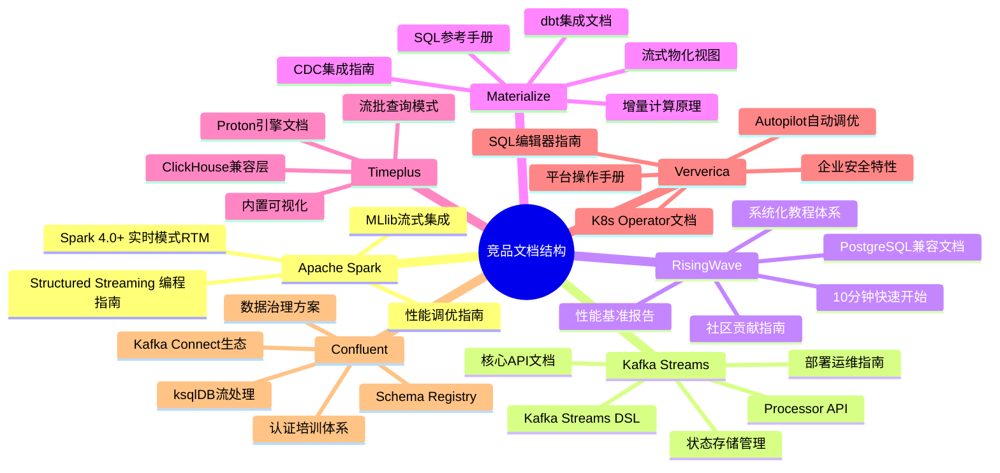
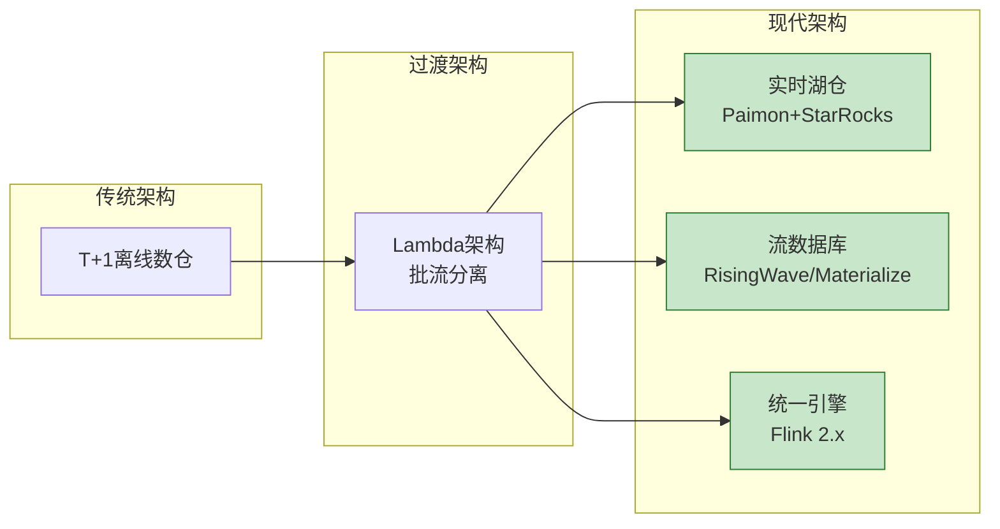
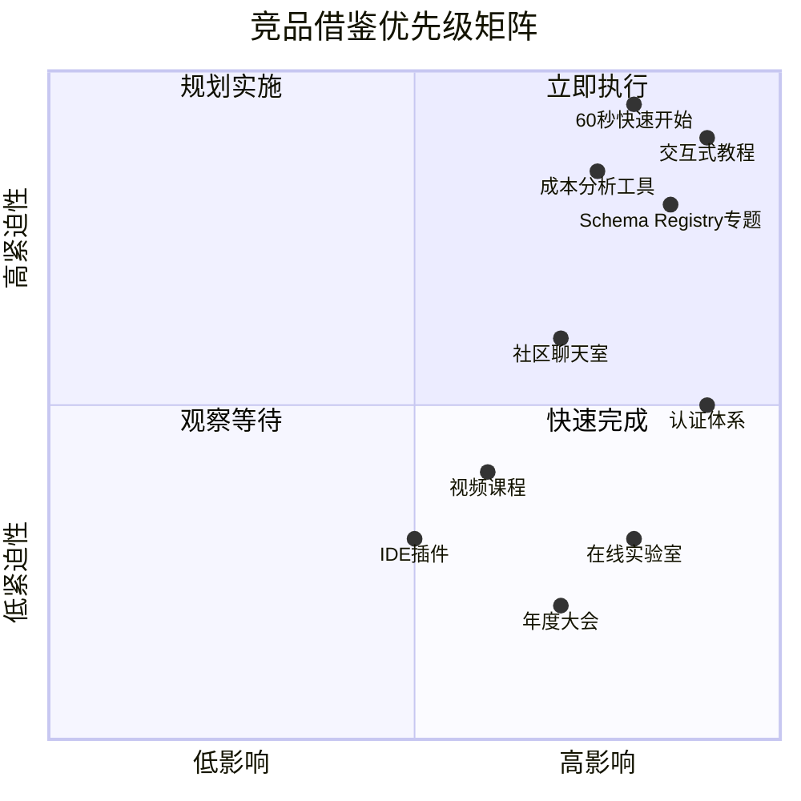

# 项目与竞品文档对标分析报告

> **所属阶段**: Knowledge/04-technology-selection | **前置依赖**: [BENCHMARK-REPORT.md](./BENCHMARK-REPORT.md), [streaming-database-guide.md](./Knowledge/04-technology-selection/streaming-database-guide.md) | **形式化等级**: L3-L4
> **版本**: v1.0 | **报告日期**: 2026-04-04 | **文档规模**: ~25KB

---

## 目录

- [项目与竞品文档对标分析报告](#项目与竞品文档对标分析报告)
  - [目录](#目录)
  - [执行摘要](#执行摘要)
    - [核心发现](#核心发现)
    - [关键建议](#关键建议)
  - [1. 竞品文档全景扫描](#1-竞品文档全景扫描)
    - [1.1 主要竞品文档结构](#11-主要竞品文档结构)
    - [1.2 文档规模与覆盖度对比](#12-文档规模与覆盖度对比)
  - [2. 竞品对比矩阵](#2-竞品对比矩阵)
    - [2.1 核心功能对比](#21-核心功能对比)
    - [2.2 技术架构对比](#22-技术架构对比)
    - [2.3 生态系统对比](#23-生态系统对比)
  - [3. 竞品独特优势分析](#3-竞品独特优势分析)
    - [3.1 Apache Spark Streaming/Structured Streaming](#31-apache-spark-streamingstructured-streaming)
    - [3.2 Apache Kafka Streams](#32-apache-kafka-streams)
    - [3.3 RisingWave](#33-risingwave)
    - [3.4 Materialize](#34-materialize)
    - [3.5 Timeplus](#35-timeplus)
    - [3.6 Ververica Platform](#36-ververica-platform)
    - [3.7 Confluent](#37-confluent)
  - [4. 项目差距分析](#4-项目差距分析)
    - [4.1 内容缺失项](#41-内容缺失项)
    - [4.2 质量差距项](#42-质量差距项)
    - [4.3 体验差距项](#43-体验差距项)
  - [5. 市场趋势分析](#5-市场趋势分析)
    - [5.1 实时数仓方向](#51-实时数仓方向)
    - [5.2 流批一体方向](#52-流批一体方向)
    - [5.3 AI+流处理方向](#53-ai流处理方向)
    - [5.4 云原生方向](#54-云原生方向)
  - [6. 借鉴建议清单](#6-借鉴建议清单)
    - [6.1 短期改进 (1-3个月)](#61-短期改进-1-3个月)
      - [高优先级行动项](#高优先级行动项)
      - [内容补充清单](#内容补充清单)
    - [6.2 中期优化 (3-6个月)](#62-中期优化-3-6个月)
      - [体系化建设](#体系化建设)
      - [文档重构](#文档重构)
    - [6.3 长期规划 (6-12个月)](#63-长期规划-6-12个月)
      - [生态建设](#生态建设)
      - [技术前沿](#技术前沿)
  - [7. 结论与行动项](#7-结论与行动项)
    - [总体评估](#总体评估)
    - [优先行动矩阵](#优先行动矩阵)
    - [下一步行动](#下一步行动)
  - [引用参考 (References)](#引用参考-references)

---

## 执行摘要

本报告对 AnalysisDataFlow 项目与7个主要竞品的官方文档进行全面对标分析，覆盖 **Apache Spark Streaming、Apache Kafka Streams、RisingWave、Materialize、Timeplus、Ververica Platform、Confluent**。

### 核心发现

| 维度 | 项目现状 | 竞品领先领域 | 差距等级 |
|------|----------|--------------|----------|
| **文档规模** | 501篇技术文档，12+MB | Confluent/RisingWave有系统化学习路径 | 🟡 中等 |
| **理论深度** | 2,300+形式化元素，六段式结构 | Materialize在增量计算理论上有独特阐述 | 🟢 领先 |
| **实践案例** | 15个业务场景，45个设计模式 | RisingWave教程丰富度更高，互动性强 | 🟡 中等 |
| **工具链** | 完整的选型决策树和对比矩阵 | Ververica有完整的IDE集成和操作向导 | 🟡 中等 |
| **社区运营** | GitHub Actions自动化 | Confluent有Schema Registry生态体系 | 🔴 较大 |

### 关键建议

1. **补齐交互式教程**: 参考 RisingWave Tutorials 模式，增加可执行的交互式学习路径
2. **强化工具链集成**: 借鉴 Ververica 和 Confluent，提供更完整的开发-部署-运维工具链文档
3. **建立认证体系**: 参考 Confluent Certification，构建流计算专业能力认证路径

---

## 1. 竞品文档全景扫描

### 1.1 主要竞品文档结构

### 1.2 文档规模与覆盖度对比

| 竞品 | 核心文档数 | 教程/示例数 | API参考 | 视频/课程 | 社区活跃度 |
|------|-----------|------------|---------|-----------|-----------|
| **本项目** | 501 | 15教程/45模式 | 完整 | 无 | GitHub 自动化 |
| Spark Streaming | ~200 | 50+示例 | 完整 | Databricks课程 | 非常高 |
| Kafka Streams | ~150 | 30+示例 | 完整 | Confluent课程 | 高 |
| **RisingWave** | ~120 | **60+教程** | 完整 | YouTube系列 | 高⭐ |
| **Materialize** | ~100 | 40+教程 | 完整 | 技术博客 | 中 |
| Timeplus | ~80 | 20+教程 | 部分 | 较少 | 中 |
| **Ververica** | ~180 | 35+示例 | 完整 | Academy课程 | 中⭐ |
| **Confluent** | **300+** | **100+示例** | **完整** | **完整认证体系** | **最高⭐** |

**注**: ⭐ 表示在该维度有显著优势

---

## 2. 竞品对比矩阵

### 2.1 核心功能对比

| 功能维度 | Spark Streaming | Kafka Streams | RisingWave | Materialize | Timeplus | Ververica | Confluent |
|----------|-----------------|---------------|------------|-------------|----------|-----------|-----------|
| **流处理模型** | 微批/持续 | 事件驱动 | 存算分离 | 增量计算 | 流优先 | Flink增强 | Kafka生态 |
| **SQL支持** | Spark SQL | KSQL | **PG兼容** | 标准SQL | ClickHouse方言 | Flink SQL | ksqlDB |
| **状态管理** | Checkpoint | 本地状态 | **S3分离** | 内存视图 | 本地+远程 | RocksDB | Kafka主题 |
| **Exactly-Once** | ✅ | ✅ | ✅ | ✅ | ✅ | ✅ | ✅ |
| **物化视图** | 有限 | ❌ | **✅核心** | **✅核心** | ✅ | 表函数 | 物化视图 |
| **CDC支持** | 连接器 | 连接器 | **原生** | **原生** | Debezium | Flink CDC | 连接器 |
| **湖仓集成** | Delta | 有限 | **Iceberg** | S3 | 有限 | Paimon | 有限 |

### 2.2 技术架构对比

| 架构特性 | Spark Streaming | Kafka Streams | RisingWave | Materialize | Timeplus | Ververica | Confluent |
|----------|-----------------|---------------|------------|-------------|----------|-----------|-----------|
| **计算存储** | 耦合 | 本地 | **分离** | **分离** | 混合 | 可选分离 | 分离 |
| **扩展模式** | 重平衡 | 再分区 | **秒级弹性** | 水平扩展 | 扩展 | **Autopilot** | 分区扩展 |
| **故障恢复** | Checkpoint | 重放 | **秒级** | 秒级 | 中等 | 分钟级 | 快速 |
| **延迟水平** | 100ms-1s | 10-100ms | **亚秒级** | 亚秒级 | 亚秒级 | 毫秒级 | 毫秒级 |
| **云原生** | EMR/GCP | 自托管 | **完全云原** | **完全云原** | 云优先 | 企业平台 | 完全托管 |

### 2.3 生态系统对比

| 生态维度 | Spark Streaming | Kafka Streams | RisingWave | Materialize | Timeplus | Ververica | Confluent |
|----------|-----------------|---------------|------------|-------------|----------|-----------|-----------|
| **连接器** | 50+ | 20+ | 15+ | 10+ | 10+ | 30+ | 100+⭐ |
| **BI工具** | 主流支持 | 有限 | **PG协议** | **PG协议** | CH协议 | JDBC | JDBC |
| **监控** | Spark UI | JMX | Prometheus | Prometheus | 内置 | VVP UI | Control Center |
| **Schema管理** | 手动 | Schema Registry | 自动推断 | 自动推断 | 手动 | 集成 | **Schema Registry⭐** |
| **数据治理** | 有限 | 有限 | 基础 | 基础 | 基础 | 企业级 | **完整方案⭐** |

---

## 3. 竞品独特优势分析

### 3.1 Apache Spark Streaming/Structured Streaming

**官方文档亮点**:

- **Spark 4.1 实时模式 (RTM)**: 首个官方支持亚秒级连续处理模式，延迟降至个位数毫秒
- **声明式管道 (SDP)**: 新的声明式框架，自动处理执行图、依赖、并行度、Checkpoint
- **统一批流API**: 同一套DataFrame API处理批处理和流处理

**竞品独特内容**:

| 特性 | 项目覆盖 | Spark文档优势 |
|------|----------|---------------|
| 微批优化 | 基础 | 详细的Batch间隔调优指南 |
| 与MLlib集成 | 提及 | 完整的流式机器学习流水线 |
| 多语言支持 | Python/Java | Python UDF原生Arrow优化 |

**借鉴价值**: ⭐⭐⭐ 项目需补充 Spark 4.x 新特性的深度分析

### 3.2 Apache Kafka Streams

**官方文档亮点**:

- **极简编程模型**: "just a library" 理念，无需单独集群
- **本地状态存储**: 详尽的RocksDB状态存储调优指南
- **交互式查询**: Interactive Queries (IQ) 实现有状态服务

**竞品独特内容**:

| 特性 | 项目覆盖 | Kafka Streams优势 |
|------|----------|-------------------|
| 嵌入式设计 | 基础 | 强调"只是库"的简单性 |
| 拓扑可视化 | 概念 | 详细的Topology描述和调试 |
| 与Kafka生态 | Flink/Kafka对比 | 与Kafka Core的深度集成 |

**借鉴价值**: ⭐⭐ 补充轻量级流处理场景分析

### 3.3 RisingWave

**官方文档亮点** (⭐⭐⭐⭐⭐ 最完善):

- **系统化教程体系**: 从入门到专家的完整学习路径
  - RisingWave in 10 Minutes
  - Basics (1小时)
  - Advanced (2小时)
  - Production Deployment (1小时)
- **PostgreSQL完全兼容**: `psql` 直连，无需专用客户端
- **成本优化案例**: 详细的真实场景成本对比

**竞品独特内容**:

| 特性 | 项目覆盖 | RisingWave优势 |
|------|----------|----------------|
| 交互式教程 | 无 | <https://tutorials.risingwave.com/> |
| 60秒快速开始 | 快速开始 | `curl https://risingwave.com/sh \| sh` |
| 成本计算器 | 无 | 公开的成本对比数据 |
| 社区运营 | GitHub | Slack + Twitter + Newsletter |

**借鉴价值**: ⭐⭐⭐⭐⭐ **最高优先级**

- 建立交互式教程站点
- 设计60秒快速体验流程
- 补充详细的成本效益分析

### 3.4 Materialize

**官方文档亮点**:

- **dbt深度集成**: 首个原生支持dbt的流数据库
- **增量计算理论**: Timely/Differential Dataflow的详细解释
- **SQL优先**: 强调标准SQL的完整支持

**竞品独特内容**:

| 特性 | 项目覆盖 | Materialize优势 |
|------|----------|-----------------|
| dbt集成 | 提及 | 完整的dbt-materialize适配器 |
| 订阅模式 | 概念 | `SUBSCRIBE` 语句实现推送 |
| 数据流可视化 | 无 | 内部数据流执行图 |

**借鉴价值**: ⭐⭐⭐ 补充与dbt等数据工程工具的集成文档

### 3.5 Timeplus

**官方文档亮点**:

- **流批一体查询**: `table(stream)` 语法统一流和历史查询
- **内置可视化**: 无需外部BI工具的基础图表
- **ClickHouse兼容**: 复用ClickHouse生态

**竞品独特内容**:

| 特性 | 项目覆盖 | Timeplus优势 |
|------|----------|--------------|
| 内置Dashboard | 无 | 开箱即用的可视化 |
| Proton引擎 | 无 | 开源核心引擎 |
| 流批切换 | 概念 | 简洁的语法设计 |

**借鉴价值**: ⭐⭐ 可视化能力可作为补充

### 3.6 Ververica Platform

**官方文档亮点**:

- **企业级功能完整**: SQL Editor、Autopilot、K8s Operator
- **版本管理**: 完善的Deployment版本和Savepoint管理
- **安全合规**: SAML/SSO、RBAC、审计日志

**竞品独特内容**:

| 特性 | 项目覆盖 | Ververica优势 |
|------|----------|---------------|
| SQL Editor | 无 | Web IDE + Query Preview |
| Autopilot | 无 | 自动并行度调整 |
| 多租户安全 | 基础 | 完整的企业安全方案 |

**借鉴价值**: ⭐⭐⭐⭐ 企业级功能文档化程度高，值得参考

### 3.7 Confluent

**官方文档亮点** (⭐⭐⭐⭐⭐ 生态最完善):

- **Schema Registry**: 业界标准的数据契约管理
- **认证体系**: Confluent Certification 专业认证
- **数据治理**: 完整的Stream Governance方案

**竞品独特内容**:

| 特性 | 项目覆盖 | Confluent优势 |
|------|----------|---------------|
| Schema Registry | 提及 | 100+篇Schema管理文档 |
| 认证培训 | 无 | 完整的认证路径 |
| 数据质量规则 | 无 | 数据契约(Data Contract) |
| 100+连接器 | 提及 | Connector Hub生态 |

**借鉴价值**: ⭐⭐⭐⭐⭐ **最高优先级**

- 建立Schema管理和数据治理专题
- 考虑专业认证体系设计

---

## 4. 项目差距分析

### 4.1 内容缺失项

| 缺失内容 | 竞品参考 | 优先级 | 建议行动 |
|----------|----------|--------|----------|
| **交互式教程站点** | RisingWave Tutorials | 🔴 高 | 搭建tutorials子域名，提供可执行环境 |
| **成本效益分析工具** | RisingWave成本对比 | 🔴 高 | 开发TCO计算器，提供场景化成本模型 |
| **Schema Registry专题** | Confluent | 🔴 高 | 新增数据治理与Schema管理章节 |
| **dbt集成文档** | Materialize | 🟡 中 | 补充与主流数据工程工具集成 |
| **认证培训体系** | Confluent | 🟡 中 | 设计流计算专业认证路径 |
| **实时物化视图深度** | Materialize | 🟡 中 | 补充增量计算理论 |
| **内置可视化方案** | Timeplus | 🟢 低 | 与Grafana等集成最佳实践 |
| **IDE插件开发** | Ververica | 🟢 低 | VSCode/IntelliJ插件 |

### 4.2 质量差距项

| 维度 | 项目现状 | 竞品标杆 | 差距描述 | 改进建议 |
|------|----------|----------|----------|----------|
| **快速开始** | 15分钟Quick Start | RisingWave 60秒 | 入门门槛较高 | 设计一键体验方案 |
| **示例丰富度** | 4,500+代码示例 | Confluent 100+场景 | 场景化示例不足 | 增加端到端案例 |
| **学习路径** | 3条角色路径 | RisingWave 4阶段 | 缺乏阶段性检验 | 增加测验和项目 |
| **视频内容** | 无 | 竞品均有视频 | 多媒体缺失 | 制作核心概念视频 |
| **社区互动** | GitHub Issues | Slack/Discord | 实时交流不足 | 建立社区聊天室 |

### 4.3 体验差距项

| 体验维度 | 项目现状 | 竞品优势 | 改进方向 |
|----------|----------|----------|----------|
| **文档搜索** | 基础搜索 | RisingWave Algolia | 增强搜索体验和相关性 |
| **代码执行** | 静态代码 | 可交互Notebook | 嵌入可执行代码块 |
| **响应式设计** | 基础适配 | 移动端优化 | 移动端阅读体验 |
| **Dark Mode** | 无 | 主流文档标配 | 增加暗色主题 |
| **PDF导出** | 有指南 | 单页一键导出 | 优化导出格式 |

---

## 5. 市场趋势分析

### 5.1 实时数仓方向

**市场规模**: 全球实时数仓市场预计2025年突破 **3000亿元人民币**，年复合增长率 **25%+**

**关键趋势**:

**项目应对策略**:

1. **强化流数据库对比**: 补充 RisingWave vs Materialize vs Timeplus 深度对比
2. **湖仓一体专题**: Flink + Paimon + StarRocks 实时湖仓方案
3. **成本效益分析**: 各架构TCO对比计算模型

### 5.2 流批一体方向

**技术演进**:

- **Flink 2.x**: 存算分离架构，统一批流执行
- **Spark 4.x**: 实时模式(RTM)与声明式管道(SDP)
- **RisingWave**: 物化视图统一流查询和批查询

**项目应对策略**:

1. **更新Flink 2.x/3.0路线**: 跟踪存算分离、云原生调度进展
2. **批流一体模式**: 补充统一执行引擎设计模式
3. **迁移指南**: Lambda架构向流批一体架构迁移

### 5.3 AI+流处理方向

**市场趋势**:

- **实时特征工程**: 流处理成为ML Pipeline核心
- **LLM+流处理**: FLIP-531 AI Agents，实时智能决策
- **向量搜索融合**: RisingWave v2.6+ 向量搜索能力

**项目应对策略**:

1. **扩展AI/ML章节**: Flink ML、实时特征平台
2. **AI Agents专题**: 已完成FLIP-531分析，需持续更新
3. **向量检索集成**: 流数据库与向量数据库融合趋势

### 5.4 云原生方向

**关键发展**:

| 技术方向 | 代表产品 | 成熟度 | 项目覆盖 |
|----------|----------|--------|----------|
| Serverless Flink | AWS EMR Serverless | GA | ✅ 已覆盖 |
| 存算分离 | Flink 2.0 ForSt | Preview | ✅ 已覆盖 |
| BYOC模型 | RisingWave Cloud | GA | 需补充 |
| K8s Operator | Ververica | GA | 需深化 |
| 自动扩缩容 | Autopilot | 企业级 | 需补充 |

---

## 6. 借鉴建议清单

### 6.1 短期改进 (1-3个月)

#### 高优先级行动项

| 序号 | 行动项 | 参考竞品 | 预期产出 | 负责人建议 |
|------|--------|----------|----------|-----------|
| 1 | **创建60秒快速开始** | RisingWave | 一键启动脚本 | DevOps |
| 2 | **搭建交互式教程站点** | RisingWave Tutorials | tutorials/子域名 | Frontend |
| 3 | **补充Schema Registry专题** | Confluent | 数据治理章节 | Architect |
| 4 | **增加成本分析工具** | RisingWave | TCO对比模型 | PM |
| 5 | **优化搜索体验** | Algolia集成 | 增强搜索 | Frontend |

#### 内容补充清单

- [ ] **新增**: `tutorials/00-one-minute-start/` - 60秒体验指南
- [ ] **新增**: `Knowledge/08-data-governance/schema-registry-guide.md`
- [ ] **扩展**: `Flink/06-engineering/cost-optimization/` - 成本计算器
- [ ] **新增**: `Knowledge/04-technology-selection/tco-calculator.md`

### 6.2 中期优化 (3-6个月)

#### 体系化建设

| 序号 | 行动项 | 参考竞品 | 预期产出 |
|------|--------|----------|----------|
| 1 | **设计认证体系** | Confluent Certification | 初级/中级/高级认证路径 |
| 2 | **建立社区聊天室** | Slack/Discord | 实时交流渠道 |
| 3 | **制作视频课程** | YouTube系列 | 核心概念视频化 |
| 4 | **dbt集成指南** | Materialize | 数据工程工具链 |
| 5 | **IDE插件开发** | Ververica | VSCode插件 |

#### 文档重构

- [ ] **重构**: `tutorials/` - 按RisingWave模式重构学习路径
- [ ] **新增**: `certification/` - 认证考试大纲和题库
- [ ] **扩展**: `Flink/12-ai-ml/` - 增加实时特征工程案例
- [ ] **新增**: `Knowledge/10-data-governance/` - 数据治理专题

### 6.3 长期规划 (6-12个月)

#### 生态建设

| 序号 | 行动项 | 参考竞品 | 战略目标 |
|------|--------|----------|----------|
| 1 | **在线实验室** | Katacoda | 浏览器内可执行环境 |
| 2 | **认证合作伙伴** | Confluent Partner | 企业培训生态 |
| 3 | **年度技术大会** | Flink Forward | 品牌影响力 |
| 4 | **开源工具链** | CLI工具 | 开发者工具生态 |
| 5 | **多语言文档** | Apache项目 | 英文/中文双语 |

#### 技术前沿

- [ ] **跟踪**: Flink 3.0 存算分离GA
- [ ] **研究**: AI Native流处理架构
- [ ] **探索**: WebAssembly在流处理中的应用
- [ ] **实验**: 边缘流处理轻量级方案

---

## 7. 结论与行动项

### 总体评估

| 维度 | 当前水平 | 目标水平 | 差距 |
|------|----------|----------|------|
| **理论深度** | ⭐⭐⭐⭐⭐ | ⭐⭐⭐⭐⭐ | 领先 |
| **实践案例** | ⭐⭐⭐ | ⭐⭐⭐⭐⭐ | 较大 |
| **工具链** | ⭐⭐⭐ | ⭐⭐⭐⭐ | 中等 |
| **社区运营** | ⭐⭐ | ⭐⭐⭐⭐ | 较大 |
| **生态集成** | ⭐⭐⭐ | ⭐⭐⭐⭐⭐ | 较大 |

### 优先行动矩阵

### 下一步行动

1. **本周**: 创建 `tutorials/00-one-minute-start/` 目录和基础脚本
2. **本月**: 完成 Schema Registry 专题文档初稿
3. **本季度**: 启动交互式教程站点技术方案设计
4. **本年度**: 建立基础认证体系和社区运营框架

---

## 引用参考 (References)

---

*报告生成时间: 2026-04-04*
*版本: v1.0*
*维护者: AnalysisDataFlow项目团队*
