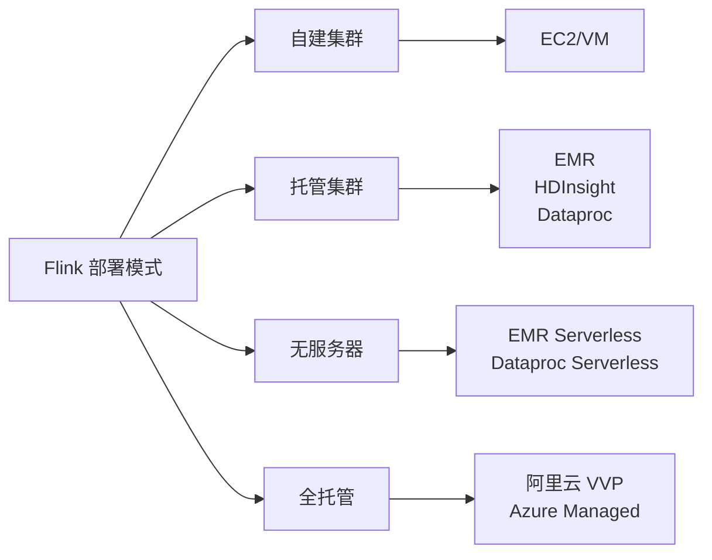

> **状态**: 🔮 前瞻内容 | **风险等级**: 高 | **最后更新**: 2026-04
>
> 此文档描述的内容处于早期规划阶段，可能与最终实现不符。请以 Apache Flink 官方发布为准。
>
# 云厂商 Flink 服务对比

> 所属阶段: CONFIG-TEMPLATES/cloud-providers | 前置依赖: 无 | 形式化等级: L3

---

## 1. 服务概览对比

| 云厂商 | 服务名称 | 部署模式 | 计费模式 | 最新版本 |
|--------|----------|----------|----------|----------|
| **AWS** | EMR Flink | 托管集群 | 按小时/实例 | 1.18 |
| **AWS** | EMR Serverless | 无服务器 | 按资源使用 | 1.18 |
| **Azure** | HDInsight | 托管集群 | 按小时/实例 | 1.17 |
| **Azure** | Managed Flink | 全托管 | 按资源使用 | 1.17 |
| **GCP** | Dataproc | 托管集群 | 按秒/实例 | 1.18 |
| **GCP** | Dataproc Serverless | 无服务器 | 按资源使用 | 1.18 |
| **阿里云** | 实时计算 Flink | 全托管 | 按 CU/小时 | 1.15+ |
| **腾讯云** | 流计算 Oceanus | 全托管 | 按 CU/小时 | 1.14+ |
| **华为云** | CloudStream | 全托管 | 按 CU/小时 | 1.14+ |

---

## 2. 核心特性对比

### 2.1 部署模式



### 2.2 功能对比矩阵

| 功能 | AWS EMR | Azure HDI | GCP Dataproc | 阿里云 VVP |
|------|---------|-----------|--------------|------------|
| **自动扩缩容** | ✅ | ✅ | ✅ | ✅ |
| **高可用** | ✅ | ✅ | ✅ | ✅ |
| **无服务器** | ✅ | ✅ (Preview) | ✅ | ❌ |
| **SQL 编辑器** | ✅ (Studio) | ✅ | ❌ | ✅ |
| **版本管理** | ✅ | ✅ | ✅ | ✅ |
| **CI/CD 集成** | ✅ | ✅ | ✅ | ✅ |
| **多租户** | ✅ | ✅ | ✅ | ✅ |
| **数据血缘** | ❌ | ❌ | ❌ | ✅ |
| **智能诊断** | ❌ | ❌ | ❌ | ✅ |

---

## 3. 集成生态对比

### 3.1 存储服务

| 存储类型 | AWS | Azure | GCP | 阿里云 |
|----------|-----|-------|-----|--------|
| **对象存储** | S3 | Blob / ADLS | GCS | OSS |
| **数据仓库** | Redshift | Synapse | BigQuery | Hologres |
| **NoSQL** | DynamoDB | Cosmos DB | Datastore / Firestore | TableStore |
| **大数据存储** | S3 | ADLS | GCS | OSS / JindoFS |
| **文件系统** | EFS | Files | Filestore | NAS |

### 3.2 消息队列

| 服务 | AWS | Azure | GCP | 阿里云 |
|------|-----|-------|-----|--------|
| **托管 Kafka** | MSK | Event Hubs | Pub/Sub | Kafka |
| **消息队列** | SQS | Service Bus | Pub/Sub | RocketMQ |
| **日志服务** | Kinesis | Event Hubs | Pub/Sub | SLS (Log Service) |
| **流处理** | Kinesis | Stream Analytics | Dataflow | Realtime Compute |

### 3.3 数据库集成

| 数据库类型 | AWS | Azure | GCP | 阿里云 |
|------------|-----|-------|-----|--------|
| **关系型** | RDS | SQL DB / MySQL | Cloud SQL | RDS / PolarDB |
| **文档型** | DocumentDB | Cosmos DB | Firestore | MongoDB |
| **时序型** | Timestream | Time Series Insights | BigQuery | TSDB |
| **图数据库** | Neptune | Cosmos DB Gremlin | JanusGraph | GraphDB |

---

## 4. 成本对比分析

### 4.1 定价模型

| 云厂商 | 计算计费 | 存储计费 | 网络计费 | 最低消费 |
|--------|----------|----------|----------|----------|
| **AWS EMR** | $0.08-0.27/小时/vCPU | S3 标准: $0.023/GB/月 | 跨区域: $0.09/GB | 无 |
| **Azure HDI** | $0.06-0.24/小时/vCPU | Blob: $0.0184/GB/月 | 出站: $0.087/GB | 无 |
| **GCP Dataproc** | $0.01-0.05/小时/vCPU | GCS: $0.020/GB/月 | 出站: $0.12/GB | 1 分钟 |
| **阿里云 VVP** | ¥0.35-0.70/小时/CU | OSS: ¥0.12/GB/月 | 内网免费 | 无 |

### 4.2 成本优化策略对比

| 策略 | AWS | Azure | GCP | 阿里云 |
|------|-----|-------|-----|--------|
| **Spot/抢占式** | Spot (最高省 90%) | Spot (最高省 90%) | Preemptible (最高省 80%) | 抢占式 (最高省 70%) |
| **预留实例** | Reserved (最高省 72%) | Reserved (最高省 72%) | Committed Use (最高省 57%) | 包年包月 (最高省 50%) |
| **自动扩缩容** | EMR Auto Scaling | Autoscale | Autoscaling Policies | 自动扩缩容 |
| **无服务器** | EMR Serverless | 预览版 | Dataproc Serverless | 暂无 |

### 4.3 典型场景成本估算

**场景: 100 vCPU, 400GB 内存, 每月运行 730 小时**

| 服务 | 计算成本/月 | 存储成本/月 | 总成本/月 |
|------|-------------|-------------|-----------|
| AWS EMR (On-Demand) | ~$5,840 | ~$200 | ~$6,040 |
| AWS EMR (Spot) | ~$1,460 | ~$200 | ~$1,660 |
| Azure HDInsight | ~$4,380 | ~$150 | ~$4,530 |
| GCP Dataproc | ~$3,650 | ~$160 | ~$3,810 |
| 阿里云 VVP | ~¥25,550 | ~¥500 | ~¥26,050 |

---

## 5. 性能对比

### 5.1 基准测试结果

| 指标 | AWS EMR | Azure HDI | GCP Dataproc | 阿里云 VVP |
|------|---------|-----------|--------------|------------|
| **启动时间** | 3-5 min | 5-10 min | 2-3 min | < 1 min |
| **Checkpoint 速度** | 高 | 中 | 高 | 高 |
| **网络延迟** | 低 | 低 | 低 | 极低 (国内) |
| **扩展速度** | 2-3 min | 3-5 min | 1-2 min | < 1 min |

### 5.2 SLA 对比

| 服务 | 可用性 SLA | 支持响应 | 技术支持 |
|------|-----------|----------|----------|
| AWS EMR | 99.9% | 24/7 | 商业支持 |
| Azure HDInsight | 99.9% | 24/7 | 商业支持 |
| GCP Dataproc | 99.9% | 24/7 | 商业支持 |
| 阿里云 VVP | 99.95% | 24/7 | 企业支持 |

---

## 6. 选择决策矩阵

### 6.1 按业务需求选择

| 业务需求 | 推荐云厂商 | 理由 |
|----------|-----------|------|
| **全球化部署** | AWS / GCP | 全球区域覆盖 |
| **国内企业** | 阿里云 | 本地化服务、合规 |
| **微软生态** | Azure | 深度集成 |
| **成本敏感** | GCP | 按秒计费、折扣多 |
| **低延迟** | 阿里云 | 国内节点多 |
| **完全托管** | 阿里云 VVP | 免运维 |

### 6.2 按技术栈选择

| 现有技术栈 | 推荐云厂商 | 无缝集成 |
|------------|-----------|----------|
| **AWS 生态** | AWS EMR | S3, Kinesis, Glue |
| **Azure 生态** | Azure HDI | ADLS, Event Hubs, Synapse |
| **GCP 生态** | GCP Dataproc | GCS, BigQuery, Pub/Sub |
| **阿里生态** | 阿里云 VVP | OSS, DataHub, Hologres |

---

## 7. 迁移指南

### 7.1 从自建迁移到云托管

```bash
# 1. 导出 Savepoint
./bin/flink stop <job-id> --savepointPath s3://bucket/savepoints

# 2. 在云环境恢复
./bin/flink run -s s3://bucket/savepoints job.jar
```

### 7.2 跨云迁移

| 迁移方向 | 主要工作 | 复杂度 |
|----------|----------|--------|
| AWS → Azure | 存储迁移、IAM 转换 | 中 |
| AWS → GCP | 存储迁移、网络配置 | 中 |
| AWS → 阿里云 | 存储迁移、生态适配 | 高 |
| 阿里云 → AWS | 生态差异大 | 高 |

---

## 8. 最佳实践总结

### 8.1 通用建议

1. **成本控制**: 优先使用 Spot/抢占式实例
2. **高可用**: 跨可用区部署
3. **安全**: 使用托管标识代替密钥
4. **监控**: 集成云原生监控服务
5. **备份**: 定期创建 Savepoint

### 8.2 云厂商特定建议

**AWS:**

- 使用 EMR Studio 进行交互式开发
- 利用 S3 Transfer Acceleration 跨区域同步

**Azure:**

- 启用 Azure AD 集成实现单点登录
- 使用 Private Link 保护数据传输

**GCP:**

- 使用 Workload Identity 简化认证
- 利用 Dataproc Hub 进行多集群管理

**阿里云:**

- 使用 VVP 的智能诊断功能
- 结合 Hologres 构建实时数仓

---

*最后更新: 2026-04-04*
