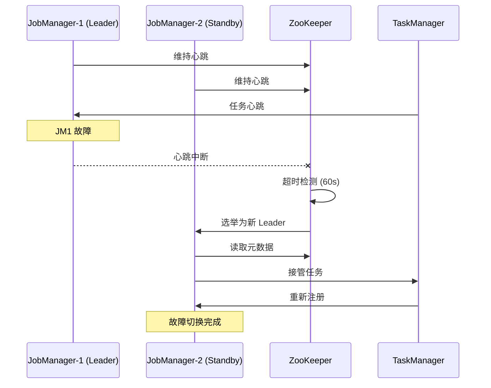

# Flink 生产环境高可用与安全配置指南

> 所属阶段: CONFIG-TEMPLATES/production | 前置依赖: flink-conf-production.yaml | 形式化等级: L4

---

## 1. 概念定义

### 1.1 高可用 (High Availability, HA)

高可用是指在系统组件发生故障时，系统能够继续提供服务的能力。
Flink 的高可用主要解决 **JobManager 单点故障** 问题。

**关键组件:**

| 组件 | 功能 | 故障影响 |
|------|------|----------|
| JobManager | 协调任务执行、调度 | 集群不可用 |
| TaskManager | 执行具体任务 | 部分任务失败 |
| ZooKeeper | 元数据存储、Leader 选举 | HA 失效 |
| Checkpoint Storage | 状态持久化 | 无法恢复 |

### 1.2 安全架构

Flink 生产环境安全包括以下层面:

```
┌─────────────────────────────────────────────────────────────┐
│                     网络安全层 (Network)                      │
│  TLS/SSL 加密、NetworkPolicy、防火墙规则                      │
├─────────────────────────────────────────────────────────────┤
│                     认证授权层 (Auth)                         │
│  Kerberos、OAuth2、RBAC、服务账户                             │
├─────────────────────────────────────────────────────────────┤
│                     数据安全层 (Data)                         │
│  加密存储、数据脱敏、访问审计                                 │
├─────────────────────────────────────────────────────────────┤
│                     运行时安全层 (Runtime)                    │
│  资源隔离、沙箱、安全上下文                                   │
└─────────────────────────────────────────────────────────────┘
```

---

## 2. 高可用配置详解

### 2.1 ZooKeeper 集群配置

**推荐配置 (3 节点或 5 节点):**

```properties
# ZooKeeper 配置 (zoo.cfg)
tickTime=2000
dataDir=/var/lib/zookeeper
clientPort=2181
initLimit=20
syncLimit=10

# 服务器列表
server.1=zookeeper-0:2888:3888
server.2=zookeeper-1:2888:3888
server.3=zookeeper-2:2888:3888

# 关键优化参数
maxClientCnxns=300
autopurge.snapRetainCount=10
autopurge.purgeInterval=24
```

**Flink 连接配置:**

```yaml
high-availability: zookeeper
high-availability.zookeeper.quorum: zk-1:2181,zk-2:2181,zk-3:2181
high-availability.zookeeper.path.root: /flink-production
high-availability.cluster-id: prod-cluster-001
high-availability.storageDir: s3p://flink-ha/ha-metadata
```

### 2.2 故障切换流程



### 2.3 Checkpoint 高可用

**推荐配置:**

```yaml
# Checkpoint 存储使用分布式文件系统
state.checkpoints.dir: s3p://flink-production/checkpoints
state.savepoints.dir: s3p://flink-production/savepoints

# 本地恢复加速
taskmanager.memory.framework.off-heap.batch-allocations: true
state.backend.local-recovery: true
state.backend.incremental: true
```

**存储后端对比:**

| 存储类型 | 延迟 | 成本 | 适用场景 |
|----------|------|------|----------|
| HDFS | 低 | 中 | 本地部署 |
| S3 | 中 | 低 | AWS 云 |
| GCS | 中 | 低 | GCP 云 |
| Azure Blob | 中 | 低 | Azure 云 |
| OSS | 中 | 低 | 阿里云 |

---

## 3. 安全配置详解

### 3.1 SSL/TLS 配置

**内部通信加密:**

```yaml
# 启用内部 SSL
security.ssl.internal.enabled: true
security.ssl.internal.keystore: /opt/flink/ssl/flink.keystore
security.ssl.internal.keystore-password: ${KEYSTORE_PASSWORD}
security.ssl.internal.key-password: ${KEY_PASSWORD}
security.ssl.internal.truststore: /opt/flink/ssl/flink.truststore
security.ssl.internal.truststore-password: ${TRUSTSTORE_PASSWORD}
```

**REST API SSL:**

```yaml
security.ssl.rest.enabled: true
security.ssl.rest.keystore: /opt/flink/ssl/rest.keystore
security.ssl.rest.keystore-password: ${KEYSTORE_PASSWORD}
security.ssl.rest.key-password: ${KEY_PASSWORD}
```

**证书生成脚本:**

```bash
#!/bin/bash
# generate-certs.sh

KEYSTORE_PASSWORD=$(openssl rand -base64 32)
TRUSTSTORE_PASSWORD=$(openssl rand -base64 32)

# 生成 CA
cd /opt/flink/ssl
openssl genrsa -out ca.key 4096
openssl req -x509 -new -nodes -key ca.key -sha256 -days 3650 \
    -out ca.crt -subj "/CN=Flink-CA/O=YourOrg"

# 生成服务端证书
keytool -genkeypair -alias flink-server \
    -keyalg RSA -keysize 4096 -validity 3650 \
    -keystore flink.keystore \
    -storepass ${KEYSTORE_PASSWORD} \
    -keypass ${KEY_PASSWORD} \
    -dname "CN=flink-server, O=YourOrg" \
    -ext "san=dns:flink-jobmanager,dns:flink-taskmanager,ip:10.0.0.1"

# 签名证书
keytool -certreq -alias flink-server \
    -keystore flink.keystore \
    -storepass ${KEYSTORE_PASSWORD} | \
    openssl x509 -req -CA ca.crt -CAkey ca.key -CAcreateserial \
    -out flink-server.crt -days 3650 -sha256

# 导入证书
keytool -importcert -alias ca -file ca.crt \
    -keystore flink.keystore -storepass ${KEYSTORE_PASSWORD} -noprompt
keytool -importcert -alias flink-server -file flink-server.crt \
    -keystore flink.keystore -storepass ${KEYSTORE_PASSWORD}

# 创建 TrustStore
keytool -importcert -alias ca -file ca.crt \
    -keystore flink.truststore -storepass ${TRUSTSTORE_PASSWORD} -noprompt

echo "Keystore Password: ${KEYSTORE_PASSWORD}"
echo "Truststore Password: ${TRUSTSTORE_PASSWORD}"
```

### 3.2 Kerberos 集成

**配置步骤:**

1. **创建服务主体:**

```bash
# 在 KDC 上执行
kadmin.local -q "addprinc -randkey flink/flink-jobmanager@EXAMPLE.COM"
kadmin.local -q "addprinc -randkey flink/flink-taskmanager@EXAMPLE.COM"
kadmin.local -q "ktadd -k flink.keytab flink/flink-jobmanager@EXAMPLE.COM"
kadmin.local -q "ktadd -k flink.keytab flink/flink-taskmanager@EXAMPLE.COM"
```

1. **Flink 配置:**

```yaml
security.kerberos.login.use-ticket-cache: true
security.kerberos.login.keytab: /opt/flink/secrets/flink.keytab
security.kerberos.login.principal: flink/flink-jobmanager@EXAMPLE.COM
security.kerberos.login.contexts: Client,KafkaClient
```

1. **Kubernetes Secret:**

```bash
kubectl create secret generic flink-kerberos-keytab \
    --from-file=flink.keytab=/path/to/flink.keytab \
    -n flink-production
```

### 3.3 Kubernetes RBAC 配置

**最小权限原则:**

```yaml
apiVersion: rbac.authorization.k8s.io/v1
kind: Role
metadata:
  name: flink-minimal-role
  namespace: flink-production
rules:
  # Pod 操作 (用于动态资源分配)
  - apiGroups: [""]
    resources: ["pods"]
    verbs: ["get", "list", "watch", "create", "update", "patch", "delete"]

  # ConfigMap 读取
  - apiGroups: [""]
    resources: ["configmaps"]
    verbs: ["get", "list", "watch"]

  # Service 发现
  - apiGroups: [""]
    resources: ["services"]
    verbs: ["get", "list", "watch"]

  # PVC (用于本地恢复)
  - apiGroups: [""]
    resources: ["persistentvolumeclaims"]
    verbs: ["get", "list", "create", "delete"]

  # 事件记录
  - apiGroups: [""]
    resources: ["events"]
    verbs: ["create", "update", "patch"]
```

### 3.4 NetworkPolicy 最佳实践

**分层访问控制:**

```yaml
# 基础网络策略
apiVersion: networking.k8s.io/v1
kind: NetworkPolicy
metadata:
  name: flink-default-deny
  namespace: flink-production
spec:
  podSelector: {}
  policyTypes:
    - Ingress
    - Egress

---
# Flink 内部通信
apiVersion: networking.k8s.io/v1
kind: NetworkPolicy
metadata:
  name: flink-internal-communication
  namespace: flink-production
spec:
  podSelector:
    matchLabels:
      app: flink
  policyTypes:
    - Ingress
    - Egress
  ingress:
    - from:
        - podSelector:
            matchLabels:
              app: flink
      ports:
        - protocol: TCP
          port: 6121  # Data
        - protocol: TCP
          port: 6122  # RPC
        - protocol: TCP
          port: 6123  # JobManager RPC
        - protocol: TCP
          port: 6124  # Blob
  egress:
    - to:
        - podSelector:
            matchLabels:
              app: flink

---
# 外部访问限制
apiVersion: networking.k8s.io/v1
kind: NetworkPolicy
metadata:
  name: flink-external-access
  namespace: flink-production
spec:
  podSelector:
    matchLabels:
      component: jobmanager
  policyTypes:
    - Ingress
  ingress:
    # 允许监控
    - from:
        - namespaceSelector:
            matchLabels:
              name: monitoring
      ports:
        - protocol: TCP
          port: 9249  # Prometheus
    # 允许 Ingress
    - from:
        - namespaceSelector:
            matchLabels:
              name: ingress-nginx
      ports:
        - protocol: TCP
          port: 8081  # Web UI
```

---

## 4. 生产环境检查清单

### 4.1 部署前检查

```markdown
- [ ] ZooKeeper 集群健康检查通过
- [ ] 对象存储访问权限验证
- [ ] SSL 证书有效性检查
- [ ] Kerberos 票据测试
- [ ] NetworkPolicy 规则验证
- [ ] 资源配额充足性检查
- [ ] 监控告警配置完成
```

### 4.2 运行时检查

```markdown
- [ ] Checkpoint 成功率 > 99%
- [ ] 端到端延迟监控正常
- [ ] GC 停顿 < 1s
- [ ] TaskManager 内存使用 < 80%
- [ ] 网络丢包率 < 0.1%
- [ ] ZooKeeper 连接数正常
```

### 4.3 灾难恢复测试

```bash
#!/bin/bash
# disaster-recovery-test.sh

echo "=== 灾难恢复测试 ==="

# 1. JobManager 故障测试
echo "测试 JobManager 故障切换..."
kubectl delete pod -l component=jobmanager -n flink-production
sleep 30
kubectl wait --for=condition=ready pod -l component=jobmanager -n flink-production --timeout=120s

# 2. TaskManager 故障测试
echo "测试 TaskManager 故障恢复..."
kubectl delete pod -l component=taskmanager -n flink-production --grace-period=0
sleep 60

# 3. Checkpoint 恢复测试
echo "测试 Checkpoint 恢复..."
# 触发 savepoint
flink savepoint <job-id> s3p://flink-production/savepoints/test-recovery
# 取消作业
flink cancel <job-id>
# 从 savepoint 恢复
flink run -s s3p://flink-production/savepoints/test-recovery <jar>

# 4. 网络分区测试
echo "测试网络分区处理..."
# 使用 chaos-mesh 注入网络分区

# 5. 数据完整性验证
echo "验证数据完整性..."
# 对比输入输出数据量
```

---

## 5. 监控告警配置

### 5.1 Prometheus 告警规则

```yaml
# flink-alerts.yaml
groups:
  - name: flink-critical
    rules:
      - alert: FlinkJobManagerDown
        expr: up{job="flink-jobmanager"} == 0
        for: 1m
        labels:
          severity: critical
        annotations:
          summary: "Flink JobManager is down"

      - alert: FlinkCheckpointFailed
        expr: rate(flink_jobmanager_checkpointTotalTime[5m]) == 0
        for: 5m
        labels:
          severity: critical
        annotations:
          summary: "Flink checkpoint failing"

      - alert: FlinkHighGC
        expr: rate(jvm_gc_collection_seconds_sum[5m]) > 0.1
        for: 5m
        labels:
          severity: warning
        annotations:
          summary: "High GC activity detected"

      - alert: FlinkBackpressure
        expr: flink_taskmanager_job_task_backPressuredTimeMsPerSecond > 100
        for: 2m
        labels:
          severity: warning
        annotations:
          summary: "Backpressure detected in Flink job"
```

---

## 6. 参考资源

- [Flink High Availability](https://nightlies.apache.org/flink/flink-docs-stable/docs/deployment/ha/)
- [Flink Security](https://nightlies.apache.org/flink/flink-docs-stable/docs/deployment/security/)
- [Kubernetes Network Policies](https://kubernetes.io/docs/concepts/services-networking/network-policies/)

---

*最后更新: 2026-04-04*
