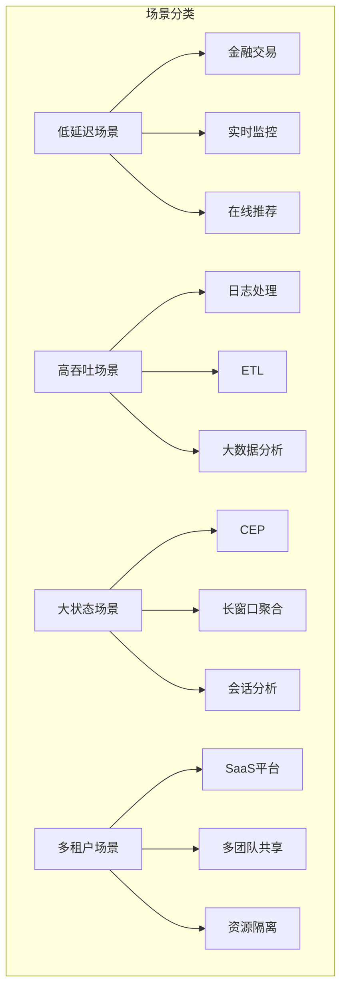

# Flink 场景专用配置对比说明

> 所属阶段: CONFIG-TEMPLATES/scenarios | 前置依赖: 无 | 形式化等级: L3

---

## 1. 场景对比总览



## 2. 核心参数对比表

### 2.1 延迟与吞吐权衡

| 参数 | 低延迟 | 高吞吐 | 大状态 | 多租户 |
|------|--------|--------|--------|--------|
| **Checkpoint 间隔** | 5s | 60s | 300s | 60s |
| **Unaligned Checkpoint** | 启用 | 禁用 | 可选 | 禁用 |
| **缓冲区超时** | 0ms | 100ms | 50ms | 50ms |
| **对象重用** | 启用 | 启用 | 启用 | 启用 |
| **网络内存比例** | 20% | 20% | 5% | 10% |

### 2.2 内存配置对比

| 配置项 | 低延迟 | 高吞吐 | 大状态 | 多租户 |
|--------|--------|--------|--------|--------|
| **TM 总内存** | 8GB | 32GB | 64GB | 8GB |
| **托管内存** | 1GB | 8GB | 16GB | 2GB |
| **网络内存** | 1-4GB | 2-8GB | 0.5-2GB | 0.8GB |
| **RocksDB 内存** | 2GB/Slot | 4GB/Slot | 8GB/Slot | 2GB/Slot |
| **GC 目标停顿** | 20ms | 100ms | 200ms | 100ms |

### 2.3 状态后端对比

| 配置项 | 低延迟 | 高吞吐 | 大状态 | 多租户 |
|--------|--------|--------|--------|--------|
| **状态后端** | RocksDB | RocksDB | RocksDB | RocksDB |
| **压缩算法** | NONE | LZ4 | LZ4 | LZ4 |
| **增量 Checkpoint** | 启用 | 启用 | 启用 | 启用 |
| **本地恢复** | 启用 | 启用 | 启用 | 启用 |
| **写缓冲区** | 128MB | 256MB | 512MB | 128MB |

## 3. 场景选择决策树

```
                    ┌─────────────────┐
                    │   业务需求分析   │
                    └────────┬────────┘
                             │
            ┌────────────────┼────────────────┐
            │                │                │
           是               否               否
            │                │                │
    ┌───────▼───────┐       │       ┌────────▼────────┐
    │ 延迟 < 100ms? │       │       │ 状态 > 100GB?   │
    └───────┬───────┘       │       └────────┬────────┘
            │                │                │
           是               否               是
            │                │                │
    ┌───────▼───────┐       │       ┌────────▼────────┐
    │  低延迟场景   │       │       │   大状态场景    │
    │ low-latency   │       │       │ large-state     │
    └───────────────┘       │       └─────────────────┘
                            │
                   ┌────────▼────────┐
                   │ 吞吐 > 100K/s?  │
                   └────────┬────────┘
                            │
              ┌─────────────┴─────────────┐
              │                           │
             是                          否
              │                           │
    ┌─────────▼──────────┐      ┌─────────▼──────────┐
    │    高吞吐场景      │      │    多租户场景      │
    │ high-throughput    │      │ multi-tenant       │
    └────────────────────┘      └────────────────────┘
```

## 4. 详细配置差异

### 4.1 低延迟场景关键差异

```yaml
# 核心差异点
execution.buffer-timeout: 0ms                    # 立即发送
execution.checkpointing.unaligned.enabled: true  # 非对齐检查点
pipeline.compression: NONE                       # 禁用压缩
state.backend.rocksdb.compression: NO_COMPRESSION
env.java.opts.taskmanager: "-XX:MaxGCPauseMillis=20"  # 低延迟 GC
```

**适用场景:**

- 高频交易 (HFT)
- 实时风控
- 在线推荐
- 游戏实时对战

### 4.2 高吞吐场景关键差异

```yaml
# 核心差异点
pipeline.object-reuse: true                      # 对象重用
pipeline.compression: LZ4                        # 高效压缩
execution.buffer-timeout: 100ms                  # 增大批处理
akka.framesize: 268435456b                       # 大帧传输
taskmanager.memory.process.size: 32768m          # 大内存
```

**适用场景:**

- 日志聚合 (ELK 替代)
- 实时数仓
- 大规模 ETL
- IoT 数据采集

### 4.3 大状态场景关键差异

```yaml
# 核心差异点
state.backend.rocksdb.memory.fixed-per-slot: 8192mb  # 大内存
taskmanager.memory.process.size: 65536m              # 超大内存
state.backend.rocksdb.writebuffer.size: 512mb        # 大写缓冲
state.backend.rocksdb.block.cache-size: 4096mb       # 大块缓存
execution.checkpointing.interval: 300s               # 低频检查点
```

**适用场景:**

- 复杂事件处理 (CEP)
- 长窗口聚合 (小时/天级)
- 会话分析
- 图计算

### 4.4 多租户场景关键差异

```yaml
# 核心差异点
classloader.resolve-order: child-first            # 类隔离
web.submit.enable: false                          # 禁用 Web 提交
cluster.fine-grained-resource-management.enabled: true  # 细粒度资源
rest.authorization.enabled: true                  # 认证启用
```

**适用场景:**

- 企业级 SaaS
- 多团队共享平台
- 云服务提供商
- 内部数据中台

## 5. 性能预期对比

| 场景 | 延迟 (P99) | 吞吐 | 状态大小 | 资源需求 |
|------|-----------|------|----------|----------|
| 低延迟 | < 100ms | 中等 | 小 | 中等 |
| 高吞吐 | < 1s | > 1M/s | 中等 | 高 |
| 大状态 | < 10s | 中等 | TB 级 | 很高 |
| 多租户 | < 1s | 可变 | 可变 | 按需分配 |

## 6. 迁移与切换指南

### 6.1 从低延迟切换到高吞吐

```bash
# 1. 调整 Checkpoint 配置
# 低延迟 -> 高吞吐
execution.checkpointing.interval: 5s -> 60s
execution.checkpointing.unaligned.enabled: true -> false
execution.buffer-timeout: 0ms -> 100ms

# 2. 增加资源
kubectl scale deployment flink-taskmanager --replicas=10
```

### 6.2 场景混合部署

```java
// 在同一集群支持多种场景
// 使用 Slot Sharing Group 隔离

// 作业 1: 低延迟
env.getConfig().setExecutionBufferTimeout(0);
stream.slotSharingGroup("latency-critical");

# 作业 2: 高吞吐
env.getConfig().setExecutionBufferTimeout(100);
stream.slotSharingGroup("throughput-optimized");
```

## 7. 监控指标参考

| 场景 | 关键指标 | 健康阈值 |
|------|----------|----------|
| 低延迟 | end-to-end latency | < 100ms (P99) |
| 高吞吐 | records per second | > 目标值 80% |
| 大状态 | state size | < 磁盘 80% |
| 多租户 | resource utilization | 60-80% |

---

*最后更新: 2026-04-04*
