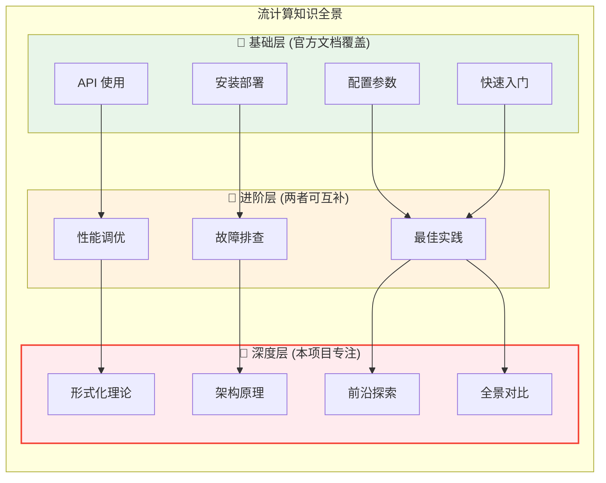
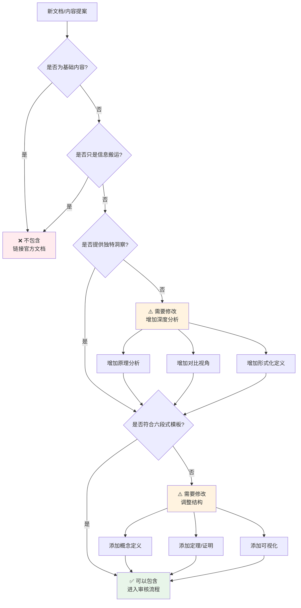

> **状态**: 🔮 前瞻内容 | **风险等级**: 高 | **最后更新**: 2026-04
>
> 此文档描述的内容处于早期规划阶段，可能与最终实现不符。请以 Apache Flink 官方发布为准。
>
# AnalysisDataFlow 内容边界规范

> **版本**: v1.0 | **生效日期**: 2026-04-05 | **状态**: Production
>
> **目的**: 明确本项目的内容边界，避免与 Flink 官方文档重复，确保资源投入在独特的价值点上

---

## 1. 内容边界总览



---

## 2. ✅ 应该包含的内容

### 2.1 形式化理论与严格论证 (Struct/)

| 内容类型 | 包含标准 | 示例 |
|----------|----------|------|
| **数学定义** | 必须有 Def-* 编号 | `Def-S-01-01: 流计算系统` |
| **定理与证明** | 必须有 Thm-* 编号 | `Thm-S-04-01: Checkpoint 正确性` |
| **引理与推论** | 支持主要定理 | `Lemma-S-02-03: Watermark 单调性` |
| **形式化模型** | 进程演算、类型系统 | USTM、CSP、Session Types |
| **验证方法** | TLA+、Coq、Smart Casual | `Struct/07-tools/smart-casual-verification.md` |

**质量标准**:

- [ ] 每个定义必须有直观的文字解释
- [ ] 每个定理必须有完整的证明或严谨的工程论证
- [ ] 引用权威来源（论文、教材、官方规范）
- [ ] 包含 Mermaid 可视化辅助理解

### 2.2 架构原理深度分析 (Flink/02-core/, Flink/01-architecture/)

| 内容类型 | 包含标准 | 示例 |
|----------|----------|------|
| **机制原理** | 解释「为什么」而不仅是「怎么做」 | Checkpoint 算法详解 |
| **设计决策** | 分析权衡与取舍 | RocksDB vs Heap State Backend |
| **源码级分析** | 关键组件的交互流程 | TaskManager 与 JobManager 通信 |
| **性能模型** | 理论分析与实测结合 | 反压机制的数学模型 |

**质量标准**:

- [ ] 必须解释设计背后的原因
- [ ] 必须包含架构图和时序图
- [ ] 必须讨论边界条件和异常情况
- [ ] 必须与形式化理论建立联系

### 2.3 前沿技术探索 (Knowledge/06-frontier/, Flink/06-ai-ml/)

| 内容类型 | 包含标准 | 示例 |
|----------|----------|------|
| **新兴技术** | 1-3 年内可能落地的技术 | Flink AI Agents (FLIP-531) |
| **研究趋势** | 学术界前沿方向 | 流数据库、实时图处理 |
| **跨领域融合** | 流计算与其他领域结合 | AI + 流处理、边缘计算 |
| **标准与协议** | 新兴行业标准 | Google A2A 协议、MCP |

**质量标准**:

- [ ] 必须说明技术成熟度和适用场景
- [ ] 必须与现有技术进行对比
- [ ] 必须分析潜在风险与局限性
- [ ] 必须提供学习资源链接

### 2.4 全景对比与选型指南 (Knowledge/04-technology-selection/)

| 内容类型 | 包含标准 | 示例 |
|----------|----------|------|
| **引擎对比** | 多维度客观对比 | Flink vs RisingWave |
| **技术选型** | 决策框架与流程 | 流处理引擎选型决策树 |
| **场景匹配** | 不同场景的最佳实践 | 金融 vs IoT vs 电商 |
| **成本分析** | TCO 对比模型 | Serverless vs 自建集群 |

**质量标准**:

- [ ] 必须使用对比矩阵呈现
- [ ] 必须包含决策树或流程图
- [ ] 必须声明对比的时效性
- [ ] 必须避免主观偏见

### 2.5 设计模式与反模式 (Knowledge/02-design-patterns/, Knowledge/09-anti-patterns/)

| 内容类型 | 包含标准 | 示例 |
|----------|----------|------|
| **设计模式** | 可复用的解决方案 | 事件时间处理模式、窗口连接模式 |
| **反模式** | 常见错误与规避 | 10+ 流处理反模式 |
| **重构指南** | 从反模式到模式 | 性能优化重构步骤 |
| **模式语言** | 模式之间的关系 | 模式组合与变体 |

**质量标准**:

- [ ] 每个模式必须有适用场景说明
- [ ] 必须包含代码示例和架构图
- [ ] 反模式必须有危害分析和解决方案
- [ ] 必须引用业界真实案例

### 2.6 内容包含检查清单

```markdown
## 新文档内容检查清单

### 形式化要求
- [ ] 是否包含至少一个 Def-* 定义？
- [ ] 是否包含至少一个 Thm/Lemma/Prop？
- [ ] 是否有完整的证明或工程论证？
- [ ] 是否引用了权威来源？

### 可视化要求
- [ ] 是否包含至少一个 Mermaid 图表？
- [ ] 图表是否辅助理解核心概念？
- [ ] 是否有决策树/对比矩阵/知识图谱？

### 深度要求
- [ ] 是否解释了「为什么」？
- [ ] 是否讨论了边界条件？
- [ ] 是否与官方文档形成互补？
- [ ] 是否提供了独特的洞察？
```

---

## 3. ❌ 不应该重复的内容

### 3.1 基础 API 文档

| 内容类型 | 不重复原因 | 替代资源 |
|----------|------------|----------|
| **类/方法参考** | 官方文档维护更及时 | [Flink Java API](https://nightlies.apache.org/flink/flink-docs-stable/api/java/) |
| **参数列表** | 版本变化频繁，维护成本高 | [Flink Configuration](https://nightlies.apache.org/flink/flink-docs-stable/docs/deployment/config/) |
| **返回值说明** | 官方文档更全面 | 同上 |
| **异常说明** | 官方文档更准确 | 同上 |

**例外情况**: 可以讨论 API 设计的原理和权衡

### 3.2 安装与部署教程

| 内容类型 | 不重复原因 | 替代资源 |
|----------|------------|----------|
| **本地安装步骤** | 官方 QuickStart 更详细 | [Flink Local Installation](https://nightlies.apache.org/flink/flink-docs-stable/docs/try-flink/local_installation/) |
| **集群部署脚本** | 官方提供标准脚本 | [Flink Cluster Setup](https://nightlies.apache.org/flink/flink-docs-stable/docs/deployment/overview/) |
| **Docker 部署** | 官方镜像更可靠 | [Flink Docker](https://nightlies.apache.org/flink/flink-docs-stable/docs/deployment/resource-providers/standalone/docker/) |
| **K8s Operator** | 官方 Operator 文档 | [Flink on K8s](https://nightlies.apache.org/flink/flink-docs-stable/docs/deployment/resource-providers/native_kubernetes/) |

**例外情况**: 可以讨论部署架构的选型决策和成本分析

### 3.3 简单示例与 Hello World

| 内容类型 | 不重复原因 | 替代资源 |
|----------|------------|----------|
| **WordCount 示例** | 官方示例更权威 | [Flink Examples](https://nightlies.apache.org/flink/flink-docs-stable/docs/learn-flink/overview/) |
| **基础 Transformation** | 官方教程更系统 | [Flink Transformations](https://nightlies.apache.org/flink/flink-docs-stable/docs/dev/datastream/operators/overview/) |
| **简单 SQL 查询** | 官方 SQL 文档更完整 | [Flink SQL](https://nightlies.apache.org/flink/flink-docs-stable/docs/dev/table/sql/gettingstarted/) |

**例外情况**: 可以设计用于说明特定原理的「教学示例」

### 3.4 版本发布说明

| 内容类型 | 不重复原因 | 替代资源 |
|----------|------------|----------|
| **变更日志** | 官方 Release Notes 最准确 | [Flink Release Notes](https://nightlies.apache.org/flink/flink-docs-stable/release-notes/) |
| **迁移指南** | 官方 Migration Guide 更权威 | [Flink Upgrades](https://nightlies.apache.org/flink/flink-docs-stable/docs/ops/upgrading/) |
| **新特性列表** | 官方公告最及时 | [Flink Blog](https://flink.apache.org/blog/) |

**例外情况**: 可以分析版本演进的技术趋势和架构变化

### 3.5 内容排除检查清单

```markdown
## 新文档排除检查清单

### 基础内容检查
- [ ] 是否只是 API 文档的复制？→ 不应该包含
- [ ] 是否只是安装步骤的罗列？→ 不应该包含
- [ ] 是否只是配置参数的列举？→ 不应该包含
- [ ] 是否只是简单示例的堆砌？→ 不应该包含

### 时效性检查
- [ ] 内容是否会在下个版本过时？→ 谨慎包含
- [ ] 是否有官方文档可以替代？→ 不应该重复
- [ ] 是否只是信息的搬运而非加工？→ 不应该包含

### 独特性检查
- [ ] 是否提供了新的洞察？
- [ ] 是否解释了底层原理？
- [ ] 是否与官方文档形成互补？
```

---

## 4. 边界模糊地带处理原则

### 4.1 进阶层内容（需要判断）

有些内容介于基础与深度之间，需要根据以下原则判断：

| 场景 | 判断标准 | 处理方式 |
|------|----------|----------|
| **性能调优** | 如果只是参数调整 → 不包含<br/>如果涉及原理分析 → 包含 | 聚焦原理，链接官方参数文档 |
| **故障排查** | 如果只是步骤罗列 → 不包含<br/>如果涉及机制分析 → 包含 | 分析根因，提供诊断框架 |
| **最佳实践** | 如果只是经验罗列 → 不包含<br/>如果总结为模式 → 包含 | 抽象为设计模式 |

### 4.2 决策流程图



---

## 5. 与其他资源的关系

### 5.1 资源定位矩阵

| 资源 | 定位 | 关系 |
|------|------|------|
| **Flink 官方文档** | 权威参考手册 | 我们补充其未覆盖的深度内容 |
| **Flink 官方博客** | 特性发布与案例 | 我们提供更系统的理论分析 |
| **Stack Overflow** | 问题解答社区 | 我们提供体系化知识 |
| **技术博客** | 个人经验分享 | 我们更严格、更系统 |
| **学术论文** | 前沿研究成果 | 我们进行工程化解读 |
| **技术书籍** | 系统化教材 | 我们更新更快、更前沿 |

### 5.2 引用官方文档的规范

当需要引用基础概念时，遵循以下规范：

```markdown
## 正确示例

### Checkpoint 机制

Checkpoint 是 Flink 的容错机制核心。关于 Checkpoint 的配置参数，
请参考 [Flink 官方文档](https://nightlies.apache.org/flink/flink-docs-stable/docs/dev/datastream/fault-tolerance/checkpointing/)。

本文档聚焦于 Checkpoint 的**形式化正确性证明**...

---

## 错误示例

### Checkpoint 配置

要启用 Checkpoint，需要设置以下参数：

```java
env.enableCheckpointing(60000);
env.getCheckpointConfig().setCheckpointingMode(CheckpointingMode.EXACTLY_ONCE);
```

这是官方文档已经覆盖的内容，不应重复。

```

---

## 6. 内容边界维护

### 6.1 定期审查机制

| 审查项目 | 频率 | 责任人 |
|----------|------|--------|
| 内容边界符合性检查 | 每季度 | 核心维护者 |
| 官方文档变更跟踪 | 每月 | 自动化脚本 |
| 重复内容识别 | 每月 | 自动化脚本 |
| 边界规范更新 | 每半年 | 核心维护者 |

### 6.2 边界冲突处理流程

```

发现潜在边界冲突
        ↓
   评估冲突类型
        ↓
   ┌────┴────┐
  重复内容   模糊地带
      ↓         ↓
  删除/合并  讨论决策
      ↓         ↓
   更新文档   更新规范

```

---

## 7. 总结

### 核心原则

```

┌─────────────────────────────────────────────────────────────────┐
│                                                                 │
│   AnalysisDataFlow 内容边界 =                                   │
│                                                                 │
│   ✅ 形式化理论深度  +  ✅ 前沿技术探索  +  ✅ 全景对比视野     │
│   ─────────────────────────────────────────────────────────     │
│   ❌ 基础 API 文档   +  ❌ 安装部署教程  +  ❌ 简单代码示例      │
│                                                                 │
│   简单记忆: 我们只写「为什么」和「选什么」，不写「怎么做」      │
│                                                                 │
└─────────────────────────────────────────────────────────────────┘

```

### 快速判断口诀

> - 如果是「如何配置参数」→ 不重复
> - 如果是「原理是什么」→ 包含
> - 如果是「步骤是什么」→ 不重复
> - 如果是「为什么这样设计」→ 包含
> - 如果是「API 怎么用」→ 不重复
> - 如果是「各引擎对比」→ 包含

---

*本文档与 VALUE-PROPOSITION.md 配套使用，共同定义本项目的独特价值定位。*
