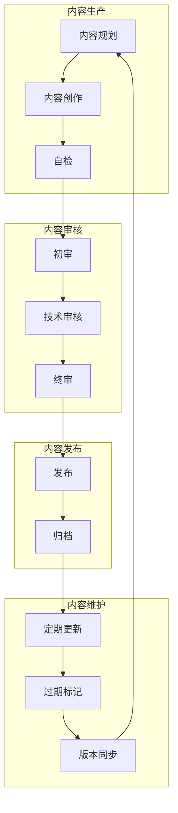
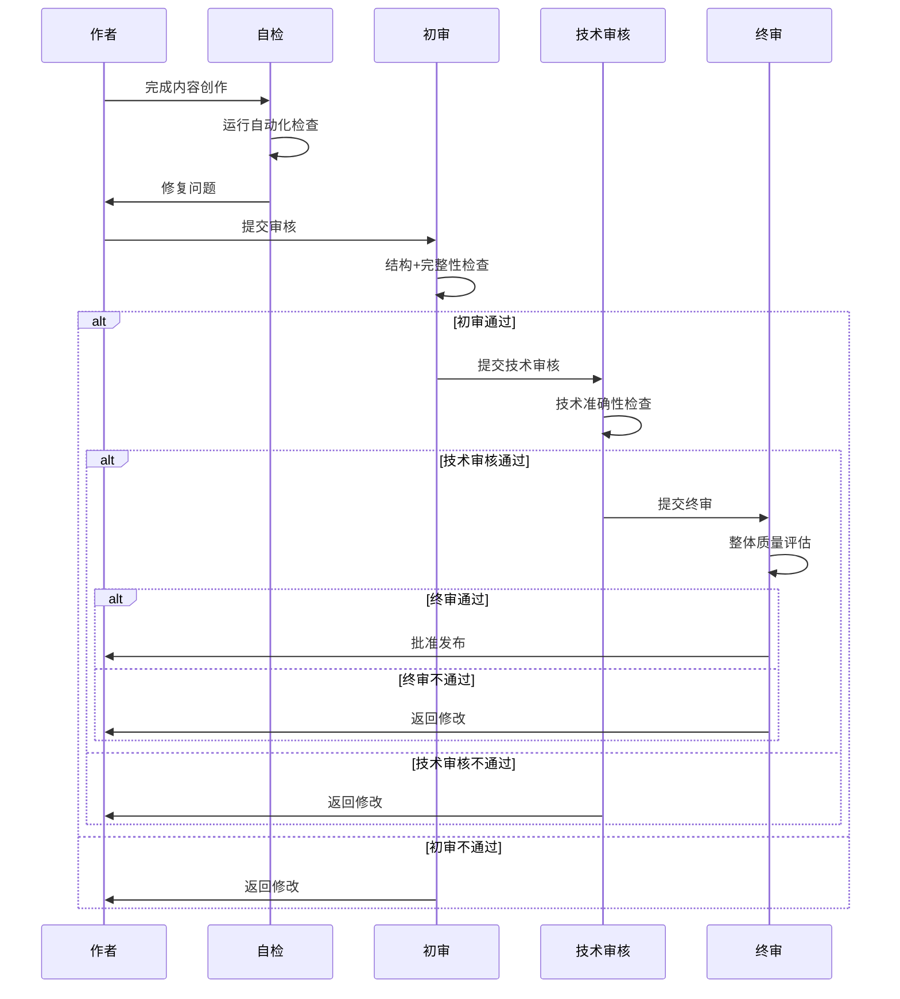
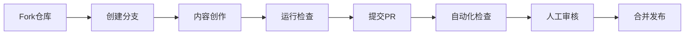

# 内容管理指南

# Content Management Guide

> **版本**: v1.0 | **生效日期**: 2026-04-12 | **状态**: Active
>
> 本文档提供AnalysisDataFlow项目内容管理的完整指南，涵盖更新机制、审核流程、质量标准等。

---

## 1. 内容管理概述

### 1.1 管理目标

- **质量保证**: 确保所有内容符合六段式模板和质量标准
- **时效维护**: 及时更新过时的技术内容
- **版本对齐**: 跟踪Flink及相关技术的版本变化
- **社区协作**: 建立可持续的社区贡献机制

### 1.2 内容管理框架



---

## 2. 内容更新机制

### 2.1 更新日历

**配置文件**: `.scripts/content-update-calendar.yml`

更新任务分为四个频率级别：

| 频率 | 任务类型 | 执行时间 | 负责人 |
|------|----------|----------|--------|
| 每日 | 链接检查、定理验证 | 09:00 | 自动化 |
| 每周 | 版本跟踪、统计更新 | 周一 10:00 | 自动化+人工 |
| 每月 | 全面审核、版本同步 | 1日 09:00 | 内容团队 |
| 季度 | 路线图回顾、债务清理 | 首日 | 项目团队 |

### 2.2 自动化更新脚本

**脚本位置**: `.scripts/auto-content-updater.py`

**功能模块**:

```bash
# 检查外部链接
python .scripts/auto-content-updater.py --check-links

# 更新版本信息
python .scripts/auto-content-updater.py --update-versions

# 更新统计数据
python .scripts/auto-content-updater.py --update-stats

# 标记过期内容
python .scripts/auto-content-updater.py --mark-stale

# 执行完整更新
python .scripts/auto-content-updater.py --full-update
```

### 2.3 手动更新流程

**触发条件**:

- 紧急安全公告
- 重大版本发布
- 社区贡献PR
- 内容错误修复

**更新步骤**:

1. **创建更新任务**

   ```bash
   # 基于模板创建任务
   cp .templates/content-update-task.md .tasks/UPDATE-YYYY-MM-DD-<topic>.md
   ```

2. **执行更新**
   - 修改相关文档
   - 运行自动化检查
   - 更新元数据

3. **提交审核**
   - 按照审核流程提交
   - 记录变更日志

4. **发布更新**
   - 合并到主分支
   - 更新CHANGELOG
   - 通知相关方

---

## 3. 内容审核流程

### 3.1 审核清单

**文档位置**: `docs/content-review-checklist.md`

**审核维度**:

| 维度 | 权重 | 检查项 |
|------|------|--------|
| 结构性 | 30% | 六段式合规、元数据完整 |
| 技术性 | 40% | 形式化元素、技术准确 |
| 质量性 | 30% | 语言表达、格式规范 |

### 3.2 审核流程



### 3.3 审核时间线

| 阶段 | 标准时长 | 最长时长 |
|------|----------|----------|
| 自检 | - | - |
| 初审 | 1-2天 | 3天 |
| 技术审核 | 2-3天 | 5天 |
| 终审 | 1天 | 2天 |
| **总计** | **4-6天** | **10天** |

---

## 4. 版本跟踪管理

### 4.1 版本跟踪文档

**文档位置**: `VERSION-TRACKING.md`

**跟踪内容**:

- Flink各版本发布状态
- 相关技术版本兼容性
- 升级路径与注意事项
- 废弃功能预警

### 4.2 版本监控

**自动化监控**:

```bash
# 检查Flink新版本
python .scripts/flink-version-tracking/check-flink-updates.py

# 生成版本报告
python .scripts/flink-version-tracking/generate-version-report.py
```

**监控源**:

- Maven Central
- GitHub Releases
- Apache JIRA
- 官方博客

### 4.3 版本更新响应

| 事件类型 | 响应时间 | 行动 |
|----------|----------|------|
| 新GA版本 | 4小时 | 创建更新任务 |
| 安全公告 | 1小时 | 紧急更新 |
| RC版本 | 24小时 | 评估影响 |
| 连接器更新 | 72小时 | 排期更新 |

---

## 5. 内容路线图管理

### 5.1 路线图文档

**文档位置**: `CONTENT-ROADMAP-2026.md`

**规划周期**: 季度规划，月度调整

### 5.2 路线图执行

**执行跟踪**:

| 季度 | 里程碑 | 负责人 | 状态 |
|------|--------|--------|------|
| Q2 | Flink 2.3深度解析 | flink-maintainer | ⏳ 待启动 |
| Q2 | AI Agent专题 | ai-maintainer | ⏳ 待启动 |
| Q3 | 实时ML推理 | ml-maintainer | 📋 规划中 |
| Q4 | 2026年度回顾 | content-lead | 📋 规划中 |

### 5.3 路线图调整

**调整触发条件**:

- 技术方向重大变化
- 资源可用性变化
- 社区需求变化
- 外部依赖变化

**调整流程**:

1. 评估影响
2. 提出调整方案
3. 团队讨论
4. 更新路线图
5. 通知相关方

---

## 6. 质量标准

### 6.1 六段式模板合规

**强制要求**: 所有核心文档必须包含以下8个章节

```markdown
## 1. 概念定义 (Definitions)
## 2. 属性推导 (Properties)
## 3. 关系建立 (Relations)
## 4. 论证过程 (Argumentation)
## 5. 形式证明 / 工程论证 (Proof)
## 6. 实例验证 (Examples)
## 7. 可视化 (Visualizations)
## 8. 引用参考 (References)
```

### 6.2 形式化元素规范

**编号体系**: `{类型}-{阶段}-{文档序号}-{顺序号}`

| 类型 | 缩写 | 示例 |
|------|------|------|
| 定理 | Thm | Thm-S-01-01 |
| 引理 | Lemma | Lemma-S-01-02 |
| 定义 | Def | Def-S-01-01 |
| 命题 | Prop | Prop-S-03-01 |
| 推论 | Cor | Cor-S-02-01 |

### 6.3 引用规范

**格式**: `[^n]` 上标格式

**示例**:

```markdown
本文参考了Flink的Checkpoint机制[^1]和Chandy-Lamport算法[^2]。

[^1]: Apache Flink Documentation, "Checkpointing", 2025.
[^2]: K. M. Chandy and L. Lamport, "Distributed Snapshots", ACM, 1985.
```

---

## 7. 社区贡献管理

### 7.1 贡献流程



### 7.2 贡献者指南

**必读文档**:

- [CONTRIBUTING.md](./CONTRIBUTING.md)
- [docs/content-review-checklist.md](./docs/content-review-checklist.md)
- [AGENTS.md](./AGENTS.md)

### 7.3 贡献审核

**自动化检查**:

- 六段式结构检查
- 定理编号验证
- 链接健康检查
- Mermaid语法检查

**人工审核**:

- 技术准确性
- 内容完整性
- 语言表达

---

## 8. 工具与自动化

### 8.1 内容检查工具

| 工具 | 功能 | 使用场景 |
|------|------|----------|
| six-section-validator.py | 六段式检查 | 自检/初审 |
| theorem-validator.py | 定理编号验证 | 技术审核 |
| mermaid-syntax-checker.py | Mermaid检查 | 自检 |
| link-health-checker.py | 链接检查 | 初审 |
| code-example-validator.py | 代码验证 | 技术审核 |

### 8.2 CI/CD集成

**GitHub Actions工作流**:

```yaml
# .github/workflows/content-check.yml
name: Content Quality Check
on:
  pull_request:
    paths:
      - '**.md'

jobs:
  check:
    runs-on: ubuntu-latest
    steps:
      - uses: actions/checkout@v4
      - name: Six-section validation
        run: python .scripts/six-section-validator.py
      - name: Theorem validation
        run: python .scripts/theorem-validator.py
      - name: Link check
        run: python .scripts/link-health-checker.py
```

### 8.3 报告生成

**定期报告**:

```bash
# 生成月度健康报告
python .scripts/generate-monthly-report.py

# 生成季度质量评估
python .scripts/generate-quarterly-assessment.py
```

---

## 9. 问题处理

### 9.1 内容错误报告

**报告渠道**:

- GitHub Issues (推荐)
- 邮件反馈
- 社区讨论区

**报告模板**:

```markdown
## 内容错误报告

**文档路径**:
**错误类型**: 技术错误/格式问题/链接失效/其他
**问题描述**:
**建议修复**:
**参考来源**: (可选)
```

### 9.2 紧急修复流程

**紧急级别定义**:

| 级别 | 定义 | 响应时间 | 示例 |
|------|------|----------|------|
| P0 | 严重错误 | 4小时 | 安全漏洞、核心概念错误 |
| P1 | 重要问题 | 24小时 | 版本信息错误、API变更 |
| P2 | 一般问题 | 72小时 | 格式问题、链接失效 |

**修复流程**:

1. 确认问题
2. 创建修复PR
3. 加速审核
4. 紧急发布
5. 通知社区

---

## 10. 度量与改进

### 10.1 KPI指标

| 指标 | 目标值 | 测量频率 |
|------|--------|----------|
| 内容更新率 | >95% | 月度 |
| 审核通过率 | >90% | 月度 |
| 平均审核时长 | <5天 | 月度 |
| 社区贡献占比 | >20% | 季度 |
| 内容准确率 | >99% | 季度 |

### 10.2 持续改进

**月度回顾**:

- 内容更新统计
- 审核效率分析
- 问题根因分析
- 改进措施制定

**季度评估**:

- 路线图执行评估
- 资源利用率分析
- 流程优化建议

---

## 11. 参考资源

### 11.1 内部文档

- [AGENTS.md](./AGENTS.md) - Agent工作规范
- [DOCUMENT-TIERS.md](./DOCUMENT-TIERS.md) - 文档分级
- [BEST-PRACTICES.md](./BEST-PRACTICES.md) - 最佳实践
- [GLOSSARY.md](./GLOSSARY.md) - 术语表

### 11.2 外部资源

- [Apache Flink文档](https://nightlies.apache.org/flink/)
- [Keep a Changelog](https://keepachangelog.com/)
- [Semantic Versioning](https://semver.org/)

---

## 12. 附录

### 12.1 快速命令参考

```bash
# 完整内容更新
python .scripts/auto-content-updater.py --full-update

# 运行所有检查
python .scripts/six-section-validator.py
python .scripts/theorem-validator.py
python .scripts/link-health-checker.py
python .scripts/mermaid-syntax-checker.py

# 生成统计报告
python .scripts/quality-score-dashboard.py
```

### 12.2 联系信息

| 角色 | 职责 | 联系方式 |
|------|------|----------|
| 内容负责人 | 整体内容管理 | <content-lead@example.com> |
| Flink维护者 | Flink技术内容 | <flink-maintainer@example.com> |
| 社区经理 | 社区贡献 | <community@example.com> |

### 12.3 历史记录

| 日期 | 版本 | 变更内容 | 作者 |
|------|------|----------|------|
| 2026-04-12 | 1.0 | 初始版本 | Content Team |

---

*本指南定期更新，最新版本请查看仓库主分支*
