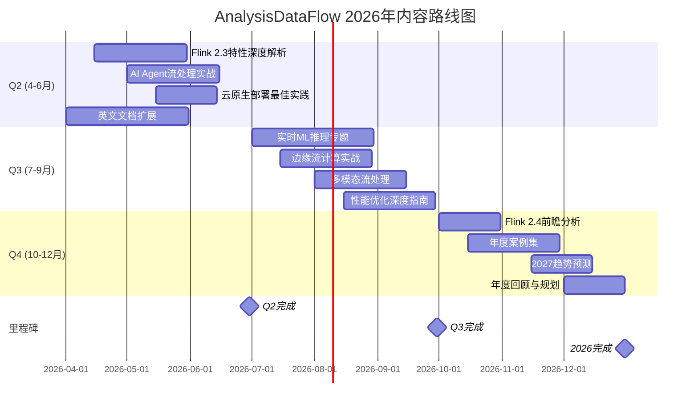
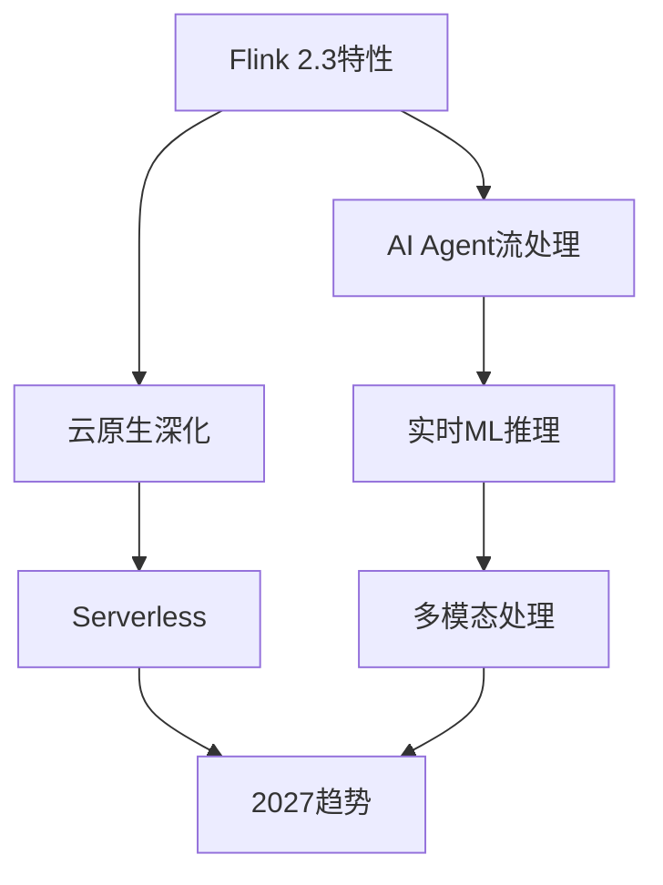

# 2026年内容路线图

# Content Roadmap 2026

> **版本**: v1.0 | **生效日期**: 2026-04-12 | **状态**: Active | **覆盖周期**: 2026 Q2-Q4
>
> 本文档定义了AnalysisDataFlow项目在2026年的内容发展规划，包括新专题、深度补充和社区贡献计划。

---

## 1. 执行摘要

### 1.1 2026年内容愿景

2026年，AnalysisDataFlow项目将从**100%完成状态**向**持续演进与生态深化**转型，重点聚焦：

1. **技术前沿跟踪**: Flink 2.3+ 新特性深度解析
2. **AI/ML集成**: 流计算与AI融合专题
3. **云原生深化**: Kubernetes与Serverless实践
4. **社区生态**: 英文国际化与社区贡献

### 1.2 路线图概览



---

## 2. Q2 内容规划 (4-6月)

### 2.1 Flink 2.3 特性深度解析

**目标**: 在Flink 2.3发布后30天内完成全面文档覆盖

**交付物清单**:

| 文档 | 类型 | 负责人 | 截止日期 | 状态 |
|------|------|--------|----------|------|
| Flink 2.3 新特性总览 | 概览 | flink-maintainer | 2026-04-20 | ⏳ 待启动 |
| Adaptive Scheduler 2.0 | 技术深度 | flink-maintainer | 2026-04-30 | ⏳ 待启动 |
| 新的State Backend解析 | 技术深度 | state-maintainer | 2026-05-05 | ⏳ 待启动 |
| 云原生增强实战 | 实践指南 | k8s-maintainer | 2026-05-15 | ⏳ 待启动 |
| 2.2→2.3迁移指南 | 迁移文档 | flink-maintainer | 2026-05-20 | ⏳ 待启动 |

**成功标准**:

- [ ] 5篇技术文档完成
- [ ] 所有新特性覆盖
- [ ] 代码示例可执行

### 2.2 AI Agent流处理实战

**目标**: 构建完整的AI Agent流处理知识体系

**交付物清单**:

| 文档 | 类型 | 负责人 | 截止日期 |
|------|------|--------|----------|
| Agent流处理架构设计 | 架构 | ai-maintainer | 2026-05-05 |
| MCP协议流式集成 | 协议 | ai-maintainer | 2026-05-10 |
| Multi-Agent协作流编排 | 架构 | ai-maintainer | 2026-05-15 |
| 实时LLM推理流水线 | 实践 | ai-maintainer | 2026-05-20 |
| Agent记忆与状态管理 | 技术深度 | ai-maintainer | 2026-05-25 |
| 生产环境部署指南 | 运维 | ai-maintainer | 2026-05-30 |

**技术覆盖**:

- FLIP-531 Agents (如发布)
- MCP (Model Context Protocol)
- A2A (Agent-to-Agent) 协议
- 流式Prompt工程

### 2.3 云原生部署最佳实践

**目标**: 更新K8s Operator 1.14+ 的最佳实践

**交付物清单**:

| 文档 | 类型 | 负责人 | 截止日期 |
|------|------|--------|----------|
| Operator 1.14新特性 | 更新 | k8s-maintainer | 2026-05-10 |
| GitOps部署模式 | 实践 | k8s-maintainer | 2026-05-15 |
| 多集群联邦部署 | 高级 | k8s-maintainer | 2026-05-20 |
| 自动扩缩容配置 | 配置 | k8s-maintainer | 2026-05-25 |
| 灾备与故障转移 | 运维 | k8s-maintainer | 2026-05-30 |

### 2.4 英文文档扩展

**目标**: 扩展英文核心文档覆盖

**交付物清单**:

| 文档 | 类型 | 负责人 | 截止日期 |
|------|------|--------|----------|
| CONTRIBUTING-EN.md | 指南 | i18n-maintainer | 2026-04-15 |
| Flink Quick Start (EN) | 教程 | i18n-maintainer | 2026-04-30 |
| Architecture Overview (EN) | 架构 | i18n-maintainer | 2026-05-15 |
| Best Practices (EN) | 实践 | i18n-maintainer | 2026-05-30 |
| Glossary EN扩展 | 术语 | i18n-maintainer | 2026-06-15 |

---

## 3. Q3 内容规划 (7-9月)

### 3.1 实时ML推理专题

**目标**: 构建流计算与ML融合的完整知识体系

**专题结构**:

```
Knowledge/06-frontier/
├── realtime-ml-inference/
│   ├── 06.04.01-ml-model-serving.md
│   ├── 06.04.02-feature-store-streaming.md
│   ├── 06.04.03-model-versioning.md
│   ├── 06.04.04-a-b-testing-streaming.md
│   ├── 06.04.05-ml-pipeline-orchestration.md
│   └── 06.04.06-ml-observability.md
```

**技术栈覆盖**:

- Flink ML 2.3+
- TensorFlow Serving
- TorchServe
- Triton Inference Server
- Feast Feature Store

### 3.2 边缘流计算实战

**目标**: 边缘计算场景下的流处理实践

**交付物清单**:

| 文档 | 类型 | 负责人 | 截止日期 |
|------|------|--------|----------|
| 边缘流计算架构 | 架构 | edge-maintainer | 2026-07-15 |
| 轻量级Flink部署 | 实践 | edge-maintainer | 2026-07-25 |
| 边缘-云协同处理 | 架构 | edge-maintainer | 2026-08-05 |
| 边缘AI推理优化 | 实践 | edge-maintainer | 2026-08-15 |
| 物联网流处理案例 | 案例 | edge-maintainer | 2026-08-25 |

### 3.3 多模态流处理

**目标**: 探索文本、图像、音频的流式处理

**交付物清单**:

| 文档 | 类型 | 负责人 | 截止日期 |
|------|------|--------|----------|
| 多模态流处理架构 | 架构 | frontier-maintainer | 2026-08-01 |
| 视频流实时分析 | 实践 | frontier-maintainer | 2026-08-10 |
| 音频流处理 pipeline | 实践 | frontier-maintainer | 2026-08-20 |
| 跨模态融合技术 | 技术 | frontier-maintainer | 2026-08-30 |

### 3.4 性能优化深度指南

**目标**: 系统化的Flink性能调优指南

**交付物清单**:

| 文档 | 类型 | 负责人 | 截止日期 |
|------|------|--------|----------|
| 性能调优方法论 | 方法 | perf-maintainer | 2026-08-15 |
| 内存管理优化 | 技术 | perf-maintainer | 2026-08-22 |
| 网络栈优化 | 技术 | perf-maintainer | 2026-08-29 |
| Checkpoint优化 | 技术 | perf-maintainer | 2026-09-05 |
| 序列化优化 | 技术 | perf-maintainer | 2026-09-12 |
| JVM GC调优 | 技术 | perf-maintainer | 2026-09-19 |

---

## 4. Q4 内容规划 (10-12月)

### 4.1 Flink 2.4 前瞻分析

**目标**: 跟踪Flink 2.4开发进展，提前准备文档

**交付物清单**:

| 文档 | 类型 | 负责人 | 截止日期 |
|------|------|--------|----------|
| 2.4 Roadmap解读 | 分析 | flink-maintainer | 2026-10-05 |
| FLIP-531深度分析 | 技术 | flink-maintainer | 2026-10-15 |
| 新API预览 | 前瞻 | flink-maintainer | 2026-10-25 |

### 4.2 年度案例集

**目标**: 汇编2026年最佳实践案例

**案例规划**:

| 案例 | 行业 | 技术栈 | 负责人 |
|------|------|--------|--------|
| 金融实时风控 | 金融 | Flink + ML | case-maintainer |
| 电商实时推荐 | 电商 | Flink + Redis | case-maintainer |
| IoT设备监控 | 物联网 | Flink + Kafka | case-maintainer |
| 游戏实时分析 | 游戏 | Flink + ClickHouse | case-maintainer |
| 物流轨迹追踪 | 物流 | Flink + HBase | case-maintainer |

### 4.3 2027趋势预测

**目标**: 分析流计算技术发展趋势

**交付物清单**:

| 文档 | 类型 | 负责人 | 截止日期 |
|------|------|--------|----------|
| 流计算技术趋势2027 | 趋势 | research-maintainer | 2026-11-20 |
| AI原生流处理展望 | 前瞻 | research-maintainer | 2026-11-25 |
| Serverless流计算趋势 | 趋势 | research-maintainer | 2026-11-30 |

### 4.4 年度回顾与规划

**目标**: 2026年度总结与2027规划

**交付物清单**:

| 文档 | 类型 | 负责人 | 截止日期 |
|------|------|--------|----------|
| 2026年度内容报告 | 报告 | content-lead | 2026-12-10 |
| 社区贡献统计 | 统计 | community-manager | 2026-12-15 |
| 2027内容路线图初稿 | 规划 | content-lead | 2026-12-20 |
| 技术债务清理计划 | 计划 | tech-lead | 2026-12-25 |

---

## 5. 新专题计划

### 5.1 2026年新专题

#### 专题1: AI原生流处理 (AI-Native Streaming)

**状态**: 🚧 规划中
**预计启动**: 2026 Q2
**预计完成**: 2026 Q4

**内容规划**:

- LLM流式集成架构
- Agent流编排
- 向量数据库流式更新
- 实时Embedding计算
- Prompt流管理

#### 专题2: Serverless流计算 (Serverless Streaming)

**状态**: 📝 概念阶段
**预计启动**: 2026 Q3
**预计完成**: 2027 Q1

**内容规划**:

- Serverless架构原理
- 自动扩缩容策略
- 成本优化指南
- 冷启动优化
- 与K8s对比

#### 专题3: 流数据湖 (Streaming Lakehouse)

**状态**: 🚧 规划中
**预计启动**: 2026 Q2
**预计完成**: 2026 Q3

**内容规划**:

- Delta Lake流式集成
- Iceberg流式更新
- Hudi实时写入
- 流批统一存储
- 元数据管理

### 5.2 专题依赖关系



---

## 6. 深度补充计划

### 6.1 现有内容增强

#### Struct/ 形式理论深化

| 目标文档 | 补充内容 | 优先级 | 负责人 |
|----------|----------|--------|--------|
| 01.02-time-semantics | 添加更多证明 | P1 | formal-maintainer |
| 02.01-stream-types | 补充类型推导 | P1 | formal-maintainer |
| 03.01-distributed-consistency | 扩展一致性模型 | P2 | formal-maintainer |

#### Knowledge/ 知识补充

| 目标文档 | 补充内容 | 优先级 | 负责人 |
|----------|----------|--------|--------|
| 窗口机制详解 | 添加可视化 | P1 | content-maintainer |
| 状态管理指南 | 补充最佳实践 | P1 | content-maintainer |
| Join策略对比 | 添加性能数据 | P2 | content-maintainer |

#### Flink/ 技术深度

| 目标文档 | 补充内容 | 优先级 | 负责人 |
|----------|----------|--------|--------|
| Checkpoint机制 | 源码级分析 | P1 | flink-maintainer |
| Watermark传播 | 算法细节 | P1 | flink-maintainer |
| Backpressure | 优化策略 | P2 | flink-maintainer |

### 6.2 缺失内容填补

**识别方法**:

- 用户反馈分析
- 搜索日志分析
- 社区Issue跟踪
- 竞品对比分析

**2026年重点填补**:

| 缺失内容 | 类型 | 优先级 | 计划完成 |
|----------|------|--------|----------|
| Flink与Pulsar集成 | 连接器 | P1 | Q2 |
| 自定义Source开发 | 开发指南 | P1 | Q2 |
| 复杂事件处理进阶 | CEP | P2 | Q3 |
| 图流处理 | Gelly | P2 | Q3 |

---

## 7. 社区贡献计划

### 7.1 贡献者激励计划

**目标**: 扩大社区贡献者基数

**计划内容**:

| 活动 | 时间 | 目标 |
|------|------|------|
| 内容贡献月 | 2026-05 | 新增10+贡献者 |
| 文档翻译 sprint | 2026-07 | 完成5篇英文翻译 |
| 案例征集活动 | 2026-09 | 收集10+生产案例 |
| 年度贡献者评选 | 2026-12 | 表彰优秀贡献者 |

### 7.2 贡献指南优化

**改进项**:

- [ ] 简化贡献流程
- [ ] 添加视频教程
- [ ] 建立导师制度
- [ ] 提供写作模板
- [ ] 自动化PR检查

### 7.3 社区内容审核

**计划**:

- 建立社区审核小组
- 每月社区内容会议
- 季度贡献者Sync
- 年度社区大会

---

## 8. 资源需求与预算

### 8.1 人力资源

| 角色 | 人数 | 投入比例 | 负责内容 |
|------|------|----------|----------|
| 内容负责人 | 1 | 50% | 整体规划与审核 |
| Flink专家 | 2 | 30% | Flink技术内容 |
| AI/ML专家 | 1 | 30% | AI相关内容 |
| 云原生专家 | 1 | 20% | K8s/DevOps内容 |
| 社区经理 | 1 | 20% | 社区贡献管理 |
| 技术写作者 | 2 | 50% | 文档撰写 |

### 8.2 技术资源

| 资源 | 用途 | 预算 |
|------|------|------|
| 测试集群 | 代码示例验证 | 现有 |
| CI/CD算力 | 自动化检查 | 现有 |
| 翻译工具 | 国际化 | TBD |
| 图表工具 | 可视化 | TBD |

---

## 9. 风险评估与缓解

### 9.1 主要风险

| 风险 | 概率 | 影响 | 缓解措施 |
|------|------|------|----------|
| Flink版本延期 | 中 | 高 | 准备预备内容 |
| 核心成员离职 | 低 | 高 | 文档化流程 |
| 社区参与度低 | 中 | 中 | 加强激励措施 |
| 技术方向变化 | 中 | 中 | 保持敏捷 |

### 9.2 应急预案

- 核心成员备份机制
- 内容优先级动态调整
- 外部专家网络
- 内容冻结策略

---

## 10. 跟踪与度量

### 10.1 KPI指标

| 指标 | 2026目标 | 当前 | 跟踪频率 |
|------|----------|------|----------|
| 文档总数 | 900+ | 851 | 月度 |
| 新内容产出 | 100+篇 | 0 | 季度 |
| 社区贡献占比 | 20% | 5% | 季度 |
| 内容更新率 | 95% | 100% | 月度 |
| 英文文档覆盖 | 15% | 5% | 季度 |

### 10.2 进度跟踪

**跟踪工具**: PROJECT-TRACKING.md
**回顾频率**: 月度检查点 + 季度评估

---

## 11. 参考文档

- [PROJECT-TRACKING.md](./PROJECT-TRACKING.md) - 项目进度跟踪
- [ROADMAP.md](./ROADMAP.md) - 技术路线图
- [VERSION-TRACKING.md](./VERSION-TRACKING.md) - 版本跟踪
- [CONTRIBUTING.md](./CONTRIBUTING.md) - 贡献指南

---

## 12. 历史记录

| 日期 | 版本 | 变更内容 | 作者 |
|------|------|----------|------|
| 2026-04-12 | 1.0 | 初始版本，规划2026 Q2-Q4内容 | Content Team |

---

*本文档每月更新，最后更新于 2026-04-12*
