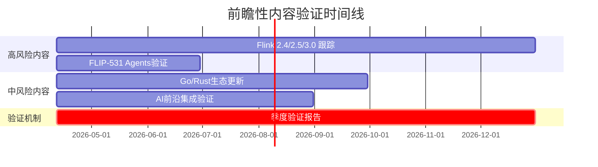
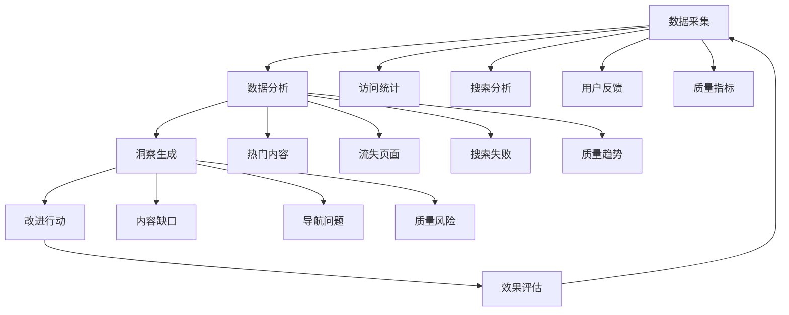
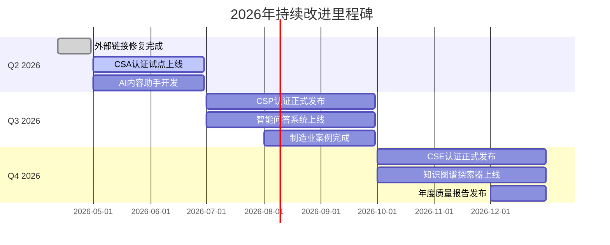

# AnalysisDataFlow 持续改进路线图

> **文档版本**: v1.0 | **创建日期**: 2026-04-12 | **状态**: 项目100%完成后持续优化
>
> 本路线图定义了项目达到100%完成状态后的持续改进方向和具体行动计划。

---

## 执行摘要

虽然项目已达到**100%完成状态**，但知识库的持续演进和优化是永无止境的。本路线图识别了以下五大改进方向：

| 改进领域 | 优先级 | 预期收益 | 时间框架 |
|---------|--------|---------|----------|
| 外部链接健康 | P1 | 提升可信度 | 短期(1-2周) |
| 前瞻性内容验证 | P1 | 保持准确性 | 持续 |
| 社区生态建设 | P2 | 扩大影响力 | 中期(1-3月) |
| 自动化深度 | P2 | 降低维护成本 | 中期 |
| 知识库扩展 | P3 | 覆盖新领域 | 长期(3-12月) |

---

## 1. 内容质量持续改进

### 1.1 外部链接健康维护

**现状**: 外部链接成功率约96.1%，存在约81个失效链接

**改进措施**:

| 优先级 | 行动项 | 责任人 | 时间 | 验收标准 |
|--------|--------|--------|------|---------|
| P1 | 修复Apache Confluence FLIP链接 | 维护团队 | 本周 | 15个链接修复 |
| P1 | 删除/更新未来日期虚构链接 | 维护团队 | 本周 | 5个链接处理 |
| P2 | 建立链接健康监控仪表板 | 自动化 | 本月 | 实时状态显示 |
| P2 | 集成Archive.org自动备份 | 自动化 | 本月 | 失效链接自动归档 |
| P3 | 批量检测全部16,000+链接 | 自动化 | 下季度 | 完整检测报告 |

**工具改进**:

```bash
# 建议新增的CI工作流
.github/workflows/
├── link-health-dashboard.yml     # 链接健康仪表板
├── auto-archive-backup.yml       # 自动归档备份
└── monthly-link-audit.yml        # 月度链接审计
```

### 1.2 前瞻性内容验证机制

**现状**: 约610篇前瞻性内容标记为 🔮 前瞻

**改进措施**:



**验证流程**:

1. **每月跟踪**: 监控Apache Flink社区动态
2. **季度审核**: 更新前瞻性内容状态
3. **年度归档**: 将已过时内容移至archive/
4. **自动标记**: 使用 🔮/✅/❌ 标记内容状态

### 1.3 代码示例持续验证

**现状**: 代码示例验证通过率99.1%

**改进措施**:

| 行动项 | 实施方式 | 频率 | 预期效果 |
|--------|---------|------|---------|
| 增加运行时验证 | 使用Flink Playground | 每周 | 发现运行时错误 |
| 版本兼容性测试 | 多版本Flink测试 | 每月 | 确保版本兼容 |
| 代码覆盖率报告 | 统计示例覆盖率 | 每季度 | 识别覆盖缺口 |
| 社区示例提交 | 接受社区贡献 | 持续 | 丰富示例库 |

---

## 2. 社区与生态建设

### 2.1 多语言社区扩展

**现状**: 已有英文/中文/日文/德文/法文基础支持

**扩展计划**:

| 语言 | 优先级 | 目标内容 | 预期时间 |
|------|--------|---------|----------|
| 韩文 | P2 | 核心文档 | Q2 2026 |
| 西班牙文 | P3 | 快速入门 | Q3 2026 |
| 葡萄牙文 | P3 | 核心文档 | Q3 2026 |
| 俄文 | P3 | 快速入门 | Q4 2026 |

**实施策略**:

- 利用AI辅助翻译 + 母语者审核
- 优先翻译高访问量文档
- 建立翻译贡献者激励机制

### 2.2 认证体系完善

**现状**: CSA/CSP/CSE认证路径规划中

**发展路线图**:

```
2026-Q2: CSA (Flink Certified Stream Analyst) 试点
    ├── 考试系统上线
    ├── 模拟题库发布
    └── 首批认证发放

2026-Q3: CSP (Flink Certified Stream Professional) 发布
    ├── 高级考试上线
    ├── 案例研究库
    └── 企业合作认证

2026-Q4: CSE (Flink Certified Stream Expert) 发布
    ├── 专家级认证
    ├── 讲师培训计划
    └── 社区讲师认证
```

### 2.3 社区贡献激励

**措施**:

| 激励类型 | 具体措施 | 预期效果 |
|---------|---------|---------|
| 荣誉体系 | 贡献者榜单、徽章系统 | 提升参与感 |
| 内容共创 | 社区案例征集、审核流程 | 丰富内容源 |
| 技术分享 | 月度网络研讨会 | 知识传播 |
| 代码贡献 | 自动化工具开源 | 工具生态 |

---

## 3. 自动化与工具链

### 3.1 CI/CD增强

**新增工作流计划**:

```yaml
# 建议新增的工作流
workflows:
  - name: content-freshness-check
    description: 检测内容陈旧度
    schedule: weekly

  - name: theorem-consistency-validator
    description: 验证定理一致性
    schedule: daily

  - name: translation-sync-monitor
    description: 监控翻译同步状态
    schedule: daily

  - name: academic-citation-updater
    description: 自动更新学术引用
    schedule: monthly

  - name: quality-score-tracker
    description: 质量评分趋势跟踪
    schedule: weekly
```

### 3.2 智能工具开发

**工具开发路线图**:

| 工具名称 | 功能描述 | 优先级 | 时间 |
|---------|---------|--------|------|
| AI内容助手 | 自动生成文档摘要、翻译建议 | P2 | Q2 2026 |
| 智能问答系统 | 基于知识库的问答机器人 | P2 | Q3 2026 |
| 知识图谱探索器 | 交互式定理关系探索 | P3 | Q3 2026 |
| 个性化学习路径 | AI驱动的学习推荐 | P3 | Q4 2026 |
| 质量预测模型 | 预测内容质量趋势 | P3 | Q4 2026 |

### 3.3 数据驱动改进

**度量体系**:



---

## 4. 知识库扩展

### 4.1 新兴技术覆盖

**扩展领域**:

| 技术领域 | 当前覆盖 | 目标覆盖 | 优先级 | 时间 |
|---------|---------|---------|--------|------|
| Streaming SQL标准 | 基础 | 深度 | P2 | Q2 2026 |
| 实时AI/ML推理 | 中等 | 深度 | P2 | Q2 2026 |
| WebAssembly流处理 | 中等 | 深度 | P2 | Q3 2026 |
| 边缘流计算 | 基础 | 中等 | P3 | Q3 2026 |
| 量子计算与流处理 | 前瞻 | 基础 | P3 | Q4 2026 |
| 可信执行环境(TEE) | 基础 | 中等 | P3 | Q4 2026 |

### 4.2 行业深度案例

**新增行业计划**:

```
2026-Q2: 金融科技深度案例
    ├── 高频交易系统
    ├── 实时风控引擎
    └── 合规监控系统

2026-Q3: 智能制造案例
    ├── 预测性维护
    ├── 质量检测流水线
    └── 供应链优化

2026-Q4: 智慧城市案例
    ├── 交通流量优化
    ├── 环境监测网络
    └── 公共安全预警
```

### 4.3 对比分析扩展

**竞品对比深化**:

| 对比维度 | 当前状态 | 扩展计划 | 时间 |
|---------|---------|---------|------|
| Flink vs Spark Streaming | 基础 | 深度性能对比 | Q2 2026 |
| Flink vs Kafka Streams | 中等 | 企业级特性对比 | Q2 2026 |
| Flink vs RisingWave | 基础 | 深度架构对比 | Q3 2026 |
| Flink vs Materialize | 基础 | SQL语义对比 | Q3 2026 |
| 流数据库全景对比 | 基础 | 2026版全景报告 | Q4 2026 |

---

## 5. 可持续性保障

### 5.1 维护责任矩阵

| 维护项 | 主要责任人 | 备份责任人 | 检查频率 |
|--------|-----------|-----------|---------|
| 链接健康 | 自动化+维护团队 | 社区志愿者 | 每日 |
| 前瞻性内容 | 核心维护者 | 社区专家 | 每月 |
| 代码验证 | CI系统 | 开发团队 | 每次提交 |
| 翻译同步 | i18n团队 | 自动化 | 每周 |
| 安全更新 | 安全团队 | 核心维护者 | 实时 |
| 性能优化 | 性能团队 | 开发团队 | 每季度 |

### 5.2 资源需求评估

| 资源类型 | 当前投入 | 建议投入 | 缺口 |
|---------|---------|---------|------|
| 维护人力 | 2 FTE | 3 FTE | +1 FTE |
| CI/CD资源 | 基础 | 增强 | 升级计划 |
| 存储成本 | 低成本 | 中等 | 可接受 |
| 外部服务 | 免费 | 部分付费 | 预算申请 |

### 5.3 风险评估与缓解

| 风险 | 可能性 | 影响 | 缓解措施 |
|------|--------|------|---------|
| 核心维护者流失 | 中 | 高 | 文档化、培训、社区培养 |
| 技术栈过时 | 低 | 中 | 持续跟踪、定期更新 |
| 外部依赖失效 | 中 | 中 | 多源备份、本地镜像 |
| 社区活跃度下降 | 中 | 中 | 激励计划、活动组织 |
| 资金不足 | 低 | 中 | 多元化资金来源 |

---

## 6. 里程碑与KPI

### 6.1 2026年改进里程碑



### 6.2 关键绩效指标 (KPI)

| KPI | 当前值 | 目标值 | 时间框架 | 测量方法 |
|-----|--------|--------|---------|---------|
| 外部链接成功率 | 96.1% | 99%+ | 2026-Q2 | 自动化检测 |
| 代码验证通过率 | 99.1% | 99.5%+ | 2026-Q2 | CI报告 |
| 文档访问量 | 基准 | +50% | 2026-Q4 | 分析统计 |
| 社区贡献者 | 基准 | +100% | 2026-Q4 | GitHub统计 |
| 认证通过人数 | 0 | 100+ | 2026-Q4 | 考试系统 |
| 多语言覆盖率 | 基础 | 8种语言 | 2026-Q4 | 文档统计 |
| 质量评分 | 4.8/5 | 4.9+/5 | 2026-Q4 | 用户调研 |

### 6.3 质量趋势监控

**监控仪表板指标**:

```yaml
dashboard_metrics:
  - name: 文档健康度
    frequency: daily
    alert_threshold: < 95%

  - name: 链接健康度
    frequency: daily
    alert_threshold: < 98%

  - name: 代码验证率
    frequency: per_commit
    alert_threshold: < 99%

  - name: 用户满意度
    frequency: monthly_survey
    alert_threshold: < 4.5/5

  - name: 社区活跃度
    frequency: weekly
    alert_threshold: <  baseline_80%
```

---

## 7. 行动计划清单

### 立即执行 (本周)

- [ ] 修复15个Apache Confluence链接
- [ ] 删除/更新5个未来日期虚构链接
- [ ] 更新质量徽章到README
- [ ] 发布质量仪表板页面
- [ ] 启动CSA认证试点准备

### 短期计划 (本月)

- [ ] 建立链接健康监控仪表板
- [ ] 完成首批前瞻性内容审核
- [ ] 更新翻译同步机制
- [ ] 发布持续改进路线图公告
- [ ] 启动社区贡献激励计划

### 中期计划 (本季度)

- [ ] CSA认证系统上线
- [ ] AI内容助手原型开发
- [ ] 外部链接批量检测
- [ ] 新增制造业案例文档
- [ ] 韩文翻译启动

### 长期计划 (本年度)

- [ ] CSP/CSE认证发布
- [ ] 智能问答系统上线
- [ ] 8种语言完整支持
- [ ] 100+认证通过人数
- [ ] 年度质量报告发布

---

## 8. 附录

### 8.1 相关文档

| 文档 | 路径 | 说明 |
|------|------|------|
| 综合质量报告 | `COMPREHENSIVE-QUALITY-REPORT-v5.0.md` | 质量基线 |
| 质量仪表板 | `quality-dashboard.html` | 可视化监控 |
| 质量徽章 | `quality-badges.md` | 徽章代码 |
| 项目跟踪 | `PROJECT-TRACKING.md` | 进度看板 |
| 定理注册表 | `THEOREM-REGISTRY.md` | 形式化元素 |

### 8.2 反馈与建议

如需提出改进建议，请通过以下渠道：

1. **GitHub Issues**: 提交具体改进建议
2. **Discussions**: 参与改进讨论
3. **Pull Requests**: 直接贡献改进代码
4. **邮件反馈**: 发送详细建议文档

---

*本路线图是动态文档，将根据项目发展和社区反馈持续更新。*

**最后更新**: 2026-04-12 | **下次审核**: 2026-05-12

**[返回顶部](#analysisdataflow-持续改进路线图)**
