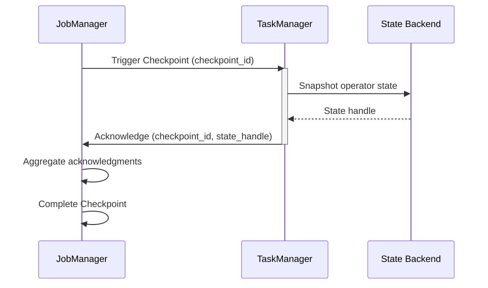
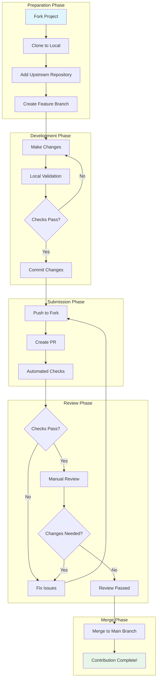
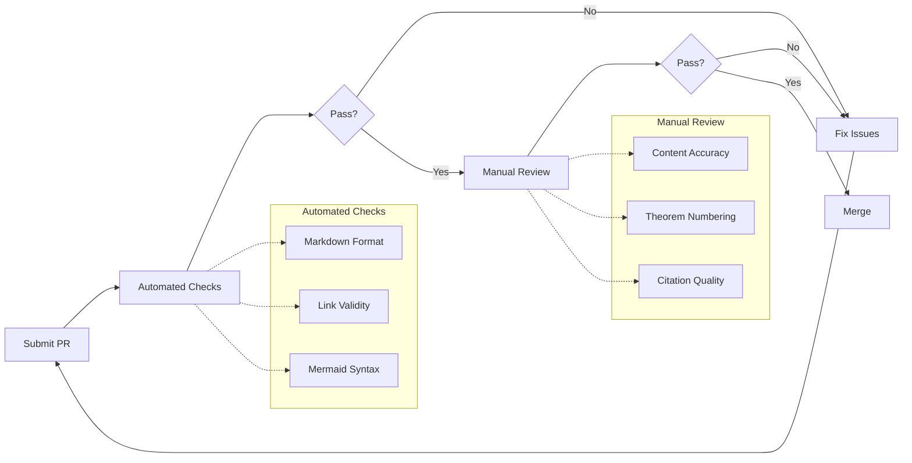

> **状态**: 🔮 前瞻内容 | **风险等级**: 高 | **最后更新**: 2026-04
>
> 此文档描述的内容处于早期规划阶段，可能与最终实现不符。请以 Apache Flink 官方发布为准。
>
# Contributing Guide

> Welcome to the AnalysisDataFlow project! We are building the most comprehensive and rigorous knowledge base for stream computing.

This guide will help you understand how to contribute to the project, including documentation improvements, bug reports, feature suggestions, and code contributions.

---

## Table of Contents

- [Contributing Guide](#contributing-guide)
  - [Table of Contents](#table-of-contents)
  - [1. Ways to Contribute](#1-ways-to-contribute)
    - [1.1 Documentation Improvements](#11-documentation-improvements)
    - [1.2 Bug Reports](#12-bug-reports)
    - [1.3 Feature Suggestions](#13-feature-suggestions)
    - [1.4 Code Contributions](#14-code-contributions)
  - [2. Documentation Contribution Process](#2-documentation-contribution-process)
    - [2.1 Six-Section Template Specification](#21-six-section-template-specification)
    - [2.2 Theorem/Definition Numbering Specification](#22-theoremdefinition-numbering-specification)
    - [2.3 Mermaid Diagram Specification](#23-mermaid-diagram-specification)
  - [3. Pull Request Process](#3-pull-request-process)
    - [3.1 Fork and Branch](#31-fork-and-branch)
    - [3.2 Commit Convention](#32-commit-convention)
    - [3.3 Review Checklist](#33-review-checklist)
    - [3.4 Branch Protection Rules](#34-branch-protection-rules)
    - [3.5 Merge Strategy](#35-merge-strategy)
  - [4. Local Validation](#4-local-validation)
    - [4.1 Markdown Syntax Check](#41-markdown-syntax-check)
    - [4.2 Link Check](#42-link-check)
    - [4.3 Mermaid Rendering Test](#43-mermaid-rendering-test)
  - [5. Style Guide](#5-style-guide)
    - [5.1 Writing Style](#51-writing-style)
    - [5.2 Terminology Usage](#52-terminology-usage)
    - [5.3 Code Example Specification](#53-code-example-specification)
    - [5.4 Chinese-English Mixing Specification](#54-chinese-english-mixing-specification)
  - [6. Recognition Mechanism](#6-recognition-mechanism)
    - [6.1 Contributor List](#61-contributor-list)
    - [6.2 Acknowledgment Standards](#62-acknowledgment-standards)
  - [7. Community Guidelines](#7-community-guidelines)
  - [8. Contact Information](#8-contact-information)

---

## 1. Ways to Contribute

### 1.1 Documentation Improvements

Documentation improvements are one of the most welcome forms of contribution. You can improve documentation in the following ways:

| Improvement Type | Description | Example |
|-----------------|-------------|---------|
| **Fix Errors** | Fix spelling, grammar, or conceptual errors | Correct mathematical errors in theorem proofs |
| **Add Content** | Add missing explanations, examples, or citations | Add intuitive explanations for complex concepts |
| **Optimize Structure** | Improve document organization and readability | Reorganize chapters for clearer logic |
| **Translation** | Multi-language version support | Translate core documents into English |
| **Visual Enhancement** | Add or improve Mermaid diagrams | Add sequence diagrams for complex processes |

**Documentation Improvement Submission Process**:

1. Determine the scope of improvement (single document / multiple documents / global improvement)
2. Create an Issue describing the improvement (optional but recommended)
3. Submit modifications following the [Pull Request Process](#3-pull-request-process)

### 1.2 Bug Reports

When you find errors, please submit a report through GitHub Issue.

**Bug Report Template**:

```markdown
## Error Type
- [ ] Content Error (concept/formula/code error)
- [ ] Broken Link (external reference inaccessible)
- [ ] Formatting Issue (formatting混乱/display异常)
- [ ] Theorem/Definition Issue (numbering conflict/unclear statement)

## Problem Location
- File path: `Struct/1.1-streaming-foundation.md`
- Section: Section 3 "Concept Definitions"
- Theorem/Definition ID: `Def-S-01-03`

## Problem Description
Detailed description of the issue found...

## Expected Fix
Description of expected correct result or improvement suggestion...

## Reference Evidence
Provide relevant citations, literature, or authoritative source links...

## Additional Information
- Screenshots (if applicable)
- Suggested fix approach
```

**Characteristics of Quality Bug Reports**:

- Provide specific file paths and locations
- Clear description with reproduction steps
- Provide authoritative sources supporting your point
- Be polite and constructive

### 1.3 Feature Suggestions

If you have suggestions for new features or improvements, please submit them through Issue or Discussion.

**Feature Suggestion Types**:

| Type | Description | Example |
|------|-------------|---------|
| **New Topic** | Suggest adding new knowledge areas | Add "Stream Computing and AI Integration" topic |
| **Chapter Reorganization** | Suggest improving document structure | Integrate related content into the same chapter |
| **Tool/Process Improvement** | Suggest improving contribution process or tools | Add automated theorem numbering checks |
| **Interactive Features** | Suggest improving user experience | Add in-document search functionality |

**Feature Suggestion Template**:

```markdown
## Suggestion Type
- [ ] New Topic
- [ ] Structure Improvement
- [ ] Tool/Process Improvement
- [ ] Other

## Detailed Description
Clear description of your suggestion...

## Motivation/Background
Explain why this suggestion benefits the project...

## Implementation Plan
Suggested implementation approach (optional)...

## Reference Resources
Relevant reference materials or examples...
```

### 1.4 Code Contributions

Although this project is primarily a documentation knowledge base, the following types of code contributions are accepted:

**Acceptable Code Contributions**:

| Type | Description | Location |
|------|-------------|----------|
| **Validation Scripts** | Automated tools like theorem numbering checks, link checks | `.scripts/` directory |
| **Documentation Generation Tools** | Tools for automatically generating indexes and statistical reports | `.scripts/` directory |
| **Example Code** | Runnable examples accompanying documents | In respective documents or `examples/` |
| **CI/CD Configuration** | GitHub Actions workflows | `.github/workflows/` |

**Code Contribution Requirements**:

- Code must have clear comments and documentation
- Include usage instructions and test cases
- Follow the project's existing code style
- Do not introduce unnecessary dependencies

**Large codebases are not accepted**, as the core of this project is the documentation knowledge base, not a software project.

---

## 2. Documentation Contribution Process

### 2.1 Six-Section Template Specification

All core Markdown documents must contain the following structure:

```markdown
# Title

> Stage: Struct/ Knowledge/ Flink/ | Prerequisites: [document links] | Formalization Level: L1-L6

## 1. Concept Definitions (Definitions)
Strict formal definitions + intuitive explanations. Must include at least one `Def-*` identifier.

## 2. Property Derivation (Properties)
Lemmas and properties derived directly from definitions. Must include at least one `Lemma-*` or `Prop-*` identifier.

## 3. Relationship Establishment (Relations)
Associations, mappings, and encoding relationships with other concepts/models/systems.

## 4. Argumentation Process (Argumentation)
Auxiliary theorems, counterexample analysis, boundary discussions, constructive explanations.

## 5. Formal Proof / Engineering Argument (Proof / Engineering Argument)
Complete proofs of major theorems, or rigorous arguments for engineering decisions.

## 6. Example Verification (Examples)
Simplified examples, code snippets, configuration examples, real cases.

## 7. Visualizations (Visualizations)
At least one Mermaid diagram (mind map / hierarchy diagram / execution tree / comparison matrix / decision tree / scenario tree).

## 8. References (References)
Use `[^n]` superscript format, list references at the end of the document.
```

**Section Requirements**:

| Section | Required | Content Requirements | Formal Elements |
|---------|----------|---------------------|-----------------|
| Concept Definitions | Required | Strict definition + intuitive explanation | At least 1 Def-* |
| Property Derivation | Required | Properties derived from definitions | At least 1 Lemma-*or Prop-* |
| Relationship Establishment | Optional | Relationships with other concepts/systems | - |
| Argumentation Process | Optional | Auxiliary arguments, boundary analysis | - |
| Formal Proof | Required | Complete proof of core theorems | At least 1 Thm-* |
| Example Verification | Required | Code/configuration/case examples | - |
| Visualization | Required | Mermaid diagrams | At least 1 diagram |
| References | Required | Authoritative source citations | At least 3 citations |

### 2.2 Theorem/Definition Numbering Specification

Adopt a globally unified numbering system: `{type}-{stage}-{document_number}-{sequence_number}`

**Type Abbreviations**:

| Type | Abbreviation | Example | Description |
|------|--------------|---------|-------------|
| Theorem | Thm | `Thm-S-01-01` | Struct stage, 01 document, 1st theorem |
| Lemma | Lemma | `Lemma-S-01-02` | Struct stage lemma |
| Definition | Def | `Def-S-01-01` | Struct stage definition |
| Proposition | Prop | `Prop-S-03-01` | Struct stage proposition |
| Corollary | Cor | `Cor-S-02-01` | Struct stage corollary |

**Stage Identifiers**:

| Directory | Stage Identifier | Example |
|-----------|-----------------|---------|
| `Struct/` | S | `Thm-S-01-01` |
| `Knowledge/` | K | `Def-K-03-05` |
| `Flink/` | F | `Thm-F-12-08` |

**Numbering Assignment Process**:

1. **Check Registry**: Before creating a document, check [THEOREM-REGISTRY.md](./THEOREM-REGISTRY.md) for the latest numbering
2. **Ensure Uniqueness**: Check that new numbers don't conflict with existing ones
3. **Sequential Assignment**: Assign numbers sequentially within the same document
4. **Update Timely**: Update the registry after adding new theorems

**Example**:

```markdown
**Definition 1.1** (Watermark): `Def-F-03-01`

Watermark is a timestamp $t$ indicating that all events with timestamp $\leq t$ have arrived...

---

**Theorem 3.2** (Exactly-Once Semantics Guarantee): `Thm-F-03-05`

Under Flink's Checkpoint mechanism, stream processing jobs can provide Exactly-Once semantics guarantee...

**Proof**:
...
```

### 2.3 Mermaid Diagram Specification

All Mermaid diagrams must meet the following requirements:

**Basic Specification**:

1. Wrapped in `mermaid` code blocks
2. Add brief text description before the diagram
3. Choose appropriate diagram type

**Recommended Diagram Types**:

| Diagram Type | Usage | Example Scenario |
|--------------|-------|------------------|
| `graph TB/TD` | Hierarchies, mapping relationships | Concept hierarchy diagrams, architecture diagrams |
| `flowchart TD` | Decision trees, flowcharts | Decision flows, algorithm flows |
| `gantt` | Roadmaps, timelines | Project plans, version roadmaps |
| `stateDiagram-v2` | State transitions, execution trees | State machines, execution flows |
| `classDiagram` | Type/model structures | Type systems, class relationships |
| `sequenceDiagram` | Sequence interactions | Protocol interactions, call sequences |
| `mindmap` | Mind maps | Concept associations, knowledge graphs |

**Diagram Design Principles**:

- Clear node naming with meaningful identifiers
- Complex diagrams displayed hierarchically to avoid overcrowding
- Use unified color schemes (prefer default colors)
- Add legend explanations (if there are many node types)

**Example**:

```markdown
The following diagram shows the Checkpoint coordination flow:



```

### 2.4 Citation Format Specification

Citations must be presented in a list at the end of the document.

**Citation Format**:

```markdown
[^1]: Apache Flink Documentation, "Checkpointing", 2025. https://nightlies.apache.org/flink/flink-docs-stable/docs/dev/datastream/fault-tolerance/checkpointing/
[^2]: T. Akidau et al., "The Dataflow Model", PVLDB, 8(12), 2015. https://doi.org/10.14778/2824032.2824076
[^3]: L. Lamport, "Time, Clocks, and the Ordering of Events in a Distributed System", CACM, 21(7), 1978. https://doi.org/10.1145/359545.359563
```

**Citation Format Description**:

| Source Type | Format | Example |
|-------------|--------|---------|
| Academic Papers | Author, "Title", Journal/Conference, Volume(Issue), Year. DOI/URL | `[^2]: T. Akidau et al., "The Dataflow Model", PVLDB, 8(12), 2015.` |
| Official Documentation | Project, "Document Title", Year. URL | `[^1]: Apache Flink Documentation, "Checkpointing", 2025. URL` |
| Classic Papers | Author, "Title", Journal, Volume(Issue), Year. DOI | `[^3]: L. Lamport, "Time, Clocks...", CACM, 21(7), 1978.` |
| Books | Author, 《Book Title》, Publisher, Year. | `[^4]: M. Kleppmann, 《Designing Data-Intensive Applications》, O'Reilly, 2017.` |

**Priority Citation Sources** (ordered by priority):

1. **Top-tier Conferences/Journals**: VLDB, SIGMOD, OSDI, SOSP, CACM, POPL, PLDI, NSDI
2. **Classic Courses**: MIT 6.824/6.826, CMU 15-712, Stanford CS240, Berkeley CS162
3. **Official Documentation**: Apache Flink, Go Spec, Scala 3 Spec, Akka/Pekko Docs
4. **Authoritative Books**: Kleppmann《DDIA》, Akidau《Streaming Systems》, Kleppmann《Making Sense of Stream Processing》

**Citation Principles**:

- Key statements in each section need citation support
- Original conclusions must be clearly marked and argued
- Indirect citations must trace back to original sources
- Prefer DOI or stable URLs
- Verify external link accessibility before submission

---

## 3. Pull Request Process

The following diagram shows the complete PR process:



### 3.1 Fork and Branch

**Step 1: Fork the Project**

```bash
# 1. Fork the project to your personal account on GitHub

# 2. Clone your forked repository
git clone https://github.com/YOUR_USERNAME/AnalysisDataFlow.git
cd AnalysisDataFlow

# 3. Add upstream repository
git remote add upstream https://github.com/your-org/AnalysisDataFlow.git
git fetch upstream
```

**Step 2: Create Branch**

```bash
# Sync latest code from main branch
git checkout main
git pull upstream main
git push origin main

# Create feature branch
# Naming convention: {type}/{short-description}
# Types: feat|fix|docs|refactor|chore
git checkout -b docs/add-watermark-theorem
```

**Branch Naming Convention**:

| Type | Prefix | Example | Description |
|------|--------|---------|-------------|
| `feat` | `feat/` | `feat/add-flink-ai-section` | New content or feature |
| `fix` | `fix/` | `fix/typo-in-thm-01-03` | Fix errors |
| `docs` | `docs/` | `docs/improve-checkpoint-explanation` | Documentation improvement |
| `refactor` | `refactor/` | `refactor/restructure-section-4` | Content refactoring |
| `chore` | `chore/` | `chore/update-theorem-registry` | Maintenance work |

**Branch Naming Best Practices**:

- Use lowercase letters and hyphen separators
- Description concise but clear (recommended under 50 characters)
- Avoid special characters

### 3.2 Commit Convention

**Commit Message Format**:

```
<type>(<scope>): <subject>

<body>

<footer>
```

**Field Descriptions**:

| Field | Description | Example |
|-------|-------------|---------|
| `type` | Commit type | `feat`, `fix`, `docs`, `refactor`, `chore` |
| `scope` | Scope of impact | `struct`, `knowledge`, `flink`, `theorem-registry` |
| `subject` | Short description | Under 50 characters, use imperative mood |
| `body` | Detailed description | Optional, describe reasons and details |
| `footer` | Footer info | Related Issue, e.g., `Fixes #123` |

**Commit Types**:

| Type | Description | Example |
|------|-------------|---------|
| `feat` | New feature/content | `feat(flink): Add Flink AI Agents section` |
| `fix` | Fix errors | `fix(struct): Correct proof of Thm-S-01-03` |
| `docs` | Documentation improvement | `docs(knowledge): Improve Watermark concept explanation` |
| `refactor` | Refactoring | `refactor(flink): Restructure Checkpoint section` |
| `chore` | Maintenance | `chore: Update theorem registry v2.8` |

**Commit Examples**:

```bash
# Commit for adding new theorem
git commit -m "feat(struct): Add Watermark latency bound theorem

- Add Thm-S-03-15: Watermark latency bound theorem
- Add complete formal proof
- Add Mermaid sequence diagram for latency analysis
- Update THEOREM-REGISTRY.md

Fixes #123"

# Commit for fixing errors
git commit -m "fix(flink): Correct Checkpoint timeout configuration description

Change checkpoint.timeout default from 10min to 10min (600000ms)

Closes #456"

# Commit for documentation improvement
git commit -m "docs(knowledge): Improve Exactly-Once semantics explanation

- Add more intuitive examples
- Add comparison with other consistency models
- Optimize section structure"
```

**Commit Best Practices**:

- Each commit focuses on a single change
- Use imperative mood for commit messages ("Add" not "Added")
- Detailed descriptions in body, keep subject concise
- Reference related Issues (if any)

### 3.3 Review Checklist

**Pre-submission Self-check Checklist**:

**Content Quality Check**:

- [ ] Content aligns with document positioning (Struct/Knowledge/Flink)
- [ ] Six-section template structure is complete
- [ ] Contains at least one theorem/definition/lemma (if applicable)
- [ ] Contains at least one Mermaid diagram
- [ ] Citations are properly formatted, at least 3
- [ ] All citation links are valid (verified)

**Format Specification Check**:

- [ ] Filename follows naming convention (lowercase, hyphen-separated)
- [ ] Markdown syntax is correct
- [ ] Code blocks specify language
- [ ] Lists, tables formatted correctly
- [ ] Chinese-English mixing follows specification

**Theorem Registry Check**:

- [ ] Theorem numbers are globally unique
- [ ] Number format follows specification
- [ ] THEOREM-REGISTRY.md is updated (if adding/modifying theorems)

**Link Validation Check**:

- [ ] Internal links are accessible
- [ ] External reference links are valid
- [ ] Image paths are correct

**Maintenance File Check**:

- [ ] PROJECT-TRACKING.md is updated (if adding new documents)
- [ ] NAVIGATION-INDEX.md is updated (if adding new documents)
- [ ] Related cross-references are updated

**Reviewer Checklist**:

**Content Review**:

- [ ] Technical content is accurate
- [ ] Citation sources are authoritative and reliable
- [ ] Arguments are logically rigorous
- [ ] No conflicts with existing content
- [ ] Mathematical formulas are correct (if applicable)
- [ ] Code examples are runnable (if applicable)

**Format Review**:

- [ ] Follows six-section template
- [ ] Theorem numbering is correct
- [ ] Citation format is standard
- [ ] Mermaid syntax is correct
- [ ] Chinese-English mixing follows specification

**Completeness Review**:

- [ ] THEOREM-REGISTRY.md is updated
- [ ] PROJECT-TRACKING.md is updated (if adding new documents)
- [ ] New documents are added to navigation index
- [ ] All review comments are resolved

### 3.4 Branch Protection Rules

**Main Branch Protection Strategy**:

This repository has the following branch protection rules configured to ensure code quality and collaboration efficiency:

| Rule | Description | Purpose |
|------|-------------|---------|
| **Required PR Review** | At least 1 approval required for merge | Ensure content quality |
| **Required CI Pass** | Markdown checks, link checks, Mermaid validation, etc. | Automated quality gates |
| **Require Latest Code** | Must sync with main branch latest changes before merge | Avoid conflicts |
| **No Force Push** | Force push to main not allowed | Protect commit history |
| **No Direct Push** | All changes must go through PR | Ensure review process |
| **Conversation Resolution** | All review conversations must be resolved before merge | Ensure issue closure |

**Contributor Notes**:

1. **Do not push directly to main branch** - All changes must go through Pull Request
2. **Keep branch up to date** - Ensure your branch is synced with main before submitting PR
3. **Wait for CI to pass** - All automated checks must pass
4. **Respond to review comments** - Respond promptly to maintainer feedback

### 3.5 Merge Strategy

**Merge Process**:



**Merge Criteria**:

PR merge requires the following conditions:

1. **Automated Checks Pass**
   - Markdown format check passes
   - Link validity check passes
   - Mermaid syntax check passes (if applicable)

2. **Manual Review Pass**
   - At least one maintainer review approved
   - All review comments resolved
   - No unresolved discussions

3. **Content Quality Standards Met**
   - Follows document specifications and template requirements
   - Technical content is accurate
   - Consistent with existing content

4. **Process Compliance**
   - Clear commit history (squash recommended for complex PRs)
   - No conflicts with main branch
   - Related Issues processed (if any)

**Merge Methods**:

| Method | Applicable Scenario | Description |
|--------|---------------------|-------------|
| **Merge** | Simple PR | Preserve complete commit history |
| **Squash and Merge** | Complex PR | Compress multiple commits into one |
| **Rebase and Merge** | Need linear history | Rebase then merge |

**Review Time**: Usually responds within 3-5 business days

---

## 4. Local Validation

Before submitting a PR, please perform the following validations locally:

### 4.1 Markdown Syntax Check

**Using markdownlint**:

```bash
# Install markdownlint-cli
npm install -g markdownlint-cli

# Check all Markdown files
npx markdownlint-cli "**/*.md" --ignore node_modules --ignore .git

# Check specific file
npx markdownlint-cli Struct/1.1-streaming-foundation.md

# Auto-fix fixable issues
npx markdownlint-cli "**/*.md" --fix --ignore node_modules
```

**Project Custom Rules** (`.markdownlint.json`):

```json
{
  "line-length": false,
  "no-duplicate-heading": {
    "allow_different_nesting": true
  },
  "no-inline-html": false,
  "no-hard-tabs": true,
  "no-trailing-spaces": true,
  "no-multiple-blanks": {
    "maximum": 2
  }
}
```

**Common Errors and Fixes**:

| Error | Description | Fix Method |
|-------|-------------|------------|
| `MD013/line-length` | Line length exceeds limit | Disable this rule or wrap lines |
| `MD024/no-duplicate-heading` | Duplicate headings | Ensure unique headings at same level |
| `MD033/no-inline-html` | Using inline HTML | Disable this rule or use Markdown |
| `MD041/first-line-heading` | File doesn't start with heading | Add level 1 heading |

### 4.2 Link Check

**Using markdown-link-check**:

```bash
# Install markdown-link-check
npm install -g markdown-link-check

# Check specific file
npx markdown-link-check Struct/1.1-streaming-foundation.md

# Check all files (using config file)
find . -name "*.md" -not -path "./node_modules/*" -exec npx markdown-link-check {} \;

# Quiet mode
npx markdown-link-check -q "**/*.md"
```

**Configuration File** (`.markdown-link-check.json`):

```json
{
  "timeout": "20s",
  "retryOn429": true,
  "retryCount": 3,
  "fallbackRetryDelay": "30s",
  "aliveStatusCodes": [200, 206],
  "ignorePatterns": [
    {
      "pattern": "^#"
    },
    {
      "pattern": "^mailto:"
    }
  ]
}
```

**Link Check Best Practices**:

- Regularly check external link validity
- Prefer DOI or stable URLs
- Add archived versions for potentially broken links (e.g., Wayback Machine)

### 4.3 Mermaid Rendering Test

**Online Validation**:

1. Visit [Mermaid Live Editor](https://mermaid.live/)
2. Paste your Mermaid code
3. Check if rendering result is correct

**Local Validation (Using Mermaid CLI)**:

```bash
# Install Mermaid CLI
npm install -g @mermaid-js/mermaid-cli

# Render test
mmdc -i test.mmd -o test.svg

# If rendering succeeds, syntax is correct
```

**VS Code Extensions**:

Recommended VS Code extensions for real-time preview:

- **Markdown Preview Mermaid Support**: Display Mermaid diagrams in Markdown preview
- **Mermaid Preview**: Standalone Mermaid diagram preview

**Common Mermaid Syntax Errors**:

| Error | Example | Fix |
|-------|---------|-----|
| Node name contains special characters | `A-->B()` | Use quotes `A-->"B()"` |
| Circular dependency | `A-->B-->A` | Ensure termination condition |
| Indentation error | Using space indentation | Use Tab or unified space count |
| Missing end marker | `graph TD` not closed | Check code block markers |

---

## 5. Style Guide

### 5.1 Writing Style

**Basic Principles**:

| Principle | Description | Example |
|-----------|-------------|---------|
| **Accuracy** | Accurate concepts, consistent terminology | Consistently use "Checkpoint" instead of mixing "检查点" |
| **Clarity** | Clear expression, rigorous logic | Use "First...Second...Finally" instead of lengthy paragraphs |
| **Conciseness** | Concise expression, avoid redundancy | "Flink's Checkpoint mechanism" instead of "Apache Flink stream computing framework's Checkpoint fault tolerance mechanism" |
| **Completeness** | Complete content, sufficient argumentation | Every concept needs definition, explanation, and examples |

**Tone and Style**:

- Use objective, academic tone
- Use active voice ("We define" not "Is defined")
- Use present tense
- Avoid colloquial expressions
- Avoid marketing language ("revolutionary", "best")
- Avoid subjective evaluations ("obviously", "well-known")

**Paragraph Structure**:

- Each paragraph focuses on one topic
- First sentence summarizes paragraph main point
- Paragraph length controlled to 3-5 sentences
- Use transition sentences to connect paragraphs

**List Usage**:

- Use ordered lists for steps or priorities
- Use unordered lists for parallel items
- Keep list items parallel (grammatically consistent)
- Nested lists not exceeding 3 levels

### 5.2 Terminology Usage

**Terminology Consistency**:

| Preferred Term | Avoid Using | Description |
|----------------|-------------|-------------|
| Checkpoint | 检查点 | Use English term |
| Watermark | 水印/水位线 | Use English term |
| Exactly-Once | 恰好一次 | Use English term |
| Stream Processing | 流式处理/流计算 | Use "Stream Processing" |
| Operator | Operator | Chinese documents use "算子" |
| Stateful | Stateful | Chinese documents use "有状态" |

**Terminology Definitions**:

- Important terms first appearance need definition
- Use `**Term**` format for highlighting
- Can annotate English original after term (optional)

**Example**:

```markdown
**Watermark** (水位线) is a timestamp mechanism used to measure progress of event time processing...
```

**Acronyms**:

- Provide full name and abbreviation on first use
- Use abbreviation subsequently
- Common acronyms can omit full name (e.g., CPU, GPU)

**Example**:

```markdown
Apache Flink implements Asynchronous Barrier Snapshotting (ABS) mechanism. ABS allows...
```

### 5.3 Code Example Specification

**Code Block Format**:

- Use fenced code blocks
- Specify language identifier
- Keep code runnable

**Example**:

````markdown
```java

import org.apache.flink.streaming.api.datastream.DataStream;

// Java code example
DataStream<Event> stream = env
    .addSource(new KafkaSource<>())
    .assignTimestampsAndWatermarks(
        WatermarkStrategy.<Event>forBoundedOutOfOrderness(
            Duration.ofSeconds(5)
        )
    );
```
````

**Code Standards**:

| Language | Standard | Tool |
|----------|----------|------|
| Java | Google Java Style | Use IDE formatting |
| Python | PEP 8 | Black, flake8 |
| Scala | Scalariform | scalafmt |
| SQL | Project custom | - |

**Code Comments**:

- Add comments for key steps
- Explain "why" not "what" for complex logic
- Use inline comments to explain specific values

**Example**:

```java

// [伪代码片段 - 不可直接运行] 仅展示核心逻辑
import org.apache.flink.api.common.eventtime.WatermarkStrategy;

// Set Watermark generation strategy, allowing 5 seconds of disorder
// This value is determined based on business latency distribution
WatermarkStrategy<Event> strategy = WatermarkStrategy
    .<Event>forBoundedOutOfOrderness(Duration.ofSeconds(5))
    .withTimestampAssigner((event, timestamp) -> event.getEventTime());
```

**Code Completeness**:

- Provide complete context (necessary imports/dependencies)
- Complex examples provide runnable complete code
- Mark applicable versions for code

### 5.4 Chinese-English Mixing Specification

**Basic Principles**:

- Add spaces between Chinese and English/numbers
- Use Chinese full-width punctuation (except in code)
- Keep proper nouns in English (e.g., Flink, Kafka)

**Example**:

| Correct | Incorrect |
|---------|-----------|
| Flink's Checkpoint mechanism | Flink的Checkpoint机制 |
| Complete within 5 seconds | 在5秒内完成 |
| Version 1.18.0 introduces | 版本1.18.0引入了 |
| Use `map()` function | 使用`map()`函数 |

**Punctuation**:

- Chinese content uses Chinese punctuation (，。：；！？)
- English content uses English punctuation (, . : ; ! ?)
- Keep original in code blocks
- Use Chinese quotes (「」or "") for quotations

**Proper Nouns**:

| Type | Example | Description |
|------|---------|-------------|
| Product Names | Apache Flink, Apache Kafka | Use official names |
| Technical Terms | Checkpoint, Watermark, Exactly-Once | Keep English |
| Personal Names | Martin Kleppmann, Tyler Akidau | Keep English |
| Paper Titles | "The Dataflow Model" | Keep original |

**Numbers and Units**:

- Add space between number and unit: `5 GB`, `100 ms`
- No space before percent sign: `95%`
- No space before temperature symbol: `25°C`

---

## 6. Recognition Mechanism

### 6.1 Contributor List

The project records and displays contributors in the following ways:

**README.md Contributor List**:

Major contributors will be listed in the "Contributors" section of [README.md](./README.md), including:

- Contributor name/username
- Contribution area (documentation/code/review, etc.)
- Contribution time range

**GitHub Contributor Statistics**:

The project uses GitHub's built-in contributor statistics:

- Commit count statistics
- Code line count statistics
- Issue and PR participation statistics

**Contribution Levels**:

| Level | Criteria | Recognition Method |
|-------|----------|-------------------|
| **First-time Contributor** | Submit first PR | Welcome message, contributor list |
| **Active Contributor** | Merge 5+ PRs | Special acknowledgment, priority review |
| **Core Contributor** | Merge 20+ PRs | Maintainer invitation, decision participation |
| **Honorary Contributor** | Significant contribution or long-term support | Dedicated acknowledgment, project thanks |

### 6.2 Acknowledgment Standards

**Release Note Acknowledgments**:

Each version's release notes will include a "Contributors" section thanking contributors to that version.

**Example**:

```markdown
## Contributors

Thanks to the following contributors for their support in this version:

- @username1 - Improved Flink Checkpoint documentation
- @username2 - Fixed multiple theorem numbering errors
- @username3 - Added new stream computing case studies
```

**Special Acknowledgments**:

The following contributions receive dedicated acknowledgment:

- Major content contributions (e.g., new chapters, important theorem proofs)
- Long-term maintenance support
- Critical issue fixes
- Community building contributions

**Acknowledgment Locations**:

- [ACKNOWLEDGMENTS.md](./ACKNOWLEDGMENTS.md) - Project-level acknowledgments
- In-document acknowledgment - Immediate acknowledgment for specific contributions
- Release notes - Version-level acknowledgments

**Acknowledgment Format**:

```markdown
> **Acknowledgment**: Thanks to @username for their contribution to this section, including adding the complete proof of the Watermark latency bound theorem and related examples.
```

---

## 7. Community Guidelines

Please read and follow our [CODE_OF_CONDUCT.md](./CODE_OF_CONDUCT.md) when participating in the community.

Key points:

- Treat all community members with respect
- Welcome newcomers and provide help
- Accept constructive criticism gracefully
- Focus on what's best for the community
- Show empathy towards others

---

## 8. Contact Information

If you have any questions or suggestions, please contact us through:

| Channel | Method | Response Time |
|---------|--------|---------------|
| **GitHub Issue** | Create Issue | 3-5 business days |
| **GitHub Discussion** | Start Discussion | 1-3 business days |
| **Email** | <contact@analysisdataflow.org> | 1-2 business days |

---

**Thank you for contributing to AnalysisDataFlow!** 🎉

Your efforts help the entire community better understand stream computing.

---

*Last Updated: 2026-04-10 | Version: v1.0*
