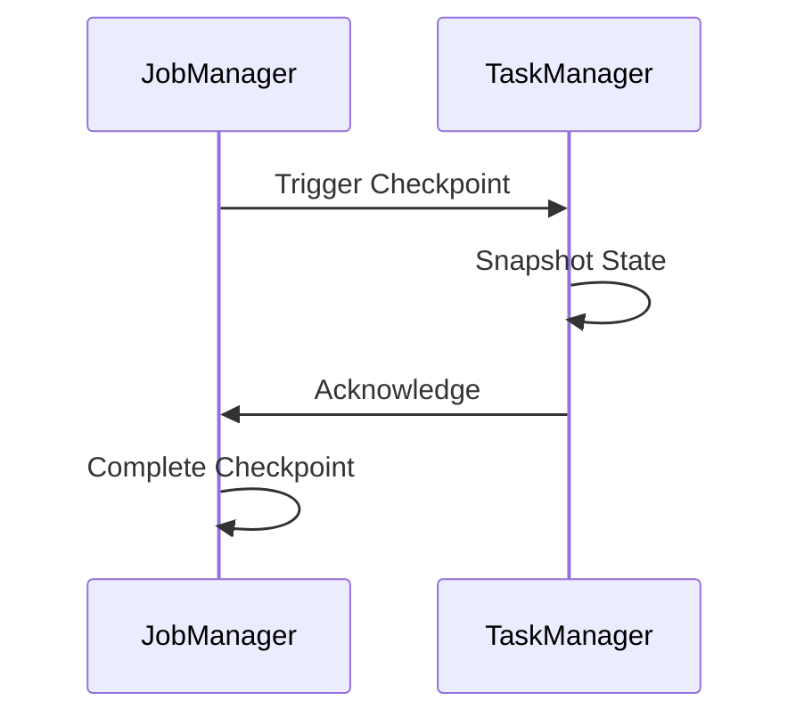

# 贡献指南 (Contributing Guide)

> 欢迎来到 AnalysisDataFlow 项目！我们致力于打造流计算领域最全面、最严谨的知识库。

本指南将帮助您了解如何为项目做出贡献，无论是报告问题、改进文档、分享案例，还是提交代码。

---

## 📋 目录

- [贡献方式](#贡献方式)
- [贡献流程](#贡献流程)
- [文档规范](#文档规范)
- [内容标准](#内容标准)
- [审核检查清单](#审核检查清单)
- [社区规范](#社区规范)
- [联系方式](#联系方式)

---

## 🎯 贡献方式

### 1. 报告问题 (Issue)

如果您发现以下问题，欢迎提交 Issue：

- **内容错误**：概念错误、公式错误、代码问题
- **链接失效**：外部引用链接无法访问
- **排版问题**：格式混乱、显示异常
- **建议改进**：内容补充、结构优化
- **定理缺失**：发现需要形式化论证的结论

**提交 Issue 模板**：

```markdown
## 问题类型
- [ ] 内容错误
- [ ] 链接失效
- [ ] 排版问题
- [ ] 建议改进
- [ ] 其他

## 位置
文件路径：`Struct/1.1-streaming-foundation.md`
章节：第 3 节

## 描述
简要描述问题...

## 期望
期望的结果或改进建议...

## 参考
相关引用、文献或资源链接...
```

### 2. 提交改进 (Pull Request)

欢迎通过 PR 提交以下改进：

- **修正错误**：修复内容、公式、代码中的错误
- **补充内容**：添加新的定理证明、案例分析
- **优化结构**：改进文档组织和导航
- **翻译贡献**：多语言版本支持
- **可视化**：添加或改进 Mermaid 图表

### 3. 文档建议

如果您对文档有以下建议，可以通过 Issue 或 Discussion 提出：

- 新主题建议
- 章节重组建议
- 示例补充建议
- 术语统一建议

### 4. 案例分享

分享您在生产环境中应用流计算技术的真实案例：

- **业务场景**：具体的业务背景和需求
- **技术选型**：为什么选择特定的技术方案
- **实施细节**：架构设计、关键配置
- **经验总结**：踩过的坑、最佳实践

---

## 🔄 贡献流程

### 第一步：Fork 项目

1. 访问 [项目主页](https://github.com/your-org/AnalysisDataFlow)
2. 点击右上角 **Fork** 按钮
3. 将项目 Fork 到您的个人账号

```bash
# 克隆您 Fork 的仓库
git clone https://github.com/YOUR_USERNAME/AnalysisDataFlow.git
cd AnalysisDataFlow

# 添加上游仓库
git remote add upstream https://github.com/your-org/AnalysisDataFlow.git
```

### 第二步：创建分支

```bash
# 从主分支创建新分支
git checkout main
git pull upstream main

# 创建功能分支
# 命名规范: {类型}/{简短描述}
# 类型: feat|fix|docs|refactor|chore
git checkout -b docs/add-watermark-theorem
```

**分支命名示例**：

| 类型 | 示例 | 说明 |
|------|------|------|
| `feat` | `feat/add-flink-ai-section` | 新增内容 |
| `fix` | `fix/typo-in-thm-01-03` | 修复错误 |
| `docs` | `docs/improve-checkpoint-explanation` | 文档改进 |
| `refactor` | `refactor/restructure-section-4` | 重构内容 |
| `chore` | `chore/update-theorem-registry` | 维护工作 |

### 第三步：进行修改

根据您的贡献类型进行相应修改：

#### 修改现有文档

1. 定位到需要修改的文件
2. 保持六段式模板结构
3. 更新定理注册表（如添加/修改定理）

#### 创建新文档

1. 根据内容确定目标目录 (`Struct/` / `Knowledge/` / `Flink/`)
2. 按照命名规范创建文件
3. 应用六段式模板
4. 更新 PROJECT-TRACKING.md

### 第四步：运行验证

提交前请进行以下验证：

```bash
# 1. 检查 Markdown 语法
# 推荐使用 markdownlint
npx markdownlint-cli "**/*.md" --ignore node_modules

# 2. 验证 Mermaid 图表语法
# 使用 Mermaid Live Editor 在线验证
# https://mermaid.live/

# 3. 检查定理编号是否唯一
# 运行本地验证脚本（如存在）
python scripts/validate_theorems.py

# 4. 检查链接有效性
# 推荐使用 markdown-link-check
npx markdown-link-check -q "**/*.md"
```

### 第五步：提交 PR

```bash
# 提交更改
git add .
git commit -m "docs: 添加 Watermark 延迟边界定理证明

- 添加 Thm-F-03-15 及其完整证明
- 补充延迟边界分析的 Mermaid 时序图
- 更新定理注册表

Fixes #123"

# 推送到您的 Fork
git push origin docs/add-watermark-theorem
```

**提交信息规范**：

```
<type>(<scope>): <subject>

<body>

<footer>
```

- **type**: `feat` | `fix` | `docs` | `refactor` | `chore`
- **scope**: 影响的目录或模块
- **subject**: 简短描述（不超过 50 字符）
- **body**: 详细说明（可选）
- **footer**: 关联 Issue（如 `Fixes #123`）

### 第六步：审核流程

```
┌─────────────┐    ┌─────────────┐    ┌─────────────┐    ┌─────────────┐
│   提交 PR   │ → │ 自动化检查  │ → │ 人工审核    │ → │   合并/反馈   │
└─────────────┘    └─────────────┘    └─────────────┘    └─────────────┘
                          │                  │
                          ▼                  ▼
                    ┌─────────────┐    ┌─────────────┐
                    │ Markdown    │    │ 内容审核    │
                    │ 格式检查    │    │ 定理验证    │
                    │ 链接检查    │    │ 引用验证    │
                    └─────────────┘    └─────────────┘
```

**审核时间**：通常在 3-5 个工作日内回复

---

## 📝 文档规范

### 六段式模板要求

所有核心文档必须包含以下结构：

```markdown
# 标题

> 所属阶段: Struct/ Knowledge/ Flink/ | 前置依赖: [文档链接] | 形式化等级: L1-L6

## 1. 概念定义 (Definitions)
严格的形式化定义 + 直观解释。必须包含至少一个 `Def-*` 编号。

## 2. 属性推导 (Properties)
从定义直接推导的引理与性质。必须包含至少一个 `Lemma-*` 或 `Prop-*` 编号。

## 3. 关系建立 (Relations)
与其他概念/模型/系统的关联、映射、编码关系。

## 4. 论证过程 (Argumentation)
辅助定理、反例分析、边界讨论、构造性说明。

## 5. 形式证明 / 工程论证 (Proof / Engineering Argument)
主要定理的完整证明，或工程选型的严谨论证。

## 6. 实例验证 (Examples)
简化实例、代码片段、配置示例、真实案例。

## 7. 可视化 (Visualizations)
至少一个 Mermaid 图（思维导图 / 层次图 / 执行树 / 对比矩阵 / 决策树 / 场景树）。

## 8. 引用参考 (References)
使用 `[^n]` 上标格式，在文档末尾集中列出引用。
```

### 定理编号规范

采用全局统一编号：`{类型}-{阶段}-{文档序号}-{顺序号}`

| 类型 | 缩写 | 示例 | 说明 |
|------|------|------|------|
| 定理 | Thm | `Thm-S-01-01` | Struct 阶段，01 文档，第 1 个定理 |
| 引理 | Lemma | `Lemma-S-01-02` | Struct 阶段引理 |
| 定义 | Def | `Def-S-01-01` | Struct 阶段定义 |
| 命题 | Prop | `Prop-S-03-01` | Struct 阶段命题 |
| 推论 | Cor | `Cor-S-02-01` | Struct 阶段推论 |

**编号分配**：

- 在创建文档前，查看 THEOREM-REGISTRY.md 获取最新编号
- 确保编号全局唯一
- 新增定理后及时更新注册表

### 引用格式规范

引用必须在文档末尾以列表形式集中呈现：

```markdown
[^1]: Apache Flink Documentation, "Checkpointing", 2025. https://nightlies.apache.org/flink/flink-docs-stable/docs/dev/datastream/fault-tolerance/checkpointing/
[^2]: T. Akidau et al., "The Dataflow Model", PVLDB, 8(12), 2015.
[^3]: L. Lamport, "Time, Clocks, and the Ordering of Events in a Distributed System", CACM, 21(7), 1978.
```

**优先级引用来源**：

1. **学术论文**：VLDB, SIGMOD, OSDI, SOSP, CACM, POPL, PLDI
2. **经典课程**：MIT 6.824/6.826, CMU 15-712, Stanford CS240, Berkeley CS162
3. **官方文档**：Apache Flink, Go Spec, Scala 3 Spec, Akka/Pekko Docs
4. **权威书籍**：Kleppmann《DDIA》, Akidau《Streaming Systems》

### Mermaid 图表规范

所有 Mermaid 图必须：

1. 使用 ````mermaid` 代码块包裹
2. 在图前添加简短文字说明
3. 选择恰当的图表类型

**推荐的图表类型**：

| 图表类型 | 用途 |
|----------|------|
| `graph TB/TD` | 层次结构、映射关系 |
| `flowchart TD` | 决策树、流程图 |
| `gantt` | 路线图、时间线 |
| `stateDiagram-v2` | 状态转移、执行树 |
| `classDiagram` | 类型/模型结构 |
| `sequenceDiagram` | 时序交互 |

**示例**：

```markdown
以下图表展示了 Checkpoint 的协调流程：


```

---

## ✅ 内容标准

### 准确性要求

- **概念准确**：术语定义符合学术界和工业界共识
- **公式正确**：数学推导无错误，符号使用一致
- **代码可运行**：代码片段经过实际验证
- **数据真实**：性能数据、基准测试结果有来源

### 来源引用要求

- **每段关键陈述**需有引用支持
- **原创结论**需明确标注并给出论证
- **间接引用**需追溯原始出处
- **链接有效性**：提交前验证外部链接可访问

### 形式化严谨性

| 等级 | 要求 | 适用场景 |
|------|------|----------|
| L1 | 概念定义 | 入门介绍、概览 |
| L2 | 形式化描述 | 算法说明、协议描述 |
| L3 | 部分证明 | 关键性质的直观论证 |
| L4 | 完整证明 | 核心定理的严格证明 |
| L5 | 机器验证 | 关键算法的形式化验证 |
| L6 | 可执行规范 | 可运行的形式化规范 |

### 工程实用性

- **可操作的指导**：不仅解释"是什么"，还要说明"怎么做"
- **权衡分析**：技术选型的利弊对比
- **最佳实践**：来自生产环境的经验总结
- **故障排查**：常见问题及解决方案

---

## 📋 审核检查清单

### 提交前自检清单

**内容质量**：

- [ ] 内容符合文档定位（Struct/Knowledge/Flink）
- [ ] 六段式模板结构完整
- [ ] 包含至少一个定理/定义/引理
- [ ] 包含至少一个 Mermaid 图表
- [ ] 引用格式正确，且不少于 3 条

**格式规范**：

- [ ] 文件名符合命名规范（小写，连字符分隔）
- [ ] Markdown 语法正确
- [ ] 代码块指定语言
- [ ] 列表、表格格式正确

**定理注册**：

- [ ] 定理编号全局唯一
- [ ] THEOREM-REGISTRY.md 已更新
- [ ] 编号格式符合规范

**链接验证**：

- [ ] 内部链接可访问
- [ ] 外部引用链接有效
- [ ] 图片路径正确

### 审核者检查清单

**内容审核**：

- [ ] 技术内容准确无误
- [ ] 引用来源权威可靠
- [ ] 论证逻辑严密
- [ ] 与现有内容无冲突

**格式审核**：

- [ ] 符合六段式模板
- [ ] 定理编号正确
- [ ] 引用格式规范
- [ ] Mermaid 语法正确

**完整性审核**：

- [ ] 更新 THEOREM-REGISTRY.md
- [ ] 更新 PROJECT-TRACKING.md
- [ ] 新增文档已添加到导航

### 合并标准

PR 合并需满足：

1. ✅ 通过所有自动化检查
2. ✅ 至少一名维护者审核通过
3. ✅ 所有审核意见已解决
4. ✅ 提交历史清晰（建议 squash）
5. ✅ 与主分支无冲突

---

## 🤝 社区规范

### 行为准则

我们致力于提供一个友好、包容、尊重的社区环境：

**鼓励的行为**：

- ✅ 尊重不同的观点和经验
- ✅ 乐于接受建设性批评
- ✅ 关注社区最有益的事情
- ✅ 对其他社区成员表示同理心

**不可接受的行为**：

- ❌ 使用歧视性语言或进行歧视性行为
- ❌ 发表侮辱性/贬损性评论或人身攻击
- ❌ 公开或私下骚扰他人
- ❌ 未经明确许可发布他人私人信息

### 沟通指南

**提问的智慧**：

1. 提问前请先搜索是否已有类似问题
2. 提供足够的上下文信息
3. 清晰地描述问题和期望结果
4. 对回答者表示感谢

**回复的善意**：

1. 对新贡献者保持耐心和鼓励
2. 指出问题时同时给出改进建议
3. 承认并感谢贡献者的努力
4. 使用礼貌和建设性的语言

### 认可机制

我们将对贡献者进行以下形式的认可：

- **Contributors 列表**：在 README 中列出所有贡献者
- **发布说明**：在版本更新中标注重要贡献
- **特别感谢**：对重大贡献者进行专门致谢
- **维护者邀请**：持续贡献者有机会成为项目维护者

---

## 📮 联系方式

### 讨论区 (Discussions)

- **一般讨论**：项目相关的一般性话题
- **问答区**：技术问题的提问和解答
- **创意分享**：新想法和特性建议
- **展示台**：分享使用案例和经验

### Issue 追踪

- **Bug 报告**：内容错误或技术问题
- **功能请求**：新内容或改进建议
- **文档改进**：文档相关的任务

### 即时通讯

- **Slack/Discord**：[邀请链接]
- **微信交流群**：扫码加入（见项目主页）

### 邮件联系

- **项目维护者**：maintainers@analysisdataflow.org
- **安全问题**：security@analysisdataflow.org

---

## 🎓 新贡献者指南

### 适合首次贡献的任务

查看带有以下标签的 Issue：

- `good first issue`：适合新手的简单任务
- `documentation`：文档改进任务
- `help wanted`：需要帮助的任务

### 首次贡献示例

```bash
# 1. Fork 并克隆项目
git clone https://github.com/YOUR_USERNAME/AnalysisDataFlow.git

# 2. 创建分支
git checkout -b fix/typo-in-readme

# 3. 进行修改
# 修正 README.md 中的拼写错误

# 4. 提交
git add README.md
git commit -m "fix: 修正 README 中的拼写错误"
git push origin fix/typo-in-readme

# 5. 创建 PR，等待审核
```

---

## 📚 资源推荐

### 学习资源

- [项目 AGENTS.md](./AGENTS.md) - 项目工作规范
- [THEOREM-REGISTRY.md](./THEOREM-REGISTRY.md) - 定理注册表
- [PROJECT-TRACKING.md](./PROJECT-TRACKING.md) - 项目进度

### 工具推荐

- **Markdown 编辑器**：VS Code + Markdown All in One
- **Mermaid 预览**：Mermaid Live Editor
- **链接检查**：markdown-link-check
- **格式检查**：markdownlint

---

## 📄 许可证

通过提交 PR，您同意您的贡献将采用与项目相同的许可证：[LICENSE](./LICENSE)

---

## 🙏 致谢

感谢所有为 AnalysisDataFlow 项目做出贡献的社区成员！

您的每一份贡献都在帮助构建流计算领域最全面、最严谨的知识库。

---

*最后更新：2026-04-03*
