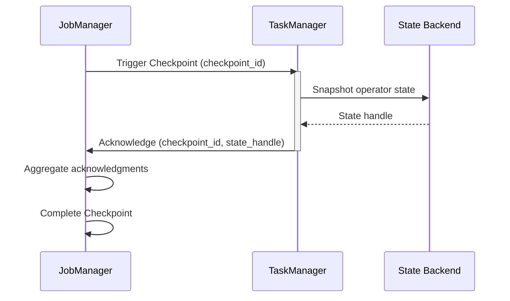
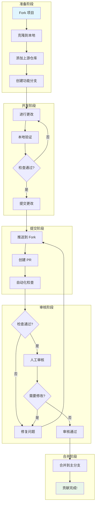
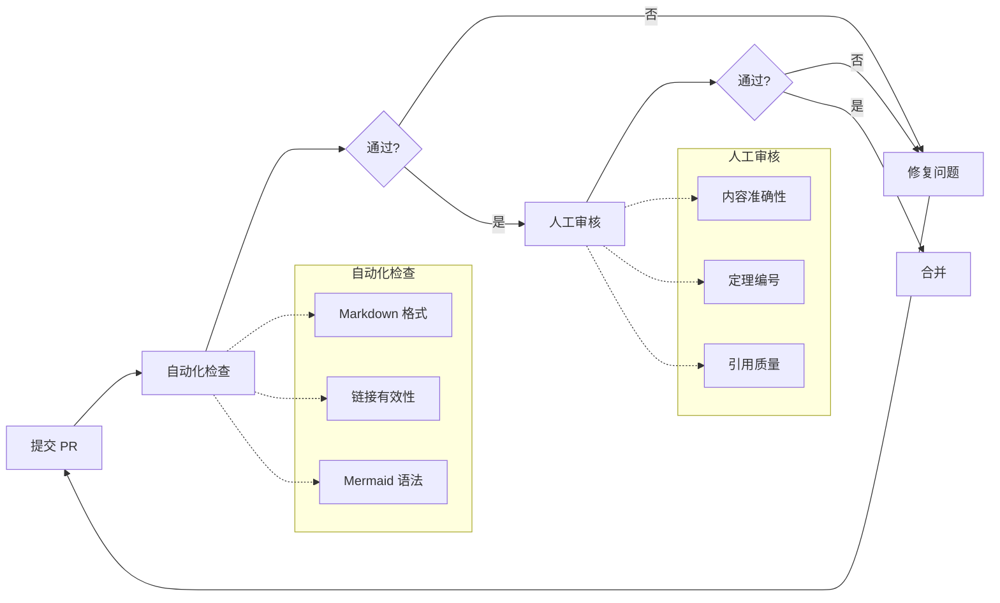

> **状态**: 🔮 前瞻内容 | **风险等级**: 高 | **最后更新**: 2026-04
> 
> 此文档描述的内容处于早期规划阶段，可能与最终实现不符。请以 Apache Flink 官方发布为准。
# 社区贡献者完整指南 (Contributing Guide)

> 欢迎来到 AnalysisDataFlow 项目！我们致力于打造流计算领域最全面、最严谨的知识库。

本指南将帮助您了解如何为项目做出贡献，包括文档改进、错误报告、功能建议和代码贡献等各个方面。

---

## 目录

- [1. 贡献方式](#1-贡献方式)
  - [1.1 文档改进](#11-文档改进)
  - [1.2 错误报告](#12-错误报告)
  - [1.3 功能建议](#13-功能建议)
  - [1.4 代码贡献](#14-代码贡献)
  - [1.5 提交生产案例](#15-提交生产案例)
- [2. 文档贡献流程](#2-文档贡献流程)
  - [2.1 六段式模板规范](#21-六段式模板规范)
  - [2.2 定理定义编号规范](#22-定理定义编号规范)
  - [2.3 Mermaid图表规范](#23-mermaid图表规范)
  - [2.4 引用格式规范](#24-引用格式规范)
  - [2.5 基于最新网络信息更新文档的SOP](#25-基于最新网络信息更新文档的sop)
- [3. Pull Request流程](#3-pull-request流程)
  - [3.1 Fork和分支](#31-fork和分支)
  - [3.2 提交规范](#32-提交规范)
  - [3.3 审查清单](#33-审查清单)
  - [3.4 分支保护规则](#34-分支保护规则)
  - [3.5 合并策略](#35-合并策略)
- [4. 本地验证](#4-本地验证)
  - [4.1 Markdown语法检查](#41-markdown语法检查)
  - [4.2 链接检查](#42-链接检查)
  - [4.3 Mermaid渲染测试](#43-mermaid渲染测试)
- [5. 风格指南](#5-风格指南)
  - [5.1 写作风格](#51-写作风格)
  - [5.2 术语使用](#52-术语使用)
  - [5.3 代码示例规范](#53-代码示例规范)
  - [5.4 中英文混排规范](#54-中英文混排规范)
- [6. 认可机制](#6-认可机制)
  - [6.1 贡献者列表](#61-贡献者列表)
  - [6.2 致谢规范](#62-致谢规范)
- [7. 社区规范](#7-社区规范)
- [8. 联系方式](#8-联系方式)

---

## 1. 贡献方式

### 1.1 文档改进

文档改进是最受欢迎的贡献方式之一。您可以通过以下方式改进文档：

| 改进类型 | 具体说明 | 示例 |
|---------|---------|------|
| **修正错误** | 修复拼写错误、语法错误、概念错误 | 修正定理证明中的数学错误 |
| **补充内容** | 添加缺失的说明、示例或引用 | 为复杂概念添加直观解释 |
| **优化结构** | 改进文档组织和可读性 | 重组章节使逻辑更清晰 |
| **翻译贡献** | 多语言版本支持 | 将核心文档翻译成英文 |
| **可视化增强** | 添加或改进 Mermaid 图表 | 为复杂流程添加时序图 |

**文档改进提交流程**：
1. 确定改进范围（单篇文档/多篇文档/全局改进）
2. 创建 Issue 描述改进内容（可选但推荐）
3. 按照 [Pull Request流程](#3-pull-request流程) 提交修改

### 1.2 错误报告

发现错误时，请通过 GitHub Issue 提交报告。

**错误报告模板**：

```markdown
## 错误类型
- [ ] 内容错误（概念/公式/代码错误）
- [ ] 链接失效（外部引用无法访问）
- [ ] 排版问题（格式混乱/显示异常）
- [ ] 定理/定义问题（编号冲突/表述不清）

## 问题位置
- 文件路径：`Struct/1.1-streaming-foundation.md`
- 章节：第 3 节 "概念定义"
- 定理/定义编号：`Def-S-01-03`

## 问题描述
详细描述发现的问题...

## 期望修复
描述期望的正确结果或改进建议...

## 参考依据
提供相关的引用、文献或权威来源链接...

## 补充信息
- 截图（如适用）
- 建议的修复方案
```

**优质错误报告的特征**：
- 提供具体的文件路径和位置
- 描述清晰，包含复现步骤
- 提供权威来源支持您的观点
- 保持礼貌和建设性

### 1.3 功能建议

如果您对项目有新功能或改进建议，欢迎通过 Issue 或 Discussion 提出。

**功能建议类型**：

| 类型 | 说明 | 示例 |
|-----|------|------|
| **新主题建议** | 建议添加新的知识领域 | 添加 "流计算与AI结合" 主题 |
| **章节重组** | 建议改进文档组织结构 | 将相关内容整合到同一章节 |
| **工具/流程改进** | 建议改进贡献流程或工具 | 添加自动化定理编号检查 |
| **交互功能** | 建议改进用户体验 | 添加文档内搜索功能 |

**功能建议模板**：

```markdown
## 建议类型
- [ ] 新主题
- [ ] 结构改进
- [ ] 工具/流程改进
- [ ] 其他

## 详细描述
清晰描述您的建议...

## 动机/背景
说明为什么这个建议对项目有益...

## 实施方案
建议如何实施（可选）...

## 参考资源
相关的参考资料或示例...
```

### 1.4 代码贡献

虽然本项目主要是文档知识库，但也接受以下类型的代码贡献：

**可接受的代码贡献**：

| 类型 | 说明 | 位置 |
|-----|------|------|
| **验证脚本** | 定理编号检查、链接检查等自动化工具 | `.scripts/` 目录 |
| **文档生成工具** | 自动生成索引、统计报告的工具 | `.scripts/` 目录 |
| **示例代码** | 配合文档的可运行示例 | 相应文档中或 `examples/` |
| **CI/CD 配置** | GitHub Actions 工作流 | `.github/workflows/` |

**代码贡献要求**：
- 代码需有清晰的注释和文档
- 包含使用说明和测试用例
- 遵循项目现有的代码风格
- 不引入不必要的依赖

**不接受大型代码库贡献**，本项目核心是文档知识库而非软件项目。

### 1.5 提交生产案例

生产案例分享是本项目的重要贡献方式。通过分享真实生产环境中的流计算实践经验，帮助社区了解技术在实际场景中的应用。

**什么是生产案例**：
- 基于真实生产环境的流计算系统实践
- 包含具体的架构设计、技术选型、问题诊断和优化经验
- 有可量化的业务成果和技术指标

**提交方式**：

| 方式 | 适用场景 | 操作步骤 |
|------|----------|----------|
| **GitHub Issue** | 首次提交，需要指导 | 使用 [🏭 生产案例提交](../../issues/new?template=production_case.yml) 模板 |
| **Pull Request** | 已有案例文档 | Fork → 按模板编写 → 提交 PR |
| **邮件提交** | 不便公开提交 | 发送邮件至项目维护团队 |

**案例内容要求**：

1. **基本信息**
   - 公司/行业背景（可匿名）
   - 业务场景描述
   - 系统规模指标（吞吐量、延迟、集群规模等）

2. **技术架构**
   - 整体架构图
   - 技术栈选型及理由
   - 关键配置参数

3. **挑战与方案**
   - 遇到的主要技术挑战
   - 问题根因分析
   - 解决方案和实施细节

4. **项目成果**
   - 量化技术指标对比
   - 业务价值体现
   - 经验总结和最佳实践

**案例模板**：

详细模板参见 [templates/production-case-template.md](./templates/production-case-template.md)。

**审核流程**：

案例提交后将经过以下审核流程：
1. **格式初审**（1-2天）- 检查内容完整性和格式规范
2. **技术评审**（3-5天）- 专家审核技术内容的准确性
3. **内容优化** - 根据反馈完善案例
4. **发布确认** - 作者确认后正式发布

详细流程参见 [COMMUNITY/case-review-process.md](./COMMUNITY/case-review-process.md)。

**隐私保护**：
- 支持匿名提交（如"某电商平台"）
- 敏感数据可进行脱敏处理
- 发布前会与作者确认最终内容

**参与回报**：
- 案例收录至官方案例库（`phase2-case-studies/`）
- 项目首页展示和社区推广
- 贡献者名单记录和项目证书

更多详情请参阅 [COMMUNITY/production-case-call.md](./COMMUNITY/production-case-call.md)。

---

## 2. 文档贡献流程

### 2.1 六段式模板规范

所有核心 Markdown 文档必须包含以下结构：

```markdown
# 标题

> 所属阶段: Struct/ Knowledge/ Flink/ | 前置依赖: [文档链接] | 形式化等级: L1-L6

## 1. 概念定义 (Definitions)
严格的形式化定义 + 直观解释。必须包含至少一个 `Def-*` 编号。

## 2. 属性推导 (Properties)
从定义直接推导的引理与性质。必须包含至少一个 `Lemma-*` 或 `Prop-*` 编号。

## 3. 关系建立 (Relations)
与其他概念/模型/系统的关联、映射、编码关系。

## 4. 论证过程 (Argumentation)
辅助定理、反例分析、边界讨论、构造性说明。

## 5. 形式证明 / 工程论证 (Proof / Engineering Argument)
主要定理的完整证明，或工程选型的严谨论证。

## 6. 实例验证 (Examples)
简化实例、代码片段、配置示例、真实案例。

## 7. 可视化 (Visualizations)
至少一个 Mermaid 图（思维导图 / 层次图 / 执行树 / 对比矩阵 / 决策树 / 场景树）。

## 8. 引用参考 (References)
使用 `[^n]` 上标格式，在文档末尾集中列出引用。
```

**各章节要求**：

| 章节 | 必须性 | 内容要求 | 形式化元素 |
|-----|-------|---------|-----------|
| 概念定义 | 必须 | 严格定义 + 直观解释 | 至少 1 个 Def-* |
| 属性推导 | 必须 | 从定义推导的性质 | 至少 1 个 Lemma-* 或 Prop-* |
| 关系建立 | 可选 | 与其他概念/系统的关系 | - |
| 论证过程 | 可选 | 辅助论证、边界分析 | - |
| 形式证明 | 必须 | 核心定理的完整证明 | 至少 1 个 Thm-* |
| 实例验证 | 必须 | 代码/配置/案例示例 | - |
| 可视化 | 必须 | Mermaid 图表 | 至少 1 个图表 |
| 引用参考 | 必须 | 权威来源引用 | 至少 3 条引用 |

### 2.2 定理定义编号规范

采用全局统一编号体系：`{类型}-{阶段}-{文档序号}-{顺序号}`

**类型缩写**：

| 类型 | 缩写 | 示例 | 说明 |
|------|------|------|------|
| 定理 | Thm | `Thm-S-01-01` | Struct 阶段，01 文档，第 1 个定理 |
| 引理 | Lemma | `Lemma-S-01-02` | Struct 阶段引理 |
| 定义 | Def | `Def-S-01-01` | Struct 阶段定义 |
| 命题 | Prop | `Prop-S-03-01` | Struct 阶段命题 |
| 推论 | Cor | `Cor-S-02-01` | Struct 阶段推论 |

**阶段标识**：

| 目录 | 阶段标识 | 示例 |
|-----|---------|------|
| `Struct/` | S | `Thm-S-01-01` |
| `Knowledge/` | K | `Def-K-03-05` |
| `Flink/` | F | `Thm-F-12-08` |

**编号分配流程**：

1. **查看注册表**：在创建文档前，查看 [THEOREM-REGISTRY.md](./THEOREM-REGISTRY.md) 获取最新编号
2. **确保唯一性**：检查新编号是否与现有编号冲突
3. **顺序分配**：在同一文档内按顺序分配编号
4. **及时更新**：新增定理后必须更新注册表

**示例**：
```markdown
**定义 1.1** (Watermark): `Def-F-03-01`

Watermark 是一个时间戳 $t$，表示所有时间戳 $\leq t$ 的事件都已到达...

---

**定理 3.2** (Exactly-Once 语义保证): `Thm-F-03-05`

在 Flink 的 Checkpoint 机制下，流处理作业可以提供 Exactly-Once 语义保证...

**证明**：
...
```

### 2.3 Mermaid图表规范

所有 Mermaid 图表必须满足以下要求：

**基本规范**：
1. 使用 `mermaid` 代码块包裹
2. 在图前添加简短文字说明
3. 选择恰当的图表类型

**推荐的图表类型**：

| 图表类型 | 用途 | 示例场景 |
|---------|------|---------|
| `graph TB/TD` | 层次结构、映射关系 | 概念层次图、架构图 |
| `flowchart TD` | 决策树、流程图 | 决策流程、算法流程 |
| `gantt` | 路线图、时间线 | 项目计划、版本路线图 |
| `stateDiagram-v2` | 状态转移、执行树 | 状态机、执行流程 |
| `classDiagram` | 类型/模型结构 | 类型系统、类关系 |
| `sequenceDiagram` | 时序交互 | 协议交互、调用序列 |
| `mindmap` | 思维导图 | 概念关联、知识图谱 |

**图表设计原则**：
- 节点命名清晰，使用有意义的标识符
- 复杂图表分层次展示，避免过于拥挤
- 使用统一的配色方案（优先使用默认配色）
- 添加图例说明（如节点类型较多）

**示例**：

```markdown
以下图表展示了 Checkpoint 的协调流程：


```

### 2.4 引用格式规范

引用必须在文档末尾以列表形式集中呈现。

**引用格式**：

```markdown
[^1]: Apache Flink Documentation, "Checkpointing", 2025. https://nightlies.apache.org/flink/flink-docs-stable/docs/dev/datastream/fault-tolerance/checkpointing/
[^2]: T. Akidau et al., "The Dataflow Model", PVLDB, 8(12), 2015. https://doi.org/10.14778/2824032.2824076
[^3]: L. Lamport, "Time, Clocks, and the Ordering of Events in a Distributed System", CACM, 21(7), 1978. https://doi.org/10.1145/359545.359563
```

**引用格式说明**：

| 来源类型 | 格式 | 示例 |
|---------|------|------|
| 学术论文 | 作者, "标题", 期刊/会议, 卷(期), 年份. DOI/URL | `[^2]: T. Akidau et al., "The Dataflow Model", PVLDB, 8(12), 2015.` |
| 官方文档 | 项目, "文档标题", 年份. URL | `[^1]: Apache Flink Documentation, "Checkpointing", 2025. URL` |
| 经典论文 | 作者, "标题", 期刊, 卷(期), 年份. DOI | `[^3]: L. Lamport, "Time, Clocks...", CACM, 21(7), 1978.` |
| 书籍 | 作者, 《书名》, 出版社, 年份. | `[^4]: M. Kleppmann, 《Designing Data-Intensive Applications》, O'Reilly, 2017.` |

**优先级引用来源**（按优先级排序）：

1. **顶级会议/期刊论文**：VLDB, SIGMOD, OSDI, SOSP, CACM, POPL, PLDI, NSDI
2. **经典课程**：MIT 6.824/6.826, CMU 15-712, Stanford CS240, Berkeley CS162
3. **官方文档**：Apache Flink, Go Spec, Scala 3 Spec, Akka/Pekko Docs
4. **权威书籍**：Kleppmann《DDIA》, Akidau《Streaming Systems》, Kleppmann《Making Sense of Stream Processing》

**引用原则**：
- 每段关键陈述需有引用支持
- 原创结论需明确标注并给出论证
- 间接引用需追溯原始出处
- 优先使用 DOI 或稳定 URL
- 提交前验证外部链接可访问

### 2.5 基于最新网络信息更新文档的SOP

当外部技术生态发生重大变化（如 Flink 新版本发布、新 FLIP 接受、AI 协议规范更新、新论文发表）时，贡献者应遵循以下标准作业流程（SOP）更新项目文档：

#### SOP 六步法

| 步骤 | 行动 | 检查清单 |
|------|------|----------|
| **1. 信息源验证** | 确认信息来源的权威性 | □ 官方发布（Apache Flink Blog/Release/JIRA）<br>□ 顶级论文（VLDB/SIGMOD/OSDI/SOSP/NSDI）<br>□ 知名技术博客（Confluent/Ververica/Databricks）<br>□ 标准组织公告（NIST/IETF/LF AI & Data） |
| **2. 影响评估** | 识别需要更新的文档范围 | □ 版本跟踪文档（version-tracking/roadmap）<br>□ 概念定义文档（Struct/Knowledge 基础理论）<br>□ 工程实践文档（Flink 配置/部署/调优）<br>□ 案例研究（case-studies）<br>□ 英文翻译（en/） |
| **3. 状态标记更新** | 区分"已发布"与"前瞻规划" | □ GA/Released 功能移除"尚未正式发布"注释<br>□ Preview/Draft 功能保留风险等级声明<br>□ 虚构 API/参数添加`<!-- 概念设计 -->`注释 |
| **4. 六段式结构检查** | 确保新增/修改内容符合模板 | □ 概念定义 ≥ 1 个 `Def-*`<br>□ 属性推导 ≥ 1 个 `Lemma-*`/`Prop-*`<br>□ 形式证明/工程论证 ≥ 1 个 `Thm-*`<br>□ 可视化 ≥ 1 个 Mermaid 图<br>□ 引用 ≥ 3 条权威来源 |
| **5. 交叉引用与编号检查** | 维护文档网络的完整性 | □ 新增定理已更新 `THEOREM-REGISTRY.md`<br>□ 新增文档已纳入对应 `00-INDEX.md`/`README.md`<br>□ 内部链接（`[text](./path.md#anchor)`）已验证可访问<br>□ 形式化元素编号无冲突 |
| **6. PR 前质量门禁** | 通过自动化检查 | □ 运行 `.scripts/cross-ref-checker-v2.py`<br>□ 运行 `.scripts/six-section-validator.py`<br>□ 运行 `.scripts/mermaid-syntax-checker.py`<br>□ 提交 PR 并等待 GitHub Actions 通过 |

#### 模板示例：更新 FLIP 状态

```markdown
## 变更摘要
- **信息源**: Apache Flink Community Update (2026-03)
- **变更内容**: FLIP-564 标题从 "HTTP/3 Protocol Support" 修正为 "FROM_CHANGELOG/TO_CHANGELOG Built-in PTFs"
- **影响文档**:
  - `Flink/00-meta/version-tracking/flink-26-27-roadmap.md`
  - `Flink/00-meta/version-tracking/flink-26-27-status-report.md`
  - `Flink/08-roadmap/08.01-flink-24/FLIP-TRACKING-SYSTEM.md`
- **新增 FLIP**: FLIP-555 (Native S3), FLIP-566 (IMMUTABLE columns)
- **检查项**:
  - [x] 六段式结构合规
  - [x] 形式化编号无冲突
  - [x] 交叉引用已验证
  - [x] 外部链接可访问
```

**注意事项**：
- 对于前瞻性内容，即使基于官方讨论，也**必须**添加风险声明（`> ⚠️ 前瞻性声明`）
- 禁止将虚构的 API、Maven 坐标、配置参数呈现为既定事实
- 涉及安全/合规的内容（如 MCP 认证、NIST 标准）需特别标注来源和生效日期

---

## 3. Pull Request流程

以下图表展示了完整的 PR 流程：



### 3.1 Fork和分支

**第一步：Fork 项目**

```bash
# 1. 在 GitHub 上 Fork 项目到您的个人账号

# 2. 克隆您 Fork 的仓库
git clone https://github.com/YOUR_USERNAME/AnalysisDataFlow.git
cd AnalysisDataFlow

# 3. 添加上游仓库
git remote add upstream https://github.com/your-org/AnalysisDataFlow.git
git fetch upstream
```

**第二步：创建分支**

```bash
# 从主分支同步最新代码
git checkout main
git pull upstream main
git push origin main

# 创建功能分支
# 命名规范: {类型}/{简短描述}
# 类型: feat|fix|docs|refactor|chore
git checkout -b docs/add-watermark-theorem
```

**分支命名规范**：

| 类型 | 前缀 | 示例 | 说明 |
|------|------|------|------|
| `feat` | `feat/` | `feat/add-flink-ai-section` | 新增内容或功能 |
| `fix` | `fix/` | `fix/typo-in-thm-01-03` | 修复错误 |
| `docs` | `docs/` | `docs/improve-checkpoint-explanation` | 文档改进 |
| `refactor` | `refactor/` | `refactor/restructure-section-4` | 重构内容 |
| `chore` | `chore/` | `chore/update-theorem-registry` | 维护工作 |

**分支命名最佳实践**：
- 使用小写字母和连字符分隔
- 描述简洁但清晰（建议不超过 50 字符）
- 避免使用特殊字符

### 3.2 提交规范

**提交信息格式**：

```
<type>(<scope>): <subject>

<body>

<footer>
```

**各字段说明**：

| 字段 | 说明 | 示例 |
|-----|------|------|
| `type` | 提交类型 | `feat`, `fix`, `docs`, `refactor`, `chore` |
| `scope` | 影响范围 | `struct`, `knowledge`, `flink`, `theorem-registry` |
| `subject` | 简短描述 | 不超过 50 字符，使用祈使句 |
| `body` | 详细说明 | 可选，描述变更原因和详细内容 |
| `footer` | 页脚信息 | 关联 Issue，如 `Fixes #123` |

**提交类型**：

| 类型 | 说明 | 示例 |
|-----|------|------|
| `feat` | 新功能/新内容 | `feat(flink): 添加 Flink AI Agents 章节` |
| `fix` | 修复错误 | `fix(struct): 修正 Thm-S-01-03 的证明` |
| `docs` | 文档改进 | `docs(knowledge): 改进 Watermark 概念解释` |
| `refactor` | 重构 | `refactor(flink): 重组 Checkpoint 章节结构` |
| `chore` | 维护工作 | `chore: 更新定理注册表 v2.8` |

**提交示例**：

```bash
# 添加新定理的提交
git commit -m "feat(struct): 添加 Watermark 延迟边界定理

- 添加 Thm-S-03-15: Watermark 延迟边界定理
- 补充完整的形式化证明
- 添加延迟边界分析的 Mermaid 时序图
- 更新 THEOREM-REGISTRY.md

Fixes #123"

# 修复错误的提交
git commit -m "fix(flink): 修正 Checkpoint 超时配置说明

将 checkpoint.timeout 默认值从 10min 修正为 10min (600000ms)

Closes #456"

# 文档改进的提交
git commit -m "docs(knowledge): 改进 Exactly-Once 语义解释

- 添加更多直观示例
- 补充与其他一致性模型的对比
- 优化章节结构"
```

**提交最佳实践**：
- 每个提交专注于单一变更
- 提交信息使用祈使句（"添加"而非"添加了"）
- 详细说明在 body 中描述，subject 保持简洁
- 关联相关 Issue（如有）

### 3.3 审查清单

**提交前自检清单**：

**内容质量检查**：
- [ ] 内容符合文档定位（Struct/Knowledge/Flink）
- [ ] 六段式模板结构完整
- [ ] 包含至少一个定理/定义/引理（如适用）
- [ ] 包含至少一个 Mermaid 图表
- [ ] 引用格式正确，且不少于 3 条
- [ ] 所有引用链接有效（已验证）

**格式规范检查**：
- [ ] 文件名符合命名规范（小写，连字符分隔）
- [ ] Markdown 语法正确
- [ ] 代码块指定语言
- [ ] 列表、表格格式正确
- [ ] 中英文混排符合规范

**定理注册检查**：
- [ ] 定理编号全局唯一
- [ ] 编号格式符合规范
- [ ] THEOREM-REGISTRY.md 已更新（如添加/修改定理）

**链接验证检查**：
- [ ] 内部链接可访问
- [ ] 外部引用链接有效
- [ ] 图片路径正确

**维护文件检查**：
- [ ] PROJECT-TRACKING.md 已更新（如新增文档）
- [ ] NAVIGATION-INDEX.md 已更新（如新增文档）
- [ ] 相关交叉引用已更新

**审核者检查清单**：

**内容审核**：
- [ ] 技术内容准确无误
- [ ] 引用来源权威可靠
- [ ] 论证逻辑严密
- [ ] 与现有内容无冲突
- [ ] 数学公式正确（如有）
- [ ] 代码示例可运行（如有）

**格式审核**：
- [ ] 符合六段式模板
- [ ] 定理编号正确
- [ ] 引用格式规范
- [ ] Mermaid 语法正确
- [ ] 中英文混排规范

**完整性审核**：
- [ ] THEOREM-REGISTRY.md 已更新
- [ ] PROJECT-TRACKING.md 已更新（如新增文档）
- [ ] 新增文档已添加到导航索引
- [ ] 所有审核意见已解决

### 3.4 分支保护规则

**main 分支保护策略**：

本仓库已配置以下分支保护规则，确保代码质量和协作效率：

| 规则 | 说明 | 目的 |
|-----|------|------|
| **必需 PR Review** | 至少 1 人批准才能合并 | 保证内容质量 |
| **必需 CI 通过** | Markdown 检查、链接检查、Mermaid 验证等 | 自动化质量门禁 |
| **要求最新代码** | 合并前必须同步 main 分支最新更改 | 避免冲突 |
| **禁止 Force Push** | 不允许强制推送到 main | 保护提交历史 |
| **禁止直接 Push** | 所有更改必须通过 PR | 确保审查流程 |
| **对话解决** | 所有审查对话必须解决后才能合并 | 确保问题闭环 |

**贡献者注意事项**：

1. **不要直接推送到 main 分支** - 所有更改必须通过 Pull Request
2. **保持分支最新** - 提交 PR 前确保您的分支与 main 同步
3. **等待 CI 通过** - 所有自动化检查必须通过
4. **响应审查意见** - 及时回应维护者的反馈

### 3.5 合并策略

**合并流程**：



**合并标准**：

PR 合并需满足以下条件：

1. **自动化检查通过**
   - Markdown 格式检查通过
   - 链接有效性检查通过
   - Mermaid 语法检查通过（如适用）

2. **人工审核通过**
   - 至少一名维护者审核通过
   - 所有审核意见已解决
   - 无未解决的讨论

3. **内容质量达标**
   - 符合文档规范和模板要求
   - 技术内容准确无误
   - 与现有内容协调一致

4. **流程合规**
   - 提交历史清晰（复杂 PR 建议 squash）
   - 与主分支无冲突
   - 关联 Issue 已处理（如有）

**合并方式**：

| 方式 | 适用场景 | 说明 |
|-----|---------|------|
| **Merge** | 简单 PR | 保留完整提交历史 |
| **Squash and Merge** | 复杂 PR | 将多个提交压缩为一个 |
| **Rebase and Merge** | 需要线性历史 | 变基后合并 |

**审核时间**：通常在 3-5 个工作日内回复

---

## 4. 本地验证

在提交 PR 前，请在本地进行以下验证：

### 4.1 Markdown语法检查

**使用 markdownlint**：

```bash
# 安装 markdownlint-cli
npm install -g markdownlint-cli

# 检查所有 Markdown 文件
npx markdownlint-cli "**/*.md" --ignore node_modules --ignore .git

# 检查特定文件
npx markdownlint-cli Struct/1.1-streaming-foundation.md

# 自动修复可修复的问题
npx markdownlint-cli "**/*.md" --fix --ignore node_modules
```

**项目自定义规则**（`.markdownlint.json`）：

```json
{
  "line-length": false,
  "no-duplicate-heading": {
    "allow_different_nesting": true
  },
  "no-inline-html": false,
  "no-hard-tabs": true,
  "no-trailing-spaces": true,
  "no-multiple-blanks": {
    "maximum": 2
  }
}
```

**常见错误及修复**：

| 错误 | 说明 | 修复方法 |
|-----|------|---------|
| `MD013/line-length` | 行长度超过限制 | 关闭此规则或换行 |
| `MD024/no-duplicate-heading` | 重复标题 | 确保同级标题唯一 |
| `MD033/no-inline-html` | 使用内联 HTML | 关闭此规则或改用 Markdown |
| `MD041/first-line-heading` | 文件未以标题开头 | 添加一级标题 |

### 4.2 链接检查

**使用 markdown-link-check**：

```bash
# 安装 markdown-link-check
npm install -g markdown-link-check

# 检查特定文件
npx markdown-link-check Struct/1.1-streaming-foundation.md

# 检查所有文件（使用配置文件）
find . -name "*.md" -not -path "./node_modules/*" -exec npx markdown-link-check {} \;

# 安静模式
npx markdown-link-check -q "**/*.md"
```

**配置文件**（`.markdown-link-check.json`）：

```json
{
  "timeout": "20s",
  "retryOn429": true,
  "retryCount": 3,
  "fallbackRetryDelay": "30s",
  "aliveStatusCodes": [200, 206],
  "ignorePatterns": [
    {
      "pattern": "^#"
    },
    {
      "pattern": "^mailto:"
    }
  ]
}
```

**链接检查最佳实践**：
- 定期检查外部链接有效性
- 优先使用 DOI 或稳定 URL
- 对可能失效的链接添加存档版本（如 Wayback Machine）

### 4.3 Mermaid渲染测试

**在线验证**：

1. 访问 [Mermaid Live Editor](https://mermaid.live/)
2. 粘贴您的 Mermaid 代码
3. 检查渲染结果是否正确

**本地验证（使用 Mermaid CLI）**：

```bash
# 安装 Mermaid CLI
npm install -g @mermaid-js/mermaid-cli

# 渲染测试
mmdc -i test.mmd -o test.svg

# 如果渲染成功，说明语法正确
```

**VS Code 扩展**：

推荐使用以下 VS Code 扩展进行实时预览：
- **Markdown Preview Mermaid Support**：在 Markdown 预览中显示 Mermaid 图表
- **Mermaid Preview**：独立的 Mermaid 图表预览

**常见 Mermaid 语法错误**：

| 错误 | 示例 | 修复 |
|-----|------|------|
| 节点名包含特殊字符 | `A-->B()` | 使用引号 `A-->"B()"` |
| 循环依赖 | `A-->B-->A` | 确保有终止条件 |
| 缩进错误 | 使用空格缩进 | 使用 Tab 或统一空格数 |
| 缺少结束标记 | `graph TD` 未闭合 | 检查代码块标记 |

---

## 5. 风格指南

### 5.1 写作风格

**基本原则**：

| 原则 | 说明 | 示例 |
|-----|------|------|
| **准确性** | 概念准确，术语一致 | 统一使用 "Checkpoint" 而非混用 "检查点" |
| **清晰性** | 表达清晰，逻辑严密 | 使用"首先...其次...最后"代替冗长段落 |
| **简洁性** | 言简意赅，避免冗余 | "Flink 的 Checkpoint 机制" 而非 "Apache Flink 流计算框架所提供的 Checkpoint 容错机制" |
| **完整性** | 内容完整，论证充分 | 每个概念都需定义、解释、示例 |

**语气和风格**：

- 使用客观、学术的语气
- 使用主动语态（"我们定义"而非"被定义"）
- 使用现在时态
- 避免口语化表达
- 避免营销语言（"革命性的"、"最佳的"）
- 避免主观评价（"显然"、"众所周知"）

**段落结构**：

- 每段聚焦一个主题
- 段首句概括段落主旨
- 段落长度控制在 3-5 句话
- 使用过渡句连接段落

**列表使用**：

- 使用有序列表表示步骤或优先级
- 使用无序列表表示并列项
- 列表项保持平行结构（语法一致）
- 嵌套列表不超过 3 层

### 5.2 术语使用

**术语一致性**：

| 首选术语 | 避免使用 | 说明 |
|---------|---------|------|
| Checkpoint | 检查点 | 使用英文术语 |
| Watermark | 水印/水位线 | 使用英文术语 |
| Exactly-Once | 恰好一次 | 使用英文术语 |
| 流处理 | 流式处理/流计算 | 统一使用 "流处理" |
| 算子 | Operator | 中文文档使用 "算子" |
| 有状态 | Stateful | 中文文档使用 "有状态" |

**术语定义**：

- 首次出现的重要术语需给出定义
- 使用 `**术语**` 格式突出显示
- 可在术语后标注英文原文（可选）

**示例**：
```markdown
**Watermark**（水位线）是一种时间戳机制，用于衡量事件时间处理的进度...
```

**缩略语**：

- 首次使用时给出全称和缩写
- 后续使用缩写
- 常见缩略语可省略全称（如 CPU、GPU）

**示例**：
```markdown
Apache Flink 实现了异步屏障快照（Asynchronous Barrier Snapshotting，ABS）机制。ABS 允许...
```

### 5.3 代码示例规范

**代码块格式**：

- 使用围栏代码块
- 指定语言标识符
- 保持代码可运行

**示例**：
````markdown
```java

import org.apache.flink.streaming.api.datastream.DataStream;

// Java 代码示例
DataStream<Event> stream = env
    .addSource(new KafkaSource<>())
    .assignTimestampsAndWatermarks(
        WatermarkStrategy.<Event>forBoundedOutOfOrderness(
            Duration.ofSeconds(5)
        )
    );
```
````

**代码规范**：

| 语言 | 规范 | 工具 |
|-----|------|------|
| Java | Google Java Style | 使用 IDE 格式化 |
| Python | PEP 8 | Black, flake8 |
| Scala | Scalariform | scalafmt |
| SQL | 项目自定义 | - |

**代码注释**：
- 关键步骤添加注释
- 复杂逻辑解释"为什么"而非"做什么"
- 使用行内注释解释特定值

**示例**：
```java

import org.apache.flink.api.common.eventtime.WatermarkStrategy;

// 设置 Watermark 生成策略，允许 5 秒乱序
// 这是根据业务延迟分布确定的值
WatermarkStrategy<Event> strategy = WatermarkStrategy
    .<Event>forBoundedOutOfOrderness(Duration.ofSeconds(5))
    .withTimestampAssigner((event, timestamp) -> event.getEventTime());
```

**代码完整性**：
- 提供完整的上下文（必要的 import/依赖）
- 复杂示例提供可运行的完整代码
- 标注代码适用的版本

### 5.4 中英文混排规范

**基本原则**：

- 中文和英文/数字之间添加空格
- 标点符号使用中文全角（代码除外）
- 专有名词保持英文（如 Flink、Kafka）

**示例**：

| 正确 | 错误 |
|-----|------|
| Flink 的 Checkpoint 机制 | Flink的Checkpoint机制 |
| 在 5 秒内完成 | 在5秒内完成 |
| 版本 1.18.0 引入了 | 版本1.18.0引入了 |
| 使用 `map()` 函数 | 使用`map()`函数 |

**标点符号**：

- 中文内容使用中文标点（，。：；！？）
- 英文内容使用英文标点（, . : ; ! ?）
- 代码块内保持原样
- 引用使用中文引号（「」或 ""）

**专有名词**：

| 类型 | 示例 | 说明 |
|-----|------|------|
| 产品名 | Apache Flink, Apache Kafka | 使用官方名称 |
| 技术术语 | Checkpoint, Watermark, Exactly-Once | 保持英文 |
| 人名 | Martin Kleppmann, Tyler Akidau | 保持英文 |
| 论文名 | "The Dataflow Model" | 保持原文 |

**数字和单位**：

- 数字和单位之间添加空格：`5 GB`, `100 ms`
- 百分号前不添加空格：`95%`
- 温度符号前不添加空格：`25°C`

---

## 6. 认可机制

### 6.1 贡献者列表

项目通过以下方式记录和展示贡献者：

**README.md 贡献者列表**：

主要贡献者将在 [README.md](./README.md) 的 "Contributors" 部分列出，包括：
- 贡献者姓名/用户名
- 贡献领域（文档/代码/审核等）
- 贡献时间范围

**GitHub 贡献者统计**：

项目使用 GitHub 内置的贡献者统计功能：
- 提交次数统计
- 代码行数统计
- Issue 和 PR 参与统计

**贡献等级**：

| 等级 | 标准 | 认可方式 |
|-----|------|---------|
| **首次贡献者** | 提交第一个 PR | 欢迎消息、贡献者列表 |
| **活跃贡献者** | 合并 5+ PR | 特别致谢、优先审核 |
| **核心贡献者** | 合并 20+ PR | 维护者邀请、决策参与 |
| **荣誉贡献者** | 重大贡献或长期支持 | 专门致谢、项目鸣谢 |

### 6.2 致谢规范

**发布说明致谢**：

每个版本的发布说明将包含 "Contributors" 部分，感谢该版本的贡献者。

**示例**：
```markdown
## Contributors

感谢以下贡献者对本版本的支持：

- @username1 - 改进 Flink Checkpoint 文档
- @username2 - 修复多个定理编号错误
- @username3 - 添加新的流计算案例研究
```

**特别致谢**：

对以下贡献进行专门致谢：
- 重大内容贡献（如新章节、重要定理证明）
- 长期维护支持
- 关键问题修复
- 社区建设贡献

**致谢位置**：
- [ACKNOWLEDGMENTS.md](./ACKNOWLEDGMENTS.md) - 项目级致谢
- 文档内致谢 - 特定贡献的即时致谢
- 发布说明 - 版本级致谢

**致谢格式**：

```markdown
> **致谢**：感谢 @username 对本节内容的贡献，包括添加 Watermark
> 延迟边界定理的完整证明和相关示例。
```

---

## 7. 社区规范

### 行为准则

我们致力于提供一个友好、包容、尊重的社区环境：

**鼓励的行为**：

- 尊重不同的观点和经验
- 乐于接受建设性批评
- 关注社区最有益的事情
- 对其他社区成员表示同理心
- 帮助新手融入社区
- 分享知识和经验

**不可接受的行为**：

- 使用歧视性语言或进行歧视性行为
- 发表侮辱性/贬损性评论或人身攻击
- 公开或私下骚扰他人
- 未经明确许可发布他人私人信息
- 恶意破坏或 spam

### 沟通指南

**提问的智慧**：

1. **提问前搜索**：请先搜索是否已有类似问题
2. **提供上下文**：提供足够的背景信息
3. **清晰描述**：清晰地描述问题和期望结果
4. **最小示例**：如可能，提供最小复现示例
5. **表示感谢**：对回答者表示感谢

**回复的善意**：

1. **保持耐心**：对新贡献者保持耐心和鼓励
2. **建设性反馈**：指出问题时同时给出改进建议
3. **认可努力**：承认并感谢贡献者的努力
4. **礼貌用语**：使用礼貌和建设性的语言

### 争议解决

**争议处理流程**：

1. **直接沟通**：当事人之间首先尝试直接沟通解决
2. **维护者介入**：如无法解决，联系项目维护者
3. **社区讨论**：必要时在社区公开讨论
4. **最终决策**：维护者做出最终决定

---

## 8. 联系方式

### GitHub 平台

- **Issues**: 报告问题、提出功能建议
- **Discussions**: 一般讨论、问答、创意分享
- **Pull Requests**: 提交贡献

### 即时通讯

- **Slack/Discord**: [邀请链接]
- **微信交流群**: 扫码加入（见项目主页）

### 邮件联系

- **一般咨询**: discussion@analysisdataflow.org
- **项目维护者**: maintainers@analysisdataflow.org
- **安全问题**: security@analysisdataflow.org（请勿公开报告安全问题）

---

## 附录

### 快速参考

| 资源 | 链接 | 说明 |
|-----|------|------|
| 项目规范 | [AGENTS.md](./AGENTS.md) | Agent 工作上下文规范 |
| 定理注册表 | [THEOREM-REGISTRY.md](./THEOREM-REGISTRY.md) | 所有定理/定义的完整列表 |
| 项目进度 | [PROJECT-TRACKING.md](./PROJECT-TRACKING.md) | 项目进度看板 |
| 导航索引 | [NAVIGATION-INDEX.md](./NAVIGATION-INDEX.md) | 文档导航索引 |

### 贡献指南文档

| 文档 | 链接 | 说明 |
|-----|------|------|
| 新贡献者入门 | [docs/contributing/getting-started.md](./docs/contributing/getting-started.md) | 零基础入门指南 |
| 写作风格指南 | [docs/contributing/writing-guide.md](./docs/contributing/writing-guide.md) | 详细写作规范 |
| 审核清单 | [docs/contributing/review-checklist.md](./docs/contributing/review-checklist.md) | 提交前自检清单 |
| 行为准则 | [docs/contributing/code-of-conduct.md](./docs/contributing/code-of-conduct.md) | 社区行为规范 |

### 视频教程脚本

| 教程 | 链接 | 内容 |
|-----|------|------|
| 第一次贡献 | [docs/contributing/video-scripts/01-first-contribution.md](./docs/contributing/video-scripts/01-first-contribution.md) | 从零开始的完整流程 |
| 编写形式化定理 | [docs/contributing/video-scripts/02-writing-theorem.md](./docs/contributing/video-scripts/02-writing-theorem.md) | 定理编写深度指南 |
| 创建 Mermaid 图表 | [docs/contributing/video-scripts/03-creating-mermaid.md](./docs/contributing/video-scripts/03-creating-mermaid.md) | 可视化图表制作 |

### GitHub 模板

| 模板 | 链接 | 用途 |
|-----|------|------|
| Bug 报告 | [.github/ISSUE_TEMPLATE/bug_report.yml](./.github/ISSUE_TEMPLATE/bug_report.yml) | 报告错误 |
| 功能建议 | [.github/ISSUE_TEMPLATE/feature_request.yml](./.github/ISSUE_TEMPLATE/feature_request.yml) | 建议新功能 |
| 文档改进 | [.github/ISSUE_TEMPLATE/doc_improvement.yml](./.github/ISSUE_TEMPLATE/doc_improvement.yml) | 改进文档 |
| PR 模板 | [.github/PULL_REQUEST_TEMPLATE.md](./.github/PULL_REQUEST_TEMPLATE.md) | 提交 PR 时使用 |

### 新贡献者快速开始

如果你是第一次贡献，请按照以下步骤操作：

```bash
# 1. Fork 并克隆项目
git clone https://github.com/YOUR_USERNAME/AnalysisDataFlow.git
cd AnalysisDataFlow

# 2. 添加上游仓库
git remote add upstream https://github.com/your-org/AnalysisDataFlow.git

# 3. 创建分支
git checkout -b docs/fix-typo-in-readme

# 4. 进行修改
# 编辑文件...

# 5. 本地验证
npx markdownlint-cli "**/*.md" --ignore node_modules

# 6. 提交
git add .
git commit -m "docs: 修正 README 中的拼写错误"
git push origin docs/fix-typo-in-readme

# 7. 创建 PR，等待审核
```

**新手建议**：
1. 首先阅读 [新贡献者入门指南](./docs/contributing/getting-started.md)
2. 从简单的任务开始，如修正拼写错误或添加示例
3. 查看带有 `good first issue` 标签的 Issue
4. 如有疑问，在 Discussion 中提问

**首次贡献检查清单**：
- [ ] 已 Fork 项目并克隆到本地
- [ ] 已阅读项目规范 [AGENTS.md](./AGENTS.md)
- [ ] 已阅读本贡献指南
- [ ] 已创建功能分支
- [ ] 已进行本地验证
- [ ] 已提交符合规范的 commit
- [ ] 已创建 PR 并填写描述

### 许可证

通过提交 PR，您同意您的贡献将采用与项目相同的许可证：[LICENSE](./LICENSE)

---

## 致谢

感谢所有为 AnalysisDataFlow 项目做出贡献的社区成员！

您的每一份贡献都在帮助构建流计算领域最全面、最严谨的知识库。

---

*最后更新：2026-04-08*
