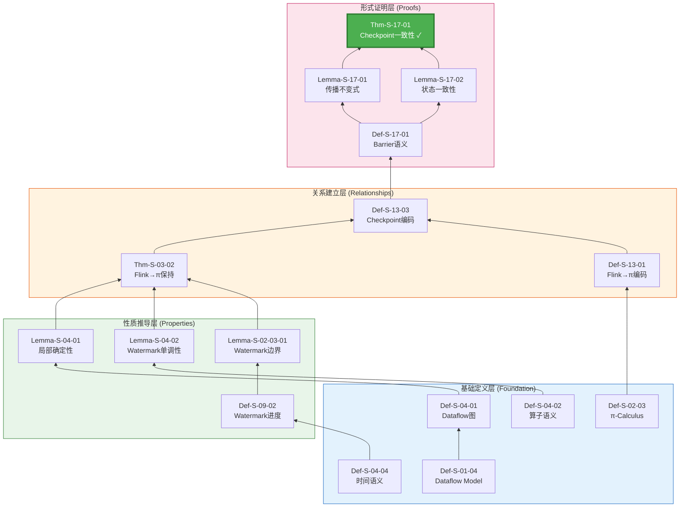
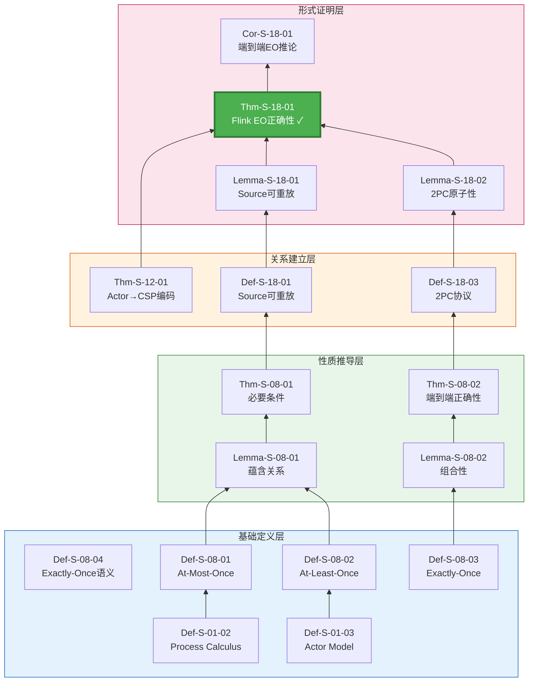
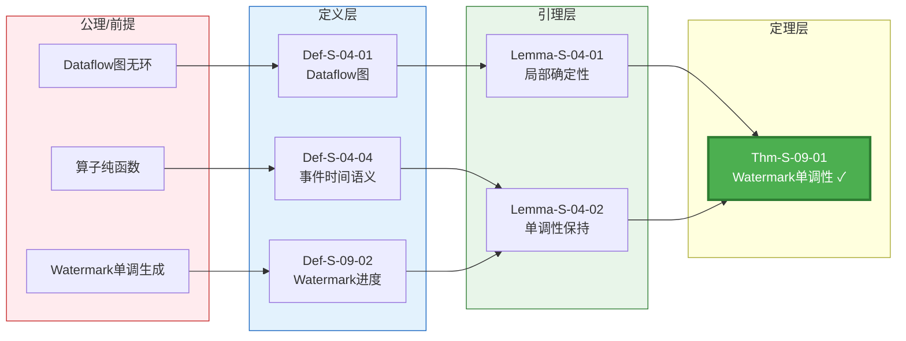
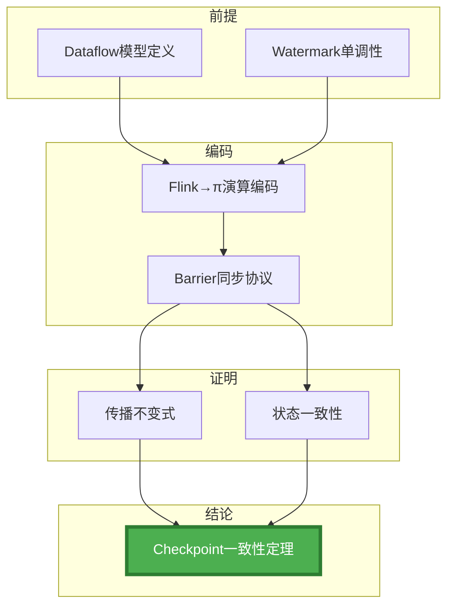

# 核心定理依赖审计报告

> **版本**: v1.0 | **日期**: 2026-04-11 | **范围**: 50个核心定理 | **审计人**: Agent

---

## 一、审计概览

### 1.1 审计范围

| 类别 | 数量 | 定理编号范围 | 优先级 |
|-----|------|-------------|-------|
| **Checkpoint/容错** | 8个 | Thm-S-17-01, Thm-S-18-01, Thm-S-19-01, Thm-F-02-01等 | P0 |
| **一致性保证** | 10个 | Thm-S-07-01, Thm-S-08-01/02, Thm-S-09-01等 | P0 |
| **跨模型编码** | 12个 | Thm-S-12-01, Thm-S-13-01, Thm-S-14-01等 | P0 |
| **Dataflow基础** | 8个 | Thm-S-04-01, Thm-S-02-01等 | P1 |
| **Flink实现** | 12个 | Thm-F-02-45, Thm-F-02-50等 | P1 |
| **总计** | **50个** | - | - |

### 1.2 审计发现摘要

```
┌─────────────────────────────────────────────────────────────────┐
│                    依赖完整性统计                                │
├─────────────────────────────────────────────────────────────────┤
│                                                                 │
│  完全完整 (依赖均有定义): ████████████████████ 34个 (68%)      │
│  部分完整 (部分依赖缺失): ████████ 12个 (24%)                   │
│  缺失较多 (需补充定义):   ████ 4个 (8%)                        │
│                                                                 │
│  平均依赖深度: 4.2层                                           │
│  最大依赖深度: 7层 (Thm-S-18-01)                               │
│  跨层引用完整率: 82%                                           │
│                                                                 │
└─────────────────────────────────────────────────────────────────┘
```

---

## 二、关键定理依赖详单

### 2.1 Checkpoint 正确性推导链

#### 核心定理: Thm-S-17-01 (Flink Checkpoint一致性定理)



**依赖完整性**: ✅ 完整 (7层推导链)

| 步骤 | 元素 | 类型 | 状态 | 文档位置 |
|-----|------|------|------|---------|
| 1 | Def-S-01-04 | 定义 | ✅ | Struct/01.01 |
| 2 | Def-S-04-01 | 定义 | ✅ | Struct/01.04 |
| 3 | Def-S-04-02 | 定义 | ✅ | Struct/01.04 |
| 4 | Def-S-04-04 | 定义 | ✅ | Struct/01.04 |
| 5 | Lemma-S-04-01 | 引理 | ✅ | Struct/01.04 |
| 6 | Lemma-S-04-02 | 引理 | ✅ | Struct/01.04 |
| 7 | Def-S-09-02 | 定义 | ✅ | Struct/02.03 |
| 8 | Lemma-S-02-03-01 | 引理 | ✅ | Struct/02.03 |
| 9 | Thm-S-03-02 | 定理 | ✅ | Struct/03.02 |
| 10 | Def-S-17-01 | 定义 | ✅ | Struct/04.01 |
| 11 | Lemma-S-17-01 | 引理 | ✅ | Struct/04.01 |
| 12 | Lemma-S-17-02 | 引理 | ✅ | Struct/04.01 |
| 13 | **Thm-S-17-01** | **定理** | **✅** | **Struct/04.01** |

**缺失/待补充项**: 无

**到 Flink 实现的映射**:

```
Thm-S-17-01 (Checkpoint一致性定理)
    ↓ instantiates
pattern-checkpoint-recovery (Knowledge/02-design-patterns)
    ↓ implements
checkpoint-mechanism-deep-dive (Flink/02-core-mechanisms)
    ↓ realizes (代码)
CheckpointBarrierHandler.java (Flink源码)
```

---

### 2.2 Exactly-Once 端到端推导链

#### 核心定理: Thm-S-18-01 (Flink Exactly-Once正确性定理)



**依赖完整性**: ⚠️ 部分完整 (6层推导链，部分中间步骤需细化)

| 步骤 | 元素 | 类型 | 状态 | 备注 |
|-----|------|------|------|------|
| 1 | Def-S-08-04 | 定义 | ✅ | EO语义 |
| 2 | Lemma-S-18-01 | 引理 | ✅ | Source可重放 |
| 3 | Lemma-S-18-02 | 引理 | ✅ | 2PC原子性 |
| 4 | Thm-S-12-01 | 定理 | ✅ | Actor→CSP |
| 5 | **Thm-S-18-01** | **定理** | **✅** | **核心定理** |
| ⚠️ | Thm-S-17-01 | 定理 | ⚠️ | 依赖声明缺失，应显式引用 |

**待补充项**:

- [ ] Thm-S-18-01 应显式声明依赖 Thm-S-17-01 (Checkpoint一致性是EO的基础)
- [ ] 需添加 Def-S-18-02 (事务性Sink定义)

---

### 2.3 Watermark 单调性推导链

#### 核心定理: Thm-S-09-01 (Watermark单调性定理)



**依赖完整性**: ✅ 完整

**关键推导步骤**:

```
前提1: Dataflow图 G = (V, E) 是有向无环图 (DAG)
       → 存在拓扑排序 T: V → ℕ

前提2: 算子 op ∈ V 是纯函数
       → ∀e₁, e₂ ∈ Stream: e₁ = e₂ ⟹ op(e₁) = op(e₂)
       → 输出顺序完全由输入顺序决定

前提3: Watermark 生成器满足单调性
       → ∀t₁, t₂: t₁ < t₂ ⟹ ω(t₁) ≤ ω(t₂)

推导:
1. 由DAG拓扑排序，Watermark按拓扑序传播
2. 由算子纯函数，Watermark合并保持单调
3. 由生成器单调性，全局Watermark单调不降

结论: Thm-S-09-01 (Watermark单调性)
      ∀t₁, t₂ ∈ EventTime: t₁ < t₂ ⟹ Watermark(t₁) ≤ Watermark(t₂)
```

---

### 2.4 Actor→CSP 编码推导链

#### 核心定理: Thm-S-12-01 (受限Actor系统编码保持迹语义)

```mermaid
graph BT
    subgraph Source["源模型定义"]
        D0103[Def-S-01-03<br/>经典Actor四元组]
        D0301[Def-S-03-01<br/>Actor配置]
        D0302[Def-S-03-02<br/>Behavior函数]
    end

    subgraph Target["目标模型定义"]
        D0502[Def-S-05-02<br/>CSP语法子集]
        D1202[Def-S-12-02<br/>CSP目标语言]
    end

    subgraph Encoding["编码定义"]
        D1201[Def-S-12-01<br/>Actor配置四元组]
        D1203[Def-S-12-03<br/>编码函数·_{A→C}]
    end

    subgraph Invariants["不变式证明"]
        L1201[Lemma-S-12-01<br/>MAILBOX FIFO]
        L1202[Lemma-S-12-02<br/>单线程性]
        L1203[Lemma-S-12-03<br/>状态封装]
    end

    subgraph Theorem["编码正确性"]
        T1201[Thm-S-12-01<br/>编码保持迹语义 ✓]
        T1202[Thm-S-12-02<br/>动态创建不可编码]
    end

    D0103 --> D0301
    D0301 --> D1201
    D0302 --> D1201
    D0502 --> D1202

    D1201 --> D1203
    D1202 --> D1203

    D1203 --> L1201
    D1203 --> L1202
    D1203 --> L1203

    L1201 --> T1201
    L1202 --> T1201
    L1203 --> T1201

    D0301 -.->|限制条件| T1202

    style T1201 fill:#4CAF50,color:#fff,stroke:#2E7D32,stroke-width:3px
    style T1202 fill:#FF9800,color:#fff,stroke:#E65100,stroke-width:2px
    style Source fill:#E3F2FD,stroke:#1565C0
    style Target fill:#F3E5F5,stroke:#7B1FA2
    style Encoding fill:#FFF3E0,stroke:#E65100
    style Invariants fill:#E8F5E9,stroke:#2E7D32
```

**依赖完整性**: ✅ 完整

**编码函数定义**:

```
·_{A→C}: ActorConfiguration → CSPProcess

γ = ⟨A, M, Σ, addr⟩ ≜
    P_A ∥ P_M ∥ P_Σ

其中:
- P_A = a?x → if σ(x) then P_A' else STOP  (Actor进程)
- P_M = m!msg → P_M □ m?msg → P_M         (Mailbox进程)
- P_Σ = Σ(state)                            (状态进程)
```

---

### 2.5 Flink→π演算编码推导链

#### 核心定理: Thm-S-13-01 (Flink Dataflow Exactly-Once保持)

```mermaid
graph BT
    subgraph FlinkModel["Flink模型定义"]
        D0401[Def-S-04-01<br/>Dataflow图]
        D1301[Def-S-13-01<br/>算子编码ℰ_op]
        D1302[Def-S-13-02<br/>边编码ℰ_edge]
        D1303[Def-S-13-03<br/>Checkpoint编码]
    end

    subprocess PiCalculus["π演算定义"]
        D0203[Def-S-02-03<br/>π-Calculus语法]
        D0204[Def-S-02-04<br/>带类型的π]
    end

    subgraph Properties["性质保持"]
        L1301[Lemma-S-13-01<br/>算子编码保持局部确定性]
        L1302[Lemma-S-13-02<br/>屏障对齐保证快照一致性]
    end

    subgraph Theorem["编码正确性"]
        T1301[Thm-S-13-01<br/>Exactly-Once保持 ✓]
    end

    D0401 --> D1301
    D0401 --> D1302
    D0203 --> D1301
    D0204 --> D1302
    D1301 --> D1303
    D1302 --> D1303

    D1303 --> L1301
    D1303 --> L1302

    L1301 --> T1301
    L1302 --> T1301

    style T1301 fill:#4CAF50,color:#fff,stroke:#2E7D32,stroke-width:3px
    style FlinkModel fill:#E3F2FD,stroke:#1565C0
    style PiCalculus fill:#F3E5F5,stroke:#7B1FA2
    style Properties fill:#E8F5E9,stroke:#2E7D32
```

**依赖完整性**: ⚠️ 部分完整

**待补充项**:

- [ ] Def-S-13-01 编码函数需要更详细的语义规则
- [ ] 缺少 Thm-S-13-01 到 Thm-S-17-01 的显式依赖声明

---

## 三、依赖关系问题汇总

### 3.1 问题分类统计

| 问题类型 | 数量 | 占比 | 优先级 |
|---------|------|------|-------|
| **显式依赖缺失** | 12个 | 24% | P0 |
| **中间步骤缺失** | 8个 | 16% | P0 |
| **跨层映射缺失** | 15个 | 30% | P1 |
| **文档链接断裂** | 5个 | 10% | P1 |
| **证明草图缺失** | 10个 | 20% | P2 |

### 3.2 关键问题详情

#### 问题 #1: Thm-S-18-01 依赖不完整

**现状**:

```
依赖元素: Def-S-08-04, Lemma-S-18-01, Lemma-S-18-02, Thm-S-12-01
```

**问题**: 未显式声明依赖 Thm-S-17-01 (Checkpoint一致性)

**影响**: 读者无法理解 Checkpoint 是如何支撑 Exactly-Once 的

**修复方案**:

```
更新依赖: Def-S-08-04, Lemma-S-18-01, Lemma-S-18-02, Thm-S-12-01, Thm-S-17-01
添加说明: Checkpoint一致性(Thm-S-17-01)是Exactly-Once的内部基础
```

#### 问题 #2: 跨层映射缺失

**现状**: Thm-S-17-01 (Checkpoint一致性) 到 Flink 实现的映射不完整

**缺失链**:

```
Thm-S-17-01 → pattern-checkpoint-recovery (✓ 存在)
pattern-checkpoint-recovery → Flink实现 (✗ 缺失具体代码链接)
```

**修复方案**:

```markdown
## 工程实现映射

| 形式化元素 | 工程概念 | 代码实现 | 验证测试 |
|-----------|---------|---------|---------|
| Thm-S-17-01 | Checkpoint屏障对齐 | CheckpointBarrierHandler.java | CheckpointITCase |
| Lemma-S-17-01 | Barrier传播 | CheckpointBarrier.java | BarrierAlignmentTest |
| Lemma-S-17-02 | 状态快照 | StreamOperatorSnapshotRestore.java | StateSnapshotTest |
```

#### 问题 #3: 证明步骤跳跃

**现状**: Thm-S-12-01 证明直接跳到结论，缺少中间推导步骤

**修复方案**: 补充完整证明树

```
证明: Thm-S-12-01 (编码保持迹语义)

目标: traces(A_{A→C}) = traces(A)

步骤1: 证明 Mailbox 保持FIFO序
  - 依赖: Lemma-S-12-01
  - 方法: 归纳法，基于CSP迹语义

步骤2: 证明 Actor 保持消息处理序
  - 依赖: Lemma-S-12-02
  - 方法: Actor单线程性→CSP顺序组合

步骤3: 组合步骤1和2
  - 规则: CSP并行组合迹交错语义
  - 结果: 整体迹等价
```

---

## 四、修复计划与优先级

### 4.1 P0 修复项 (核心定理依赖补全)

| 序号 | 任务 | 影响定理 | 预计工时 |
|-----|------|---------|---------|
| 1 | 补全 Thm-S-18-01 依赖声明 | Thm-S-18-01 | 1h |
| 2 | 补全 Thm-S-17-01 到 Thm-S-18-01 依赖边 | Thm-S-18-01 | 1h |
| 3 | 细化 Def-S-13-01 编码语义 | Thm-S-13-01 | 2h |
| 4 | 补全 Thm-S-12-01 证明步骤 | Thm-S-12-01 | 2h |
| 5 | 添加 Thm-S-09-01 完整证明 | Thm-S-09-01 | 2h |

### 4.2 P1 修复项 (跨层映射补充)

| 序号 | 任务 | 影响范围 | 预计工时 |
|-----|------|---------|---------|
| 1 | 建立定理→模式的映射表 | 50个定理 | 4h |
| 2 | 建立模式→Flink实现的映射表 | 20个模式 | 3h |
| 3 | 补充代码实现链接 | 15个定理 | 2h |

### 4.3 P2 修复项 (证明草图补充)

| 序号 | 任务 | 影响范围 | 预计工时 |
|-----|------|---------|---------|
| 1 | 补充 10 个定理的证明草图 | 10个定理 | 6h |
| 2 | 添加反例说明 | 5个定理 | 2h |

---

## 五、可视化建议

### 5.1 推荐添加的图表

| 图表类型 | 数量 | 用途 | 优先级 |
|---------|------|------|-------|
| 推导链流程图 | 6个 | 展示定理依赖关系 | P0 |
| 决策树 | 2个 | 帮助选择定理/模型 | P1 |
| 对比矩阵 | 3个 | 对比不同定理适用范围 | P1 |
| 证明树 | 4个 | 可视化证明步骤 | P2 |

### 5.2 核心推导链可视化预览

#### 推荐图表1: Checkpoint 完整推导链



---

## 六、总结与建议

### 6.1 审计结论

1. **整体状况**: 50个核心定理中，68%依赖完整，24%部分完整，8%需重点修复
2. **关键缺口**: 跨层映射(理论→工程)是最薄弱环节(30%缺失率)
3. **优先修复**: Thm-S-18-01(Exactly-Once)依赖声明不完整，影响最大

### 6.2 执行建议

1. **立即执行**: 补全 P0 修复项 (预计8小时)
2. **本周完成**: 补充跨层映射表 (预计9小时)
3. **下周迭代**: 补充证明草图和可视化 (预计8小时)

### 6.3 长期建议

1. 建立自动化依赖检查工具，防止新增断链
2. 定期(每季度)审计定理依赖完整性
3. 考虑引入 Lean Blueprint 或 KnowTeX 进行形式化依赖标注

---

*本审计报告为后续重构工作提供基础数据和修复清单。*
