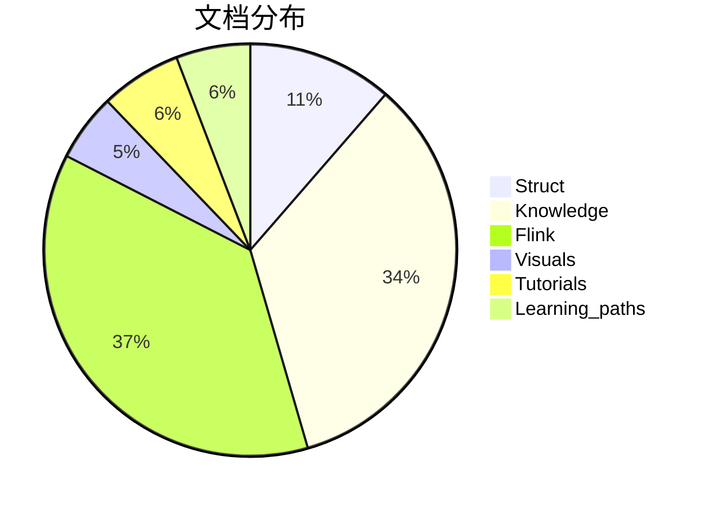
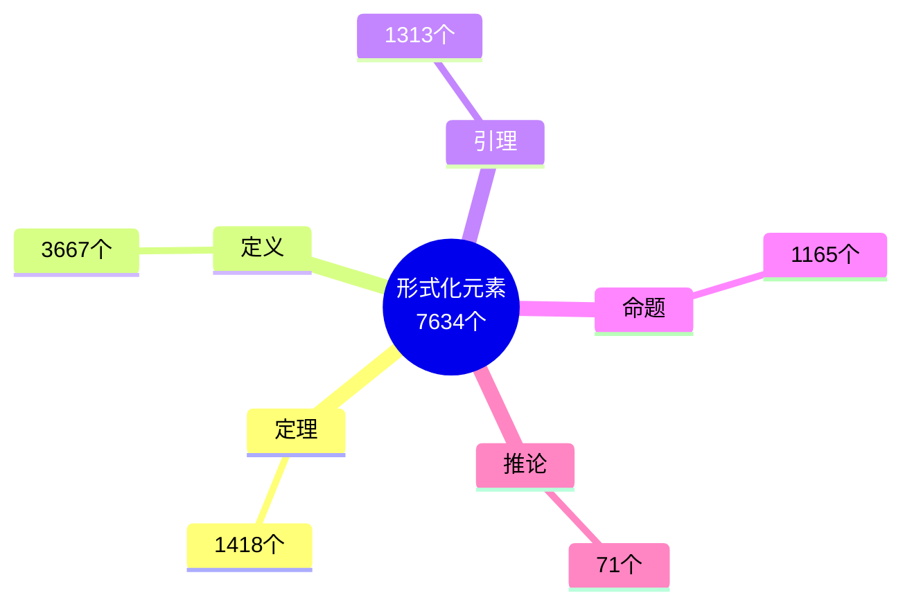
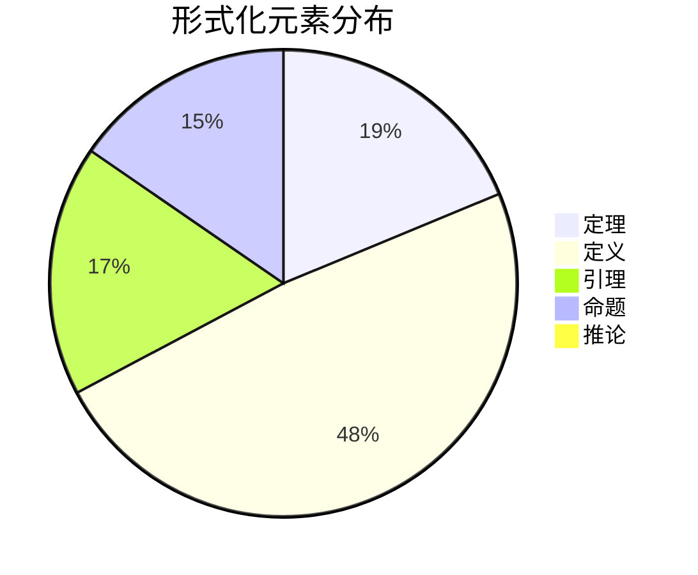
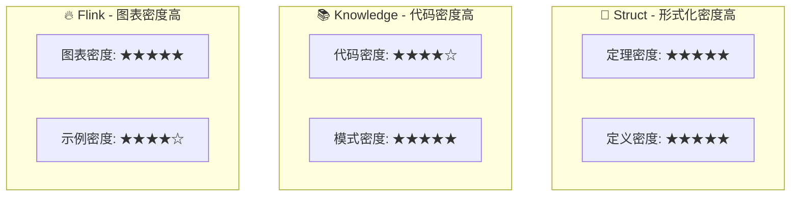
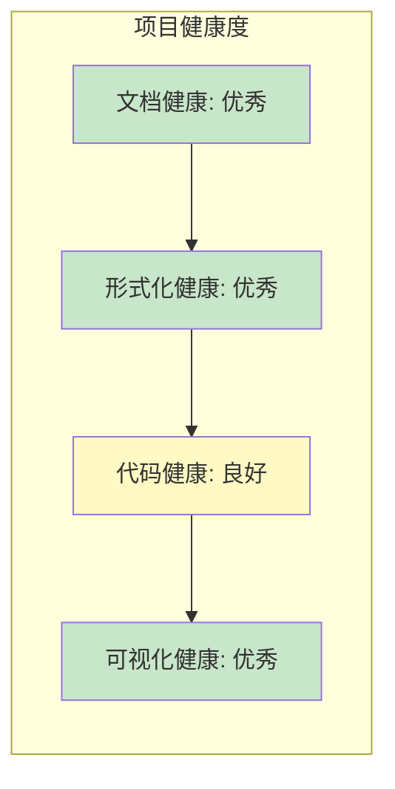

# 📊 AnalysisDataFlow 项目统计仪表盘

> **自动生成**: 2026-04-04 10:44:08
> **统计周期**: 实时 | **更新频率**: 每日

---

## 导航

- [📈 概览指标](#概览指标)
- [📊 进度总览](#进度总览)
- [📁 目录分析](#目录分析)
- [📉 趋势图表](#趋势图表)
- [🔬 形式化元素](#形式化元素)
- [📈 增长分析](#增长分析)
- [🔍 对比矩阵](#对比矩阵)
- [✅ 质量指标](#质量指标)

---

## 概览指标

<div align="center">

| 📚 文档 | 🔬 形式化元素 | 💻 代码示例 | 📈 可视化 |
|:------:|:------------:|:----------:|:---------:|
| **378** | **7634** | **2508** | **1553** |
| 篇技术文档 | 个定理/定义/引理 | 个代码片段 | 个Mermaid图表 |

</div>

### 详细统计

| 指标 | 数值 | 说明 |
|------|------|------|
| 文档总数 | 378 | Markdown技术文档 |
| 总行数 | 326,559 | 文本行数 |
| 总大小 | 10.98 MB | 文档体积 |
| 形式化元素 | 7634 | 定理+定义+引理+命题+推论 |
| 代码示例 | 2508 | 可运行代码片段 |
| Mermaid图表 | 1553 | 架构图/流程图/时序图 |

### 形式化元素明细

| 类型 | 数量 | 占比 | 可视化 |
|------|------|------|--------|
| 定理 (Thm) | 1418 | 19% | ███░░░░░░░░░░░░░░░░░ |
| 定义 (Def) | 3667 | 48% | █████████░░░░░░░░░░░ |
| 引理 (Lemma) | 1313 | 17% | ███░░░░░░░░░░░░░░░░░ |
| 命题 (Prop) | 1165 | 15% | ███░░░░░░░░░░░░░░░░░ |
| 推论 (Cor) | 71 | 1% | ░░░░░░░░░░░░░░░░░░░░ |

---

## 进度总览

### 📐 Struct/

```
进度: [████████████░░░░░░░░░░░░░░░░░░] 43%
文档: 43 | 形式化元素: 1877
```

### 📚 Knowledge/

```
进度: [██████████████████████████████] 100%
文档: 129 | 形式化元素: 2113
```

### 🔥 Flink/

```
进度: [██████████████████████████████] 100%
文档: 140 | 形式化元素: 3226
```

### 📊 Visuals/

```
进度: [██████░░░░░░░░░░░░░░░░░░░░░░░░] 20%
文档: 20 | 形式化元素: 418
```

### 📁 Tutorials/

```
进度: [███████░░░░░░░░░░░░░░░░░░░░░░░] 24%
文档: 24 | 形式化元素: 0
```

### 📁 Learning_paths/

```
进度: [██████░░░░░░░░░░░░░░░░░░░░░░░░] 22%
文档: 22 | 形式化元素: 0
```


---

## 目录分析



### 详细统计

| 目录 | 文档数 | 大小 | 行数 | 定理 | 定义 | 引理 | 代码示例 | 图表 |
|------|--------|------|------|------|------|------|----------|------|
| Flink | 140 | 5341KB | 160,279 | 573 | 1608 | 460 | 1471 | 727 |
| Knowledge | 129 | 3554KB | 100,084 | 295 | 1054 | 311 | 725 | 514 |
| Learning_paths | 22 | 193KB | 7,126 | 0 | 0 | 0 | 59 | 14 |
| Struct | 43 | 1370KB | 35,401 | 380 | 835 | 470 | 89 | 144 |
| Tutorials | 24 | 355KB | 12,512 | 0 | 0 | 0 | 145 | 31 |
| Visuals | 20 | 434KB | 11,157 | 170 | 170 | 72 | 19 | 123 |

---

## 趋势图表

> ⚠️ 历史数据不足，需要至少2个时间点的数据才能生成趋势图

---

## 形式化元素分布



### 分布饼图



---

## 增长分析

> ⚠️ 历史数据不足

---

## 对比矩阵

### 各目录效率指标

| 目录 | 文档/千行 | 形式化/文档 | 代码/文档 | 图表/文档 |
|------|----------|------------|----------|----------|
| Struct | 1.21 | 43.65 | 2.07 | 3.35 |
| Knowledge | 1.29 | 16.38 | 5.62 | 3.98 |
| Flink | 0.87 | 23.04 | 10.51 | 5.19 |
| Visuals | 1.79 | 20.9 | 0.95 | 6.15 |
| Tutorials | 1.92 | 0.0 | 6.04 | 1.29 |
| Learning_paths | 3.09 | 0.0 | 2.68 | 0.64 |

### 热力图



---

## 质量指标

### 文档质量评分

| 指标 | 数值 | 目标 | 评分 | 状态 |
|------|------|------|------|------|
| 形式化密度 | 20.2 元素/文档 | ≥3.0 | ★★★★★ | ✅ |
| 代码密度 | 6.6 示例/文档 | ≥5.0 | ★★★☆☆ | ✅ |
| 可视化密度 | 4.1 图表/文档 | ≥1.5 | ★★★★☆ | ✅ |

### 质量雷达

```mermaid
radar
    title 项目质量雷达图
    axis 形式化严谨性 "代码丰富度" "可视化程度" "文档完整性" "结构规范性"
    area Current 201.95767195767195, 13.26984126984127, 12.325396825396826, 9, 8
```

### 健康度指标



---

---

## 说明

- 📊 本仪表盘由 `dashboard-generator.py` 自动生成
- 🔄 更新频率: 每日自动更新
- 📈 数据来源: `.stats/project-stats.json`
- 📜 历史记录: `.stats/stats-history.json`

### 相关文档

- [项目主文档](../README.md)
- [进度跟踪](../PROJECT-TRACKING.md)
- [定理注册表](../THEOREM-REGISTRY.md)

---

*AnalysisDataFlow Project Dashboard v1.0*
