# AnalysisDataFlow 部署架构图集

> **版本**: v1.0 | **更新日期**: 2026-04-03 | **适用项目**: AnalysisDataFlow

本图集提供流计算系统在各种场景下的部署架构参考，涵盖从本地开发到大规模生产的完整部署方案。

---

## 目录

1. [本地开发部署](#1-本地开发部署)
2. [生产集群部署](#2-生产集群部署)
3. [云原生部署](#3-云原生部署)
4. [边缘部署](#4-边缘部署)
5. [特殊场景部署](#5-特殊场景部署)

---

## 1. 本地开发部署

### 1.1 单机部署架构

**适用场景**: 个人开发、功能验证、快速原型

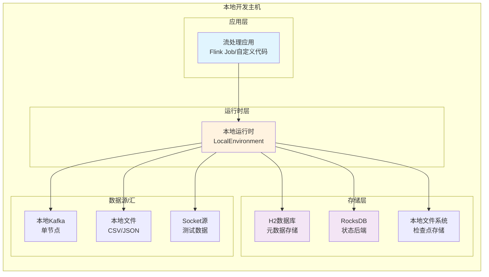
```mermaid
graph TB
    subgraph "本地开发主机"
        direction TB

        subgraph "应用层"
            App[流处理应用<br/>Flink Job/自定义代码]
        end

        subgraph "运行时层"
            RTE[本地运行时<br/>LocalEnvironment]
        end

        subgraph "存储层"
            H2[H2数据库<br/>元数据存储]
            RocksDB[RocksDB<br/>状态后端]
            LocalFS[本地文件系统<br/>检查点存储]
        end

        subgraph "数据源/汇"
            Kafka[本地Kafka<br/>单节点]
            File[本地文件<br/>CSV/JSON]
            Socket[Socket源<br/>测试数据]
        end
    end

    App --> RTE
    RTE --> H2
    RTE --> RocksDB
    RTE --> LocalFS
    RTE --> Kafka
    RTE --> File
    RTE --> Socket

    style App fill:#e1f5fe
    style RTE fill:#fff3e0
    style H2 fill:#f3e5f5
    style RocksDB fill:#f3e5f5
```

**架构特点**:

- 所有组件运行在同一JVM进程中
- 使用嵌入式数据库存储元数据
- RocksDB作为本地状态后端
- 适合单线程调试和断点追踪

**配置要点**:

```yaml
execution:
  mode: local
  parallelism: 1

state:
  backend: rocksdb
  checkpoints:
    dir: file:///tmp/checkpoints
```

---

### 1.2 开发环境配置

**适用场景**: 团队开发环境、集成测试

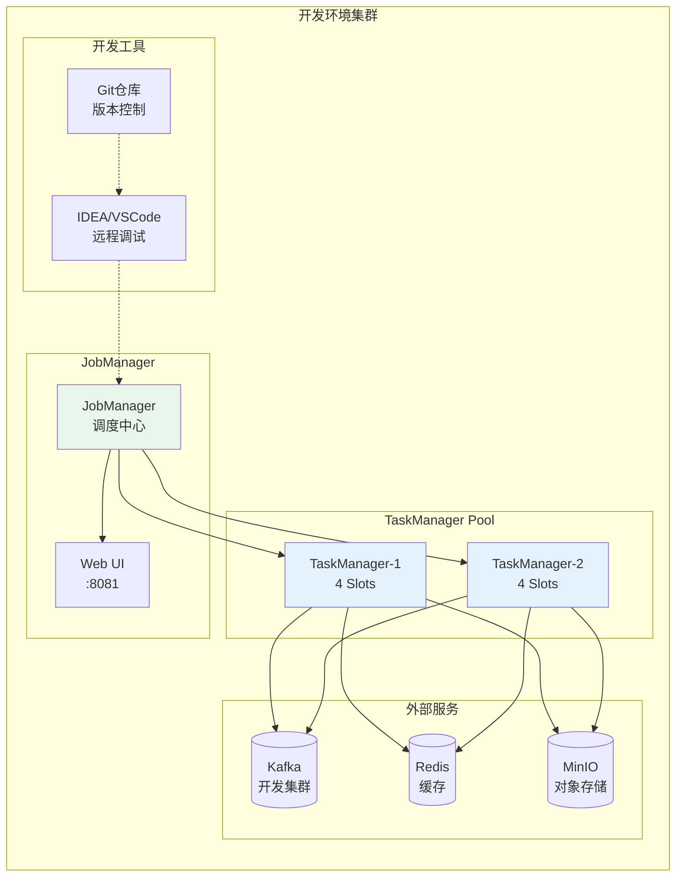
```mermaid
graph TB
    subgraph "开发环境集群"
        direction TB

        subgraph "JobManager"
            JM[JobManager<br/>调度中心]
            WebUI[Web UI<br/>:8081]
        end

        subgraph "TaskManager Pool"
            TM1[TaskManager-1<br/>4 Slots]
            TM2[TaskManager-2<br/>4 Slots]
        end

        subgraph "外部服务"
            KafkaDev[(Kafka<br/>开发集群)]
            RedisDev[(Redis<br/>缓存)]
            MinIO[(MinIO<br/>对象存储)]
        end

        subgraph "开发工具"
            IDE[IDEA/VSCode<br/>远程调试]
            Git[Git仓库<br/>版本控制]
        end
    end

    JM --> TM1
    JM --> TM2
    TM1 --> KafkaDev
    TM1 --> RedisDev
    TM1 --> MinIO
    TM2 --> KafkaDev
    TM2 --> RedisDev
    TM2 --> MinIO
    JM --> WebUI
    IDE -.-> JM
    Git -.-> IDE

    style JM fill:#e8f5e9
    style TM1 fill:#e3f2fd
    style TM2 fill:#e3f2fd
```

**架构特点**:

- 小规模集群部署（1 JM + 2 TM）
- 共享外部服务降低资源占用
- 支持远程调试和热部署
- 独立命名空间隔离不同开发者

**资源配置**:

| 组件 | CPU | 内存 | 说明 |
|------|-----|------|------|
| JobManager | 1核 | 2GB | 开发环境配置 |
| TaskManager | 2核 | 4GB | 每节点配置 |
| Kafka | 1核 | 2GB | 单节点 |

---

### 1.3 本地测试架构

**适用场景**: 单元测试、集成测试、CI流水线

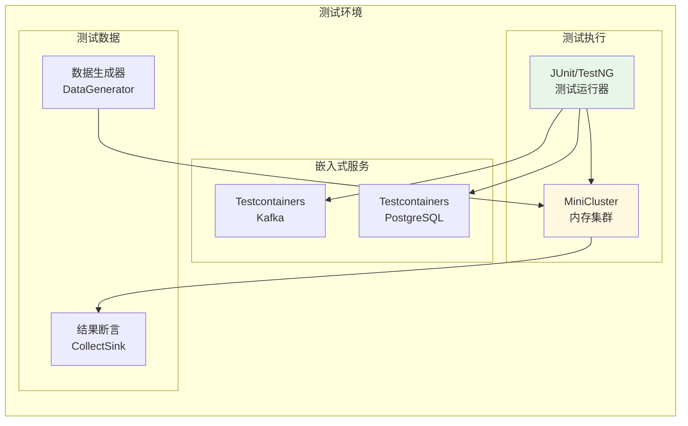
```mermaid
graph LR
    subgraph "测试环境"
        direction TB

        subgraph "测试执行"
            TestRunner[JUnit/TestNG<br/>测试运行器]
            MiniCluster[MiniCluster<br/>内存集群]
        end

        subgraph "嵌入式服务"
            TestKafka[Testcontainers<br/>Kafka]
            TestDB[Testcontainers<br/>PostgreSQL]
        end

        subgraph "测试数据"
            DataGen[数据生成器<br/>DataGenerator]
            Assert[结果断言<br/>CollectSink]
        end
    end

    TestRunner --> MiniCluster
    TestRunner --> TestKafka
    TestRunner --> TestDB
    DataGen --> MiniCluster
    MiniCluster --> Assert

    style MiniCluster fill:#fff8e1
    style TestRunner fill:#e8f5e9
```

**架构特点**:

- 使用MiniCluster实现内存级测试
- Testcontainers提供真实的中间件环境
- 测试隔离，并行执行无冲突
- 毫秒级启动，适合CI/CD流水线

**测试模式**:

```java
// 内存测试模式
@Test
public void testPipeline() {
    StreamExecutionEnvironment env =
        StreamExecutionEnvironment.getExecutionEnvironment();
    env.setParallelism(2);

    // 测试逻辑...

    env.execute();
}
```

---

## 2. 生产集群部署

### 2.1 高可用架构

**适用场景**: 7×24在线服务、关键业务系统

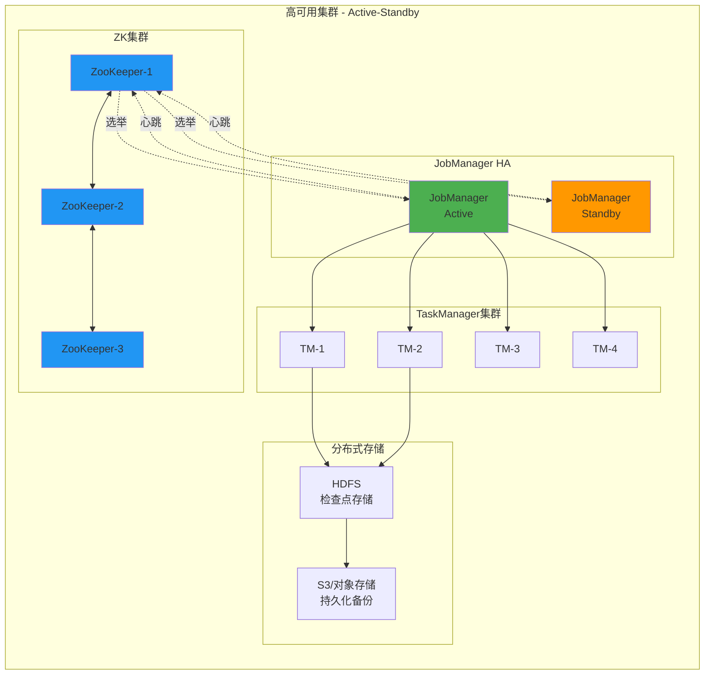
```mermaid
graph TB
    subgraph "高可用集群 - Active-Standby"
        direction TB

        subgraph "ZK集群"
            ZK1[ZooKeeper-1]
            ZK2[ZooKeeper-2]
            ZK3[ZooKeeper-3]
        end

        subgraph "JobManager HA"
            JM1[JobManager<br/>Active]
            JM2[JobManager<br/>Standby]
        end

        subgraph "TaskManager集群"
            TM1[TM-1]
            TM2[TM-2]
            TM3[TM-3]
            TM4[TM-4]
        end

        subgraph "分布式存储"
            HDFS[HDFS<br/>检查点存储]
            S3[S3/对象存储<br/>持久化备份]
        end
    end

    ZK1 <--> ZK2 <--> ZK3
    JM1 -.->|心跳| ZK1
    JM2 -.->|心跳| ZK1
    ZK1 -.->|选举| JM1
    ZK1 -.->|选举| JM2

    JM1 --> TM1
    JM1 --> TM2
    JM1 --> TM3
    JM1 --> TM4

    TM1 --> HDFS
    TM2 --> HDFS
    HDFS --> S3

    style JM1 fill:#4caf50
    style JM2 fill:#ff9800
    style ZK1 fill:#2196f3
    style ZK2 fill:#2196f3
    style ZK3 fill:#2196f3
```

**高可用机制**:

| 组件 | HA策略 | 切换时间 | 数据保证 |
|------|--------|----------|----------|
| JobManager | Active-Standby | <30s | 状态恢复 |
| TaskManager | 多副本 | 自动重启 | 检查点恢复 |
| Checkpoint | 分布式存储 | - | Exactly-Once |

**配置示例**:

```yaml
high-availability: zookeeper
high-availability.zookeeper.quorum: zk1:2181,zk2:2181,zk3:2181
high-availability.storageDir: hdfs:///flink/ha

restart-strategy: fixed-delay
restart-strategy.fixed-delay.attempts: 10
restart-strategy.fixed-delay.delay: 10s
```

---

### 2.2 负载均衡架构

**适用场景**: 大规模数据处理、动态扩缩容

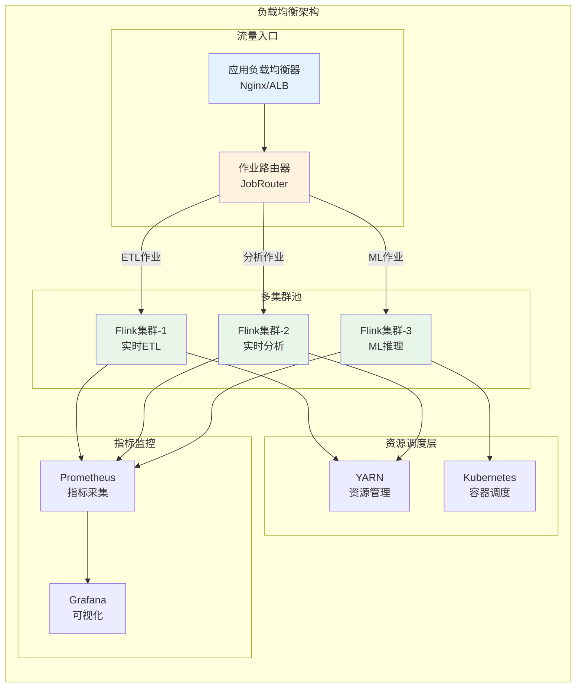
```mermaid
graph TB
    subgraph "负载均衡架构"
        direction TB

        subgraph "流量入口"
            LB[应用负载均衡器<br/>Nginx/ALB]
            Router[作业路由器<br/>JobRouter]
        end

        subgraph "多集群池"
            Cluster1[Flink集群-1<br/>实时ETL]
            Cluster2[Flink集群-2<br/>实时分析]
            Cluster3[Flink集群-3<br/>ML推理]
        end

        subgraph "资源调度层"
            YARN[YARN<br/>资源管理]
            K8s[Kubernetes<br/>容器调度]
        end

        subgraph "指标监控"
            Prometheus[Prometheus<br/>指标采集]
            Grafana[Grafana<br/>可视化]
        end
    end

    LB --> Router
    Router -->|ETL作业| Cluster1
    Router -->|分析作业| Cluster2
    Router -->|ML作业| Cluster3

    Cluster1 --> YARN
    Cluster2 --> YARN
    Cluster3 --> K8s

    Cluster1 --> Prometheus
    Cluster2 --> Prometheus
    Cluster3 --> Prometheus
    Prometheus --> Grafana

    style LB fill:#e3f2fd
    style Router fill:#fff3e0
    style Cluster1 fill:#e8f5e9
    style Cluster2 fill:#e8f5e9
    style Cluster3 fill:#e8f5e9
```

**负载策略**:

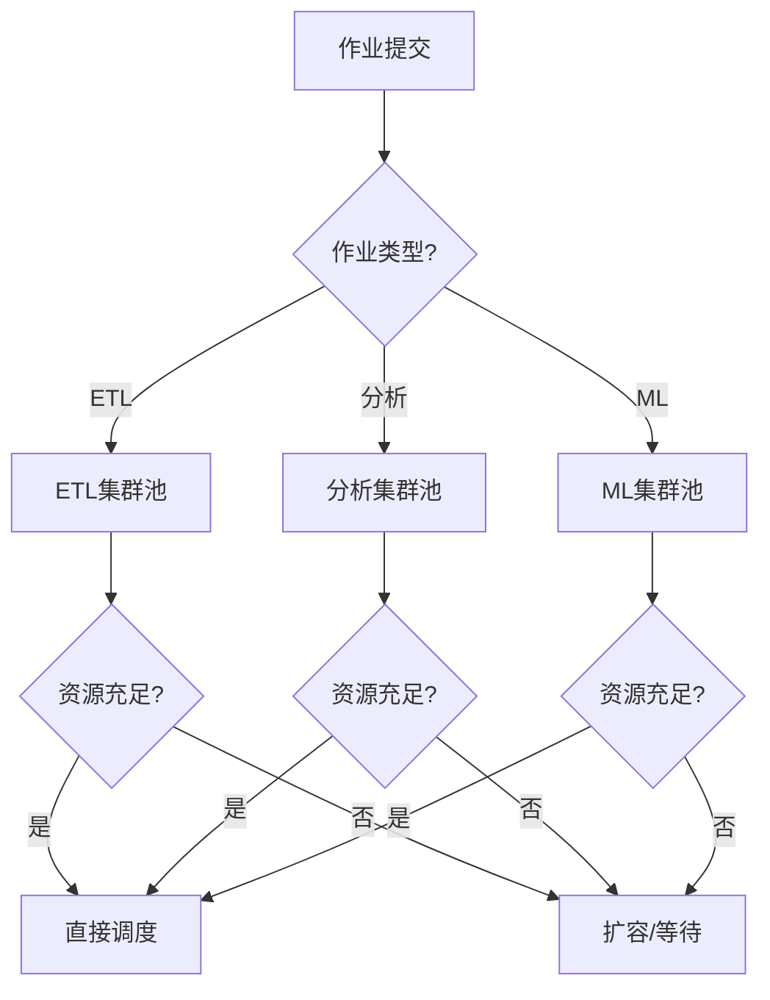
```mermaid
flowchart TD
    A[作业提交] --> B{作业类型?}
    B -->|ETL| C[ETL集群池]
    B -->|分析| D[分析集群池]
    B -->|ML| E[ML集群池]

    C --> F{资源充足?}
    D --> G{资源充足?}
    E --> H{资源充足?}

    F -->|是| I[直接调度]
    F -->|否| J[扩容/等待]
    G -->|是| I
    G -->|否| J
    H -->|是| I
    H -->|否| J
```

---

### 2.3 故障恢复架构

**适用场景**: 金融交易、关键基础设施

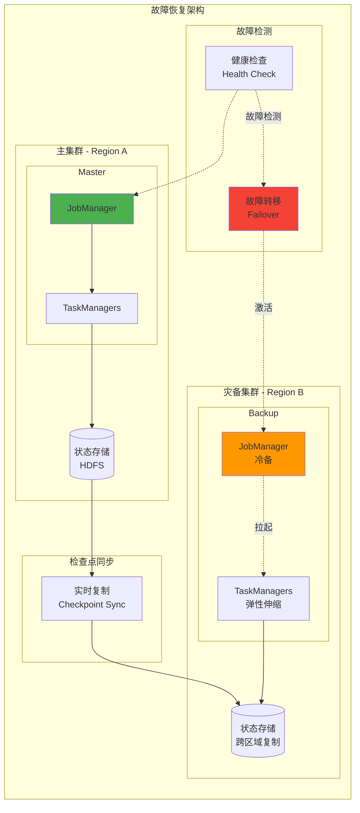
```mermaid
graph TB
    subgraph "故障恢复架构"
        direction TB

        subgraph "主集群 - Region A"
            subgraph "Master"
                M_JM[JobManager]
                M_TM[TaskManagers]
            end
            M_Store[(状态存储<br/>HDFS)]
        end

        subgraph "灾备集群 - Region B"
            subgraph "Backup"
                B_JM[JobManager<br/>冷备]
                B_TM[TaskManagers<br/>弹性伸缩]
            end
            B_Store[(状态存储<br/>跨区域复制)]
        end

        subgraph "检查点同步"
            Sync[实时复制<br/>Checkpoint Sync]
        end

        subgraph "故障检测"
            Health[健康检查<br/>Health Check]
            Failover[故障转移<br/>Failover]
        end
    end

    M_JM --> M_TM
    M_TM --> M_Store
    M_Store --> Sync
    Sync --> B_Store

    Health -.-> M_JM
    Health -.->|故障检测| Failover
    Failover -.->|激活| B_JM
    B_JM -.->|拉起| B_TM
    B_TM --> B_Store

    style M_JM fill:#4caf50
    style B_JM fill:#ff9800
    style Failover fill:#f44336
```

**恢复时间目标(RTO/RPO)**:

| 策略 | RTO | RPO | 适用场景 |
|------|-----|-----|----------|
| 检查点恢复 | <2分钟 | 0 | 单节点故障 |
| Savepoint恢复 | <5分钟 | 分钟级 | 集群故障 |
| 跨区域切换 | <10分钟 | 秒级 | 区域级灾难 |

---

## 3. 云原生部署

### 3.1 K8s部署架构

**适用场景**: 云原生应用、弹性伸缩需求

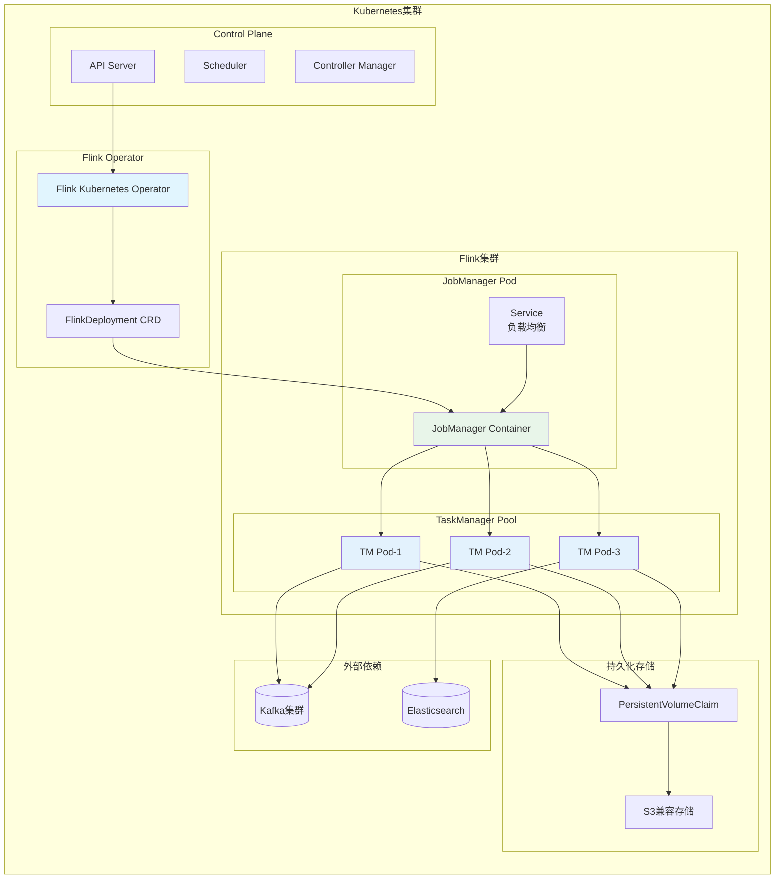
```mermaid
graph TB
    subgraph "Kubernetes集群"
        direction TB

        subgraph "Control Plane"
            API[API Server]
            Scheduler[Scheduler]
            CM[Controller Manager]
        end

        subgraph "Flink Operator"
            Operator[Flink Kubernetes Operator]
            CRD[FlinkDeployment CRD]
        end

        subgraph "Flink集群"
            subgraph "JobManager Pod"
                JM[JobManager Container]
                JM_SVC[Service<br/>负载均衡]
            end

            subgraph "TaskManager Pool"
                TM1[TM Pod-1]
                TM2[TM Pod-2]
                TM3[TM Pod-3]
            end
        end

        subgraph "持久化存储"
            PVC[PersistentVolumeClaim]
            S3[S3兼容存储]
        end

        subgraph "外部依赖"
            Kafka[(Kafka集群)]
            ES[(Elasticsearch)]
        end
    end

    API --> Operator
    Operator --> CRD
    CRD --> JM
    JM --> TM1
    JM --> TM2
    JM --> TM3
    JM_SVC --> JM

    TM1 --> PVC
    TM2 --> PVC
    TM3 --> PVC
    PVC --> S3

    TM1 --> Kafka
    TM2 --> Kafka
    TM3 --> ES

    style Operator fill:#e1f5fe
    style JM fill:#e8f5e9
    style TM1 fill:#e3f2fd
    style TM2 fill:#e3f2fd
    style TM3 fill:#e3f2fd
```

**资源定义示例**:

```yaml
apiVersion: flink.apache.org/v1beta1
kind: FlinkDeployment
metadata:
  name: streaming-job
spec:
  image: flink:1.18
  flinkVersion: v1.18
  jobManager:
    resource:
      memory: 2Gi
      cpu: 1
  taskManager:
    resource:
      memory: 4Gi
      cpu: 2
    replicas: 3
  job:
    jarURI: local:///opt/flink/examples/streaming/StateMachineExample.jar
    parallelism: 6
    upgradeMode: savepoint
    state: running
```

**弹性伸缩策略**:

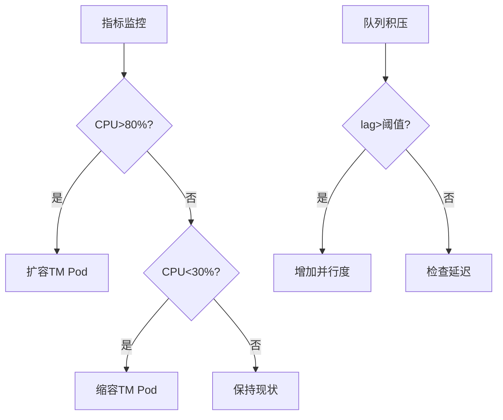
```mermaid
flowchart TD
    A[指标监控] --> B{CPU>80%?}
    B -->|是| C[扩容TM Pod]
    B -->|否| D{CPU<30%?}
    D -->|是| E[缩容TM Pod]
    D -->|否| F[保持现状]

    G[队列积压] --> H{lag>阈值?}
    H -->|是| I[增加并行度]
    H -->|否| J[检查延迟]
```

---

### 3.2 Serverless部署

**适用场景**: 事件驱动、突发流量、按需计费

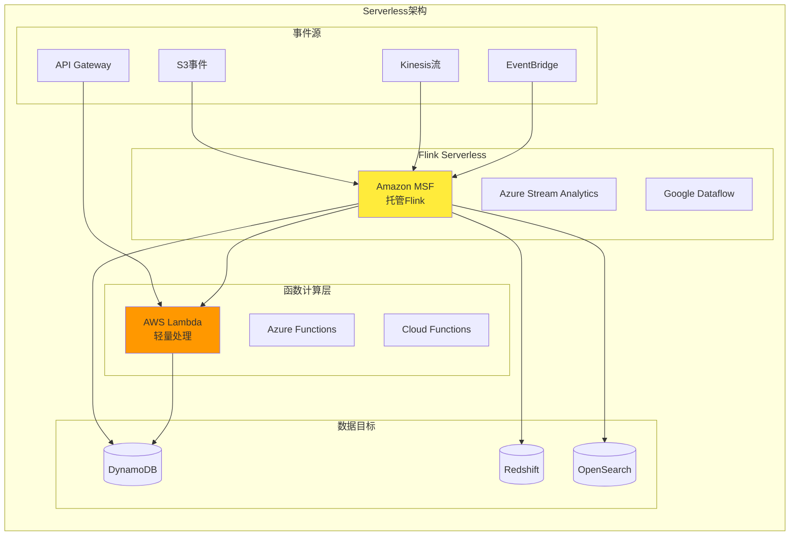
```mermaid
graph TB
    subgraph "Serverless架构"
        direction TB

        subgraph "事件源"
            S3Event[S3事件]
            Kinesis[Kinesis流]
            APIGW[API Gateway]
            EventBridge[EventBridge]
        end

        subgraph "Flink Serverless"
            MSF[Amazon MSF<br/>托管Flink]
            BAF[Azure Stream Analytics]
            GDF[Google Dataflow]
        end

        subgraph "函数计算层"
            Lambda[AWS Lambda<br/>轻量处理]
            Func[Azure Functions]
            CF[Cloud Functions]
        end

        subgraph "数据目标"
            DynamoDB[(DynamoDB)]
            Redshift[(Redshift)]
            OpenSearch[(OpenSearch)]
        end
    end

    S3Event --> MSF
    Kinesis --> MSF
    APIGW --> Lambda
    EventBridge --> MSF

    MSF --> Lambda
    MSF --> DynamoDB
    Lambda --> DynamoDB
    MSF --> Redshift
    MSF --> OpenSearch

    style MSF fill:#ffeb3b
    style Lambda fill:#ff9800
```

**架构特点**:

- 完全托管，无需运维基础设施
- 自动扩缩容，按实际使用量计费
- 内置高可用和容错机制
- 与云服务深度集成

**成本对比**:

| 部署方式 | 固定成本 | 可变成本 | 适用场景 |
|----------|----------|----------|----------|
| 自建集群 | 高 | 低 | 持续高负载 |
| K8s托管 | 中 | 中 | 中高频业务 |
| Serverless | 低 | 高 | 低频/突发流量 |

---

### 3.3 混合云部署

**适用场景**: 数据主权、成本优化、灾备需求

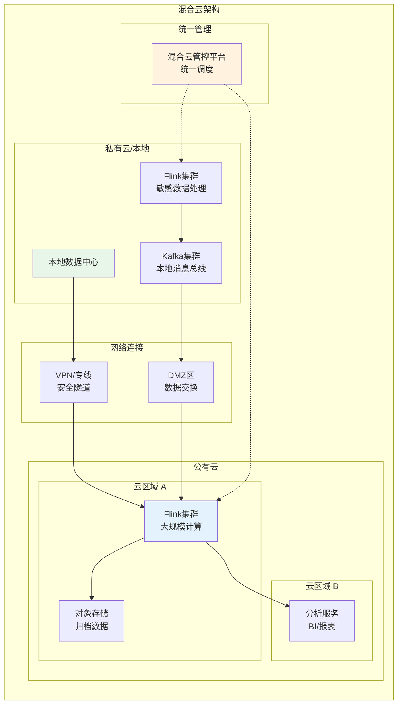
```mermaid
graph TB
    subgraph "混合云架构"
        direction TB

        subgraph "私有云/本地"
            OnPrem[本地数据中心]
            OnPrem_Flink[Flink集群<br/>敏感数据处理]
            OnPrem_Kafka[Kafka集群<br/>本地消息总线]
        end

        subgraph "公有云"
            subgraph "云区域 A"
                Cloud_Flink[Flink集群<br/>大规模计算]
                Cloud_Storage[对象存储<br/>归档数据]
            end

            subgraph "云区域 B"
                Cloud_Analytics[分析服务<br/>BI/报表]
            end
        end

        subgraph "网络连接"
            VPN[VPN/专线<br/>安全隧道]
            DMZ[DMZ区<br/>数据交换]
        end

        subgraph "统一管理"
            Control[混合云管控平台<br/>统一调度]
        end
    end

    OnPrem --> VPN
    VPN --> Cloud_Flink
    OnPrem_Kafka --> DMZ
    DMZ --> Cloud_Flink

    OnPrem_Flink --> OnPrem_Kafka
    Cloud_Flink --> Cloud_Storage
    Cloud_Flink --> Cloud_Analytics

    Control -.-> OnPrem_Flink
    Control -.-> Cloud_Flink

    style OnPrem fill:#e8f5e9
    style Cloud_Flink fill:#e3f2fd
    style Control fill:#fff3e0
```

**数据流动策略**:

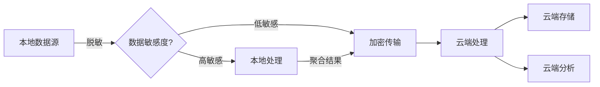
```mermaid
flowchart LR
    A[本地数据源] -->|脱敏| B{数据敏感度?}
    B -->|高敏感| C[本地处理]
    B -->|低敏感| D[加密传输]
    D --> E[云端处理]
    C -->|聚合结果| D
    E --> F[云端存储]
    E --> G[云端分析]
```

---

## 4. 边缘部署

### 4.1 边缘计算架构

**适用场景**: 低延迟处理、带宽限制、本地自治

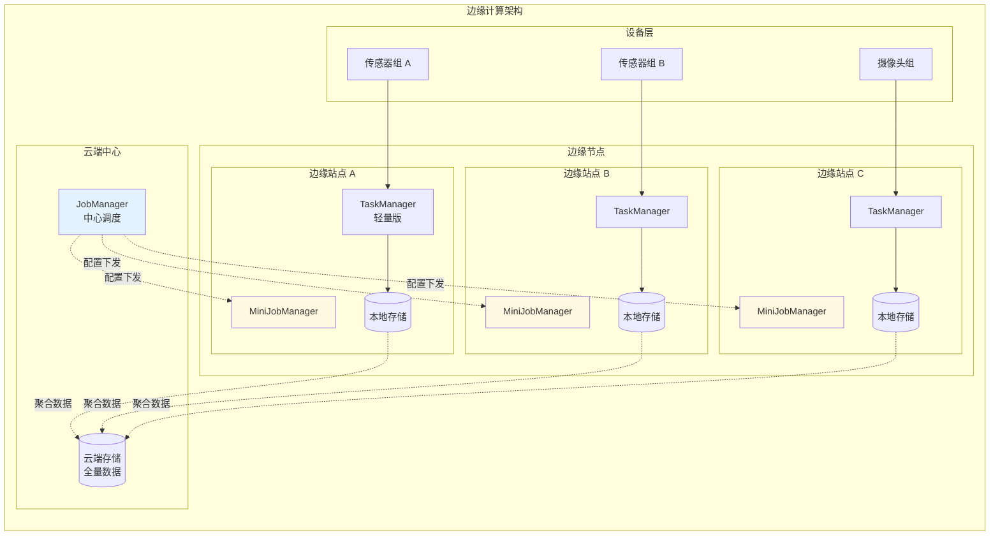
```mermaid
graph TB
    subgraph "边缘计算架构"
        direction TB

        subgraph "云端中心"
            Cloud_JM[JobManager<br/>中心调度]
            Cloud_Store[(云端存储<br/>全量数据)]
        end

        subgraph "边缘节点"
            subgraph "边缘站点 A"
                Edge1_JM[MiniJobManager]
                Edge1_TM[TaskManager<br/>轻量版]
                Edge1_Store[(本地存储)]
            end

            subgraph "边缘站点 B"
                Edge2_JM[MiniJobManager]
                Edge2_TM[TaskManager]
                Edge2_Store[(本地存储)]
            end

            subgraph "边缘站点 C"
                Edge3_JM[MiniJobManager]
                Edge3_TM[TaskManager]
                Edge3_Store[(本地存储)]
            end
        end

        subgraph "设备层"
            Sensor1[传感器组 A]
            Sensor2[传感器组 B]
            Camera[摄像头组]
        end
    end

    Cloud_JM -.->|配置下发| Edge1_JM
    Cloud_JM -.->|配置下发| Edge2_JM
    Cloud_JM -.->|配置下发| Edge3_JM

    Sensor1 --> Edge1_TM
    Sensor2 --> Edge2_TM
    Camera --> Edge3_TM

    Edge1_TM --> Edge1_Store
    Edge2_TM --> Edge2_Store
    Edge3_TM --> Edge3_Store

    Edge1_Store -.->|聚合数据| Cloud_Store
    Edge2_Store -.->|聚合数据| Cloud_Store
    Edge3_Store -.->|聚合数据| Cloud_Store

    style Cloud_JM fill:#e3f2fd
    style Edge1_JM fill:#fff8e1
    style Edge2_JM fill:#fff8e1
    style Edge3_JM fill:#fff8e1
```

**边缘节点规格**:

| 组件 | 边缘设备 | 边缘网关 | 边缘服务器 |
|------|----------|----------|------------|
| CPU | 2核 | 4核 | 8核+ |
| 内存 | 2GB | 8GB | 32GB+ |
| 存储 | 16GB eMMC | 128GB SSD | 1TB SSD |
| 网络 | 4G/5G | WiFi/有线 | 专线 |

---

### 4.2 云边协同架构

**适用场景**: 分层处理、智能调度、资源协同

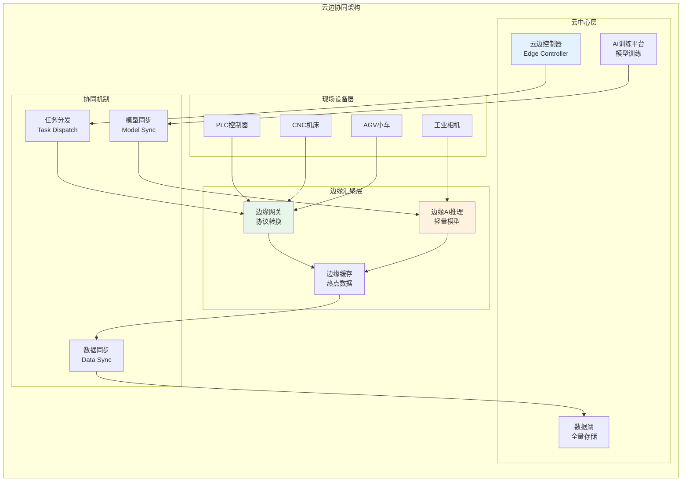
```mermaid
graph TB
    subgraph "云边协同架构"
        direction TB

        subgraph "云中心层"
            Cloud_Controller[云边控制器<br/>Edge Controller]
            Cloud_AI[AI训练平台<br/>模型训练]
            Cloud_Storage[数据湖<br/>全量存储]
        end

        subgraph "边缘汇聚层"
            Edge_Gateway[边缘网关<br/>协议转换]
            Edge_AI[边缘AI推理<br/>轻量模型]
            Edge_Cache[边缘缓存<br/>热点数据]
        end

        subgraph "现场设备层"
            Device_PLC[PLC控制器]
            Device_CNC[CNC机床]
            Device_AGV[AGV小车]
            Device_Camera[工业相机]
        end

        subgraph "协同机制"
            ModelSync[模型同步<br/>Model Sync]
            TaskDispatch[任务分发<br/>Task Dispatch]
            DataSync[数据同步<br/>Data Sync]
        end
    end

    Cloud_Controller --> TaskDispatch
    TaskDispatch --> Edge_Gateway

    Cloud_AI --> ModelSync
    ModelSync --> Edge_AI

    Device_PLC --> Edge_Gateway
    Device_CNC --> Edge_Gateway
    Device_AGV --> Edge_Gateway
    Device_Camera --> Edge_AI

    Edge_Gateway --> Edge_Cache
    Edge_AI --> Edge_Cache
    Edge_Cache --> DataSync
    DataSync --> Cloud_Storage

    style Cloud_Controller fill:#e3f2fd
    style Edge_Gateway fill:#e8f5e9
    style Edge_AI fill:#fff3e0
```

**协同流程**:

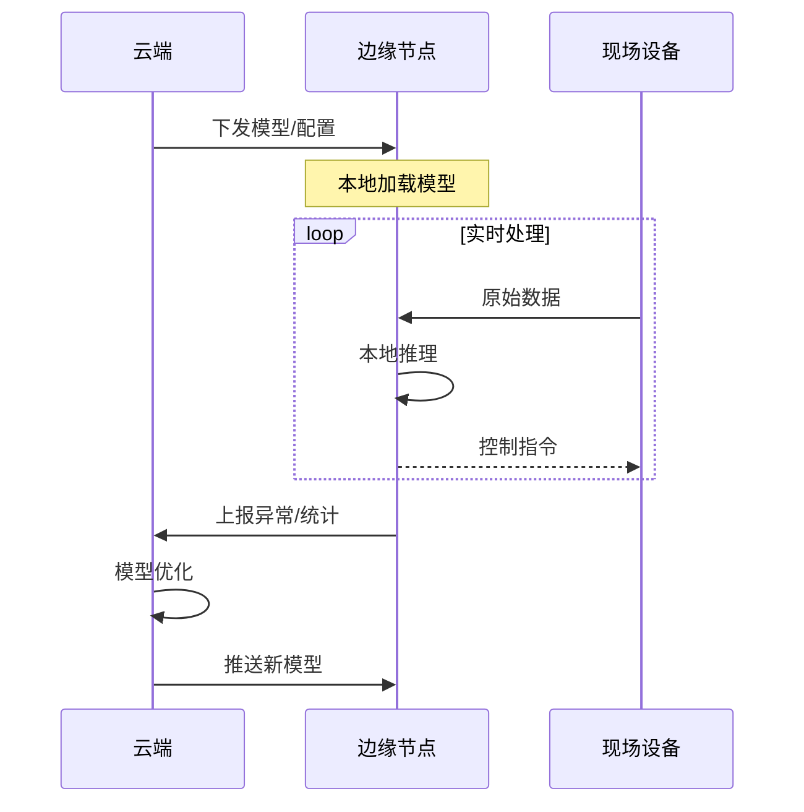
```mermaid
sequenceDiagram
    participant Cloud as 云端
    participant Edge as 边缘节点
    participant Device as 现场设备

    Cloud->>Edge: 下发模型/配置
    Note over Edge: 本地加载模型

    loop 实时处理
        Device->>Edge: 原始数据
        Edge->>Edge: 本地推理
        Edge-->>Device: 控制指令
    end

    Edge->>Cloud: 上报异常/统计
    Cloud->>Cloud: 模型优化
    Cloud->>Edge: 推送新模型
```

---

### 4.3 离线处理架构

**适用场景**: 网络不稳定、间歇连接、完全自治

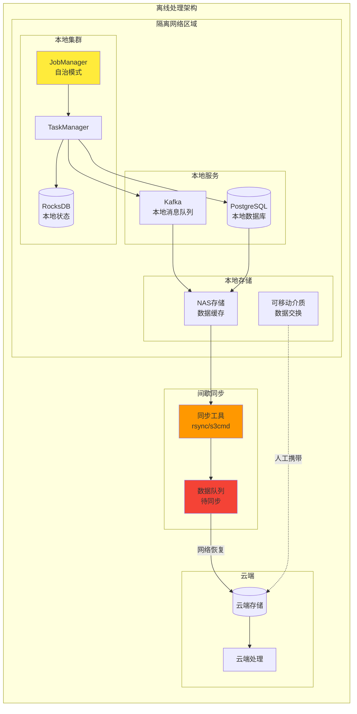
```mermaid
graph TB
    subgraph "离线处理架构"
        direction TB

        subgraph "隔离网络区域"
            subgraph "本地集群"
                Standalone_JM[JobManager<br/>自治模式]
                Standalone_TM[TaskManager]
                Local_Store[(RocksDB<br/>本地状态)]
            end

            subgraph "本地存储"
                NAS[NAS存储<br/>数据缓存]
                USB[可移动介质<br/>数据交换]
            end

            subgraph "本地服务"
                Local_Kafka[Kafka<br/>本地消息队列]
                Local_DB[(PostgreSQL<br/>本地数据库)]
            end
        end

        subgraph "间歇同步"
            Sync_Tool[同步工具<br/>rsync/s3cmd]
            Data_Queue[数据队列<br/>待同步]
        end

        subgraph "云端"
            Cloud_Store[(云端存储)]
            Cloud_Process[云端处理]
        end
    end

    Standalone_JM --> Standalone_TM
    Standalone_TM --> Local_Store
    Standalone_TM --> Local_Kafka
    Standalone_TM --> Local_DB

    Local_Kafka --> NAS
    Local_DB --> NAS

    NAS --> Sync_Tool
    Sync_Tool --> Data_Queue
    Data_Queue -->|网络恢复| Cloud_Store
    USB -.->|人工携带| Cloud_Store

    Cloud_Store --> Cloud_Process

    style Standalone_JM fill:#ffeb3b
    style Sync_Tool fill:#ff9800
    style Data_Queue fill:#f44336
```

**离线策略**:

- 检查点本地存储，定期打包
- 数据本地缓存，批量上传
- 配置本地固化，自动恢复
- 支持物理介质数据交换

---

## 5. 特殊场景部署

### 5.1 金融级高可用

**适用场景**: 银行核心系统、证券交易系统、支付清算

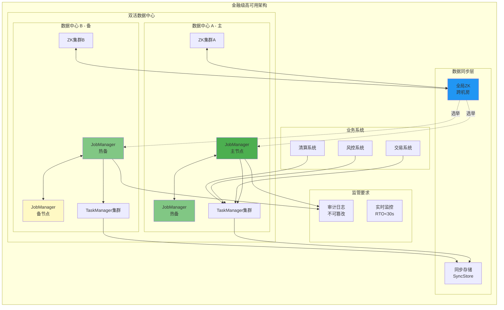
```mermaid
graph TB
    subgraph "金融级高可用架构"
        direction TB

        subgraph "双活数据中心"
            subgraph "数据中心 A - 主"
                A_JM1[JobManager<br/>主节点]
                A_JM2[JobManager<br/>热备]
                A_TM[TaskManager集群]
                A_ZK[ZK集群A]
            end

            subgraph "数据中心 B - 备"
                B_JM1[JobManager<br/>热备]
                B_JM2[JobManager<br/>备节点]
                B_TM[TaskManager集群]
                B_ZK[ZK集群B]
            end
        end

        subgraph "数据同步层"
            Sync_Store[同步存储<br/>SyncStore]
            Global_ZK[全局ZK<br/>跨机房]
        end

        subgraph "监管要求"
            Audit[审计日志<br/>不可篡改]
            Monitor[实时监控<br/>RTO<30s]
        end

        subgraph "业务系统"
            Trading[交易系统]
            Risk[风控系统]
            Clearing[清算系统]
        end
    end

    A_JM1 <--> A_JM2
    A_JM1 --> A_TM
    B_JM1 <--> B_JM2
    B_JM1 --> B_TM

    A_ZK <--> Global_ZK
    B_ZK <--> Global_ZK
    Global_ZK -.->|选举| A_JM1
    Global_ZK -.->|选举| B_JM1

    A_TM --> Sync_Store
    B_TM --> Sync_Store

    Trading --> A_TM
    Risk --> A_TM
    Clearing --> A_TM

    A_JM1 --> Audit
    B_JM1 --> Audit

    style A_JM1 fill:#4caf50
    style A_JM2 fill:#81c784
    style B_JM1 fill:#81c784
    style B_JM2 fill:#fff9c4
    style Global_ZK fill:#2196f3
```

**金融级SLA**:

| 指标 | 要求 | 实现方式 |
|------|------|----------|
| RTO | <30秒 | 双活+自动切换 |
| RPO | 0 | 同步复制+检查点 |
| 可用性 | 99.999% | 双活+故障转移 |
| 数据一致性 | Exactly-Once | 2PC+幂等处理 |

---

### 5.2 IoT大规模部署

**适用场景**: 百万级设备接入、海量传感器数据处理

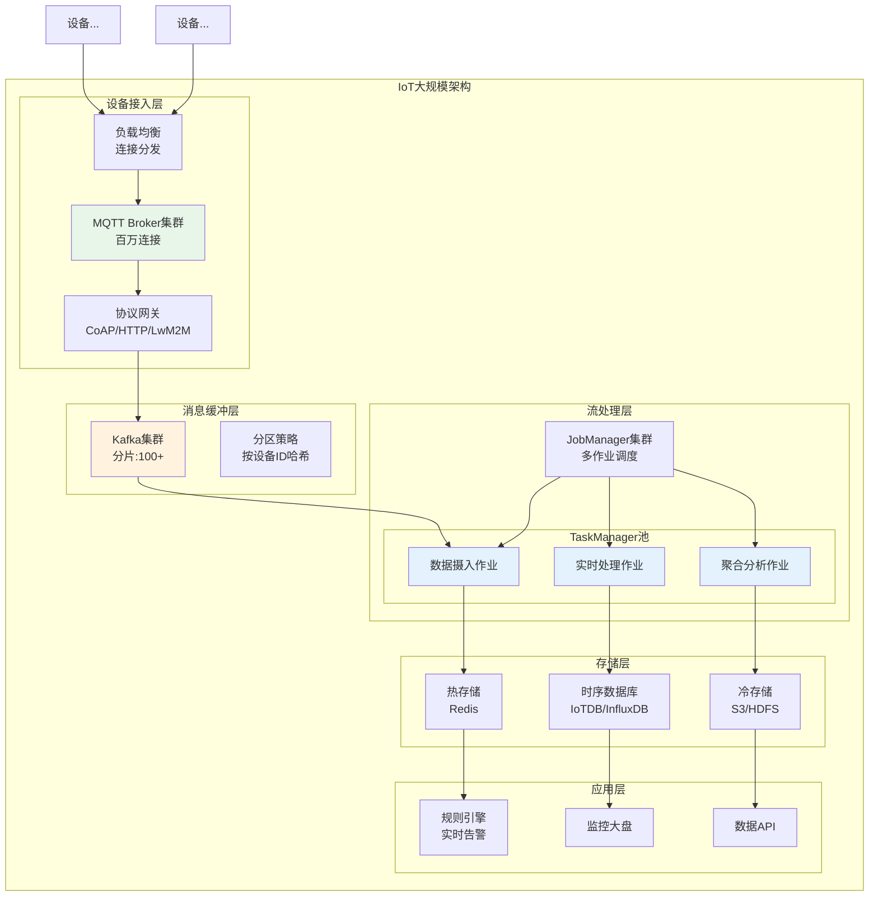
```mermaid
graph TB
    subgraph "IoT大规模架构"
        direction TB

        subgraph "设备接入层"
            MQTT_Broker[MQTT Broker集群<br/>百万连接]
            LB[负载均衡<br/>连接分发]
            Protocol[协议网关<br/>CoAP/HTTP/LwM2M]
        end

        subgraph "消息缓冲层"
            Kafka_Cluster[Kafka集群<br/>分片:100+]
            Kafka_Partition[分区策略<br/>按设备ID哈希]
        end

        subgraph "流处理层"
            Flink_JM[JobManager集群<br/>多作业调度]

            subgraph "TaskManager池"
                TM_Ingest[数据摄入作业]
                TM_Process[实时处理作业]
                TM_Analytics[聚合分析作业]
            end
        end

        subgraph "存储层"
            TSDB[时序数据库<br/>IoTDB/InfluxDB]
            Hot_Storage[热存储<br/>Redis]
            Cold_Storage[冷存储<br/>S3/HDFS]
        end

        subgraph "应用层"
            RuleEngine[规则引擎<br/>实时告警]
            Dashboard[监控大盘]
            API[数据API]
        end
    end

    Device1[设备...] --> LB
    Device2[设备...] --> LB
    LB --> MQTT_Broker
    MQTT_Broker --> Protocol
    Protocol --> Kafka_Cluster
    Kafka_Cluster --> TM_Ingest

    Flink_JM --> TM_Ingest
    Flink_JM --> TM_Process
    Flink_JM --> TM_Analytics

    TM_Ingest --> Hot_Storage
    TM_Process --> TSDB
    TM_Analytics --> Cold_Storage

    Hot_Storage --> RuleEngine
    TSDB --> Dashboard
    Cold_Storage --> API

    style MQTT_Broker fill:#e8f5e9
    style Kafka_Cluster fill:#fff3e0
    style TM_Ingest fill:#e3f2fd
    style TM_Process fill:#e3f2fd
    style TM_Analytics fill:#e3f2fd
```

**规模参数**:

| 指标 | 数值 | 配置 |
|------|------|------|
| 设备连接 | 1000万+ | MQTT集群: 50节点 |
| 消息吞吐 | 1000万 TPS | Kafka: 100+分区 |
| 处理延迟 | <100ms | Flink: 1000+并行度 |
| 存储容量 | PB级 | 分层存储 |

---

### 5.3 实时分析专用部署

**适用场景**: 实时BI、实时监控、实时推荐

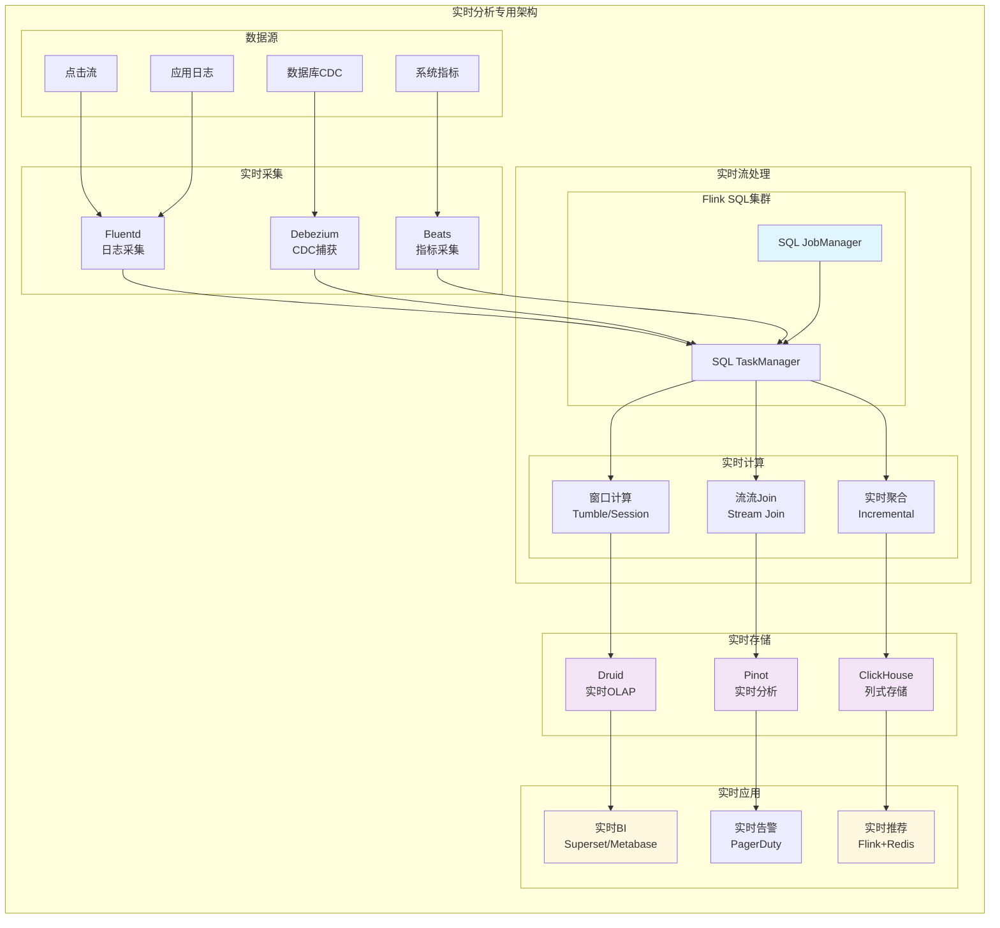
```mermaid
graph TB
    subgraph "实时分析专用架构"
        direction TB

        subgraph "数据源"
            ClickStream[点击流]
            AppLog[应用日志]
            DB_CDC[数据库CDC]
            Metrics[系统指标]
        end

        subgraph "实时采集"
            Fluentd[Fluentd<br/>日志采集]
            Debezium[Debezium<br/>CDC捕获]
            Beat[Beats<br/>指标采集]
        end

        subgraph "实时流处理"
            subgraph "Flink SQL集群"
                SQL_JM[SQL JobManager]
                SQL_TM[SQL TaskManager]
            end

            subgraph "实时计算"
                Window[窗口计算<br/>Tumble/Session]
                Join[流流Join<br/>Stream Join]
                Agg[实时聚合<br/>Incremental]
            end
        end

        subgraph "实时存储"
            Druid[Druid<br/>实时OLAP]
            Pinot[Pinot<br/>实时分析]
            ClickHouse[ClickHouse<br/>列式存储]
        end

        subgraph "实时应用"
            RealtimeBI[实时BI<br/>Superset/Metabase]
            Alert[实时告警<br/>PagerDuty]
            Recommend[实时推荐<br/>Flink+Redis]
        end
    end

    ClickStream --> Fluentd
    AppLog --> Fluentd
    DB_CDC --> Debezium
    Metrics --> Beat

    Fluentd --> SQL_TM
    Debezium --> SQL_TM
    Beat --> SQL_TM

    SQL_JM --> SQL_TM
    SQL_TM --> Window
    SQL_TM --> Join
    SQL_TM --> Agg

    Window --> Druid
    Join --> Pinot
    Agg --> ClickHouse

    Druid --> RealtimeBI
    Pinot --> Alert
    ClickHouse --> Recommend

    style SQL_JM fill:#e1f5fe
    style Druid fill:#f3e5f5
    style Pinot fill:#f3e5f5
    style ClickHouse fill:#f3e5f5
    style RealtimeBI fill:#fff8e1
    style Recommend fill:#fff8e1
```

**性能指标**:

| 场景 | 端到端延迟 | 数据新鲜度 | 并发查询 |
|------|------------|------------|----------|
| 实时BI | <5秒 | 秒级 | 100+ |
| 实时监控 | <1秒 | 亚秒级 | 1000+ |
| 实时推荐 | <50ms | 毫秒级 | 10000+ |

---

## 附录

### A. 架构选型决策树

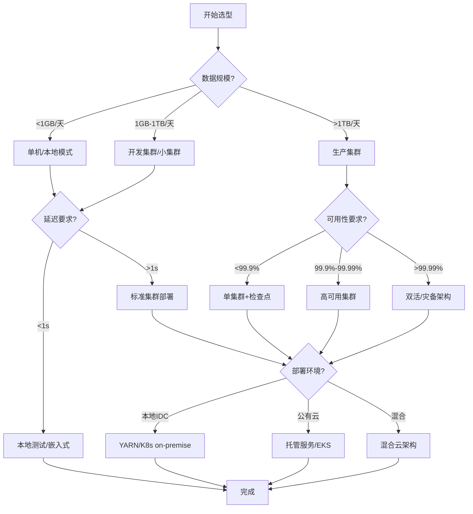
```mermaid
flowchart TD
    A[开始选型] --> B{数据规模?}
    B -->|<1GB/天| C[单机/本地模式]
    B -->|1GB-1TB/天| D[开发集群/小集群]
    B -->|>1TB/天| E[生产集群]

    C --> F{延迟要求?}
    D --> F
    E --> G{可用性要求?}

    F -->|<1s| H[本地测试/嵌入式]
    F -->|>1s| I[标准集群部署]

    G -->|<99.9%| J[单集群+检查点]
    G -->|99.9%-99.99%| K[高可用集群]
    G -->|>99.99%| L[双活/灾备架构]

    J --> M{部署环境?}
    K --> M
    L --> M

    M -->|本地IDC| N[YARN/K8s on-premise]
    M -->|公有云| O[托管服务/EKS]
    M -->|混合| P[混合云架构]

    I --> M
    H --> Q[完成]
    N --> Q
    O --> Q
    P --> Q
```

### B. 部署检查清单

#### 生产环境检查项

- [ ] 高可用配置（ZK集群、JM HA）
- [ ] 检查点配置（间隔、超时、存储）
- [ ] 状态后端选择（HashMap/RocksDB）
- [ ] 资源配置（内存、CPU、网络）
- [ ] 监控告警（Prometheus/Grafana）
- [ ] 日志收集（集中式日志）
- [ ] 安全配置（认证、授权、加密）
- [ ] 备份策略（Savepoint定期备份）
- [ ] 容量规划（扩容预案）
- [ ] 故障演练（混沌工程）

### C. 参考文档


---

*文档版本: v1.0 | 最后更新: 2026-04-03*
