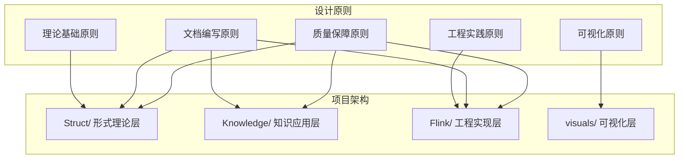
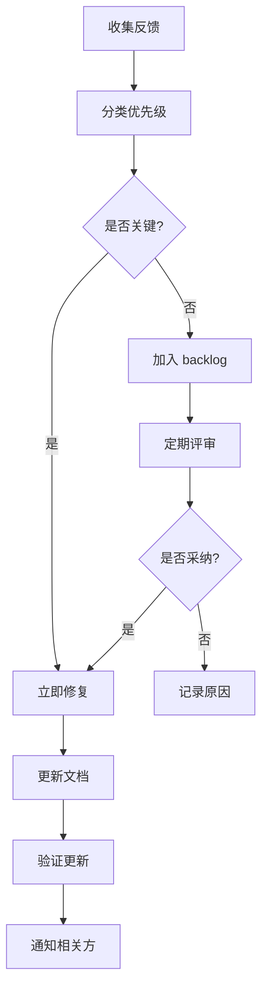
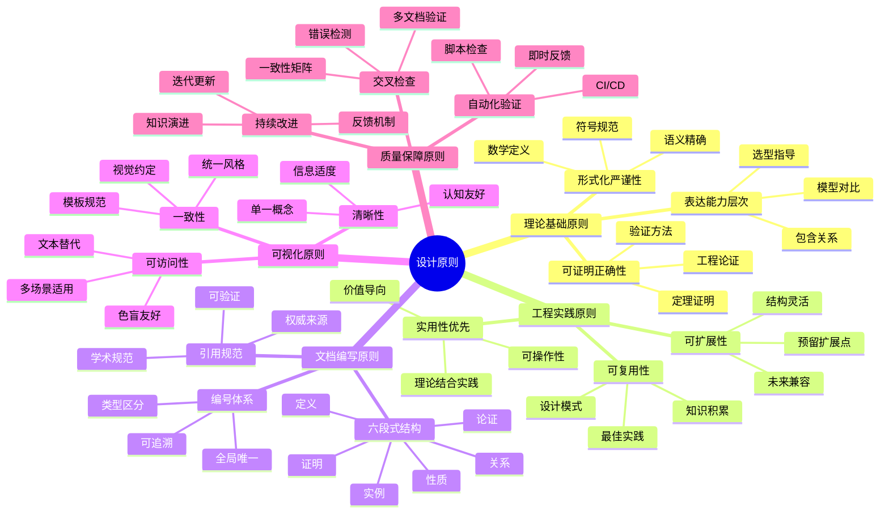
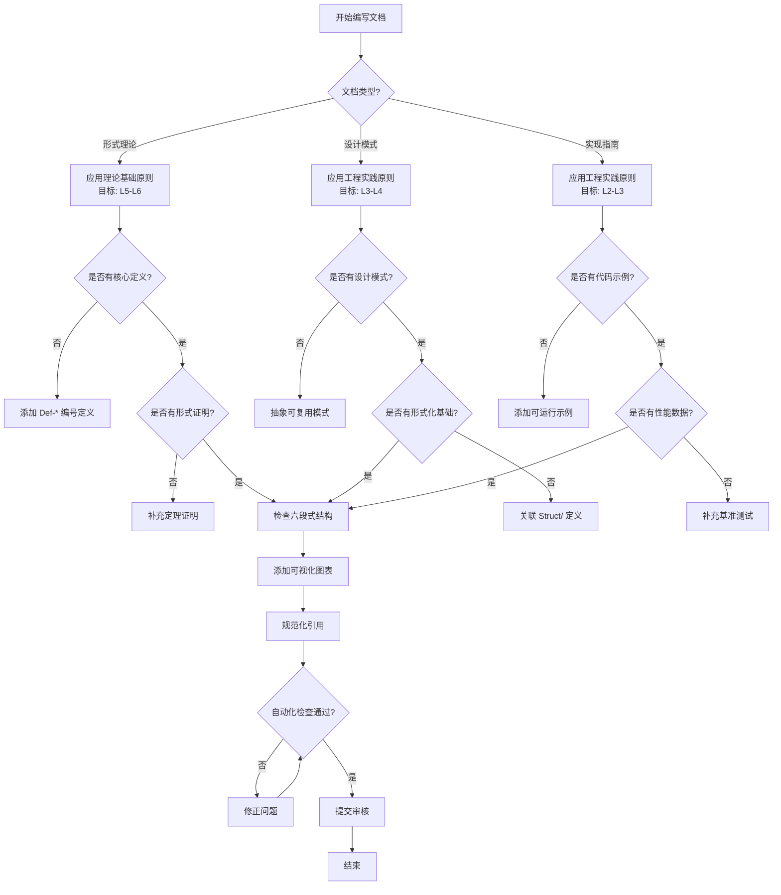

# AnalysisDataFlow 设计原则文档

> **版本**: v1.0 | **生效日期**: 2026-04-04 | **状态**: Production
> **所属阶段**: 全局规范 | **前置依赖**: [AGENTS.md](./AGENTS.md), [ARCHITECTURE.md](./ARCHITECTURE.md) | **形式化等级**: L4

---

本文档定义 AnalysisDataFlow 项目的核心设计原则，涵盖理论基础、工程实践、文档编写、可视化和质量保障五个维度。这些原则指导所有文档的编写、审阅和维护工作，确保知识库的一致性、严谨性和可用性。

---

## 1. 概念定义 (Definitions)

### Def-DP-01 设计原则 (Design Principle)

设计原则是指引系统设计和文档编写的根本性指导方针，具有**普遍性**（适用于多种场景）、**稳定性**（长期有效）和**可验证性**（可评估遵循程度）。

> **符号表示**: 设设计原则为 $\mathcal{P}$，设计决策为 $\mathcal{D}$，则 $\mathcal{D} \models \mathcal{P}$ 表示决策 $\mathcal{D}$ 遵循原则 $\mathcal{P}$。

### Def-DP-02 形式化等级 (Formality Level)

形式化等级 L1-L6 定义文档的严格程度：

| 等级 | 描述 | 适用场景 |
|------|------|----------|
| L1 | 概念性描述，无严格定义 | 概述、入门指南 |
| L2 | 半形式化定义，使用数学符号但不完整 | 概念解释 |
| L3 | 部分形式化，关键定义严格 | 工程文档 |
| L4 | 完整形式化定义，定理有证明概述 | 核心知识 |
| L5 | 完全形式化，构造性证明 | 定理证明 |
| L6 | 机器可验证的形式化 | 形式化验证 |

### Def-DP-03 六段式结构 (Six-Section Structure)

六段式结构是 AnalysisDataFlow 文档的标准组织范式：

```
1. 概念定义 (Definitions)      → 建立精确语义
2. 属性推导 (Properties)       → 推导内在性质
3. 关系建立 (Relations)        → 建立外部关联
4. 论证过程 (Argumentation)    → 展开推理过程
5. 形式证明/工程论证 (Proof)    → 完成核心论证
6. 实例验证 (Examples)         → 提供具体实例
```

### Def-DP-04 质量门禁 (Quality Gate)

质量门禁是保证文档质量的检查点集合 $\mathcal{G} = \{g_1, g_2, ..., g_n\}$，每个检查点 $g_i$ 是一个可验证的条件。文档 $D$ 通过质量门禁当且仅当：

$$\forall g \in \mathcal{G}: D \models g$$

---

## 2. 属性推导 (Properties)

### Lemma-DP-01 设计原则的传递性

**引理**: 若设计决策 $\mathcal{D}_1$ 遵循原则 $\mathcal{P}$，且 $\mathcal{D}_2$ 基于 $\mathcal{D}_1$ 构建，则 $\mathcal{D}_2$ 应满足 $\mathcal{P}$ 的核心要求。

**证明概要**: 设计原则的本质是约束设计空间。若 $\mathcal{D}_1$ 满足约束 $C(\mathcal{P})$，且 $\mathcal{D}_2$ 继承 $\mathcal{D}_1$ 的结构，则 $\mathcal{D}_2$ 在对应维度上也满足 $C(\mathcal{P})$。∎

### Lemma-DP-02 形式化等级与可验证性的正相关

**引理**: 设文档 $D$ 的形式化等级为 $L(D)$，其可验证性为 $V(D)$，则：

$$L(D_1) > L(D_2) \Rightarrow V(D_1) \geq V(D_2)$$

**直观解释**: 形式化程度越高，语义越精确，可验证性越强。

### Prop-DP-01 六段式完备性

**命题**: 遵循六段式结构的文档能够完整回答关于一个概念的四个基本问题：

- **是什么?** → 由"概念定义"回答
- **有什么性质?** → 由"属性推导"回答
- **与其他概念的关系?** → 由"关系建立"回答
- **为什么正确?** → 由"形式证明"回答

---

## 3. 关系建立 (Relations)

### 3.1 设计原则与项目架构的关系



### 3.2 设计原则与 AGENTS.md 规范的关系

| 本文档原则 | AGENTS.md 对应章节 | 关系说明 |
|------------|-------------------|----------|
| 理论基础原则 | 第8章 前置知识假设 | 本文档细化了理论基础的具体要求 |
| 文档编写原则 | 第3-4章 编号与六段式 | 本文档提供了设计层面的解释和示例 |
| 可视化原则 | 第6章 Mermaid 规范 | 本文档增加了可访问性等更高层次原则 |
| 质量保障原则 | 第7.3章 质量门禁 | 本文档扩展了质量保障的方法论 |

### 3.3 原则间的层次关系

```
理论基础原则 (Foundation)
         ↓
文档编写原则 (Documentation) ← → 可视化原则 (Visualization)
         ↓
工程实践原则 (Engineering)
         ↓
质量保障原则 (Quality Assurance) [贯穿全程]
```

---

## 4. 论证过程 (Argumentation)

### 4.1 为什么需要明确的设计原则?

**问题**: 在已有 AGENTS.md 规范的情况下，为何还需要独立的设计原则文档?

**论证**:

1. **层次区分**: AGENTS.md 侧重**操作规范**（如何做），本文档侧重**设计哲学**（为何这样设计）
2. **决策支持**: 当规范未覆盖特定场景时，设计原则提供决策依据
3. **一致性保证**: 多人协作时，共同的设计原则确保风格统一
4. **演进基础**: 项目扩展时，新内容可参照设计原则保持内在一致性

### 4.2 原则之间的潜在冲突与平衡

| 潜在冲突 | 表现 | 平衡策略 |
|----------|------|----------|
| 形式化严谨性 vs 实用性 | 过于严格的形式化难以理解 | 根据受众选择形式化等级 |
| 完整性 vs 可维护性 | 文档越全维护成本越高 | 核心文档严格，辅助文档灵活 |
| 一致性 vs 灵活性 | 统一格式限制表达 | 允许例外但需说明理由 |

### 4.3 反模式识别

以下情况表示设计原则被违反：

| 反模式 | 症状 | 修正方法 |
|--------|------|----------|
| 原则空心化 | 原则存在但决策时不参考 | 建立原则-决策追踪机制 |
| 形式化崇拜 | 为形式化而形式化，脱离实际 | 回归问题本质，选择合适的 L 等级 |
| 文档孤岛 | 文档之间无交叉引用 | 强制每文档至少3个外部引用 |
| 可视化过载 | 图表过多或过于复杂 | 遵循"一图一概念"原则 |

---

## 5. 形式证明 / 工程论证 (Proof / Engineering Argument)

### 5.1 理论基础原则

#### 原则 P1: 形式化严谨性 (Formal Rigor)

**陈述**: 所有核心概念必须有严格的数学定义，形式化程度应与概念的重要性成正比。

**工程论证**:

- **必要性**: 流计算涉及时间、状态、一致性等微妙概念，非形式化描述易产生歧义
- **成本效益**: 形式化定义初期成本高，但长期降低理解成本和错误率
- **可验证性**: 形式化为后续的正确性证明奠定基础

**应用示例**:

```markdown
非形式化: "Watermark 表示事件时间的进度"
形式化: Def-W-01 Watermark
"设事件时间域为 $\mathcal{E} = \{e_1, e_2, ...\}$，Watermark 是单调不减函数
$W: \mathcal{P} \to \mathcal{E}$，其中 $\mathcal{P}$ 是处理时间域。"
```

#### 原则 P2: 可证明正确性 (Provable Correctness)

**陈述**: 关键机制（如 Checkpoint、Exactly-Once）必须提供或引用正确性证明。

**工程论证**:

- **工程安全**: 生产系统的容错机制必须可证明其有效性
- **算法理解**: 证明过程揭示算法的核心逻辑
- **优化基础**: 只有理解正确性条件，才能安全地进行优化

**应用示例**:

```markdown
在描述 Flink Checkpoint 时：
1. 定义 Snapshot 的一致性条件（Def-C-01）
2. 证明 Chandy-Lamport 算法满足一致性（Thm-C-01）
3. 证明 barrier 机制是 Chandy-Lamport 的实例（Lemma-C-02）
```

#### 原则 P3: 表达能力层次 (Expressiveness Hierarchy)

**陈述**: 不同模型/语言/系统的表达能力应明确分层，避免概念混淆。

**工程论证**:

- **技术选型**: 清晰的能力层次指导技术选择
- **迁移评估**: 理解层次关系评估迁移可行性
- **教学路径**: 由浅入深的层次设计学习路径

**应用示例**:

```markdown
进程演算表达能力层次：
CCS ⊂ CSP ⊂ π-calculus

其中 ⊂ 表示严格表达能力包含关系，即后者可表达前者所有模式，
反之不成立。
```

### 5.2 工程实践原则

#### 原则 P4: 实用性优先 (Practicality First)

**陈述**: 理论内容必须与工程实践相结合，避免纯粹的形式化游戏。

**工程论证**:

- **价值导向**: 知识库的目标是支持实际工程决策
- **认知负荷**: 工程师需要可操作的指导，而非纯理论
- **验证闭环**: 理论必须通过实践验证

**应用示例**:

```markdown
描述状态后端时：
✗ 仅描述状态后端的抽象接口
✓ 抽象接口 + RocksDB vs HashMap 选型矩阵 + 配置示例 + 性能对比
```

#### 原则 P5: 可复用性 (Reusability)

**陈述**: 设计模式和解决方案应具有通用性，可在不同场景复用。

**工程论证**:

- **知识积累**: 避免重复解决相同问题
- **最佳实践**: 复用经过验证的方案降低风险
- **沟通效率**: 共享的词汇和模式提升团队协作效率

**应用示例**:

```markdown
事件时间处理模式：
- 定义: 通用的事件时间处理框架
- 应用: Kafka + Flink 场景、Pulsar + Spark 场景、...
- 复用点: Watermark 生成策略、延迟数据处理方式
```

#### 原则 P6: 可扩展性 (Extensibility)

**陈述**: 文档结构和内容组织应支持未来扩展，不预设固定边界。

**工程论证**:

- **技术演进**: 流计算领域持续发展（如 AI 集成、新硬件）
- **知识增长**: 项目知识库将随时间扩展
- **社区贡献**: 清晰的扩展点降低外部贡献门槛

**应用示例**:

```markdown
目录命名预留扩展空间：
Flink/
├── 01-architecture/     # 核心架构
├── 02-core-mechanisms/  # 核心机制
├── ...
├── 06-engineering/      # 工程实践
├── 12-ai-ml/           # AI/ML 扩展（预留编号）
└── 15-observability/   # 可观测性扩展

编号 07-11 预留给未来扩展领域
```

### 5.3 文档编写原则

#### 原则 P7: 六段式结构 (Six-Section Structure)

**陈述**: 所有核心文档必须遵循六段式结构，确保内容完整性和一致性。

**工程论证**:

- **认知框架**: 六段式对应人类理解概念的认知路径
- **质量保证**: 强制覆盖概念的所有关键方面
- **导航便利**: 统一结构便于快速定位信息

**应用示例**:

```markdown
文档结构检查清单：
- [ ] 1. 概念定义：是否有 Def-* 编号？
- [ ] 2. 属性推导：是否有 Lemma-* 或 Prop-* 编号？
- [ ] 3. 关系建立：是否关联到至少 2 个其他概念？
- [ ] 4. 论证过程：是否解释了"为什么"？
- [ ] 5. 形式证明/工程论证：是否有严谨的论证？
- [ ] 6. 实例验证：是否有具体示例？
- [ ] 7. 可视化：是否有 Mermaid 图表？
- [ ] 8. 引用参考：是否有规范引用？
```

#### 原则 P8: 编号体系 (Numbering System)

**陈述**: 形式化元素（定义、定理、引理等）必须使用全局唯一编号。

**工程论证**:

- **精确引用**: "见 Thm-S-01-03" 比 "见前文定理" 精确
- **交叉验证**: 编号便于自动化检查引用完整性
- **知识图谱**: 编号是构建知识图谱的基础节点标识

**编号规则矩阵**:

| 元素类型 | 编号格式 | 示例 | 适用目录 |
|----------|----------|------|----------|
| 定义 | Def-{阶段}-{文档序号}-{顺序号} | Def-S-01-01 | Struct/
| 定理 | Thm-{阶段}-{文档序号}-{顺序号} | Thm-S-02-03 | Struct/
| 引理 | Lemma-{阶段}-{文档序号}-{顺序号} | Lemma-K-03-02 | Knowledge/
| 命题 | Prop-{阶段}-{文档序号}-{顺序号} | Prop-F-05-01 | Flink/
| 推论 | Cor-{阶段}-{文档序号}-{顺序号} | Cor-S-04-02 | Struct/

#### 原则 P9: 引用规范 (Citation Standards)

**陈述**: 所有外部知识必须标注可验证的来源，优先使用权威来源。

**工程论证**:

- **可信度**: 可验证的引用增强内容可信度
- **深入学习**: 读者可追踪引用获取更深入信息
- **学术规范**: 遵循学术写作的基本规范

**来源优先级**:

```
Tier 1（最高）: 顶级会议/期刊论文 (VLDB, SIGMOD, SOSP, OSDI, CACM)
Tier 2: 权威课程讲义 (MIT 6.824, CMU 15-712)
Tier 3: 官方技术文档 (Apache Flink, Akka Docs)
Tier 4: 权威书籍 (DDIA, Streaming Systems)
Tier 5: 技术博客（需交叉验证）
```

### 5.4 可视化原则

#### 原则 P10: 清晰性 (Clarity)

**陈述**: 每个可视化图表应清晰表达单一核心概念，避免信息过载。

**工程论证**:

- **认知限制**: 人类工作记忆容量有限（Miller's Law: 7±2）
- **理解效率**: 清晰的图表降低理解成本
- **记忆留存**: 简洁的视觉设计提升长期记忆

**应用示例**:

```markdown
✗ 一张图包含：架构图 + 数据流 + 状态机 + 时序图
✓ 四张图分别表达：
  - 图1: 系统架构（层次图）
  - 图2: 数据流转（流程图）
  - 图3: 状态转换（状态图）
  - 图4: 时序关系（时序图）
```

#### 原则 P11: 一致性 (Consistency)

**陈述**: 同类图表使用统一的视觉约定（颜色、形状、布局）。

**工程论证**:

- **学习曲线**: 一致的约定降低学习成本
- **错误预防**: 熟悉的设计模式减少误读
- **维护效率**: 统一模板提升创建和维护效率

**视觉约定规范**:

| 元素 | 约定 | 含义 |
|------|------|------|
| 🔵 蓝色矩形 | 组件/服务 | 系统中的功能单元 |
| 🟢 绿色菱形 | 决策点 | 条件分支或选择 |
| 🟡 黄色圆角 | 数据/状态 | 数据存储或状态 |
| 🔴 红色 | 关键路径/风险 | 需要特别注意 |
| → 实线箭头 | 同步调用 | 直接依赖 |
| --> 虚线箭头 | 异步通知 | 事件驱动 |

#### 原则 P12: 可访问性 (Accessibility)

**陈述**: 可视化内容应考虑不同能力的读者，提供替代访问方式。

**工程论证**:

- **包容性**: 色盲、视障读者也能获取信息
- **SEO**: 文本描述提升搜索可发现性
- **多场景**: 文本描述可用于演讲稿、文档等多种场景

**应用示例**:

```markdown
每个 Mermaid 图前应有文字说明：

"下图展示了 Flink Checkpoint 的协调流程。JobManager 定期触发
checkpoint，通过 barrier 机制协调所有 Source 和 Operator 的状态
snapshot。"


"流程说明：

1. JobManager 向所有 Source 发送 checkpoint 触发信号
2. Source 注入 barrier 到数据流
3. barrier 流经各 Operator，触发状态快照"

```

### 5.5 质量保障原则

#### 原则 P13: 自动化验证 (Automated Validation)

**陈述**: 关键质量检查应自动化，减少人工检查负担和遗漏。

**工程论证**:
- **规模限制**: 人工检查无法扩展至大规模文档集
- **一致性**: 自动化确保检查标准一致应用
- **反馈速度**: 即时反馈加速迭代

**应用示例**:
```bash
# 自动化检查脚本示例
check_documentation.py
├── 检查六段式结构完整性
├── 检查编号唯一性和连续性
├── 检查引用格式规范性
├── 检查 Mermaid 语法正确性
└── 检查死链和不可访问引用
```

#### 原则 P14: 交叉检查 (Cross-Validation)

**陈述**: 重要概念应在多个文档中交叉验证，确保一致性。

**工程论证**:

- **错误检测**: 不一致揭示潜在错误
- **知识强化**: 多角度描述加深理解
- **冗余备份**: 单一文档丢失不造成知识断层

**交叉检查矩阵示例**:

| 概念 | Struct/ | Knowledge/ | Flink/ | 一致性状态 |
|------|---------|------------|--------|-----------|
| Watermark | Def-S-03-02 | Def-K-02-05 | Def-F-02-08 | ✅ 一致 |
| Exactly-Once | Thm-S-04-01 | Pattern-K-03-02 | Thm-F-02-03 | ⚠️ 需核对 |
| Checkpoint | Lemma-S-04-03 | - | Thm-F-02-01 | ✅ 一致 |

#### 原则 P15: 持续改进 (Continuous Improvement)

**陈述**: 文档质量是一个持续改进的过程，应建立反馈和迭代机制。

**工程论证**:

- **知识演进**: 领域知识持续更新
- **错误修正**: 发现错误应及时修复
- **用户反馈**: 读者反馈是改进的重要来源

**改进流程**:



---

## 6. 实例验证 (Examples)

### 6.1 完整应用示例：Checkpoint 文档

以下展示如何将设计原则应用于 Checkpoint 主题文档：

```markdown
# Checkpoint 机制详解

> 所属阶段: Flink/ | 前置依赖: [状态管理](./Flink/02-core/flink-state-management-complete-guide.md) | 形式化等级: L4

## 1. 概念定义 (Definitions)

### Def-F-02-01 Checkpoint
Checkpoint 是分布式流处理系统的全局一致性快照，定义为三元组
$CP = (S, T, B)$，其中：
- $S$：所有 operator 的状态集合
- $T$：快照时间戳
- $B$：barrier 对齐信息

## 2. 属性推导 (Properties)

### Lemma-F-02-01 Checkpoint 一致性
若所有 operator 在收到 barrier 时原子性地保存状态，则 checkpoint
满足一致性条件。

## 3. 关系建立 (Relations)
- 与 Chandy-Lamport 算法的关系：[参见 Thm-S-04-01]
- 与 Exactly-Once 语义的关系：[参见 Thm-F-02-03]

## 4. 论证过程 (Argumentation)
[解释为什么选择 barrier 机制而非其他方案]

## 5. 形式证明 / 工程论证 (Proof / Engineering Argument)
### Thm-F-02-01 Flink Checkpoint 正确性
[完整证明或详细工程论证]

## 6. 实例验证 (Examples)
```java
// Checkpoint 配置示例
env.enableCheckpointing(60000);
env.getCheckpointConfig().setCheckpointingMode(
    CheckpointingMode.EXACTLY_ONCE);
```

## 7. 可视化 (Visualizations)

[Mermaid 图展示 checkpoint 流程]

## 8. 引用参考 (References)

```

### 6.2 原则违反与修正示例

| 场景 | 原内容（违反） | 修正后（遵循） |
|------|---------------|---------------|
| 缺乏形式化定义 | "Watermark 是时间戳" | "Def-K-02-05: Watermark 是单调不减函数 $W: \mathcal{P} \to \mathcal{E}$" |
| 无六段式结构 | 混杂定义、代码、论述 | 按六段式重新组织 |
| 图表无说明 | 直接插入 Mermaid 代码 | 先文字说明，再图表，最后解读 |
| 引用缺失 | "研究表明..." | "Akidau et al. [^2] 的研究表明..." |
| 编号混乱 | "定理 1"、"定理 1"（重复） | "Thm-S-01-01"、"Thm-K-02-01"（唯一） |

---

## 7. 可视化 (Visualizations)

### 7.1 设计原则全景图



### 7.2 原则应用决策树



---

## 8. 引用参考 (References)


---

## 附录 A: 快速参考卡片

### A.1 六段式检查清单

```
□ 概念定义：至少一个 Def-* 编号
□ 属性推导：至少一个 Lemma-* 或 Prop-* 编号
□ 关系建立：至少 2 个外部概念关联
□ 论证过程：解释"为什么"和"如何"
□ 形式证明：定理有完整证明或详细工程论证
□ 实例验证：代码/配置/案例至少一种
□ 可视化：至少一个 Mermaid 图表
□ 引用参考：至少 3 个规范引用
```

### A.2 形式化等级选择指南

| 文档目的 | 推荐等级 | 关键特征 |
|----------|----------|----------|
| 概念入门 | L1-L2 | 直观解释为主 |
| 工程指南 | L3 | 关键定义严格 |
| 核心知识 | L4 | 完整形式化定义 |
| 定理证明 | L5 | 构造性证明 |
| 形式化验证 | L6 | 机器可检查 |

### A.3 常见 Mermaid 图表类型速查

| 用途 | 图表类型 | 关键字 |
|------|----------|--------|
| 层次结构 | 思维导图 | `mindmap` |
| 映射关系 | 层次图 | `graph TB/TD` |
| 决策流程 | 流程图 | `flowchart TD` |
| 状态转换 | 状态图 | `stateDiagram-v2` |
| 类型结构 | 类图 | `classDiagram` |
| 时间规划 | 甘特图 | `gantt` |
| 时序交互 | 时序图 | `sequenceDiagram` |

---

*本文档遵循自身定义的设计原则编写，是自举的（self-hosting）设计原则规范。*
