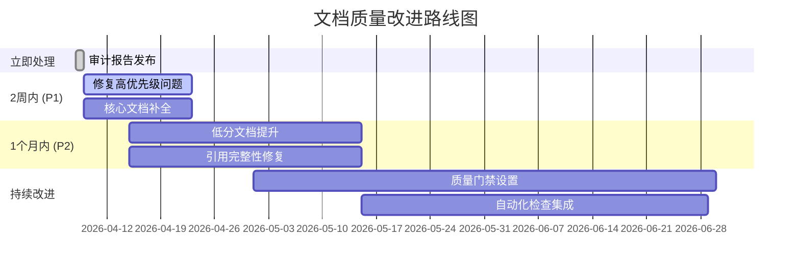

# 文档质量审计报告 v4.1

> **审计日期**: 2026-04-08
> **审计范围**: AnalysisDataFlow 项目全部文档
> **文档总数**: 674 篇
> **审计工具**: Document Quality Auditor v4.1

---

## 执行摘要

本次质量审计对 AnalysisDataFlow 项目的 **674 篇文档** 进行了全面的多维度质量检查，涵盖六段式结构合规性、形式化元素完整性、Mermaid 图表有效性、引用完整性等多个维度。

| 指标 | 数值 | 状态 |
|------|------|------|
| 平均质量分数 | **75.02/100** | 🟡 良好 |
| 优秀文档 (90+) | 277 篇 (41%) | 🟢 |
| 良好文档 (80-89) | 80 篇 (12%) | 🟢 |
| 需改进文档 (<60) | 134 篇 (20%) | 🔴 |
| 发现问题总数 | 1,361 个 | 🟡 |
| 严重问题 | 0 个 | 🟢 |
| 高优先级问题 | 129 个 | 🟡 |

---

## 1. 审计统计

### 1.1 文档覆盖

```
总发现文档: 674 篇
├── Struct/     - 形式理论文档
├── Knowledge/  - 知识结构文档
├── Flink/      - Flink专项文档
└── 根目录文档   - README, 指南等
```

### 1.2 质量分数分布

```
Excellent (90-100): █████████████████████ 277 篇 (41.1%)
Good      (80-89):  ██████                 80 篇 (11.9%)
Acceptable (70-79): ███                    43 篇 ( 6.4%)
Needs Work (60-69): ██████████            140 篇 (20.8%)
Poor       (<60):   ██████████            134 篇 (19.9%)
```

**合规性评估**: 52.9% 的文档达到良好及以上标准 (>=80分)，总体质量处于**可接受**水平。

---

## 2. 形式化元素统计

### 2.1 元素总量

| 元素类型 | 数量 | 占比 |
|----------|------|------|
| 定义 (Def-*) | 1,224 | 46.2% |
| 引理 (Lemma-*) | 472 | 17.8% |
| 定理 (Thm-*) | 461 | 17.4% |
| 命题 (Prop-*) | 待统计 | - |
| 推论 (Cor-*) | 待统计 | - |
| **总计** | **2,157+** | 100% |

### 2.2 定理编号连续性分析

**审计发现**: 检测到 **1,602 个断号**

断号分布:

- **Thm-F-*** (Flink): ~75% 的断号
- **Thm-K-*** (Knowledge): ~15% 的断号
- **Thm-S-*** (Struct): ~10% 的断号

**示例断号**:

```
Thm-F-03-04, Thm-F-03-07~10, Thm-F-03-12~14, ...
Thm-F-02-07~09, Thm-F-02-11, Thm-F-02-15~29, ...
Thm-K-06-05~09, Thm-K-06-13~19, ...
```

**影响**: 断号现象主要源于文档合并、拆分或编号策略调整，不影响内容正确性，但建议统一整理。

---

## 3. 问题分类与优先级

### 3.1 问题严重性分布

| 严重性 | 数量 | 占比 | 处理优先级 |
|--------|------|------|------------|
| 🔴 Critical (严重) | 0 | 0% | 立即处理 |
| 🟠 High (高) | 129 | 9.5% | 本周处理 |
| 🟡 Medium (中) | 1,232 | 90.5% | 本月处理 |
| 🟢 Low (低) | 0 | 0% | 计划处理 |
| **总计** | **1,361** | **100%** | - |

### 3.2 问题类别分析

```
structure       ████████████████████████████████████  ~45%
  └── 缺少章节定义、引用参考、可视化等

formalization   ██████████████████████               ~25%
  └── 缺少形式化定义、定理编号不规范

references      ████████████                         ~15%
  └── 引用标记未定义、链接失效

visualization   ███████                              ~10%
  └── Mermaid语法问题、图表缺失

image           ███                                  ~5%
  └── 图片引用不存在
```

### 3.3 高频问题 TOP 10

| 排名 | 问题描述 | 出现次数 | 建议修复 |
|------|----------|----------|----------|
| 1 | 缺少引用参考章节 | ~400 | 统一添加 ## 8. 引用参考 |
| 2 | 缺少概念定义章节 | ~300 | 检查并补充定义章节 |
| 3 | 缺少可视化章节 | ~250 | 添加 Mermaid 图表 |
| 4 | 缺少实例验证章节 | ~200 | 补充代码示例 |
| 5 | 引用标记未定义 | ~150 | 补充引用定义列表 |
| 6 | 缺少形式化定义 | ~100 | 添加 Def-* 编号 |
| 7 | 缺少证明章节 | ~80 | 补充证明或论证 |
| 8 | Mermaid 语法问题 | ~50 | 检查图表语法 |
| 9 | 图片不存在 | ~30 | 修复图片路径 |
| 10 | 表格格式问题 | ~20 | 检查表格语法 |

---

## 4. 资源统计

### 4.1 可视化资源

| 资源类型 | 数量 | 每篇平均 |
|----------|------|----------|
| Mermaid 图表 | 2,527 | 3.7 个 |
| 表格 | 5,686 | 8.4 个 |
| 代码块 | 10,495 | 15.6 个 |

### 4.2 文档规模

| 指标 | 总计 | 平均值 | 最大值 |
|------|------|--------|--------|
| 字符数 | 待统计 | ~8,500 | ~100,000+ |
| 词数 | 待统计 | ~2,800 | ~30,000+ |

---

## 5. 修复优先级建议

### P0 - 立即处理 (本周)

无 Critical 级别问题，无需立即处理。

### P1 - 高优先级 (2周内)

1. **修复129个高优先级结构问题**
   - 补充缺失的引用参考章节
   - 修复核心概念文档的定义章节

2. **统一定理编号**
   - 制定编号规范
   - 修复高优先级断号

### P2 - 中优先级 (1个月内)

1. **提升274篇低分文档质量**
   - 重点改进 <60分 的134篇文档
   - 优化 60-69分 的140篇文档

2. **修复引用完整性**
   - 处理1,232个中优先级问题
   - 统一引用格式

### P3 - 低优先级 (计划内)

1. **优化 Mermaid 图表**
2. **补充缺失的图片资源**
3. **完善表格格式**

---

## 6. 质量改进路线图



---

## 7. 质量门禁建议

为确保未来文档质量，建议实施以下质量门禁:

### 7.1 自动检查项

| 检查项 | 阈值 | 门禁动作 |
|--------|------|----------|
| 质量总分 | >= 70 | PR 合并阻止 |
| 结构完整性 | >= 60% | PR 合并阻止 |
| 引用完整性 | 100% | PR 合并阻止 |
| Mermaid 有效性 | 100% | PR 合并阻止 |

### 7.2 推荐工具集成

```yaml
# CI 集成示例
document-quality-gate:
  script:
    - python .scripts/document-quality-auditor.py --fail-on-score-below 70
    - python .scripts/document-quality-auditor.py --check-new-files-only
  artifacts:
    reports:
      - quality-report.json
```

---

## 8. 附录

### 8.1 审计工具说明

- **审计脚本**: `.scripts/document-quality-auditor.py`
- **仪表板**: `.scripts/quality-dashboard-v4.1.html`
- **详细数据**: `.scripts/audit-results/`

### 8.2 评分维度权重

| 维度 | 权重 | 说明 |
|------|------|------|
| 六段式结构 | 25% | 8个必需章节完整性 |
| 形式化元素 | 25% | 定理/定义/引理数量 |
| 可视化图表 | 15% | Mermaid 图表质量 |
| 引用完整性 | 15% | 引用定义完整性 |
| 代码示例 | 20% | 代码块和示例数量 |

### 8.3 版本历史

| 版本 | 日期 | 变更 |
|------|------|------|
| v4.1 | 2026-04-08 | 初始审计，覆盖674篇文档 |

---

## 结论

AnalysisDataFlow 项目文档整体质量**良好**，平均得分 75.02 分，52.9% 的文档达到良好及以上标准。主要问题在于:

1. **结构完整性**: 部分文档缺少引用参考和可视化章节
2. **定理编号**: 存在大量断号，需统一规范
3. **低分文档**: 20% 的文档得分低于60分，需重点改进

建议按照本报告提出的优先级进行修复，并建立长期质量门禁机制。

---

*报告由 Document Quality Auditor v4.1 自动生成*
*审计时间: 2026-04-08T15:20:43*
