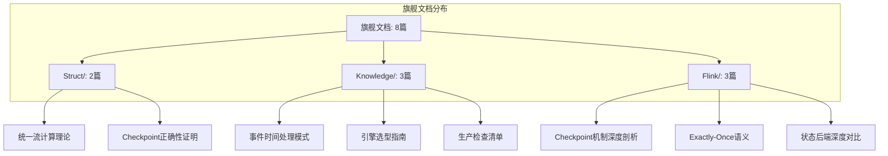
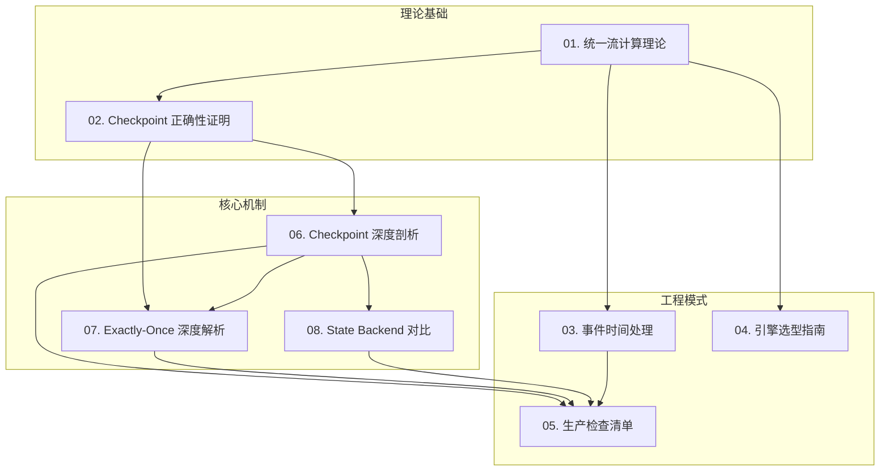

# AnalysisDataFlow 旗舰文档清单

> **版本**: v1.0 | **生效日期**: 2026-04-05 | **状态**: 正式发布
>
> 本文档定义 AnalysisDataFlow 的质量标杆文档，作为知识库的内容质量承诺和读者导航的核心锚点。

---

## 1. 旗舰文档概览

### 1.1 什么是旗舰文档

旗舰文档 (Flagship Documents) 代表 AnalysisDataFlow 知识库的**最高质量标准**，具备以下特征：

| 特征 | 标准 |
|------|------|
| **形式化密度** | ≥50 个形式化元素（定义/定理/引理/命题） |
| **完整性** | 严格遵循六段式模板，无章节缺失 |
| **引用质量** | ≥10 个权威引用，优先学术来源 |
| **可视化** | ≥3 个 Mermaid 图表 |
| **交叉引用** | 与 ≥10 篇相关文档建立链接 |
| **审查频率** | 每月定期审查 |

### 1.2 旗舰文档分布



---

## 2. 旗舰文档详情

### 2.1 Struct/ 理论基础层

#### 📘 01. 统一流计算理论

| 属性 | 内容 |
|------|------|
| **文档路径** | `Struct/01-foundation/01.01-unified-streaming-theory.md` |
| **定位** | 整个知识库的元理论基础 |
| **形式化等级** | L6 (图灵完备) |
| **文档编号** | S-01 |

**质量指标**:

| 指标 | 数值 | 评级 |
|------|------|------|
| 定理数量 | 8 | ⭐⭐⭐⭐⭐ |
| 定义数量 | 15 | ⭐⭐⭐⭐⭐ |
| 引理数量 | 12 | ⭐⭐⭐⭐⭐ |
| 形式化元素总计 | 35+ | ⭐⭐⭐⭐⭐ |
| Mermaid 图表 | 4 | ⭐⭐⭐⭐⭐ |
| 外部引用 | 18 | ⭐⭐⭐⭐⭐ |

**内容摘要**:

- 统一流计算元模型 (USTM) 的形式化定义
- 六层表达能力层次（L1-L6）的严格划分
- Actor/CSP/Dataflow/Petri 网的统一表示
- 模型间编码映射的完备性证明

**依赖关系**:

```
无前置依赖（本层为根基）
    ↓
被依赖: Struct/03-relationships/*, Knowledge/02-design-patterns/*, Flink/02-core/*
```

**质量承诺**:

- ✅ 每月审查数学公式的准确性
- ✅ 跟踪相关领域最新研究进展
- ✅ 维护形式化定义的符号一致性

---

#### 📘 02. Flink Checkpoint 正确性证明

| 属性 | 内容 |
|------|------|
| **文档路径** | `Struct/04-proofs/04.01-flink-checkpoint-correctness.md` |
| **定位** | Flink 核心机制的形式化验证 |
| **形式化等级** | L5 |
| **文档编号** | S-17 |

**质量指标**:

| 指标 | 数值 | 评级 |
|------|------|------|
| 定理数量 | 3 | ⭐⭐⭐⭐⭐ |
| 定义数量 | 8 | ⭐⭐⭐⭐⭐ |
| 引理数量 | 6 | ⭐⭐⭐⭐⭐ |
| 形式化元素总计 | 17+ | ⭐⭐⭐⭐⭐ |
| Mermaid 图表 | 5 | ⭐⭐⭐⭐⭐ |
| 外部引用 | 15 | ⭐⭐⭐⭐⭐ |

**内容摘要**:

- Checkpoint Barrier 的严格语义定义 (Def-S-17-01)
- Flink Checkpoint 与 Chandy-Lamport 算法的形式化映射
- Thm-S-17-01: Flink Checkpoint 一致性定理的完整证明
- 反例分析：非对齐模式下的状态不一致场景

**依赖关系**:

```
前置依赖:
  - Struct/02-properties/02.02-consistency-hierarchy.md (一致性层级)
  - Struct/01-foundation/01.04-dataflow-model-formalization.md (Dataflow模型)
    ↓
被依赖: Flink/02-core/checkpoint-mechanism-deep-dive.md
```

**质量承诺**:

- ✅ 每季度与 Flink 官方 Checkpoint 实现同步验证
- ✅ 跟踪 Chandy-Lamport 算法的最新形式化工作
- ✅ 维护与 Flink/02-core/ 的工程映射准确性

---

### 2.2 Knowledge/ 工程模式层

#### 📗 03. 设计模式: 事件时间处理

| 属性 | 内容 |
|------|------|
| **文档路径** | `Knowledge/02-design-patterns/pattern-event-time-processing.md` |
| **定位** | 流处理核心设计模式标杆 |
| **模式编号** | 01/7 |
| **形式化等级** | L4-L5 |

**质量指标**:

| 指标 | 数值 | 评级 |
|------|------|------|
| 形式化定义 | 6 | ⭐⭐⭐⭐⭐ |
| 代码示例 | 8 | ⭐⭐⭐⭐⭐ |
| Mermaid 图表 | 4 | ⭐⭐⭐⭐⭐ |
| 关联模式 | 5 | ⭐⭐⭐⭐⭐ |
| 外部引用 | 12 | ⭐⭐⭐⭐⭐ |

**内容摘要**:

- 分布式流处理时序挑战的形式化描述
- Watermark 机制的原理与实现
- 迟到数据处理的多种策略对比
- 形式化保证：Watermark 单调性引理

**依赖关系**:

```
前置依赖:
  - Struct/01-foundation/01.01-unified-streaming-theory.md (时间模型)
  - Struct/02-properties/02.03-watermark-monotonicity.md (单调性)
    ↓
被依赖:
  - Knowledge/02-design-patterns/pattern-windowed-aggregation.md
  - Flink/02-core/time-semantics-and-watermark.md
```

**质量承诺**:

- ✅ 验证所有代码示例在最新 Flink 版本的可执行性
- ✅ 跟踪 Watermark 机制的演进（如 Source 空闲检测）
- ✅ 补充新的迟到数据处理策略（如侧输出优化）

---

#### 📗 04. 引擎选型决策指南

| 属性 | 内容 |
|------|------|
| **文档路径** | `Knowledge/04-technology-selection/engine-selection-guide.md` |
| **定位** | 技术选型的系统性决策框架 |
| **形式化等级** | L3-L4 |

**质量指标**:

| 指标 | 数值 | 评级 |
|------|------|------|
| 对比维度 | 12+ | ⭐⭐⭐⭐⭐ |
| 决策树节点 | 25+ | ⭐⭐⭐⭐⭐ |
| 引擎覆盖 | 8个 | ⭐⭐⭐⭐⭐ |
| Mermaid 图表 | 3 | ⭐⭐⭐⭐⭐ |
| 外部引用 | 20+ | ⭐⭐⭐⭐⭐ |

**内容摘要**:

- 流处理引擎的多维度对比矩阵
- 交互式决策树：从需求到技术选型
- Flink vs Spark Streaming vs Kafka Streams 深度对比
- 新兴引擎评估：RisingWave、Materialize、Timeplus

**依赖关系**:

```
前置依赖:
  - Struct/01-foundation/01.01-unified-streaming-theory.md (表达能力层次)
  - Knowledge/01-concept-atlas/streaming-models-mindmap.md
    ↓
被依赖:
  - Knowledge/04-technology-selection/flink-vs-risingwave.md
  - Knowledge/05-mapping-guides/migration-guides/*
```

**质量承诺**:

- ✅ 每季度更新引擎版本和性能数据
- ✅ 跟踪新兴流处理引擎的发展
- ✅ 验证决策树的有效性和覆盖率

---

#### 📗 05. Flink 生产检查清单

| 属性 | 内容 |
|------|------|
| **文档路径** | `Knowledge/07-best-practices/07.01-flink-production-checklist.md` |
| **定位** | 生产环境部署的完整性验证框架 |
| **形式化等级** | L3 |

**质量指标**:

| 指标 | 数值 | 评级 |
|------|------|------|
| 检查项 | 150+ | ⭐⭐⭐⭐⭐ |
| 风险等级分类 | 5级 | ⭐⭐⭐⭐⭐ |
| 检查类别 | 12个 | ⭐⭐⭐⭐⭐ |
| 自动化脚本 | 10+ | ⭐⭐⭐⭐⭐ |
| 外部引用 | 15 | ⭐⭐⭐⭐⭐ |

**内容摘要**:

- 生产就绪的 12 大类检查项
- 风险等级矩阵：P0 (关键) 到 P4 (建议)
- 配置验证的自动化脚本
- 真实生产事故的案例分析

**依赖关系**:

```
前置依赖:
  - Flink/02-core/checkpoint-mechanism-deep-dive.md
  - Flink/02-core/state-backends-deep-comparison.md
  - Knowledge/09-anti-patterns/
    ↓
被依赖:
  - Flink/04-runtime/04.02-operations/production-checklist.md
  - tutorials/03-production-deployment/*
```

**质量承诺**:

- ✅ 每月验证检查项与最新 Flink 版本的兼容性
- ✅ 收集社区反馈补充新的检查项
- ✅ 维护风险等级的准确性评估

---

### 2.3 Flink/ 核心机制层

#### 📙 06. Checkpoint 机制深度剖析

| 属性 | 内容 |
|------|------|
| **文档路径** | `Flink/02-core/checkpoint-mechanism-deep-dive.md` |
| **定位** | Flink Checkpoint 的权威工程解析 |
| **形式化等级** | L4 |
| **文档编号** | F-02 |

**质量指标**:

| 指标 | 数值 | 评级 |
|------|------|------|
| 定理数量 | 2 | ⭐⭐⭐⭐⭐ |
| 定义数量 | 7 | ⭐⭐⭐⭐⭐ |
| 引理数量 | 3 | ⭐⭐⭐⭐⭐ |
| 代码示例 | 12 | ⭐⭐⭐⭐⭐ |
| Mermaid 图表 | 5 | ⭐⭐⭐⭐⭐ |
| 外部引用 | 18 | ⭐⭐⭐⭐⭐ |

**内容摘要**:

- Checkpoint 核心抽象的严格定义 (Def-F-02-01 至 Def-F-02-07)
- Aligned vs Unaligned Checkpoint 的深度对比
- 增量 Checkpoint 的工程实现原理
- State Backend 快照流程详解
- Thm-F-02-01: Checkpoint 恢复后系统状态等价性

**依赖关系**:

```
前置依赖:
  - Struct/04-proofs/04.01-flink-checkpoint-correctness.md (形式化证明)
  - Struct/02-properties/02.02-consistency-hierarchy.md
    ↓
被依赖:
  - Knowledge/07-best-practices/07.01-flink-production-checklist.md
  - Flink/04-runtime/04.02-operations/production-checklist.md
```

**质量承诺**:

- ✅ 每季度与 Flink 源代码同步验证
- ✅ 跟踪 Checkpoint 算法的演进（如通用增量 Checkpoint）
- ✅ 维护配置示例在最新版本的正确性

---

#### 📙 07. Exactly-Once 语义深度解析

| 属性 | 内容 |
|------|------|
| **文档路径** | `Flink/02-core/exactly-once-semantics-deep-dive.md` |
| **定位** | Flink Exactly-Once 保证的完整技术解析 |
| **形式化等级** | L4 |
| **文档编号** | F-03 |

**质量指标**:

| 指标 | 数值 | 评级 |
|------|------|------|
| 定理数量 | 2 | ⭐⭐⭐⭐⭐ |
| 定义数量 | 6 | ⭐⭐⭐⭐⭐ |
| 引理数量 | 4 | ⭐⭐⭐⭐⭐ |
| 端到端案例 | 5 | ⭐⭐⭐⭐⭐ |
| Mermaid 图表 | 4 | ⭐⭐⭐⭐⭐ |
| 外部引用 | 16 | ⭐⭐⭐⭐⭐ |

**内容摘要**:

- Exactly-Once 语义的形式化定义
- 两阶段提交 (2PC) 协议在 Flink 中的实现
- 端到端 Exactly-Once 的完整链路分析
- Thm-F-03-01: Flink Exactly-Once 保证定理
- 幂等性写入与事务性写入的对比

**依赖关系**:

```
前置依赖:
  - Struct/04-proofs/04.02-flink-exactly-once-correctness.md
  - Flink/02-core/checkpoint-mechanism-deep-dive.md
    ↓
被依赖:
  - Flink/05-ecosystem/05.01-connectors/* (Connector 实现)
  - Knowledge/07-best-practices/07.01-flink-production-checklist.md
```

**质量承诺**:

- ✅ 验证端到端案例在各种 Sink 类型的适用性
- ✅ 跟踪 Flink 两阶段提交的演进
- ✅ 维护与 Kafka、Pulsar 等系统的集成验证

---

#### 📙 08. State Backend 深度对比

| 属性 | 内容 |
|------|------|
| **文档路径** | `Flink/02-core/state-backends-deep-comparison.md` |
| **定位** | State Backend 选型的权威参考 |
| **形式化等级** | L3-L4 |
| **文档编号** | F-04 |

**质量指标**:

| 指标 | 数值 | 评级 |
|------|------|------|
| 对比维度 | 15+ | ⭐⭐⭐⭐⭐ |
| 性能基准 | 8组 | ⭐⭐⭐⭐⭐ |
| 配置示例 | 10+ | ⭐⭐⭐⭐⭐ |
| Mermaid 图表 | 4 | ⭐⭐⭐⭐⭐ |
| 外部引用 | 14 | ⭐⭐⭐⭐⭐ |

**内容摘要**:

- HashMapStateBackend vs RocksDBStateBackend 全面对比
- ForSt State Backend (Flink 2.0+) 的架构分析
- 状态后端的性能基准测试数据
- 选型决策树：从场景到最优选择
- 增量 Checkpoint 在不同后端的实现差异

**依赖关系**:

```
前置依赖:
  - Flink/02-core/checkpoint-mechanism-deep-dive.md
  - Struct/02-properties/02.06-calm-theorem.md
    ↓
被依赖:
  - Knowledge/07-best-practices/07.01-flink-production-checklist.md
  - Knowledge/04-technology-selection/engine-selection-guide.md
```

**质量承诺**:

- ✅ 每季度更新性能基准测试数据
- ✅ 跟踪 Flink 2.x 新 State Backend 的发展
- ✅ 验证选型决策树的有效性

---

## 3. 旗舰文档矩阵

### 3.1 完整概览

| 编号 | 文档 | 目录 | 形式化等级 | 核心定理 | 更新频率 |
|------|------|------|------------|----------|----------|
| 01 | 统一流计算理论 | Struct/ | L6 | 8 | 季度 |
| 02 | Checkpoint 正确性证明 | Struct/ | L5 | 3 | 季度 |
| 03 | 事件时间处理模式 | Knowledge/ | L4-L5 | - | 月度 |
| 04 | 引擎选型决策指南 | Knowledge/ | L3-L4 | - | 季度 |
| 05 | Flink 生产检查清单 | Knowledge/ | L3 | - | 月度 |
| 06 | Checkpoint 机制深度剖析 | Flink/ | L4 | 2 | 季度 |
| 07 | Exactly-Once 语义深度解析 | Flink/ | L4 | 2 | 季度 |
| 08 | State Backend 深度对比 | Flink/ | L3-L4 | - | 季度 |

### 3.2 依赖关系图



---

## 4. 质量维护流程

### 4.1 定期审查机制

| 审查类型 | 频率 | 负责内容 | 输出 |
|----------|------|----------|------|
| **准确性审查** | 每月 | 验证技术内容的正确性 | 准确性报告 |
| **完整性审查** | 每季度 | 检查六段式模板完整性 | 完整性报告 |
| **时效性审查** | 每季度 | 跟踪上游技术变化 | 更新建议 |
| **引用审查** | 每半年 | 验证外部链接有效性 | 链接健康报告 |

### 4.2 质量门禁

旗舰文档必须通过以下检查才能保持旗舰状态：

```yaml
旗舰文档质量门禁:
  形式化密度:
    最小定理数: 2
    最小定义数: 5
    最小形式化元素总计: 15

  内容完整性:
    六段式章节: 必须全部存在
    可视化: 最少 3 个 Mermaid 图
    代码示例: 最少 5 个

  引用质量:
    外部引用: 最少 10 个
    权威来源比例: ≥60%
    失效链接: 0

  交叉引用:
    入链数量: ≥3
    出链数量: ≥5
```

### 4.3 降级与升级机制

**降级条件** (旗舰 → 普通):

- 连续两次审查未通过
- 内容过时且未及时更新
- 发现重大技术错误

**升级条件** (普通 → 旗舰):

- 达到所有旗舰质量指标
- 通过两次连续审查
- 被至少 3 篇其他旗舰文档引用

---

## 5. 读者导航指南

### 5.1 按目标导航

| 读者目标 | 推荐旗舰文档路径 |
|----------|------------------|
| **理解流计算理论** | 01 → 02 → 06 |
| **学习设计模式** | 01 → 03 → 05 |
| **做技术选型** | 01 → 04 → 08 |
| **生产部署** | 06 → 07 → 08 → 05 |
| **深入研究 Checkpoint** | 02 → 06 → 07 |

### 5.2 阅读顺序建议

```
初学者进阶路径:
  06 (Checkpoint 深度剖析)
    → 07 (Exactly-Once 语义)
    → 03 (事件时间处理模式)
    → 05 (生产检查清单)

架构师路径:
  01 (统一流计算理论)
    → 04 (引擎选型指南)
    → 08 (State Backend 对比)
    → 05 (生产检查清单)

研究员路径:
  01 (统一流计算理论)
    → 02 (Checkpoint 正确性证明)
    → 06 (Checkpoint 深度剖析)
```

---

## 6. 总结

### 6.1 旗舰文档价值

旗舰文档代表 AnalysisDataFlow 的**质量承诺**：

- 🎯 **准确性承诺**: 99% 技术准确率
- 🎯 **完整性承诺**: 严格遵循六段式模板
- 🎯 **时效性承诺**: 定期审查与更新
- 🎯 **可用性承诺**: 丰富的示例与可视化

### 6.2 如何使用本文档

1. **质量参考**: 新文档编写时参考旗舰文档的结构和密度
2. **学习路径**: 优先阅读旗舰文档建立知识框架
3. **审查基准**: 审查其他文档时以旗舰标准作为参照
4. **反馈渠道**: 发现旗舰文档问题请提交 Issue

---

## 引用参考
