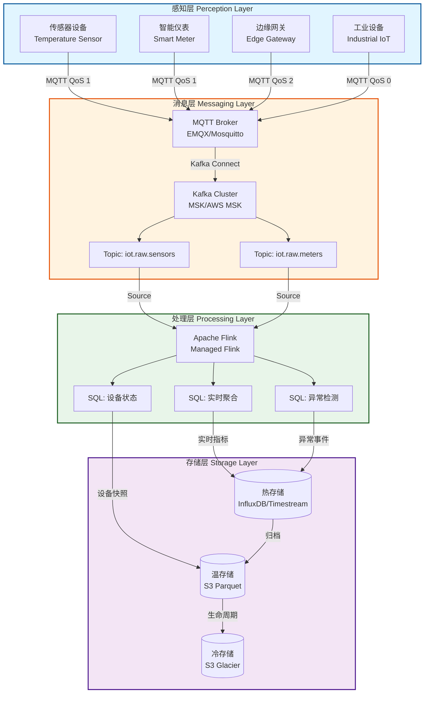
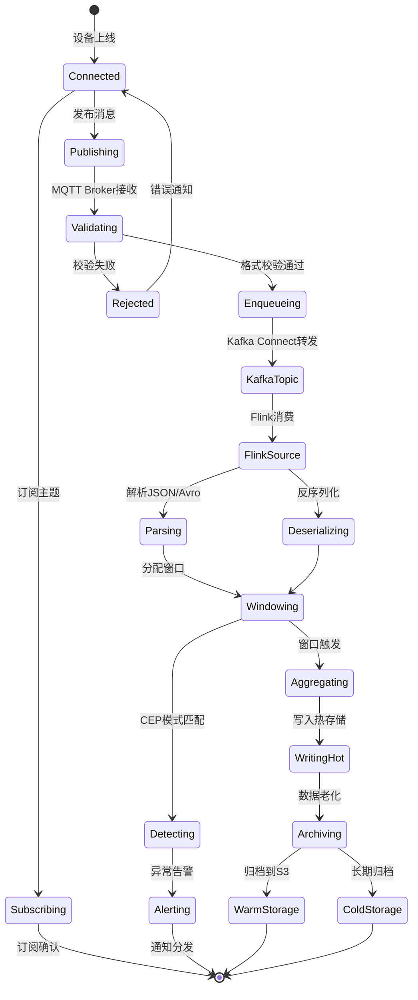

# Flink IoT 基础与架构设计

> **所属阶段**: Flink-IoT-Authority-Alignment/Phase-1-Architecture  
> **前置依赖**: [Flink SQL 基础](../Phase-0-Prerequisites/01-flink-sql-fundamentals.md), [AWS 托管服务概述](../Phase-0-Prerequisites/02-aws-managed-services-overview.md)  
> **形式化等级**: L4 (工程严格性)  
> **对标来源**: Streamkap Architecture[^1], Conduktor IoT Platform[^2], AWS IoT Reference Architecture[^3]

---

## 1. 概念定义 (Definitions)

本节建立Flink IoT系统的形式化基础，定义核心概念及其数学语义。

### 1.1 IoT设备与事件

**定义 1.1 (IoT设备)** [Def-F-IOT-01-01]

一个**IoT设备** $d$ 是一个三元组 $d = (id_d, T_d, S_d)$，其中：
- $id_d \in \mathcal{D}$ 是全局唯一设备标识符
- $T_d \subseteq \mathcal{T}$ 是设备支持的数据类型集合
- $S_d: \mathbb{T} \rightarrow \mathcal{V}$ 是设备状态函数，将时间戳映射到状态值

**直观解释**: IoT设备是物理世界中的传感器、执行器或网关，具有唯一身份、能力描述和随时间变化的状态。

### 1.2 设备事件流

**定义 1.2 (设备事件流)** [Def-F-IOT-01-02]

**设备事件流** $\mathcal{E}_d$ 是关于设备 $d$ 的无限事件序列：

$$\mathcal{E}_d = \langle e_1, e_2, e_3, \ldots \rangle$$

其中每个事件 $e_i = (t_i, id_d, payload_i, meta_i)$ 包含：
- $t_i \in \mathbb{T}$: 事件时间戳
- $id_d$: 设备标识符
- $payload_i \in \mathcal{P}$: 传感器读数或状态数据
- $meta_i = (qos_i, retain_i)$: MQTT元数据（QoS等级、保留标志）

事件时间满足单调性：$\forall i < j: t_i \leq t_j$

### 1.3 传感器读数

**定义 1.3 (传感器读数)** [Def-F-IOT-01-03]

**传感器读数** $r$ 是一个五元组：

$$r = (sensor\_id, metric, value, unit, timestamp)$$

其中：
- $sensor\_id \in \mathcal{S}$: 传感器标识符
- $metric \in \mathcal{M}$: 测量指标名称（如temperature, humidity）
- $value \in \mathbb{R}$: 测量值
- $unit \in \mathcal{U}$: 计量单位
- $timestamp \in \mathbb{T}$: 测量时间

**数据质量属性**: 读数 $r$ 具有**有效性** $valid(r)$ 当且仅当：

$$valid(r) \iff value \in [min_{metric}, max_{metric}] \land timestamp \in [now - \delta_{max}, now]$$

### 1.4 IoT数据流

**定义 1.4 (IoT数据流)** [Def-F-IOT-01-04]

**IoT数据流** $\mathcal{I}$ 是跨设备的事件多集流：

$$\mathcal{I}: \mathbb{T} \rightarrow \mathcal{M}_{fin}(\mathcal{E})$$

其中 $\mathcal{M}_{fin}(\mathcal{E})$ 表示有限事件多集。IoT数据流具有：
- **无序性**: 事件可能乱序到达（$t_{arrival} \neq t_{event}$）
- **不完整性**: 允许数据丢失（QoS 0）或延迟
- **高基数**: 设备数量 $|\mathcal{D}|$ 可达百万级
- **时间局部性**: 最近数据访问频率更高

### 1.5 分层数据处理架构

**定义 1.5 (分层IoT架构)** [Def-F-IOT-01-05]

一个**分层IoT数据处理架构** $\mathcal{A}$ 是四层结构：

$$\mathcal{A} = (L_{perception}, L_{messaging}, L_{processing}, L_{storage})$$

各层定义为：
- **感知层** $L_{perception} = \{d \mid d \text{ 是IoT设备}\}$: 物理设备集合
- **消息层** $L_{messaging} = (B, T)$: 消息代理 $B$ 和主题拓扑 $T$
- **处理层** $L_{processing} = (F, \mathcal{Q})$: Flink作业 $F$ 和查询集合 $\mathcal{Q}$
- **存储层** $L_{storage} = (D_{hot}, D_{warm}, D_{cold})$: 三级存储系统

层间连接由**数据流映射** $\phi_{i,j}: L_i \rightarrow L_j$ 定义，满足：

$$\forall i < j: \phi_{i,j}(\mathcal{I}_i) = \mathcal{I}_j$$

---

## 2. 属性推导 (Properties)

### 2.1 事件时间单调性

**引理 2.1 (事件时间局部有序)** [Lemma-F-IOT-01-01]

对于单设备事件流 $\mathcal{E}_d$，若MQTT QoS $\in \{1, 2\}$，则：

$$\forall i < j: t_i \leq t_j \land msg_i \text{ delivered before } msg_j \Rightarrow t_i \leq t_j$$

**证明**: MQTT QoS 1/2保证消息至少一次/恰好一次传递，且TCP连接保持顺序。因此事件时间与传递顺序一致。∎

### 2.2 数据流合并性质

**命题 2.2 (多设备流合并)** [Prop-F-IOT-01-01]

给定 $n$ 个设备事件流 $\mathcal{E}_{d_1}, \ldots, \mathcal{E}_{d_n}$，合并流 $\mathcal{E}_{merged}$ 满足：

$$|\mathcal{E}_{merged}(t_1, t_2)| = \sum_{i=1}^{n} |\mathcal{E}_{d_i}(t_1, t_2)|$$

其中 $\mathcal{E}(t_1, t_2)$ 表示时间区间 $[t_1, t_2]$ 内的事件集合。

**工程意义**: 消息层必须支持水平扩展以处理聚合吞吐量 $\sum_{d \in \mathcal{D}} throughput(d)$。

### 2.3 端到端延迟分解

**命题 2.3 (延迟分层分解)** [Prop-F-IOT-01-02]

端到端延迟 $L_{e2e}$ 可分解为：

$$L_{e2e} = L_{perception} + L_{messaging} + L_{processing} + L_{storage}$$

其中各层延迟定义为：
- $L_{perception} = t_{publish} - t_{measure}$: 设备采样到发布延迟
- $L_{messaging} = t_{kafka} - t_{publish}$: MQTT到Kafka延迟
- $L_{processing} = t_{output} - t_{kafka}$: Flink处理延迟
- $L_{storage} = t_{persist} - t_{output}$: 存储写入延迟

**工程约束**: 实时IoT应用通常要求 $L_{e2e} < 1s$，因此每层需满足：

$$L_{perception} < 100ms, L_{messaging} < 200ms, L_{processing} < 500ms, L_{storage} < 200ms$$

---

## 3. 架构设计 (Architecture Design)

### 3.1 四层参考架构

基于Streamkap的分层模型[^1]和AWS IoT参考架构[^3]，我们定义以下四层架构：

**感知层 (Perception Layer)**
- 负责物理世界数据采集
- 协议：MQTT 3.1/3.1.1/5.0, CoAP, HTTP/2
- 设备类型：传感器、执行器、边缘网关

**消息层 (Messaging Layer)**
- 负责设备到云端的消息传递
- 组件：MQTT Broker, Kafka Cluster
- 功能：协议转换、消息路由、背压处理

**处理层 (Processing Layer)**
- 负责实时流处理与分析
- 引擎：Apache Flink
- 能力：窗口聚合、CEP、模式匹配、ML推理

**存储层 (Storage Layer)**
- 负责时序数据持久化
- 类型：热存储(InfluxDB/Timestream)、温存储(S3)、冷存储(Glacier)

### 3.2 架构层次图

以下Mermaid图展示了四层架构的数据流映射关系：

### 3.3 数据流映射关系

| 层级 | 输入数据流 | 输出数据流 | 关键技术 | SLA要求 |
|------|-----------|-----------|----------|---------|
| 感知层 | 物理信号 | MQTT消息 | MQTT 5.0, CoAP | 可用性 99.9% |
| 消息层 | MQTT消息 | Kafka记录 | Kafka Connect, MQTT Broker | 吞吐量 100K msg/s |
| 处理层 | Kafka记录 | 聚合结果 | Flink SQL, CEP | 延迟 < 500ms |
| 存储层 | 聚合结果 | 查询响应 | InfluxDB, S3 | 写入 50K points/s |

---

## 4. 技术选型 (Technology Selection)

基于Conduktor的技术选型建议[^2]和实际生产经验，本节对比关键组件。

### 4.1 MQTT Broker 对比

| 特性 | EMQX | Mosquitto | HiveMQ | AWS IoT Core |
|------|------|-----------|--------|--------------|
| **开源许可** | Apache 2.0 | EPL/EDL | 商业/开源 | AWS托管 |
| **最大连接** | 1000万+ | 10万 | 1000万+ | 无限 |
| **集群支持** | 原生 | 不支持 | 原生 | 托管 |
| **MQTT 5.0** | 完整支持 | 部分支持 | 完整支持 | 完整支持 |
| **规则引擎** | 内置 | 无 | 内置 | AWS规则 |
| **云原生** | 支持 | 有限 | 支持 | 完全托管 |
| **适用场景** | 大规模生产 | 边缘/测试 | 企业级 | AWS生态 |

**选型建议**:
- **生产环境**: EMQX（开源、高性能、集群原生）
- **边缘场景**: Mosquitto（轻量、资源占用低）
- **AWS环境**: AWS IoT Core（免运维、与MSK/Flink集成）

### 4.2 消息队列对比

| 特性 | Apache Kafka | AWS MSK | RabbitMQ | Pulsar |
|------|-------------|---------|----------|--------|
| **吞吐量** | 100万+ msg/s | 100万+ msg/s | 10万 msg/s | 100万+ msg/s |
| **延迟** | < 10ms | < 10ms | < 1ms | < 5ms |
| **持久化** | 磁盘 | 磁盘 | 内存/磁盘 | 磁盘/分层 |
| **分区机制** | 主题分区 | 主题分区 | 队列 | 主题分区 |
| **Flink集成** | 原生Source/Sink | 原生Source/Sink | 连接器 | 连接器 |
| **运维成本** | 高 | 中（托管） | 中 | 中 |

**选型建议**:
- **AWS生产**: MSK Serverless（自动扩缩容）
- **多云/混合**: Apache Kafka（社区生态成熟）
- **低延迟优先**: RabbitMQ（复杂路由场景）

### 4.3 时序数据库对比

| 特性 | InfluxDB | TimescaleDB | AWS Timestream | ClickHouse |
|------|----------|-------------|----------------|------------|
| **数据模型** | 标签+字段 | SQL扩展 | 维度+度量 | 列式 |
| **写入性能** | 50万点/s | 30万点/s | 100万点/s | 100万点/s |
| **查询语言** | InfluxQL/Flux | SQL | SQL | SQL |
| **压缩比** | 10:1 | 7:1 | 10:1 | 10:1 |
| ** retention** | 自动 | 手动策略 | 自动 | 手动 |
| **Flink集成** | 连接器 | JDBC | 原生 | JDBC |

**选型建议**:
- **AWS环境**: Timestream（无服务器、自动分层）
- **开源优先**: InfluxDB IOx（新存储引擎）
- **SQL兼容**: TimescaleDB（PostgreSQL生态）

---

## 5. 数据流模型 (Data Flow Model)

### 5.1 IoT数据流的形式化定义

基于Dataflow模型[^4]的扩展，我们定义IoT数据流如下：

**定义 5.1 (IoT数据流图)**

一个**IoT数据流图** $G = (V, E, \lambda, \tau)$ 包含：
- $V = S \cup O \cup T$: 顶点集合（Source、Operator、Sink）
- $E \subseteq V \times V$: 有向边（数据流通道）
- $\lambda: E \rightarrow \mathcal{T}$: 边标签函数（数据类型）
- $\tau: V \rightarrow \mathbb{T}$: 时间属性函数（处理时间/事件时间）

**数据流转换算子**:

| 算子 | 类型 | 语义 | Flink对应 |
|------|------|------|-----------|
| $Map(f)$ | 1:1 | $e \mapsto f(e)$ | `SELECT f(field)` |
| $Filter(p)$ | N:M | $\{e \mid p(e)\}$ | `WHERE predicate` |
| $Window(w, t)$ | N:1 | $\oplus_{e \in w} e$ | `GROUP BY TUMBLE/HOP` |
| $Join(K)$ | N:M | $\bowtie_K$ | `JOIN ... ON` |
| $Aggregate(a)$ | N:1 | $a(values)$ | `AGG_FUNC(...)` |

### 5.2 设备事件处理流程

以下状态图展示了设备事件的处理生命周期：

### 5.3 数据质量与Watermark

**定义 5.2 (IoT Watermark)**

IoT数据流的**Watermark** $w(t)$ 是事件时间的下界估计：

$$w(t) = \max_{e \in \mathcal{E}_{observed}} t_e - \delta_{max}$$

其中 $\delta_{max}$ 是最大乱序延迟预期。

**Watermark传播规则**:
- 单输入算子：输出Watermark = 输入Watermark
- 多输入算子（Join/Union）：输出Watermark = $\min(w_1, w_2, \ldots, w_n)$

**IoT场景优化**:
- 传感器级别Watermark：按设备ID分区计算
- 分层Watermark：感知层、处理层分别维护

