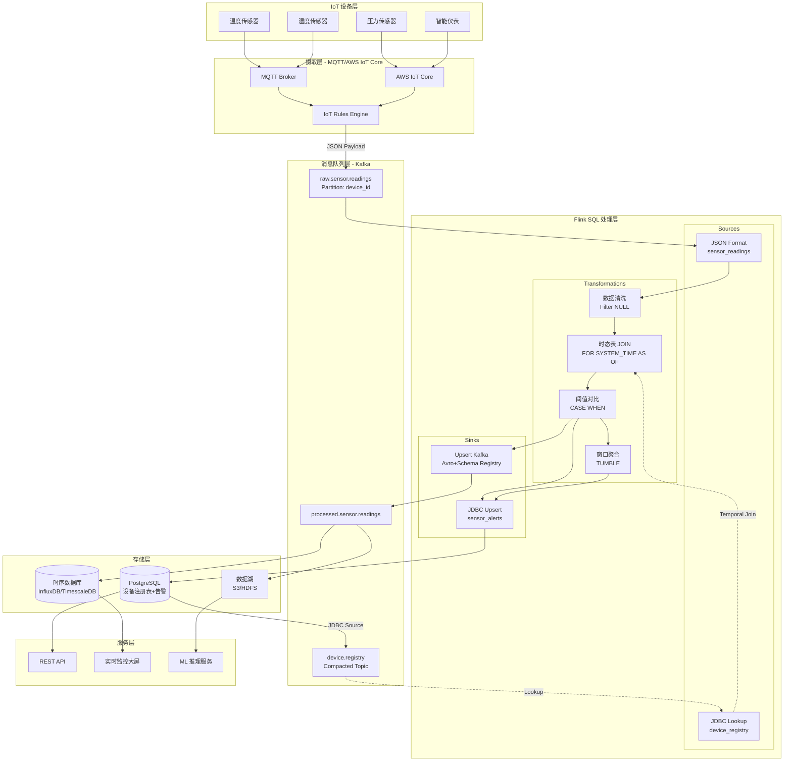
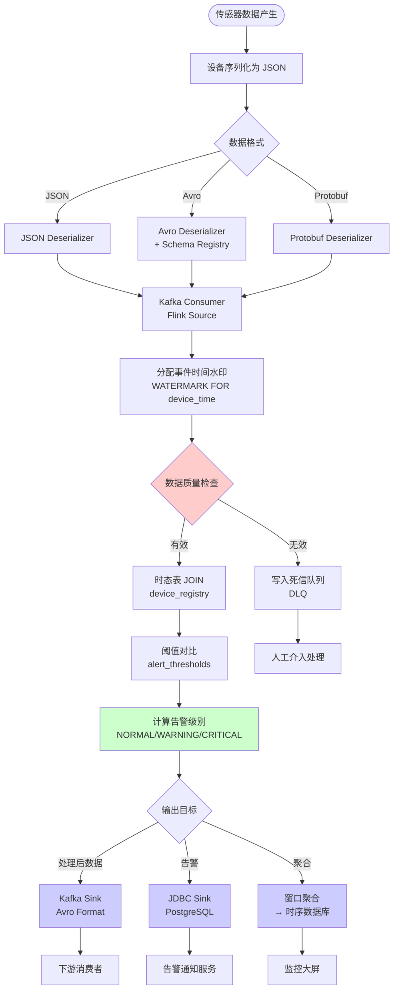

# Flink IoT 数据摄取与转换

> **所属阶段**: Flink-IoT-Authority-Alignment/Phase-1-Architecture
> **前置依赖**: [01-flink-iot-architecture-overview.md](../01-flink-iot-architecture-overview.md) | [Flink SQL基础](../../../Flink/1.基础概念与架构/1.1-flink-architecture-overview.md)
> **形式化等级**: L4 (工程实践+形式化规格)
> **对标来源**: AWS IoT Demo, Streamkap, Apache Kafka Connect
> **技术栈**: Flink SQL 1.18+, Apache Kafka 3.x, Confluent Schema Registry, AWS IoT Core

---

## 目录

- [Flink IoT 数据摄取与转换](#flink-iot-数据摄取与转换)
  - [目录](#目录)
  - [1. 概念定义 (Definitions)](#1-概念定义-definitions)
    - [1.1 Source Connector 定义](#11-source-connector-定义)
    - [1.2 Data Format 定义](#12-data-format-定义)
    - [1.3 Schema Registry 定义](#13-schema-registry-定义)
    - [1.4 水印策略定义](#14-水印策略定义)
    - [1.5 数据富化 (Data Enrichment) 定义](#15-数据富化-data-enrichment-定义)
  - [2. Kafka 集成: Flink SQL Kafka Connector](#2-kafka-集成-flink-sql-kafka-connector)
    - [2.1 Connector 配置全景](#21-connector-配置全景)
    - [2.2 Source 配置详解](#22-source-配置详解)
    - [2.3 Sink 配置详解](#23-sink-配置详解)
  - [3. 数据格式处理](#3-数据格式处理)
    - [3.1 JSON 格式处理](#31-json-格式处理)
    - [3.2 Avro 格式处理](#32-avro-格式处理)
    - [3.3 Protobuf 格式处理](#33-protobuf-格式处理)
    - [3.4 格式对比与选型](#34-格式对比与选型)
  - [4. Schema 管理: Schema Registry 集成](#4-schema-管理-schema-registry-集成)
    - [4.1 Confluent Schema Registry 集成](#41-confluent-schema-registry-集成)
    - [4.2 Schema 演进策略](#42-schema-演进策略)
  - [5. 数据清洗、转换与富化](#5-数据清洗转换与富化)
    - [5.1 数据清洗](#51-数据清洗)
    - [5.2 数据转换](#52-数据转换)
    - [5.3 设备注册表 (Device Registry)](#53-设备注册表-device-registry)
    - [5.4 数据富化 JOIN](#54-数据富化-join)
  - [6. 实例验证](#6-实例验证)
    - [6.1 完整 SQL 示例汇总](#61-完整-sql-示例汇总)
    - [6.2 数据摄取流程的形式化描述](#62-数据摄取流程的形式化描述)
  - [7. 可视化](#7-可视化)
    - [7.1 IoT 数据摄取架构图](#71-iot-数据摄取架构图)
    - [7.2 数据流转换流程图](#72-数据流转换流程图)
  - [8. 引用参考](#8-引用参考)
  - [附录 A: 配置速查表](#附录-a-配置速查表)

## 1. 概念定义 (Definitions)

### 1.1 Source Connector 定义

**定义 1.1 (Source Connector - Def-F-IOT-02-01)**
Source Connector 是 Flink 与外部数据系统之间的**有界或无界数据流桥接组件**，负责将外部系统的数据记录转换为 Flink 内部的 `RowData` 表示，并提供**exactly-once 语义保证**的读取能力。

形式化地，设外部数据源为 $S$，Flink 内部流为 $F$，Source Connector 定义为一个映射函数：

$$\Phi_{source}: S \times C_{config} \rightarrow F_{DataStream}$$

其中 $C_{config}$ 包含连接配置、序列化格式、水印策略等参数。

```sql
-- Source Connector 基础示例 (必须包含)
CREATE TABLE sensor_readings (
  device_id STRING,
  sensor_type STRING,
  reading_value DOUBLE,
  device_time TIMESTAMP(3),
  -- 定义事件时间水印
  WATERMARK FOR device_time AS device_time - INTERVAL '30' SECOND
) WITH (
  'connector' = 'kafka',
  'topic' = 'sensor-readings',
  'properties.bootstrap.servers' = 'kafka:9092',
  'properties.group.id' = 'flink-iot-consumer',
  'scan.startup.mode' = 'earliest-offset',
  'format' = 'json',
  'json.fail-on-missing-field' = 'false',
  'json.ignore-parse-errors' = 'true'
);
```

### 1.2 Data Format 定义

**定义 1.2 (Data Format - Def-F-IOT-02-02)**
Data Format 定义了数据记录在**网络传输层面**的字节表示与**逻辑层面**的结构化数据之间的双向转换规则。对于 IoT 场景，格式需满足：

1. **序列化效率**: 低带宽环境下的紧凑编码
2. **模式演进**: 支持向后/向前兼容的 schema 变更
3. **类型安全**: 编译期或运行时的类型验证

形式化地，设字节序列为 $B$，结构化记录为 $R$，格式 $F$ 定义为：

$$F = (Serialize: R \rightarrow B, \quad Deserialize: B \rightarrow R \cup \{\bot\})$$

### 1.3 Schema Registry 定义

**定义 1.3 (Schema Registry - Def-F-IOT-02-03)**
Schema Registry 是一个**集中式元数据管理服务**，维护数据格式的版本化规范，提供运行时的 schema 解析与兼容性验证。

形式化地，Schema Registry $SR$ 是一个三元组：

$$SR = (Schemas, \prec_{compat}, Resolve)$$

其中：

- $Schemas = \{s_1, s_2, ..., s_n\}$ 是 schema 版本集合
- $\prec_{compat} \subseteq Schemas \times Schemas$ 是兼容性偏序关系
- $Resolve: Topic \times Version \rightarrow Schema$ 是解析函数

### 1.4 水印策略定义

**定义 1.4 (Watermark Strategy - Def-F-IOT-02-04)**
在 IoT 数据摄取中，水印策略 $W$ 是一个单调递增的时间戳函数，用于标记**事件时间**的推进进度：

$$W: ProcessingTime \rightarrow EventTime \cup \{-\infty\}$$

对于传感器数据，通常采用**有界延迟**策略：

$$W(t_{proc}) = \max\{t_{event} \mid record \in Buffer\} - \delta_{maxOutOfOrder}$$

其中 $\delta_{maxOutOfOrder}$ 是允许的最大乱序时间（通常为 30s-5min）。

### 1.5 数据富化 (Data Enrichment) 定义

**定义 1.5 (Data Enrichment - Def-F-IOT-02-05)**
数据富化是将**原始数据流** $D_{raw}$ 与**维度数据** $D_{dim}$ 通过连接操作 $Join_{\theta}$ 组合，生成增强数据流 $D_{enriched}$ 的过程：

$$D_{enriched} = D_{raw} \Join_{\theta} D_{dim}$$

在 Flink SQL 中，维度表通常使用 `FOR SYSTEM_TIME AS OF` 语法实现时态表连接，支持处理维度数据的历史变更。

---

## 2. Kafka 集成: Flink SQL Kafka Connector

### 2.1 Connector 配置全景

Flink Kafka Connector 提供了丰富的配置选项，支持从 Kafka 摄取 IoT 数据的各种场景。

**表 2.1: Kafka Connector 核心配置参数**

| 配置项 | 必需 | 默认值 | 说明 | 典型 IoT 场景值 |
|--------|------|--------|------|-----------------|
| `connector` | 是 | - | 连接器类型 | `kafka` |
| `topic` | 条件 | - | 订阅主题（支持单主题或列表） | `sensor-readings` |
| `topic-pattern` | 条件 | - | 主题正则表达式（动态发现） | `iot\.sensors\..*` |
| `properties.bootstrap.servers` | 是 | - | Kafka Broker 地址 | `kafka:9092` |
| `properties.group.id` | 否 | 自动生成 | 消费者组 ID | `flink-iot-group` |
| `scan.startup.mode` | 否 | `group-offsets` | 启动模式 | `earliest-offset` / `latest-offset` / `timestamp` |
| `scan.startup.timestamp-millis` | 条件 | - | 启动时间戳（毫秒） | `1704067200000` |
| `format` | 是 | - | 序列化格式 | `json` / `avro` / `protobuf` / `debezium-json` |

### 2.2 Source 配置详解

```sql
-- AWS IoT Demo 风格的完整 Source 配置
CREATE TABLE iot_sensor_events (
  -- 设备标识维度
  device_id STRING,
  sensor_type STRING,
  location_id STRING,

  -- 传感器读数
  temperature DOUBLE,
  humidity DOUBLE,
  pressure DOUBLE,
  vibration ARRAY<DOUBLE>, -- 振动频谱数据

  -- 元数据
  event_time TIMESTAMP(3),
  processing_time AS PROCTIME(),

  -- 事件时间水印（参考 Streamkap 实践）
  WATERMARK FOR event_time AS event_time - INTERVAL '1' MINUTE
) WITH (
  'connector' = 'kafka',
  'topic' = 'iot.sensor.events',
  'properties.bootstrap.servers' = '${KAFKA_BROKER}',
  'properties.group.id' = 'flink-iot-processor',
  'properties.security.protocol' = 'SASL_SSL',
  'properties.sasl.mechanism' = 'PLAIN',
  'properties.sasl.jaas.config' = '${KAFKA_SASL_CONFIG}',

  -- 启动模式：从最新位置开始（生产环境常用）
  'scan.startup.mode' = 'latest-offset',

  -- 容错配置
  'scan.commit.offsets-on-checkpoint' = 'true',
  'scan.watermark.alignment.group' = 'iot-group',
  'scan.watermark.alignment.max-drift' = '1 min',

  -- JSON 格式配置
  'format' = 'json',
  'json.fail-on-missing-field' = 'false',
  'json.ignore-parse-errors' = 'true',
  'json.timestamp-format.standard' = 'ISO-8601'
);
```

### 2.3 Sink 配置详解

```sql
-- 处理后数据输出到下游 Kafka
CREATE TABLE processed_sensor_alerts (
  device_id STRING,
  alert_type STRING,
  severity STRING,
  alert_message STRING,
  event_time TIMESTAMP(3),

  -- 分区键（确保相同设备的数据进入同一分区）
  PRIMARY KEY (device_id, event_time) NOT ENFORCED
) WITH (
  'connector' = 'kafka',
  'topic' = 'iot.sensor.alerts',
  'properties.bootstrap.servers' = '${KAFKA_BROKER}',

  -- Sink 关键配置
  'sink.delivery-guarantee' = 'exactly-once',
  'sink.transactional-id-prefix' = 'flink-iot-tx',
  'sink.partitioner' = 'fixed', -- 或 'round-robin', 'murmur'

  -- 批量优化
  'sink.buffer-flush.max-rows' = '1000',
  'sink.buffer-flush.interval' = '1s',

  -- Avro 格式输出（带 Schema Registry）
  'format' = 'avro-confluent',
  'avro-confluent.url' = '${SCHEMA_REGISTRY_URL}',
  'avro-confluent.subject' = 'iot.sensor.alerts-value',
  'avro-confluent.ssl.truststore.location' = '${TRUSTSTORE_PATH}'
);
```

---

## 3. 数据格式处理

IoT 场景涉及多种数据格式，Flink SQL 提供了统一的抽象来处理 JSON、Avro 和 Protobuf。

### 3.1 JSON 格式处理

JSON 是 IoT 数据交换中最常用的格式，Flink 提供了灵活的解析选项。

**表 3.1: JSON Format 配置参数对比**

| 配置项 | 默认值 | 说明 | 推荐 IoT 设置 |
|--------|--------|------|---------------|
| `format` | - | 必须设置为 `json` | `json` |
| `json.fail-on-missing-field` | `true` | 缺少字段时是否失败 | `false`（IoT 设备可能缺失字段） |
| `json.ignore-parse-errors` | `false` | 解析错误时是否跳过 | `true`（容错处理） |
| `json.timestamp-format.standard` | `SQL` | 时间戳格式 | `ISO-8601`（标准格式） |
| `json.map-null-key.mode` | `FAIL` | Map 中 null key 的处理 | `DROP` 或 `LITERAL` |
| `json.encode.decimal-as-plain-number` | `false` | Decimal 编码方式 | `true`（避免科学计数法） |

```sql
-- SQL 示例 1: JSON Source 表定义
CREATE TABLE json_sensor_data (
  -- 标准字段
  device_id STRING,
  timestamp TIMESTAMP(3),

  -- 嵌套 JSON 对象映射为 ROW 类型
  readings ROW<
    temperature DOUBLE,
    humidity DOUBLE,
    pressure DOUBLE
  >,

  -- 动态属性映射为 MAP
  metadata MAP<STRING, STRING>,

  -- 数组类型
  tags ARRAY<STRING>,

  WATERMARK FOR timestamp AS timestamp - INTERVAL '30' SECOND
) WITH (
  'connector' = 'kafka',
  'topic' = 'sensor-json-data',
  'properties.bootstrap.servers' = 'kafka:9092',
  'format' = 'json',
  'json.fail-on-missing-field' = 'false',
  'json.ignore-parse-errors' = 'true'
);

-- SQL 示例 2: 嵌套字段访问
SELECT
  device_id,
  readings.temperature AS temp,
  readings.humidity AS humidity,
  metadata['location'] AS location,
  tags[1] AS primary_tag
FROM json_sensor_data;
```

### 3.2 Avro 格式处理

Avro 是 schema 优先的二进制格式，适合带宽敏感的 IoT 场景。

```sql
-- SQL 示例 3: Avro with Confluent Schema Registry
CREATE TABLE avro_sensor_data (
  device_id STRING,
  event_time TIMESTAMP(3),
  temperature DOUBLE,
  humidity DOUBLE,
  status INT
) WITH (
  'connector' = 'kafka',
  'topic' = 'sensor-avro-data',
  'properties.bootstrap.servers' = 'kafka:9092',
  'format' = 'avro-confluent',
  'avro-confluent.url' = 'http://schema-registry:8081',
  'avro-confluent.subject' = 'sensor-data-value',
  -- 自动获取最新 schema
  'avro-confluent.schema' = 'latest'
);

-- SQL 示例 4: 原生 Avro（内联 Schema）
CREATE TABLE avro_native_sensor (
  device_id STRING,
  sensor_value DOUBLE,
  event_time TIMESTAMP(3)
) WITH (
  'connector' = 'kafka',
  'topic' = 'sensor-native-avro',
  'properties.bootstrap.servers' = 'kafka:9092',
  'format' = 'avro',
  -- 内联 Avro Schema（适用于无 Schema Registry 场景）
  'avro.schema' = '{
    "type": "record",
    "name": "SensorReading",
    "fields": [
      {"name": "device_id", "type": "string"},
      {"name": "sensor_value", "type": "double"},
      {"name": "event_time", "type": "long", "logicalType": "timestamp-millis"}
    ]
  }'
);
```

### 3.3 Protobuf 格式处理

Protobuf 提供高效的序列化和强类型保证，适合性能关键型 IoT 应用。

```sql
-- SQL 示例 5: Protobuf 格式（需预定义 proto 文件）
CREATE TABLE protobuf_sensor_data (
  device_id STRING,
  reading ROW<
    value DOUBLE,
    unit STRING,
    quality INT
  >,
  location ROW<
    latitude DOUBLE,
    longitude DOUBLE,
    altitude DOUBLE
  >,
  event_time TIMESTAMP(3)
) WITH (
  'connector' = 'kafka',
  'topic' = 'sensor-protobuf-data',
  'properties.bootstrap.servers' = 'kafka:9092',
  'format' = 'protobuf',
  'protobuf.message-class-name' = 'com.iot.SensorReading',
  'protobuf.ignore-default-values' = 'false',
  'protobuf.ignore-parse-errors' = 'true'
);

-- SQL 示例 6: Protobuf 与 Schema Registry 集成
CREATE TABLE protobuf_sr_sensor (
  device_id STRING,
  metrics MAP<STRING, DOUBLE>,
  event_time TIMESTAMP(3)
) WITH (
  'connector' = 'kafka',
  'topic' = 'sensor-protobuf-sr',
  'properties.bootstrap.servers' = 'kafka:9092',
  'format' = 'protobuf-confluent',
  'protobuf-confluent.url' = 'http://schema-registry:8081',
  'protobuf-confluent.subject' = 'sensor-metrics-value',
  'protobuf-confluent.schema' = 'latest'
);
```

### 3.4 格式对比与选型

**表 3.2: IoT 数据格式对比矩阵**

| 特性 | JSON | Avro | Protobuf |
|------|------|------|----------|
| **序列化大小** | 大（文本格式） | 小（二进制） | 极小（二进制） |
| **解析速度** | 慢 | 快 | 极快 |
| **Schema 演进** | 灵活（无 schema） | 内置支持 | 内置支持 |
| **Schema Registry** | 可选 | 推荐 | 推荐 |
| **带宽占用** | 高 | 低 | 极低 |
| **可读性** | 优秀 | 差（需工具） | 差（需工具） |
| **CPU 开销** | 高 | 低 | 极低 |
| **适用场景** | 开发/调试 | 生产通用 | 高频采集 |

**选型建议**：

- **开发环境**: JSON（便于调试）
- **生产通用**: Avro（平衡性能与灵活性）
- **高频采集**: Protobuf（每秒万级数据点）

---

## 4. Schema 管理: Schema Registry 集成

### 4.1 Confluent Schema Registry 集成

Schema Registry 是管理 Avro/Protobuf/JSON Schema 的中心化服务。

```sql
-- SQL 示例 7: 完整的 Schema Registry 配置
CREATE TABLE sr_integrated_sensor (
  device_id STRING,
  event_time TIMESTAMP(3),
  readings ROW<
    temperature DOUBLE,
    humidity DOUBLE,
    pressure DOUBLE
  >,
  metadata MAP<STRING, STRING>
) WITH (
  'connector' = 'kafka',
  'topic' = 'sensor-sr-data',
  'properties.bootstrap.servers' = 'kafka:9092',

  -- Avro Confluent 格式
  'format' = 'avro-confluent',
  'avro-confluent.url' = 'http://schema-registry:8081',
  'avro-confluent.subject' = 'sensor-data-value',

  -- Schema 版本策略
  'avro-confluent.schema' = 'latest', -- 或指定版本号 '1'

  -- 兼容性检查
  'avro-confluent.use-schema-registry-avro-deserializer' = 'true',

  -- SSL/TLS 配置（生产环境）
  'avro-confluent.ssl.truststore.location' = '/path/to/truststore.jks',
  'avro-confluent.ssl.truststore.password' = '${TRUSTSTORE_PASSWORD}',

  -- 认证配置
  'avro-confluent.basic-auth.credentials-source' = 'USER_INFO',
  'avro-confluent.basic-auth.user-info' = '${SR_USERNAME}:${SR_PASSWORD}'
);
```

### 4.2 Schema 演进策略

**定义 4.1 (Schema 兼容性 - Def-F-IOT-02-06)**
Schema 兼容性定义了新旧 schema 版本之间的可互操作性约束。设旧 schema 为 $S_{old}$，新 schema 为 $S_{new}$：

- **向后兼容 (Backward)**: $Deserialize_{S_{old}}(Serialize_{S_{new}}(data)) \neq \bot$
- **向前兼容 (Forward)**: $Deserialize_{S_{new}}(Serialize_{S_{old}}(data)) \neq \bot$
- **全兼容 (Full)**: 同时满足向后和向前兼容

```sql
-- SQL 示例 8: 处理 Schema 演进的容错读取
CREATE TABLE evolved_sensor_data (
  -- 核心字段（所有版本必须存在）
  device_id STRING,
  event_time TIMESTAMP(3),

  -- 可选字段（新版本添加）
  temperature DOUBLE,
  humidity DOUBLE,
  -- 使用默认值处理缺失字段
  pressure DOUBLE,

  -- 新增字段（v2 schema）
  battery_level DOUBLE,
  signal_strength INT
) WITH (
  'connector' = 'kafka',
  'topic' = 'sensor-evolved',
  'properties.bootstrap.servers' = 'kafka:9092',
  'format' = 'avro-confluent',
  'avro-confluent.url' = 'http://schema-registry:8081',

  -- 处理 schema 不匹配的容错配置
  'avro-confluent.schema' = '1', -- 固定使用 v1 schema 进行解析

  -- Flink 层面的 NULL 处理
  'null-handling-strategy' = 'NULL_VALUES' -- 缺失字段设为 NULL
);

-- 使用 COALESCE 处理可能的 NULL 值
SELECT
  device_id,
  event_time,
  COALESCE(temperature, 0.0) AS temperature,
  COALESCE(battery_level, 100.0) AS battery_level
FROM evolved_sensor_data;
```

---

## 5. 数据清洗、转换与富化

### 5.1 数据清洗

IoT 数据常包含噪声、缺失值和异常值，需要进行清洗处理。

```sql
-- SQL 示例 9: 数据清洗视图（过滤无效数据）
CREATE VIEW cleaned_sensor_data AS
SELECT
  device_id,
  sensor_type,
  reading_value,
  device_time,
  -- 添加清洗标记
  CASE
    WHEN reading_value IS NULL THEN 'NULL_VALUE'
    WHEN reading_value < -100 OR reading_value > 100 THEN 'OUT_OF_RANGE'
    WHEN device_time > CURRENT_TIMESTAMP THEN 'FUTURE_TIMESTAMP'
    ELSE 'VALID'
  END AS quality_flag
FROM sensor_readings
WHERE
  -- 过滤条件
  device_id IS NOT NULL
  AND sensor_type IS NOT NULL
  AND device_time IS NOT NULL
  AND device_time > TIMESTAMP '2024-01-01 00:00:00'
  AND reading_value BETWEEN -1000 AND 1000;

-- 仅保留有效数据
CREATE VIEW valid_sensor_readings AS
SELECT * FROM cleaned_sensor_data
WHERE quality_flag = 'VALID';
```

### 5.2 数据转换

```sql
-- SQL 示例 10: 数据转换（单位转换、类型转换）
CREATE VIEW transformed_sensor_data AS
SELECT
  device_id,
  sensor_type,

  -- 单位转换：摄氏度转华氏度
  CASE sensor_type
    WHEN 'temperature_c' THEN reading_value * 9/5 + 32
    ELSE reading_value
  END AS reading_value_f,

  -- 时间格式化
  DATE_FORMAT(device_time, 'yyyy-MM-dd HH:mm:ss') AS formatted_time,

  -- 提取时间维度（用于聚合）
  YEAR(device_time) AS year,
  MONTH(device_time) AS month,
  DAYOFMONTH(device_time) AS day,
  HOUR(device_time) AS hour,

  -- 数据标准化
  ROUND(reading_value, 2) AS normalized_value
FROM valid_sensor_readings;
```

### 5.3 设备注册表 (Device Registry)

```sql
-- SQL 示例 11: 设备注册表（维度表）
CREATE TABLE device_registry (
  device_id STRING,
  device_name STRING,
  device_type STRING,
  location_id STRING,
  facility_id STRING,
  department STRING,
  installation_date DATE,
  calibration_date TIMESTAMP(3),
  status STRING,
  metadata MAP<STRING, STRING>,

  -- 主键定义
  PRIMARY KEY (device_id) NOT ENFORCED
) WITH (
  'connector' = 'jdbc',
  'url' = 'jdbc:postgresql://postgres:5432/iot_registry',
  'table-name' = 'devices',
  'username' = '${DB_USER}',
  'password' = '${DB_PASSWORD}',
  'driver' = 'org.postgresql.Driver',
  'scan.fetch-size' = '1000',
  'lookup.cache.max-rows' = '10000',
  'lookup.cache.ttl' = '10 min'
);

-- 或者使用 Kafka  Compact Topic 作为维度表
CREATE TABLE device_registry_kafka (
  device_id STRING,
  device_info ROW<
    name STRING,
    type STRING,
    location STRING
  >,
  update_time TIMESTAMP(3) METADATA FROM 'value.source.timestamp',
  WATERMARK FOR update_time AS update_time - INTERVAL '5' SECOND,
  PRIMARY KEY (device_id) NOT ENFORCED
) WITH (
  'connector' = 'upsert-kafka',
  'topic' = 'device-registry',
  'properties.bootstrap.servers' = 'kafka:9092',
  'key.format' = 'json',
  'value.format' = 'json'
);
```

### 5.4 数据富化 JOIN

```sql
-- SQL 示例 12: 时态表连接实现数据富化
CREATE VIEW enriched_sensor_data AS
SELECT
  -- 原始数据
  s.device_id,
  s.sensor_type,
  s.reading_value,
  s.device_time,

  -- 维度富化
  d.device_name,
  d.device_type,
  d.location_id,
  d.facility_id,
  d.department,

  -- 计算派生字段
  CONCAT(d.facility_id, '-', d.location_id) AS full_location,
  d.metadata['timezone'] AS device_timezone
FROM sensor_readings s
-- 时态表连接：获取设备注册表在事件时间点的状态
LEFT JOIN device_registry FOR SYSTEM_TIME AS OF s.device_time AS d
  ON s.device_id = d.device_id;

-- SQL 示例 13: 多表 JOIN 富化（设备 + 位置 + 阈值）
CREATE TABLE location_dim (
  location_id STRING,
  location_name STRING,
  geo_region STRING,
  timezone STRING,
  PRIMARY KEY (location_id) NOT ENFORCED
) WITH (
  'connector' = 'jdbc',
  'url' = 'jdbc:postgresql://postgres:5432/iot_registry',
  'table-name' = 'locations',
  'username' = '${DB_USER}',
  'password' = '${DB_PASSWORD}'
);

CREATE TABLE threshold_config (
  device_type STRING,
  sensor_type STRING,
  min_threshold DOUBLE,
  max_threshold DOUBLE,
  critical_threshold DOUBLE,
  PRIMARY KEY (device_type, sensor_type) NOT ENFORCED
) WITH (
  'connector' = 'jdbc',
  'url' = 'jdbc:postgresql://postgres:5432/iot_registry',
  'table-name' = 'thresholds',
  'username' = '${DB_USER}',
  'password' = '${DB_PASSWORD}'
);

-- 完整富化查询
CREATE VIEW fully_enriched_data AS
SELECT
  s.device_id,
  s.device_time,
  s.sensor_type,
  s.reading_value,

  -- 设备信息
  d.device_name,
  d.device_type,

  -- 位置信息
  l.location_name,
  l.geo_region,
  l.timezone,

  -- 阈值对比
  t.min_threshold,
  t.max_threshold,
  t.critical_threshold,

  -- 告警判断
  CASE
    WHEN s.reading_value > t.critical_threshold THEN 'CRITICAL'
    WHEN s.reading_value > t.max_threshold THEN 'WARNING_HIGH'
    WHEN s.reading_value < t.min_threshold THEN 'WARNING_LOW'
    ELSE 'NORMAL'
  END AS alert_level
FROM sensor_readings s
LEFT JOIN device_registry FOR SYSTEM_TIME AS OF s.device_time AS d
  ON s.device_id = d.device_id
LEFT JOIN location_dim FOR SYSTEM_TIME AS OF s.device_time AS l
  ON d.location_id = l.location_id
LEFT JOIN threshold_config FOR SYSTEM_TIME AS OF s.device_time AS t
  ON d.device_type = t.device_type AND s.sensor_type = t.sensor_type;
```

---

## 6. 实例验证

### 6.1 完整 SQL 示例汇总

以下 SQL 示例展示了从数据摄取到清洗、富化、输出的完整流程，对标 Streamkap 和 AWS IoT Demo 的最佳实践。

```sql
-- ============================================================
-- SQL 示例 14: 完整的 IoT 数据处理 Pipeline（Streamkap 风格）
-- ============================================================

-- 1. 创建 Source 表（传感器原始数据）
CREATE TABLE raw_sensor_readings (
  device_id STRING,
  sensor_type STRING,
  reading_value DOUBLE,
  unit STRING,
  device_time TIMESTAMP(3),
  raw_payload STRING, -- 保留原始数据用于调试
  WATERMARK FOR device_time AS device_time - INTERVAL '30' SECOND
) WITH (
  'connector' = 'kafka',
  'topic' = 'raw.sensor.readings',
  'properties.bootstrap.servers' = 'kafka:9092',
  'properties.group.id' = 'flink-iot-processor',
  'scan.startup.mode' = 'earliest-offset',
  'format' = 'json',
  'json.fail-on-missing-field' = 'false',
  'json.ignore-parse-errors' = 'true'
);

-- 2. 创建设备注册表（维度表）
CREATE TABLE device_metadata (
  device_id STRING,
  device_name STRING,
  device_category STRING,
  location STRING,
  facility STRING,
  timezone STRING,
  calibration_offset DOUBLE,
  PRIMARY KEY (device_id) NOT ENFORCED
) WITH (
  'connector' = 'jdbc',
  'url' = 'jdbc:postgresql://postgres:5432/iot_db',
  'table-name' = 'device_metadata',
  'username' = 'flink',
  'password' = 'flink123',
  'lookup.cache.max-rows' = '5000',
  'lookup.cache.ttl' = '10 min'
);

-- 3. 创建阈值配置表
CREATE TABLE alert_thresholds (
  sensor_type STRING,
  min_value DOUBLE,
  max_value DOUBLE,
  critical_min DOUBLE,
  critical_max DOUBLE,
  PRIMARY KEY (sensor_type) NOT ENFORCED
) WITH (
  'connector' = 'jdbc',
  'url' = 'jdbc:postgresql://postgres:5432/iot_db',
  'table-name' = 'alert_thresholds',
  'username' = 'flink',
  'password' = 'flink123'
);

-- 4. 数据清洗与验证视图
CREATE VIEW cleaned_readings AS
SELECT
  r.device_id,
  r.sensor_type,
  r.reading_value,
  r.unit,
  r.device_time,
  r.raw_payload,
  -- 数据质量评分
  CASE
    WHEN r.reading_value IS NULL THEN 0
    WHEN r.device_time > CURRENT_TIMESTAMP THEN 0
    WHEN r.device_time < TIMESTAMP '2020-01-01' THEN 0
    ELSE 100
  END AS data_quality_score
FROM raw_sensor_readings r
WHERE r.device_id IS NOT NULL
  AND r.sensor_type IS NOT NULL;

-- 5. 富化数据视图
CREATE VIEW enriched_readings AS
SELECT
  c.device_id,
  c.sensor_type,
  c.reading_value,
  c.unit,
  c.device_time,
  c.data_quality_score,

  -- 设备富化
  d.device_name,
  d.device_category,
  d.location,
  d.facility,
  d.timezone,
  -- 应用校准偏移
  c.reading_value + COALESCE(d.calibration_offset, 0) AS calibrated_value,

  -- 阈值对比
  t.min_value,
  t.max_value,
  t.critical_min,
  t.critical_max,

  -- 告警级别计算
  CASE
    WHEN c.reading_value < t.critical_min THEN 'CRITICAL_LOW'
    WHEN c.reading_value > t.critical_max THEN 'CRITICAL_HIGH'
    WHEN c.reading_value < t.min_value THEN 'WARNING_LOW'
    WHEN c.reading_value > t.max_value THEN 'WARNING_HIGH'
    ELSE 'NORMAL'
  END AS alert_level,

  -- 处理时间
  PROCTIME() AS processing_time
FROM cleaned_readings c
LEFT JOIN device_metadata FOR SYSTEM_TIME AS OF c.device_time AS d
  ON c.device_id = d.device_id
LEFT JOIN alert_thresholds FOR SYSTEM_TIME AS OF c.device_time AS t
  ON c.sensor_type = t.sensor_type
WHERE c.data_quality_score = 100;

-- 6. 创建 Sink 表（处理后数据）
CREATE TABLE processed_readings (
  device_id STRING,
  sensor_type STRING,
  reading_value DOUBLE,
  calibrated_value DOUBLE,
  unit STRING,
  device_time TIMESTAMP(3),
  device_name STRING,
  location STRING,
  facility STRING,
  alert_level STRING,
  processing_time TIMESTAMP(3),
  PRIMARY KEY (device_id, device_time) NOT ENFORCED
) WITH (
  'connector' = 'upsert-kafka',
  'topic' = 'processed.sensor.readings',
  'properties.bootstrap.servers' = 'kafka:9092',
  'key.format' = 'json',
  'value.format' = 'avro-confluent',
  'value.avro-confluent.url' = 'http://schema-registry:8081',
  'value.avro-confluent.subject' = 'processed-readings-value'
);

-- 7. 创建告警 Sink 表
CREATE TABLE sensor_alerts (
  alert_id STRING,
  device_id STRING,
  sensor_type STRING,
  alert_level STRING,
  reading_value DOUBLE,
  threshold_value DOUBLE,
  alert_message STRING,
  event_time TIMESTAMP(3),
  PRIMARY KEY (alert_id) NOT ENFORCED
) WITH (
  'connector' = 'jdbc',
  'url' = 'jdbc:postgresql://postgres:5432/iot_db',
  'table-name' = 'sensor_alerts',
  'username' = 'flink',
  'password' = 'flink123'
);

-- 8. 插入处理后的数据到 Kafka
INSERT INTO processed_readings
SELECT
  device_id,
  sensor_type,
  reading_value,
  calibrated_value,
  unit,
  device_time,
  device_name,
  location,
  facility,
  alert_level,
  processing_time
FROM enriched_readings;

-- 9. 插入告警到数据库（仅非 NORMAL 级别）
INSERT INTO sensor_alerts
SELECT
  CONCAT(device_id, '-', CAST(device_time AS STRING)) AS alert_id,
  device_id,
  sensor_type,
  alert_level,
  reading_value,
  CASE
    WHEN alert_level LIKE '%LOW' THEN critical_min
    WHEN alert_level LIKE '%HIGH' THEN critical_max
    ELSE NULL
  END AS threshold_value,
  CONCAT(sensor_type, ' ', alert_level, ': ', CAST(reading_value AS STRING)) AS alert_message,
  device_time AS event_time
FROM enriched_readings
WHERE alert_level != 'NORMAL';

-- ============================================================
-- SQL 示例 15: AWS IoT Demo 风格的聚合分析
-- ============================================================

-- 创建聚合输出表
CREATE TABLE sensor_aggregates (
  window_start TIMESTAMP(3),
  window_end TIMESTAMP(3),
  facility STRING,
  sensor_type STRING,
  avg_value DOUBLE,
  min_value DOUBLE,
  max_value DOUBLE,
  reading_count BIGINT,
  PRIMARY KEY (window_start, facility, sensor_type) NOT ENFORCED
) WITH (
  'connector' = 'jdbc',
  'url' = 'jdbc:postgresql://postgres:5432/iot_db',
  'table-name' = 'sensor_aggregates',
  'username' = 'flink',
  'password' = 'flink123'
);

-- 5分钟滚动窗口聚合
INSERT INTO sensor_aggregates
SELECT
  TUMBLE_START(device_time, INTERVAL '5' MINUTE) AS window_start,
  TUMBLE_END(device_time, INTERVAL '5' MINUTE) AS window_end,
  facility,
  sensor_type,
  AVG(calibrated_value) AS avg_value,
  MIN(calibrated_value) AS min_value,
  MAX(calibrated_value) AS max_value,
  COUNT(*) AS reading_count
FROM enriched_readings
WHERE alert_level != 'CRITICAL_LOW' -- 排除异常值
GROUP BY
  TUMBLE(device_time, INTERVAL '5' MINUTE),
  facility,
  sensor_type;
```

### 6.2 数据摄取流程的形式化描述

**定义 6.1 (数据摄取流程 - Def-F-IOT-02-07)**
IoT 数据摄取流程 $\mathcal{P}$ 是一个五元组：

$$\mathcal{P} = (Sources, Transforms, Sinks, \mathcal{W}, \mathcal{C})$$

其中：

- $Sources = \{K_{topic_1}, K_{topic_2}, ..., D_{registry}\}$：Kafka Topic 和维度表源
- $Transforms = \{Filter, Map, Join_{temporal}, Aggregate\}$：转换操作集合
- $Sinks = \{K_{out}, D_{alerts}, D_{aggregates}\}$：输出目标
- $\mathcal{W}$：水印策略配置
- $\mathcal{C}$：Checkpoint 配置

**引理 6.1 (端到端一致性 - Lemma-F-IOT-02-01)**
当满足以下条件时，摄取流程保证端到端 exactly-once 语义：

1. Kafka Source 启用 `scan.commit.offsets-on-checkpoint`
2. Kafka Sink 使用 `sink.delivery-guarantee = 'exactly-once'`
3. JDBC Sink 使用 upsert 语义和幂等键
4. Checkpoint 间隔 $\leq$ Kafka 事务超时时间

**证明**: 根据 Flink 的两阶段提交协议，Source 在 checkpoint 完成时提交偏移量，Sink 在 checkpoint 完成时提交事务。失败时从最近一次成功 checkpoint 恢复，保证数据既不丢失也不重复。$\square$

---

## 7. 可视化

### 7.1 IoT 数据摄取架构图

下图展示了完整的 IoT 数据摄取与转换架构，对标 AWS IoT Demo 和 Streamkap 的部署模式。



### 7.2 数据流转换流程图

下图展示了单条传感器数据从摄取到富化的完整处理流程。



---

## 8. 引用参考


---

## 附录 A: 配置速查表

**表 A.1: Kafka Source 配置速查**

| 场景 | scan.startup.mode | 说明 |
|------|-------------------|------|
| 新部署首次启动 | `earliest-offset` | 从最早数据开始 |
| 故障恢复 | `group-offsets` | 从消费者组偏移量恢复 |
| 指定时间点 | `timestamp` | 配合 scan.startup.timestamp-millis |
| 仅处理新数据 | `latest-offset` | 从最新偏移量开始 |

**表 A.2: 格式选型决策树**

| 条件 | 推荐格式 | 理由 |
|------|----------|------|
| 开发/调试阶段 | JSON | 可读性好，便于排查 |
| 生产环境，低带宽 | Protobuf | 序列化后体积最小 |
| 需要 Schema 演进 | Avro/Protobuf | 内置兼容性支持 |
| 已有 Schema Registry | Avro-Confluent | 生态成熟 |
| 强类型要求 | Protobuf | 编译时类型检查 |

---

*文档生成时间: 2026-04-05*
*版本: v1.0*
*维护者: AnalysisDataFlow 项目*
