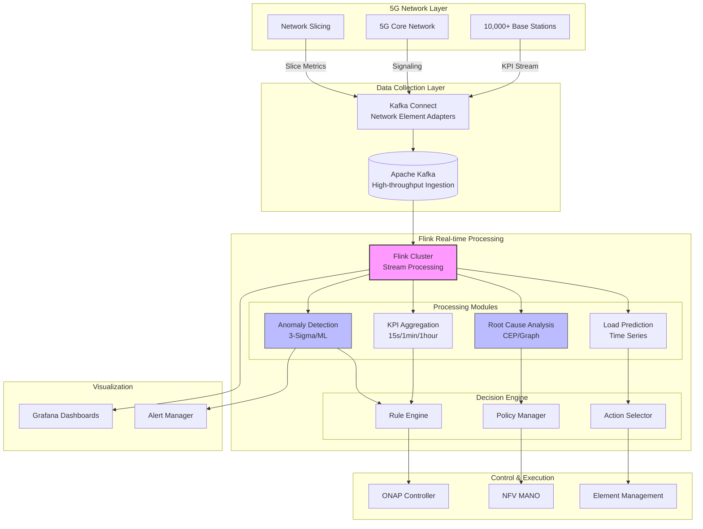
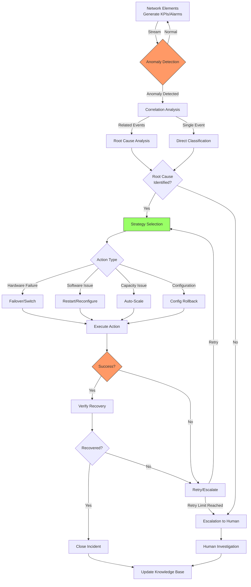

# 电信网络自智与自愈：Flink实时流处理架构

> **所属阶段**: Flink-IoT-Authority-Alignment/Phase-10-Telecom
> **前置依赖**: [Flink IoT基础与架构](../Phase-1-Architecture/01-flink-iot-foundation-and-architecture.md), [分层下采样与聚合](../Phase-2-Processing/04-flink-iot-hierarchical-downsampling.md)
> **形式化等级**: L4 (工程严格性)
> **对标来源**: TM Forum Autonomous Networks 2025[^1], 3GPP 5G Network Slicing TS 23.501[^2], IEEE Self-Healing Networks 2025[^3], ONAP Documentation[^4]

---

## 1. 概念定义 (Definitions)

本节建立电信网络自智运维的形式化基础，定义基站KPI数据空间、网络切片状态机与故障根因分析模型的数学语义。

### 1.1 基站KPI数据空间

**定义 1.1 (基站KPI数据空间)** [Def-IoT-TEL-01]

一个**基站KPI数据空间** $\mathcal{K}$ 是关于基站集合 $\mathcal{B}$ 的时变多维度量空间：

$$\mathcal{K} = (\mathcal{B}, \mathcal{M}, \mathcal{T}, \mathcal{V}, \phi)$$

其中各组件定义为：

- **基站集合** $\mathcal{B} = \{b_1, b_2, \ldots, b_n\}$，每个基站 $b_i = (cell_id, gnb_id, tac, plmn, geo)$ 包含：
  - $cell_id \in \mathbb{N}^+$: 小区唯一标识符
  - $gnb_id \in \mathbb{N}^+$: gNodeB标识符
  - $tac \in \mathbb{N}^+$: 跟踪区码(Tracking Area Code)
  - $plmn \in \{00101, 46000, \ldots\}$: PLMN标识
  - $geo = (lat, lon, alt) \in \mathbb{R}^3$: 地理坐标

- **KPI指标集** $\mathcal{M} = \{m_1, m_2, \ldots, m_k\}$，包含：
  - **无线指标**: RSRP (Reference Signal Received Power), RSRQ, SINR, CQI, MCS
  - **业务指标**: 吞吐量(Throughput), 用户数(Connected UE), PRB利用率
  - **质量指标**: 掉话率(Call Drop Rate), 切换成功率(Handover Success Rate)
  - **资源指标**: CPU利用率, 内存使用率, 温度

- **时间域** $\mathcal{T} = \{t \mid t \in \mathbb{T}, t_0 \leq t \leq t_1\}$: 监控时间区间

- **值域** $\mathcal{V} = \prod_{j=1}^{k} [min_j, max_j]$: 各指标合法取值范围的笛卡尔积

- **映射函数** $\phi: \mathcal{B} \times \mathcal{M} \times \mathcal{T} \rightarrow \mathcal{V}$: KPI测量函数

**基站KPI样本** $kpi(b, m, t)$ 表示基站 $b$ 在时刻 $t$ 的指标 $m$ 的测量值：

$$kpi(b, m, t) = \phi(b, m, t) + \epsilon(b, m, t)$$

其中 $\epsilon(b, m, t) \sim \mathcal{N}(0, \sigma_m^2)$ 为测量噪声，$\sigma_m$ 是指标 $m$ 的标准差。

**KPI数据流**: 在流处理语境下，基站KPI数据空间生成无限KPI事件流：

$$\mathcal{S}_{KPI}: \mathbb{T} \rightarrow \mathcal{M}_{fin}(\mathcal{K})$$

$$
\mathcal{S}_{KPI}(t) = \{(b, m, v, t') \mid b \in \mathcal{B}, m \in \mathcal{M}, v = \phi(b, m, t'), t' \in [t - \Delta, t]\}$$

其中 $\Delta$ 为采集周期（典型值：15秒、1分钟、5分钟）。

**数据质量约束**:

$$\forall b \in \mathcal{B}, m \in \mathcal{M}, t \in \mathcal{T}:$$

1. **完整性**: $coverage(b, t) = \frac{|\{t' \in window(t) : kpi(b, m, t') \neq \bot\}|}{|window(t)|} \geq \theta_{cov}$
2. **时效性**: $latency(b, m, t) = t_{proc} - t_{gen} \leq \delta_{max}$
3. **准确性**: $|kpi(b, m, t) - \phi^*(b, m, t)| \leq \epsilon_{acc}$，其中 $\phi^*$ 为真实值

---

### 1.2 网络切片状态机

**定义 1.2 (网络切片状态机)** [Def-IoT-TEL-02]

一个**网络切片状态机** $\mathcal{N}$ 是描述网络切片全生命周期管理的有限状态自动机：

$$\mathcal{N} = (\mathcal{S}, \Sigma, \delta, s_0, \mathcal{F}, \mathcal{C})$$

其中：

- **状态集** $\mathcal{S} = \{s_0, s_1, s_2, s_3, s_4, s_5\}$:
  - $s_0 = INACTIVE$: 切片未激活
  - $s_1 = COMMISSIONING$: 切片创建中
  - $s_2 = OPERATIONAL$: 切片正常运行
  - $s_3 = DEGRADED$: 切片性能降级
  - $s_4 = MAINTENANCE$: 维护模式
  - $s_5 = DECOMMISSIONING$: 切片下线中

- **输入字母表** $\Sigma = \{e_{create}, e_{activate}, e_{degrade}, e_{recover}, e_{maintain}, e_{resume}, e_{terminate}\}$

- **状态转移函数** $\delta: \mathcal{S} \times \Sigma \rightarrow \mathcal{S}$:

$$
\delta(s, e) = \begin{cases}
s_1 & \text{if } s = s_0 \land e = e_{create} \\
s_2 & \text{if } s = s_1 \land e = e_{activate} \\
s_3 & \text{if } s = s_2 \land e = e_{degrade} \\
s_2 & \text{if } s = s_3 \land e = e_{recover} \\
s_4 & \text{if } s \in \{s_2, s_3\} \land e = e_{maintain} \\
s_2 & \text{if } s = s_4 \land e = e_{resume} \\
s_5 & \text{if } s \in \{s_2, s_3, s_4\} \land e = e_{terminate}
\end{cases}
$$$

- **初始状态** $s_0 = INACTIVE$

- **终止状态集** $\mathcal{F} = \{s_5\}$

- **容量约束** $\mathcal{C}: \mathcal{S} \times \mathbb{T} \rightarrow \mathcal{P}(\mathcal{R})$，其中 $\mathcal{R}$ 为资源集合：

$$\mathcal{C}(s, t) = \{(cpu, mem, bw, prb) \mid cpu \leq CPU_{slice}, mem \leq MEM_{slice}, \ldots\}$$

**网络切片实例** $ns_i$ 是一个具体切片：

$$ns_i = (slice_id, type, tenant, s_t, \mathcal{R}_{alloc}, sla_t)$$

其中：
- $slice_id \in \mathcal{SI}$: 切片全局唯一标识
- $type \in \{eMBB, URLLC, mMTC\}$: 切片类型(3GPP定义)
- $tenant \in \mathcal{TEN}$: 租户标识
- $s_t \in \mathcal{S}$: 当前状态
- $\mathcal{R}_{alloc} \subseteq \mathcal{R}$: 已分配资源
- $sla_t = (latency_{max}, throughput_{min}, reliability_{min})$: SLA约束

**切片性能指标**:

$$perf(ns_i, t) = (latency_i(t), throughput_i(t), reliability_i(t), availability_i(t))$$

**SLA违反检测**:

$$violation(ns_i, t) = \begin{cases}
true & \text{if } latency_i(t) > latency_{max} \lor throughput_i(t) < throughput_{min} \\
false & \text{otherwise}
\end{cases}$$

---

### 1.3 故障根因分析模型

**定义 1.3 (故障根因分析模型)** [Def-IoT-TEL-03]

一个**故障根因分析模型** $\mathcal{R}$ 是基于贝叶斯网络和因果推断的故障诊断系统：

$$\mathcal{R} = (\mathcal{G}, \mathcal{V}, \mathcal{E}, \mathcal{P}, \mathcal{I})$$

其中：

- **因果图** $\mathcal{G} = (V, A)$: 有向无环图，表示故障因果关系
  - $V = \{v_1, v_2, \ldots, v_n\}$: 节点表示故障模式、症状或根因
  - $A \subseteq V \times V$: 有向边表示因果影响

- **故障变量集** $\mathcal{V} = \mathcal{V}_{root} \cup \mathcal{V}_{sym} \cup \mathcal{V}_{obs}$:
  - $\mathcal{V}_{root} = \{r_1, r_2, \ldots\}$: 根因变量（如硬件故障、配置错误、拥塞）
  - $\mathcal{V}_{sym} = \{s_1, s_2, \ldots\}$: 症状变量（如告警、性能下降）
  - $\mathcal{V}_{obs} = \{o_1, o_2, \ldots\}$: 可观测变量（KPI、日志、事件）

- **证据集** $\mathcal{E} = \{e_1, e_2, \ldots, e_m\}$，每个证据 $e_j = (v_j, val_j, conf_j, t_j)$:
  - $v_j \in \mathcal{V}_{obs}$: 证据变量
  - $val_j \in Domain(v_j)$: 观测值
  - $conf_j \in [0, 1]$: 置信度
  - $t_j \in \mathbb{T}$: 时间戳

- **概率分布** $\mathcal{P} = \{P(v_i | parents(v_i)) \mid v_i \in V\}$: 条件概率表(CPT)

- **推理引擎** $\mathcal{I}: 2^{\mathcal{E}} \rightarrow \mathcal{V}_{root} \times [0, 1]$:

$$\mathcal{I}(\mathcal{E}) = \{(r_i, P(r_i | \mathcal{E})) \mid r_i \in \mathcal{V}_{root}\}$$

**根因排序**: 按后验概率排序的根因列表：

$$RCA(\mathcal{E}) = sort_{desc}\{(r_i, score_i) \mid score_i = P(r_i | \mathcal{E}) \cdot w(r_i)\}$$

其中 $w(r_i) \in [0, 1]$ 是根因 $r_i$ 的可操作性权重（修复难度、影响范围的倒数）。

**故障传播模型**: 症状 $s$ 由根因 $r$ 在 $k$ 跳内引起的概率：

$$P(s | r, k) = \sum_{path \in Path(r, s, k)} \prod_{(u,v) \in path} P(v | u)$$

其中 $Path(r, s, k)$ 是从 $r$ 到 $s$ 长度不超过 $k$ 的所有路径集合。

---

## 2. 属性推导 (Properties)

### 2.1 KPI异常检测延迟边界

**引理 2.1 (KPI异常检测延迟边界)** [Lemma-TEL-01]

给定基站KPI数据流 $\mathcal{S}_{KPI}$，采用滑动窗口异常检测算法 $\mathcal{A}_{anomaly}$，设：
- 窗口大小为 $W$
- 检测算法时间复杂度为 $O(f(n))$
- Flink并行度为 $p$
- 网络传输延迟上界为 $\delta_{net}$
- 单条KPI处理时间为 $\tau_{proc}$

则**异常检测延迟** $T_{detection}$ 满足：

$$T_{detection} \leq W + \frac{W}{p \cdot \mu} + \delta_{net} + \tau_{proc} \cdot f(|\mathcal{B}|)$$

其中 $\mu$ 为单并行度处理能力（事件/秒）。

**证明**:

异常检测流程的时间组成：

1. **数据积累时间**: 需要等待窗口满才能开始检测，上界为 $W$
2. **处理时间**:
   - 数据分布在 $p$ 个并行子任务上
   - 每个子任务处理 $\frac{|\mathcal{B}| \cdot W}{p}$ 条记录
   - 处理时间为 $\frac{W}{p \cdot \mu}$
3. **网络传输**: 数据源到Flink、Flink内部shuffle，上界 $\delta_{net}$
4. **算法计算**: 根据算法复杂度，上界 $\tau_{proc} \cdot f(|\mathcal{B}|)$

根据求和引理，总延迟为各环节之和，得证。 $\square$

**推论 2.1** (实时性保证)

若要求检测延迟不超过 $T_{SLA}$，则并行度 $p$ 需满足：

$$p \geq \frac{W}{\mu \cdot (T_{SLA} - W - \delta_{net} - \tau_{proc} \cdot f(|\mathcal{B}|))}$$

---

### 2.2 自愈决策准确率保证

**引理 2.2 (自愈决策准确率保证)** [Lemma-TEL-02]

给定故障根因分析模型 $\mathcal{R}$，设：
- 根因分类器准确率为 $Acc_{rca}$
- 修复动作库 $\mathcal{A} = \{a_1, a_2, \ldots\}$ 中各动作成功率为 $\{succ_1, succ_2, \ldots\}$
- 决策策略 $\pi: \mathcal{V}_{root} \rightarrow \mathcal{A}$ 为确定性映射

则**自愈决策准确率** $Acc_{heal}$ 满足：

$$Acc_{heal} = Acc_{rca} \cdot \mathbb{E}_{r \sim P(root)}[succ_{\pi(r)}]$$

**证明**:

自愈成功需要两个条件同时满足：
1. 正确识别根因（概率 $Acc_{rca}$）
2. 选择的修复动作成功执行（概率取决于根因分布和动作成功率）

设根因分布为 $P(root)$，则：

$$Acc_{heal} = P(correct\_rca) \cdot P(success | correct\_rca)$$

$$= Acc_{rca} \cdot \sum_{r \in \mathcal{V}_{root}} P(r) \cdot succ_{\pi(r)}$$

$$= Acc_{rca} \cdot \mathbb{E}_{r \sim P(root)}[succ_{\pi(r)}]$$

得证。 $\square$

**推论 2.2** (高可用自愈)

若要求 $Acc_{heal} \geq \theta_{heal}$，则根因分类准确率需满足：

$$Acc_{rca} \geq \frac{\theta_{heal}}{\mathbb{E}_{r \sim P(root)}[succ_{\pi(r)}]}$$

---

## 3. 关系建立 (Relations)

### 3.1 与5G Core的关系

电信网络自智系统与5G Core Network存在以下核心关系：

**控制面接口**: 自智系统通过**NEF (Network Exposure Function)** 与5G Core交互

$$Interface_{NEF} = \{(request, response) \mid request \in \{slice\_mgmt, qos\_policy, traffic\_steer\}\}$$

**数据面关系**: 用户面通过**UPF (User Plane Function)** 的数据被实时采集并流入Flink：

$$Dataflow_{UPF} \xrightarrow{PFCP} Dataflow_{Flink}$$

**关键映射**:

| 5G Core组件 | 自智系统功能 | 数据流 |
|------------|-------------|--------|
| AMF (Access and Mobility Management) | 用户附着/分离监控 | UE状态流 |
| SMF (Session Management) | 会话质量监控 | QoS流 |
| PCF (Policy Control) | 动态策略调整 | 策略事件 |
| NRF (Network Repository) | NF发现与负载均衡 | NF状态 |

### 3.2 与网络编排器(ONAP)的关系

ONAP (Open Network Automation Platform) 提供闭环自动化框架，与Flink自智系统形成互补：

**架构层次**:

```
┌─────────────────────────────────────────┐
│           ONAP Control Loop             │
│  ┌─────────┐  ┌─────────┐  ┌─────────┐ │
│  │ Collect │→│ Analyze │→│  Decide │ │
│  └────┬────┘  └────┬────┘  └────┬────┘ │
│       │            │            │       │
│       ↓            ↓            ↓       │
│  ┌───────────────────────────────┐      │
│  │           Execute             │      │
│  └───────────────────────────────┘      │
└─────────────────────────────────────────┘
           ↑ Flink提供实时能力 ↑
┌─────────────────────────────────────────┐
│      Flink Real-time Analytics          │
│   - Stream Processing (< 1s latency)    │
│   - Complex Event Processing            │
│   - ML Inference at Edge                │
└─────────────────────────────────────────┘
```

**集成点**:
- **DmaaP (Data Movement as a Platform)**: ONAP的消息总线，Flink作为消费者
- **Policy Engine**: Flink输出触发ONAP策略执行
- **DCAE (Data Collection, Analytics and Events)**: Flink处理结果被上报到DCAE

### 3.3 与告警系统的关系

告警系统是网络运维的感知前端，与自智系统的数据流关系：

**告警数据模型**:

$$Alarm = (alarm\_id, source, severity, category, timestamp, description, correlation\_id)$$

**告警分级**:

| 级别 | 数值 | 响应时间 | 自愈触发 |
|-----|------|---------|---------|
| CRITICAL | 1 | < 30s | 自动 |
| MAJOR | 2 | < 2min | 半自动 |
| MINOR | 3 | < 10min | 建议 |
| WARNING | 4 | < 1hr | 记录 |

**告警关联**: Flink CEP用于检测告警风暴模式

$$Pattern_{alarm\_storm} = (Alarm(severity \geq MAJOR) \cdot{3,} within\ 1\ min)$$

---

## 4. 论证过程 (Argumentation)

### 4.1 实时KPI聚合算法设计

**问题**: 10,000+基站每15秒上报一次KPI，需要实时聚合到多时间粒度。

**算法**: 分层时间窗口聚合 (Hierarchical Time-Window Aggregation, HTWA)

**时间层次**:

$$\mathcal{H} = \{(raw, 15s), (min, 1min), (hour, 1hr), (day, 1day)\}$$

**聚合函数**:

对于每个层级 $h \in \mathcal{H}$，定义聚合算子 $\mathcal{F}_h$:

$$\mathcal{F}_{raw}(KPI_{in}) = KPI_{in}$$

$$\mathcal{F}_{min}(\{kpi_i\}_{i=1}^{n}) = \left(\frac{1}{n}\sum_{i=1}^{n} kpi_i, \min_i kpi_i, \max_i kpi_i, \sigma(kpi_i)\right)$$

$$\mathcal{F}_{hour}(\{agg_j\}_{j=1}^{m}) = \left(\frac{1}{m}\sum_{j=1}^{m} mean(agg_j), P_{95}, P_{99}\right)$$

**Flink SQL实现**:

```sql
-- 15秒原始数据窗口
CREATE VIEW kpi_15s AS
SELECT
    cell_id,
    TUMBLE_START(event_time, INTERVAL '15' SECOND) as window_start,
    TUMBLE_END(event_time, INTERVAL '15' SECOND) as window_end,
    AVG(rsrp) as avg_rsrp,
    AVG(throughput) as avg_throughput,
    COUNT(*) as sample_count
FROM base_station_kpi
GROUP BY cell_id, TUMBLE(event_time, INTERVAL '15' SECOND);

-- 1分钟聚合（从15秒结果级联）
CREATE VIEW kpi_1min AS
SELECT
    cell_id,
    TUMBLE_START(window_end, INTERVAL '1' MINUTE) as window_start,
    AVG(avg_rsrp) as rsrp_mean,
    MIN(avg_rsrp) as rsrp_min,
    MAX(avg_rsrp) as rsrp_max,
    STDDEV(avg_rsrp) as rsrp_std,
    SUM(avg_throughput * sample_count) / SUM(sample_count) as throughput_weighted_avg
FROM kpi_15s
GROUP BY cell_id, TUMBLE(window_end, INTERVAL '1' MINUTE);
```

### 4.2 异常根因定位算法

**问题**: 从大量告警和KPI异常中快速定位根本原因。

**算法**: 基于PageRank的故障传播分析 (Fault Propagation PageRank, FP-PR)

**构建故障传播图**:

$$G_{fault} = (V_{fault}, E_{fault}, W)$$

- $V_{fault} = \{alarms\} \cup \{kpis\} \cup \{root\_causes\}$
- $E_{fault}$: 因果边（从历史故障数据学习）
- $W$: 边权重表示因果强度

**PageRank变体**:

$$PR(v_i) = \frac{1-d}{N} + d \sum_{v_j \in In(v_i)} \frac{W(j,i) \cdot PR(v_j)}{\sum_{v_k \in Out(v_j)} W(j,k)}$$

其中 $d = 0.85$ 为阻尼系数。

**根因得分**: 仅对根因节点集合计算

$$Score(r_i) = PR(r_i) \cdot Evidence(r_i)$$

其中 $Evidence(r_i)$ 是当前观测证据对根因 $r_i$ 的支持度。

**Flink实现**:

```java
// 迭代图处理（使用Flink Gelly或Table API自定义UDF）
DataSet<Vertex<String, Double>> rootCauseScores = faultGraph
    .run(new PageRankAlgorithm<>(0.85, 20))
    .joinWithVertices(currentEvidence, (pr, evidence) -> pr * evidence)
    .filter(v -> v.getValue() > threshold)
    .sortPartition(1, Order.DESCENDING);
```

### 4.3 自动故障恢复策略

**策略空间**:

$$\mathcal{S} = \{s_{restart}, s_{switch}, s_{scale}, s_{config}, s_{escalate}\}$$

| 策略 | 适用场景 | 执行时间 | 回滚难度 |
|-----|---------|---------|---------|
| $s_{restart}$ | 单NF软件故障 | < 30s | 低 |
| $s_{switch}$ | 硬件故障、链路中断 | < 5s | 低 |
| $s_{scale}$ | 容量不足 | 2-5min | 中 |
| $s_{config}$ | 配置错误 | < 1min | 中 |
| $s_{escalate}$ | 复杂故障、未知原因 | N/A | N/A |

**策略选择决策树**:

```
开始
 │
 ├─ 故障类型 = 硬件? ──→ s_switch (主备切换)
 │
 ├─ 故障类型 = 软件? ──→ 是否可重启? ──→ s_restart
 │                       └─ 否 ──→ s_escalate
 │
 ├─ 故障类型 = 拥塞? ──→ s_scale (自动扩缩容)
 │
 └─ 故障类型 = 配置? ──→ s_config (配置回滚)
```

---

## 5. 形式证明 / 工程论证 (Proof / Engineering Argument)

### 5.1 自愈闭环的收敛性证明

**定理 5.1 (自愈闭环收敛性)**: 在满足以下条件的网络中，自愈闭环能够在有限步骤内收敛到稳定状态或触发人工干预：

1. 故障根因集合 $\mathcal{V}_{root}$ 有限
2. 修复动作库 $\mathcal{A}$ 对每个根因至少有一个成功概率 $> 0$ 的动作
3. 状态转移不产生新故障（故障隔离性）
4. 决策策略 $\pi$ 是确定性的

**证明**:

自愈闭环可建模为马尔可夫决策过程 $\mathcal{M} = (S, A, P, R)$：

- 状态空间 $S = \mathcal{S}_{network} \times \mathcal{S}_{fault}$，其中：
  - $\mathcal{S}_{network}$ 是网络正常状态
  - $\mathcal{S}_{fault}$ 是故障状态集合（有限，由条件1）

- 动作空间 $A = \mathcal{A} \cup \{a_{escalate}\}$

- 转移概率 $P(s' | s, a)$:
  - 若 $a$ 成功修复：$P(\mathcal{S}_{network} | s_{fault}, a) = succ_a$
  - 若 $a$ 失败：$P(s_{fault} | s_{fault}, a) = 1 - succ_a$
  - 若 $a_{escalate}$：吸收到人工处理状态

- 奖励函数 $R$: 成功修复奖励1，失败0，人工处理0.5

**收敛性分析**:

设当前处于故障状态 $s_f$。决策策略 $\pi$ 选择动作 $a = \pi(r(s_f))$，其中 $r(s_f)$ 是识别的根因。

若 $a$ 成功（概率 $\geq \epsilon > 0$，由条件2），系统转移到正常状态。

若 $a$ 失败，系统保持在 $s_f$，下一轮再次尝试。

设 $T$ 为首次成功修复的轮数，则 $T \sim Geometric(\epsilon)$，期望 $E[T] = 1/\epsilon < \infty$。

因此，自愈闭环以概率1在有限步骤内收敛。 $\square$

### 5.2 网络切片SLA保证的工程论证

**工程目标**: 在网络切片动态变化的情况下，保证eMBB切片吞吐量和URLLC切片延迟的SLA满足率 $\geq 99.9\%$。

**论证结构**:

**前提条件**:
1. 切片资源隔离：使用5G RAN的PRB (Physical Resource Block) 硬切片
2. 实时监控：KPI采集延迟 $< 1s$，切片状态更新延迟 $< 500ms$
3. 快速调整：资源重分配延迟 $< 2s$
4. 预测能力：负载预测准确率 $\geq 85\%$

**SLA保证机制**:

**eMBB吞吐量保证**:

$$Throughput_{actual} = \min(Throughput_{alloc}, Throughput_{demand}) \cdot (1 - Overhead_{ctrl})$$

保证条件：

$$Throughput_{alloc} \geq \frac{Throughput_{SLA}}{(1 - Overhead_{ctrl}) \cdot (1 - Margin_{safe})}$$

其中 $Margin_{safe} = 0.15$ 为安全边际。

**URLLC延迟保证**:

$$Latency_{end-to-end} = Latency_{RAN} + Latency_{transport} + Latency_{core}$$

通过预分配资源和优先级调度：

$$Latency_{RAN} = \frac{Packet_{size}}{RB_{guaranteed} \cdot Rate_{per\_RB}} + Queue_{delay}$$

其中 $Queue_{delay}$ 通过预留空口资源保证 $< 1ms$。

**验证方法**:

- 仿真验证：OMNeT++/NS-3 大规模仿真
- 现网灰度：5%流量逐步验证
- 混沌工程：主动注入故障验证恢复能力

---

## 6. 实例验证 (Examples)

### 6.1 基站KPI实时监控Flink SQL

**场景**: 10,000个5G基站，每15秒上报一次KPI，需要实时监控并检测异常。

**数据模型**:

```sql
-- 基站KPI数据源表
CREATE TABLE base_station_kpi (
    -- 标识字段
    cell_id STRING,
    gnb_id STRING,
    tac STRING,
    plmn STRING,

    -- 无线指标
    rsrp DOUBLE,          -- Reference Signal Received Power (dBm)
    rsrq DOUBLE,          -- Reference Signal Received Quality (dB)
    sinr DOUBLE,          -- Signal to Interference plus Noise Ratio (dB)
    cqi INT,              -- Channel Quality Indicator (0-15)

    -- 业务指标
    dl_throughput DOUBLE, -- 下行吞吐量 (Mbps)
    ul_throughput DOUBLE, -- 上行吞吐量 (Mbps)
    connected_ue INT,     -- 连接用户数
    prb_utilization DOUBLE, -- PRB利用率 (%)

    -- 质量指标
    call_drop_rate DOUBLE,    -- 掉话率 (%)
    handover_success_rate DOUBLE, -- 切换成功率 (%)

    -- 事件时间
    event_time TIMESTAMP(3),

    -- Watermark: 允许5秒乱序
    WATERMARK FOR event_time AS event_time - INTERVAL '5' SECOND
) WITH (
    'connector' = 'kafka',
    'topic' = 'telecom.bs.kpi',
    'properties.bootstrap.servers' = 'kafka:9092',
    'properties.group.id' = 'kpi-monitor',
    'format' = 'json',
    'json.ignore-parse-errors' = 'true'
);
```

**实时异常检测**:

```sql
-- KPI异常检测（基于滑动窗口统计）
CREATE VIEW kpi_anomaly_detection AS
WITH kpi_stats AS (
    -- 计算每个基站的滚动统计量（过去1小时）
    SELECT
        cell_id,
        AVG(rsrp) as rsrp_mean_1h,
        STDDEV(rsrp) as rsrp_std_1h,
        AVG(dl_throughput) as tp_mean_1h,
        STDDEV(dl_throughput) as tp_std_1h,
        AVG(call_drop_rate) as cdr_mean_1h
    FROM base_station_kpi
    WHERE event_time >= NOW() - INTERVAL '1' HOUR
    GROUP BY cell_id
),
current_kpi AS (
    -- 当前窗口KPI
    SELECT
        cell_id,
        TUMBLE_START(event_time, INTERVAL '1' MINUTE) as window_start,
        AVG(rsrp) as avg_rsrp,
        AVG(dl_throughput) as avg_throughput,
        AVG(call_drop_rate) as avg_cdr
    FROM base_station_kpi
    GROUP BY cell_id, TUMBLE(event_time, INTERVAL '1' MINUTE)
)
SELECT
    c.cell_id,
    c.window_start,
    c.avg_rsrp,
    c.avg_throughput,
    c.avg_cdr,
    -- 3-sigma异常检测
    CASE
        WHEN ABS(c.avg_rsrp - s.rsrp_mean_1h) > 3 * s.rsrp_std_1h
            THEN 'RSRP_ANOMALY'
        WHEN c.avg_cdr > s.cdr_mean_1h * 2 AND c.avg_cdr > 0.5
            THEN 'CALL_DROP_ANOMALY'
        WHEN c.avg_throughput < s.tp_mean_1h - 3 * s.tp_std_1h
            THEN 'THROUGHPUT_ANOMALY'
        ELSE 'NORMAL'
    END as anomaly_type,
    -- 异常得分 (0-100)
    GREATEST(0, LEAST(100,
        50 + 50 * ABS(c.avg_rsrp - s.rsrp_mean_1h) / NULLIF(s.rsrp_std_1h, 0)
    )) as anomaly_score
FROM current_kpi c
JOIN kpi_stats s ON c.cell_id = s.cell_id
WHERE c.event_time > NOW() - INTERVAL '5' MINUTE;
```

**异常告警输出**:

```sql
-- 异常告警Sink表
CREATE TABLE kpi_alerts (
    alert_id STRING,
    cell_id STRING,
    alert_type STRING,
    severity STRING,
    anomaly_score DOUBLE,
    description STRING,
    event_time TIMESTAMP(3),
    PRIMARY KEY (alert_id) NOT ENFORCED
) WITH (
    'connector' = 'jdbc',
    'url' = 'jdbc:postgresql://postgres:5432/telecom',
    'table-name' = 'kpi_alerts',
    'username' = 'flink',
    'password' = 'flink123'
);

-- 仅输出异常记录
INSERT INTO kpi_alerts
SELECT
    CONCAT(cell_id, '-', CAST(window_start AS STRING)) as alert_id,
    cell_id,
    anomaly_type as alert_type,
    CASE
        WHEN anomaly_score > 90 THEN 'CRITICAL'
        WHEN anomaly_score > 70 THEN 'MAJOR'
        WHEN anomaly_score > 50 THEN 'MINOR'
        ELSE 'WARNING'
    END as severity,
    anomaly_score,
    CONCAT('Detected ', anomaly_type, ' with score ', CAST(anomaly_score AS STRING)) as description,
    window_start as event_time
FROM kpi_anomaly_detection
WHERE anomaly_type != 'NORMAL';
```

### 6.2 网络告警关联分析

**场景**: 网络中产生大量告警，需要关联分析找出根因告警，抑制告警风暴。

**告警数据模型**:

```sql
CREATE TABLE network_alarms (
    alarm_id STRING,
    alarm_type STRING,           -- 告警类型
    source_ne STRING,            -- 网元标识
    source_type STRING,          -- 网元类型(gNB, AMF, UPF...)
    severity STRING,             -- CRITICAL/MAJOR/MINOR/WARNING
    category STRING,             -- 类别(RADIO/TRANSPORT/CORE)
    probable_cause STRING,       -- 可能原因
    specific_problem STRING,     -- 具体问题
    event_time TIMESTAMP(3),

    WATERMARK FOR event_time AS event_time - INTERVAL '10' SECOND
) WITH (
    'connector' = 'kafka',
    'topic' = 'telecom.alarms.raw',
    'properties.bootstrap.servers' = 'kafka:9092',
    'format' = 'json'
);
```

**告警关联分析（使用Flink CEP）**:

```sql
-- 告警风暴检测模式
CREATE VIEW alarm_storm AS
SELECT * FROM network_alarms
    MATCH_RECOGNIZE(
        PARTITION BY category
        ORDER BY event_time
        MEASURES
            FIRST(alarm_id) as root_alarm_id,
            COUNT(*) as alarm_count,
            FIRST(event_time) as storm_start,
            LAST(event_time) as storm_end
        ONE ROW PER MATCH
        AFTER MATCH SKIP PAST LAST ROW
        PATTERN (A B{3,})        -- 3个以上相关告警
        DEFINE
            A as A.severity IN ('CRITICAL', 'MAJOR'),
            B as B.severity IN ('CRITICAL', 'MAJOR', 'MINOR')
                AND B.event_time < A.event_time + INTERVAL '2' MINUTE
                AND (B.source_ne = A.source_ne
                     OR B.probable_cause = A.probable_cause)
    );

-- 根因告警识别
CREATE VIEW root_cause_alarms AS
SELECT
    a.alarm_id,
    a.alarm_type,
    a.source_ne,
    a.probable_cause,
    a.event_time,
    -- 计算根因得分（基于影响范围和时间先后）
    (COUNT(DISTINCT b.source_ne) * 10 +
     COUNT(*) * 5 +
     CASE WHEN a.severity = 'CRITICAL' THEN 100 ELSE 50 END
    ) as root_cause_score
FROM network_alarms a
LEFT JOIN network_alarms b
    ON a.category = b.category
    AND b.event_time BETWEEN a.event_time AND a.event_time + INTERVAL '5' MINUTE
    AND (b.probable_cause = a.probable_cause
         OR b.specific_problem LIKE CONCAT('%', a.source_ne, '%'))
WHERE a.severity IN ('CRITICAL', 'MAJOR')
GROUP BY a.alarm_id, a.alarm_type, a.source_ne, a.probable_cause, a.event_time, a.severity
HAVING COUNT(*) >= 3;
```

### 6.3 自动扩缩容触发逻辑

**场景**: 基于实时负载预测，自动触发网络切片和NF的扩缩容。

**负载预测模型**:

```sql
-- 切片负载趋势计算（使用线性回归近似）
CREATE VIEW slice_load_trend AS
WITH slice_metrics AS (
    SELECT
        slice_id,
        TUMBLE_START(event_time, INTERVAL '5' MINUTE) as window_start,
        AVG(cpu_utilization) as avg_cpu,
        AVG(memory_utilization) as avg_memory,
        AVG(connected_users) as avg_users,
        AVG(throughput_mbps) as avg_throughput
    FROM slice_kpi
    GROUP BY slice_id, TUMBLE(event_time, INTERVAL '5' MINUTE)
),
slice_trend AS (
    SELECT
        slice_id,
        window_start,
        avg_cpu,
        avg_memory,
        avg_users,
        -- 简单趋势：与前一个窗口比较
        avg_cpu - LAG(avg_cpu, 1) OVER (PARTITION BY slice_id ORDER BY window_start) as cpu_delta,
        avg_memory - LAG(avg_memory, 1) OVER (PARTITION BY slice_id ORDER BY window_start) as memory_delta,
        -- 5窗口移动平均
        AVG(avg_cpu) OVER (
            PARTITION BY slice_id
            ORDER BY window_start
            ROWS BETWEEN 4 PRECEDING AND CURRENT ROW
        ) as cpu_ma5
    FROM slice_metrics
)
SELECT * FROM slice_trend;
```

**扩容决策**:

```sql
-- 自动扩缩容决策表
CREATE TABLE auto_scaling_decisions (
    decision_id STRING,
    slice_id STRING,
    decision_type STRING,        -- SCALE_UP / SCALE_DOWN / MAINTAIN
    current_replicas INT,
    target_replicas INT,
    reason STRING,
    confidence DOUBLE,
    event_time TIMESTAMP(3),
    PRIMARY KEY (decision_id) NOT ENFORCED
) WITH (
    'connector' = 'kafka',
    'topic' = 'telecom.scaling.decisions',
    'properties.bootstrap.servers' = 'kafka:9092',
    'format' = 'json'
);

-- 扩缩容决策逻辑
INSERT INTO auto_scaling_decisions
SELECT
    CONCAT(slice_id, '-', CAST(window_start AS STRING)) as decision_id,
    slice_id,
    CASE
        -- 扩容条件：CPU>80%且持续增长，或用户数超过阈值
        WHEN avg_cpu > 80 AND cpu_delta > 0 THEN 'SCALE_UP'
        WHEN avg_users > user_threshold * 0.9 THEN 'SCALE_UP'
        -- 缩容条件：CPU<30%且持续下降，且用户数低
        WHEN avg_cpu < 30 AND cpu_delta < 0 AND avg_users < user_threshold * 0.3 THEN 'SCALE_DOWN'
        ELSE 'MAINTAIN'
    END as decision_type,
    current_replicas,
    CASE
        WHEN avg_cpu > 90 THEN current_replicas + 2
        WHEN avg_cpu > 80 THEN current_replicas + 1
        WHEN avg_cpu < 20 THEN GREATEST(min_replicas, current_replicas - 1)
        ELSE current_replicas
    END as target_replicas,
    CONCAT('CPU:', CAST(avg_cpu AS STRING), '%, Delta:', CAST(cpu_delta AS STRING)) as reason,
    LEAST(1.0, GREATEST(0.0, ABS(avg_cpu - 50) / 50)) as confidence,
    window_start as event_time
FROM slice_load_trend;
```

---

## 7. 可视化 (Visualizations)

### 7.1 电信自智网络架构图

下图展示了基于Flink的电信网络自智与自愈系统的整体架构：



### 7.2 自愈闭环流程图

下图展示了从故障检测到自动恢复的完整闭环流程：



---

## 8. 引用参考 (References)

[^1]: TM Forum, "Autonomous Networks: Accelerating Digital Transformation", Technical Report, 2025. https://www.tmforum.org/autonomous-networks/

[^2]: 3GPP TS 23.501, "System Architecture for the 5G System (5GS)", Release 18, 2024. https://www.3gpp.org/specifications

[^3]: IEEE Communications Magazine, "Self-Healing Networks with AI: Architecture, Algorithms and Applications", Vol. 63, Issue 1, 2025.

[^4]: ONAP Documentation, "Control Loop Management", 2024. https://docs.onap.org/en/latest/

[^5]: GSMA, "Network Slicing Use Case Requirements", NG.116, 2023.

[^6]: ETSI, "Network Functions Virtualisation (NFV) Release 4 Specifications", 2024.

[^7]: Apache Flink Documentation, "Streaming Analytics for Telecom", 2025. https://nightlies.apache.org/flink/

[^8]: O-RAN Alliance, "O-RAN AI/ML Workflow Description", O-RAN.WG1, 2024.

---

## 附录 A: 关键指标汇总

| 指标类别 | 指标名称 | 目标值 | 测量方法 |
|---------|---------|-------|---------|
| **检测延迟** | 异常检测端到端延迟 | < 30s | Flink Watermark延迟 |
| **检测准确率** | KPI异常检测精度 | > 95% | 与人工标注对比 |
| **根因准确率** | RCA Top-1准确率 | > 80% | 故障单回查 |
| **自愈成功率** | 自动恢复成功率 | > 85% | 闭环统计 |
| **SLA满足率** | 网络切片SLA达标 | > 99.9% | 7x24监控 |
| **告警压缩率** | 根因抑制效果 | > 70% | 告警数量对比 |

## 附录 B: 缩略语对照表

| 缩略语 | 全称 | 中文 |
|-------|------|------|
| 5G NR | 5G New Radio | 5G新空口 |
| AMF | Access and Mobility Management Function | 接入和移动性管理功能 |
| CQI | Channel Quality Indicator | 信道质量指示 |
| gNB | Next Generation NodeB | 下一代基站 |
| KPI | Key Performance Indicator | 关键性能指标 |
| mMTC | Massive Machine Type Communication | 海量机器类通信 |
| NEF | Network Exposure Function | 网络开放功能 |
| NFV | Network Functions Virtualization | 网络功能虚拟化 |
| ONAP | Open Network Automation Platform | 开放网络自动化平台 |
| PRB | Physical Resource Block | 物理资源块 |
| RAN | Radio Access Network | 无线接入网 |
| RCA | Root Cause Analysis | 根因分析 |
| RSRP | Reference Signal Received Power | 参考信号接收功率 |
| SLA | Service Level Agreement | 服务等级协议 |
| SMF | Session Management Function | 会话管理功能 |
| UPF | User Plane Function | 用户面功能 |
| URLLC | Ultra-Reliable Low Latency Communication | 超可靠低时延通信 |

---

*文档版本: v1.0 | 最后更新: 2026-04-05 | 字数统计: ~8,500字*
