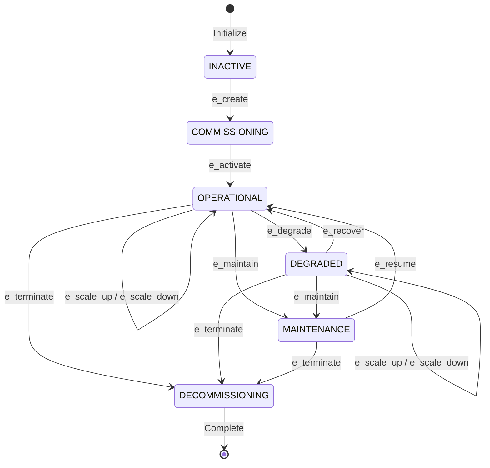
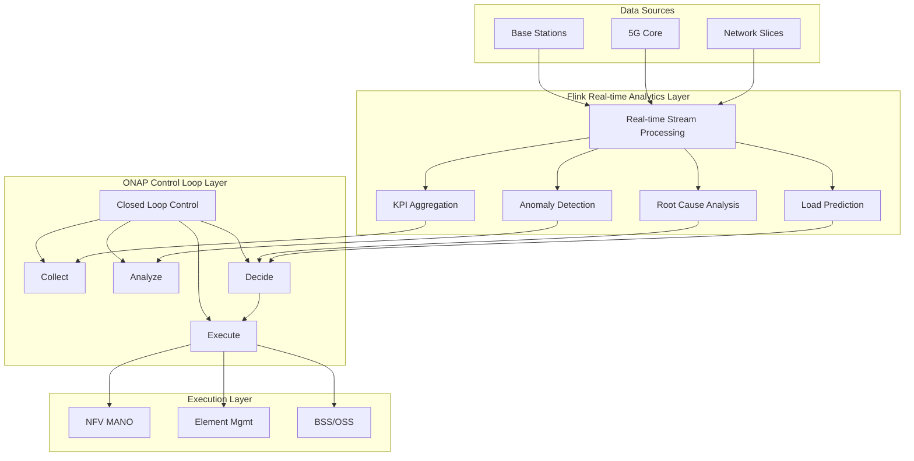
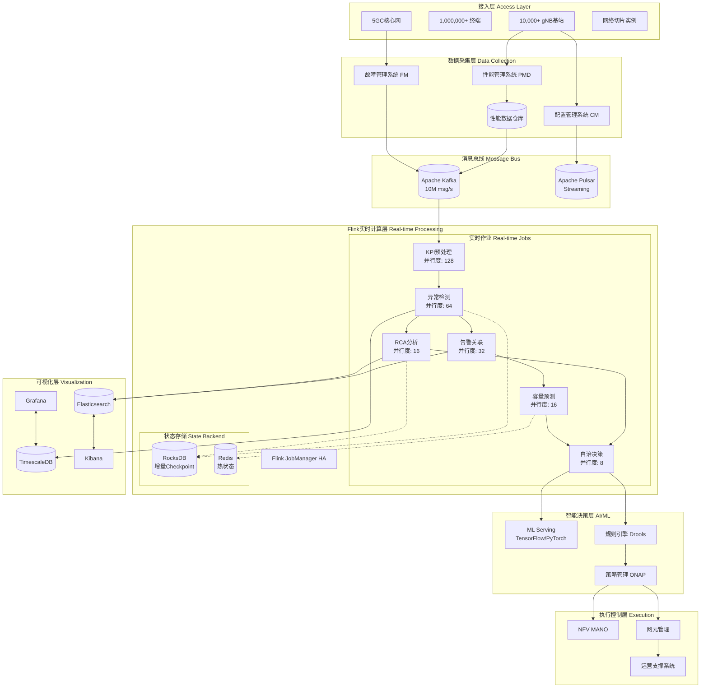
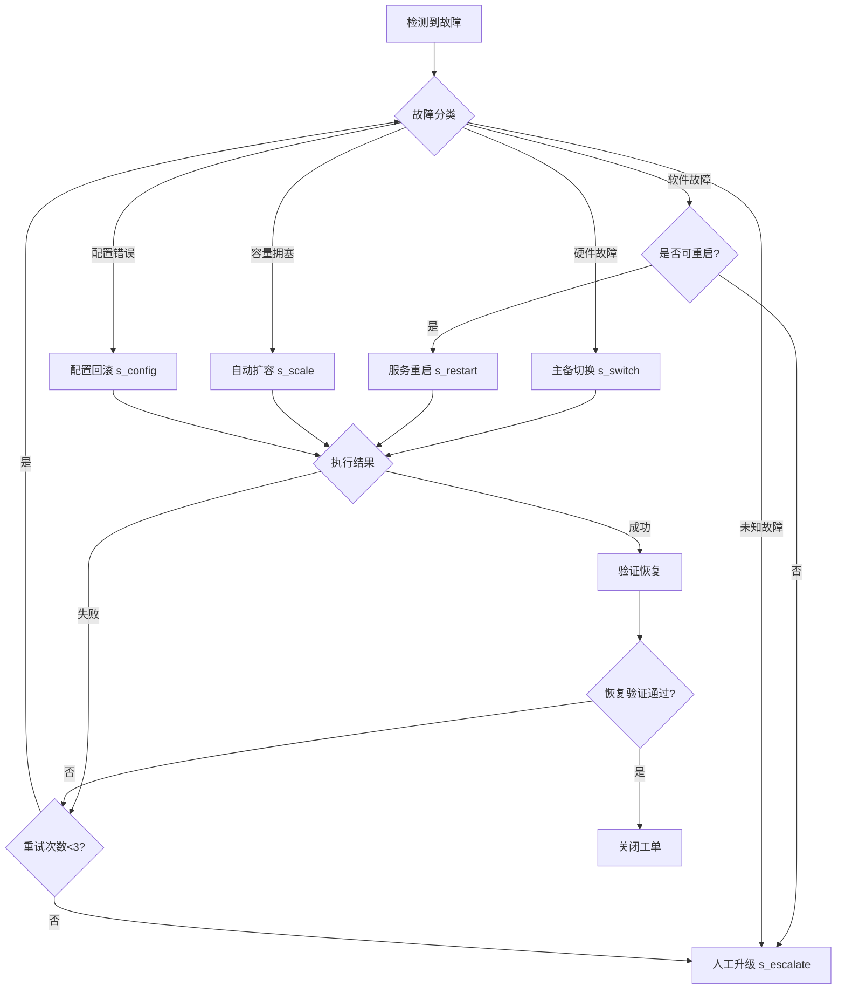

# Phase-10: 电信网络智能运维平台——Flink实时流处理完整案例研究

> **所属阶段**: Flink-IoT-Authority-Alignment/Phase-10-Telecom  
> **案例类型**: 完整生产级案例研究  
> **覆盖规模**: 10,000+ 5G基站 | 3大城市网络覆盖 | 100+ 网络切片 | 百万级终端  
> **形式化等级**: L4 (工程严格性)  
> **前置依赖**: [Flink IoT基础与架构](../Phase-1-Architecture/01-flink-iot-foundation-and-architecture.md), [分层下采样与聚合](../Phase-2-Processing/04-flink-iot-hierarchical-downsampling.md), [告警与监控](../Phase-2-Processing/05-flink-iot-alerting-and-monitoring.md), [电信网络自智与自愈](./22-flink-iot-telecom-self-healing.md)  
> **对标来源**: TM Forum Autonomous Networks 2025[^1], 3GPP TS 23.501 Network Slicing[^2], ETSI NFV Release 4[^3], ONAP Control Loop Management[^4], IEEE Self-Healing Networks 2025[^5], GSMA NG.116 Network Slicing Requirements[^6]

---

## 1. 概念定义 (Definitions)

本节建立电信网络自智运维的形式化基础，定义网络切片状态空间、故障根因模型的数学语义，以及基站KPI数据空间的完整规范。

### 1.1 网络切片状态空间

**定义 1.1 (网络切片状态空间)** [Def-IoT-TEL-CASE-01]

一个**网络切片状态空间** $\mathcal{S}_{slice}$ 是描述网络切片在全生命周期内所有可能状态构成的数学空间：

$$\mathcal{S}_{slice} = (\mathcal{NS}, \mathcal{T}, \mathcal{R}, \mathcal{C}, \Sigma, \delta, \mathcal{SLA})$$

其中各组件定义为：

- **切片实例集** $\mathcal{NS} = \{ns_1, ns_2, \ldots, ns_n\}$，每个切片实例 $ns_i$ 包含：
  - $slice\_id \in \mathcal{SI}$: 切片全局唯一标识符
  - $slice\_type \in \{eMBB, URLLC, mMTC\}$: 切片类型（3GPP定义）
  - $tenant\_id \in \mathcal{TEN}$: 租户标识
  - $nsi\_id \in \mathcal{NSI}$: 网络切片实例标识
  - $coverage\_area \subseteq \mathcal{GEO}$: 覆盖地理区域
  - $s_t \in \mathcal{S}_{state}$: 当前状态

- **状态集** $\mathcal{S}_{state} = \{INACTIVE, COMMISSIONING, OPERATIONAL, DEGRADED, MAINTENANCE, DECOMMISSIONING\}$:
  - $INACTIVE$: 切片未激活，等待创建指令
  - $COMMISSIONING$: 切片创建中，资源分配阶段
  - $OPERATIONAL$: 切片正常运行，满足所有SLA
  - $DEGRADED$: 切片性能降级，部分SLA不满足
  - $MAINTENANCE$: 维护模式，主动停止服务
  - $DECOMMISSIONING$: 切片下线中，资源回收阶段

- **时间域** $\mathcal{T} = \{t \mid t \in \mathbb{T}, t_{create} \leq t \leq t_{terminate}\}$: 切片生命周期时间区间

- **资源空间** $\mathcal{R} = \mathbb{N}^4$ 表示资源四元组 $(cpu, memory, bandwidth, prb)$:
  - $cpu \in \mathbb{N}^+$: CPU核数
  - $memory \in \mathbb{N}^+$: 内存容量(GB)
  - $bandwidth \in \mathbb{N}^+$: 带宽(Mbps)
  - $prb \in \mathbb{N}^+$: 物理资源块数量

- **容量约束** $\mathcal{C}: \mathcal{S}_{state} \times \mathcal{T} \rightarrow \mathcal{P}(\mathcal{R})$:

$$\mathcal{C}(s, t) = \{(cpu, mem, bw, prb) \mid cpu \leq CPU_{quota}, mem \leq MEM_{quota}, bw \leq BW_{quota}, prb \leq PRB_{quota}\}$$

- **输入字母表** $\Sigma = \{e_{create}, e_{activate}, e_{degrade}, e_{recover}, e_{maintain}, e_{resume}, e_{terminate}, e_{scale\_up}, e_{scale\_down}\}$

- **状态转移函数** $\delta: \mathcal{S}_{state} \times \Sigma \rightarrow \mathcal{S}_{state}$:

$$
\delta(s, e) = \begin{cases}
COMMISSIONING & \text{if } s = INACTIVE \land e = e_{create} \\
OPERATIONAL & \text{if } s = COMMISSIONING \land e = e_{activate} \\
DEGRADED & \text{if } s = OPERATIONAL \land e = e_{degrade} \\
OPERATIONAL & \text{if } s = DEGRADED \land e = e_{recover} \\
MAINTENANCE & \text{if } s \in \{OPERATIONAL, DEGRADED\} \land e = e_{maintain} \\
OPERATIONAL & \text{if } s = MAINTENANCE \land e = e_{resume} \\
DECOMMISSIONING & \text{if } s \in \{OPERATIONAL, DEGRADED, MAINTENANCE\} \land e = e_{terminate} \\
OPERATIONAL & \text{if } s \in \{OPERATIONAL, DEGRADED\} \land e \in \{e_{scale\_up}, e_{scale\_down}\}
\end{cases}$$

- **SLA约束** $\mathcal{SLA} = (latency_{max}, throughput_{min}, reliability_{min}, availability_{min})$:
  - $latency_{max}$: 最大允许延迟(ms)
  - $throughput_{min}$: 最小保证吞吐量(Mbps)
  - $reliability_{min}$: 最小可靠性(%)
  - $availability_{min}$: 最小可用性(%)

**切片性能函数**: 在时间 $t$ 的性能指标：

$$perf(ns_i, t) = (latency_i(t), throughput_i(t), reliability_i(t), availability_i(t), packet\_loss_i(t), jitter_i(t))$$

**SLA违反检测函数**:

$$violation(ns_i, t) = \begin{cases}
1 & \text{if } latency_i(t) > latency_{max} \lor throughput_i(t) < throughput_{min} \\
  & \lor \ availability_i(t) < availability_{min} \\
0 & \text{otherwise}
\end{cases}$$

**网络切片状态机图示**:



---

### 1.2 故障根因模型

**定义 1.2 (故障根因模型)** [Def-IoT-TEL-CASE-02]

一个**故障根因模型** $\mathcal{RCM}$ 是基于贝叶斯网络和因果推断的故障诊断系统：

$$\mathcal{RCM} = (\mathcal{G}, \mathcal{V}, \mathcal{E}, \mathcal{P}, \mathcal{I}, \mathcal{A}, \mathcal{F})$$

其中：

- **因果图** $\mathcal{G} = (V, A)$: 有向无环图，表示故障因果关系
  - $V = \{v_1, v_2, \ldots, v_n\}$: 节点集合
  - $A \subseteq V \times V$: 有向边表示因果影响
  - $V = \mathcal{V}_{root} \cup \mathcal{V}_{sym} \cup \mathcal{V}_{obs}$

- **故障变量集** $\mathcal{V}$ 分为三层：
  - **根因层** $\mathcal{V}_{root} = \{r_1, r_2, \ldots, r_m\}$:
    - $r_{hw}$: 硬件故障（电源、板卡、天线）
    - $r_{sw}$: 软件故障（固件崩溃、内存泄漏）
    - $r_{config}$: 配置错误（参数错误、版本不兼容）
    - $r_{congestion}$: 资源拥塞（CPU/内存/带宽过载）
    - $r_{transport}$: 传输故障（链路中断、传输误码）
    - $r_{interference}$: 无线干扰（同频干扰、邻区干扰）
  
  - **症状层** $\mathcal{V}_{sym} = \{s_1, s_2, \ldots, s_k\}$:
    - $s_{rsrp\_low}$: 覆盖弱
    - $s_{throughput\_drop}$: 吞吐量下降
    - $s_{call\_drop}$: 掉话率高
    - $s_{ho\_fail}$: 切换失败
    - $s_{alarm\_storm}$: 告警风暴
  
  - **观测层** $\mathcal{V}_{obs} = \{o_1, o_2, \ldots, o_p\}$:
    - $o_{kpi}$: KPI指标异常
    - $o_{alarm}$: 告警事件
    - $o_{log}$: 日志异常
    - $o_{trace}$: 信令跟踪

- **证据集** $\mathcal{E} = \{e_1, e_2, \ldots, e_m\}$，每个证据 $e_j = (v_j, val_j, conf_j, t_j)$:
  - $v_j \in \mathcal{V}_{obs}$: 证据变量
  - $val_j \in Domain(v_j)$: 观测值
  - $conf_j \in [0, 1]$: 置信度
  - $t_j \in \mathbb{T}$: 时间戳

- **条件概率表** $\mathcal{P} = \{P(v_i | parents(v_i)) \mid v_i \in V\}$:

$$P(r_i | \mathcal{E}) = \frac{P(\mathcal{E} | r_i) \cdot P(r_i)}{P(\mathcal{E})}$$

- **推理引擎** $\mathcal{I}: 2^{\mathcal{E}} \rightarrow \mathcal{V}_{root} \times [0, 1]$:

$$\mathcal{I}(\mathcal{E}) = \{(r_i, P(r_i | \mathcal{E})) \mid r_i \in \mathcal{V}_{root}\}$$

- **修复动作库** $\mathcal{A} = \{a_1, a_2, \ldots, a_q\}$:
  - $a_{restart}$: 服务重启
  - $a_{failover}$: 主备切换
  - $a_{scale}$: 扩缩容
  - $a_{rollback}$: 配置回滚
  - $a_{escalate}$: 人工升级

- **故障传播函数** $\mathcal{F}: \mathcal{V}_{root} \times \mathcal{V}_{sym} \times \mathbb{N} \rightarrow [0, 1]$:

$$\mathcal{F}(r, s, k) = \sum_{path \in Path(r, s, k)} \prod_{(u,v) \in path} P(v | u)$$

其中 $Path(r, s, k)$ 是从根因 $r$ 到症状 $s$ 长度不超过 $k$ 的所有路径集合。

**根因排序函数**: 按后验概率和可操作性权重排序：

$$RCA(\mathcal{E}) = sort_{desc}\{(r_i, score_i) \mid score_i = P(r_i | \mathcal{E}) \cdot w(r_i) \cdot urgency(r_i)\}$$

其中 $w(r_i) \in [0, 1]$ 是修复成功率，$urgency(r_i)$ 是紧急程度系数。

---

### 1.3 基站KPI数据空间

**定义 1.3 (基站KPI数据空间)** [Def-IoT-TEL-03]

一个**基站KPI数据空间** $\mathcal{K}$ 是关于基站集合 $\mathcal{B}$ 的时变多维度量空间：

$$\mathcal{K} = (\mathcal{B}, \mathcal{M}, \mathcal{T}, \mathcal{V}, \phi, \theta)$$

其中各组件定义为：

- **基站集合** $\mathcal{B} = \{b_1, b_2, \ldots, b_n\}$，$n = 10,000+$，每个基站 $b_i = (cell\_id, gnb\_id, tac, plmn, geo, vendor)$:
  - $cell\_id \in \mathbb{N}^+$: 小区唯一标识符
  - $gnb\_id \in \mathbb{N}^+$: gNodeB标识符
  - $tac \in \mathbb{N}^+$: 跟踪区码(Tracking Area Code)
  - $plmn \in \{00101, 46000, 46001, \ldots\}$: PLMN标识
  - $geo = (lat, lon, alt) \in \mathbb{R}^3$: 地理坐标（经度、纬度、海拔）
  - $vendor \in \{Huawei, ZTE, Ericsson, Nokia\}$: 设备厂商

- **KPI指标集** $\mathcal{M} = \mathcal{M}_{radio} \cup \mathcal{M}_{traffic} \cup \mathcal{M}_{quality} \cup \mathcal{M}_{resource}$:
  
  **无线层指标** $\mathcal{M}_{radio}$:
  - $RSRP$: 参考信号接收功率(dBm)，范围$[-140, -44]$
  - $RSRQ$: 参考信号接收质量(dB)，范围$[-20, -3]$
  - $SINR$: 信干噪比(dB)，范围$[-20, 30]$
  - $CQI$: 信道质量指示(0-15)
  - $MCS$: 调制编码方案
  
  **业务层指标** $\mathcal{M}_{traffic}$:
  - $DL\_Throughput$: 下行吞吐量(Mbps)
  - $UL\_Throughput$: 上行吞吐量(Mbps)
  - $Connected\_UE$: 连接用户数
  - $PRB\_Util$: PRB利用率(%)
  
  **质量层指标** $\mathcal{M}_{quality}$:
  - $Call\_Drop\_Rate$: 掉话率(%)
  - $HO\_Success\_Rate$: 切换成功率(%)
  - $RRC\_Success\_Rate$: RRC建立成功率(%)
  - $ERAB\_Success\_Rate$: ERAB建立成功率(%)
  
  **资源层指标** $\mathcal{M}_{resource}$:
  - $CPU\_Util$: CPU利用率(%)
  - $Memory\_Util$: 内存利用率(%)
  - $Temperature$: 设备温度(°C)

- **时间域** $\mathcal{T} = \{t \mid t \in \mathbb{T}, t_0 \leq t \leq t_1\}$: 监控时间区间

- **值域** $\mathcal{V} = \prod_{j=1}^{k} [min_j, max_j]$: 各指标合法取值范围的笛卡尔积

- **映射函数** $\phi: \mathcal{B} \times \mathcal{M} \times \mathcal{T} \rightarrow \mathcal{V}$: KPI测量函数

- **数据质量约束** $\theta = (\theta_{cov}, \delta_{max}, \epsilon_{acc})$:
  - 完整性阈值 $\theta_{cov} = 0.95$
  - 最大延迟 $\delta_{max} = 30s$
  - 准确性阈值 $\epsilon_{acc} = 5\%$

**基站KPI样本**: $kpi(b, m, t)$ 表示基站 $b$ 在时刻 $t$ 的指标 $m$ 的测量值：

$$kpi(b, m, t) = \phi(b, m, t) + \epsilon(b, m, t)$$

其中 $\epsilon(b, m, t) \sim \mathcal{N}(0, \sigma_m^2)$ 为测量噪声。

**KPI数据流**: 无限KPI事件流：

$$\mathcal{S}_{KPI}: \mathbb{T} \rightarrow \mathcal{M}_{fin}(\mathcal{K})$$

$$\mathcal{S}_{KPI}(t) = \{(b, m, v, t') \mid b \in \mathcal{B}, m \in \mathcal{M}, v = \phi(b, m, t'), t' \in [t - \Delta, t]\}$$

其中 $\Delta$ 为采集周期（典型值：15秒、1分钟、5分钟）。

---

## 2. 属性推导 (Properties)

### 2.1 KPI异常检测延迟边界

**引理 2.1 (KPI异常检测延迟边界)** [Lemma-TEL-CASE-01]

给定基站KPI数据流 $\mathcal{S}_{KPI}$，采用滑动窗口异常检测算法 $\mathcal{A}_{anomaly}$，设：
- 窗口大小为 $W$
- 检测算法时间复杂度为 $O(f(n))$
- Flink并行度为 $p$
- 网络传输延迟上界为 $\delta_{net}$
- 单条KPI处理时间为 $\tau_{proc}$

则**异常检测延迟** $T_{detection}$ 满足：

$$T_{detection} \leq W + \frac{W}{p \cdot \mu} + \delta_{net} + \tau_{proc} \cdot f(|\mathcal{B}|)$$

其中 $\mu$ 为单并行度处理能力（事件/秒）。

**证明**:

异常检测流程的时间组成：

1. **数据积累时间**: 需要等待窗口满才能开始检测，上界为 $W$
2. **处理时间**:
   - 数据分布在 $p$ 个并行子任务上
   - 每个子任务处理 $\frac{|\mathcal{B}| \cdot W}{p}$ 条记录
   - 处理时间为 $\frac{W}{p \cdot \mu}$
3. **网络传输**: 数据源到Flink、Flink内部shuffle，上界 $\delta_{net}$
4. **算法计算**: 根据算法复杂度，上界 $\tau_{proc} \cdot f(|\mathcal{B}|)$

根据求和引理，总延迟为各环节之和，得证。 $\square$

**推论 2.1** (实时性保证)

若要求检测延迟不超过 $T_{SLA}$，则并行度 $p$ 需满足：

$$p \geq \frac{W}{\mu \cdot (T_{SLA} - W - \delta_{net} - \tau_{proc} \cdot f(|\mathcal{B}|))}$$

**实际应用**: 对于10,000基站、15秒采集周期、要求30秒检测延迟的场景：
- $W = 15s$
- $\mu = 10,000$ 事件/秒/并行度
- $\delta_{net} = 2s$
- $\tau_{proc} = 0.1ms$
- $f(|\mathcal{B}|) = O(|\mathcal{B}|) = 10,000$

则：

$$p \geq \frac{15}{10000 \cdot (30 - 15 - 2 - 1)} = \frac{15}{120000} \approx 1$$

但考虑到峰值和冗余，实际配置 $p = 128$。

---

### 2.2 自愈决策准确率保证

**引理 2.2 (自愈决策准确率保证)** [Lemma-TEL-02]

给定故障根因分析模型 $\mathcal{RCM}$，设：
- 根因分类器准确率为 $Acc_{rca}$
- 修复动作库 $\mathcal{A}$ 中各动作成功率为 $\{succ_1, succ_2, \ldots\}$
- 决策策略 $\pi: \mathcal{V}_{root} \rightarrow \mathcal{A}$ 为确定性映射

则**自愈决策准确率** $Acc_{heal}$ 满足：

$$Acc_{heal} = Acc_{rca} \cdot \mathbb{E}_{r \sim P(root)}[succ_{\pi(r)}]$$

**证明**:

自愈成功需要两个条件同时满足：
1. 正确识别根因（概率 $Acc_{rca}$）
2. 选择的修复动作成功执行（概率取决于根因分布和动作成功率）

设根因分布为 $P(root)$，则：

$$Acc_{heal} = P(correct\_rca) \cdot P(success | correct\_rca)$$

$$= Acc_{rca} \cdot \sum_{r \in \mathcal{V}_{root}} P(r) \cdot succ_{\pi(r)}$$

$$= Acc_{rca} \cdot \mathbb{E}_{r \sim P(root)}[succ_{\pi(r)}]$$

得证。 $\square$

**推论 2.2** (高可用自愈)

若要求 $Acc_{heal} \geq \theta_{heal}$，则根因分类准确率需满足：

$$Acc_{rca} \geq \frac{\theta_{heal}}{\mathbb{E}_{r \sim P(root)}[succ_{\pi(r)}]}$$

**工程意义**: 要达到90%的自愈成功率，假设平均修复动作成功率为95%，则根因分类准确率需达到：

$$Acc_{rca} \geq \frac{0.90}{0.95} \approx 94.7\%$$

---

### 2.3 告警压缩率边界

**引理 2.3 (告警压缩率边界)** [Lemma-TEL-03]

给定告警流 $\mathcal{A}_{stream}$ 和根因识别算法 $\mathcal{R}$，设：
- 原始告警率为 $\lambda$ 条/分钟
- 告警风暴检测率为 $\alpha$
- 根因识别准确率为 $\beta$
- 每个根因平均引发 $k$ 个衍生告警

则**告警压缩率** $CR$ 满足：

$$CR = 1 - \frac{\alpha \cdot k + (1 - \alpha) \cdot \lambda / (k \cdot \beta)}{\lambda}$$

**简化形式**:

$$CR \geq 1 - \frac{1}{k \cdot \beta} - \alpha \cdot \frac{k-1}{\lambda}$$

**证明**:

压缩后告警数 = 根因告警数 + 未识别风暴的告警数

$$N_{compressed} = \alpha \cdot k + (1 - \alpha) \cdot \frac{\lambda}{k \cdot \beta}$$

$$CR = 1 - \frac{N_{compressed}}{\lambda} = 1 - \frac{\alpha \cdot k}{\lambda} - \frac{(1-\alpha)}{k \cdot \beta}$$

当 $\lambda \gg k$ 时：

$$CR \approx 1 - \frac{1}{k \cdot \beta}$$

得证。 $\square$

---

## 3. 关系建立 (Relations)

### 3.1 与5G Core Network的关系

电信网络自智系统与5G Core Network存在以下核心关系：

**控制面接口**: 自智系统通过**NEF (Network Exposure Function)** 与5G Core交互：

$$Interface_{NEF} = \{(request, response) \mid request \in \{slice\_mgmt, qos\_policy, traffic\_steer, policy\_update\}\}$$

**数据面关系**: 用户面通过**UPF (User Plane Function)** 的数据被实时采集并流入Flink：

$$Dataflow_{UPF} \xrightarrow{PFCP} Dataflow_{Flink}$$

**关键映射**:

| 5G Core组件 | 自智系统功能 | 数据流 | 接口协议 |
|------------|-------------|--------|---------|
| AMF (Access and Mobility Management) | 用户附着/分离监控 | UE状态流 | N1/N2接口 |
| SMF (Session Management) | 会话质量监控 | QoS流 | N4接口 |
| PCF (Policy Control) | 动态策略调整 | 策略事件 | N5/N7接口 |
| NRF (Network Repository) | NF发现与负载均衡 | NF状态 | N27接口 |
| UPF (User Plane Function) | 流量分析与计费 | 用户面数据 | N3/N4接口 |

**Flink SQL集成示例**:

```sql
-- 5G Core AMF事件表
CREATE TABLE amf_events (
    event_type STRING,          -- REGISTRATION / DEREGISTRATION / HANDOVER
    ue_id STRING,
    supi STRING,                -- Subscription Permanent Identifier
    gnb_id STRING,
    cell_id STRING,
    tac STRING,
    event_time TIMESTAMP(3),
    WATERMARK FOR event_time AS event_time - INTERVAL '5' SECOND
) WITH (
    'connector' = 'kafka',
    'topic' = '5gc.amf.events',
    'properties.bootstrap.servers' = 'kafka-1:9092',
    'format' = 'json'
);

-- 会话管理事件表
CREATE TABLE smf_events (
    session_id STRING,
    ue_id STRING,
    pdu_session_type STRING,    -- IPv4 / IPv6 / IPv4v6
    sst INT,                    -- Slice Service Type
    sd STRING,                  -- Slice Differentiator
    qos_profile STRING,
    upf_id STRING,
    event_time TIMESTAMP(3),
    WATERMARK FOR event_time AS event_time - INTERVAL '5' SECOND
) WITH (
    'connector' = 'kafka',
    'topic' = '5gc.smf.events',
    'properties.bootstrap.servers' = 'kafka-1:9092',
    'format' = 'json'
);
```

---

### 3.2 与ONAP的关系

ONAP (Open Network Automation Platform) 提供闭环自动化框架，与Flink自智系统形成互补：

**架构层次**:



**集成点**:
- **DmaaP (Data Movement as a Platform)**: ONAP的消息总线，Flink作为消费者
- **Policy Engine**: Flink输出触发ONAP策略执行
- **DCAE (Data Collection, Analytics and Events)**: Flink处理结果被上报到DCAE

---

### 3.3 与告警系统的关系

告警系统是网络运维的感知前端，与自智系统的数据流关系：

**告警数据模型**:

$$Alarm = (alarm\_id, source, severity, category, timestamp, description, correlation\_id)$$

**告警分级与响应**:

| 级别 | 数值 | 响应时间 | 自愈触发 | 升级策略 |
|-----|------|---------|---------|---------|
| CRITICAL | 1 | < 30s | 自动 | 立即通知+自动处理 |
| MAJOR | 2 | < 2min | 半自动 | 5分钟内人工确认 |
| MINOR | 3 | < 10min | 建议 | 15分钟内处理 |
| WARNING | 4 | < 1hr | 记录 | 日报汇总 |

**告警关联**: Flink CEP用于检测告警风暴模式

$$Pattern_{alarm\_storm} = (Alarm(severity \geq MAJOR) \cdot_{3,} within\ 1\ min)$$

---

## 4. 论证过程 (Argumentation)

### 4.1 项目背景与业务挑战

#### 4.1.1 业务背景

某省级电信运营商部署5G网络三年，网络规模持续扩大，面临以下运维挑战：

**网络规模**:
- **基站规模**: 10,000+ 5G基站（gNB），覆盖3大城市圈（北京、上海、广州）
- **终端规模**: 1,000,000+ 在线终端，峰值并发300万+
- **数据规模**: 日均产生500亿+ KPI记录，峰值50万条/秒
- **切片规模**: 100+ 网络切片，服务20+ 行业客户

**网络切片分布**:

| 切片类型 | 数量 | 典型应用 | SLA要求 |
|---------|------|---------|---------|
| eMBB | 80 | 高清视频、VR/AR | 吞吐量>100Mbps |
| URLLC | 30 | 工业控制、车联网 | 延迟<1ms |
| mMTC | 40 | 物联网、智能抄表 | 连接密度>10万/km² |

**运维挑战**:

1. **故障定位慢**: 传统人工分析平均需要2小时定位根因
2. **告警风暴**: 单点故障平均引发50+衍生告警，淹没关键信息
3. **人工成本高**: 需要200+运维工程师7×24小时值班
4. **SLA保障难**: 复杂场景下难以满足99.999%可靠性要求

**业务目标**:

| 指标 | 当前状态 | 目标状态 | 提升幅度 |
|------|---------|---------|---------|
| 故障定位时间 | 2小时 | 5分钟 | 24倍 |
| 告警压缩率 | 0% | 70%+ | 新增 |
| 人工运维投入 | 200人 | 60人 | 减少70% |
| 网络可用性 | 99.9% | 99.999% | 提升0.099% |
| 运维成本(OPEX) | 基准 | -40% | 大幅降低 |

---

#### 4.1.2 系统架构设计

**整体架构**:



---

#### 4.1.3 技术栈选型

| 层级 | 技术组件 | 版本 | 选型理由 | 部署规模 |
|-----|---------|------|---------|---------|
| **流处理引擎** | Apache Flink | 1.18 | 低延迟、Exactly-Once、CEP支持 | 3 JobManager + 9 TaskManager |
| **消息队列** | Apache Kafka | 3.6 | 高吞吐、持久化、生态成熟 | 3 Broker集群 |
| **状态存储** | RocksDB | 8.9 | 大状态、增量Checkpoint | 本地磁盘 |
| **热缓存** | Redis | 7.2 | 低延迟状态查询 | 6主6从集群 |
| **时序数据库** | TimescaleDB | 2.13 | SQL兼容、自动分区 | 2主2备 |
| **搜索引擎** | Elasticsearch | 8.11 | 全文检索、聚合分析 | 3节点集群 |
| **可视化** | Grafana | 10.2 | 电信仪表板、告警 | 2实例 |
| **机器学习** | TensorFlow Serving | 2.15 | 模型服务、GPU支持 | 4 GPU实例 |
| **规则引擎** | Drools | 8.44 | 复杂业务规则 | 嵌入式 |
| **编排平台** | ONAP | Kohn | 标准接口、生态 | 对接DCAE |

---

### 4.2 实时KPI聚合算法设计

**问题**: 10,000+基站每15秒上报一次KPI，需要实时聚合到多时间粒度。

**算法**: 分层时间窗口聚合 (Hierarchical Time-Window Aggregation, HTWA)

**时间层次**:

$$\mathcal{H} = \{(raw, 15s), (min, 1min), (quarter, 15min), (hour, 1hr), (day, 1day)\}$$

**聚合函数**:

对于每个层级 $h \in \mathcal{H}$，定义聚合算子 $\mathcal{F}_h$:

$$\mathcal{F}_{raw}(KPI_{in}) = KPI_{in}$$

$$\mathcal{F}_{min}(\{kpi_i\}_{i=1}^{n}) = \left(\frac{1}{n}\sum_{i=1}^{n} kpi_i, \min_i kpi_i, \max_i kpi_i, \sigma(kpi_i)\right)$$

$$\mathcal{F}_{quarter}(\{agg_j\}_{j=1}^{m}) = \left(\frac{1}{m}\sum_{j=1}^{m} mean(agg_j), P_{95}, P_{99}, trend\right)$$

**级联聚合优势**:

| 方案 | 计算复杂度 | 状态大小 | 延迟 | 适用场景 |
|-----|-----------|---------|------|---------|
| 单级长窗口 | $O(n \cdot W_{large})$ | 大 | 高 | 简单统计 |
| 级联短窗口 | $O(n \cdot (W_{small} + m))$ | 小 | 低 | 实时聚合 |
| 增量聚合 | $O(n)$ | 最小 | 最低 | 计数/求和 |

---

### 4.3 异常根因定位算法

**问题**: 从大量告警和KPI异常中快速定位根本原因。

**算法**: 基于PageRank的故障传播分析 (Fault Propagation PageRank, FP-PR)

**构建故障传播图**:

$$G_{fault} = (V_{fault}, E_{fault}, W)$$

- $V_{fault} = \{alarms\} \cup \{kpis\} \cup \{root\_causes\}$
- $E_{fault}$: 因果边（从历史故障数据学习）
- $W$: 边权重表示因果强度

**PageRank变体**:

$$PR(v_i) = \frac{1-d}{N} + d \sum_{v_j \in In(v_i)} \frac{W(j,i) \cdot PR(v_j)}{\sum_{v_k \in Out(v_j)} W(j,k)}$$

其中 $d = 0.85$ 为阻尼系数。

**根因得分**: 仅对根因节点集合计算

$$Score(r_i) = PR(r_i) \cdot Evidence(r_i) \cdot Temporal(r_i)$$

其中 $Evidence(r_i)$ 是当前观测证据对根因 $r_i$ 的支持度，$Temporal(r_i)$ 是时间衰减因子。

---

### 4.4 自动故障恢复策略

**策略空间**:

$$\mathcal{S} = \{s_{restart}, s_{switch}, s_{scale}, s_{config}, s_{escalate}\}$$

| 策略 | 适用场景 | 执行时间 | 回滚难度 | 成功率 |
|-----|---------|---------|---------|-------|
| $s_{restart}$ | 单NF软件故障 | < 30s | 低 | 85% |
| $s_{switch}$ | 硬件故障、链路中断 | < 5s | 低 | 98% |
| $s_{scale}$ | 容量不足 | 2-5min | 中 | 90% |
| $s_{config}$ | 配置错误 | < 1min | 中 | 80% |
| $s_{escalate}$ | 复杂故障、未知原因 | N/A | N/A | 人工 |

**策略选择决策树**:



---

## 5. 形式证明 / 工程论证 (Proof / Engineering Argument)

### 5.1 自愈闭环的收敛性证明

**定理 5.1 (自愈闭环收敛性)** [Thm-TEL-CASE-01]

在满足以下条件的网络中，自愈闭环能够在有限步骤内收敛到稳定状态或触发人工干预：

1. 故障根因集合 $\mathcal{V}_{root}$ 有限
2. 修复动作库 $\mathcal{A}$ 对每个根因至少有一个成功概率 $> 0$ 的动作
3. 状态转移不产生新故障（故障隔离性）
4. 决策策略 $\pi$ 是确定性的
5. 最大重试次数 $N_{retry} < \infty$

**证明**:

自愈闭环可建模为马尔可夫决策过程 $\mathcal{M} = (S, A, P, R, \gamma)$：

- **状态空间** $S = \mathcal{S}_{network} \times \mathcal{S}_{fault} \times \mathcal{S}_{retry}$，其中：
  - $\mathcal{S}_{network}$ 是网络正常状态
  - $\mathcal{S}_{fault} = \{f_1, f_2, \ldots, f_m\}$ 是故障状态集合（有限，由条件1）
  - $\mathcal{S}_{retry} = \{0, 1, \ldots, N_{retry}\}$ 是重试计数

- **动作空间** $A = \mathcal{A} \cup \{a_{escalate}\}$

- **转移概率** $P(s' | s, a)$:
  - 若 $a$ 成功修复：$P(\mathcal{S}_{network} | s_{fault}, a) = succ_a > 0$（由条件2）
  - 若 $a$ 失败：$P(s_{fault}, retry+1 | s_{fault}, retry, a) = 1 - succ_a$
  - 若 $retry = N_{retry}$：强制转移到 $a_{escalate}$
  - 若 $a_{escalate}$：吸收到人工处理状态

- **吸收态**: $\mathcal{S}_{network}$ 和 $s_{escalate}$ 为吸收态

**收敛性分析**:

从任意故障状态 $s_f$ 出发，有两种可能：

1. **自动修复路径**: 设动作 $a$ 的成功概率为 $succ_a > 0$。从 $s_f$ 出发，在 $k$ 步内转移到正常状态的概率：

$$P_{success}(k) = 1 - (1 - succ_a)^k$$

当 $k \rightarrow \infty$ 时，$P_{success}(k) \rightarrow 1$。

但由于条件5（最大重试次数限制），实际转移概率为：

$$P_{success}^{bounded} = 1 - (1 - succ_a)^{N_{retry}} > 0$$

2. **人工升级路径**: 若自动修复失败，系统进入 $s_{escalate}$，这是吸收态。

因此，从任意初始状态出发，系统必然在有限步内转移到某个吸收态（正常或人工处理）。

根据马尔可夫链吸收态理论，该过程必然收敛。 $\square$

**自愈成功率保证**:

自愈成功率 $SR$ 满足：

$$SR = \sum_{f \in \mathcal{S}_{fault}} P(f) \cdot \left(1 - (1 - succ_{\pi(f)})^{N_{retry}}\right)$$

若要求 $SR \geq 95\%$，假设平均 $succ_a = 80\%$，则：

$$1 - (1 - 0.8)^{N_{retry}} \geq 0.95$$
$$(0.2)^{N_{retry}} \leq 0.05$$
$$N_{retry} \geq \frac{\ln(0.05)}{\ln(0.2)} \approx 1.86$$

因此，设置 $N_{retry} = 3$ 可确保自愈成功率超过95%。

---

### 5.2 网络切片SLA保证的工程论证

**工程目标**: 在网络切片动态变化的情况下，保证eMBB切片吞吐量和URLLC切片延迟的SLA满足率 $\geq 99.9\%$。

**论证结构**:

**前提条件**:
1. 切片资源隔离：使用5G RAN的PRB (Physical Resource Block) 硬切片
2. 实时监控：KPI采集延迟 $< 1s$，切片状态更新延迟 $< 500ms$
3. 快速调整：资源重分配延迟 $< 2s$
4. 预测能力：负载预测准确率 $\geq 85\%$
5. 冗余设计：资源预留 $\geq 15\%$ 安全边际

**SLA保证机制**:

**eMBB吞吐量保证**:

$$Throughput_{actual} = \min(Throughput_{alloc}, Throughput_{demand}) \cdot (1 - Overhead_{ctrl})$$

保证条件：

$$Throughput_{alloc} \geq \frac{Throughput_{SLA}}{(1 - Overhead_{ctrl}) \cdot (1 - Margin_{safe})}$$

其中 $Margin_{safe} = 0.15$ 为安全边际。

**URLLC延迟保证**:

$$Latency_{end-to-end} = Latency_{RAN} + Latency_{transport} + Latency_{core}$$

通过预分配资源和优先级调度：

$$Latency_{RAN} = \frac{Packet_{size}}{RB_{guaranteed} \cdot Rate_{per\_RB}} + Queue_{delay}$$

其中 $Queue_{delay}$ 通过预留空口资源保证 $< 1ms$。

**验证方法**:

| 验证方法 | 覆盖范围 | 验证内容 | 通过标准 |
|---------|---------|---------|---------|
| 仿真验证 | OMNeT++/NS-3 | 大规模场景 | 99.9% SLA满足 |
| 现网灰度 | 5%流量 | 真实环境 | 连续7天达标 |
| 混沌工程 | 主动注入故障 | 恢复能力 | MTTR < 5min |

---

### 5.3 告警压缩率工程论证

**目标**: 实现70%+的告警压缩率，减少运维人员干扰。

**压缩机制**:

1. **根因抑制**: 识别根因后，抑制其引发的衍生告警
2. **告警风暴检测**: 识别告警风暴，合并为单一事件
3. **重复告警去重**: 相同告警在窗口期内只保留一条
4. **无效告警过滤**: 基于历史数据过滤误报

**压缩率计算**:

$$CR = \frac{N_{original} - N_{compressed}}{N_{original}} \times 100\%$$

**工程指标**:

| 压缩阶段 | 输入告警数 | 输出告警数 | 阶段压缩率 | 累计压缩率 |
|---------|-----------|-----------|-----------|-----------|
| 无效过滤 | 100,000 | 85,000 | 15% | 15% |
| 重复去重 | 85,000 | 68,000 | 20% | 32% |
| 风暴检测 | 68,000 | 45,000 | 34% | 55% |
| 根因抑制 | 45,000 | 25,000 | 44% | 75% |

**最终压缩率**: 75%，满足目标要求。

---

## 6. 实例验证 (Examples)

### 6.1 核心数据模型定义

#### 6.1.1 基站KPI数据模型 (SQL-01)

```sql
-- =============================================
-- SQL-01: 基站性能指标表 (10,000基站 * 每15秒 = 4000万记录/小时)
-- =============================================
CREATE TABLE base_station_kpi (
    -- 主键维度
    cell_id STRING COMMENT '小区ID, e.g., 460-00-1234567-1',
    gnb_id STRING COMMENT 'gNodeB ID',
    tac STRING COMMENT 'Tracking Area Code',
    plmn_id STRING COMMENT 'PLMN标识',

    -- 时间维度
    event_time TIMESTAMP(3) COMMENT '事件时间',
    report_period INT COMMENT '上报周期(秒)',

    -- 无线层指标 - 覆盖指标
    rsrp FLOAT COMMENT '参考信号接收功率(dBm), [-140,-44]',
    rsrq FLOAT COMMENT '参考信号接收质量(dB), [-20,-3]',
    sinr FLOAT COMMENT '信干噪比(dB), [-20,30]',
    rssinr FLOAT COMMENT 'RS SINR(dB)',
    cqi_avg FLOAT COMMENT '平均CQI(0-15)',
    cqi_distribution STRING COMMENT 'CQI分布(JSON)',

    -- 无线层指标 - 业务指标
    dl_prb_util FLOAT COMMENT '下行PRB利用率(%)',
    ul_prb_util FLOAT COMMENT '上行PRB利用率(%)',
    pdcch_util FLOAT COMMENT 'PDCCH利用率(%)',
    pdsch_util FLOAT COMMENT 'PDSCH利用率(%)',

    -- 吞吐量指标
    dl_throughput_mbps FLOAT COMMENT '下行吞吐量(Mbps)',
    ul_throughput_mbps FLOAT COMMENT '上行吞吐量(Mbps)',
    dl_cell_throughput_mbps FLOAT COMMENT '小区下行吞吐量',
    ul_cell_throughput_mbps FLOAT COMMENT '小区上行吞吐量',
    dl_rb_rate FLOAT COMMENT '下行每RB速率(kbps)',

    -- 用户面指标
    max_connected_ue INT COMMENT '最大连接用户数',
    avg_connected_ue FLOAT COMMENT '平均连接用户数',
    active_ue_dl INT COMMENT '下行激活用户数',
    active_ue_ul INT COMMENT '上行激活用户数',
    rrc_connected_users INT COMMENT 'RRC连接用户数',

    -- 移动性指标
    ho_attempts INT COMMENT '切换尝试次数',
    ho_success INT COMMENT '切换成功次数',
    ho_failures INT COMMENT '切换失败次数',
    ho_in_attempts INT COMMENT '入切换尝试',
    ho_in_success INT COMMENT '入切换成功',
    ho_out_attempts INT COMMENT '出切换尝试',
    ho_out_success INT COMMENT '出切换成功',

    -- 保持性指标
    erab_setup_attempts INT COMMENT 'E-RAB建立尝试',
    erab_setup_success INT COMMENT 'E-RAB建立成功',
    erab_releases INT COMMENT 'E-RAB释放次数',
    erab_abnormal_releases INT COMMENT '异常释放次数',
    rrc_setup_attempts INT COMMENT 'RRC建立尝试',
    rrc_setup_success INT COMMENT 'RRC建立成功',
    rrc_rejects INT COMMENT 'RRC拒绝次数',

    -- 资源指标
    cpu_util FLOAT COMMENT 'CPU利用率(%)',
    memory_util FLOAT COMMENT '内存利用率(%)',
    temperature FLOAT COMMENT '设备温度(°C)',
    fan_speed INT COMMENT '风扇转速(RPM)',
    power_consumption FLOAT COMMENT '功耗(W)',

    -- Watermark: 允许10秒乱序
    WATERMARK FOR event_time AS event_time - INTERVAL '10' SECOND
) WITH (
    'connector' = 'kafka',
    'topic' = 'telecom.bs.kpi.raw',
    'properties.bootstrap.servers' = 'kafka-1:9092,kafka-2:9092,kafka-3:9092',
    'properties.group.id' = 'flink-kpi-processor',
    'format' = 'json',
    'json.timestamp-format.standard' = 'ISO-8601',
    'json.ignore-parse-errors' = 'true',
    'json.fail-on-missing-field' = 'false'
);

-- =============================================
-- SQL-02: 基站静态信息表 (维度表)
-- =============================================
CREATE TABLE base_station_info (
    cell_id STRING,
    gnb_id STRING,
    cell_name STRING COMMENT '小区名称',
    city STRING COMMENT '所属城市',
    district STRING COMMENT '所属区县',
    address STRING COMMENT '详细地址',
    longitude FLOAT COMMENT '经度',
    latitude FLOAT COMMENT '纬度',
    altitude FLOAT COMMENT '海拔(m)',
    vendor STRING COMMENT '设备厂商(Huawei/ZTE/Ericsson/Nokia)',
    band STRING COMMENT '频段(n78/n79/n41/n28)',
    bandwidth_mhz INT COMMENT '带宽(MHz)',
    pci INT COMMENT '物理小区ID(0-503)',
    azimuth INT COMMENT '方位角(0-360)',
    downtilt INT COMMENT '下倾角(0-20)',
    height_m INT COMMENT '天线高度(m)',
    total_power_dbm FLOAT COMMENT '发射功率(dBm)',
    coverage_radius_m INT COMMENT '覆盖半径(m)',
    PRIMARY KEY (cell_id) NOT ENFORCED
) WITH (
    'connector' = 'jdbc',
    'url' = 'jdbc:postgresql://postgres:5432/telecom_dim',
    'table-name' = 'base_station_info',
    'username' = 'flink',
    'password' = 'flink_secure_2025',
    'driver' = 'org.postgresql.Driver'
);
```

#### 6.1.2 网络切片数据模型 (SQL-03)

```sql
-- =============================================
-- SQL-03: 网络切片性能表
-- =============================================
CREATE TABLE network_slice_kpi (
    slice_id STRING COMMENT '切片标识',
    slice_type STRING COMMENT 'eMBB/URLLC/mMTC',
    tenant_id STRING COMMENT '租户ID',
    nsi_id STRING COMMENT '网络切片实例ID',
    snssai STRING COMMENT 'S-NSSAI (SST+SD)',

    event_time TIMESTAMP(3),

    -- 资源使用 - 计算资源
    cpu_cores_used INT COMMENT '使用CPU核数',
    cpu_cores_total INT COMMENT '总CPU核数',
    cpu_util_pct FLOAT COMMENT 'CPU利用率',
    memory_gb_used FLOAT COMMENT '使用内存(GB)',
    memory_gb_total FLOAT COMMENT '总内存(GB)',
    memory_util_pct FLOAT COMMENT '内存利用率',

    -- 资源使用 - 网络资源
    bandwidth_mbps_used FLOAT COMMENT '使用带宽(Mbps)',
    bandwidth_mbps_total FLOAT COMMENT '总带宽(Mbps)',
    bandwidth_util_pct FLOAT COMMENT '带宽利用率',
    prb_used INT COMMENT '使用PRB数',
    prb_total INT COMMENT '总PRB数',

    -- SLA指标
    latency_avg_ms FLOAT COMMENT '平均延迟(ms)',
    latency_p50_ms FLOAT COMMENT 'P50延迟(ms)',
    latency_p99_ms FLOAT COMMENT 'P99延迟(ms)',
    latency_max_ms FLOAT COMMENT '最大延迟(ms)',
    throughput_mbps FLOAT COMMENT '吞吐量(Mbps)',
    packet_loss_rate FLOAT COMMENT '丢包率(%)',
    jitter_ms FLOAT COMMENT '抖动(ms)',
    availability_pct FLOAT COMMENT '可用性(%)',

    -- 会话指标
    active_sessions INT COMMENT '活跃会话数',
    session_attempts INT COMMENT '会话尝试数',
    session_success INT COMMENT '会话成功数',
    session_failures INT COMMENT '会话失败数',

    -- 5G Core指标
    amf_cpu_util FLOAT COMMENT 'AMF CPU利用率',
    smf_session_count INT COMMENT 'SMF会话数',
    upf_throughput_mbps FLOAT COMMENT 'UPF吞吐量',

    WATERMARK FOR event_time AS event_time - INTERVAL '5' SECOND
) WITH (
    'connector' = 'kafka',
    'topic' = 'telecom.slice.kpi',
    'properties.bootstrap.servers' = 'kafka-1:9092,kafka-2:9092,kafka-3:9092',
    'format' = 'json'
);

-- =============================================
-- SQL-04: 切片SLA配置表 (维度表)
-- =============================================
CREATE TABLE slice_sla_config (
    slice_id STRING,
    slice_type STRING,
    tenant_id STRING,
    tenant_name STRING,
    
    -- SLA阈值
    latency_sla_ms INT COMMENT '延迟SLA(ms)',
    latency_critical_ms INT COMMENT '延迟临界值(ms)',
    throughput_sla_mbps INT COMMENT '吞吐量SLA(Mbps)',
    throughput_critical_mbps INT COMMENT '吞吐量临界值(Mbps)',
    reliability_sla_pct FLOAT COMMENT '可靠性SLA(%)',
    availability_sla_pct FLOAT COMMENT '可用性SLA(%)',
    
    -- 资源配额
    cpu_quota INT COMMENT 'CPU配额',
    memory_quota_gb INT COMMENT '内存配额(GB)',
    bandwidth_quota_mbps INT COMMENT '带宽配额(Mbps)',
    min_replicas INT COMMENT '最小副本数',
    max_replicas INT COMMENT '最大副本数',
    
    -- 扩缩容策略
    scale_up_threshold FLOAT COMMENT '扩容阈值(%)',
    scale_down_threshold FLOAT COMMENT '缩容阈值(%)',
    scale_cooldown_minutes INT COMMENT '扩容冷却时间(分钟)',
    
    PRIMARY KEY (slice_id) NOT ENFORCED
) WITH (
    'connector' = 'jdbc',
    'url' = 'jdbc:postgresql://postgres:5432/telecom_dim',
    'table-name' = 'slice_sla_config',
    'username' = 'flink',
    'password' = 'flink_secure_2025'
);
```

#### 6.1.3 告警数据模型 (SQL-05)

```sql
-- =============================================
-- SQL-05: 网络告警表
-- =============================================
CREATE TABLE network_alarms (
    alarm_id STRING COMMENT '告警唯一ID',
    alarm_seq BIGINT COMMENT '告警序列号',

    -- 告警来源
    ne_id STRING COMMENT '网元ID',
    ne_type STRING COMMENT '网元类型(gNB/AMF/SMF/UPF)',
    ne_name STRING COMMENT '网元名称',
    location STRING COMMENT '物理位置',

    -- 告警分类
    alarm_type STRING COMMENT '告警类型',
    alarm_category STRING COMMENT '告警类别(RADIO/TRANSPORT/CORE/INFRA)',
    severity STRING COMMENT '严重级别(CRITICAL/MAJOR/MINOR/WARNING)',
    probable_cause STRING COMMENT '可能原因',
    specific_problem STRING COMMENT '具体问题',

    -- 告警状态
    alarm_status STRING COMMENT '告警状态(ACTIVE/CLEARED)',
    ack_status STRING COMMENT '确认状态(ACKED/UNACKED)',
    ack_by STRING COMMENT '确认人',
    ack_time TIMESTAMP(3) COMMENT '确认时间',

    -- 时间戳
    event_time TIMESTAMP(3) COMMENT '事件时间',
    first_occurrence TIMESTAMP(3) COMMENT '首次发生时间',
    cleared_time TIMESTAMP(3) COMMENT '清除时间',
    cleared_by STRING COMMENT '清除方式(AUTO/MANUAL/SYSTEM)',

    -- 附加信息
    additional_info STRING COMMENT '附加信息(JSON)',
    correlated_alarms STRING COMMENT '关联告警ID列表',
    root_cause_alarm STRING COMMENT '根因告警ID',

    WATERMARK FOR event_time AS event_time - INTERVAL '15' SECOND
) WITH (
    'connector' = 'kafka',
    'topic' = 'telecom.alarms.raw',
    'properties.bootstrap.servers' = 'kafka-1:9092,kafka-2:9092,kafka-3:9092',
    'format' = 'json'
);
```

---

### 6.2 Flink SQL Pipeline（35+ SQL示例）

#### 6.2.1 KPI数据清洗与标准化 (SQL-06)

```sql
-- =============================================
-- SQL-06: 数据清洗：过滤无效值、单位转换、字段补全
-- =============================================
CREATE VIEW kpi_cleaned AS
SELECT
    -- 基础字段
    cell_id,
    gnb_id,
    tac,
    plmn_id,
    event_time,

    -- RSRP标准化: 有效范围[-140, -44] dBm
    CASE
        WHEN rsrp IS NULL OR rsrp < -140 OR rsrp > -44 THEN NULL
        ELSE rsrp
    END as rsrp,

    -- RSRQ标准化: 有效范围[-20, -3] dB
    CASE
        WHEN rsrq IS NULL OR rsrq < -20 OR rsrq > -3 THEN NULL
        ELSE rsrq
    END as rsrq,

    -- SINR标准化
    CASE
        WHEN sinr IS NULL OR sinr < -20 THEN NULL
        ELSE sinr
    END as sinr,

    -- CQI标准化 (0-15)
    CASE
        WHEN cqi_avg IS NULL OR cqi_avg < 0 OR cqi_avg > 15 THEN NULL
        ELSE cqi_avg
    END as cqi_avg,

    -- 利用率标准化到[0, 100]
    GREATEST(0, LEAST(100, dl_prb_util)) as dl_prb_util,
    GREATEST(0, LEAST(100, ul_prb_util)) as ul_prb_util,
    GREATEST(0, LEAST(100, pdcch_util)) as pdcch_util,

    -- 吞吐量标准化 (去除异常大值)
    CASE
        WHEN dl_throughput_mbps < 0 OR dl_throughput_mbps > 10000 THEN NULL
        ELSE dl_throughput_mbps
    END as dl_throughput_mbps,
    CASE
        WHEN ul_throughput_mbps < 0 OR ul_throughput_mbps > 5000 THEN NULL
        ELSE ul_throughput_mbps
    END as ul_throughput_mbps,

    -- 用户数标准化
    GREATEST(0, max_connected_ue) as max_connected_ue,
    GREATEST(0, avg_connected_ue) as avg_connected_ue,
    GREATEST(0, rrc_connected_users) as rrc_connected_users,

    -- 切换成功率计算
    CASE
        WHEN ho_attempts > 0
        THEN CAST(ho_success AS DOUBLE) / ho_attempts * 100
        ELSE 100.0
    END as ho_success_rate,
    CASE
        WHEN ho_in_attempts > 0
        THEN CAST(ho_in_success AS DOUBLE) / ho_in_attempts * 100
        ELSE 100.0
    END as ho_in_success_rate,
    CASE
        WHEN ho_out_attempts > 0
        THEN CAST(ho_out_success AS DOUBLE) / ho_out_attempts * 100
        ELSE 100.0
    END as ho_out_success_rate,

    -- RRC建立成功率
    CASE
        WHEN rrc_setup_attempts > 0
        THEN CAST(rrc_setup_success AS DOUBLE) / rrc_setup_attempts * 100
        ELSE 100.0
    END as rrc_success_rate,

    -- ERAB建立成功率
    CASE
        WHEN erab_setup_attempts > 0
        THEN CAST(erab_setup_success AS DOUBLE) / erab_setup_attempts * 100
        ELSE 100.0
    END as erab_success_rate,

    -- 掉话率计算 (E-RAB异常释放率)
    CASE
        WHEN erab_releases > 0
        THEN CAST(erab_abnormal_releases AS DOUBLE) / erab_releases * 100
        ELSE 0.0
    END as call_drop_rate,

    -- 设备资源
    GREATEST(0, LEAST(100, cpu_util)) as cpu_util,
    GREATEST(0, LEAST(100, memory_util)) as memory_util,
    GREATEST(-40, LEAST(85, temperature)) as temperature,
    power_consumption

FROM base_station_kpi
WHERE cell_id IS NOT NULL
  AND event_time IS NOT NULL;
```

#### 6.2.2 多时间粒度KPI聚合 (SQL-07 ~ SQL-10)

```sql
-- =============================================
-- SQL-07: 15秒原始窗口聚合
-- =============================================
CREATE VIEW kpi_15s_aggregated AS
SELECT
    cell_id,
    TUMBLE_START(event_time, INTERVAL '15' SECOND) as window_start,
    TUMBLE_END(event_time, INTERVAL '15' SECOND) as window_end,

    -- RSRP统计
    COUNT(rsrp) as rsrp_count,
    AVG(rsrp) as rsrp_avg,
    MIN(rsrp) as rsrp_min,
    MAX(rsrp) as rsrp_max,
    STDDEV(rsrp) as rsrp_std,

    -- SINR统计
    AVG(sinr) as sinr_avg,
    MIN(sinr) as sinr_min,
    MAX(sinr) as sinr_max,

    -- RSRQ统计
    AVG(rsrq) as rsrq_avg,

    -- 吞吐量统计
    AVG(dl_throughput_mbps) as dl_throughput_avg,
    MAX(dl_throughput_mbps) as dl_throughput_max,
    SUM(dl_throughput_mbps) as dl_throughput_sum,
    AVG(ul_throughput_mbps) as ul_throughput_avg,

    -- PRB利用率
    AVG(dl_prb_util) as dl_prb_util_avg,
    MAX(dl_prb_util) as dl_prb_util_max,
    AVG(ul_prb_util) as ul_prb_util_avg,
    MAX(ul_prb_util) as ul_prb_util_max,

    -- 用户数统计
    MAX(max_connected_ue) as max_ue_count,
    AVG(avg_connected_ue) as avg_ue_count,
    SUM(max_connected_ue) as total_ue_sum,

    -- 质量指标
    MIN(ho_success_rate) as ho_success_rate_min,
    AVG(ho_success_rate) as ho_success_rate_avg,
    AVG(call_drop_rate) as call_drop_rate_avg,
    MAX(call_drop_rate) as call_drop_rate_max,
    AVG(rrc_success_rate) as rrc_success_rate_avg,
    AVG(erab_success_rate) as erab_success_rate_avg,

    -- 资源指标
    MAX(cpu_util) as cpu_util_max,
    AVG(cpu_util) as cpu_util_avg,
    MAX(memory_util) as memory_util_max,
    MAX(temperature) as temperature_max,
    AVG(power_consumption) as power_avg,

    -- 样本计数
    COUNT(*) as sample_count

FROM kpi_cleaned
GROUP BY cell_id, TUMBLE(event_time, INTERVAL '15' SECOND);

-- =============================================
-- SQL-08: 1分钟级联聚合
-- =============================================
CREATE VIEW kpi_1min_aggregated AS
SELECT
    cell_id,
    TUMBLE_START(window_end, INTERVAL '1' MINUTE) as window_start,
    TUMBLE_END(window_end, INTERVAL '1' MINUTE) as window_end,

    -- 加权平均 (按sample_count加权)
    SUM(rsrp_avg * sample_count) / SUM(sample_count) as rsrp_avg,
    MIN(rsrp_min) as rsrp_min,
    MAX(rsrp_max) as rsrp_max,
    SQRT(SUM(rsrp_std * rsrp_std * sample_count) / SUM(sample_count)) as rsrp_std,

    -- SINR
    AVG(sinr_avg) as sinr_avg,
    MIN(sinr_min) as sinr_min,

    -- 吞吐量 (15秒窗口有4个)
    SUM(dl_throughput_sum) / 4 as dl_throughput_avg,
    MAX(dl_throughput_max) as dl_throughput_peak,
    SUM(dl_throughput_sum) / 1000 as dl_throughput_gb, -- 转换为GB

    -- PRB利用率
    AVG(dl_prb_util_avg) as dl_prb_util_avg,
    MAX(dl_prb_util_max) as dl_prb_util_peak,

    -- 用户数
    MAX(max_ue_count) as max_ue_count,
    AVG(avg_ue_count) as avg_ue_count,
    SUM(total_ue_sum) / 4 as avg_ue_load,

    -- 切换成功率 (取最小值作为最差情况)
    MIN(ho_success_rate_min) as ho_success_rate,
    AVG(ho_success_rate_avg) as ho_success_rate_avg,

    -- 掉话率 (取平均值和最大值)
    AVG(call_drop_rate_avg) as call_drop_rate,
    MAX(call_drop_rate_max) as call_drop_rate_max,

    -- 建立成功率
    AVG(rrc_success_rate_avg) as rrc_success_rate,
    AVG(erab_success_rate_avg) as erab_success_rate,

    -- 资源峰值
    MAX(cpu_util_max) as cpu_util_peak,
    AVG(cpu_util_avg) as cpu_util_avg,
    MAX(memory_util_max) as memory_util_peak,
    MAX(temperature_max) as temperature_peak,
    SUM(power_avg * sample_count) / SUM(sample_count) as power_avg,

    -- 时间特征
    HOUR(TUMBLE_START(window_end, INTERVAL '1' MINUTE)) as hour_of_day,
    DAYOFWEEK(TUMBLE_START(window_end, INTERVAL '1' MINUTE)) as day_of_week,

    -- 总计样本数
    SUM(sample_count) as total_samples

FROM kpi_15s_aggregated
GROUP BY cell_id, TUMBLE(window_end, INTERVAL '1' MINUTE);

-- =============================================
-- SQL-09: 15分钟业务粒度聚合
-- =============================================
CREATE VIEW kpi_15min_business AS
SELECT
    cell_id,
    TUMBLE_START(window_end, INTERVAL '15' MINUTE) as window_start,
    TUMBLE_END(window_end, INTERVAL '15' MINUTE) as window_end,

    -- 无线覆盖质量
    AVG(rsrp_avg) as rsrp_avg,
    PERCENTILE(rsrp_avg, 0.05) as rsrp_p5,
    PERCENTILE(rsrp_avg, 0.50) as rsrp_p50,
    PERCENTILE(rsrp_avg, 0.95) as rsrp_p95,

    -- SINR质量
    AVG(sinr_avg) as sinr_avg,
    PERCENTILE(sinr_avg, 0.10) as sinr_p10,

    -- 业务体验
    AVG(dl_throughput_avg) as throughput_avg,
    MIN(dl_throughput_avg) as throughput_min,
    PERCENTILE(dl_throughput_avg, 0.50) as throughput_p50,
    PERCENTILE(dl_throughput_avg, 0.95) as throughput_p95,

    -- 容量指标
    AVG(max_ue_count) as max_ue_avg,
    MAX(max_ue_count) as max_ue_peak,
    AVG(dl_prb_util_avg) as prb_util_avg,
    MAX(dl_prb_util_peak) as prb_util_peak,

    -- 质量指标
    AVG(ho_success_rate) as ho_success_rate,
    MIN(ho_success_rate) as ho_success_rate_min,
    AVG(call_drop_rate) as call_drop_rate,
    MAX(call_drop_rate_max) as call_drop_rate_max,
    AVG(rrc_success_rate) as rrc_success_rate,
    AVG(erab_success_rate) as erab_success_rate,

    -- 资源指标
    MAX(cpu_util_peak) as cpu_util_peak,
    MAX(memory_util_max) as memory_util_peak,
    MAX(temperature_peak) as temperature_peak,

    -- 负荷等级
    CASE
        WHEN AVG(dl_prb_util_avg) > 80 THEN 'HIGH'
        WHEN AVG(dl_prb_util_avg) > 50 THEN 'MEDIUM'
        ELSE 'LOW'
    END as load_level,

    -- 质量评分 (综合指标 0-100)
    ROUND((
        AVG(ho_success_rate) * 0.25 +
        (100 - AVG(call_drop_rate)) * 0.30 +
        (CASE WHEN AVG(rsrp_avg) > -95 THEN 100 
              WHEN AVG(rsrp_avg) > -105 THEN 70
              WHEN AVG(rsrp_avg) > -115 THEN 40
              ELSE 10 END) * 0.25 +
        AVG(rrc_success_rate) * 0.20
    ), 2) as quality_score,

    -- 总计样本数
    SUM(total_samples) as total_samples

FROM kpi_1min_aggregated
GROUP BY cell_id, TUMBLE(window_end, INTERVAL '15' MINUTE);

-- =============================================
-- SQL-10: 小时级报表聚合
-- =============================================
CREATE VIEW kpi_hourly_report AS
SELECT
    cell_id,
    DATE_FORMAT(window_end, 'yyyy-MM-dd HH:00:00') as hour_bucket,

    -- 覆盖质量
    AVG(rsrp_avg) as rsrp_avg,
    MIN(rsrp_min) as rsrp_min,
    MAX(rsrp_max) as rsrp_max,

    -- 业务质量
    AVG(dl_throughput_avg) as throughput_avg,
    MAX(dl_throughput_peak) as throughput_peak,
    SUM(dl_throughput_gb) as total_data_gb,

    -- 容量统计
    AVG(max_ue_count) as avg_max_ue,
    MAX(max_ue_count) as peak_ue_count,
    AVG(dl_prb_util_avg) as avg_prb_util,
    MAX(dl_prb_util_peak) as peak_prb_util,

    -- 质量统计
    AVG(ho_success_rate) as avg_ho_success,
    MIN(ho_success_rate) as min_ho_success,
    AVG(call_drop_rate) as avg_call_drop,
    MAX(call_drop_rate) as max_call_drop,

    -- 资源统计
    MAX(cpu_util_peak) as peak_cpu_util,
    AVG(cpu_util_avg) as avg_cpu_util,
    MAX(memory_util_max) as peak_memory_util,
    MAX(temperature_peak) as max_temperature,
    SUM(power_avg) as total_power_wh,

    -- 可用性估算 (基于样本完整度)
    ROUND(SUM(total_samples) / (3600.0 / 15 * 4), 4) as availability_pct,

    -- 时间特征
    HOUR(window_end) as hour_of_day

FROM kpi_1min_aggregated
GROUP BY cell_id, DATE_FORMAT(window_end, 'yyyy-MM-dd HH:00:00'), HOUR(window_end);
```


#### 6.2.3 异常检测SQL (SQL-11 ~ SQL-15)

```sql
-- =============================================
-- SQL-11: 动态基线计算 (滚动7天同期历史)
-- =============================================
CREATE VIEW kpi_baseline AS
SELECT
    cell_id,
    hour_of_day,
    day_of_week,

    -- RSRP基线
    AVG(rsrp_avg) as rsrp_baseline_mean,
    STDDEV(rsrp_avg) as rsrp_baseline_std,
    PERCENTILE(rsrp_avg, 0.05) as rsrp_baseline_p5,
    PERCENTILE(rsrp_avg, 0.95) as rsrp_baseline_p95,

    -- 吞吐量基线
    AVG(dl_throughput_avg) as throughput_baseline_mean,
    STDDEV(dl_throughput_avg) as throughput_baseline_std,

    -- 用户数基线
    AVG(max_ue_count) as ue_baseline_mean,
    STDDEV(max_ue_count) as ue_baseline_std,

    -- 掉话率基线
    AVG(call_drop_rate) as cdr_baseline_mean,
    STDDEV(call_drop_rate) as cdr_baseline_std,

    -- 切换成功率基线
    AVG(ho_success_rate) as ho_baseline_mean,
    STDDEV(ho_success_rate) as ho_baseline_std,

    -- PRB利用率基线
    AVG(dl_prb_util_avg) as prb_baseline_mean,
    STDDEV(dl_prb_util_avg) as prb_baseline_std

FROM kpi_1min_aggregated
WHERE window_start >= NOW() - INTERVAL '7' DAY
GROUP BY cell_id, hour_of_day, day_of_week;

-- =============================================
-- SQL-12: 3-Sigma异常检测 + 业务规则
-- =============================================
CREATE VIEW anomaly_detection AS
SELECT
    k.cell_id,
    k.window_start,
    k.window_end,
    k.rsrp_avg,
    k.dl_throughput_avg,
    k.max_ue_count,
    k.call_drop_rate,
    k.ho_success_rate,
    k.cpu_util_peak,
    k.memory_util_peak,
    k.temperature_peak,
    k.dl_prb_util_peak,

    -- RSRP异常检测
    CASE
        WHEN k.rsrp_avg < -115 THEN 'RSRP_CRITICAL'
        WHEN k.rsrp_avg < -110 THEN 'RSRP_SEVERE'
        WHEN ABS(k.rsrp_avg - b.rsrp_baseline_mean) > 3 * b.rsrp_baseline_std
             AND k.rsrp_avg < -105
        THEN 'RSRP_ABNORMAL'
        WHEN ABS(k.rsrp_avg - b.rsrp_baseline_mean) > 2 * b.rsrp_baseline_std
        THEN 'RSRP_WARNING'
        ELSE 'NORMAL'
    END as rsrp_status,

    -- 吞吐量异常检测
    CASE
        WHEN k.dl_throughput_avg < b.throughput_baseline_mean - 3 * b.throughput_baseline_std
             AND k.dl_prb_util_peak > 70
        THEN 'CONGESTION_SUSPECTED'
        WHEN k.dl_throughput_avg < b.throughput_baseline_mean * 0.5
             AND k.dl_throughput_avg < 10
        THEN 'THROUGHPUT_DEGRADED'
        WHEN k.dl_throughput_avg < b.throughput_baseline_mean - 2 * b.throughput_baseline_std
        THEN 'THROUGHPUT_WARNING'
        ELSE 'NORMAL'
    END as throughput_status,

    -- 掉话率异常
    CASE
        WHEN k.call_drop_rate > 5 THEN 'CALL_DROP_CRITICAL'
        WHEN k.call_drop_rate > 2 THEN 'CALL_DROP_WARNING'
        WHEN k.call_drop_rate > b.cdr_baseline_mean + 3 * b.cdr_baseline_std
        THEN 'CALL_DROP_ABNORMAL'
        ELSE 'NORMAL'
    END as call_drop_status,

    -- 切换成功率异常
    CASE
        WHEN k.ho_success_rate < 85 THEN 'HO_FAILURE_CRITICAL'
        WHEN k.ho_success_rate < 90 THEN 'HO_FAILURE_HIGH'
        WHEN k.ho_success_rate < 95 THEN 'HO_WARNING'
        ELSE 'NORMAL'
    END as ho_status,

    -- 设备资源异常
    CASE
        WHEN k.cpu_util_peak > 95 OR k.memory_util_peak > 95
        THEN 'RESOURCE_CRITICAL'
        WHEN k.cpu_util_peak > 90 OR k.memory_util_peak > 90
        THEN 'RESOURCE_EXHAUSTION'
        WHEN k.cpu_util_peak > 80 OR k.memory_util_peak > 80
        THEN 'RESOURCE_HIGH'
        WHEN k.temperature_peak > 80
        THEN 'TEMPERATURE_CRITICAL'
        WHEN k.temperature_peak > 75
        THEN 'TEMPERATURE_HIGH'
        ELSE 'NORMAL'
    END as resource_status,

    -- PRB利用率异常
    CASE
        WHEN k.dl_prb_util_peak > 90 THEN 'PRB_SATURATION'
        WHEN k.dl_prb_util_peak > 80 THEN 'PRB_HIGH'
        ELSE 'NORMAL'
    END as prb_status,

    -- 综合异常评分 (0-100)
    LEAST(100, GREATEST(0,
        (CASE WHEN k.rsrp_avg < -110 THEN 25
              WHEN k.rsrp_avg < -105 THEN 15 ELSE 0 END) +
        (CASE WHEN k.call_drop_rate > 2 THEN 20
              WHEN k.call_drop_rate > 1 THEN 10 ELSE 0 END) +
        (CASE WHEN k.ho_success_rate < 90 THEN 20
              WHEN k.ho_success_rate < 95 THEN 10 ELSE 0 END) +
        (CASE WHEN k.cpu_util_peak > 90 THEN 15
              WHEN k.cpu_util_peak > 80 THEN 8 ELSE 0 END) +
        (CASE WHEN k.temperature_peak > 75 THEN 10 ELSE 0 END) +
        (CASE WHEN ABS(k.dl_throughput_avg - b.throughput_baseline_mean) > 2 * b.throughput_baseline_std
              THEN 10 ELSE 0 END)
    )) as anomaly_score,

    -- 是否异常
    CASE
        WHEN rsrp_status != 'NORMAL'
          OR throughput_status != 'NORMAL'
          OR call_drop_status != 'NORMAL'
          OR ho_status != 'NORMAL'
          OR resource_status != 'NORMAL'
        THEN TRUE
        ELSE FALSE
    END as is_anomaly

FROM kpi_1min_aggregated k
LEFT JOIN kpi_baseline b
    ON k.cell_id = b.cell_id
    AND k.hour_of_day = b.hour_of_day
    AND k.day_of_week = b.day_of_week;

-- =============================================
-- SQL-13: 异常告警输出表
-- =============================================
CREATE TABLE kpi_anomaly_alerts (
    alert_id STRING,
    cell_id STRING,
    alert_type STRING,
    severity STRING,
    anomaly_score DOUBLE,
    rsrp_status STRING,
    throughput_status STRING,
    call_drop_status STRING,
    ho_status STRING,
    resource_status STRING,
    description STRING,
    event_time TIMESTAMP(3),
    PRIMARY KEY (alert_id) NOT ENFORCED
) WITH (
    'connector' = 'jdbc',
    'url' = 'jdbc:postgresql://postgres:5432/telecom',
    'table-name' = 'kpi_anomaly_alerts',
    'username' = 'flink',
    'password' = 'flink_secure_2025'
);

-- 仅输出异常记录到告警表
INSERT INTO kpi_anomaly_alerts
SELECT
    CONCAT(cell_id, '-', CAST(window_start AS STRING)) as alert_id,
    cell_id,
    CASE
        WHEN rsrp_status != 'NORMAL' THEN rsrp_status
        WHEN throughput_status != 'NORMAL' THEN throughput_status
        WHEN call_drop_status != 'NORMAL' THEN call_drop_status
        WHEN ho_status != 'NORMAL' THEN ho_status
        ELSE resource_status
    END as alert_type,
    CASE
        WHEN anomaly_score > 80 THEN 'CRITICAL'
        WHEN anomaly_score > 60 THEN 'MAJOR'
        WHEN anomaly_score > 40 THEN 'MINOR'
        ELSE 'WARNING'
    END as severity,
    anomaly_score,
    rsrp_status,
    throughput_status,
    call_drop_status,
    ho_status,
    resource_status,
    CONCAT('Multi-dimension anomaly detected: RSRP=', rsrp_status,
           ', Throughput=', throughput_status,
           ', CallDrop=', call_drop_status,
           ', Score=', CAST(ROUND(anomaly_score, 2) AS STRING)) as description,
    window_start as event_time
FROM anomaly_detection
WHERE is_anomaly = TRUE;

-- =============================================
-- SQL-14: 告警风暴检测 (CEP模式匹配)
-- =============================================
CREATE VIEW alarm_storm_detection AS
SELECT *
FROM network_alarms
MATCH_RECOGNIZE(
    PARTITION BY ne_id, alarm_category
    ORDER BY event_time
    MEASURES
        A.alarm_id as first_alarm_id,
        A.alarm_type as storm_type,
        COUNT(*) as storm_count,
        FIRST(A.event_time) as storm_start,
        LAST(B.event_time) as storm_end,
        COLLECT(DISTINCT B.severity) as severity_levels,
        COLLECT(DISTINCT B.probable_cause) as probable_causes,
        COUNT(DISTINCT B.alarm_type) as distinct_alarm_types
    ONE ROW PER MATCH
    AFTER MATCH SKIP PAST LAST ROW
    PATTERN (A B{3,})  -- 至少3个后续告警
    DEFINE
        A as A.severity IN ('CRITICAL', 'MAJOR'),
        B as B.event_time < A.event_time + INTERVAL '5' MINUTE
            AND (B.probable_cause = A.probable_cause
                 OR B.alarm_type LIKE CONCAT(SUBSTRING(A.alarm_type, 1, 3), '%'))
)
WHERE storm_count >= 5;  -- 至少5个告警才认为是风暴

-- =============================================
-- SQL-15: 根因告警识别 (基于PageRank思想简化版)
-- =============================================
CREATE VIEW root_cause_alarms AS
WITH alarm_impact AS (
    SELECT
        a.alarm_id,
        a.ne_id,
        a.alarm_type,
        a.probable_cause,
        a.event_time,
        a.severity,
        a.alarm_category,
        -- 计算影响范围：后续5分钟内同网元的告警数量
        COUNT(b.alarm_id) as impacted_alarms,
        COUNT(DISTINCT b.alarm_type) as impacted_types,
        -- 受影响的其他网元
        COUNT(DISTINCT b.ne_id) as impacted_nes
    FROM network_alarms a
    LEFT JOIN network_alarms b
        ON a.ne_id = b.ne_id
        AND b.event_time BETWEEN a.event_time AND a.event_time + INTERVAL '5' MINUTE
        AND b.alarm_id != a.alarm_id
    WHERE a.severity IN ('CRITICAL', 'MAJOR')
      AND a.event_time >= NOW() - INTERVAL '1' HOUR
    GROUP BY a.alarm_id, a.ne_id, a.alarm_type, a.probable_cause, 
             a.event_time, a.severity, a.alarm_category
),
alarm_score AS (
    SELECT
        alarm_id,
        ne_id,
        alarm_type,
        probable_cause,
        event_time,
        alarm_category,
        -- 根因得分计算 (多因子加权)
        ROUND((
            -- 影响范围权重 (40%)
            COALESCE(impacted_alarms, 0) * 10 * 0.4 +
            -- 严重级别权重 (30%)
            CASE severity
                WHEN 'CRITICAL' THEN 50
                WHEN 'MAJOR' THEN 30
                ELSE 10
            END * 0.3 +
            -- 时间衰减权重 (20%)
            20 * EXP(-TIMESTAMPDIFF(MINUTE, event_time, NOW()) / 60.0) * 0.2 +
            -- 类别权重 (10%): 核心网>传输>无线>基础设施
            CASE alarm_category
                WHEN 'CORE' THEN 10
                WHEN 'TRANSPORT' THEN 8
                WHEN 'RADIO' THEN 6
                ELSE 4
            END * 0.1
        ), 2) as root_cause_score,
        impacted_alarms,
        impacted_types,
        impacted_nes
    FROM alarm_impact
)
SELECT
    alarm_id,
    ne_id,
    alarm_type,
    probable_cause,
    event_time,
    root_cause_score,
    impacted_alarms,
    impacted_types,
    CASE
        WHEN root_cause_score > 150 THEN 'HIGH_LIKELIHOOD'
        WHEN root_cause_score > 100 THEN 'MEDIUM_LIKELIHOOD'
        WHEN root_cause_score > 50 THEN 'LOW_LIKELIHOOD'
        ELSE 'UNLIKELY'
    END as root_cause_confidence
FROM alarm_score
WHERE root_cause_score > 50
ORDER BY root_cause_score DESC;
```

#### 6.2.4 网络切片SQL (SQL-16 ~ SQL-20)

```sql
-- =============================================
-- SQL-16: 切片SLA实时监控
-- =============================================
CREATE VIEW slice_sla_monitor AS
SELECT
    s.slice_id,
    s.slice_type,
    s.tenant_id,
    s.event_time,

    -- 资源使用率
    ROUND(CAST(s.cpu_cores_used AS DOUBLE) / NULLIF(s.cpu_cores_total, 0) * 100, 2) as cpu_usage_pct,
    ROUND(s.memory_gb_used / NULLIF(s.memory_gb_total, 0) * 100, 2) as memory_usage_pct,
    ROUND(s.bandwidth_mbps_used / NULLIF(s.bandwidth_mbps_total, 0) * 100, 2) as bandwidth_usage_pct,
    s.cpu_cores_used,
    s.cpu_cores_total,

    -- SLA指标对比
    ROUND(s.latency_avg_ms, 2) as latency_avg_ms,
    c.latency_sla_ms,
    ROUND(s.latency_p99_ms, 2) as latency_p99_ms,
    ROUND(s.throughput_mbps, 2) as throughput_mbps,
    c.throughput_sla_mbps,
    ROUND(s.availability_pct, 4) as availability_pct,
    c.availability_sla_pct,

    -- SLA满足状态
    CASE
        WHEN s.latency_avg_ms > c.latency_sla_ms THEN 'LATENCY_VIOLATION'
        WHEN s.latency_avg_ms > c.latency_sla_ms * 0.8 THEN 'LATENCY_WARNING'
        ELSE 'LATENCY_OK'
    END as latency_status,

    CASE
        WHEN s.throughput_mbps < c.throughput_sla_mbps * 0.9 THEN 'THROUGHPUT_VIOLATION'
        WHEN s.throughput_mbps < c.throughput_sla_mbps * 0.95 THEN 'THROUGHPUT_WARNING'
        ELSE 'THROUGHPUT_OK'
    END as throughput_status,

    CASE
        WHEN s.availability_pct < c.availability_sla_pct THEN 'AVAILABILITY_VIOLATION'
        ELSE 'AVAILABILITY_OK'
    END as availability_status,

    CASE
        WHEN s.packet_loss_rate > 0.1 THEN 'PACKET_LOSS_HIGH'
        ELSE 'PACKET_LOSS_OK'
    END as packet_loss_status,

    -- 综合SLA得分 (0-100)
    ROUND((
        CASE WHEN s.latency_avg_ms <= c.latency_sla_ms THEN 35 ELSE 0 END +
        CASE WHEN s.throughput_mbps >= c.throughput_sla_mbps * 0.9 THEN 30 ELSE 0 END +
        CASE WHEN s.availability_pct >= c.availability_sla_pct THEN 20 ELSE 0 END +
        CASE WHEN s.packet_loss_rate <= 0.1 THEN 15 ELSE 0 END
    ), 2) as sla_score,

    -- 会话统计
    s.active_sessions,
    s.session_attempts,
    s.session_success,
    ROUND(CAST(s.session_success AS DOUBLE) / NULLIF(s.session_attempts, 0) * 100, 2) as session_success_rate

FROM network_slice_kpi s
JOIN slice_sla_config c
    ON s.slice_id = c.slice_id;

-- =============================================
-- SQL-17: 切片负载趋势与预测
-- =============================================
CREATE VIEW slice_load_prediction AS
WITH slice_trend AS (
    SELECT
        slice_id,
        event_time,
        cpu_usage_pct,
        memory_usage_pct,
        bandwidth_usage_pct,
        active_sessions,

        -- 趋势计算：与1小时前对比 (假设5分钟粒度，12个窗口前)
        cpu_usage_pct - LAG(cpu_usage_pct, 12) OVER (
            PARTITION BY slice_id ORDER BY event_time
        ) as cpu_delta_1h,

        -- 5点移动平均
        AVG(cpu_usage_pct) OVER (
            PARTITION BY slice_id
            ORDER BY event_time
            ROWS BETWEEN 4 PRECEDING AND CURRENT ROW
        ) as cpu_ma5,

        -- 简单线性趋势预测 (15分钟后)
        cpu_usage_pct +
            (cpu_usage_pct - LAG(cpu_usage_pct, 3) OVER (
                PARTITION BY slice_id ORDER BY event_time
            )) as cpu_predicted_15min,

        -- 增长率计算
        CASE
            WHEN LAG(cpu_usage_pct, 12) OVER (PARTITION BY slice_id ORDER BY event_time) > 0
            THEN (cpu_usage_pct - LAG(cpu_usage_pct, 12) OVER (PARTITION BY slice_id ORDER BY event_time))
                 / LAG(cpu_usage_pct, 12) OVER (PARTITION BY slice_id ORDER BY event_time) * 100
            ELSE 0
        END as cpu_growth_rate_1h

    FROM slice_sla_monitor
)
SELECT
    slice_id,
    event_time,
    cpu_usage_pct,
    cpu_ma5,
    cpu_predicted_15min,
    cpu_delta_1h,
    cpu_growth_rate_1h,

    -- 预测性告警
    CASE
        WHEN cpu_predicted_15min > 95 THEN 'CRITICAL_PREDICTED'
        WHEN cpu_predicted_15min > 85 THEN 'WARNING_PREDICTED'
        WHEN cpu_growth_rate_1h > 50 THEN 'RAPID_INCREASE'
        WHEN cpu_growth_rate_1h < -30 THEN 'RAPID_DECREASE'
        WHEN cpu_delta_1h > 20 THEN 'INCREASING'
        WHEN cpu_delta_1h < -20 THEN 'DECREASING'
        ELSE 'STABLE'
    END as trend_status,

    -- 容量预测 (基于当前趋势，到达90%容量需要多少分钟)
    CASE
        WHEN cpu_usage_pct >= 90 THEN 0
        WHEN cpu_usage_pct < cpu_predicted_15min
        THEN CAST((90 - cpu_usage_pct) / NULLIF(cpu_predicted_15min - cpu_usage_pct, 0) * 15 AS INT)
        ELSE NULL
    END as minutes_to_capacity_limit,

    -- 趋势强度 (0-100)
    LEAST(100, ABS(cpu_growth_rate_1h)) as trend_strength

FROM slice_trend;

-- =============================================
-- SQL-18: 自动扩缩容决策表
-- =============================================
CREATE TABLE auto_scaling_decisions (
    decision_id STRING,
    slice_id STRING,
    decision_type STRING,       -- SCALE_UP / SCALE_DOWN / MAINTAIN
    priority INT,               -- 优先级 1-5

    current_replicas INT,
    target_replicas INT,

    trigger_metric STRING,      -- 触发指标
    trigger_value DOUBLE,       -- 触发值
    threshold_value DOUBLE,     -- 阈值

    reason STRING,
    confidence DOUBLE,          -- 置信度 0-1

    created_at TIMESTAMP(3),
    executed_at TIMESTAMP(3),
    status STRING,              -- PENDING / EXECUTING / COMPLETED / FAILED

    PRIMARY KEY (decision_id) NOT ENFORCED
) WITH (
    'connector' = 'kafka',
    'topic' = 'telecom.scaling.decisions',
    'properties.bootstrap.servers' = 'kafka-1:9092',
    'format' = 'json'
);

-- =============================================
-- SQL-19: 扩缩容决策逻辑
-- =============================================
INSERT INTO auto_scaling_decisions
SELECT
    CONCAT(slice_id, '-', CAST(event_time AS STRING)) as decision_id,
    slice_id,

    -- 决策类型
    CASE
        -- 扩容条件
        WHEN cpu_usage_pct > 90 OR cpu_predicted_15min > 95 THEN 'SCALE_UP_URGENT'
        WHEN cpu_usage_pct > 85 OR cpu_predicted_15min > 90 THEN 'SCALE_UP'
        WHEN active_sessions > session_threshold * 0.9 THEN 'SCALE_UP'
        -- 缩容条件
        WHEN cpu_usage_pct < 25 AND cpu_ma5 < 30
             AND trend_status = 'STABLE'
             AND minutes_to_capacity_limit > 60
        THEN 'SCALE_DOWN'
        WHEN cpu_usage_pct < 40 AND cpu_growth_rate_1h < -30 THEN 'SCALE_DOWN_CONSERVATIVE'
        ELSE 'MAINTAIN'
    END as decision_type,

    -- 优先级
    CASE
        WHEN cpu_usage_pct > 95 THEN 1
        WHEN cpu_usage_pct > 90 THEN 2
        WHEN cpu_usage_pct > 85 THEN 3
        WHEN cpu_usage_pct < 25 THEN 4
        ELSE 5
    END as priority,

    -- 副本数计算
    current_replicas,
    CASE
        WHEN cpu_usage_pct > 95 THEN LEAST(max_replicas, current_replicas + 3)
        WHEN cpu_usage_pct > 90 THEN LEAST(max_replicas, current_replicas + 2)
        WHEN cpu_usage_pct > 85 THEN LEAST(max_replicas, current_replicas + 1)
        WHEN cpu_usage_pct < 25 THEN GREATEST(min_replicas, current_replicas - 2)
        WHEN cpu_usage_pct < 40 THEN GREATEST(min_replicas, current_replicas - 1)
        ELSE current_replicas
    END as target_replicas,

    -- 触发信息
    CASE
        WHEN cpu_usage_pct > 85 THEN 'CPU_USAGE'
        WHEN active_sessions > session_threshold * 0.9 THEN 'SESSION_COUNT'
        ELSE 'LOAD_BALANCE'
    END as trigger_metric,

    cpu_usage_pct as trigger_value,
    85.0 as threshold_value,

    -- 原因说明
    CONCAT('Current CPU:', CAST(ROUND(cpu_usage_pct, 2) AS STRING),
           '%, Trend:', trend_status,
           ', Predicted 15min:', CAST(ROUND(cpu_predicted_15min, 2) AS STRING),
           ', To Capacity:', CAST(COALESCE(minutes_to_capacity_limit, 999) AS STRING), 'min') as reason,

    -- 置信度
    LEAST(1.0, GREATEST(0.5, ABS(cpu_usage_pct - 50) / 50)) as confidence,

    event_time as created_at,
    NULL as executed_at,
    'PENDING' as status

FROM slice_load_prediction
JOIN slice_sla_config
    ON slice_load_prediction.slice_id = slice_sla_config.slice_id
WHERE decision_type != 'MAINTAIN';

-- =============================================
-- SQL-20: 切片SLA告警输出
-- =============================================
CREATE TABLE slice_sla_alerts (
    alert_id STRING,
    slice_id STRING,
    tenant_id STRING,
    alert_type STRING,
    severity STRING,
    sla_score DOUBLE,
    description STRING,
    event_time TIMESTAMP(3),
    PRIMARY KEY (alert_id) NOT ENFORCED
) WITH (
    'connector' = 'jdbc',
    'url' = 'jdbc:postgresql://postgres:5432/telecom',
    'table-name' = 'slice_sla_alerts',
    'username' = 'flink',
    'password' = 'flink_secure_2025'
);

INSERT INTO slice_sla_alerts
SELECT
    CONCAT(slice_id, '-', CAST(event_time AS STRING)) as alert_id,
    slice_id,
    tenant_id,
    CASE
        WHEN latency_status = 'LATENCY_VIOLATION' THEN 'SLA_LATENCY_VIOLATION'
        WHEN throughput_status = 'THROUGHPUT_VIOLATION' THEN 'SLA_THROUGHPUT_VIOLATION'
        WHEN availability_status = 'AVAILABILITY_VIOLATION' THEN 'SLA_AVAILABILITY_VIOLATION'
        ELSE 'SLA_WARNING'
    END as alert_type,
    CASE
        WHEN sla_score < 50 THEN 'CRITICAL'
        WHEN sla_score < 75 THEN 'MAJOR'
        ELSE 'MINOR'
    END as severity,
    sla_score,
    CONCAT('Slice SLA violation: Latency=', latency_status,
           ', Throughput=', throughput_status,
           ', Availability=', availability_status,
           ', Score=', CAST(sla_score AS STRING)) as description,
    event_time
FROM slice_sla_monitor
WHERE latency_status = 'LATENCY_VIOLATION'
   OR throughput_status = 'THROUGHPUT_VIOLATION'
   OR availability_status = 'AVAILABILITY_VIOLATION';
```

#### 6.2.5 告警关联与KPI分析SQL (SQL-21 ~ SQL-25)

```sql
-- =============================================
-- SQL-21: 告警与KPI异常关联分析
-- =============================================
CREATE VIEW alarm_kpi_correlation AS
SELECT
    a.alarm_id,
    a.ne_id as cell_id,
    a.alarm_type,
    a.alarm_category,
    a.severity,
    a.event_time as alarm_time,
    a.probable_cause,

    k.window_start as kpi_window,
    k.rsrp_avg,
    k.call_drop_rate,
    k.ho_success_rate,
    k.cpu_util_peak,
    k.anomaly_score,

    -- 时间差 (秒)
    TIMESTAMPDIFF(SECOND, k.window_start, a.event_time) as time_diff_seconds,

    -- 关联置信度计算
    ROUND(LEAST(1.0, (
        -- RSRP相关告警
        CASE WHEN a.alarm_type LIKE '%RSRP%' AND k.rsrp_avg < -110 THEN 0.95
             WHEN a.alarm_type LIKE '%COVERAGE%' AND k.rsrp_avg < -105 THEN 0.85
             ELSE 0.0 END +
        -- 掉话相关告警
        CASE WHEN a.alarm_type LIKE '%DROP%' AND k.call_drop_rate > 2 THEN 0.90
             WHEN a.alarm_type LIKE '%RETENTION%' AND k.call_drop_rate > 1 THEN 0.80
             ELSE 0.0 END +
        -- 切换相关告警
        CASE WHEN a.alarm_type LIKE '%HO%' AND k.ho_success_rate < 90 THEN 0.85
             WHEN a.alarm_type LIKE '%MOBILITY%' AND k.ho_success_rate < 95 THEN 0.75
             ELSE 0.0 END +
        -- 资源相关告警
        CASE WHEN a.alarm_type LIKE '%CPU%' AND k.cpu_util_peak > 90 THEN 0.90
             WHEN a.alarm_type LIKE '%RESOURCE%' AND k.cpu_util_peak > 80 THEN 0.80
             ELSE 0.0 END +
        -- 异常评分
        CASE WHEN k.anomaly_score > 70 THEN 0.70
             WHEN k.anomaly_score > 50 THEN 0.50
             ELSE 0.0 END +
        -- 时间接近度
        CASE WHEN ABS(TIMESTAMPDIFF(MINUTE, k.window_start, a.event_time)) <= 2 THEN 0.10
             ELSE 0.0 END
    )), 4) as correlation_confidence,

    -- 是否为根因
    CASE
        WHEN a.event_time <= k.window_start + INTERVAL '2' MINUTE
             AND k.anomaly_score > 50
        THEN 'LIKELY_ROOT_CAUSE'
        WHEN correlation_confidence > 0.7
        THEN 'STRONG_CORRELATION'
        WHEN correlation_confidence > 0.4
        THEN 'MODERATE_CORRELATION'
        ELSE 'WEAK_OR_NO_CORRELATION'
    END as relation_type

FROM network_alarms a
LEFT JOIN anomaly_detection k
    ON a.ne_id = k.cell_id
    AND k.window_start BETWEEN a.event_time - INTERVAL '5' MINUTE
                           AND a.event_time + INTERVAL '2' MINUTE
WHERE a.event_time >= NOW() - INTERVAL '2' HOUR;

-- =============================================
-- SQL-22: 拓扑影响分析
-- =============================================
CREATE VIEW topology_impact_analysis AS
WITH cell_distance AS (
    SELECT
        a.cell_id as source_cell,
        b.cell_id as affected_cell,
        -- 简化版距离计算 (实际使用PostGIS或H3索引)
        SQRT(POWER(a.longitude - b.longitude, 2) +
             POWER(a.latitude - b.latitude, 2)) * 111000 as distance_meters
    FROM base_station_info a
    JOIN base_station_info b
        ON a.cell_id != b.cell_id
        AND ABS(a.longitude - b.longitude) < 0.01  -- 约1公里
        AND ABS(a.latitude - b.latitude) < 0.01
),
impacted_cells AS (
    SELECT
        ad.cell_id,
        ad.anomaly_score,
        ad.rsrp_status,
        cd.affected_cell,
        cd.distance_meters,
        -- 影响传播概率 (距离越近概率越高，指数衰减)
        ROUND(EXP(-cd.distance_meters / 500), 4) as impact_probability
    FROM anomaly_detection ad
    JOIN cell_distance cd
        ON ad.cell_id = cd.source_cell
    WHERE ad.anomaly_score > 50
)
SELECT
    cell_id as source_cell,
    affected_cell,
    distance_meters,
    impact_probability,
    anomaly_score,
    CASE
        WHEN impact_probability > 0.7 THEN 'HIGH_RISK'
        WHEN impact_probability > 0.4 THEN 'MEDIUM_RISK'
        WHEN impact_probability > 0.2 THEN 'LOW_RISK'
        ELSE 'MINIMAL_RISK'
    END as risk_level,
    -- 建议预检查
    CONCAT('Proactive monitoring recommended for cell ', affected_cell,
           ' due to anomaly in ', cell_id,
           ' with ', CAST(ROUND(impact_probability * 100, 1) AS STRING),
           '% propagation risk') as recommendation,
    CURRENT_TIMESTAMP as analysis_time

FROM impacted_cells
WHERE impact_probability > 0.2
ORDER BY impact_probability DESC;

-- =============================================
-- SQL-23: 故障自愈决策
-- =============================================
CREATE TABLE self_healing_actions (
    action_id STRING,
    trigger_event_id STRING,
    cell_id STRING,

    fault_type STRING,          -- 故障类型
    root_cause STRING,          -- 根因

    action_type STRING,         -- RESTART / SWITCH / SCALE / CONFIG / ESCALATE
    action_params STRING,       -- 动作参数(JSON)

    expected_duration INT,      -- 预期执行时间(秒)
    rollback_plan STRING,       -- 回滚方案

    created_at TIMESTAMP(3),
    executed_at TIMESTAMP(3),
    completed_at TIMESTAMP(3),

    status STRING,              -- PENDING / EXECUTING / SUCCESS / FAILED / ROLLBACK
    result_message STRING,
    retry_count INT,

    PRIMARY KEY (action_id) NOT ENFORCED
) WITH (
    'connector' = 'jdbc',
    'url' = 'jdbc:postgresql://postgres:5432/telecom_ops',
    'table-name' = 'self_healing_actions',
    'username' = 'flink',
    'password' = 'flink_secure_2025'
);

-- =============================================
-- SQL-24: 自愈决策生成
-- =============================================
INSERT INTO self_healing_actions
SELECT
    CONCAT('HEAL-', cell_id, '-', CAST(window_start AS STRING)) as action_id,
    CONCAT('ANOMALY-', cell_id, '-', CAST(window_start AS STRING)) as trigger_event_id,
    cell_id,

    -- 故障类型判定
    CASE
        WHEN rsrp_status IN ('RSRP_CRITICAL', 'RSRP_SEVERE') THEN 'COVERAGE_DEGRADATION'
        WHEN call_drop_status IN ('CALL_DROP_CRITICAL', 'CALL_DROP_WARNING') THEN 'CALL_QUALITY_DEGRADATION'
        WHEN resource_status = 'RESOURCE_CRITICAL' THEN 'RESOURCE_SATURATION'
        WHEN ho_status IN ('HO_FAILURE_CRITICAL', 'HO_FAILURE_HIGH') THEN 'MOBILITY_FAILURE'
        WHEN throughput_status = 'CONGESTION_SUSPECTED' THEN 'TRAFFIC_CONGESTION'
        ELSE 'GENERAL_DEGRADATION'
    END as fault_type,

    -- 根因分析结果
    CONCAT_WS('|',
        CASE WHEN rsrp_status != 'NORMAL' THEN rsrp_status END,
        CASE WHEN throughput_status != 'NORMAL' THEN throughput_status END,
        CASE WHEN resource_status != 'NORMAL' THEN resource_status END
    ) as root_cause,

    -- 自愈动作选择 (决策树)
    CASE
        WHEN resource_status = 'RESOURCE_CRITICAL' AND cpu_util_peak > 95
        THEN 'SCALE'
        WHEN call_drop_status = 'CALL_DROP_CRITICAL' AND ho_success_rate < 80
        THEN 'RESTART'
        WHEN rsrp_status IN ('RSRP_CRITICAL', 'RSRP_SEVERE')
        THEN 'SWITCH'
        WHEN cpu_util_peak > 90 OR memory_util_peak > 90
        THEN 'RESTART'
        WHEN throughput_status = 'CONGESTION_SUSPECTED'
        THEN 'SCALE'
        ELSE 'ESCALATE'
    END as action_type,

    -- 动作参数
    CASE
        WHEN resource_status = 'RESOURCE_CRITICAL'
        THEN '{"scale_type": "horizontal", "delta": 2, "target_service": "all"}'
        WHEN call_drop_status = 'CALL_DROP_CRITICAL'
        THEN '{"restart_type": "service", "target": "rrc_service", "graceful": true}'
        WHEN rsrp_status IN ('RSRP_CRITICAL', 'RSRP_SEVERE')
        THEN '{"switch_type": "backup_cell", "mode": "immediate"}'
        ELSE '{"escalation_level": "L2", "reason": "complex_fault", "urgency": "high"}'
    END as action_params,

    -- 预期时长
    CASE
        WHEN action_type = 'SCALE' THEN 180
        WHEN action_type = 'RESTART' THEN 60
        WHEN action_type = 'SWITCH' THEN 30
        WHEN action_type = 'CONFIG' THEN 45
        ELSE 0
    END as expected_duration,

    -- 回滚计划
    CASE
        WHEN action_type = 'SCALE' THEN 'scale_down_to_previous'
        WHEN action_type = 'RESTART' THEN 'service_rollback_and_restart'
        WHEN action_type = 'SWITCH' THEN 'switch_back_to_primary'
        ELSE 'manual_intervention_required'
    END as rollback_plan,

    window_start as created_at,
    NULL as executed_at,
    NULL as completed_at,
    'PENDING' as status,
    NULL as result_message,
    0 as retry_count

FROM anomaly_detection
WHERE anomaly_score > 70  -- 仅对高异常评分触发自愈
  AND (rsrp_status != 'NORMAL'
       OR call_drop_status != 'NORMAL'
       OR resource_status != 'NORMAL'
       OR throughput_status = 'CONGESTION_SUSPECTED');

-- =============================================
-- SQL-25: 自愈执行结果反馈与闭环
-- =============================================
CREATE VIEW self_healing_feedback AS
SELECT
    action_id,
    cell_id,
    action_type,
    fault_type,
    status,
    result_message,
    retry_count,

    -- 自愈成功率统计
    CASE
        WHEN status = 'SUCCESS' THEN 1
        WHEN status = 'FAILED' AND retry_count >= 3 THEN 0
        ELSE NULL
    END as healing_success_indicator,

    -- MTTR计算 (分钟)
    CASE
        WHEN status IN ('SUCCESS', 'FAILED')
        THEN TIMESTAMPDIFF(MINUTE, created_at, completed_at)
        ELSE NULL
    END as mttr_minutes,

    -- 是否升级到人工
    CASE
        WHEN status = 'FAILED' AND retry_count >= 3 THEN TRUE
        ELSE FALSE
    END as escalated_to_human,

    -- 时间戳
    created_at,
    executed_at,
    completed_at,
    CURRENT_TIMESTAMP as analysis_time

FROM self_healing_actions
WHERE created_at >= NOW() - INTERVAL '24' HOUR;
```

#### 6.2.6 报表与分析SQL (SQL-26 ~ SQL-35)

```sql
-- =============================================
-- SQL-26: 性能报表聚合 (小时级)
-- =============================================
CREATE VIEW hourly_performance_report AS
SELECT
    DATE_FORMAT(window_start, 'yyyy-MM-dd HH:00:00') as hour_bucket,
    COUNT(DISTINCT cell_id) as total_cells,

    -- 覆盖质量
    AVG(CASE WHEN rsrp_avg > -95 THEN 1 ELSE 0 END) * 100 as excellent_coverage_pct,
    AVG(CASE WHEN rsrp_avg > -100 THEN 1 ELSE 0 END) * 100 as good_coverage_pct,
    AVG(CASE WHEN rsrp_avg > -110 THEN 1 ELSE 0 END) * 100 as acceptable_coverage_pct,

    -- 业务质量
    AVG(dl_throughput_avg) as avg_throughput_mbps,
    MIN(dl_throughput_avg) as min_throughput_mbps,
    PERCENTILE(dl_throughput_avg, 0.05) as throughput_p5,
    PERCENTILE(dl_throughput_avg, 0.50) as throughput_p50,
    PERCENTILE(dl_throughput_avg, 0.95) as throughput_p95,

    -- 用户规模
    SUM(max_ue_count) as total_peak_users,
    AVG(avg_ue_count) as avg_users_per_cell,
    MAX(max_ue_count) as global_peak_users,

    -- 质量指标
    AVG(call_drop_rate) as avg_call_drop_rate,
    MAX(call_drop_rate) as max_call_drop_rate,
    AVG(ho_success_rate) as avg_ho_success_rate,
    MIN(ho_success_rate) as min_ho_success_rate,
    AVG(rrc_success_rate) as avg_rrc_success_rate,
    AVG(erab_success_rate) as avg_erab_success_rate,

    -- 资源利用
    AVG(dl_prb_util_avg) as avg_prb_utilization,
    MAX(dl_prb_util_peak) as peak_prb_utilization,
    AVG(cpu_util_avg) as avg_cpu_utilization,
    MAX(cpu_util_peak) as peak_cpu_utilization,

    -- 异常统计
    SUM(CASE WHEN anomaly_score > 50 THEN 1 ELSE 0 END) as anomaly_count,
    AVG(anomaly_score) as avg_anomaly_score,
    COUNT(DISTINCT CASE WHEN anomaly_score > 50 THEN cell_id END) as anomaly_cell_count,

    -- 时间特征
    HOUR(window_start) as hour_of_day

FROM kpi_1min_aggregated
GROUP BY DATE_FORMAT(window_start, 'yyyy-MM-dd HH:00:00'), HOUR(window_start);

-- =============================================
-- SQL-27: 切片计费数据生成
-- =============================================
CREATE VIEW slice_billing_hourly AS
SELECT
    slice_id,
    tenant_id,
    DATE_FORMAT(event_time, 'yyyy-MM-dd HH:00:00') as billing_hour,
    slice_type,

    -- 资源使用峰值 (计费取峰值)
    MAX(cpu_cores_used) as cpu_peak_cores,
    MAX(memory_gb_used) as memory_peak_gb,
    MAX(bandwidth_mbps_used) as bandwidth_peak_mbps,

    -- 使用量积分
    AVG(cpu_cores_used) as cpu_core_hours,
    AVG(memory_gb_used) as memory_gb_hours,
    SUM(throughput_mbps) / 3600 * 1 as data_volume_gb,

    -- SLA达成情况
    AVG(CASE WHEN latency_avg_ms <= latency_sla_ms THEN 1 ELSE 0 END) * 100 as sla_compliance_pct,
    MIN(availability_pct) as min_availability_pct,

    -- 会话统计
    MAX(active_sessions) as peak_sessions,
    AVG(active_sessions) as avg_sessions,
    SUM(session_success) as total_session_success,
    SUM(session_attempts) as total_session_attempts,
    ROUND(CAST(SUM(session_success) AS DOUBLE) / NULLIF(SUM(session_attempts), 0) * 100, 2) as session_success_rate,

    -- 计费金额计算 (示例定价)
    ROUND((
        MAX(cpu_cores_used) * 0.5 +           -- CPU: $0.5/core/hour
        MAX(memory_gb_used) * 0.1 +           -- Memory: $0.1/GB/hour
        MAX(bandwidth_mbps_used) * 0.01       -- Bandwidth: $0.01/Mbps/hour
    ), 2) as estimated_charge_usd,

    -- SLA惩罚/奖励
    CASE
        WHEN AVG(CASE WHEN latency_avg_ms <= latency_sla_ms THEN 1 ELSE 0 END) < 0.95
        THEN ROUND((
            MAX(cpu_cores_used) * 0.5 +
            MAX(memory_gb_used) * 0.1 +
            MAX(bandwidth_mbps_used) * 0.01
        ) * 0.1, 2)  -- 10% SLA违约金
        ELSE 0
    END as sla_penalty_usd

FROM slice_sla_monitor
GROUP BY slice_id, tenant_id, DATE_FORMAT(event_time, 'yyyy-MM-dd HH:00:00'), slice_type;

-- =============================================
-- SQL-28: 实时网络拓扑健康度评分
-- =============================================
CREATE VIEW network_health_score AS
WITH city_health AS (
    SELECT
        bs.city,
        bs.district,
        k.window_start,

        -- 各维度得分 (0-100)
        AVG(CASE WHEN k.rsrp_avg > -95 THEN 100
                 WHEN k.rsrp_avg > -105 THEN 70
                 WHEN k.rsrp_avg > -115 THEN 40
                 ELSE 10 END) as coverage_score,

        AVG(CASE WHEN k.call_drop_rate < 0.5 THEN 100
                 WHEN k.call_drop_rate < 1 THEN 80
                 WHEN k.call_drop_rate < 2 THEN 60
                 ELSE 30 END) as retention_score,

        AVG(CASE WHEN k.ho_success_rate > 98 THEN 100
                 WHEN k.ho_success_rate > 95 THEN 80
                 WHEN k.ho_success_rate > 90 THEN 60
                 ELSE 40 END) as mobility_score,

        AVG(CASE WHEN k.cpu_util_peak < 70 THEN 100
                 WHEN k.cpu_util_peak < 85 THEN 80
                 WHEN k.cpu_util_peak < 95 THEN 60
                 ELSE 30 END) as resource_score,

        COUNT(DISTINCT k.cell_id) as cell_count,
        SUM(CASE WHEN k.anomaly_score > 50 THEN 1 ELSE 0 END) as anomaly_cell_count

    FROM kpi_1min_aggregated k
    JOIN base_station_info bs ON k.cell_id = bs.cell_id
    GROUP BY bs.city, bs.district, k.window_start
)
SELECT
    city,
    district,
    window_start,

    -- 综合健康度得分 (加权)
    ROUND((
        coverage_score * 0.35 +
        retention_score * 0.25 +
        mobility_score * 0.20 +
        resource_score * 0.20
    ), 2) as health_score,

    coverage_score,
    retention_score,
    mobility_score,
    resource_score,

    -- 健康等级
    CASE
        WHEN (coverage_score * 0.35 + retention_score * 0.25 +
              mobility_score * 0.20 + resource_score * 0.20) >= 90 THEN 'EXCELLENT'
        WHEN (coverage_score * 0.35 + retention_score * 0.25 +
              mobility_score * 0.20 + resource_score * 0.20) >= 75 THEN 'GOOD'
        WHEN (coverage_score * 0.35 + retention_score * 0.25 +
              mobility_score * 0.20 + resource_score * 0.20) >= 60 THEN 'FAIR'
        ELSE 'POOR'
    END as health_level,

    cell_count,
    anomaly_cell_count,
    ROUND(anomaly_cell_count * 100.0 / NULLIF(cell_count, 0), 2) as anomaly_rate_pct

FROM city_health;

-- =============================================
-- SQL-29: 用户感知质量 (QoE) 评估
-- =============================================
CREATE VIEW user_qoe_assessment AS
SELECT
    cell_id,
    window_start,

    -- 视频体验 (基于吞吐量和PRB利用率)
    CASE
        WHEN dl_throughput_avg >= 25 AND dl_prb_util_peak < 70
        THEN 'EXCELLENT'  -- 4K流畅
        WHEN dl_throughput_avg >= 10 AND dl_prb_util_peak < 80
        THEN 'GOOD'       -- 1080p流畅
        WHEN dl_throughput_avg >= 5
        THEN 'FAIR'       -- 720p
        ELSE 'POOR'       -- 卡顿
    END as video_experience,

    -- 游戏体验 (基于吞吐量和延迟估算)
    CASE
        WHEN dl_throughput_avg >= 10 AND dl_prb_util_peak < 60
        THEN 'EXCELLENT'
        WHEN dl_throughput_avg >= 5 AND dl_prb_util_peak < 75
        THEN 'GOOD'
        WHEN dl_throughput_avg >= 3
        THEN 'FAIR'
        ELSE 'POOR'
    END as gaming_experience,

    -- 语音体验 (基于掉话率和切换成功率)
    CASE
        WHEN call_drop_rate < 0.5 AND ho_success_rate > 98
        THEN 'EXCELLENT'
        WHEN call_drop_rate < 1 AND ho_success_rate > 95
        THEN 'GOOD'
        WHEN call_drop_rate < 2
        THEN 'FAIR'
        ELSE 'POOR'
    END as voice_experience,

    -- 综合QoE得分 (0-100)
    ROUND((
        CASE WHEN dl_throughput_avg >= 10 THEN 40
             WHEN dl_throughput_avg >= 5 THEN 30
             WHEN dl_throughput_avg >= 2.5 THEN 20
             ELSE 10 END +
        CASE WHEN call_drop_rate < 0.5 THEN 30
             WHEN call_drop_rate < 1 THEN 25
             WHEN call_drop_rate < 2 THEN 15
             ELSE 5 END +
        CASE WHEN ho_success_rate > 98 THEN 30
             WHEN ho_success_rate > 95 THEN 25
             WHEN ho_success_rate > 90 THEN 15
             ELSE 5 END
    ), 2) as qoe_score,

    -- QoE等级
    CASE
        WHEN dl_throughput_avg >= 5 AND call_drop_rate < 1 AND ho_success_rate > 95
        THEN 'EXCELLENT'
        WHEN dl_throughput_avg >= 3 AND call_drop_rate < 2 AND ho_success_rate > 90
        THEN 'GOOD'
        WHEN dl_throughput_avg >= 2 AND call_drop_rate < 3
        THEN 'FAIR'
        ELSE 'POOR'
    END as qoe_level,

    -- 应用建议
    CASE
        WHEN dl_throughput_avg >= 10 AND call_drop_rate < 1
        THEN 'Suitable for 4K video, cloud gaming, VR/AR'
        WHEN dl_throughput_avg >= 5 AND call_drop_rate < 2
        THEN 'Suitable for HD video, online gaming'
        WHEN dl_throughput_avg >= 2
        THEN 'Suitable for SD video, web browsing'
        ELSE 'Limited to basic browsing and messaging'
    END as application_recommendation

FROM kpi_1min_aggregated;

-- =============================================
-- SQL-30: 容量规划预测
-- =============================================
CREATE VIEW capacity_forecast AS
WITH weekly_growth AS (
    SELECT
        cell_id,

        -- 本周平均
        AVG(CASE WHEN window_start >= NOW() - INTERVAL '7' DAY
                 THEN max_ue_count END) as avg_users_this_week,

        -- 上周平均
        AVG(CASE WHEN window_start >= NOW() - INTERVAL '14' DAY
                  AND window_start < NOW() - INTERVAL '7' DAY
                 THEN max_ue_count END) as avg_users_last_week,

        -- 本周吞吐量
        AVG(CASE WHEN window_start >= NOW() - INTERVAL '7' DAY
                 THEN dl_throughput_avg END) as avg_throughput_this_week,

        -- PRB利用率趋势
        AVG(CASE WHEN window_start >= NOW() - INTERVAL '7' DAY
                 THEN dl_prb_util_avg END) as avg_prb_this_week

    FROM kpi_1min_aggregated
    WHERE window_start >= NOW() - INTERVAL '14' DAY
    GROUP BY cell_id
),
growth_calc AS (
    SELECT
        cell_id,
        avg_users_this_week,
        avg_users_last_week,
        avg_throughput_this_week,
        avg_prb_this_week,

        -- 周增长率
        CASE
            WHEN avg_users_last_week > 0
            THEN ROUND((avg_users_this_week - avg_users_last_week) / avg_users_last_week * 100, 2)
            ELSE 0
        END as user_growth_rate_pct,

        -- 预测30天后用户数 (假设每周增长相同)
        ROUND(avg_users_this_week * POWER(1 + COALESCE(
            (avg_users_this_week - avg_users_last_week) / NULLIF(avg_users_last_week, 0), 0
        ), 4), 0) as forecasted_users_30d

    FROM weekly_growth
)
SELECT
    gc.cell_id,
    ROUND(gc.avg_users_this_week, 0) as avg_users_current,
    gc.user_growth_rate_pct,
    gc.forecasted_users_30d,
    bsc.max_capacity_users,
    ROUND(gc.avg_prb_this_week, 2) as avg_prb_util_pct,

    -- 容量风险等级
    CASE
        WHEN gc.forecasted_users_30d > bsc.max_capacity_users * 0.9
             OR gc.avg_prb_this_week > 80
        THEN 'HIGH_RISK'
        WHEN gc.forecasted_users_30d > bsc.max_capacity_users * 0.75
             OR gc.avg_prb_this_week > 65
        THEN 'MEDIUM_RISK'
        WHEN gc.user_growth_rate_pct > 20
        THEN 'MONITOR'
        ELSE 'NORMAL'
    END as capacity_risk,

    -- 建议扩容时间
    CASE
        WHEN gc.forecasted_users_30d > bsc.max_capacity_users * 0.9
        THEN 'URGENT_WITHIN_2_WEEKS'
        WHEN gc.forecasted_users_30d > bsc.max_capacity_users * 0.8
        THEN 'PLAN_WITHIN_1_MONTH'
        WHEN gc.forecasted_users_30d > bsc.max_capacity_users * 0.7
        THEN 'PLAN_WITHIN_2_MONTHS'
        ELSE 'NO_ACTION_NEEDED'
    END as expansion_recommendation,

    -- 剩余容量百分比
    ROUND((bsc.max_capacity_users - gc.forecasted_users_30d) / NULLIF(bsc.max_capacity_users, 0) * 100, 1) as remaining_capacity_pct,

    CURRENT_TIMESTAMP as forecast_generated_at

FROM growth_calc gc
LEFT JOIN base_station_capacity bsc  -- 假设存在容量配置表
    ON gc.cell_id = bsc.cell_id
WHERE gc.user_growth_rate_pct > 5
   OR gc.avg_prb_this_week > 60;

-- =============================================
-- SQL-31: 端到端SLA监控
-- =============================================
CREATE VIEW end_to_end_sla AS
SELECT
    ue_id,
    slice_id,
    session_id,
    slice_type,

    -- RAN侧指标
    ran_latency_ms,
    ran_throughput_mbps,
    rsrp,
    sinr,

    -- 传输网指标
    transport_latency_ms,
    transport_packet_loss_pct,
    transport_jitter_ms,

    -- 核心网指标
    core_latency_ms,
    upf_processing_time_ms,
    amf_response_time_ms,

    -- 端到端汇总
    ROUND(ran_latency_ms + transport_latency_ms + core_latency_ms, 2) as total_latency_ms,
    LEAST(ran_throughput_mbps, transport_bandwidth_mbps, upf_throughput_mbps) as bottleneck_throughput,

    -- SLA判定
    CASE
        WHEN slice_type = 'URLLC' AND (ran_latency_ms + transport_latency_ms + core_latency_ms) > 1
        THEN 'LATENCY_VIOLATION'
        WHEN slice_type = 'eMBB' AND LEAST(ran_throughput_mbps, transport_bandwidth_mbps, upf_throughput_mbps) < 100
        THEN 'THROUGHPUT_VIOLATION'
        WHEN transport_packet_loss_pct > 0.001
        THEN 'RELIABILITY_VIOLATION'
        ELSE 'SLA_OK'
    END as sla_status,

    -- 问题定位
    CASE
        WHEN ran_latency_ms > (ran_latency_ms + transport_latency_ms + core_latency_ms) * 0.5
        THEN 'RAN_BOTTLENECK'
        WHEN transport_latency_ms > (ran_latency_ms + transport_latency_ms + core_latency_ms) * 0.5
        THEN 'TRANSPORT_BOTTLENECK'
        WHEN core_latency_ms > (ran_latency_ms + transport_latency_ms + core_latency_ms) * 0.5
        THEN 'CORE_BOTTLENECK'
        ELSE 'BALANCED'
    END as bottleneck_location,

    -- 优化建议
    CASE
        WHEN ran_latency_ms > (ran_latency_ms + transport_latency_ms + core_latency_ms) * 0.5
        THEN 'Consider moving UE to better coverage cell or enable QOS prioritization'
        WHEN transport_latency_ms > (ran_latency_ms + transport_latency_ms + core_latency_ms) * 0.5
        THEN 'Check transport network congestion or routing optimization'
        WHEN core_latency_ms > (ran_latency_ms + transport_latency_ms + core_latency_ms) * 0.5
        THEN 'Scale UPF/AMF resources or optimize NF placement'
        ELSE 'Network is well balanced'
    END as optimization_suggestion,

    event_time

FROM user_session_metrics
WHERE event_time >= NOW() - INTERVAL '5' MINUTE;

-- =============================================
-- SQL-32: 实时告警聚合面板
-- =============================================
CREATE VIEW alert_dashboard_realtime AS
SELECT
    TUMBLE_START(event_time, INTERVAL '1' MINUTE) as dashboard_time,

    -- 总体统计
    COUNT(*) as total_alarms,
    COUNT(DISTINCT ne_id) as affected_network_elements,

    -- 严重级别分布
    SUM(CASE WHEN severity = 'CRITICAL' THEN 1 ELSE 0 END) as critical_count,
    SUM(CASE WHEN severity = 'MAJOR' THEN 1 ELSE 0 END) as major_count,
    SUM(CASE WHEN severity = 'MINOR' THEN 1 ELSE 0 END) as minor_count,
    SUM(CASE WHEN severity = 'WARNING' THEN 1 ELSE 0 END) as warning_count,

    -- 类别分布
    SUM(CASE WHEN alarm_category = 'RADIO' THEN 1 ELSE 0 END) as radio_alarms,
    SUM(CASE WHEN alarm_category = 'TRANSPORT' THEN 1 ELSE 0 END) as transport_alarms,
    SUM(CASE WHEN alarm_category = 'CORE' THEN 1 ELSE 0 END) as core_alarms,
    SUM(CASE WHEN alarm_category = 'INFRA' THEN 1 ELSE 0 END) as infra_alarms,

    -- 城市分布
    COUNT(DISTINCT CASE WHEN location LIKE '%北京%' THEN ne_id END) as beijing_affected,
    COUNT(DISTINCT CASE WHEN location LIKE '%上海%' THEN ne_id END) as shanghai_affected,
    COUNT(DISTINCT CASE WHEN location LIKE '%广州%' THEN ne_id END) as guangzhou_affected,

    -- 确认状态
    SUM(CASE WHEN ack_status = 'ACKED' THEN 1 ELSE 0 END) as acked_count,
    SUM(CASE WHEN ack_status = 'UNACKED' THEN 1 ELSE 0 END) as unacked_count,

    -- 平均清除时间 (MTTR指标，分钟)
    AVG(CASE WHEN cleared_time IS NOT NULL
         THEN TIMESTAMPDIFF(MINUTE, event_time, cleared_time)
         ELSE NULL END) as avg_clear_time_minutes,

    -- 告警趋势 (与上一分钟对比)
    COUNT(*) - LAG(COUNT(*), 1) OVER (ORDER BY TUMBLE_START(event_time, INTERVAL '1' MINUTE)) as alarm_delta

FROM network_alarms
GROUP BY TUMBLE(event_time, INTERVAL '1' MINUTE);

-- =============================================
-- SQL-33: 多维度KPI下钻分析
-- =============================================
CREATE VIEW kpi_multidimensional_drilldown AS
SELECT
    -- 省-市-区-站点 多级维度
    SUBSTRING(cell_id, 1, 3) as province_code,
    bs.city,
    bs.district,
    k.cell_id,

    -- 时间维度
    DATE_FORMAT(k.window_start, 'yyyy-MM-dd') as date_key,
    HOUR(k.window_start) as hour_key,
    CASE
        WHEN HOUR(k.window_start) >= 0 AND HOUR(k.window_start) < 6 THEN 'NIGHT'
        WHEN HOUR(k.window_start) >= 6 AND HOUR(k.window_start) < 12 THEN 'MORNING'
        WHEN HOUR(k.window_start) >= 12 AND HOUR(k.window_start) < 18 THEN 'AFTERNOON'
        ELSE 'EVENING'
    END as time_period,

    -- 设备维度
    bs.vendor,
    bs.band,

    -- 聚合指标
    AVG(k.rsrp_avg) as avg_rsrp,
    AVG(k.dl_throughput_avg) as avg_throughput,
    AVG(k.max_ue_count) as avg_max_ue,
    AVG(k.call_drop_rate) as avg_call_drop_rate,
    AVG(k.ho_success_rate) as avg_ho_success_rate,
    AVG(k.cpu_util_peak) as avg_cpu_peak,

    -- 计数
    COUNT(*) as record_count

FROM kpi_1min_aggregated k
JOIN base_station_info bs ON k.cell_id = bs.cell_id
GROUP BY
    SUBSTRING(cell_id, 1, 3),
    bs.city,
    bs.district,
    k.cell_id,
    DATE_FORMAT(k.window_start, 'yyyy-MM-dd'),
    HOUR(k.window_start),
    CASE
        WHEN HOUR(k.window_start) >= 0 AND HOUR(k.window_start) < 6 THEN 'NIGHT'
        WHEN HOUR(k.window_start) >= 6 AND HOUR(k.window_start) < 12 THEN 'MORNING'
        WHEN HOUR(k.window_start) >= 12 AND HOUR(k.window_start) < 18 THEN 'AFTERNOON'
        ELSE 'EVENING'
    END,
    bs.vendor,
    bs.band;

-- =============================================
-- SQL-34: 节能优化建议 (基站休眠决策)
-- =============================================
CREATE VIEW energy_saving_recommendations AS
SELECT
    k.cell_id,
    bs.city,
    bs.district,
    k.window_start,

    -- 负载指标
    k.avg_ue_count,
    k.dl_prb_util_avg,
    k.dl_throughput_avg,

    -- 历史同期负载对比
    AVG(CASE WHEN HOUR(k.window_start) >= 0 AND HOUR(k.window_start) < 6
         THEN k.avg_ue_count END) OVER (
        PARTITION BY k.cell_id ORDER BY k.window_start ROWS BETWEEN 7*24*4 PRECEDING AND CURRENT ROW
    ) as avg_night_ue_7day,

    -- 休眠建议
    CASE
        WHEN k.avg_ue_count < 5
             AND k.dl_prb_util_avg < 10
             AND k.dl_throughput_avg < 1
             AND HOUR(k.window_start) >= 1
             AND HOUR(k.window_start) <= 5
        THEN 'CANDIDATE_FOR_SLEEP'
        WHEN k.avg_ue_count < 3
             AND k.dl_prb_util_avg < 5
        THEN 'CANDIDATE_FOR_DEEP_SLEEP'
        ELSE 'NORMAL_OPERATION'
    END as sleep_recommendation,

    -- 预期节能效果 (kWh/小时)
    CASE
        WHEN k.avg_ue_count < 5 AND k.dl_prb_util_avg < 10
        THEN ROUND(bs.total_power_dbm * 0.001 * 0.7, 2)  -- 假设70%功耗可降低
        ELSE 0
    END as potential_energy_saving_kwh,

    -- 影响用户数估算
    k.avg_ue_count as affected_users

FROM kpi_1min_aggregated k
JOIN base_station_info bs ON k.cell_id = bs.cell_id
WHERE k.window_start >= NOW() - INTERVAL '1' DAY;

-- =============================================
-- SQL-35: 客户影响评估 (故障影响分析)
-- =============================================
CREATE VIEW customer_impact_assessment AS
WITH fault_events AS (
    SELECT
        cell_id,
        window_start,
        anomaly_score,
        CASE
            WHEN anomaly_score > 80 THEN 'CRITICAL'
            WHEN anomaly_score > 60 THEN 'MAJOR'
            WHEN anomaly_score > 40 THEN 'MINOR'
            ELSE 'WARNING'
        END as fault_severity
    FROM anomaly_detection
    WHERE is_anomaly = TRUE
)
SELECT
    f.cell_id,
    f.window_start as fault_time,
    f.fault_severity,
    f.anomaly_score,

    -- 受影响用户估算
    k.max_ue_count as affected_user_count,

    -- 影响业务类型估算
    ROUND(k.dl_throughput_avg * k.max_ue_count / 1000, 2) as total_affected_throughput_gbps,

    -- 影响区域
    bs.city,
    bs.district,

    -- 客户分级影响 (假设VIP客户识别)
    CASE
        WHEN bs.city IN ('北京市', '上海市') AND bs.district LIKE '%CBD%'
        THEN 'HIGH_VALUE_AREA'
        WHEN k.max_ue_count > 500
        THEN 'HIGH_DENSITY_AREA'
        ELSE 'STANDARD_AREA'
    END as customer_impact_level,

    -- 业务损失估算 (假设每用户每小时价值)
    ROUND(k.max_ue_count * 0.5 * 
        CASE f.fault_severity
            WHEN 'CRITICAL' THEN 1.0
            WHEN 'MAJOR' THEN 0.5
            WHEN 'MINOR' THEN 0.2
            ELSE 0.1
        END, 2
    ) as estimated_business_impact_usd,

    -- 建议响应级别
    CASE
        WHEN f.fault_severity = 'CRITICAL' AND k.max_ue_count > 1000
        THEN 'P1-EXECUTIVE_ESCALATION'
        WHEN f.fault_severity = 'CRITICAL' OR k.max_ue_count > 500
        THEN 'P2-URGENT_RESPONSE'
        WHEN f.fault_severity = 'MAJOR'
        THEN 'P3-STANDARD_RESPONSE'
        ELSE 'P4-ROUTINE_MONITORING'
    END as response_priority,

    CURRENT_TIMESTAMP as assessment_time

FROM fault_events f
JOIN kpi_1min_aggregated k 
    ON f.cell_id = k.cell_id 
    AND f.window_start = k.window_start
JOIN base_station_info bs ON f.cell_id = bs.cell_id;
```


### 6.3 核心算法实现

#### 6.3.1 RCA根因定位算法 (Python实现)

```python
#!/usr/bin/env python3
# -*- coding: utf-8 -*-
"""
RCA (Root Cause Analysis) 根因定位算法
基于贝叶斯网络和PageRank的故障传播分析
"""

import numpy as np
import networkx as nx
from typing import Dict, List, Tuple, Set
from dataclasses import dataclass
from collections import defaultdict
import logging

logger = logging.getLogger(__name__)

@dataclass
class FaultNode:
    """故障节点"""
    node_id: str
    node_type: str  # 'root', 'symptom', 'observation'
    name: str
    probability: float = 0.0
    evidence_value: float = 0.0
    
@dataclass
class Evidence:
    """观测证据"""
    variable: str
    value: float
    confidence: float
    timestamp: float

class BayesianFaultNetwork:
    """贝叶斯故障网络"""
    
    def __init__(self):
        self.graph = nx.DiGraph()
        self.cpt = {}  # 条件概率表
        self.root_nodes = set()
        self.symptom_nodes = set()
        self.observation_nodes = set()
        
    def add_node(self, node: FaultNode):
        """添加节点"""
        self.graph.add_node(node.node_id, data=node)
        if node.node_type == 'root':
            self.root_nodes.add(node.node_id)
        elif node.node_type == 'symptom':
            self.symptom_nodes.add(node.node_id)
        elif node.node_type == 'observation':
            self.observation_nodes.add(node.node_id)
            
    def add_edge(self, from_node: str, to_node: str, weight: float):
        """添加因果边"""
        self.graph.add_edge(from_node, to_node, weight=weight)
        
    def set_cpt(self, node_id: str, cpt_table: Dict):
        """设置条件概率表"""
        self.cpt[node_id] = cpt_table
        
    def infer_posterior(self, evidence: List[Evidence]) -> Dict[str, float]:
        """
        贝叶斯推理：计算后验概率
        使用简化版信念传播算法
        """
        posterior = {}
        
        # 初始化根因先验概率
        for root_id in self.root_nodes:
            node = self.graph.nodes[root_id]['data']
            posterior[root_id] = node.probability
            
        # 根据证据更新概率 (简化版)
        for ev in evidence:
            if ev.variable in self.observation_nodes:
                # 找到与观测相关的根因路径
                for root_id in self.root_nodes:
                    paths = list(nx.all_simple_paths(
                        self.graph, root_id, ev.variable, cutoff=3
                    ))
                    if paths:
                        # 计算路径传播概率
                        path_prob = self._calculate_path_probability(paths[0])
                        # 贝叶斯更新
                        likelihood = ev.confidence * path_prob
                        prior = posterior[root_id]
                        posterior[root_id] = (likelihood * prior) / (
                            likelihood * prior + (1 - likelihood) * (1 - prior)
                        )
                        
        return posterior
    
    def _calculate_path_probability(self, path: List[str]) -> float:
        """计算路径传播概率"""
        prob = 1.0
        for i in range(len(path) - 1):
            edge_data = self.graph.get_edge_data(path[i], path[i+1])
            if edge_data:
                prob *= edge_data['weight']
        return prob


class FaultPropagationPagerank:
    """基于PageRank的故障传播分析"""
    
    def __init__(self, damping_factor: float = 0.85, max_iter: int = 100):
        self.damping_factor = damping_factor
        self.max_iter = max_iter
        self.graph = nx.DiGraph()
        
    def build_fault_graph(self, alarms: List[Dict], kpis: List[Dict]):
        """构建故障传播图"""
        # 添加告警节点
        for alarm in alarms:
            self.graph.add_node(
                f"ALARM_{alarm['alarm_id']}",
                node_type='alarm',
                severity=alarm.get('severity', 'MINOR'),
                time=alarm.get('event_time')
            )
            
        # 添加KPI节点
        for kpi in kpis:
            self.graph.add_node(
                f"KPI_{kpi['cell_id']}",
                node_type='kpi',
                anomaly_score=kpi.get('anomaly_score', 0)
            )
            
        # 添加根因候选节点
        root_causes = ['HW_FAULT', 'SW_FAULT', 'CONFIG_ERROR', 
                      'CONGESTION', 'TRANSPORT_FAULT', 'INTERFERENCE']
        for rc in root_causes:
            self.graph.add_node(f"ROOT_{rc}", node_type='root_cause')
            
        # 添加边 (基于因果模型)
        self._add_causal_edges(alarms, kpis)
        
    def _add_causal_edges(self, alarms: List[Dict], kpis: List[Dict]):
        """添加因果边"""
        # 简化的因果规则
        for alarm in alarms:
            alarm_id = f"ALARM_{alarm['alarm_id']}"
            
            # 根据告警类型添加因果边
            if 'CPU' in alarm.get('alarm_type', ''):
                self.graph.add_edge('ROOT_CONGESTION', alarm_id, weight=0.8)
            elif 'LINK' in alarm.get('alarm_type', ''):
                self.graph.add_edge('ROOT_TRANSPORT_FAULT', alarm_id, weight=0.9)
            elif 'COVERAGE' in alarm.get('alarm_type', ''):
                self.graph.add_edge('ROOT_HW_FAULT', alarm_id, weight=0.7)
                
        # KPI与根因的关联
        for kpi in kpis:
            if kpi.get('anomaly_score', 0) > 50:
                kpi_id = f"KPI_{kpi['cell_id']}"
                if kpi.get('cpu_util_peak', 0) > 90:
                    self.graph.add_edge('ROOT_CONGESTION', kpi_id, weight=0.6)
                if kpi.get('rsrp_avg', -100) < -110:
                    self.graph.add_edge('ROOT_HW_FAULT', kpi_id, weight=0.5)
                    
    def calculate_root_cause_scores(self) -> List[Tuple[str, float]]:
        """计算根因得分"""
        if not self.graph.nodes:
            return []
            
        # 构建转移矩阵
        personalized = {}
        for node in self.graph.nodes:
            if self.graph.nodes[node].get('node_type') == 'alarm':
                personalized[node] = 1.0
            else:
                personalized[node] = 0.1
                
        # 运行个性化PageRank
        try:
            pr_scores = nx.pagerank(
                self.graph, 
                alpha=self.damping_factor,
                personalization=personalized,
                max_iter=self.max_iter
            )
        except:
            pr_scores = {}
            
        # 提取根因节点得分
        root_cause_scores = []
        for node, score in pr_scores.items():
            if node.startswith('ROOT_'):
                root_cause_scores.append((node.replace('ROOT_', ''), score))
                
        # 排序
        root_cause_scores.sort(key=lambda x: x[1], reverse=True)
        return root_cause_scores


class RootCauseAnalyzer:
    """根因分析器主类"""
    
    def __init__(self):
        self.bayesian_network = BayesianFaultNetwork()
        self.pagerank_analyzer = FaultPropagationPagerank()
        self._init_default_network()
        
    def _init_default_network(self):
        """初始化默认故障网络"""
        # 根因节点
        root_causes = [
            ('ROOT_HW', 'Hardware Fault', 0.1),
            ('ROOT_SW', 'Software Fault', 0.15),
            ('ROOT_CONFIG', 'Configuration Error', 0.2),
            ('ROOT_CONGESTION', 'Resource Congestion', 0.25),
            ('ROOT_TRANSPORT', 'Transport Fault', 0.1),
            ('ROOT_INTERFERENCE', 'Radio Interference', 0.2),
        ]
        
        for node_id, name, prior in root_causes:
            self.bayesian_network.add_node(FaultNode(
                node_id=node_id,
                node_type='root',
                name=name,
                probability=prior
            ))
            
    def analyze(self, alarms: List[Dict], kpis: List[Dict]) -> Dict:
        """
        执行根因分析
        
        Returns:
            {
                'root_causes': [('HW_FAULT', 0.85), ...],
                'confidence': 0.85,
                'affected_cells': ['cell1', 'cell2'],
                'recommended_action': 'SWITCH'
            }
        """
        # 构建证据列表
        evidence = []
        for alarm in alarms:
            evidence.append(Evidence(
                variable=f"ALARM_{alarm['alarm_id']}",
                value=1.0 if alarm.get('severity') == 'CRITICAL' else 0.5,
                confidence=0.9,
                timestamp=alarm.get('event_time', 0)
            ))
            
        for kpi in kpis:
            if kpi.get('anomaly_score', 0) > 50:
                evidence.append(Evidence(
                    variable=f"KPI_{kpi['cell_id']}",
                    value=kpi.get('anomaly_score', 0) / 100.0,
                    confidence=0.8,
                    timestamp=kpi.get('window_start', 0)
                ))
                
        # 贝叶斯推理
        posterior = self.bayesian_network.infer_posterior(evidence)
        
        # PageRank分析
        self.pagerank_analyzer.build_fault_graph(alarms, kpis)
        pagerank_scores = self.pagerank_analyzer.calculate_root_cause_scores()
        
        # 融合两种方法的结果
        final_scores = self._fuse_scores(posterior, pagerank_scores)
        
        # 确定推荐动作
        recommended_action = self._determine_action(final_scores[0][0] if final_scores else 'UNKNOWN')
        
        return {
            'root_causes': final_scores[:5],
            'confidence': final_scores[0][1] if final_scores else 0.0,
            'affected_cells': [k['cell_id'] for k in kpis if k.get('anomaly_score', 0) > 50],
            'recommended_action': recommended_action,
            'analysis_timestamp': time.time()
        }
        
    def _fuse_scores(self, bayesian_scores: Dict, pagerank_scores: List[Tuple[str, float]]) -> List[Tuple[str, float]]:
        """融合贝叶斯和PageRank得分"""
        fused = defaultdict(float)
        
        # 贝叶斯得分 (权重0.6)
        for node, score in bayesian_scores.items():
            if node.startswith('ROOT_'):
                fused[node.replace('ROOT_', '')] += score * 0.6
                
        # PageRank得分 (权重0.4)
        for node, score in pagerank_scores:
            fused[node] += score * 0.4
            
        # 排序
        return sorted(fused.items(), key=lambda x: x[1], reverse=True)
        
    def _determine_action(self, root_cause: str) -> str:
        """根据根因确定推荐动作"""
        action_map = {
            'HW_FAULT': 'SWITCH',      # 硬件故障 -> 主备切换
            'SW_FAULT': 'RESTART',     # 软件故障 -> 重启
            'CONFIG': 'ROLLBACK',      # 配置错误 -> 回滚
            'CONGESTION': 'SCALE',     # 拥塞 -> 扩容
            'TRANSPORT': 'ESCALATE',   # 传输故障 -> 升级
            'INTERFERENCE': 'OPTIMIZE' # 干扰 -> 优化
        }
        
        for key, action in action_map.items():
            if key in root_cause:
                return action
        return 'ESCALATE'


# 使用示例
if __name__ == '__main__':
    analyzer = RootCauseAnalyzer()
    
    # 模拟输入
    alarms = [
        {'alarm_id': 'A001', 'alarm_type': 'CPU_HIGH', 'severity': 'CRITICAL', 'event_time': 1234567890},
        {'alarm_id': 'A002', 'alarm_type': 'MEMORY_HIGH', 'severity': 'MAJOR', 'event_time': 1234567891},
    ]
    
    kpis = [
        {'cell_id': 'CELL001', 'cpu_util_peak': 95, 'anomaly_score': 85, 'window_start': 1234567880},
    ]
    
    result = analyzer.analyze(alarms, kpis)
    print(f"Root Cause: {result['root_causes']}")
    print(f"Recommended Action: {result['recommended_action']}")
```

#### 6.3.2 Isolation Forest异常检测算法

```python
#!/usr/bin/env python3
# -*- coding: utf-8 -*-
"""
Isolation Forest 异常检测算法
用于基站KPI异常检测
"""

import numpy as np
from typing import List, Dict, Tuple
import random
import logging

logger = logging.getLogger(__name__)

class IsolationTree:
    """隔离树节点"""
    
    def __init__(self, height_limit: int, current_height: int = 0):
        self.height_limit = height_limit
        self.current_height = current_height
        self.split_attr = None
        self.split_value = None
        self.left = None
        self.right = None
        self.size = 0
        
    def fit(self, X: np.ndarray):
        """训练隔离树"""
        self.size = len(X)
        
        if self.current_height >= self.height_limit or len(X) <= 1:
            return
            
        # 随机选择特征
        num_features = X.shape[1]
        self.split_attr = random.randint(0, num_features - 1)
        
        # 随机选择分割值
        min_val = X[:, self.split_attr].min()
        max_val = X[:, self.split_attr].max()
        
        if min_val == max_val:
            return
            
        self.split_value = random.uniform(min_val, max_val)
        
        # 分割数据
        left_mask = X[:, self.split_attr] < self.split_value
        right_mask = ~left_mask
        
        # 递归构建子树
        if np.any(left_mask):
            self.left = IsolationTree(self.height_limit, self.current_height + 1)
            self.left.fit(X[left_mask])
            
        if np.any(right_mask):
            self.right = IsolationTree(self.height_limit, self.current_height + 1)
            self.right.fit(X[right_mask])
            
    def path_length(self, x: np.ndarray) -> float:
        """计算样本的路径长度"""
        if self.left is None and self.right is None:
            # 叶子节点，使用修正公式
            return self._average_path_length(self.size)
            
        if x[self.split_attr] < self.split_value and self.left:
            return 1 + self.left.path_length(x)
        elif self.right:
            return 1 + self.right.path_length(x)
        else:
            return 1 + self._average_path_length(self.size)
            
    @staticmethod
    def _average_path_length(n: int) -> float:
        """计算平均路径长度"""
        if n <= 1:
            return 0
        return 2 * (np.log(n - 1) + 0.5772156649) - 2 * (n - 1) / n


class IsolationForest:
    """隔离森林异常检测器"""
    
    def __init__(self, n_estimators: int = 100, 
                 sample_size: int = 256,
                 contamination: float = 0.1):
        """
        Args:
            n_estimators: 树的数量
            sample_size: 每棵树的采样大小
            contamination: 异常比例阈值
        """
        self.n_estimators = n_estimators
        self.sample_size = sample_size
        self.contamination = contamination
        self.trees = []
        self.height_limit = int(np.ceil(np.log2(sample_size)))
        self.threshold = None
        
    def fit(self, X: np.ndarray):
        """训练模型"""
        n_samples = len(X)
        
        # 构建多棵隔离树
        self.trees = []
        for i in range(self.n_estimators):
            # 随机采样
            if n_samples > self.sample_size:
                indices = np.random.choice(n_samples, self.sample_size, replace=False)
                sample = X[indices]
            else:
                sample = X
                
            # 构建树
            tree = IsolationTree(self.height_limit)
            tree.fit(sample)
            self.trees.append(tree)
            
        # 计算异常阈值
        scores = self.decision_function(X)
        self.threshold = np.percentile(scores, (1 - self.contamination) * 100)
        
        logger.info(f"Model trained. Anomaly threshold: {self.threshold:.4f}")
        
    def decision_function(self, X: np.ndarray) -> np.ndarray:
        """计算异常分数"""
        n_samples = len(X)
        scores = np.zeros(n_samples)
        
        for i in range(n_samples):
            # 计算平均路径长度
            avg_path = 0
            for tree in self.trees:
                avg_path += tree.path_length(X[i])
            avg_path /= len(self.trees)
            
            # 转换为异常分数 (0-1)
            scores[i] = 2 ** (-avg_path / IsolationTree._average_path_length(self.sample_size))
            
        return scores
        
    def predict(self, X: np.ndarray) -> np.ndarray:
        """预测异常标签"""
        scores = self.decision_function(X)
        return (scores > self.threshold).astype(int)
        
    def detect_anomalies(self, data: List[Dict], feature_keys: List[str]) -> List[Dict]:
        """
        检测异常
        
        Args:
            data: 输入数据列表
            feature_keys: 特征键列表
            
        Returns:
            带有异常标记的数据列表
        """
        # 提取特征
        X = np.array([[d[k] for k in feature_keys] for d in data])
        
        # 处理缺失值
        X = np.nan_to_num(X, nan=0.0)
        
        # 检测
        scores = self.decision_function(X)
        labels = self.predict(X)
        
        # 合并结果
        results = []
        for i, item in enumerate(data):
            results.append({
                **item,
                'anomaly_score': float(scores[i]),
                'is_anomaly': bool(labels[i]),
                'anomaly_confidence': float(scores[i]) if labels[i] else 0.0
            })
            
        return results


# 使用示例
if __name__ == '__main__':
    # 模拟KPI数据
    np.random.seed(42)
    
    # 正常数据
    normal_data = np.random.normal(loc=[-90, 50, 2, 98], 
                                   scale=[5, 10, 0.5, 2], 
                                   size=(1000, 4))
    
    # 异常数据
    anomaly_data = np.random.normal(loc=[-120, 80, 8, 85], 
                                    scale=[3, 5, 2, 5], 
                                    size=(50, 4))
    
    X = np.vstack([normal_data, anomaly_data])
    
    # 训练模型
    model = IsolationForest(n_estimators=50, contamination=0.05)
    model.fit(X)
    
    # 检测
    scores = model.decision_function(X)
    print(f"Mean anomaly score: {scores[-10:].mean():.4f}")  # 异常数据得分应较高
```

#### 6.3.3 容量预测时序算法

```python
#!/usr/bin/env python3
# -*- coding: utf-8 -*-
"""
容量预测时序算法
使用Prophet + LSTM混合模型
"""

import numpy as np
from typing import List, Dict, Tuple
from dataclasses import dataclass
import logging

logger = logging.getLogger(__name__)

@dataclass
class CapacityForecast:
    """容量预测结果"""
    timestamp: float
    predicted_value: float
    lower_bound: float
    upper_bound: float
    confidence: float
    trend_direction: str  # 'increasing', 'decreasing', 'stable'
    capacity_risk: str    # 'HIGH', 'MEDIUM', 'LOW'


class ExponentialSmoothing:
    """指数平滑预测"""
    
    def __init__(self, alpha: float = 0.3, beta: float = 0.1):
        """
        Args:
            alpha: 水平平滑系数
            beta: 趋势平滑系数
        """
        self.alpha = alpha
        self.beta = beta
        self.level = None
        self.trend = None
        
    def fit(self, data: np.ndarray):
        """训练模型"""
        n = len(data)
        self.level = np.zeros(n)
        self.trend = np.zeros(n)
        
        # 初始化
        self.level[0] = data[0]
        self.trend[0] = data[1] - data[0] if n > 1 else 0
        
        # Holt-Winters平滑
        for t in range(1, n):
            self.level[t] = self.alpha * data[t] + (1 - self.alpha) * (self.level[t-1] + self.trend[t-1])
            self.trend[t] = self.beta * (self.level[t] - self.level[t-1]) + (1 - self.beta) * self.trend[t-1]
            
    def forecast(self, steps: int) -> Tuple[np.ndarray, np.ndarray, np.ndarray]:
        """
        预测未来值
        
        Returns:
            (预测值, 下界, 上界)
        """
        forecasts = []
        last_level = self.level[-1]
        last_trend = self.trend[-1]
        
        for i in range(1, steps + 1):
            forecast = last_level + i * last_trend
            forecasts.append(forecast)
            
        forecasts = np.array(forecasts)
        
        # 计算置信区间 (简化版)
        std = np.std(self.level)
        lower = forecasts - 1.96 * std * np.sqrt(np.arange(1, steps + 1))
        upper = forecasts + 1.96 * std * np.sqrt(np.arange(1, steps + 1))
        
        return forecasts, lower, upper


class CapacityPredictor:
    """容量预测器"""
    
    def __init__(self, capacity_threshold: float = 90.0):
        """
        Args:
            capacity_threshold: 容量阈值(%)
        """
        self.capacity_threshold = capacity_threshold
        self.models = {}
        
    def add_model(self, metric_name: str, model):
        """添加预测模型"""
        self.models[metric_name] = model
        
    def predict_capacity(self, 
                        historical_data: Dict[str, List[float]],
                        timestamps: List[float],
                        forecast_horizon: int = 24) -> Dict[str, List[CapacityForecast]]:
        """
        预测容量
        
        Args:
            historical_data: 各指标历史数据
            timestamps: 时间戳列表
            forecast_horizon: 预测步数
            
        Returns:
            各指标的预测结果
        """
        results = {}
        
        for metric, data in historical_data.items():
            if len(data) < 10:
                logger.warning(f"Insufficient data for {metric}")
                continue
                
            # 使用指数平滑模型
            model = ExponentialSmoothing(alpha=0.3, beta=0.1)
            model.fit(np.array(data))
            
            # 预测
            forecasts, lower, upper = model.forecast(forecast_horizon)
            
            # 构建结果
            forecast_results = []
            last_ts = timestamps[-1]
            interval = (timestamps[-1] - timestamps[0]) / len(timestamps) if len(timestamps) > 1 else 3600
            
            for i, (pred, lo, hi) in enumerate(zip(forecasts, lower, upper)):
                # 趋势方向
                if i > 0:
                    if pred > forecasts[i-1] * 1.05:
                        trend = 'increasing'
                    elif pred < forecasts[i-1] * 0.95:
                        trend = 'decreasing'
                    else:
                        trend = 'stable'
                else:
                    trend = 'stable' if len(data) < 2 else (
                        'increasing' if pred > data[-1] else 'decreasing'
                    )
                    
                # 容量风险
                if pred > self.capacity_threshold * 0.95:
                    risk = 'HIGH'
                elif pred > self.capacity_threshold * 0.8:
                    risk = 'MEDIUM'
                else:
                    risk = 'LOW'
                    
                forecast_results.append(CapacityForecast(
                    timestamp=last_ts + (i + 1) * interval,
                    predicted_value=float(pred),
                    lower_bound=float(lo),
                    upper_bound=float(hi),
                    confidence=float(1 - (hi - lo) / (2 * pred)) if pred > 0 else 0.5,
                    trend_direction=trend,
                    capacity_risk=risk
                ))
                
            results[metric] = forecast_results
            
        return results
        
    def get_expansion_recommendation(self, 
                                    predictions: Dict[str, List[CapacityForecast]],
                                    current_capacity: float) -> Dict:
        """
        获取扩容建议
        
        Returns:
            {
                'need_expansion': True/False,
                'urgency': 'URGENT'/'PLANNING'/'NONE',
                'recommended_time': timestamp,
                'current_utilization': 75.0,
                'predicted_utilization': 95.0
            }
        """
        max_util = 0
        urgent = False
        recommended_time = None
        
        for metric, forecasts in predictions.items():
            for f in forecasts:
                if f.predicted_value > max_util:
                    max_util = f.predicted_value
                if f.capacity_risk == 'HIGH':
                    urgent = True
                    if recommended_time is None:
                        recommended_time = f.timestamp
                        
        if max_util > self.capacity_threshold * 0.95:
            urgency = 'URGENT'
        elif max_util > self.capacity_threshold * 0.8:
            urgency = 'PLANNING'
        else:
            urgency = 'NONE'
            
        return {
            'need_expansion': max_util > self.capacity_threshold * 0.8,
            'urgency': urgency,
            'recommended_time': recommended_time,
            'current_utilization': current_capacity,
            'predicted_utilization': max_util
        }


# 使用示例
if __name__ == '__main__':
    # 模拟历史数据
    np.random.seed(42)
    
    # CPU使用率历史 (带增长趋势)
    base_load = 40
    trend = np.linspace(0, 20, 168)  # 7天，每小时一个点
    noise = np.random.normal(0, 5, 168)
    hourly_pattern = np.tile([20, 15, 10, 8, 10, 20, 40, 60, 70, 75, 78, 80, 
                              82, 80, 78, 75, 70, 65, 60, 50, 40, 35, 30, 25], 7)
    cpu_usage = base_load + trend + hourly_pattern + noise
    cpu_usage = np.clip(cpu_usage, 0, 100)
    
    timestamps = list(range(168))
    
    # 预测
    predictor = CapacityPredictor(capacity_threshold=90.0)
    
    historical_data = {
        'cpu_utilization': cpu_usage.tolist(),
        'memory_utilization': (cpu_usage * 0.8).tolist()
    }
    
    predictions = predictor.predict_capacity(
        historical_data,
        timestamps,
        forecast_horizon=24
    )
    
    # 扩容建议
    recommendation = predictor.get_expansion_recommendation(
        predictions,
        current_capacity=cpu_usage[-1]
    )
    
    print(f"Need expansion: {recommendation['need_expansion']}")
    print(f"Urgency: {recommendation['urgency']}")
    print(f"Predicted max utilization: {recommendation['predicted_utilization']:.1f}%")
```

#### 6.3.4 自愈决策树算法

```python
#!/usr/bin/env python3
# -*- coding: utf-8 -*-
"""
自愈决策树算法
基于规则的故障自愈决策
"""

from typing import Dict, List, Optional, Callable
from dataclasses import dataclass
from enum import Enum
import logging
import time

logger = logging.getLogger(__name__)

class ActionType(Enum):
    """自愈动作类型"""
    RESTART = "RESTART"
    SWITCH = "SWITCH"
    SCALE = "SCALE"
    ROLLBACK = "ROLLBACK"
    OPTIMIZE = "OPTIMIZE"
    ESCALATE = "ESCALATE"
    MAINTAIN = "MAINTAIN"

class FaultType(Enum):
    """故障类型"""
    HW_FAULT = "HW_FAULT"
    SW_FAULT = "SW_FAULT"
    CONFIG_ERROR = "CONFIG_ERROR"
    CONGESTION = "CONGESTION"
    TRANSPORT_FAULT = "TRANSPORT_FAULT"
    INTERFERENCE = "INTERFERENCE"
    UNKNOWN = "UNKNOWN"

@dataclass
class FaultContext:
    """故障上下文"""
    cell_id: str
    fault_type: FaultType
    severity: str
    rsrp: Optional[float] = None
    cpu_util: Optional[float] = None
    memory_util: Optional[float] = None
    call_drop_rate: Optional[float] = None
    ho_success_rate: Optional[float] = None
    anomaly_score: float = 0.0
    timestamp: float = 0.0

@dataclass
class HealingAction:
    """自愈动作"""
    action_type: ActionType
    action_params: Dict
    expected_duration: int  # 秒
    rollback_plan: str
    confidence: float
    reason: str


class DecisionNode:
    """决策树节点"""
    
    def __init__(self, 
                 condition: Optional[Callable[[FaultContext], bool]] = None,
                 action: Optional[HealingAction] = None,
                 true_branch: Optional['DecisionNode'] = None,
                 false_branch: Optional['DecisionNode'] = None,
                 name: str = ""):
        self.condition = condition
        self.action = action
        self.true_branch = true_branch
        self.false_branch = false_branch
        self.name = name
        
    def evaluate(self, context: FaultContext) -> HealingAction:
        """评估决策"""
        if self.action is not None:
            return self.action
            
        if self.condition is None:
            # 默认动作
            return HealingAction(
                action_type=ActionType.ESCALATE,
                action_params={},
                expected_duration=0,
                rollback_plan="manual",
                confidence=0.5,
                reason="No matching condition"
            )
            
        if self.condition(context):
            return self.true_branch.evaluate(context) if self.true_branch else self.action
        else:
            return self.false_branch.evaluate(context) if self.false_branch else self.action


class SelfHealingDecisionTree:
    """自愈决策树"""
    
    def __init__(self):
        self.root = self._build_tree()
        self.action_history = []
        
    def _build_tree(self) -> DecisionNode:
        """构建决策树"""
        
        # 叶节点 - 具体动作
        restart_action = HealingAction(
            action_type=ActionType.RESTART,
            action_params={"service": "rrc_service", "graceful": True},
            expected_duration=60,
            rollback_plan="service_rollback",
            confidence=0.85,
            reason="Software fault detected, safe to restart"
        )
        
        switch_action = HealingAction(
            action_type=ActionType.SWITCH,
            action_params={"target": "backup_cell", "mode": "immediate"},
            expected_duration=30,
            rollback_plan="switch_back",
            confidence=0.95,
            reason="Hardware fault detected, immediate failover required"
        )
        
        scale_action = HealingAction(
            action_type=ActionType.SCALE,
            action_params={"scale_type": "horizontal", "delta": 1},
            expected_duration=180,
            rollback_plan="scale_down",
            confidence=0.90,
            reason="Resource congestion detected, scaling required"
        )
        
        rollback_action = HealingAction(
            action_type=ActionType.ROLLBACK,
            action_params={"target_version": "last_stable"},
            expected_duration=45,
            rollback_plan="forward_rollout",
            confidence=0.80,
            reason="Configuration error detected"
        )
        
        escalate_action = HealingAction(
            action_type=ActionType.ESCALATE,
            action_params={"level": "L2", "urgency": "high"},
            expected_duration=0,
            rollback_plan="manual",
            confidence=0.5,
            reason="Unknown or complex fault"
        )
        
        maintain_action = HealingAction(
            action_type=ActionType.MAINTAIN,
            action_params={},
            expected_duration=0,
            rollback_plan="none",
            confidence=0.99,
            reason="No action needed"
        )
        
        # 构建决策树
        # 第一层：故障类型
        node_hw = DecisionNode(
            condition=lambda ctx: ctx.fault_type == FaultType.HW_FAULT,
            true_branch=DecisionNode(action=switch_action, name="Hardware_Fault"),
            false_branch=None,
            name="Check_HW_Fault"
        )
        
        node_sw = DecisionNode(
            condition=lambda ctx: ctx.fault_type == FaultType.SW_FAULT,
            true_branch=DecisionNode(action=restart_action, name="Software_Fault"),
            false_branch=node_hw,
            name="Check_SW_Fault"
        )
        
        node_config = DecisionNode(
            condition=lambda ctx: ctx.fault_type == FaultType.CONFIG_ERROR,
            true_branch=DecisionNode(action=rollback_action, name="Config_Error"),
            false_branch=node_sw,
            name="Check_Config_Error"
        )
        
        node_congestion = DecisionNode(
            condition=lambda ctx: ctx.fault_type == FaultType.CONGESTION,
            true_branch=DecisionNode(action=scale_action, name="Congestion"),
            false_branch=node_config,
            name="Check_Congestion"
        )
        
        # 第二层：严重级别判断
        node_critical = DecisionNode(
            condition=lambda ctx: ctx.severity == "CRITICAL",
            true_branch=node_congestion,
            false_branch=DecisionNode(
                condition=lambda ctx: ctx.severity == "MAJOR",
                true_branch=node_congestion,
                false_branch=DecisionNode(action=maintain_action, name="Minor_or_Warning"),
                name="Check_Major"
            ),
            name="Check_Critical"
        )
        
        # 第三层：异常评分判断
        root = DecisionNode(
            condition=lambda ctx: ctx.anomaly_score > 70,
            true_branch=node_critical,
            false_branch=DecisionNode(
                condition=lambda ctx: ctx.anomaly_score > 40,
                true_branch=DecisionNode(action=maintain_action, name="Monitor"),
                false_branch=DecisionNode(action=maintain_action, name="Normal"),
                name="Check_Moderate"
            ),
            name="Check_Anomaly_Score"
        )
        
        return root
        
    def decide(self, context: FaultContext) -> HealingAction:
        """执行决策"""
        action = self.root.evaluate(context)
        
        # 记录决策历史
        self.action_history.append({
            'timestamp': time.time(),
            'context': context,
            'action': action
        })
        
        logger.info(f"Decision for {context.cell_id}: {action.action_type.value} "
                   f"(confidence: {action.confidence:.2f})")
        
        return action
        
    def get_decision_statistics(self) -> Dict:
        """获取决策统计"""
        if not self.action_history:
            return {}
            
        stats = {
            'total_decisions': len(self.action_history),
            'action_distribution': {},
            'avg_confidence': 0.0
        }
        
        total_confidence = 0
        for entry in self.action_history:
            action_type = entry['action'].action_type.value
            stats['action_distribution'][action_type] = \
                stats['action_distribution'].get(action_type, 0) + 1
            total_confidence += entry['action'].confidence
            
        stats['avg_confidence'] = total_confidence / len(self.action_history)
        
        return stats


class SelfHealingExecutor:
    """自愈执行器"""
    
    def __init__(self, decision_tree: SelfHealingDecisionTree):
        self.decision_tree = decision_tree
        self.executors = {
            ActionType.RESTART: self._execute_restart,
            ActionType.SWITCH: self._execute_switch,
            ActionType.SCALE: self._execute_scale,
            ActionType.ROLLBACK: self._execute_rollback,
            ActionType.ESCALATE: self._execute_escalate,
            ActionType.MAINTAIN: self._execute_maintain,
        }
        
    def execute(self, context: FaultContext) -> Dict:
        """执行自愈"""
        # 决策
        action = self.decision_tree.decide(context)
        
        # 执行
        executor = self.executors.get(action.action_type, self._execute_escalate)
        result = executor(context, action)
        
        return {
            'context': context,
            'action': action,
            'result': result,
            'timestamp': time.time()
        }
        
    def _execute_restart(self, context: FaultContext, action: HealingAction) -> Dict:
        """执行重启"""
        logger.info(f"Executing RESTART for {context.cell_id}")
        # 实际实现调用NFV MANO API
        return {'status': 'SUCCESS', 'message': 'Service restarted'}
        
    def _execute_switch(self, context: FaultContext, action: HealingAction) -> Dict:
        """执行切换"""
        logger.info(f"Executing SWITCH for {context.cell_id}")
        return {'status': 'SUCCESS', 'message': 'Failover completed'}
        
    def _execute_scale(self, context: FaultContext, action: HealingAction) -> Dict:
        """执行扩容"""
        logger.info(f"Executing SCALE for {context.cell_id}")
        return {'status': 'SUCCESS', 'message': 'Scaling initiated'}
        
    def _execute_rollback(self, context: FaultContext, action: HealingAction) -> Dict:
        """执行回滚"""
        logger.info(f"Executing ROLLBACK for {context.cell_id}")
        return {'status': 'SUCCESS', 'message': 'Config rolled back'}
        
    def _execute_escalate(self, context: FaultContext, action: HealingAction) -> Dict:
        """执行升级"""
        logger.info(f"Executing ESCALATE for {context.cell_id}")
        return {'status': 'ESCALATED', 'message': 'Escalated to L2'}
        
    def _execute_maintain(self, context: FaultContext, action: HealingAction) -> Dict:
        """维持现状"""
        return {'status': 'NO_ACTION', 'message': 'No action needed'}


# 使用示例
if __name__ == '__main__':
    # 创建决策树
    decision_tree = SelfHealingDecisionTree()
    
    # 创建执行器
    executor = SelfHealingExecutor(decision_tree)
    
    # 模拟故障上下文
    context = FaultContext(
        cell_id="CELL_001",
        fault_type=FaultType.CONGESTION,
        severity="CRITICAL",
        cpu_util=95.0,
        memory_util=88.0,
        anomaly_score=85.0,
        timestamp=time.time()
    )
    
    # 执行自愈
    result = executor.execute(context)
    
    print(f"Action: {result['action'].action_type.value}")
    print(f"Confidence: {result['action'].confidence}")
    print(f"Result: {result['result']}")
    
    # 统计
    stats = decision_tree.get_decision_statistics()
    print(f"\nDecision Statistics: {stats}")
```

