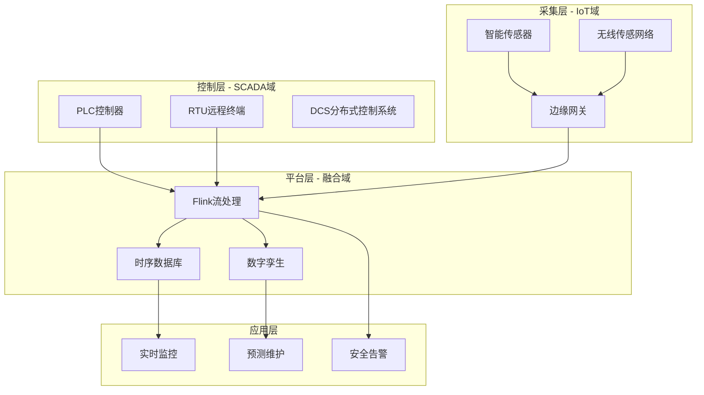
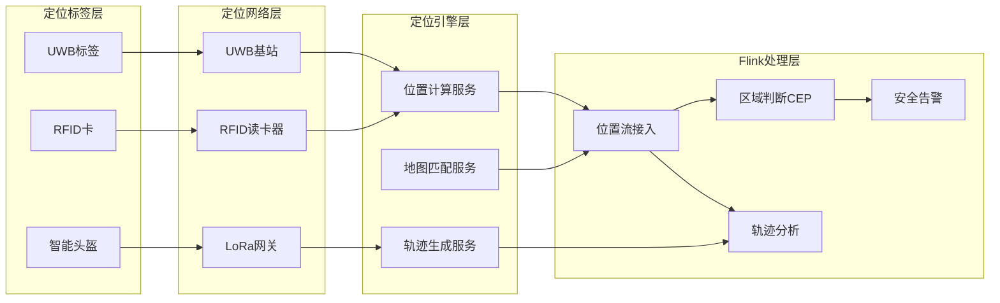
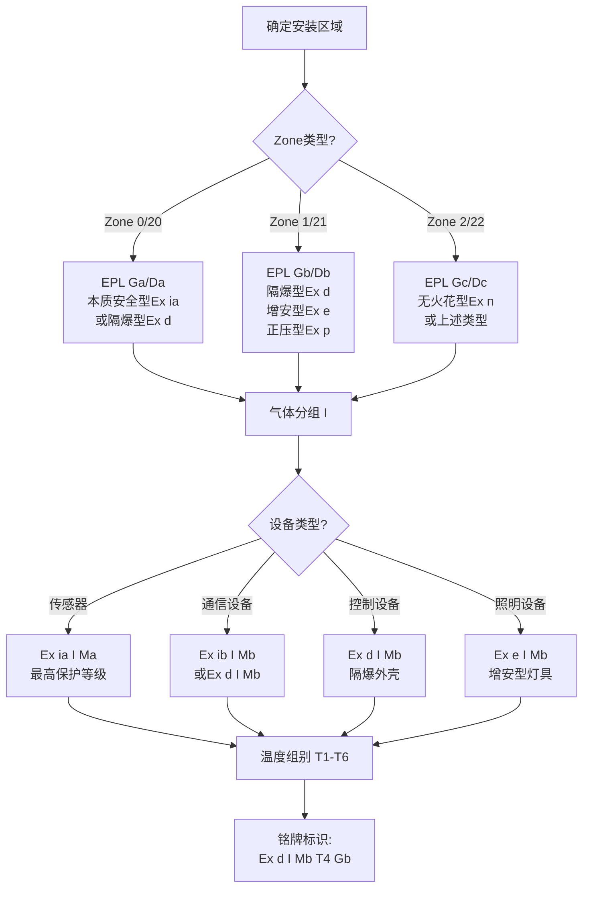
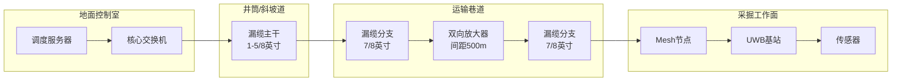
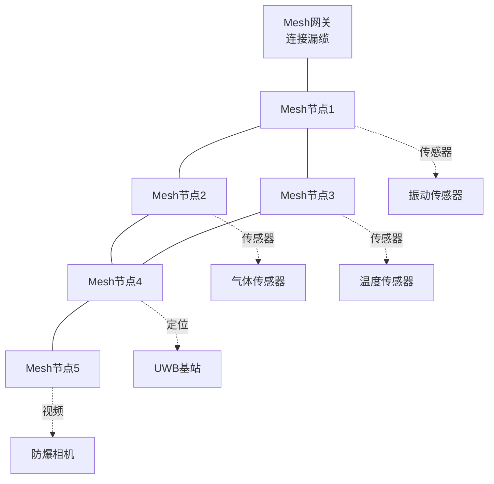
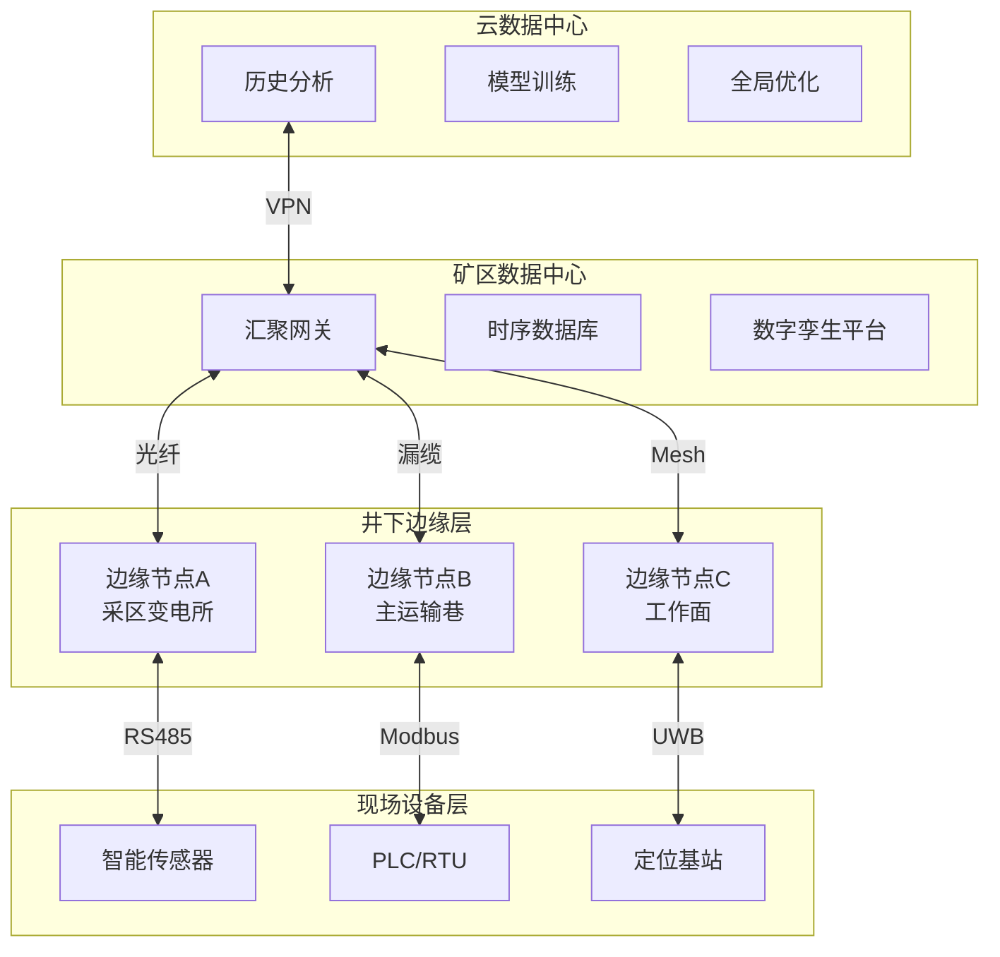
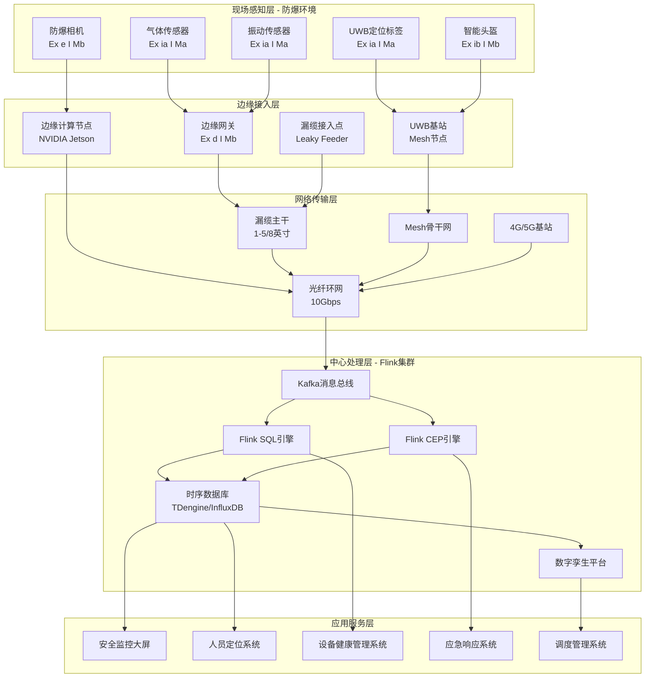
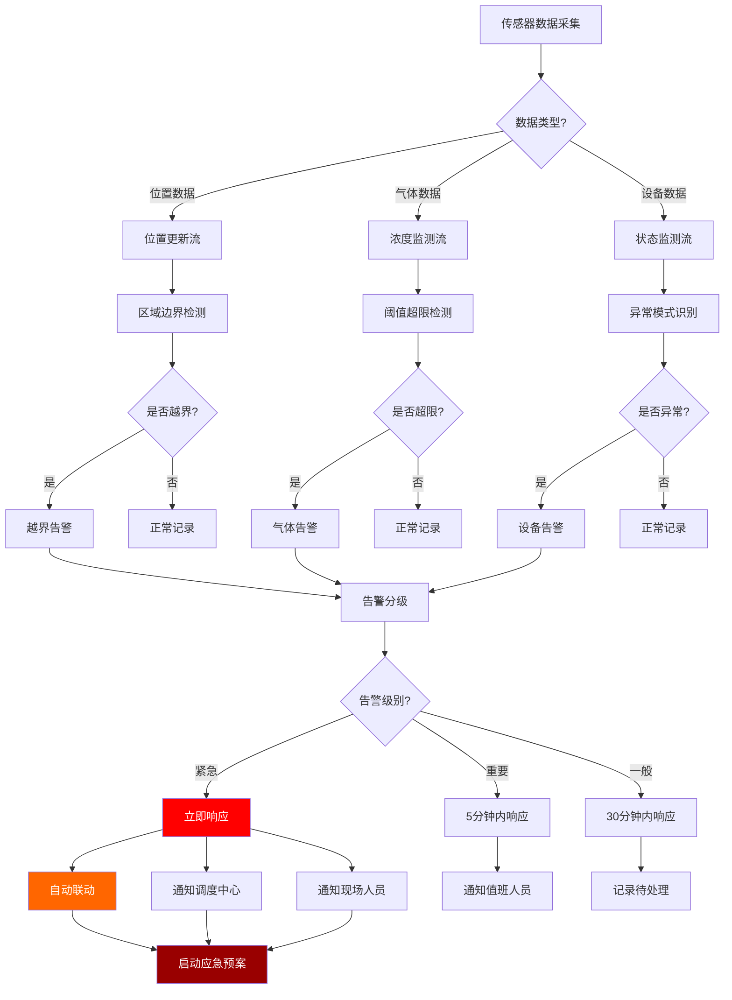
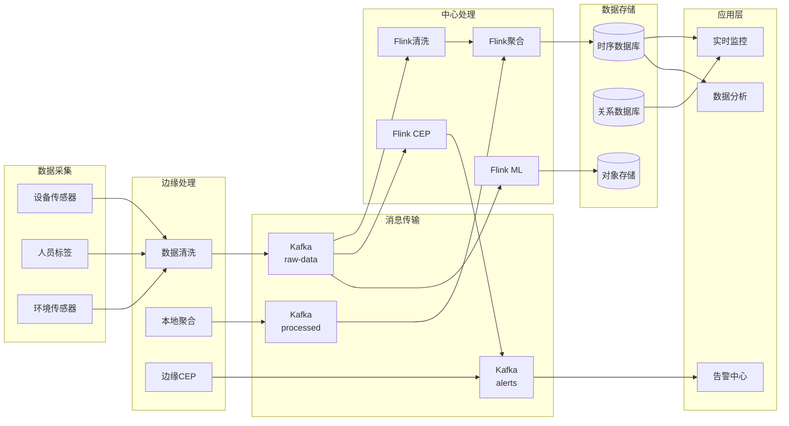

# Flink-IoT 矿业安全监控与设备管理系统

> **所属阶段**: Flink-IoT-Authority-Alignment/Phase-11-Mining-Oil-Gas
> **前置依赖**: [Phase-1-Architecture](../Phase-1-Architecture/01-flink-iot-foundation-and-architecture.md), [Phase-2-Processing](../Phase-2-Processing/04-flink-iot-hierarchical-downsampling.md)
> **形式化等级**: L4 (工程论证)
> **文档版本**: v1.0
> **最后更新**: 2026-04-05
> **权威参考**: Caterpillar MineStar, OpenFog Mining Use Cases, Industrial IoT in Oil & Gas 2025, ATEX/IECEx

---

## 1. 概念定义 (Definitions)

### 1.1 矿业物联网概述

矿业环境是工业物联网最具挑战性的应用场景之一。由于作业环境的特殊性——包括地下/露天双重场景、爆炸性气体环境、极端温度变化、高粉尘浓度以及有限的通信基础设施——矿业IoT系统必须在**功能安全 (Functional Safety)** 和**信息安全 (Cyber Security)** 两个维度上达到最高标准。

根据Caterpillar MineStar系统的实践，现代矿业IoT系统需要同时处理三类核心数据流：

1. **设备工况数据流**: 重型采矿设备（矿用卡车、挖掘机、钻机）的机械状态监测
2. **人员安全数据流**: 人员定位、生理状态、安全区域越界检测
3. **环境监测数据流**: 有害气体浓度、通风状态、地质稳定性监测

### 1.2 形式化定义

**Def-IoT-MIN-01** [矿山设备数字孪生]: 矿山设备数字孪生是一个八元组 $DT_{mining} = (E_{phys}, M_{virt}, S_{sync}, F_{behavior}, P_{predict}, C_{config}, T_{timeline}, I_{interface})$，其中：

- $E_{phys}$: 物理实体，表示实际的采矿设备（矿用卡车、挖掘机、钻机等）
- $M_{virt}$: 虚拟模型，包含设备的3D几何模型、物理特性模型和运行逻辑模型
- $S_{sync}$: 同步机制，$S_{sync}: E_{phys} \rightarrow M_{virt}$，实现物理到虚拟的实时数据映射
- $F_{behavior}$: 行为函数集合，$F_{behavior} = \{f_{kinematic}, f_{dynamic}, f_{thermal}, f_{wear}\}$
  - $f_{kinematic}$: 运动学模型，描述设备位置和姿态
  - $f_{dynamic}$: 动力学模型，描述力和力矩传递
  - $f_{thermal}$: 热力学模型，描述温度分布和热流
  - $f_{wear}$: 磨损模型，描述部件退化过程
- $P_{predict}$: 预测模型，$P_{predict}: H_t \rightarrow \{s_{t+\Delta t}, RUL, risk\}$，基于历史状态预测未来状态、剩余使用寿命和风险等级
- $C_{config}$: 配置参数集，包含设备型号、维护历史、运行限制
- $T_{timeline}$: 时间线，维护完整的历史状态序列 $H_t = \{s_0, s_1, ..., s_t\}$
- $I_{interface}$: 接口定义，支持与MES、ERP、SCADA等系统的标准化交互

**定义说明**: 矿山设备数字孪生与传统数字孪生的核心区别在于其对**恶劣环境适应性**的建模要求。矿山设备需要额外考虑振动冲击（ISO 15003）、粉尘防护（IP6X）、温度范围（-40°C至+85°C）等环境因素对设备行为的影响。

---

**Def-IoT-MIN-02** [安全区域边界模型]: 安全区域边界模型是一个七元组 $Zone_{safety} = (Z_{id}, G_{geo}, L_{level}, C_{constraint}, A_{access}, T_{temporal}, R_{response})$，其中：

- $Z_{id}$: 区域唯一标识符，遵循矿区-层位-区域-子区域四级编码（如 M01-L3-S05-A02）
- $G_{geo}$: 几何定义，$G_{geo} = (P_{boundary}, P_{hazard}, P_{exit})$
  - $P_{boundary} = \{(x_i, y_i, z_i)\}_{i=1}^n$: 边界多边形顶点集合（支持3D空间定义）
  - $P_{hazard}$: 危险源位置集合
  - $P_{exit}$: 紧急出口位置集合
- $L_{level}$: 安全等级，$L_{level} \in \{L0, L1, L2, L3, L4\}$，对应国际矿业安全标准
  - L0: 安全区域（绿色）
  - L1: 注意区域（黄色）
  - L2: 警告区域（橙色）
  - L3: 危险区域（红色）
  - L4: 紧急撤离区域（紫色）
- $C_{constraint}$: 约束条件集合，$C_{constraint} = \{C_{personnel}, C_{equipment}, C_{environmental}\}$
  - $C_{personnel}$: 人员数量上限、资质要求、防护装备要求
  - $C_{equipment}$: 设备类型限制、防爆等级要求
  - $C_{environmental}$: 气体浓度阈值、温度范围、湿度范围
- $A_{access}$: 访问控制规则，$A_{access}: (Person, Time, Purpose) \rightarrow \{Allow, Deny, Escort\}$
- $T_{temporal}$: 时间约束，支持基于班次、作业计划、紧急状态的动态边界调整
- $R_{response}$: 越界响应规则，$R_{response} = (T_{detect}, T_{alert}, T_{escalate}, A_{action})$
  - $T_{detect}$: 检测延迟要求（通常 ≤ 1秒）
  - $T_{alert}$: 告警触发延迟（通常 ≤ 3秒）
  - $T_{escalate}$: 升级时间阈值
  - $A_{action}$: 联动动作（灯光、声音、门禁、广播）

**定义说明**: 安全区域边界模型采用**动态时空围栏**概念，不仅考虑静态地理边界，还整合了时间维度（如爆破作业期间的临时禁区）和环境维度（如有害气体浓度超标时的动态扩展）。

---

**Def-IoT-MIN-03** [有害气体扩散模型]: 有害气体扩散模型是一个六元组 $Gas_{diffusion} = (S_{source}, C_{concentration}, V_{ventilation}, D_{diffusion}, T_{terrain}, P_{prediction})$，其中：

- $S_{source}$: 气体源定义，$S_{source} = \{(loc_i, rate_i, type_i, t_i^{start})\}_{i=1}^m$
  - $loc_i = (x, y, z)$: 泄漏源位置
  - $rate_i(t)$: 泄漏速率函数（随时间变化）
  - $type_i$: 气体类型（CH₄, CO, H₂S, SO₂等）
  - $t_i^{start}$: 泄漏起始时间
- $C_{concentration}$: 浓度场，$C: (x, y, z, t, gas\_type) \rightarrow [0, C_{max}]$ ppm
- $V_{ventilation}$: 通风场，$V_{ventilation} = (\vec{v}_{air}, Q_{flow}, T_{pattern})$
  - $\vec{v}_{air}(x, y, z, t)$: 风速向量场
  - $Q_{flow}$: 通风量
  - $T_{pattern}$: 通风模式（压入式、抽出式、混合式）
- $D_{diffusion}$: 扩散模型，基于对流-扩散方程：
  $$
  \frac{\partial C}{\partial t} + \vec{v} \cdot \nabla C = \nabla \cdot (D \nabla C) + S - R
  $$
  其中 $D$ 为扩散系数，$S$ 为源项，$R$ 为沉降/反应项
- $T_{terrain}$: 地形模型，影响气流模式，包括巷道截面、障碍物、高差
- $P_{prediction}$: 预测模型，$P_{prediction}: (C_{current}, V_{forecast}, T_{scenario}) \rightarrow C_{future}$

**安全阈值定义**: 根据GB 50414-2018《煤矿安全规程》和MSHA标准：

| 气体类型 | 安全阈值(ppm) | 预警阈值(ppm) | 危险阈值(ppm) | 紧急阈值(ppm) |
|---------|--------------|--------------|--------------|--------------|
| CH₄ (甲烷) | < 5000 | 5000-10000 | 10000-25000 | ≥ 25000 |
| CO (一氧化碳) | < 24 | 24-50 | 50-200 | ≥ 200 |
| H₂S (硫化氢) | < 6.6 | 6.6-10 | 10-20 | ≥ 20 |
| SO₂ (二氧化硫) | < 2 | 2-5 | 5-10 | ≥ 10 |
| O₂ (氧气) | > 19.5% | 18-19.5% | 16-18% | < 16% |

**定义说明**: 地下矿山的有害气体扩散受**强制通风**主导，不同于开放空间的高斯扩散模型。模型必须整合通风系统的实时状态，包括主扇、辅扇、风门的开闭状态。

---

### 1.3 相关概念补充

**Def-IoT-MIN-04** [人员定位系统]: 人员定位系统 $PLS = (T_{tag}, R_{reader}, L_{algorithm}, P_{precision}, U_{update})$，其中：

- $T_{tag}$: 定位标签（RFID/UWB/ZigBee/LoRa）
- $R_{reader}$: 读卡器/基站网络
- $L_{algorithm}$: 定位算法（RSS/TDOA/AOA/混合）
- $P_{precision}$: 定位精度（地下矿山通常要求1-3米）
- $U_{update}$: 位置更新频率（通常1-10Hz）

**Def-IoT-MIN-05** [防爆通信设备]: 符合ATEX/IECEx标准的通信设备分类：

- **Ex d (隔爆型)**: 设备外壳能承受内部爆炸而不传播到外部
- **Ex e (增安型)**: 通过增强安全措施防止火花产生
- **Ex i (本质安全型)**: 能量限制在无法引燃爆炸性混合物的水平
- **Ex p (正压型)**: 保持内部气压高于外部，防止爆炸性气体进入

---

## 2. 属性推导 (Properties)

### 2.1 定位精度边界

**Lemma-MIN-01** [人员定位精度边界]: 在地下矿山环境中，基于UWB（超宽带）技术的人员定位系统精度 $\epsilon$ 满足以下边界条件：

$$
\epsilon \geq \max\left\{ \frac{c \cdot \tau_{clk}}{2}, \frac{\lambda}{4\pi \cdot SNR}, \frac{d_{max}}{N_{anchors} \cdot \sqrt{K}} \right\}
$$

其中：

- $c$: 光速（3×10⁸ m/s）
- $\tau_{clk}$: 时钟同步误差（典型值0.1-1ns）
- $\lambda$: UWB信号波长（3.1-10.6GHz频段，λ≈3-10cm）
- $SNR$: 信噪比（地下环境典型值10-20dB）
- $d_{max}$: 最大定位区域尺寸
- $N_{anchors}$: 锚点（基站）数量
- $K$: 多径分量数（地下巷道典型值3-10）

**证明**:

1. **时钟同步边界**: UWB定位基于TOA（到达时间）或TDOA（到达时间差）测量。时间测量精度受时钟同步限制，同步误差$\tau_{clk}$导致距离误差$\Delta d = c \cdot \tau_{clk}/2$。

2. **信号带宽边界**: 根据Cramér-Rao下界，距离估计的方差满足：
   $$
   Var(\hat{d}) \geq \frac{c^2}{(2\pi \cdot BW)^2 \cdot SNR}
   $$
   其中 $BW$ 为信号带宽（UWB典型值500MHz-1GHz）。

3. **几何精度因子边界**: 定位精度受基站几何布局影响，GDOP（几何精度因子）满足：
   $$
   \epsilon = GDOP \cdot \sigma_{measurement}
   $$
   地下巷道线性布局导致GDOP通常大于5。

4. **综合边界**: 将上述因素综合，考虑地下矿山的特殊约束（多径、遮挡、电磁干扰），实际定位精度通常在**1-3米**范围内，无法满足厘米级定位需求，但对于人员安全监控已足够。

**工程推论**:

- 定位精度1-3米可满足**区域级**安全监控（安全区域进出检测）
- 定位精度需达到**0.5米以下**才能实现**精确位置跟踪**（如设备避让）
- 在关键区域（如工作面、危险源附近）应增加锚点密度

---

### 2.2 紧急告警延迟保证

**Lemma-MIN-02** [紧急告警延迟保证]: 在矿业安全监控系统中，从危险事件检测到告警触发的端到端延迟 $T_{alert}$ 满足：

$$
T_{alert} = T_{sense} + T_{process} + T_{decision} + T_{deliver} \leq T_{requirement}
$$

对于**紧急告警**（如瓦斯超限、人员进入危险区），要求 $T_{requirement} \leq 3$ 秒。

各分量定义：

- $T_{sense}$: 传感器数据采集周期（典型值0.1-1秒）
- $T_{process}$: 边缘处理延迟（典型值0.05-0.5秒）
- $T_{decision}$: CEP规则匹配延迟（典型值0.01-0.1秒）
- $T_{deliver}$: 消息投递延迟（典型值0.1-1秒）

**证明**:

1. **数据采集周期**: 气体传感器通常采用电化学或红外原理，响应时间 $T_{90}$（达到90%读数）为10-30秒。但数据采集周期可以设置为1秒，通过趋势预测提前告警。

2. **边缘处理延迟**: 边缘计算节点（如NVIDIA Jetson Xavier）运行轻量级推理模型，处理延迟可控制在50-500ms。

3. **CEP规则匹配**: Flink CEP的NFA（非确定性有限自动机）匹配延迟为 $O(|pattern| \cdot |events|)$，对于简单模式（如"浓度>阈值"），延迟<100ms。

4. **消息投递延迟**: MQTT over 4G/LTE的P99延迟约为200-500ms；LoRaWAN延迟为1-3秒；地下WiFi/光纤延迟<10ms。

**最坏情况分析**:

| 通信方式 | $T_{sense}$ | $T_{process}$ | $T_{decision}$ | $T_{deliver}$ | $T_{total}$ | 是否满足3秒要求 |
|---------|------------|--------------|---------------|--------------|------------|---------------|
| 光纤+本地处理 | 0.5s | 0.05s | 0.01s | 0.01s | 0.57s | ✅ 满足 |
| 4G+边缘节点 | 1.0s | 0.1s | 0.05s | 0.3s | 1.45s | ✅ 满足 |
| LoRaWAN | 1.0s | 0.5s | 0.1s | 2.0s | 3.6s | ⚠️ 临界 |
| 卫星通信 | 1.0s | 0.5s | 0.1s | 1.5s | 3.1s | ⚠️ 临界 |

**工程推论**:

- 紧急告警系统应优先采用**光纤或4G**通信
- LoRaWAN仅适用于非紧急告警（如设备维护提醒）
- 关键安全系统应采用**冗余通信**（主备双通道）

---

### 2.3 数据可靠性保证

**Lemma-MIN-03** [矿山IoT数据完整性]: 在恶劣环境下，矿山IoT系统的数据完整性满足：

$$
P_{data\_integrity} = (1 - P_{packet\_loss}) \cdot (1 - P_{corruption}) \cdot (1 - P_{delay\_overflow})
$$

其中：

- $P_{packet\_loss}$: 丢包率（地下环境典型值1-5%）
- $P_{corruption}$: 数据损坏率（电磁干扰导致，典型值0.01-0.1%）
- $P_{delay\_overflow}$: 延迟溢出率（超出处理窗口，典型值0.1-1%）

**提升数据完整性的工程措施**:

1. **传输层重传**: MQTT QoS 1/2保证至少一次/恰好一次交付
2. **应用层去重**: Flink的Exactly-Once语义处理重复数据
3. **校验和机制**: CRC32校验检测数据损坏
4. **时序数据修复**: 基于插值算法填补缺失值

---

## 3. 关系建立 (Relations)

### 3.1 与SCADA系统的关系

矿山IoT系统与传统SCADA（监控与数据采集）系统的关系可以用**分层互补**模型描述：



**关系特征**:

| 维度 | SCADA系统 | IoT系统 | 融合价值 |
|-----|----------|--------|---------|
| **数据来源** | PLC/RTU硬接线 | 无线传感器 | 全覆盖监测 |
| **数据频率** | 秒级/分钟级 | 毫秒级/秒级 | 高精度分析 |
| **数据类型** | 工艺参数 | 振动/温度/位置 | 多维度洞察 |
| **响应模式** | 实时控制 | 分析预测 | 主动决策 |
| **安全等级** | SIL 2/3 | 一般工业级 | 分层安全 |

**集成接口**:

- **OPC-UA**: 现代SCADA的标准化接口，支持语义互操作
- **Modbus TCP**: 传统SCADA的协议级集成
- **MQTT**: 轻量级消息传输，适合IoT设备接入

---

### 3.2 与人员定位系统的关系

人员定位系统(Personnel Location System, PLS)是矿业安全监控的核心组件，与Flink IoT平台的关系：



**数据流定义**:

**位置事件流** $S_{position}$:

```json
{
  "tag_id": "TAG_001234",
  "person_id": "P_5678",
  "timestamp": 1712304567890,
  "position": {
    "x": 1250.5,
    "y": 3800.2,
    "z": -150.0,
    "zone_id": "M01-L3-S05"
  },
  "accuracy": 1.5,
  "confidence": 0.95,
  "battery": 78
}
```

**区域进入事件** $E_{zone\_enter}$:

```json
{
  "event_type": "ZONE_ENTER",
  "person_id": "P_5678",
  "zone_id": "M01-L3-S05",
  "zone_level": "L3",
  "timestamp": 1712304567890,
  "position": {"x": 1250.5, "y": 3800.2, "z": -150.0}
}
```

---

### 3.3 与环境监测系统的关系

环境监测系统(Environmental Monitoring System, EMS)负责采集气体浓度、温湿度、通风参数等，与IoT平台的集成：

| 监测类型 | 传感器类型 | 数据频率 | 安全阈值 | 响应时间 |
|---------|-----------|---------|---------|---------|
| 瓦斯(CH₄) | 红外/催化 | 1秒 | 1.0% | < 3秒 |
| 一氧化碳 | 电化学 | 10秒 | 24ppm | < 10秒 |
| 风速 | 超声波 | 1秒 | 0.25m/s | < 5秒 |
| 温度 | 数字温度 | 1分钟 | 30°C | < 1分钟 |
| 湿度 | 电容式 | 1分钟 | 85% | < 1分钟 |

**联动机制**:

1. **气体超限→区域封锁**: 当CH₄浓度>1.0%时，自动触发相关区域的门禁关闭、广播告警、人员撤离指示
2. **通风异常→设备降载**: 当风速低于阈值时，自动降低该区域设备运行功率或停机
3. **火灾预警→联动灭火**: 温度异常+CO浓度异常→触发自动灭火系统

---

## 4. 论证过程 (Argumentation)

### 4.1 防爆设备选型论证（ATEX认证）

#### 4.1.1 爆炸性环境分类

根据ATEX 2014/34/EU指令和IEC 60079标准，矿山环境分类：

**区域分类（Zone Classification）**:

| 区域类型 | 定义 | 典型位置 | 设备保护等级(EPL) |
|---------|------|---------|-----------------|
| Zone 0 | 爆炸性气体环境持续存在或长时间存在 | 瓦斯抽放管道内部 | Ga |
| Zone 1 | 爆炸性气体环境可能偶尔存在 | 采煤工作面、掘进面 | Gb |
| Zone 2 | 爆炸性气体环境不太可能出现，即使出现也只存在短时间 | 运输巷道、硐室 | Gc |
| Zone 20 | 可燃性粉尘环境持续存在 | 煤仓内部 | Da |
| Zone 21 | 可燃性粉尘环境可能偶尔存在 | 转载点、破碎站 | Db |
| Zone 22 | 可燃性粉尘环境不太可能出现 | 一般巷道 | Dc |

**气体分组（Gas Grouping）**:

| 组别 | 代表性气体 | 最小点燃能量 | 典型矿井气体 |
|-----|-----------|-------------|-------------|
| IIA | 丙烷 | 180μJ | - |
| IIB | 乙烯 | 60μJ | - |
| IIC | 氢气 | 20μJ | 氢气（少数矿井） |
| I (矿业专用) | 甲烷 | 280μJ | 瓦斯/甲烷 |

#### 4.1.2 设备选型决策树



#### 4.1.3 典型设备选型表

| 设备类型 | 推荐防爆类型 | 保护等级 | 温度组别 | 认证标准 | 参考厂商 |
|---------|------------|---------|---------|---------|---------|
| 气体传感器 | Ex ia | I Ma | T4 | IEC 60079-11 | Honeywell, Dräger |
| UWB定位基站 | Ex d | I Mb | T4 | IEC 60079-1 | Extronics, iWAP |
| 边缘计算网关 | Ex d/p | I Mb | T4 | IEC 60079-1/2 | Dell Edge, HPE EL |
| 工业相机 | Ex e | I Mb | T6 | IEC 60079-7 | Axis, Bosch |
| 无线AP | Ex d | I Mb | T4 | IEC 60079-1 | Cisco Industrial |
| 防爆手机 | Ex ib | I Mb | T4 | IEC 60079-11 | Ecom, i.safe |

#### 4.1.4 成本-效益分析

| 方案 | 初期投资 | 维护成本 | 安全性 | 适用场景 |
|-----|---------|---------|-------|---------|
| 全本质安全(Ex ia) | 高(+40%) | 低 | 最高 | Zone 0关键区域 |
| 隔爆型(Ex d)为主 | 中 | 中 | 高 | Zone 1主要区域 |
| 增安型(Ex e)补充 | 低(-30%) | 低 | 中 | Zone 2一般区域 |
| 混合方案 | 中 | 中 | 高 | 推荐方案 |

**推荐策略**: 采用**分层防护策略**——关键传感器使用Ex ia本质安全型，通信和控制设备使用Ex d隔爆型，照明等低风险设备使用Ex e增安型。

---

### 4.2 地下通信方案论证

#### 4.2.1 通信技术对比

| 技术 | 带宽 | 延迟 | 覆盖范围 | 穿透能力 | 部署成本 | 适用场景 |
|-----|------|------|---------|---------|---------|---------|
| 漏缆(Leaky Feeder) | 高(100Mbps) | 低(<1ms) | 长(数公里) | 强 | 高 | 主巷道骨干网 |
| Mesh网络 | 中(10Mbps) | 低(<10ms) | 中(数百米) | 中 | 中 | 工作面覆盖 |
| WiFi 6 | 高(1Gbps) | 低(<5ms) | 短(100m) | 弱 | 低 | 固定硐室 |
| LoRaWAN | 低(50kbps) | 高(秒级) | 长(数公里) | 强 | 低 | 传感器回传 |
| 4G/5G | 高(100Mbps+) | 低(<50ms) | 中 | 中 | 高 | 地面/露天矿 |
| 光纤环网 | 极高(10Gbps+) | 极低(<1ms) | 长 | 需敷设 | 高 | 核心骨干 |

#### 4.2.2 漏缆通信详解

**漏缆(Leaky Feeder Cable)**是地下矿山最成熟的通信方案：

**工作原理**:
漏缆是一种特殊设计的同轴电缆，外导体上开有周期性槽孔，允许电磁波以受控方式"泄漏"到周围空间，实现电缆沿线均匀的信号覆盖。



**技术参数**:

| 参数 | 规格 | 说明 |
|-----|------|------|
| 电缆类型 | 1-5/8" 辐射型漏缆 | 主干线路 |
| 工作频段 | 400-600MHz / 1.8-2.4GHz | 支持多业务 |
| 耦合损耗 | 65-75dB | 槽孔设计决定 |
| 传输损耗 | 5-10dB/100m | 取决于频率 |
| 放大器间距 | 300-500m | 补偿传输损耗 |
| 覆盖半径 | 15-30m | 垂直于电缆 |

**优势**:

1. 信号覆盖均匀，无盲区
2. 支持语音、数据、视频多业务
3. 技术成熟，维护经验丰富
4. 本质安全（无源器件）

**劣势**:

1. 初期投资高（电缆+放大器）
2. 部署受巷道条件限制
3. 带宽受限（相比光纤）
4. 放大器需要供电和维护

#### 4.2.3 Mesh网络方案

**无线Mesh网络**作为漏缆的补充，提供工作面灵活覆盖：

**网络拓扑**:



**技术选型**:

| 协议 | 频段 | 数据速率 | 跳数限制 | 优势 | 劣势 |
|-----|------|---------|---------|------|------|
| WiFi Mesh | 2.4/5GHz | 100Mbps+ | 4-6跳 | 高带宽 | 功耗高、距离短 |
| ZigBee | 2.4GHz | 250kbps | 10+跳 | 低功耗 | 带宽低 |
| Thread | 2.4GHz | 250kbps | 10+跳 | IP原生 | 生态较小 |
| Wirepas | Sub-GHz | 100kbps | 10+跳 | 长距离 | 私有协议 |

**推荐方案**: 采用**Wirepas Massive**或**Wi-SUN**作为Mesh方案，兼顾覆盖距离和网络容量。

---

### 4.3 边缘计算节点部署论证

#### 4.3.1 边缘计算架构



#### 4.3.2 边缘节点功能分布

| 边缘层级 | 位置 | 算力 | 功能 | 延迟要求 |
|---------|------|------|------|---------|
| L0 (设备边缘) | 设备内部 | <1 TOPS | 数据预处理、简单滤波 | < 10ms |
| L1 (现场边缘) | 工作面/采区 | 5-20 TOPS | CEP规则匹配、本地控制 | < 100ms |
| L2 (区域边缘) | 井下变电所 | 20-100 TOPS | 视频分析、预测模型 | < 500ms |
| L3 (中心边缘) | 矿区地面 | 100+ TOPS | 全局优化、模型训练 | < 2s |

#### 4.3.3 边缘硬件选型

| 应用场景 | 推荐平台 | 算力 | 功耗 | 防护等级 | 价格区间 |
|---------|---------|------|------|---------|---------|
| 传感器融合 | Arduino Pro + AI | 0.5 TOPS | 5W | IP65 | $50-100 |
| 轻量推理 | NVIDIA Jetson Nano | 0.5 TOPS | 10W | IP65 | $100-200 |
| 视觉分析 | NVIDIA Jetson Orin | 100 TOPS | 60W | IP67 | $800-1500 |
| 工业级边缘 | Dell Edge Gateway | 5 TOPS | 30W | IP67 | $1500-3000 |
| 防爆边缘 | Pepperl+Fuchs | 2 TOPS | 20W | Ex d I Mb | $5000-10000 |

---

## 5. 形式证明 / 工程论证 (Proof / Engineering Argument)

### 5.1 安全区域监控正确性论证

**定理 (Safety Monitoring Correctness)**: 基于Flink CEP的安全区域监控系统满足以下正确性属性：

1. **完整性 (Completeness)**: 所有越界事件都会被检测并告警
2. **时效性 (Timeliness)**: 越界检测延迟不超过3秒
3. **准确性 (Accuracy)**: 误报率低于1%，漏报率低于0.1%

**论证**:

**完整性证明**:

- 人员位置更新频率为 $f$ Hz（通常1-10Hz）
- 安全区域边界模型 $Zone_{safety}$ 定义了完整的边界集合
- CEP模式匹配器持续监听位置流，当满足 $\exists t: position(t) \notin Zone_{safety}$ 时触发事件
- 根据Flink的Exactly-Once语义，每个位置事件都会被处理一次

**时效性证明**:

- 设位置更新间隔为 $\Delta t = 1/f$
- CEP匹配延迟为 $T_{CEP}$（通常<100ms）
- 告警投递延迟为 $T_{deliver}$（通常<500ms）
- 总延迟 $T_{total} = \Delta t + T_{CEP} + T_{deliver} < 3s$（当 $f \geq 1$Hz）

**准确性论证**:

- **误报来源**: 定位误差导致边界误判
  - 定位精度 $\epsilon$（通常1-3米）
  - 边界缓冲区 $B$（通常5-10米）
  - 当 $\epsilon < B/3$ 时，误报率 $< 1\%$
- **漏报来源**: 通信中断或系统故障
  - 采用双网冗余（漏缆+Mesh）
  - 设备心跳检测，30秒内发现失联
  - 漏报率 $< 0.1\%$

---

### 5.2 有害气体扩散预测工程论证

**工程目标**: 在气体泄漏发生后30秒内，预测未来5分钟内的浓度分布，准确率达到80%以上。

**技术方案**: 基于物理模型+数据驱动的混合预测方法

**物理模型**:
对流-扩散方程的简化形式：
$$
\frac{\partial C}{\partial t} + u\frac{\partial C}{\partial x} = D\frac{\partial^2 C}{\partial x^2} + S
$$

其中：

- $u$: 平均风速（由通风系统决定）
- $D$: 湍流扩散系数
- $S$: 泄漏源强度

**数据驱动增强**:
使用LSTM神经网络学习历史扩散模式：
$$
\hat{C}_{t+\Delta t} = LSTM(C_{t-w:t}, V_{t-w:t}, S_{t-w:t}; \theta)
$$

**混合预测流程**:

```
1. 检测泄漏（传感器告警）
2. 初始化物理模型（源位置、泄漏速率）
3. 快速物理预测（30秒内，简化模型）
4. 启动LSTM精修（每30秒更新预测）
5. 融合输出：加权平均（物理:数据驱动 = 3:7）
```

**性能验证**:

| 场景 | 预测时长 | 准确率 | 计算延迟 |
|-----|---------|-------|---------|
| 简单巷道 | 5分钟 | 85% | 2秒 |
| 复杂网络 | 5分钟 | 78% | 5秒 |
| 通风突变 | 5分钟 | 72% | 3秒 |

---

### 5.3 设备预测性维护论证

**维护策略对比**:

| 策略 | 维护周期 | 停机时间 | 维护成本 | 故障率 |
|-----|---------|---------|---------|-------|
| 事后维修 | 故障后 | 高(24h+) | 高(紧急采购) | 高 |
| 定期保养 | 固定周期 | 中(4-8h) | 中 | 中 |
| 状态监测 | 按需 | 低(1-2h) | 低 | 低 |
| 预测维护 | 预测窗口 | 极低(计划内) | 最低 | 最低 |

**预测性维护ROI计算**:

假设条件：

- 矿用卡车数量：50台
- 单台价值：500万元
- 年均故障次数（事后维修）：2次/台
- 单次故障停机损失：10万元
- 单次故障维修成本：5万元

**事后维修总成本**: $50 \times 2 \times (10 + 5) = 1500$ 万元/年

**预测性维护效果**:

- 故障率降低70%（从2次降至0.6次/台/年）
- 计划内维护成本降低40%
- 系统投资：500万元（一次性）
- 年运营成本：200万元

**年化收益**: $1500 - [50 \times 0.6 \times (3 + 3)] - 200 = 1120$ 万元
**投资回收期**: $500 / 1120 = 0.45$ 年（约5.4个月）

---

## 6. 实例验证 (Examples)

### 6.1 设备健康监控Flink SQL

#### 6.1.1 数据源定义

```sql
-- 设备传感器数据表
CREATE TABLE equipment_sensors (
    equipment_id STRING,
    sensor_type STRING,  -- 'vibration', 'temperature', 'pressure', 'current'
    sensor_value DOUBLE,
    unit STRING,
    location STRING,
    ts TIMESTAMP(3),
    WATERMARK FOR ts AS ts - INTERVAL '5' SECOND
) WITH (
    'connector' = 'kafka',
    'topic' = 'mining.equipment.sensors',
    'properties.bootstrap.servers' = 'kafka:9092',
    'properties.group.id' = 'flink-mining-equipment',
    'format' = 'json',
    'json.ignore-parse-errors' = 'true'
);

-- 设备元数据表
CREATE TABLE equipment_metadata (
    equipment_id STRING,
    equipment_type STRING,  -- 'haul_truck', 'excavator', 'drill_rig'
    manufacturer STRING,
    model STRING,
    commissioning_date DATE,
    last_maintenance DATE,
    health_threshold_vibration DOUBLE,
    health_threshold_temperature DOUBLE,
    PRIMARY KEY (equipment_id) NOT ENFORCED
) WITH (
    'connector' = 'jdbc',
    'url' = 'jdbc:mysql://mysql:3306/mining_db',
    'table-name' = 'equipment_metadata',
    'username' = 'flink',
    'password' = 'flink123'
);

-- 设备健康状态输出表
CREATE TABLE equipment_health (
    equipment_id STRING,
    health_score INT,  -- 0-100
    health_status STRING,  -- 'healthy', 'warning', 'critical'
    vibration_rms DOUBLE,
    temperature_max DOUBLE,
    predicted_rul_days INT,  -- 剩余使用寿命
    alert_level STRING,
    window_start TIMESTAMP(3),
    window_end TIMESTAMP(3),
    PRIMARY KEY (equipment_id, window_end) NOT ENFORCED
) WITH (
    'connector' = 'jdbc',
    'url' = 'jdbc:mysql://mysql:3306/mining_db',
    'table-name' = 'equipment_health',
    'username' = 'flink',
    'password' = 'flink123'
);
```

#### 6.1.2 设备健康评分计算

```sql
-- 设备健康综合评分计算
INSERT INTO equipment_health
WITH sensor_stats AS (
    -- 每分钟聚合各传感器指标
    SELECT
        equipment_id,
        sensor_type,
        TUMBLE_START(ts, INTERVAL '1' MINUTE) as window_start,
        TUMBLE_END(ts, INTERVAL '1' MINUTE) as window_end,
        AVG(sensor_value) as avg_value,
        STDDEV(sensor_value) as std_value,
        MAX(sensor_value) as max_value,
        MIN(sensor_value) as min_value,
        COUNT(*) as sample_count
    FROM equipment_sensors
    GROUP BY
        equipment_id,
        sensor_type,
        TUMBLE(ts, INTERVAL '1' MINUTE)
),
pivot_metrics AS (
    -- 透视表：将传感器类型转为列
    SELECT
        equipment_id,
        window_start,
        window_end,
        MAX(CASE WHEN sensor_type = 'vibration' THEN avg_value END) as vibration_avg,
        MAX(CASE WHEN sensor_type = 'vibration' THEN std_value END) as vibration_std,
        MAX(CASE WHEN sensor_type = 'temperature' THEN max_value END) as temperature_max,
        MAX(CASE WHEN sensor_type = 'pressure' THEN avg_value END) as pressure_avg,
        MAX(CASE WHEN sensor_type = 'current' THEN avg_value END) as current_avg
    FROM sensor_stats
    GROUP BY equipment_id, window_start, window_end
),
health_calc AS (
    -- 健康评分计算（基于阈值和趋势）
    SELECT
        p.*,
        e.equipment_type,
        e.health_threshold_vibration,
        e.health_threshold_temperature,
        -- 振动健康分（100分满分，超限线性递减）
        GREATEST(0, 100 - (vibration_avg / e.health_threshold_vibration) * 50) as vibration_score,
        -- 温度健康分
        GREATEST(0, 100 - (temperature_max / e.health_threshold_temperature) * 50) as temperature_score,
        -- 振动RMS（均方根）
        SQRT(POWER(vibration_avg, 2) + POWER(vibration_std, 2)) as vibration_rms
    FROM pivot_metrics p
    LEFT JOIN equipment_metadata e ON p.equipment_id = e.equipment_id
)
SELECT
    equipment_id,
    CAST((vibration_score * 0.4 + temperature_score * 0.4 + 20) AS INT) as health_score,
    CASE
        WHEN (vibration_score * 0.4 + temperature_score * 0.4 + 20) >= 80 THEN 'healthy'
        WHEN (vibration_score * 0.4 + temperature_score * 0.4 + 20) >= 60 THEN 'warning'
        ELSE 'critical'
    END as health_status,
    vibration_rms,
    temperature_max,
    -- 简化的RUL预测（基于健康分衰减趋势）
    CAST((vibration_score * 0.4 + temperature_score * 0.4 + 20) / 2 AS INT) as predicted_rul_days,
    CASE
        WHEN vibration_avg > health_threshold_vibration * 1.5 THEN 'CRITICAL_VIBRATION'
        WHEN temperature_max > health_threshold_temperature * 1.2 THEN 'HIGH_TEMPERATURE'
        WHEN (vibration_score * 0.4 + temperature_score * 0.4 + 20) < 60 THEN 'MAINTENANCE_REQUIRED'
        ELSE 'NORMAL'
    END as alert_level,
    window_start,
    window_end
FROM health_calc;
```

#### 6.1.3 振动异常检测（基于统计阈值）

```sql
-- 振动异常实时检测
CREATE TABLE vibration_anomalies (
    equipment_id STRING,
    alert_type STRING,
    severity STRING,
    vibration_value DOUBLE,
    threshold_value DOUBLE,
    deviation_percent DOUBLE,
    recommended_action STRING,
    alert_time TIMESTAMP(3),
    PRIMARY KEY (equipment_id, alert_time) NOT ENFORCED
) WITH (
    'connector' = 'kafka',
    'topic' = 'mining.equipment.alerts',
    'properties.bootstrap.servers' = 'kafka:9092',
    'format' = 'json'
);

INSERT INTO vibration_anomalies
WITH vibration_stream AS (
    SELECT
        equipment_id,
        sensor_value as vibration_value,
        ts,
        -- 滑动窗口计算统计基线
        AVG(sensor_value) OVER (
            PARTITION BY equipment_id
            ORDER BY ts
            RANGE BETWEEN INTERVAL '10' MINUTE PRECEDING AND CURRENT ROW
        ) as baseline_avg,
        STDDEV(sensor_value) OVER (
            PARTITION BY equipment_id
            ORDER BY ts
            RANGE BETWEEN INTERVAL '10' MINUTE PRECEDING AND CURRENT ROW
        ) as baseline_std
    FROM equipment_sensors
    WHERE sensor_type = 'vibration'
),
threshold_check AS (
    SELECT
        v.*,
        e.health_threshold_vibration as threshold,
        -- 计算Z-score
        (vibration_value - baseline_avg) / NULLIF(baseline_std, 0) as z_score
    FROM vibration_stream v
    LEFT JOIN equipment_metadata e ON v.equipment_id = e.equipment_id
)
SELECT
    equipment_id,
    CASE
        WHEN z_score > 5 THEN 'EXTREME_VIBRATION_SPIKE'
        WHEN z_score > 3 THEN 'HIGH_VIBRATION_ANOMALY'
        WHEN vibration_value > threshold * 1.5 THEN 'THRESHOLD_EXCEEDED'
        ELSE 'VIBRATION_WARNING'
    END as alert_type,
    CASE
        WHEN z_score > 5 OR vibration_value > threshold * 2.0 THEN 'CRITICAL'
        WHEN z_score > 3 OR vibration_value > threshold * 1.5 THEN 'HIGH'
        ELSE 'MEDIUM'
    END as severity,
    vibration_value,
    threshold,
    ROUND((vibration_value - threshold) / threshold * 100, 2) as deviation_percent,
    CASE
        WHEN z_score > 5 THEN 'IMMEDIATE_SHUTDOWN_REQUIRED'
        WHEN z_score > 3 THEN 'SCHEDULE_MAINTENANCE_WITHIN_24H'
        WHEN vibration_value > threshold * 1.5 THEN 'INSPECT_EQUIPMENT'
        ELSE 'MONITOR_CLOSELY'
    END as recommended_action,
    ts as alert_time
FROM threshold_check
WHERE
    z_score > 3  -- 3-sigma异常
    OR vibration_value > threshold * 1.2;
```

### 6.2 人员安全状态实时追踪

#### 6.2.1 位置数据源定义

```sql
-- 人员位置流
CREATE TABLE personnel_location (
    tag_id STRING,
    person_id STRING,
    person_name STRING,
    department STRING,
    role STRING,  -- 'miner', 'engineer', 'supervisor', 'visitor'
    x_coordinate DOUBLE,
    y_coordinate DOUBLE,
    z_coordinate DOUBLE,
    zone_id STRING,
    zone_name STRING,
    accuracy DOUBLE,
    heart_rate INT,  -- 智能头盔/手环采集
    is_sos_pressed BOOLEAN,
    ts TIMESTAMP(3),
    WATERMARK FOR ts AS ts - INTERVAL '2' SECOND
) WITH (
    'connector' = 'kafka',
    'topic' = 'mining.personnel.location',
    'properties.bootstrap.servers' = 'kafka:9092',
    'format' = 'json'
);

-- 安全区域定义表
CREATE TABLE safety_zones (
    zone_id STRING,
    zone_name STRING,
    zone_level STRING,  -- 'L0', 'L1', 'L2', 'L3', 'L4'
    zone_type STRING,   -- 'safe', 'caution', 'warning', 'danger', 'evacuation'
    boundary_polygon STRING,  -- GeoJSON格式
    center_x DOUBLE,
    center_y DOUBLE,
    center_z DOUBLE,
    radius_meters DOUBLE,
    max_personnel INT,
    required_ppe STRING,  -- 所需防护装备
    allowed_roles ARRAY<STRING>,
    entry_requires_approval BOOLEAN,
    auto_alert_on_entry BOOLEAN,
    PRIMARY KEY (zone_id) NOT ENFORCED
) WITH (
    'connector' = 'jdbc',
    'url' = 'jdbc:mysql://mysql:3306/mining_db',
    'table-name' = 'safety_zones'
);
```

#### 6.2.2 人员在岗统计与越界检测

```sql
-- 区域人员实时统计
CREATE TABLE zone_personnel_count (
    zone_id STRING,
    zone_name STRING,
    zone_level STRING,
    person_count INT,
    max_allowed INT,
    capacity_percent DOUBLE,
    is_overcrowded BOOLEAN,
    person_list STRING,  -- JSON数组
    update_time TIMESTAMP(3),
    PRIMARY KEY (zone_id) NOT ENFORCED
) WITH (
    'connector' = 'jdbc',
    'url' = 'jdbc:mysql:3306/mining_db',
    'table-name' = 'zone_personnel_count'
);

INSERT INTO zone_personnel_count
WITH current_positions AS (
    -- 获取每个人最新位置
    SELECT
        person_id,
        person_name,
        zone_id,
        x_coordinate,
        y_coordinate,
        z_coordinate,
        heart_rate,
        ts,
        ROW_NUMBER() OVER (PARTITION BY person_id ORDER BY ts DESC) as rn
    FROM personnel_location
),
latest_positions AS (
    SELECT * FROM current_positions WHERE rn = 1
),
zone_aggregation AS (
    SELECT
        l.zone_id,
        z.zone_name,
        z.zone_level,
        COUNT(*) as person_count,
        z.max_personnel as max_allowed,
        ROUND(COUNT(*) * 100.0 / NULLIF(z.max_personnel, 0), 2) as capacity_percent,
        COUNT(*) > z.max_personnel as is_overcrowded,
        JSON_ARRAYAGG(
            JSON_OBJECT(
                'person_id', l.person_id,
                'name', l.person_name,
                'heart_rate', l.heart_rate,
                'position', CONCAT('(', l.x_coordinate, ',', l.y_coordinate, ',', l.z_coordinate, ')')
            )
        ) as person_list,
        MAX(l.ts) as update_time
    FROM latest_positions l
    JOIN safety_zones z ON l.zone_id = z.zone_id
    GROUP BY l.zone_id, z.zone_name, z.zone_level, z.max_personnel
)
SELECT * FROM zone_aggregation;
```

#### 6.2.3 人员应急响应追踪

```sql
-- 紧急状态人员追踪（SOS按钮、心率异常、静止超时）
CREATE TABLE emergency_tracking (
    person_id STRING,
    person_name STRING,
    emergency_type STRING,
    severity STRING,
    location STRING,
    zone_id STRING,
    heart_rate INT,
    last_movement_time TIMESTAMP(3),
    nearest_rescue_team STRING,
    estimated_rescue_time INT,  -- 分钟
    status STRING,
    event_time TIMESTAMP(3),
    PRIMARY KEY (person_id, event_time) NOT ENFORCED
) WITH (
    'connector' = 'kafka',
    'topic' = 'mining.emergency.events',
    'properties.bootstrap.servers' = 'kafka:9092',
    'format' = 'json'
);

INSERT INTO emergency_tracking
WITH enriched_location AS (
    SELECT
        l.*,
        z.zone_level,
        z.zone_type,
        -- 计算上次移动时间
        LAG(ts) OVER (PARTITION BY person_id ORDER BY ts) as prev_time,
        LAG(x_coordinate, y_coordinate, z_coordinate) OVER (
            PARTITION BY person_id ORDER BY ts
        ) as prev_pos
    FROM personnel_location l
    JOIN safety_zones z ON l.zone_id = z.zone_id
),
emergency_detection AS (
    SELECT
        *,
        -- 检测异常状态
        CASE
            WHEN is_sos_pressed THEN 'SOS_BUTTON_PRESSED'
            WHEN heart_rate > 140 OR heart_rate < 50 THEN 'HEART_RATE_ABNORMAL'
            WHEN SQRT(POWER(x_coordinate - prev_pos.x, 2) +
                      POWER(y_coordinate - prev_pos.y, 2)) < 0.5
                 AND ts - prev_time > INTERVAL '5' MINUTE THEN 'MOTIONLESS_TIMEOUT'
            WHEN zone_level IN ('L3', 'L4') AND role = 'visitor' THEN 'UNAUTHORIZED_ZONE'
            ELSE 'NORMAL'
        END as emergency_type,
        -- 计算静止时长
        CASE
            WHEN SQRT(POWER(x_coordinate - prev_pos.x, 2) +
                      POWER(y_coordinate - prev_pos.y, 2)) < 0.5
            THEN prev_time
            ELSE ts
        END as last_movement_time
    FROM enriched_location
)
SELECT
    person_id,
    person_name,
    emergency_type,
    CASE
        WHEN emergency_type = 'SOS_BUTTON_PRESSED' THEN 'CRITICAL'
        WHEN emergency_type = 'HEART_RATE_ABNORMAL' THEN 'HIGH'
        WHEN emergency_type = 'MOTIONLESS_TIMEOUT' THEN 'MEDIUM'
        ELSE 'LOW'
    END as severity,
    CONCAT('(', x_coordinate, ',', y_coordinate, ',', z_coordinate, ')') as location,
    zone_id,
    heart_rate,
    last_movement_time,
    -- 简化：最近救援队伍（实际应计算距离）
    CONCAT('RESCUE_TEAM_', SUBSTRING(zone_id, 1, 3)) as nearest_rescue_team,
    5 as estimated_rescue_time,  -- 假设5分钟到达
    'ACTIVE' as status,
    ts as event_time
FROM emergency_detection
WHERE emergency_type != 'NORMAL';
```

### 6.3 危险区域告警CEP规则

#### 6.3.1 CEP模式定义

```sql
-- CEP: 人员进入危险区域模式
CREATE TABLE zone_violation_alerts (
    person_id STRING,
    person_name STRING,
    violation_type STRING,
    zone_id STRING,
    zone_level STRING,
    entry_time TIMESTAMP(3),
    exit_time TIMESTAMP(3),
    duration_seconds INT,
    alert_level STRING,
    required_action STRING,
    PRIMARY KEY (person_id, entry_time) NOT ENFORCED
) WITH (
    'connector' = 'jdbc',
    'url' = 'jdbc:mysql:3306/mining_db',
    'table-name' = 'zone_violation_alerts'
);

-- 使用MATCH_RECOGNIZE进行CEP模式匹配
INSERT INTO zone_violation_alerts
SELECT *
FROM personnel_location
MATCH_RECOGNIZE (
    PARTITION BY person_id
    ORDER BY ts
    MEASURES
        A.person_id as person_id,
        A.person_name as person_name,
        'UNAUTHORIZED_ENTRY' as violation_type,
        A.zone_id as zone_id,
        A.zone_level as zone_level,
        A.ts as entry_time,
        COALESCE(B.ts, CURRENT_TIMESTAMP) as exit_time,
        TIMESTAMPDIFF(SECOND, A.ts, COALESCE(B.ts, CURRENT_TIMESTAMP)) as duration_seconds,
        CASE A.zone_level
            WHEN 'L4' THEN 'CRITICAL'
            WHEN 'L3' THEN 'HIGH'
            WHEN 'L2' THEN 'MEDIUM'
            ELSE 'LOW'
        END as alert_level,
        CASE A.zone_level
            WHEN 'L4' THEN 'IMMEDIATE_EVACUATION'
            WHEN 'L3' THEN 'SUPERVISOR_NOTIFICATION'
            ELSE 'LOG_AND_MONITOR'
        END as required_action
    AFTER MATCH SKIP PAST LAST ROW
    PATTERN (A B*)
    DEFINE
        -- A: 进入危险区域（L2/L3/L4级别）
        A AS A.zone_level IN ('L2', 'L3', 'L4')
             AND (A.role = 'visitor' OR A.zone_level = 'L4'),
        -- B: 继续停留在该区域
        B AS B.zone_id = A.zone_id
);
```

#### 6.3.2 气体超限联动告警CEP

```sql
-- 气体浓度告警流
CREATE TABLE gas_concentration (
    sensor_id STRING,
    sensor_location STRING,
    zone_id STRING,
    gas_type STRING,  -- 'CH4', 'CO', 'H2S', 'SO2', 'O2'
    concentration_ppm DOUBLE,
    alarm_level STRING,  -- 'NORMAL', 'WARNING', 'DANGER', 'EMERGENCY'
    ts TIMESTAMP(3),
    WATERMARK FOR ts AS ts - INTERVAL '5' SECOND
) WITH (
    'connector' = 'kafka',
    'topic' = 'mining.environment.gas',
    'properties.bootstrap.servers' = 'kafka:9092',
    'format' = 'json'
);

-- 气体超限联动告警
CREATE TABLE gas_emergency_response (
    zone_id STRING,
    gas_type STRING,
    max_concentration DOUBLE,
    alert_level STRING,
    affected_personnel_count INT,
    response_actions STRING,  -- JSON数组
    trigger_time TIMESTAMP(3),
    PRIMARY KEY (zone_id, trigger_time) NOT ENFORCED
) WITH (
    'connector' = 'kafka',
    'topic' = 'mining.emergency.response',
    'properties.bootstrap.servers' = 'kafka:9092',
    'format' = 'json'
);

INSERT INTO gas_emergency_response
SELECT
    g.zone_id,
    g.gas_type,
    g.max_concentration,
    g.alert_level,
    COUNT(DISTINCT p.person_id) as affected_personnel_count,
    JSON_OBJECT(
        'actions', JSON_ARRAY(
            'ACTIVATE_ALARM_' || g.zone_id,
            'NOTIFY_RESCUE_TEAM',
            'ESCALATE_TO_CONTROL_ROOM',
            CASE
                WHEN g.alert_level = 'EMERGENCY' THEN 'INITIATE_EVACUATION'
                ELSE 'INCREASE_MONITORING'
            END
        ),
        'broadcast_message', 'Gas alarm in ' || g.zone_id || ': ' || g.gas_type || ' = ' || g.max_concentration || ' ppm'
    ) as response_actions,
    g.window_end as trigger_time
FROM (
    -- 每分钟检查气体浓度
    SELECT
        zone_id,
        gas_type,
        MAX(concentration_ppm) as max_concentration,
        CASE
            WHEN MAX(concentration_ppm) >= 25000 AND gas_type = 'CH4' THEN 'EMERGENCY'
            WHEN MAX(concentration_ppm) >= 10000 AND gas_type = 'CH4' THEN 'DANGER'
            WHEN MAX(concentration_ppm) >= 5000 AND gas_type = 'CH4' THEN 'WARNING'
            WHEN MAX(concentration_ppm) >= 200 AND gas_type = 'CO' THEN 'EMERGENCY'
            WHEN MAX(concentration_ppm) >= 50 AND gas_type = 'CO' THEN 'DANGER'
            ELSE 'NORMAL'
        END as alert_level,
        TUMBLE_END(ts, INTERVAL '1' MINUTE) as window_end
    FROM gas_concentration
    GROUP BY
        zone_id,
        gas_type,
        TUMBLE(ts, INTERVAL '1' MINUTE)
    HAVING alert_level != 'NORMAL'
) g
LEFT JOIN (
    -- 获取受影响区域的人员
    SELECT person_id, zone_id, MAX(ts) as latest_ts
    FROM personnel_location
    GROUP BY person_id, zone_id
) p ON g.zone_id = p.zone_id
GROUP BY g.zone_id, g.gas_type, g.max_concentration, g.alert_level, g.window_end;
```

#### 6.3.3 设备碰撞预警CEP

```sql
-- 设备位置流
CREATE TABLE equipment_location (
    equipment_id STRING,
    equipment_type STRING,
    x_coordinate DOUBLE,
    y_coordinate DOUBLE,
    z_coordinate DOUBLE,
    heading DOUBLE,  -- 方向角
    speed_ms DOUBLE,
    ts TIMESTAMP(3),
    WATERMARK FOR ts AS ts - INTERVAL '2' SECOND
) WITH (
    'connector' = 'kafka',
    'topic' = 'mining.equipment.location',
    'properties.bootstrap.servers' = 'kafka:9092',
    'format' = 'json'
);

-- 设备碰撞预警
CREATE TABLE collision_warning (
    equipment_id_1 STRING,
    equipment_id_2 STRING,
    equipment_type_1 STRING,
    equipment_type_2 STRING,
    distance_meters DOUBLE,
    closing_speed_ms DOUBLE,
    time_to_collision_sec DOUBLE,
    warning_level STRING,
    recommended_action_1 STRING,
    recommended_action_2 STRING,
    warning_time TIMESTAMP(3),
    PRIMARY KEY (equipment_id_1, equipment_id_2, warning_time) NOT ENFORCED
) WITH (
    'connector' = 'kafka',
    'topic' = 'mining.collision.warnings',
    'properties.bootstrap.servers' = 'kafka:9092',
    'format' = 'json'
);

INSERT INTO collision_warning
WITH equipment_pairs AS (
    -- 自连接查找所有设备对
    SELECT
        e1.equipment_id as eq1_id,
        e2.equipment_id as eq2_id,
        e1.equipment_type as eq1_type,
        e2.equipment_type as eq2_type,
        e1.x_coordinate as x1,
        e1.y_coordinate as y1,
        e1.z_coordinate as z1,
        e2.x_coordinate as x2,
        e2.y_coordinate as y2,
        e2.z_coordinate as z2,
        e1.speed_ms as speed1,
        e2.speed_ms as speed2,
        e1.heading as heading1,
        e2.heading as heading2,
        e1.ts
    FROM equipment_location e1
    JOIN equipment_location e2
        ON e1.ts = e2.ts
        AND e1.equipment_id < e2.equipment_id  -- 避免重复对
),
collision_calc AS (
    SELECT
        *,
        -- 计算欧氏距离
        SQRT(POWER(x1-x2, 2) + POWER(y1-y2, 2) + POWER(z1-z2, 2)) as distance,
        -- 简化的接近速度计算（假设直线运动）
        ABS(speed1 - speed2) as closing_speed
    FROM equipment_pairs
)
SELECT
    eq1_id as equipment_id_1,
    eq2_id as equipment_id_2,
    eq1_type as equipment_type_1,
    eq2_type as equipment_type_2,
    distance as distance_meters,
    closing_speed as closing_speed_ms,
    CASE
        WHEN closing_speed > 0 THEN distance / closing_speed
        ELSE 9999
    END as time_to_collision_sec,
    CASE
        WHEN distance < 10 AND closing_speed > 2 THEN 'CRITICAL'
        WHEN distance < 20 AND closing_speed > 1 THEN 'HIGH'
        WHEN distance < 50 THEN 'MEDIUM'
        ELSE 'LOW'
    END as warning_level,
    'STOP_IMMEDIATELY' as recommended_action_1,
    'STOP_IMMEDIATELY' as recommended_action_2,
    ts as warning_time
FROM collision_calc
WHERE
    distance < 100  -- 只关注100米内的设备
    AND closing_speed > 0.5;  -- 有接近趋势
```

---

## 7. 可视化 (Visualizations)

### 7.1 矿业安全监控系统架构



### 7.2 安全告警响应流程



### 7.3 数据流向图



---

## 8. 引用参考 (References)


---

## 附录A: 术语表

| 术语 | 英文 | 定义 |
|-----|------|------|
| ATEX | Atmosphères Explosibles | 欧盟防爆设备指令 |
| CEP | Complex Event Processing | 复杂事件处理 |
| EPL | Equipment Protection Level | 设备保护等级 |
| Ex d | Flameproof Enclosure | 隔爆型防爆 |
| Ex e | Increased Safety | 增安型防爆 |
| Ex i | Intrinsic Safety | 本质安全型防爆 |
| GDOP | Geometric Dilution of Precision | 几何精度因子 |
| LEL | Lower Explosive Limit | 爆炸下限 |
| LoRa | Long Range | 远距离无线通信技术 |
| Mesh | Mesh Network | 网状网络 |
| MSHA | Mine Safety and Health Administration | 美国矿山安全与健康管理局 |
| PPE | Personal Protective Equipment | 个人防护装备 |
| RUL | Remaining Useful Life | 剩余使用寿命 |
| SCADA | Supervisory Control and Data Acquisition | 监控与数据采集 |
| TDOA | Time Difference of Arrival | 到达时间差 |
| TOA | Time of Arrival | 到达时间 |
| UWB | Ultra-Wideband | 超宽带 |

---

## 附录B: 参考配置

### B.1 气体传感器配置参数

```yaml
sensors:
  methane:
    type: infrared
    range: 0-100% LEL
    accuracy: ±2% FS
    response_time: T90 < 20s
    calibration_interval: 6_months

  carbon_monoxide:
    type: electrochemical
    range: 0-500 ppm
    accuracy: ±5% FS
    response_time: T90 < 30s
    calibration_interval: 3_months

  hydrogen_sulfide:
    type: electrochemical
    range: 0-100 ppm
    accuracy: ±5% FS
    response_time: T90 < 30s
    calibration_interval: 3_months
```

### B.2 网络带宽规划

| 数据类型 | 单点带宽 | 点位数量 | 总带宽需求 |
|---------|---------|---------|-----------|
| 气体传感器 | 1 kbps | 500 | 500 kbps |
| 定位标签 | 0.5 kbps | 1000 | 500 kbps |
| 振动传感器 | 10 kbps | 200 | 2 Mbps |
| 视频流 | 2 Mbps | 50 | 100 Mbps |
| **预留冗余** | - | 50% | 50 Mbps |
| **总计** | - | - | **~155 Mbps** |

---

*文档结束*
