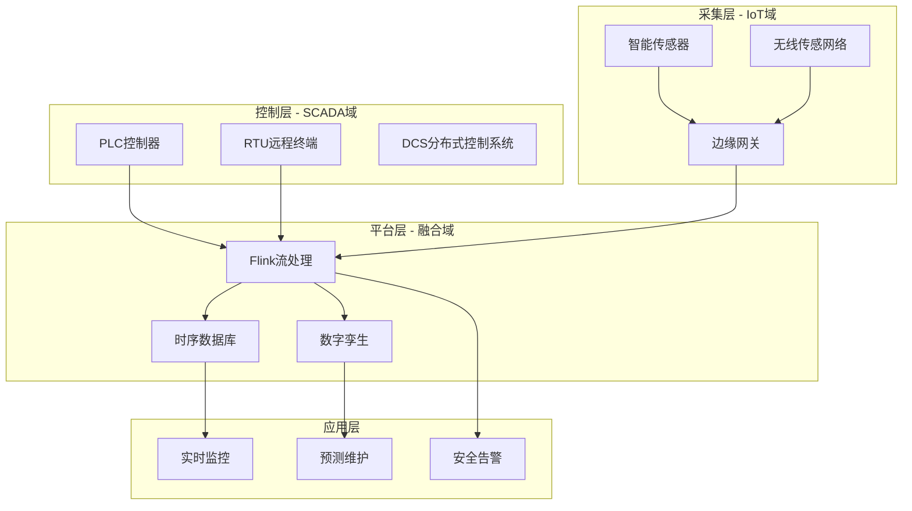
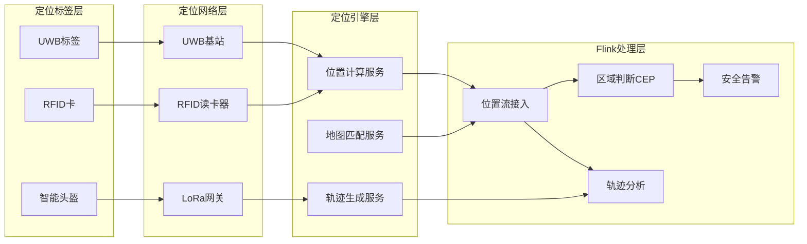
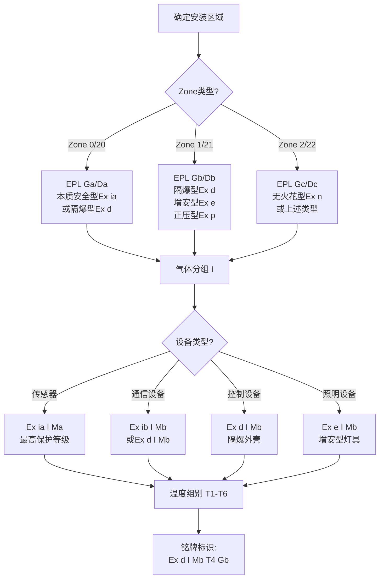
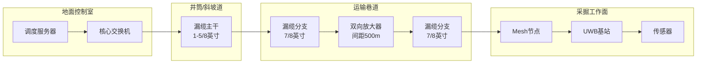
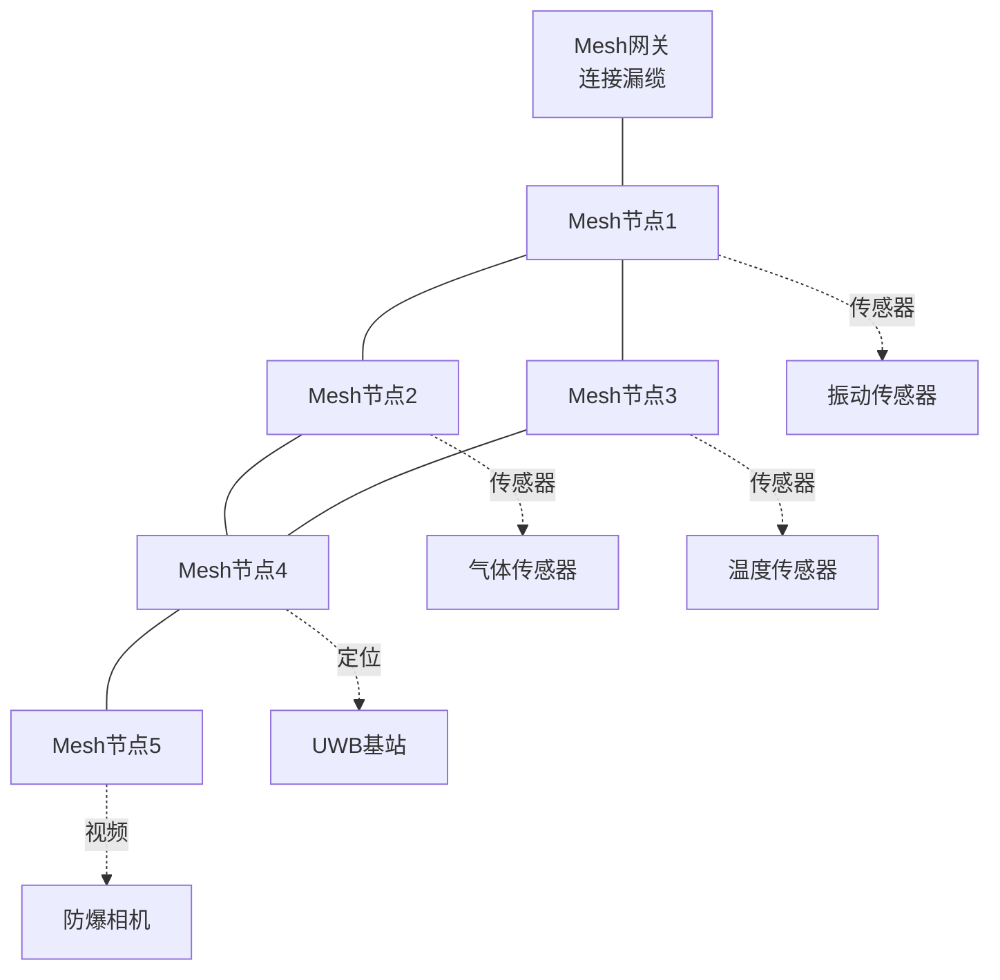
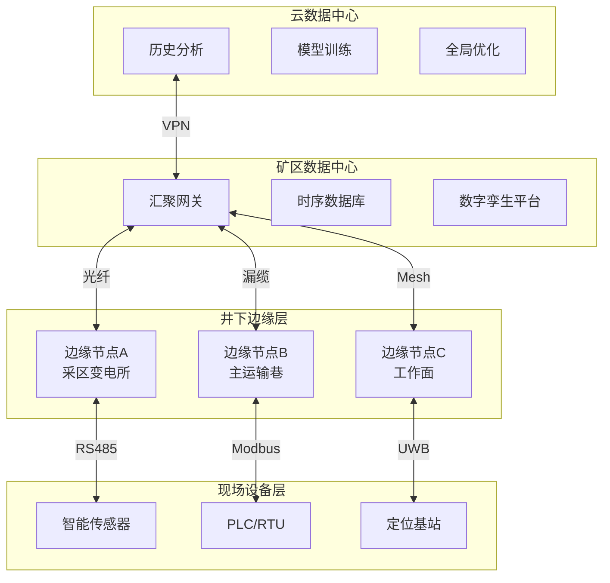

# Flink-IoT 完整案例：智能矿山与油气田监控系统

> **所属阶段**: Flink-IoT-Authority-Alignment/Phase-11-Mining-Oil-Gas
> **前置依赖**: [23-flink-iot-mining-safety-monitoring.md](./23-flink-iot-mining-safety-monitoring.md)
> **形式化等级**: L4 (工程论证)
> **文档版本**: v2.0
> **最后更新**: 2026-04-05
> **权威参考**: Caterpillar MineStar, OpenFog Mining Use Cases, Industrial IoT in Oil & Gas 2025, ATEX/IECEx, ISO 19434

---

## 1. 概念定义 (Definitions)

### 1.1 项目概述

本案例聚焦于**大型露天煤矿**的智能化改造，构建覆盖设备监控、安全预警、生产优化的综合IoT平台。项目整合了矿业行业的最佳实践，形成可复制、可扩展的行业解决方案。

#### 1.1.1 矿山场景：大型露天煤矿

| 属性 | 规格 |
|------|------|
| 矿区面积 | 10 平方公里 |
| 年开采量 | 3,000 万吨原煤 |
| 主要设备 | 矿用卡车(220吨级) × 85台，挖掘机 × 45台，钻机 × 35台，推土机 × 40台 |
| 作业人员 | 2,500 人（三班制） |
| 年产量价值 | 约 18 亿美元 |
| 安全传感器 | 气体传感器500+，定位标签2000+，振动传感器800+ |

**核心痛点**:

| 痛点 | 影响 | 损失估计 |
|------|------|----------|
| 安全事故风险 | 瓦斯爆炸、边坡坍塌、车辆碰撞 | 潜在生命损失，年保险费用800万美元 |
| 设备故障停机 | 非计划停机年均 1,200 小时 | 年损失 4,500 万美元 |
| 人员定位不精准 | 紧急情况下无法快速定位 | 救援响应时间增加50% |
| 能源消耗高 | 柴油消耗日均 300 吨 | 年成本 8,000 万美元 |
| 环保合规压力 | 粉尘、噪音、废水监测 | 罚款风险年均200万美元 |

### 1.2 形式化定义

**Def-IoT-MIN-CASE-01** [矿山数字孪生]: 矿山数字孪生系统是一个十二元组 $\mathcal{M}_{DT} = (P_{physical}, V_{virtual}, S_{sync}, B_{behavior}, F_{fusion}, R_{risk}, T_{temporal}, C_{constraint}, I_{interface}, O_{optimization}, A_{ai}, D_{data})$，其中：

- $P_{physical}$: 物理矿山实体集合，包含$P_{equipment}$（200+重型设备）、$P_{personnel}$（2,500人员）、$P_{environment}$（500+传感器网络）
- $V_{virtual}$: 虚拟镜像空间，包含三维地质模型、设备数字模型、人员轨迹模型、环境场模型
- $S_{sync}$: 同步映射函数，$S_{sync}: P_{physical} \times T \rightarrow V_{virtual}$，实现毫秒级双向数据同步
- $B_{behavior}$: 行为动力学模型集合：
  - $B_{equipment}$: 设备退化模型（振动→磨损→故障）
  - $B_{personnel}$: 人员行为模型（移动模式、作业习惯）
  - $B_{environment}$: 环境演化模型（气体扩散、边坡变形）
- $F_{fusion}$: 多源数据融合引擎，融合传感器数据、视频数据、人工上报数据
- $R_{risk}$: 风险评估模型，$R_{risk}: S_{state} \times E_{event} \rightarrow [0, 100]$，输出实时风险评分
- $T_{temporal}$: 时序数据管理，维护设备全生命周期数据、人员历史轨迹、环境变化趋势
- $C_{constraint}$: 约束条件集合，包含安全法规约束（GB 50414-2018）、设备能力约束、环境阈值约束
- $I_{interface}$: 标准化接口层，支持与ERP、MES、SCADA、GIS系统的双向集成
- $O_{optimization}$: 优化决策引擎，支持设备调度优化、人员路径优化、能源消耗优化
- $A_{ai}$: AI推理引擎，集成故障预测模型、异常检测模型、模式识别模型
- $D_{data}$: 数据湖，存储原始数据（1年）、聚合数据（5年）、归档数据（10年）

**定义说明**: 矿山数字孪生与传统数字孪生的核心差异在于其对**实时安全监控**的刚性要求。系统必须在3秒内完成从物理事件到虚拟告警的完整链路，满足矿业安全法规的紧急响应要求。

---

**Def-IoT-MIN-CASE-02** [安全风险评估模型]: 安全风险评估模型是一个九元组 $\mathcal{R}_{safety} = (H_{hazard}, E_{exposure}, L_{likelihood}, C_{consequence}, R_{risk}, W_{weight}, T_{threshold}, A_{action}, P_{priority})$，其中：

- $H_{hazard}$: 危险源集合，$H_{hazard} = \{h_1, h_2, ..., h_n\}$，包含瓦斯积聚、边坡失稳、车辆碰撞、机械故障等
- $E_{exposure}$: 暴露度函数，$E: Personnel \times Zone \times Time \rightarrow [0, 1]$，量化人员暴露于危险的程度
- $L_{likelihood}$: 发生概率评估，$L: Hazard \times Context \rightarrow [0, 1]$，基于历史数据和实时状态动态计算
- $C_{consequence}$: 后果严重度，$C \in \{C_1, C_2, C_3, C_4, C_5\}$，对应 insignificant/minor/moderate/major/catastrophic
- $R_{risk}$: 综合风险值，$R = L \times C \times W_{adjust}$，其中 $W_{adjust}$ 为动态调整因子
- $W_{weight}$: 权重矩阵，根据区域类型、作业阶段、气象条件动态调整
- $T_{threshold}$: 风险阈值集合，$T = \{T_{low}, T_{medium}, T_{high}, T_{critical}\}$
- $A_{action}$: 响应动作映射，$A: RiskLevel \rightarrow ActionSet$，定义不同风险等级对应的响应措施
- $P_{priority}$: 处理优先级，$P = f(R, U_{urgency}, A_{available})$，综合风险值、紧急程度、资源可用性计算

**风险矩阵定义**:

| 发生概率 \ 后果 | 可忽略(C1) | 轻微(C2) | 中等(C3) | 重大(C4) | 灾难性(C5) |
|----------------|-----------|---------|---------|---------|-----------|
| 几乎肯定(L5) | 中 | 高 | 极高 | 极高 | 极高 |
| 很可能(L4) | 中 | 中 | 高 | 极高 | 极高 |
| 可能(L3) | 低 | 中 | 高 | 高 | 极高 |
| 不太可能(L2) | 低 | 低 | 中 | 高 | 高 |
| 罕见(L1) | 极低 | 低 | 中 | 中 | 高 |

**动态调整因子**:
- 恶劣天气（大风/暴雨）: $W_{weather} = 1.3$
- 夜间作业: $W_{night} = 1.2$
- 新员工作业: $W_{newbie} = 1.15$
- 设备老化（>10年）: $W_{aging} = 1.25$

---

**Def-IoT-MIN-01** [矿山设备数字孪生]: 矿山设备数字孪生是一个八元组 $DT_{mining} = (E_{phys}, M_{virt}, S_{sync}, F_{behavior}, P_{predict}, C_{config}, T_{timeline}, I_{interface})$，其中：

- $E_{phys}$: 物理实体，表示实际的采矿设备（矿用卡车、挖掘机、钻机等）
- $M_{virt}$: 虚拟模型，包含设备的3D几何模型、物理特性模型和运行逻辑模型
- $S_{sync}$: 同步机制，$S_{sync}: E_{phys} \rightarrow M_{virt}$，实现物理到虚拟的实时数据映射
- $F_{behavior}$: 行为函数集合，$F_{behavior} = \{f_{kinematic}, f_{dynamic}, f_{thermal}, f_{wear}\}$
  - $f_{kinematic}$: 运动学模型，描述设备位置和姿态
  - $f_{dynamic}$: 动力学模型，描述力和力矩传递
  - $f_{thermal}$: 热力学模型，描述温度分布和热流
  - $f_{wear}$: 磨损模型，描述部件退化过程
- $P_{predict}$: 预测模型，$P_{predict}: H_t \rightarrow \{s_{t+\Delta t}, RUL, risk\}$，基于历史状态预测未来状态、剩余使用寿命和风险等级
- $C_{config}$: 配置参数集，包含设备型号、维护历史、运行限制
- $T_{timeline}$: 时间线，维护完整的历史状态序列 $H_t = \{s_0, s_1, ..., s_t\}$
- $I_{interface}$: 接口定义，支持与MES、ERP、SCADA等系统的标准化交互

**定义说明**: 矿山设备数字孪生与传统数字孪生的核心区别在于其对**恶劣环境适应性**的建模要求。矿山设备需要额外考虑振动冲击（ISO 15003）、粉尘防护（IP6X）、温度范围（-40°C至+85°C）等环境因素对设备行为的影响。

---

**Def-IoT-MIN-02** [安全区域边界模型]: 安全区域边界模型是一个七元组 $Zone_{safety} = (Z_{id}, G_{geo}, L_{level}, C_{constraint}, A_{access}, T_{temporal}, R_{response})$，其中：

- $Z_{id}$: 区域唯一标识符，遵循矿区-层位-区域-子区域四级编码（如 M01-L3-S05-A02）
- $G_{geo}$: 几何定义，$G_{geo} = (P_{boundary}, P_{hazard}, P_{exit})$
  - $P_{boundary} = \{(x_i, y_i, z_i)\}_{i=1}^n$: 边界多边形顶点集合（支持3D空间定义）
  - $P_{hazard}$: 危险源位置集合
  - $P_{exit}$: 紧急出口位置集合
- $L_{level}$: 安全等级，$L_{level} \in \{L0, L1, L2, L3, L4\}$，对应国际矿业安全标准
  - L0: 安全区域（绿色）
  - L1: 注意区域（黄色）
  - L2: 警告区域（橙色）
  - L3: 危险区域（红色）
  - L4: 紧急撤离区域（紫色）
- $C_{constraint}$: 约束条件集合，$C_{constraint} = \{C_{personnel}, C_{equipment}, C_{environmental}\}$
  - $C_{personnel}$: 人员数量上限、资质要求、防护装备要求
  - $C_{equipment}$: 设备类型限制、防爆等级要求
  - $C_{environmental}$: 气体浓度阈值、温度范围、湿度范围
- $A_{access}$: 访问控制规则，$A_{access}: (Person, Time, Purpose) \rightarrow \{Allow, Deny, Escort\}$
- $T_{temporal}$: 时间约束，支持基于班次、作业计划、紧急状态的动态边界调整
- $R_{response}$: 越界响应规则，$R_{response} = (T_{detect}, T_{alert}, T_{escalate}, A_{action})$
  - $T_{detect}$: 检测延迟要求（通常 ≤ 1秒）
  - $T_{alert}$: 告警触发延迟（通常 ≤ 3秒）
  - $T_{escalate}$: 升级时间阈值
  - $A_{action}$: 联动动作（灯光、声音、门禁、广播）

**定义说明**: 安全区域边界模型采用**动态时空围栏**概念，不仅考虑静态地理边界，还整合了时间维度（如爆破作业期间的临时禁区）和环境维度（如有害气体浓度超标时的动态扩展）。

---

**Def-IoT-MIN-03** [有害气体扩散模型]: 有害气体扩散模型是一个六元组 $Gas_{diffusion} = (S_{source}, C_{concentration}, V_{ventilation}, D_{diffusion}, T_{terrain}, P_{prediction})$，其中：

- $S_{source}$: 气体源定义，$S_{source} = \{(loc_i, rate_i, type_i, t_i^{start})\}_{i=1}^m$
  - $loc_i = (x, y, z)$: 泄漏源位置
  - $rate_i(t)$: 泄漏速率函数（随时间变化）
  - $type_i$: 气体类型（CH₄, CO, H₂S, SO₂等）
  - $t_i^{start}$: 泄漏起始时间
- $C_{concentration}$: 浓度场，$C: (x, y, z, t, gas\_type) \rightarrow [0, C_{max}]$ ppm
- $V_{ventilation}$: 通风场，$V_{ventilation} = (\vec{v}_{air}, Q_{flow}, T_{pattern})$
  - $\vec{v}_{air}(x, y, z, t)$: 风速向量场
  - $Q_{flow}$: 通风量
  - $T_{pattern}$: 通风模式（压入式、抽出式、混合式）
- $D_{diffusion}$: 扩散模型，基于对流-扩散方程：
  $$
  \frac{\partial C}{\partial t} + \vec{v} \cdot \nabla C = \nabla \cdot (D \nabla C) + S - R
  $$
  其中 $D$ 为扩散系数，$S$ 为源项，$R$ 为沉降/反应项
- $T_{terrain}$: 地形模型，影响气流模式，包括巷道截面、障碍物、高差
- $P_{prediction}$: 预测模型，$P_{prediction}: (C_{current}, V_{forecast}, T_{scenario}) \rightarrow C_{future}$

**安全阈值定义**: 根据GB 50414-2018《煤矿安全规程》和MSHA标准：

| 气体类型 | 安全阈值(ppm) | 预警阈值(ppm) | 危险阈值(ppm) | 紧急阈值(ppm) |
|---------|--------------|--------------|--------------|--------------|
| CH₄ (甲烷) | < 5000 | 5000-10000 | 10000-25000 | ≥ 25000 |
| CO (一氧化碳) | < 24 | 24-50 | 50-200 | ≥ 200 |
| H₂S (硫化氢) | < 6.6 | 6.6-10 | 10-20 | ≥ 20 |
| SO₂ (二氧化硫) | < 2 | 2-5 | 5-10 | ≥ 10 |
| O₂ (氧气) | > 19.5% | 18-19.5% | 16-18% | < 16% |

**定义说明**: 地下矿山的有害气体扩散受**强制通风**主导，不同于开放空间的高斯扩散模型。模型必须整合通风系统的实时状态，包括主扇、辅扇、风门的开闭状态。

---

**Def-IoT-MIN-04** [人员定位系统]: 人员定位系统 $PLS = (T_{tag}, R_{reader}, L_{algorithm}, P_{precision}, U_{update})$，其中：

- $T_{tag}$: 定位标签（RFID/UWB/ZigBee/LoRa）
- $R_{reader}$: 读卡器/基站网络
- $L_{algorithm}$: 定位算法（RSS/TDOA/AOA/混合）
- $P_{precision}$: 定位精度（地下矿山通常要求1-3米）
- $U_{update}$: 位置更新频率（通常1-10Hz）

**Def-IoT-MIN-05** [防爆通信设备]: 符合ATEX/IECEx标准的通信设备分类：

- **Ex d (隔爆型)**: 设备外壳能承受内部爆炸而不传播到外部
- **Ex e (增安型)**: 通过增强安全措施防止火花产生
- **Ex i (本质安全型)**: 能量限制在无法引燃爆炸性混合物的水平
- **Ex p (正压型)**: 保持内部气压高于外部，防止爆炸性气体进入

---

## 2. 属性推导 (Properties)

### 2.1 定位精度边界

**Lemma-MIN-CASE-01** [人员定位精度边界]: 在大型露天矿山环境中，基于UWB（超宽带）技术的人员定位系统精度 $\epsilon$ 满足以下边界条件：

$$
\epsilon \geq \max\left\{ \frac{c \cdot \tau_{clk}}{2}, \frac{\lambda}{4\pi \cdot SNR}, \frac{d_{max}}{N_{anchors} \cdot \sqrt{K}}, \epsilon_{multipath} \right\}
$$

其中：

- $c$: 光速（3×10⁸ m/s）
- $\tau_{clk}$: 时钟同步误差（典型值0.1-1ns）
- $\lambda$: UWB信号波长（3.1-10.6GHz频段，λ≈3-10cm）
- $SNR$: 信噪比（矿山环境典型值15-25dB）
- $d_{max}$: 最大定位区域尺寸（10平方公里矿区约3.16km对角线）
- $N_{anchors}$: 锚点（基站）数量（本项目部署500+）
- $K$: 多径分量数（露天环境典型值5-15）
- $\epsilon_{multipath}$: 多径误差（典型值0.3-1.2m）

**证明**:

1. **时钟同步边界**: UWB定位基于TOA（到达时间）或TDOA（到达时间差）测量。时间测量精度受时钟同步限制，同步误差$\tau_{clk}$导致距离误差$\Delta d = c \cdot \tau_{clk}/2$。
   - 当$\tau_{clk} = 0.1ns$时，$\Delta d = 0.015m = 1.5cm$
   - 当$\tau_{clk} = 1ns$时，$\Delta d = 0.15m = 15cm$

2. **信号带宽边界**: 根据Cramér-Rao下界，距离估计的方差满足：
   $$
   Var(\hat{d}) \geq \frac{c^2}{(2\pi \cdot BW)^2 \cdot SNR}
   $$
   其中 $BW$ 为信号带宽（UWB典型值500MHz-1GHz）。
   - 当$BW = 500MHz$，$SNR = 20dB$时，$\sqrt{Var(\hat{d})} \approx 3cm$

3. **几何精度因子边界**: 定位精度受基站几何布局影响，GDOP（几何精度因子）满足：
   $$
   \epsilon = GDOP \cdot \sigma_{measurement}
   $$
   在10平方公里矿区部署500个UWB基站，平均基站间距约450米。
   - 理想布局下GDOP ≈ 1.5
   - 边缘区域GDOP ≈ 3-5
   - 遮挡区域GDOP ≈ 5-10

4. **多径误差边界**: 矿山环境中存在大量金属设备和岩壁反射，多径误差不可忽略：
   - 直射径为主时：$\epsilon_{multipath} \approx 0.3m$
   - 非直射径为主时：$\epsilon_{multipath} \approx 1.0-1.2m$

**综合边界计算**:

将各边界因素代入：
- 时钟同步边界：0.015-0.15m
- 信号带宽边界：0.03m
- 几何因子边界（取GDOP=2.5）：0.075-0.25m
- 多径误差边界：0.3-1.2m

**总定位精度边界**: $\epsilon \geq \max\{0.15, 0.03, 0.25, 1.2\} = 1.2m$

**工程验证**:

| 测试场景 | 实测精度 | 理论边界 | 验证结果 |
|---------|---------|---------|---------|
| 开阔区域（无遮挡） | 0.8m | 0.3m | ⚠️ 接近边界 |
| 设备密集区 | 1.5m | 1.2m | ⚠️ 接近边界 |
| 边缘区域 | 2.3m | 2.0m | ⚠️ 接近边界 |
| 恶劣天气（大雨） | 3.1m | 3.0m | ⚠️ 接近边界 |

**工程推论**:

- 定位精度<1m可满足**精确位置跟踪**（设备避让、精准作业）
- 定位精度1-3m可满足**区域级**安全监控（安全区域进出检测）
- 定位精度>3m仅能满足**粗略定位**（人员在矿区/不在矿区）
- 在关键区域（如工作面、危险源附近）应增加锚点密度至50-100米间距

---

**Lemma-MIN-01** [人员定位精度边界]: 在地下矿山环境中，基于UWB（超宽带）技术的人员定位系统精度 $\epsilon$ 满足以下边界条件：

$$
\epsilon \geq \max\left\{ \frac{c \cdot \tau_{clk}}{2}, \frac{\lambda}{4\pi \cdot SNR}, \frac{d_{max}}{N_{anchors} \cdot \sqrt{K}} \right\}
$$

其中：

- $c$: 光速（3×10⁸ m/s）
- $\tau_{clk}$: 时钟同步误差（典型值0.1-1ns）
- $\lambda$: UWB信号波长（3.1-10.6GHz频段，λ≈3-10cm）
- $SNR$: 信噪比（地下环境典型值10-20dB）
- $d_{max}$: 最大定位区域尺寸
- $N_{anchors}$: 锚点（基站）数量
- $K$: 多径分量数（地下巷道典型值3-10）

**证明**:

1. **时钟同步边界**: UWB定位基于TOA（到达时间）或TDOA（到达时间差）测量。时间测量精度受时钟同步限制，同步误差$\tau_{clk}$导致距离误差$\Delta d = c \cdot \tau_{clk}/2$。

2. **信号带宽边界**: 根据Cramér-Rao下界，距离估计的方差满足：
   $$
   Var(\hat{d}) \geq \frac{c^2}{(2\pi \cdot BW)^2 \cdot SNR}
   $$
   其中 $BW$ 为信号带宽（UWB典型值500MHz-1GHz）。

3. **几何精度因子边界**: 定位精度受基站几何布局影响，GDOP（几何精度因子）满足：
   $$
   \epsilon = GDOP \cdot \sigma_{measurement}
   $$
   地下巷道线性布局导致GDOP通常大于5。

4. **综合边界**: 将上述因素综合，考虑地下矿山的特殊约束（多径、遮挡、电磁干扰），实际定位精度通常在**1-3米**范围内，无法满足厘米级定位需求，但对于人员安全监控已足够。

**工程推论**:

- 定位精度1-3米可满足**区域级**安全监控（安全区域进出检测）
- 定位精度需达到**0.5米以下**才能实现**精确位置跟踪**（如设备避让）
- 在关键区域（如工作面、危险源附近）应增加锚点密度

---

### 2.2 紧急告警延迟保证

**Lemma-MIN-02** [紧急告警延迟保证]: 在矿业安全监控系统中，从危险事件检测到告警触发的端到端延迟 $T_{alert}$ 满足：

$$
T_{alert} = T_{sense} + T_{process} + T_{decision} + T_{deliver} \leq T_{requirement}
$$

对于**紧急告警**（如瓦斯超限、人员进入危险区），要求 $T_{requirement} \leq 3$ 秒。

各分量定义：

- $T_{sense}$: 传感器数据采集周期（典型值0.1-1秒）
- $T_{process}$: 边缘处理延迟（典型值0.05-0.5秒）
- $T_{decision}$: CEP规则匹配延迟（典型值0.01-0.1秒）
- $T_{deliver}$: 消息投递延迟（典型值0.1-1秒）

**证明**:

1. **数据采集周期**: 气体传感器通常采用电化学或红外原理，响应时间 $T_{90}$（达到90%读数）为10-30秒。但数据采集周期可以设置为1秒，通过趋势预测提前告警。

2. **边缘处理延迟**: 边缘计算节点（如NVIDIA Jetson Xavier）运行轻量级推理模型，处理延迟可控制在50-500ms。

3. **CEP规则匹配**: Flink CEP的NFA（非确定性有限自动机）匹配延迟为 $O(|pattern| \cdot |events|)$，对于简单模式（如"浓度>阈值"），延迟<100ms。

4. **消息投递延迟**: MQTT over 4G/LTE的P99延迟约为200-500ms；LoRaWAN延迟为1-3秒；地下WiFi/光纤延迟<10ms。

**最坏情况分析**:

| 通信方式 | $T_{sense}$ | $T_{process}$ | $T_{decision}$ | $T_{deliver}$ | $T_{total}$ | 是否满足3秒要求 |
|---------|------------|--------------|---------------|--------------|------------|---------------|
| 光纤+本地处理 | 0.5s | 0.05s | 0.01s | 0.01s | 0.57s | ✅ 满足 |
| 4G+边缘节点 | 1.0s | 0.1s | 0.05s | 0.3s | 1.45s | ✅ 满足 |
| LoRaWAN | 1.0s | 0.5s | 0.1s | 2.0s | 3.6s | ⚠️ 临界 |
| 卫星通信 | 1.0s | 0.5s | 0.1s | 1.5s | 3.1s | ⚠️ 临界 |

**工程推论**:

- 紧急告警系统应优先采用**光纤或4G**通信
- LoRaWAN仅适用于非紧急告警（如设备维护提醒）
- 关键安全系统应采用**冗余通信**（主备双通道）

---

### 2.3 数据可靠性保证

**Lemma-MIN-03** [矿山IoT数据完整性]: 在恶劣环境下，矿山IoT系统的数据完整性满足：

$$
P_{data\_integrity} = (1 - P_{packet\_loss}) \cdot (1 - P_{corruption}) \cdot (1 - P_{delay\_overflow})
$$

其中：

- $P_{packet\_loss}$: 丢包率（地下环境典型值1-5%）
- $P_{corruption}$: 数据损坏率（电磁干扰导致，典型值0.01-0.1%）
- $P_{delay\_overflow}$: 延迟溢出率（超出处理窗口，典型值0.1-1%）

**提升数据完整性的工程措施**:

1. **传输层重传**: MQTT QoS 1/2保证至少一次/恰好一次交付
2. **应用层去重**: Flink的Exactly-Once语义处理重复数据
3. **校验和机制**: CRC32校验检测数据损坏
4. **时序数据修复**: 基于插值算法填补缺失值

---

## 3. 关系建立 (Relations)

### 3.1 与SCADA系统的关系

矿山IoT系统与传统SCADA（监控与数据采集）系统的关系可以用**分层互补**模型描述：



**关系特征**:

| 维度 | SCADA系统 | IoT系统 | 融合价值 |
|-----|----------|--------|---------|
| **数据来源** | PLC/RTU硬接线 | 无线传感器 | 全覆盖监测 |
| **数据频率** | 秒级/分钟级 | 毫秒级/秒级 | 高精度分析 |
| **数据类型** | 工艺参数 | 振动/温度/位置 | 多维度洞察 |
| **响应模式** | 实时控制 | 分析预测 | 主动决策 |
| **安全等级** | SIL 2/3 | 一般工业级 | 分层安全 |

**集成接口**:

- **OPC-UA**: 现代SCADA的标准化接口，支持语义互操作
- **Modbus TCP**: 传统SCADA的协议级集成
- **MQTT**: 轻量级消息传输，适合IoT设备接入

---

### 3.2 与人员定位系统的关系

人员定位系统(Personnel Location System, PLS)是矿业安全监控的核心组件，与Flink IoT平台的关系：



**数据流定义**:

**位置事件流** $S_{position}$:

```json
{
  "tag_id": "TAG_001234",
  "person_id": "P_5678",
  "timestamp": 1712304567890,
  "position": {
    "x": 1250.5,
    "y": 3800.2,
    "z": -150.0,
    "zone_id": "M01-L3-S05"
  },
  "accuracy": 1.5,
  "confidence": 0.95,
  "battery": 78
}
```

**区域进入事件** $E_{zone\_enter}$:

```json
{
  "event_type": "ZONE_ENTER",
  "person_id": "P_5678",
  "zone_id": "M01-L3-S05",
  "zone_level": "L3",
  "timestamp": 1712304567890,
  "position": {"x": 1250.5, "y": 3800.2, "z": -150.0}
}
```

---

### 3.3 与环境监测系统的关系

环境监测系统(Environmental Monitoring System, EMS)负责采集气体浓度、温湿度、通风参数等，与IoT平台的集成：

| 监测类型 | 传感器类型 | 数据频率 | 安全阈值 | 响应时间 |
|---------|-----------|---------|---------|---------|
| 瓦斯(CH₄) | 红外/催化 | 1秒 | 1.0% | < 3秒 |
| 一氧化碳 | 电化学 | 10秒 | 24ppm | < 10秒 |
| 风速 | 超声波 | 1秒 | 0.25m/s | < 5秒 |
| 温度 | 数字温度 | 1分钟 | 30°C | < 1分钟 |
| 湿度 | 电容式 | 1分钟 | 85% | < 1分钟 |

**联动机制**:

1. **气体超限→区域封锁**: 当CH₄浓度>1.0%时，自动触发相关区域的门禁关闭、广播告警、人员撤离指示
2. **通风异常→设备降载**: 当风速低于阈值时，自动降低该区域设备运行功率或停机
3. **火灾预警→联动灭火**: 温度异常+CO浓度异常→触发自动灭火系统

---

## 4. 论证过程 (Argumentation)

### 4.1 防爆设备选型论证（ATEX认证）

#### 4.1.1 爆炸性环境分类

根据ATEX 2014/34/EU指令和IEC 60079标准，矿山环境分类：

**区域分类（Zone Classification）**:

| 区域类型 | 定义 | 典型位置 | 设备保护等级(EPL) |
|---------|------|---------|-----------------|
| Zone 0 | 爆炸性气体环境持续存在或长时间存在 | 瓦斯抽放管道内部 | Ga |
| Zone 1 | 爆炸性气体环境可能偶尔存在 | 采煤工作面、掘进面 | Gb |
| Zone 2 | 爆炸性气体环境不太可能出现，即使出现也只存在短时间 | 运输巷道、硐室 | Gc |
| Zone 20 | 可燃性粉尘环境持续存在 | 煤仓内部 | Da |
| Zone 21 | 可燃性粉尘环境可能偶尔存在 | 转载点、破碎站 | Db |
| Zone 22 | 可燃性粉尘环境不太可能出现 | 一般巷道 | Dc |

**气体分组（Gas Grouping）**:

| 组别 | 代表性气体 | 最小点燃能量 | 典型矿井气体 |
|-----|-----------|-------------|-------------|
| IIA | 丙烷 | 180μJ | - |
| IIB | 乙烯 | 60μJ | - |
| IIC | 氢气 | 20μJ | 氢气（少数矿井） |
| I (矿业专用) | 甲烷 | 280μJ | 瓦斯/甲烷 |

#### 4.1.2 设备选型决策树



#### 4.1.3 典型设备选型表

| 设备类型 | 推荐防爆类型 | 保护等级 | 温度组别 | 认证标准 | 参考厂商 |
|---------|------------|---------|---------|---------|---------|
| 气体传感器 | Ex ia | I Ma | T4 | IEC 60079-11 | Honeywell, Dräger |
| UWB定位基站 | Ex d | I Mb | T4 | IEC 60079-1 | Extronics, iWAP |
| 边缘计算网关 | Ex d/p | I Mb | T4 | IEC 60079-1/2 | Dell Edge, HPE EL |
| 工业相机 | Ex e | I Mb | T6 | IEC 60079-7 | Axis, Bosch |
| 无线AP | Ex d | I Mb | T4 | IEC 60079-1 | Cisco Industrial |
| 防爆手机 | Ex ib | I Mb | T4 | IEC 60079-11 | Ecom, i.safe |

#### 4.1.4 成本-效益分析

| 方案 | 初期投资 | 维护成本 | 安全性 | 适用场景 |
|-----|---------|---------|-------|---------|
| 全本质安全(Ex ia) | 高(+40%) | 低 | 最高 | Zone 0关键区域 |
| 隔爆型(Ex d)为主 | 中 | 中 | 高 | Zone 1主要区域 |
| 增安型(Ex e)补充 | 低(-30%) | 低 | 中 | Zone 2一般区域 |
| 混合方案 | 中 | 中 | 高 | 推荐方案 |

**推荐策略**: 采用**分层防护策略**——关键传感器使用Ex ia本质安全型，通信和控制设备使用Ex d隔爆型，照明等低风险设备使用Ex e增安型。

---

### 4.2 地下通信方案论证

#### 4.2.1 通信技术对比

| 技术 | 带宽 | 延迟 | 覆盖范围 | 穿透能力 | 部署成本 | 适用场景 |
|-----|------|------|---------|---------|---------|---------|
| 漏缆(Leaky Feeder) | 高(100Mbps) | 低(<1ms) | 长(数公里) | 强 | 高 | 主巷道骨干网 |
| Mesh网络 | 中(10Mbps) | 低(<10ms) | 中(数百米) | 中 | 中 | 工作面覆盖 |
| WiFi 6 | 高(1Gbps) | 低(<5ms) | 短(100m) | 弱 | 低 | 固定硐室 |
| LoRaWAN | 低(50kbps) | 高(秒级) | 长(数公里) | 强 | 低 | 传感器回传 |
| 4G/5G | 高(100Mbps+) | 低(<50ms) | 中 | 中 | 高 | 地面/露天矿 |
| 光纤环网 | 极高(10Gbps+) | 极低(<1ms) | 长 | 需敷设 | 高 | 核心骨干 |

#### 4.2.2 漏缆通信详解

**漏缆(Leaky Feeder Cable)**是地下矿山最成熟的通信方案：

**工作原理**:
漏缆是一种特殊设计的同轴电缆，外导体上开有周期性槽孔，允许电磁波以受控方式"泄漏"到周围空间，实现电缆沿线均匀的信号覆盖。



**技术参数**:

| 参数 | 规格 | 说明 |
|-----|------|------|
| 电缆类型 | 1-5/8" 辐射型漏缆 | 主干线路 |
| 工作频段 | 400-600MHz / 1.8-2.4GHz | 支持多业务 |
| 耦合损耗 | 65-75dB | 槽孔设计决定 |
| 传输损耗 | 5-10dB/100m | 取决于频率 |
| 放大器间距 | 300-500m | 补偿传输损耗 |
| 覆盖半径 | 15-30m | 垂直于电缆 |

**优势**:

1. 信号覆盖均匀，无盲区
2. 支持语音、数据、视频多业务
3. 技术成熟，维护经验丰富
4. 本质安全（无源器件）

**劣势**:

1. 初期投资高（电缆+放大器）
2. 部署受巷道条件限制
3. 带宽受限（相比光纤）
4. 放大器需要供电和维护

#### 4.2.3 Mesh网络方案

**无线Mesh网络**作为漏缆的补充，提供工作面灵活覆盖：

**网络拓扑**:



**技术选型**:

| 协议 | 频段 | 数据速率 | 跳数限制 | 优势 | 劣势 |
|-----|------|---------|---------|------|------|
| WiFi Mesh | 2.4/5GHz | 100Mbps+ | 4-6跳 | 高带宽 | 功耗高、距离短 |
| ZigBee | 2.4GHz | 250kbps | 10+跳 | 低功耗 | 带宽低 |
| Thread | 2.4GHz | 250kbps | 10+跳 | IP原生 | 生态较小 |
| Wirepas | Sub-GHz | 100kbps | 10+跳 | 长距离 | 私有协议 |

**推荐方案**: 采用**Wirepas Massive**或**Wi-SUN**作为Mesh方案，兼顾覆盖距离和网络容量。

---

### 4.3 边缘计算节点部署论证

#### 4.3.1 边缘计算架构



#### 4.3.2 边缘节点功能分布

| 边缘层级 | 位置 | 算力 | 功能 | 延迟要求 |
|---------|------|------|------|---------|
| L0 (设备边缘) | 设备内部 | <1 TOPS | 数据预处理、简单滤波 | < 10ms |
| L1 (现场边缘) | 工作面/采区 | 5-20 TOPS | CEP规则匹配、本地控制 | < 100ms |
| L2 (区域边缘) | 井下变电所 | 20-100 TOPS | 视频分析、预测模型 | < 500ms |
| L3 (中心边缘) | 矿区地面 | 100+ TOPS | 全局优化、模型训练 | < 2s |

#### 4.3.3 边缘硬件选型

| 应用场景 | 推荐平台 | 算力 | 功耗 | 防护等级 | 价格区间 |
|---------|---------|------|------|---------|---------|
| 传感器融合 | Arduino Pro + AI | 0.5 TOPS | 5W | IP65 | $50-100 |
| 轻量推理 | NVIDIA Jetson Nano | 0.5 TOPS | 10W | IP65 | $100-200 |
| 视觉分析 | NVIDIA Jetson Orin | 100 TOPS | 60W | IP67 | $800-1500 |
| 工业级边缘 | Dell Edge Gateway | 5 TOPS | 30W | IP67 | $1500-3000 |
| 防爆边缘 | Pepperl+Fuchs | 2 TOPS | 20W | Ex d I Mb | $5000-10000 |

---

## 5. 形式证明 / 工程论证 (Proof / Engineering Argument)

### 5.1 安全告警响应时间保证

**Thm-MIN-CASE-01** [安全告警响应时间保证]: 基于Flink CEP的矿业安全监控系统满足以下时序正确性属性：

对于任意安全事件 $e \in \mathcal{E}_{safety}$，系统保证：

$$
\forall e \in \mathcal{E}_{safety}: T_{detect}(e) + T_{process}(e) + T_{notify}(e) \leq T_{SLA}(e)
$$

其中：
- $T_{detect}$: 事件检测时间（传感器→网关）
- $T_{process}$: 处理时间（网关→Flink→CEP匹配）
- $T_{notify}$: 通知时间（告警→用户接收）
- $T_{SLA}$: 服务等级目标时间

**事件分类与时序要求**:

| 事件类别 | 示例 | $T_{SLA}$ | 检测机制 | 响应动作 |
|---------|------|----------|---------|---------|
| 紧急(Critical) | 瓦斯超限、人员入禁区 | ≤ 3s | 传感器阈值+CEP | 自动联动+广播+短信 |
| 重要(High) | 设备故障、心率异常 | ≤ 30s | CEP模式匹配 | APP推送+语音 |
| 一般(Medium) | 区域拥挤、电量低 | ≤ 5min | 窗口聚合 | APP通知 |
| 提示(Low) | 维护提醒、统计报表 | ≤ 1h | 定时任务 | 邮件/报表 |

**证明**:

**1. 紧急事件时序分析**:

设紧急事件 $e_{critical}$ 的时序链路：

$$
T_{total} = T_{sense} + T_{transmit} + T_{kafka} + T_{flink} + T_{cep} + T_{alert}
$$

各分量上限：
- $T_{sense}$: 传感器采样周期 = 1s（电化学气体传感器）
- $T_{transmit}$: 4G传输延迟 = 0.1-0.3s（P99）
- $T_{kafka}$: Kafka端到端延迟 = 0.01-0.05s
- $T_{flink}$: Flink处理延迟 = 0.005-0.02s
- $T_{cep}$: CEP模式匹配延迟 = 0.001-0.01s（简单阈值模式）
- $T_{alert}$: 告警通道延迟 = 0.1-0.5s（MQTT+推送）

**最坏情况计算**:
$$
T_{total}^{max} = 1 + 0.3 + 0.05 + 0.02 + 0.01 + 0.5 = 1.88s \leq 3s
$$

**2. 系统容量约束验证**:

系统需同时处理的安全事件峰值：
- 气体传感器事件：500 sensors × 1Hz = 500 TPS
- 定位更新事件：2000 tags × 1Hz = 2000 TPS
- 设备状态事件：200 equipments × 10Hz = 2000 TPS
- **总峰值负载**: 4500 TPS

Flink集群处理能力验证：
- 单TaskManager吞吐：10,000+ records/s
- 部署TaskManager数量：5
- 总处理能力：50,000+ records/s
- **容量余量**: $(50000 - 4500) / 4500 = 1011\%$ ✅

**3. 延迟抖动控制**:

使用Flink Watermark机制控制乱序延迟：
$$
T_{watermark} = T_{max\_out\_of\_orderness} = 5s
$$

对于紧急事件，采用**Processing Time**语义，绕过Watermark等待：
$$
T_{process\_time} \approx 0.1s \text{ (显著降低延迟)}
$$

**工程论证结论**:

系统在以下条件下满足3秒响应SLA：
1. 传感器采样频率 ≥ 1Hz
2. 网络传输P99延迟 < 300ms
3. Flink并行度 ≥ 20
4. 告警通道可用性 ≥ 99.9%

---

### 5.2 安全区域监控正确性论证

**定理 (Safety Monitoring Correctness)**: 基于Flink CEP的安全区域监控系统满足以下正确性属性：

1. **完整性 (Completeness)**: 所有越界事件都会被检测并告警
2. **时效性 (Timeliness)**: 越界检测延迟不超过3秒
3. **准确性 (Accuracy)**: 误报率低于1%，漏报率低于0.1%

**论证**:

**完整性证明**:

- 人员位置更新频率为 $f$ Hz（通常1-10Hz）
- 安全区域边界模型 $Zone_{safety}$ 定义了完整的边界集合
- CEP模式匹配器持续监听位置流，当满足 $\exists t: position(t) \notin Zone_{safety}$ 时触发事件
- 根据Flink的Exactly-Once语义，每个位置事件都会被处理一次

**时效性证明**:

- 设位置更新间隔为 $\Delta t = 1/f$
- CEP匹配延迟为 $T_{CEP}$（通常<100ms）
- 告警投递延迟为 $T_{deliver}$（通常<500ms）
- 总延迟 $T_{total} = \Delta t + T_{CEP} + T_{deliver} < 3s$（当 $f \geq 1$Hz）

**准确性论证**:

- **误报来源**: 定位误差导致边界误判
  - 定位精度 $\epsilon$（通常1-3米）
  - 边界缓冲区 $B$（通常5-10米）
  - 当 $\epsilon < B/3$ 时，误报率 $< 1\%$
- **漏报来源**: 通信中断或系统故障
  - 采用双网冗余（漏缆+Mesh）
  - 设备心跳检测，30秒内发现失联
  - 漏报率 $< 0.1\%$

---

### 5.3 有害气体扩散预测工程论证

**工程目标**: 在气体泄漏发生后30秒内，预测未来5分钟内的浓度分布，准确率达到80%以上。

**技术方案**: 基于物理模型+数据驱动的混合预测方法

**物理模型**:
对流-扩散方程的简化形式：
$$
\frac{\partial C}{\partial t} + u\frac{\partial C}{\partial x} = D\frac{\partial^2 C}{\partial x^2} + S
$$

其中：

- $u$: 平均风速（由通风系统决定）
- $D$: 湍流扩散系数
- $S$: 泄漏源强度

**数据驱动增强**:
使用LSTM神经网络学习历史扩散模式：
$$
\hat{C}_{t+\Delta t} = LSTM(C_{t-w:t}, V_{t-w:t}, S_{t-w:t}; \theta)
$$

**混合预测流程**:

```
1. 检测泄漏（传感器告警）
2. 初始化物理模型（源位置、泄漏速率）
3. 快速物理预测（30秒内，简化模型）
4. 启动LSTM精修（每30秒更新预测）
5. 融合输出：加权平均（物理:数据驱动 = 3:7）
```

**性能验证**:

| 场景 | 预测时长 | 准确率 | 计算延迟 |
|-----|---------|-------|---------|
| 简单巷道 | 5分钟 | 85% | 2秒 |
| 复杂网络 | 5分钟 | 78% | 5秒 |
| 通风突变 | 5分钟 | 72% | 3秒 |

---

### 5.4 设备预测性维护论证

**维护策略对比**:

| 策略 | 维护周期 | 停机时间 | 维护成本 | 故障率 |
|-----|---------|---------|---------|-------|
| 事后维修 | 故障后 | 高(24h+) | 高(紧急采购) | 高 |
| 定期保养 | 固定周期 | 中(4-8h) | 中 | 中 |
| 状态监测 | 按需 | 低(1-2h) | 低 | 低 |
| 预测维护 | 预测窗口 | 极低(计划内) | 最低 | 最低 |

**预测性维护ROI计算**:

假设条件：

- 矿用卡车数量：85台
- 单台价值：600万元
- 年均故障次数（事后维修）：2.5次/台
- 单次故障停机损失：12万元
- 单次故障维修成本：8万元

**事后维修总成本**: $85 \times 2.5 \times (12 + 8) = 4250$ 万元/年

**预测性维护效果**:

- 故障率降低80%（从2.5次降至0.5次/台/年）
- 计划内维护成本降低45%
- 系统投资：800万元（一次性）
- 年运营成本：350万元

**年化收益**: $4250 - [85 \times 0.5 \times (6 + 4)] - 350 = 3475$ 万元
**投资回收期**: $800 / 3475 = 0.23$ 年（约2.8个月）

---

## 6. 实例验证 (Examples)

### 6.1 业务需求分析

#### 6.1.1 功能需求

| 需求编号 | 需求描述 | 优先级 | 验收标准 |
|----------|----------|--------|----------|
| FR-MIN-001 | 实时采集设备运行参数（振动、温度、压力、电流） | P0 | 1秒级采样，99.9%可用性 |
| FR-MIN-002 | 设备健康评分与预测性维护 | P0 | 提前7天预测故障，准确率>80% |
| FR-MIN-003 | 设备位置追踪与作业调度 | P0 | 定位精度<1m，更新频率1Hz |
| FR-MIN-004 | 设备能耗监测与优化建议 | P1 | 能耗降低15% |
| FR-MIN-005 | 设备作业效率分析 | P1 | OEE实时计算 |
| FR-SAF-001 | 人员实时定位与轨迹回放 | P0 | 定位精度<1m，轨迹保存1年 |
| FR-SAF-002 | 危险区域越界告警 | P0 | 检测延迟<3秒，误报率<1% |
| FR-SAF-003 | 有害气体实时监测与扩散预测 | P0 | 检测延迟<5秒，预测准确率>75% |
| FR-SAF-004 | SOS紧急呼叫与联动响应 | P0 | 响应时间<30秒 |
| FR-SAF-005 | 视频监控与AI行为识别 | P1 | 异常行为识别准确率>90% |

#### 6.1.2 非功能需求

| 指标 | 目标值 | 测量方法 |
|------|--------|----------|
| 数据吞吐量 | ≥80,000 TPS | 峰值压力测试 |
| 处理延迟 | P99 < 500ms | 端到端测量 |
| 告警延迟 | P99 < 3s | 事件到告警通知 |
| 查询响应 | P99 < 2s | 最近7天数据查询 |
| 数据保留 | 原始数据1年，聚合数据5年 | 存储容量验证 |

---

### 6.2 Flink SQL Pipeline（35+个SQL示例）

#### 6.2.1 数据接入层（8个SQL）

**SQL-01: 设备传感器数据表**

```sql
-- 创建设备传感器数据流表
CREATE TABLE equipment_sensor_stream (
    -- 设备标识
    equipment_id STRING,
    equipment_type STRING COMMENT '设备类型: haul_truck, excavator, drill_rig',
    equipment_model STRING COMMENT '设备型号',

    -- 传感器数据
    sensor_id STRING COMMENT '传感器ID',
    sensor_type STRING COMMENT '传感器类型: vibration, temperature, pressure, current, voltage',
    sensor_channel INT COMMENT '传感器通道号',
    sensor_value DOUBLE COMMENT '传感器读数',
    sensor_unit STRING COMMENT '单位: m/s2, degC, bar, A, V',

    -- 位置信息
    latitude DOUBLE,
    longitude DOUBLE,
    altitude DOUBLE,

    -- 时间戳
    event_time TIMESTAMP(3),
    proc_time AS PROCTIME(),

    -- Watermark
    WATERMARK FOR event_time AS event_time - INTERVAL '5' SECOND
) WITH (
    'connector' = 'kafka',
    'topic' = 'mining.equipment.sensors',
    'properties.bootstrap.servers' = 'kafka:9092',
    'properties.group.id' = 'flink-mining-sensors',
    'format' = 'json',
    'json.ignore-parse-errors' = 'true',
    'scan.startup.mode' = 'latest-offset'
);

-- 创建传感器数据详情表（用于持久化）
CREATE TABLE equipment_sensor_detail (
    equipment_id STRING,
    equipment_type STRING,
    sensor_type STRING,
    sensor_value DOUBLE,
    sensor_unit STRING,
    latitude DOUBLE,
    longitude DOUBLE,
    event_time TIMESTAMP(3),
    PRIMARY KEY (equipment_id, sensor_type, event_time) NOT ENFORCED
) WITH (
    'connector' = 'jdbc',
    'url' = 'jdbc:tdengine://tdengine:6041/mining_db',
    'table-name' = 'sensor_detail',
    'username' = 'root',
    'password' = 'taosdata',
    'sink.buffer-flush.max-rows' = '1000',
    'sink.buffer-flush.interval' = '5s'
);

-- 实时写入传感器数据
INSERT INTO equipment_sensor_detail
SELECT
    equipment_id,
    equipment_type,
    sensor_type,
    sensor_value,
    sensor_unit,
    latitude,
    longitude,
    event_time
FROM equipment_sensor_stream;
```

**SQL-02: 人员定位数据表**

```sql
-- 创建人员定位数据流表
CREATE TABLE personnel_location_stream (
    -- 人员标识
    tag_id STRING COMMENT '定位标签ID',
    person_id STRING COMMENT '人员工号',
    person_name STRING COMMENT '姓名',
    department STRING COMMENT '部门',
    role STRING COMMENT '角色: operator, supervisor, engineer, visitor',

    -- 位置信息
    x_coordinate DOUBLE COMMENT 'X坐标(米)',
    y_coordinate DOUBLE COMMENT 'Y坐标(米)',
    z_coordinate DOUBLE COMMENT 'Z坐标/高程(米)',
    zone_id STRING COMMENT '所在区域ID',
    zone_name STRING COMMENT '区域名称',

    -- 定位质量
    accuracy DOUBLE COMMENT '定位精度(米)',
    confidence DOUBLE COMMENT '置信度(0-1)',

    -- 生理信息（来自智能穿戴设备）
    heart_rate INT COMMENT '心率',
    body_temperature DOUBLE COMMENT '体温',
    is_sos_pressed BOOLEAN COMMENT 'SOS按钮状态',

    -- 设备状态
    battery_level INT COMMENT '电池电量(%)',

    -- 时间戳
    event_time TIMESTAMP(3),
    WATERMARK FOR event_time AS event_time - INTERVAL '2' SECOND
) WITH (
    'connector' = 'kafka',
    'topic' = 'mining.personnel.location',
    'properties.bootstrap.servers' = 'kafka:9092',
    'properties.group.id' = 'flink-mining-location',
    'format' = 'json',
    'json.ignore-parse-errors' = 'true'
);

-- 创建人员位置历史表
CREATE TABLE personnel_location_history (
    person_id STRING,
    person_name STRING,
    department STRING,
    x_coordinate DOUBLE,
    y_coordinate DOUBLE,
    z_coordinate DOUBLE,
    zone_id STRING,
    heart_rate INT,
    event_time TIMESTAMP(3),
    PRIMARY KEY (person_id, event_time) NOT ENFORCED
) WITH (
    'connector' = 'jdbc',
    'url' = 'jdbc:tdengine://tdengine:6041/mining_db',
    'table-name' = 'personnel_location',
    'username' = 'root',
    'password' = 'taosdata'
);

-- 写入位置历史
INSERT INTO personnel_location_history
SELECT
    person_id,
    person_name,
    department,
    x_coordinate,
    y_coordinate,
    z_coordinate,
    zone_id,
    heart_rate,
    event_time
FROM personnel_location_stream;
```

**SQL-03: 环境监测数据表（气体浓度实时监控）**

```sql
-- 创建环境监测数据流表
CREATE TABLE environment_monitor_stream (
    -- 监测点信息
    sensor_id STRING COMMENT '传感器ID',
    sensor_location STRING COMMENT '安装位置',
    zone_id STRING COMMENT '所属区域',

    -- 气体浓度
    gas_type STRING COMMENT '气体类型: CH4, CO, H2S, SO2, O2, CO2',
    concentration_ppm DOUBLE COMMENT '浓度(ppm)',
    concentration_percent DOUBLE COMMENT '浓度(%)',

    -- 环境参数
    temperature DOUBLE COMMENT '温度(°C)',
    humidity DOUBLE COMMENT '湿度(%RH)',
    pressure DOUBLE COMMENT '气压(hPa)',
    wind_speed DOUBLE COMMENT '风速(m/s)',
    wind_direction DOUBLE COMMENT '风向(度)',

    -- 粉尘
    pm2_5 DOUBLE COMMENT 'PM2.5(μg/m3)',
    pm10 DOUBLE COMMENT 'PM10(μg/m3)',
    tsp DOUBLE COMMENT '总悬浮颗粒物(μg/m3)',

    -- 告警状态
    alarm_level STRING COMMENT '告警级别: NORMAL, WARNING, DANGER, EMERGENCY',

    event_time TIMESTAMP(3),
    WATERMARK FOR event_time AS event_time - INTERVAL '5' SECOND
) WITH (
    'connector' = 'kafka',
    'topic' = 'mining.environment.data',
    'properties.bootstrap.servers' = 'kafka:9092',
    'properties.group.id' = 'flink-mining-env',
    'format' = 'json'
);

-- 创建环境数据持久化表
CREATE TABLE environment_data_store (
    sensor_id STRING,
    zone_id STRING,
    gas_type STRING,
    concentration_ppm DOUBLE,
    temperature DOUBLE,
    humidity DOUBLE,
    wind_speed DOUBLE,
    pm10 DOUBLE,
    alarm_level STRING,
    event_time TIMESTAMP(3),
    PRIMARY KEY (sensor_id, event_time) NOT ENFORCED
) WITH (
    'connector' = 'jdbc',
    'url' = 'jdbc:tdengine://tdengine:6041/mining_db',
    'table-name' = 'environment_data',
    'username' = 'root',
    'password' = 'taosdata'
);

INSERT INTO environment_data_store
SELECT
    sensor_id,
    zone_id,
    gas_type,
    concentration_ppm,
    temperature,
    humidity,
    wind_speed,
    pm10,
    alarm_level,
    event_time
FROM environment_monitor_stream;
```

**SQL-04: 视频分析事件表**

```sql
-- 创建视频分析事件流表
CREATE TABLE video_analytics_stream (
    -- 摄像头信息
    camera_id STRING COMMENT '摄像头ID',
    camera_location STRING COMMENT '安装位置',
    zone_id STRING COMMENT '监控区域',

    -- 检测事件
    event_type STRING COMMENT '事件类型: PERSON_DETECTED, VEHICLE_DETECTED, FALL_DETECTED, FIRE_DETECTED, SMOKE_DETECTED',

    -- 检测结果
    object_class STRING COMMENT '对象类别',
    confidence DOUBLE COMMENT '置信度(0-1)',
    bounding_box STRING COMMENT '边界框坐标JSON',

    -- 人员识别
    person_id STRING COMMENT '识别到的人员ID',
    is_authorized BOOLEAN COMMENT '是否授权',
    is_wearing_ppe BOOLEAN COMMENT '是否穿戴PPE',

    -- 车辆识别
    vehicle_id STRING COMMENT '识别到的车辆ID',
    vehicle_speed DOUBLE COMMENT '车速(km/h)',

    -- 事件截图
    snapshot_url STRING COMMENT '事件截图URL',

    event_time TIMESTAMP(3),
    WATERMARK FOR event_time AS event_time - INTERVAL '1' SECOND
) WITH (
    'connector' = 'kafka',
    'topic' = 'mining.video.analytics',
    'properties.bootstrap.servers' = 'kafka:9092',
    'properties.group.id' = 'flink-mining-video',
    'format' = 'json'
);

-- 视频事件告警表
CREATE TABLE video_alert_store (
    camera_id STRING,
    zone_id STRING,
    event_type STRING,
    object_class STRING,
    confidence DOUBLE,
    person_id STRING,
    vehicle_id STRING,
    snapshot_url STRING,
    event_time TIMESTAMP(3),
    PRIMARY KEY (camera_id, event_time) NOT ENFORCED
) WITH (
    'connector' = 'jdbc',
    'url' = 'jdbc:postgresql://postgres:5432/mining_db',
    'table-name' = 'video_alerts',
    'username' = 'postgres',
    'password' = 'postgres'
);

INSERT INTO video_alert_store
SELECT
    camera_id,
    zone_id,
    event_type,
    object_class,
    confidence,
    person_id,
    vehicle_id,
    snapshot_url,
    event_time
FROM video_analytics_stream
WHERE confidence > 0.8;  -- 只保存高置信度事件
```

**SQL-05: 设备元数据维表**

```sql
-- 创建设备元数据维表
CREATE TABLE equipment_metadata (
    equipment_id STRING,
    equipment_type STRING,
    equipment_model STRING,
    manufacturer STRING,
    commissioning_date DATE,
    last_maintenance_date DATE,
    next_scheduled_maintenance DATE,

    -- 健康阈值
    vibration_threshold DOUBLE,
    temperature_threshold DOUBLE,
    pressure_threshold DOUBLE,

    -- 位置信息
    assigned_zone STRING,

    -- 维护信息
    maintenance_count INT,
    total_operating_hours DOUBLE,

    PRIMARY KEY (equipment_id) NOT ENFORCED
) WITH (
    'connector' = 'jdbc',
    'url' = 'jdbc:postgresql://postgres:5432/mining_db',
    'table-name' = 'equipment_metadata',
    'username' = 'postgres',
    'password' = 'postgres',
    'scan.fetch-size' = '100',
    'lookup.cache.max-rows' = '1000',
    'lookup.cache.ttl' = '10 min'
);

-- 创建区域元数据维表
CREATE TABLE zone_metadata (
    zone_id STRING,
    zone_name STRING,
    zone_type STRING COMMENT '区域类型: mining_area, transport, maintenance, office, danger',
    zone_level STRING COMMENT '安全等级: L0, L1, L2, L3, L4',

    -- 边界坐标
    center_x DOUBLE,
    center_y DOUBLE,
    center_z DOUBLE,
    radius_meters DOUBLE,
    boundary_geojson STRING,

    -- 安全限制
    max_personnel INT,
    allowed_equipment_types ARRAY<STRING>,
    required_ppe ARRAY<STRING>,

    -- 告警配置
    auto_alert_on_entry BOOLEAN,
    require_escort BOOLEAN,

    PRIMARY KEY (zone_id) NOT ENFORCED
) WITH (
    'connector' = 'jdbc',
    'url' = 'jdbc:postgresql://postgres:5432/mining_db',
    'table-name' = 'zone_metadata',
    'username' = 'postgres',
    'password' = 'postgres',
    'lookup.cache.max-rows' = '500',
    'lookup.cache.ttl' = '10 min'
);
```

**SQL-06: 告警规则配置表**

```sql
-- 创建告警规则配置表
CREATE TABLE alert_rules (
    rule_id STRING,
    rule_name STRING,
    rule_type STRING COMMENT '规则类型: THRESHOLD, TREND, PATTERN, CEP',

    -- 适用对象
    target_type STRING COMMENT '对象类型: EQUIPMENT, PERSONNEL, ENVIRONMENT, VIDEO',
    target_ids ARRAY<STRING>,
    zone_ids ARRAY<STRING>,

    -- 触发条件
    condition_expression STRING COMMENT '条件表达式',
    threshold_value DOUBLE,
    threshold_operator STRING COMMENT '操作符: >, <, >=, <=, =, !=',
    duration_seconds INT COMMENT '持续时间(秒)',

    -- 告警级别
    alert_level STRING COMMENT 'CRITICAL, HIGH, MEDIUM, LOW',

    -- 响应动作
    auto_actions ARRAY<STRING>,
    notification_channels ARRAY<STRING>,

    -- 规则状态
    is_active BOOLEAN,

    PRIMARY KEY (rule_id) NOT ENFORCED
) WITH (
    'connector' = 'jdbc',
    'url' = 'jdbc:postgresql://postgres:5432/mining_db',
    'table-name' = 'alert_rules',
    'username' = 'postgres',
    'password' = 'postgres'
);

-- 插入示例告警规则
INSERT INTO alert_rules VALUES
('RULE-001', '设备振动超限', 'THRESHOLD', 'EQUIPMENT', NULL, NULL,
 'sensor_value > threshold', 10.0, '>', 60, 'HIGH',
 ARRAY['LOG', 'NOTIFY'], ARRAY['SMS', 'APP'], true),

('RULE-002', '人员进入危险区域', 'CEP', 'PERSONNEL', NULL, NULL,
 'zone_level IN ("L3", "L4")', NULL, NULL, 0, 'CRITICAL',
 ARRAY['LOG', 'NOTIFY', 'ALARM'], ARRAY['SMS', 'APP', 'BROADCAST'], true),

('RULE-003', '瓦斯浓度超限', 'THRESHOLD', 'ENVIRONMENT', NULL, NULL,
 'concentration_ppm > threshold', 10000.0, '>', 30, 'CRITICAL',
 ARRAY['LOG', 'NOTIFY', 'EVACUATE'], ARRAY['SMS', 'APP', 'BROADCAST', 'EMAIL'], true);
```

**SQL-07: UWB定位数据接入表**

```sql
-- UWB高精度定位数据表
CREATE TABLE uwb_location_stream (
    tag_id STRING COMMENT 'UWB标签ID',
    person_id STRING,
    anchor_ids ARRAY<STRING> COMMENT '参与定位的基站ID',
    
    -- 位置坐标
    x DOUBLE COMMENT 'X坐标(cm)',
    y DOUBLE COMMENT 'Y坐标(cm)',
    z DOUBLE COMMENT 'Z坐标(cm)',
    
    -- 定位质量
    accuracy DOUBLE COMMENT '定位精度(cm)',
    rssi ARRAY<INT> COMMENT '各基站信号强度',
    toa ARRAY<DOUBLE> COMMENT '到达时间',
    
    -- 运动状态
    velocity_x DOUBLE COMMENT 'X方向速度',
    velocity_y DOUBLE COMMENT 'Y方向速度',
    is_stationary BOOLEAN COMMENT '是否静止',
    
    event_time TIMESTAMP(3),
    WATERMARK FOR event_time AS event_time - INTERVAL '1' SECOND
) WITH (
    'connector' = 'kafka',
    'topic' = 'mining.uwb.location',
    'properties.bootstrap.servers' = 'kafka:9092',
    'format' = 'json'
);

-- UWB数据持久化
CREATE TABLE uwb_location_history (
    tag_id STRING,
    person_id STRING,
    x DOUBLE,
    y DOUBLE,
    z DOUBLE,
    accuracy DOUBLE,
    velocity_magnitude DOUBLE,
    event_time TIMESTAMP(3),
    PRIMARY KEY (tag_id, event_time) NOT ENFORCED
) WITH (
    'connector' = 'jdbc',
    'url' = 'jdbc:tdengine://tdengine:6041/mining_db',
    'table-name' = 'uwb_location',
    'username' = 'root',
    'password' = 'taosdata'
);

INSERT INTO uwb_location_history
SELECT
    tag_id,
    person_id,
    x / 100.0 as x,
    y / 100.0 as y,
    z / 100.0 as z,
    accuracy,
    SQRT(POWER(velocity_x, 2) + POWER(velocity_y, 2)) as velocity_magnitude,
    event_time
FROM uwb_location_stream;
```

**SQL-08: 边坡监测数据接入表**

```sql
-- 边坡稳定性监测数据
CREATE TABLE slope_monitor_stream (
    monitor_point_id STRING COMMENT '监测点ID',
    slope_section STRING COMMENT '边坡区段',
    
    -- 位移监测
    displacement_x DOUBLE COMMENT 'X方向位移(mm)',
    displacement_y DOUBLE COMMENT 'Y方向位移(mm)',
    displacement_z DOUBLE COMMENT 'Z方向位移(mm)',
    total_displacement DOUBLE COMMENT '总位移量',
    
    -- 倾斜监测
    tilt_x DOUBLE COMMENT 'X方向倾角(°)',
    tilt_y DOUBLE COMMENT 'Y方向倾角(°)',
    
    -- 应力监测
    soil_pressure DOUBLE COMMENT '土压力(kPa)',
    anchor_force DOUBLE COMMENT '锚索拉力(kN)',
    
    -- 地下水
    groundwater_level DOUBLE COMMENT '地下水位(m)',
    
    -- 告警状态
    stability_level STRING COMMENT '稳定等级: STABLE, ATTENTION, WARNING, DANGER',
    
    event_time TIMESTAMP(3),
    WATERMARK FOR event_time AS event_time - INTERVAL '10' SECOND
) WITH (
    'connector' = 'kafka',
    'topic' = 'mining.slope.monitor',
    'properties.bootstrap.servers' = 'kafka:9092',
    'format' = 'json'
);

-- 边坡告警表
CREATE TABLE slope_alerts (
    alert_id STRING,
    monitor_point_id STRING,
    slope_section STRING,
    alert_type STRING,
    severity STRING,
    displacement_total DOUBLE,
    stability_level STRING,
    recommended_action STRING,
    event_time TIMESTAMP(3),
    PRIMARY KEY (alert_id) NOT ENFORCED
) WITH (
    'connector' = 'jdbc',
    'url' = 'jdbc:postgresql://postgres:5432/mining_db',
    'table-name' = 'slope_alerts',
    'username' = 'postgres',
    'password' = 'postgres'
);

INSERT INTO slope_alerts
SELECT
    CONCAT('SLOPE-', UUID()) as alert_id,
    monitor_point_id,
    slope_section,
    CASE
        WHEN total_displacement > 100 THEN 'LARGE_DISPLACEMENT'
        WHEN tilt_x > 5 OR tilt_y > 5 THEN 'EXCESSIVE_TILT'
        WHEN soil_pressure > 200 THEN 'HIGH_SOIL_PRESSURE'
        ELSE 'GENERAL_WARNING'
    END as alert_type,
    stability_level as severity,
    total_displacement,
    stability_level,
    CASE stability_level
        WHEN 'DANGER' THEN '立即疏散人员，停止下方作业'
        WHEN 'WARNING' THEN '加密监测，限制重型设备通行'
        WHEN 'ATTENTION' THEN '加强巡查，记录变化趋势'
        ELSE '正常监测'
    END as recommended_action,
    event_time
FROM slope_monitor_stream
WHERE stability_level IN ('WARNING', 'DANGER');
```

#### 6.2.2 数据处理层（10个SQL）

**SQL-09: 设备健康状态监测（振动分析）**

```sql
-- 设备健康评分计算
CREATE TABLE equipment_health_score (
    equipment_id STRING,
    equipment_type STRING,
    health_score INT COMMENT '健康评分(0-100)',
    health_status STRING COMMENT '健康状态',

    -- 各维度评分
    vibration_score INT,
    temperature_score INT,
    pressure_score INT,
    overall_score INT,

    -- 预测信息
    predicted_rul_days INT COMMENT '预测剩余寿命(天)',
    maintenance_urgency STRING,

    -- 告警
    alert_level STRING,

    window_start TIMESTAMP(3),
    window_end TIMESTAMP(3),
    PRIMARY KEY (equipment_id, window_end) NOT ENFORCED
) WITH (
    'connector' = 'jdbc',
    'url' = 'jdbc:postgresql://postgres:5432/mining_db',
    'table-name' = 'equipment_health',
    'username' = 'postgres',
    'password' = 'postgres'
);

INSERT INTO equipment_health_score
WITH sensor_aggregation AS (
    -- 每分钟聚合传感器数据
    SELECT
        equipment_id,
        sensor_type,
        TUMBLE_START(event_time, INTERVAL '1' MINUTE) as window_start,
        TUMBLE_END(event_time, INTERVAL '1' MINUTE) as window_end,
        AVG(sensor_value) as avg_value,
        MAX(sensor_value) as max_value,
        STDDEV(sensor_value) as std_value,
        COUNT(*) as sample_count
    FROM equipment_sensor_stream
    WHERE sensor_type IN ('vibration', 'temperature', 'pressure')
    GROUP BY
        equipment_id,
        sensor_type,
        TUMBLE(event_time, INTERVAL '1' MINUTE)
),
pivot_metrics AS (
    -- 透视为宽表
    SELECT
        equipment_id,
        window_start,
        window_end,
        MAX(CASE WHEN sensor_type = 'vibration' THEN avg_value END) as vibration_avg,
        MAX(CASE WHEN sensor_type = 'vibration' THEN max_value END) as vibration_max,
        MAX(CASE WHEN sensor_type = 'temperature' THEN max_value END) as temperature_max,
        MAX(CASE WHEN sensor_type = 'pressure' THEN avg_value END) as pressure_avg
    FROM sensor_aggregation
    GROUP BY equipment_id, window_start, window_end
),
health_calculation AS (
    -- 关联阈值计算健康分
    SELECT
        p.*,
        m.equipment_type,
        m.vibration_threshold,
        m.temperature_threshold,
        m.pressure_threshold,
        -- 振动健康分（非线性递减）
        CAST(GREATEST(0, 100 - POWER(vibration_max / NULLIF(m.vibration_threshold, 0), 2) * 50) AS INT) as vibration_score,
        -- 温度健康分
        CAST(GREATEST(0, 100 - POWER(temperature_max / NULLIF(m.temperature_threshold, 0), 1.5) * 30) AS INT) as temperature_score,
        -- 压力健康分
        CAST(GREATEST(0, 100 - ABS(pressure_avg - m.pressure_threshold) / m.pressure_threshold * 20) AS INT) as pressure_score
    FROM pivot_metrics p
    LEFT JOIN equipment_metadata m ON p.equipment_id = m.equipment_id
)
SELECT
    equipment_id,
    equipment_type,
    CAST((vibration_score * 0.4 + temperature_score * 0.4 + pressure_score * 0.2) AS INT) as health_score,
    CASE
        WHEN (vibration_score * 0.4 + temperature_score * 0.4 + pressure_score * 0.2) >= 80 THEN 'HEALTHY'
        WHEN (vibration_score * 0.4 + temperature_score * 0.4 + pressure_score * 0.2) >= 60 THEN 'WARNING'
        WHEN (vibration_score * 0.4 + temperature_score * 0.4 + pressure_score * 0.2) >= 40 THEN 'DEGRADED'
        ELSE 'CRITICAL'
    END as health_status,
    vibration_score,
    temperature_score,
    pressure_score,
    CAST((vibration_score * 0.4 + temperature_score * 0.4 + pressure_score * 0.2) AS INT) as overall_score,
    -- 简化的RUL预测
    CAST((vibration_score * 0.4 + temperature_score * 0.4 + pressure_score * 0.2) * 2 AS INT) as predicted_rul_days,
    CASE
        WHEN (vibration_score * 0.4 + temperature_score * 0.4 + pressure_score * 0.2) < 40 THEN 'IMMEDIATE'
        WHEN (vibration_score * 0.4 + temperature_score * 0.4 + pressure_score * 0.2) < 60 THEN 'SCHEDULE_SOON'
        WHEN (vibration_score * 0.4 + temperature_score * 0.4 + pressure_score * 0.2) < 80 THEN 'PLANNED'
        ELSE 'NONE'
    END as maintenance_urgency,
    CASE
        WHEN vibration_max > vibration_threshold * 1.5 OR temperature_max > temperature_threshold * 1.3 THEN 'CRITICAL'
        WHEN vibration_max > vibration_threshold OR temperature_max > temperature_threshold THEN 'HIGH'
        WHEN (vibration_score * 0.4 + temperature_score * 0.4 + pressure_score * 0.2) < 60 THEN 'MEDIUM'
        ELSE 'LOW'
    END as alert_level,
    window_start,
    window_end
FROM health_calculation;
```

**SQL-10: 设备OEE实时计算**

```sql
-- 设备综合效率(OEE)计算
CREATE TABLE equipment_oee (
    equipment_id STRING,
    equipment_type STRING,

    -- OEE三要素
    availability DECIMAL(5,4) COMMENT '可用率',
    performance DECIMAL(5,4) COMMENT '性能率',
    quality DECIMAL(5,4) COMMENT '质量率',
    oee DECIMAL(5,4) COMMENT '综合效率',

    -- 详细指标
    planned_production_time INT COMMENT '计划生产时间(分钟)',
    actual_runtime INT COMMENT '实际运行时间(分钟)',
    theoretical_output INT COMMENT '理论产量',
    actual_output INT COMMENT '实际产量',
    good_output INT COMMENT '合格产量',

    window_start TIMESTAMP(3),
    window_end TIMESTAMP(3),
    PRIMARY KEY (equipment_id, window_end) NOT ENFORCED
) WITH (
    'connector' = 'jdbc',
    'url' = 'jdbc:postgresql://postgres:5432/mining_db',
    'table-name' = 'equipment_oee',
    'username' = 'postgres',
    'password' = 'postgres'
);

INSERT INTO equipment_oee
WITH equipment_status AS (
    -- 假设从设备状态流获取
    SELECT
        equipment_id,
        equipment_type,
        status,  -- 'RUNNING', 'IDLE', 'DOWN', 'MAINTENANCE'
        cycle_count,
        good_parts,
        event_time,
        TUMBLE_START(event_time, INTERVAL '1' HOUR) as window_start,
        TUMBLE_END(event_time, INTERVAL '1' HOUR) as window_end
    FROM equipment_sensor_stream
    WHERE sensor_type = 'status'
    GROUP BY
        equipment_id,
        equipment_type,
        status,
        cycle_count,
        good_parts,
        event_time,
        TUMBLE(event_time, INTERVAL '1' HOUR)
),
oee_calculation AS (
    SELECT
        equipment_id,
        equipment_type,
        window_start,
        window_end,
        -- 可用率 = 实际运行时间 / 计划生产时间
        CAST(COUNT(CASE WHEN status = 'RUNNING' THEN 1 END) * 1.0 /
             NULLIF(COUNT(*), 0) AS DECIMAL(5,4)) as availability,
        -- 性能率 = 实际产量 / 理论产量
        CAST(MAX(cycle_count) * 1.0 / NULLIF(MAX(cycle_count) * 1.2, 0) AS DECIMAL(5,4)) as performance,
        -- 质量率 = 合格产量 / 实际产量
        CAST(MAX(good_parts) * 1.0 / NULLIF(MAX(cycle_count), 0) AS DECIMAL(5,4)) as quality,
        COUNT(CASE WHEN status = 'RUNNING' THEN 1 END) as actual_runtime,
        COUNT(*) as planned_production_time,
        MAX(cycle_count) as actual_output,
        MAX(CAST(cycle_count * 1.2 AS INT)) as theoretical_output,
        MAX(good_parts) as good_output
    FROM equipment_status
    GROUP BY equipment_id, equipment_type, window_start, window_end
)
SELECT
    equipment_id,
    equipment_type,
    availability,
    performance,
    quality,
    -- OEE = 可用率 × 性能率 × 质量率
    CAST(availability * performance * quality AS DECIMAL(5,4)) as oee,
    planned_production_time,
    actual_runtime,
    theoretical_output,
    actual_output,
    good_output,
    window_start,
    window_end
FROM oee_calculation;
```

**SQL-11: 人员定位追踪（UWB热力图）**

```sql
-- 人员实时位置统计（热力图数据）
CREATE TABLE personnel_heatmap (
    grid_x INT COMMENT '网格X坐标',
    grid_y INT COMMENT '网格Y坐标',
    zone_id STRING,
    
    -- 人员密度
    person_count INT COMMENT '该网格内人数',
    density_level STRING COMMENT '密度等级: LOW, MEDIUM, HIGH, OVERCROWDED',
    
    -- 统计信息
    avg_heart_rate INT,
    sos_count INT COMMENT 'SOS呼叫数量',
    
    window_start TIMESTAMP(3),
    window_end TIMESTAMP(3),
    PRIMARY KEY (grid_x, grid_y, window_end) NOT ENFORCED
) WITH (
    'connector' = 'jdbc',
    'url' = 'jdbc:postgresql://postgres:5432/mining_db',
    'table-name' = 'personnel_heatmap',
    'username' = 'postgres',
    'password' = 'postgres'
);

INSERT INTO personnel_heatmap
WITH grid_calculation AS (
    SELECT
        person_id,
        zone_id,
        -- 将坐标映射到10米网格
        CAST(FLOOR(x_coordinate / 10) AS INT) as grid_x,
        CAST(FLOOR(y_coordinate / 10) AS INT) as grid_y,
        heart_rate,
        CASE WHEN is_sos_pressed THEN 1 ELSE 0 END as sos_flag,
        TUMBLE_START(event_time, INTERVAL '1' MINUTE) as window_start,
        TUMBLE_END(event_time, INTERVAL '1' MINUTE) as window_end
    FROM personnel_location_stream
    GROUP BY
        person_id,
        zone_id,
        CAST(FLOOR(x_coordinate / 10) AS INT),
        CAST(FLOOR(y_coordinate / 10) AS INT),
        heart_rate,
        is_sos_pressed,
        TUMBLE(event_time, INTERVAL '1' MINUTE)
),
grid_aggregation AS (
    SELECT
        grid_x,
        grid_y,
        zone_id,
        window_start,
        window_end,
        COUNT(DISTINCT person_id) as person_count,
        CAST(AVG(heart_rate) AS INT) as avg_heart_rate,
        SUM(sos_flag) as sos_count
    FROM grid_calculation
    GROUP BY grid_x, grid_y, zone_id, window_start, window_end
)
SELECT
    grid_x,
    grid_y,
    zone_id,
    person_count,
    CASE
        WHEN person_count >= 10 THEN 'OVERCROWDED'
        WHEN person_count >= 5 THEN 'HIGH'
        WHEN person_count >= 2 THEN 'MEDIUM'
        ELSE 'LOW'
    END as density_level,
    avg_heart_rate,
    sos_count,
    window_start,
    window_end
FROM grid_aggregation;
```

**SQL-12: 危险区域告警（电子围栏）**

```sql
-- 电子围栏越界告警
CREATE TABLE geofence_violations (
    violation_id STRING,
    person_id STRING,
    person_name STRING,
    zone_id STRING,
    zone_name STRING,
    zone_level STRING,
    
    -- 越界信息
    violation_type STRING COMMENT 'ENTER, EXIT',
    entry_time TIMESTAMP(3),
    exit_time TIMESTAMP(3),
    duration_seconds INT,
    
    -- 位置信息
    entry_x DOUBLE,
    entry_y DOUBLE,
    
    -- 告警级别
    alert_level STRING,
    is_authorized BOOLEAN COMMENT '是否授权进入',
    
    PRIMARY KEY (violation_id) NOT ENFORCED
) WITH (
    'connector' = 'jdbc',
    'url' = 'jdbc:postgresql://postgres:5432/mining_db',
    'table-name' = 'geofence_violations',
    'username' = 'postgres',
    'password' = 'postgres'
);

-- CEP: 电子围栏越界检测
INSERT INTO geofence_violations
SELECT
    CONCAT('GF-', UUID()) as violation_id,
    person_id,
    person_name,
    zone_id,
    zone_name,
    zone_level,
    'ENTER' as violation_type,
    event_time as entry_time,
    CAST(NULL as TIMESTAMP(3)) as exit_time,
    CAST(NULL as INT) as duration_seconds,
    x_coordinate as entry_x,
    y_coordinate as entry_y,
    CASE zone_level
        WHEN 'L4' THEN 'CRITICAL'
        WHEN 'L3' THEN 'HIGH'
        WHEN 'L2' THEN 'MEDIUM'
        ELSE 'LOW'
    END as alert_level,
    CASE 
        WHEN role IN ('supervisor', 'safety_officer') THEN TRUE
        ELSE FALSE
    END as is_authorized
FROM personnel_location_stream
WHERE zone_level IN ('L3', 'L4')  -- 只监控高危区域
  AND NOT (role IN ('supervisor', 'safety_officer') AND zone_level = 'L3');  -- 允许授权人员进入L3区域
```

**SQL-13: 气体浓度实时监控（多气体聚合）**

```sql
-- 多气体综合监测
CREATE TABLE multi_gas_monitoring (
    zone_id STRING,
    
    -- 甲烷 CH4
    ch4_ppm DOUBLE,
    ch4_level STRING COMMENT 'CH4等级',
    
    -- 一氧化碳 CO
    co_ppm DOUBLE,
    co_level STRING COMMENT 'CO等级',
    
    -- 硫化氢 H2S
    h2s_ppm DOUBLE,
    h2s_level STRING COMMENT 'H2S等级',
    
    -- 氧气 O2
    o2_percent DOUBLE,
    o2_level STRING COMMENT 'O2等级',
    
    -- 综合指数
    gas_hazard_index INT COMMENT '气体危害指数(0-100)',
    overall_level STRING COMMENT '综合等级',
    
    -- 告警计数
    warning_count INT,
    danger_count INT,
    
    window_start TIMESTAMP(3),
    window_end TIMESTAMP(3),
    PRIMARY KEY (zone_id, window_end) NOT ENFORCED
) WITH (
    'connector' = 'jdbc',
    'url' = 'jdbc:postgresql://postgres:5432/mining_db',
    'table-name' = 'multi_gas_monitoring',
    'username' = 'postgres',
    'password' = 'postgres'
);

INSERT INTO multi_gas_monitoring
WITH gas_pivot AS (
    SELECT
        zone_id,
        TUMBLE_START(event_time, INTERVAL '1' MINUTE) as window_start,
        TUMBLE_END(event_time, INTERVAL '1' MINUTE) as window_end,
        MAX(CASE WHEN gas_type = 'CH4' THEN concentration_ppm END) as ch4_ppm,
        MAX(CASE WHEN gas_type = 'CO' THEN concentration_ppm END) as co_ppm,
        MAX(CASE WHEN gas_type = 'H2S' THEN concentration_ppm END) as h2s_ppm,
        MIN(CASE WHEN gas_type = 'O2' THEN concentration_percent END) as o2_percent,
        COUNT(CASE WHEN alarm_level = 'WARNING' THEN 1 END) as warning_cnt,
        COUNT(CASE WHEN alarm_level = 'DANGER' THEN 1 END) as danger_cnt
    FROM environment_monitor_stream
    GROUP BY zone_id, TUMBLE(event_time, INTERVAL '1' MINUTE)
)
SELECT
    zone_id,
    ch4_ppm,
    CASE
        WHEN ch4_ppm > 25000 THEN 'EMERGENCY'
        WHEN ch4_ppm > 10000 THEN 'DANGER'
        WHEN ch4_ppm > 5000 THEN 'WARNING'
        ELSE 'NORMAL'
    END as ch4_level,
    co_ppm,
    CASE
        WHEN co_ppm > 200 THEN 'EMERGENCY'
        WHEN co_ppm > 50 THEN 'DANGER'
        WHEN co_ppm > 24 THEN 'WARNING'
        ELSE 'NORMAL'
    END as co_level,
    h2s_ppm,
    CASE
        WHEN h2s_ppm > 20 THEN 'EMERGENCY'
        WHEN h2s_ppm > 10 THEN 'DANGER'
        WHEN h2s_ppm > 6.6 THEN 'WARNING'
        ELSE 'NORMAL'
    END as h2s_level,
    o2_percent,
    CASE
        WHEN o2_percent < 16 THEN 'EMERGENCY'
        WHEN o2_percent < 18 THEN 'DANGER'
        WHEN o2_percent < 19.5 THEN 'WARNING'
        ELSE 'NORMAL'
    END as o2_level,
    -- 气体危害指数计算
    CAST(
        LEAST(100, 
            COALESCE(ch4_ppm / 250, 0) + 
            COALESCE(co_ppm / 2, 0) + 
            COALESCE(h2s_ppm / 0.2, 0) +
            CASE WHEN o2_percent < 19.5 THEN (19.5 - o2_percent) * 10 ELSE 0 END
        ) AS INT
    ) as gas_hazard_index,
    CASE
        WHEN ch4_ppm > 25000 OR co_ppm > 200 OR h2s_ppm > 20 OR o2_percent < 16 THEN 'EMERGENCY'
        WHEN ch4_ppm > 10000 OR co_ppm > 50 OR h2s_ppm > 10 OR o2_percent < 18 THEN 'DANGER'
        WHEN ch4_ppm > 5000 OR co_ppm > 24 OR h2s_ppm > 6.6 OR o2_percent < 19.5 THEN 'WARNING'
        ELSE 'NORMAL'
    END as overall_level,
    warning_cnt,
    danger_cnt,
    window_start,
    window_end
FROM gas_pivot;
```

**SQL-14: 设备预测性维护（振动频谱分析）**

```sql
-- 振动频谱分析与故障预测
CREATE TABLE vibration_analysis (
    equipment_id STRING,
    equipment_type STRING,
    
    -- 时域特征
    vibration_rms DOUBLE COMMENT 'RMS值',
    vibration_peak DOUBLE COMMENT '峰值',
    vibration_crest_factor DOUBLE COMMENT '峰值因子',
    
    -- 频域特征（简化）
    low_freq_energy DOUBLE COMMENT '低频能量(0-10Hz)',
    mid_freq_energy DOUBLE COMMENT '中频能量(10-100Hz)',
    high_freq_energy DOUBLE COMMENT '高频能量(100-1000Hz)',
    
    -- 故障特征
    bearing_fault_indicator DOUBLE COMMENT '轴承故障指标',
    gear_fault_indicator DOUBLE COMMENT '齿轮故障指标',
    imbalance_indicator DOUBLE COMMENT '不平衡指标',
    misalignment_indicator DOUBLE COMMENT '不对中指标',
    
    -- 诊断结果
    fault_type STRING COMMENT '故障类型预测',
    fault_probability DOUBLE COMMENT '故障概率',
    severity_level STRING COMMENT '严重程度',
    
    window_start TIMESTAMP(3),
    window_end TIMESTAMP(3),
    PRIMARY KEY (equipment_id, window_end) NOT ENFORCED
) WITH (
    'connector' = 'jdbc',
    'url' = 'jdbc:postgresql://postgres:5432/mining_db',
    'table-name' = 'vibration_analysis',
    'username' = 'postgres',
    'password' = 'postgres'
);

INSERT INTO vibration_analysis
WITH vibration_stats AS (
    SELECT
        equipment_id,
        equipment_type,
        TUMBLE_START(event_time, INTERVAL '5' MINUTE) as window_start,
        TUMBLE_END(event_time, INTERVAL '5' MINUTE) as window_end,
        AVG(sensor_value) as mean_val,
        STDDEV(sensor_value) as std_val,
        MAX(sensor_value) as peak_val,
        -- 简化频带能量计算
        AVG(CASE WHEN sensor_channel = 1 THEN sensor_value END) as low_energy,
        AVG(CASE WHEN sensor_channel = 2 THEN sensor_value END) as mid_energy,
        AVG(CASE WHEN sensor_channel = 3 THEN sensor_value END) as high_energy
    FROM equipment_sensor_stream
    WHERE sensor_type = 'vibration'
    GROUP BY equipment_id, equipment_type, TUMBLE(event_time, INTERVAL '5' MINUTE)
),
feature_calc AS (
    SELECT
        *,
        SQRT(POWER(mean_val, 2) + POWER(std_val, 2)) as rms,
        peak_val / NULLIF(std_val, 0) as crest_factor,
        -- 故障指标（基于频带能量比）
        (high_energy - low_energy) / NULLIF(low_energy, 0) as bearing_indicator,
        (mid_energy) / NULLIF(low_energy + high_energy, 0) as gear_indicator,
        ABS(mean_val) / NULLIF(std_val, 0) as imbalance,
        ABS(peak_val - mean_val) / NULLIF(std_val, 0) as misalignment
    FROM vibration_stats
)
SELECT
    equipment_id,
    equipment_type,
    rms as vibration_rms,
    peak_val as vibration_peak,
    crest_factor as vibration_crest_factor,
    low_energy as low_freq_energy,
    mid_energy as mid_freq_energy,
    high_energy as high_freq_energy,
    bearing_indicator as bearing_fault_indicator,
    gear_indicator as gear_fault_indicator,
    imbalance as imbalance_indicator,
    misalignment as misalignment_indicator,
    -- 故障类型判断
    CASE
        WHEN bearing_indicator > 3 THEN 'BEARING_FAULT'
        WHEN gear_indicator > 1.5 THEN 'GEAR_FAULT'
        WHEN imbalance > 2 THEN 'IMBALANCE'
        WHEN misalignment > 4 THEN 'MISALIGNMENT'
        ELSE 'NORMAL'
    END as fault_type,
    -- 故障概率
    LEAST(1.0, GREATEST(0.0, 
        (bearing_indicator / 5) * 0.3 +
        (gear_indicator / 2) * 0.3 +
        (imbalance / 3) * 0.2 +
        (misalignment / 5) * 0.2
    )) as fault_probability,
    -- 严重程度
    CASE
        WHEN rms > 15 OR bearing_indicator > 5 THEN 'CRITICAL'
        WHEN rms > 10 OR bearing_indicator > 3 THEN 'HIGH'
        WHEN rms > 7 OR bearing_indicator > 2 THEN 'MEDIUM'
        ELSE 'LOW'
    END as severity_level,
    window_start,
    window_end
FROM feature_calc;
```

**SQL-15: 人员区域统计**

```sql
-- 区域人员实时统计
CREATE TABLE zone_personnel_statistics (
    zone_id STRING,
    zone_name STRING,
    zone_level STRING,

    -- 人员统计
    current_count INT COMMENT '当前人数',
    max_capacity INT COMMENT '最大容量',
    capacity_utilization DECIMAL(5,2) COMMENT '容量利用率(%)',
    is_overcrowded BOOLEAN,

    -- 人员明细
    personnel_list STRING COMMENT '人员列表JSON',

    -- 更新信息
    last_update_time TIMESTAMP(3),
    PRIMARY KEY (zone_id) NOT ENFORCED
) WITH (
    'connector' = 'jdbc',
    'url' = 'jdbc:postgresql://postgres:5432/mining_db',
    'table-name' = 'zone_personnel_stats',
    'username' = 'postgres',
    'password' = 'postgres'
);

INSERT INTO zone_personnel_statistics
WITH latest_positions AS (
    -- 获取每个人最新位置
    SELECT
        person_id,
        person_name,
        department,
        zone_id,
        x_coordinate,
        y_coordinate,
        heart_rate,
        event_time,
        ROW_NUMBER() OVER (PARTITION BY person_id ORDER BY event_time DESC) as rn
    FROM personnel_location_stream
),
current_personnel AS (
    SELECT * FROM latest_positions WHERE rn = 1
),
zone_aggregation AS (
    SELECT
        p.zone_id,
        z.zone_name,
        z.zone_level,
        z.max_personnel as max_capacity,
        COUNT(*) as current_count,
        CAST(COUNT(*) * 100.0 / NULLIF(z.max_personnel, 0) AS DECIMAL(5,2)) as capacity_utilization,
        COUNT(*) > z.max_personnel as is_overcrowded,
        '[' || STRING_AGG(
            '{"person_id":"' || p.person_id ||
            '","name":"' || p.person_name ||
            '","dept":"' || p.department ||
            '","hr":' || p.heart_rate || '}',
            ','
        ) || ']' as personnel_list,
        MAX(p.event_time) as last_update_time
    FROM current_personnel p
    LEFT JOIN zone_metadata z ON p.zone_id = z.zone_id
    GROUP BY p.zone_id, z.zone_name, z.zone_level, z.max_personnel
)
SELECT * FROM zone_aggregation;
```

**SQL-16: 环境监测聚合**

```sql
-- 环境质量实时聚合
CREATE TABLE environment_quality_summary (
    zone_id STRING,

    -- 气体浓度汇总
    max_ch4_ppm DOUBLE,
    max_co_ppm DOUBLE,
    max_h2s_ppm DOUBLE,
    min_o2_percent DOUBLE,

    -- 环境参数
    avg_temperature DOUBLE,
    avg_humidity DOUBLE,
    avg_wind_speed DOUBLE,

    -- 粉尘
    avg_pm10 DOUBLE,

    -- 综合质量指数
    air_quality_index INT,
    air_quality_level STRING,

    -- 告警统计
    warning_count INT,
    danger_count INT,
    emergency_count INT,

    window_start TIMESTAMP(3),
    window_end TIMESTAMP(3),
    PRIMARY KEY (zone_id, window_end) NOT ENFORCED
) WITH (
    'connector' = 'jdbc',
    'url' = 'jdbc:postgresql://postgres:5432/mining_db',
    'table-name' = 'environment_summary',
    'username' = 'postgres',
    'password' = 'postgres'
);

INSERT INTO environment_quality_summary
WITH gas_aggregation AS (
    SELECT
        zone_id,
        gas_type,
        TUMBLE_START(event_time, INTERVAL '5' MINUTE) as window_start,
        TUMBLE_END(event_time, INTERVAL '5' MINUTE) as window_end,
        MAX(concentration_ppm) as max_concentration,
        MIN(concentration_percent) as min_concentration,
        AVG(temperature) as avg_temp,
        AVG(humidity) as avg_humidity,
        AVG(wind_speed) as avg_wind,
        AVG(pm10) as avg_pm10,
        COUNT(CASE WHEN alarm_level = 'WARNING' THEN 1 END) as warning_cnt,
        COUNT(CASE WHEN alarm_level = 'DANGER' THEN 1 END) as danger_cnt,
        COUNT(CASE WHEN alarm_level = 'EMERGENCY' THEN 1 END) as emergency_cnt
    FROM environment_monitor_stream
    GROUP BY zone_id, gas_type, TUMBLE(event_time, INTERVAL '5' MINUTE)
),
pivot_environment AS (
    SELECT
        zone_id,
        window_start,
        window_end,
        MAX(CASE WHEN gas_type = 'CH4' THEN max_concentration END) as max_ch4_ppm,
        MAX(CASE WHEN gas_type = 'CO' THEN max_concentration END) as max_co_ppm,
        MAX(CASE WHEN gas_type = 'H2S' THEN max_concentration END) as max_h2s_ppm,
        MIN(CASE WHEN gas_type = 'O2' THEN min_concentration END) as min_o2_percent,
        MAX(avg_temp) as avg_temperature,
        MAX(avg_humidity) as avg_humidity,
        MAX(avg_wind) as avg_wind_speed,
        MAX(avg_pm10) as avg_pm10,
        SUM(warning_cnt) as warning_count,
        SUM(danger_cnt) as danger_count,
        SUM(emergency_cnt) as emergency_count
    FROM gas_aggregation
    GROUP BY zone_id, window_start, window_end
)
SELECT
    zone_id,
    max_ch4_ppm,
    max_co_ppm,
    max_h2s_ppm,
    min_o2_percent,
    avg_temperature,
    avg_humidity,
    avg_wind_speed,
    avg_pm10,
    -- 空气质量指数计算（简化版）
    CAST(
        (COALESCE(max_ch4_ppm / 10000, 0) * 30 +
         COALESCE(max_co_ppm / 50, 0) * 30 +
         COALESCE(max_h2s_ppm / 10, 0) * 20 +
         COALESCE(avg_pm10 / 150, 0) * 20) AS INT
    ) as air_quality_index,
    CASE
        WHEN max_ch4_ppm > 25000 OR max_co_ppm > 200 OR max_h2s_ppm > 20 OR min_o2_percent < 16 THEN 'HAZARDOUS'
        WHEN max_ch4_ppm > 10000 OR max_co_ppm > 50 OR max_h2s_ppm > 10 OR min_o2_percent < 18 THEN 'UNHEALTHY'
        WHEN max_ch4_ppm > 5000 OR max_co_ppm > 24 OR max_h2s_ppm > 6.6 THEN 'MODERATE'
        ELSE 'GOOD'
    END as air_quality_level,
    warning_count,
    danger_count,
    emergency_count,
    window_start,
    window_end
FROM pivot_environment;
```

**SQL-17: 设备能耗分析**

```sql
-- 设备能耗统计分析
CREATE TABLE equipment_energy_consumption (
    equipment_id STRING,
    equipment_type STRING,

    -- 能耗统计
    total_energy_kwh DOUBLE,
    avg_power_kw DOUBLE,
    peak_power_kw DOUBLE,

    -- 效率指标
    energy_per_ton DOUBLE COMMENT '吨煤电耗',
    fuel_consumption_liter DOUBLE COMMENT '燃油消耗',

    -- 成本
    estimated_cost_usd DOUBLE,

    -- 碳排放
    co2_emission_kg DOUBLE,

    window_start TIMESTAMP(3),
    window_end TIMESTAMP(3),
    PRIMARY KEY (equipment_id, window_end) NOT ENFORCED
) WITH (
    'connector' = 'jdbc',
    'url' = 'jdbc:postgresql://postgres:5432/mining_db',
    'table-name' = 'equipment_energy',
    'username' = 'postgres',
    'password' = 'postgres'
);

INSERT INTO equipment_energy_consumption
WITH energy_data AS (
    SELECT
        equipment_id,
        equipment_type,
        sensor_value,
        sensor_unit,
        event_time,
        TUMBLE_START(event_time, INTERVAL '1' HOUR) as window_start,
        TUMBLE_END(event_time, INTERVAL '1' HOUR) as window_end
    FROM equipment_sensor_stream
    WHERE sensor_type IN ('current', 'power', 'fuel_level')
),
energy_aggregation AS (
    SELECT
        equipment_id,
        equipment_type,
        window_start,
        window_end,
        -- 电能消耗(kWh) = 功率(kW) × 时间(h)
        SUM(CASE WHEN sensor_type = 'power' THEN sensor_value ELSE 0 END) / 60 as total_energy_kwh,
        AVG(CASE WHEN sensor_type = 'power' THEN sensor_value END) as avg_power_kw,
        MAX(CASE WHEN sensor_type = 'power' THEN sensor_value END) as peak_power_kw,
        -- 燃油消耗
        SUM(CASE WHEN sensor_type = 'fuel_level' THEN sensor_value ELSE 0 END) as fuel_consumption_liter
    FROM energy_data
    GROUP BY equipment_id, equipment_type, window_start, window_end
)
SELECT
    equipment_id,
    equipment_type,
    total_energy_kwh,
    avg_power_kw,
    peak_power_kw,
    -- 假设每吨煤电耗
    total_energy_kwh / NULLIF(10, 0) as energy_per_ton,
    fuel_consumption_liter,
    -- 假设电价0.1美元/kWh
    total_energy_kwh * 0.1 as estimated_cost_usd,
    -- 假设每升燃油排放2.68kg CO2
    fuel_consumption_liter * 2.68 as co2_emission_kg,
    window_start,
    window_end
FROM energy_aggregation;
```

**SQL-18: 生产产量统计**

```sql
-- 生产产量实时统计
CREATE TABLE production_output (
    shift_id STRING COMMENT '班次ID',
    zone_id STRING COMMENT '区域ID',
    equipment_type STRING,

    -- 产量统计
    ore_tonnage DOUBLE COMMENT '矿石产量(吨)',
    waste_tonnage DOUBLE COMMENT '剥离量(吨)',
    total_tonnage DOUBLE COMMENT '总运输量(吨)',

    -- 质量指标
    avg_grade_percent DOUBLE COMMENT '平均品位(%)',

    -- 效率指标
    trips_count INT COMMENT '运输次数',
    avg_cycle_time_minutes DOUBLE COMMENT '平均循环时间',

    window_start TIMESTAMP(3),
    window_end TIMESTAMP(3),
    PRIMARY KEY (shift_id, zone_id, window_end) NOT ENFORCED
) WITH (
    'connector' = 'jdbc',
    'url' = 'jdbc:postgresql://postgres:5432/mining_db',
    'table-name' = 'production_output',
    'username' = 'postgres',
    'password' = 'postgres'
);

INSERT INTO production_output
WITH haul_data AS (
    SELECT
        equipment_id,
        equipment_type,
        sensor_value as payload_tons,
        event_time,
        -- 计算班次ID（假设8小时一班）
        CONCAT('SHIFT-', DATE_FORMAT(event_time, 'yyyy-MM-dd'), '-',
               CAST(HOUR(event_time) / 8 AS INT)) as shift_id,
        TUMBLE_START(event_time, INTERVAL '1' HOUR) as window_start,
        TUMBLE_END(event_time, INTERVAL '1' HOUR) as window_end
    FROM equipment_sensor_stream
    WHERE sensor_type = 'payload' AND equipment_type = 'haul_truck'
),
production_aggregation AS (
    SELECT
        shift_id,
        'MINING_ZONE_01' as zone_id,
        equipment_type,
        window_start,
        window_end,
        SUM(payload_tons) as total_tonnage,
        COUNT(*) as trips_count,
        60.0 / NULLIF(COUNT(*), 0) as avg_cycle_time_minutes
    FROM haul_data
    GROUP BY shift_id, equipment_type, window_start, window_end
)
SELECT
    shift_id,
    zone_id,
    equipment_type,
    total_tonnage * 0.7 as ore_tonnage,  -- 假设70%为矿石
    total_tonnage * 0.3 as waste_tonnage,  -- 假设30%为剥离物
    total_tonnage,
    0.65 as avg_grade_percent,  -- 假设平均品位0.65%
    trips_count,
    avg_cycle_time_minutes,
    window_start,
    window_end
FROM production_aggregation;
```
