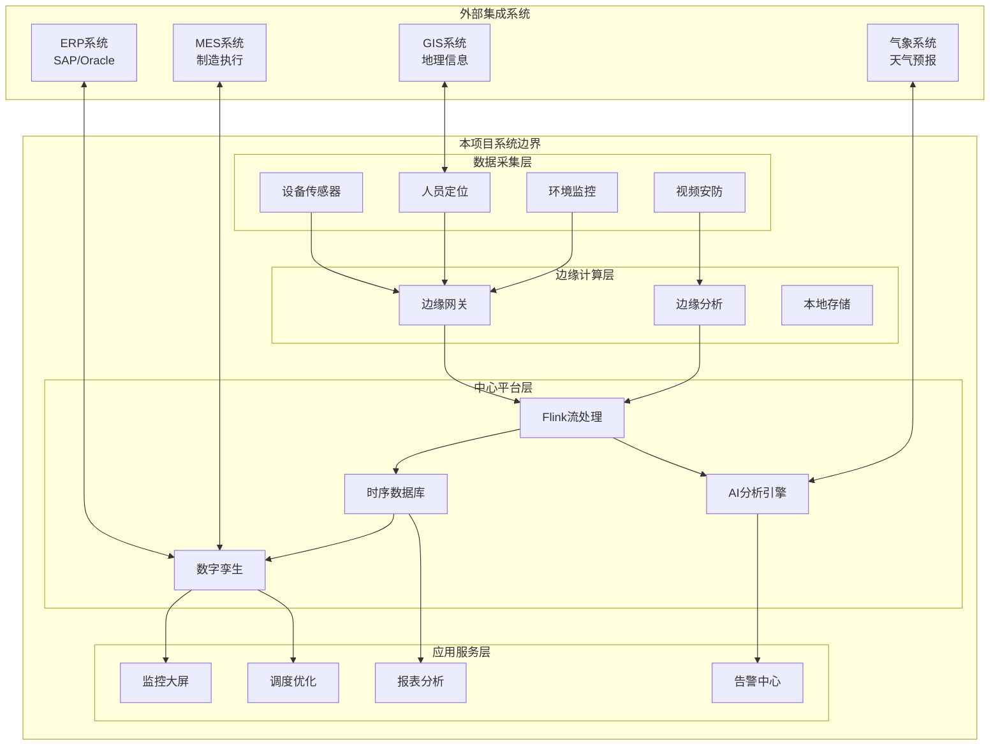
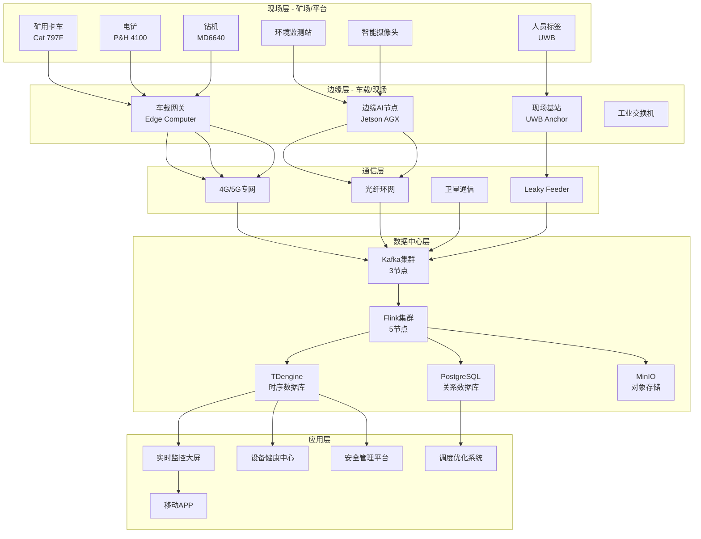
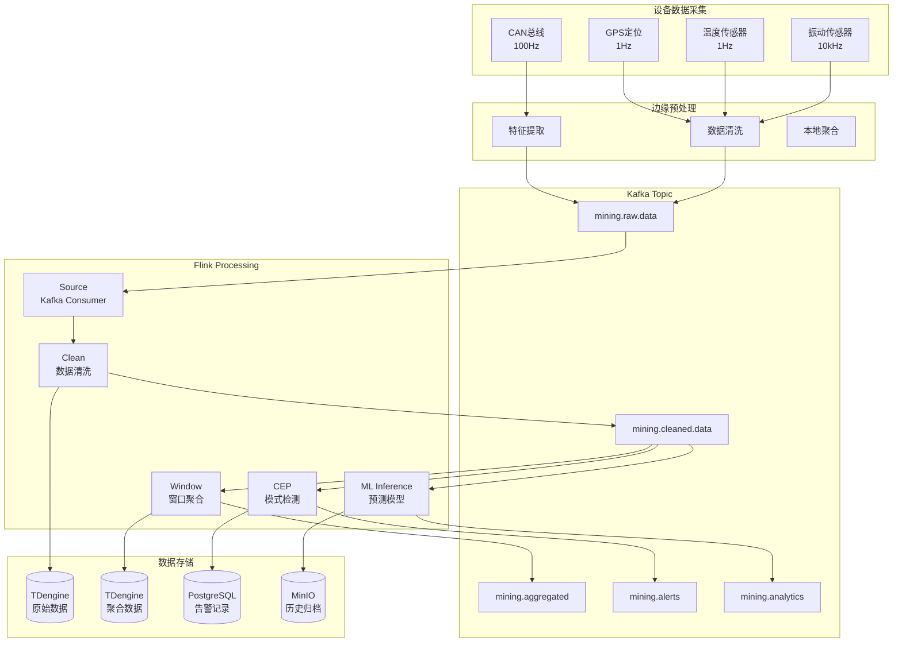
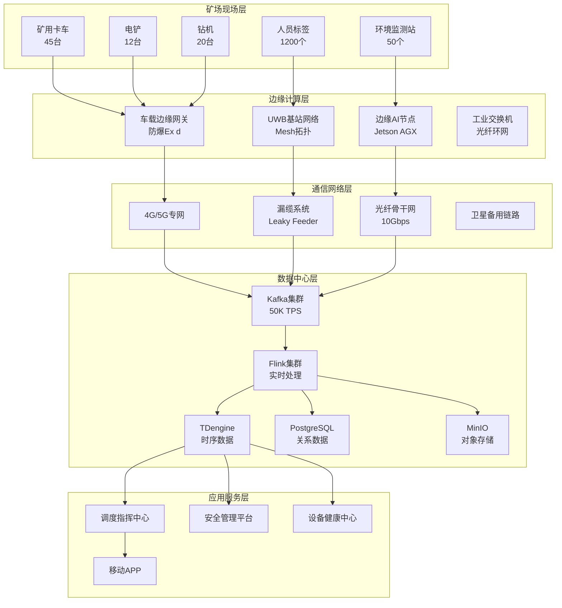
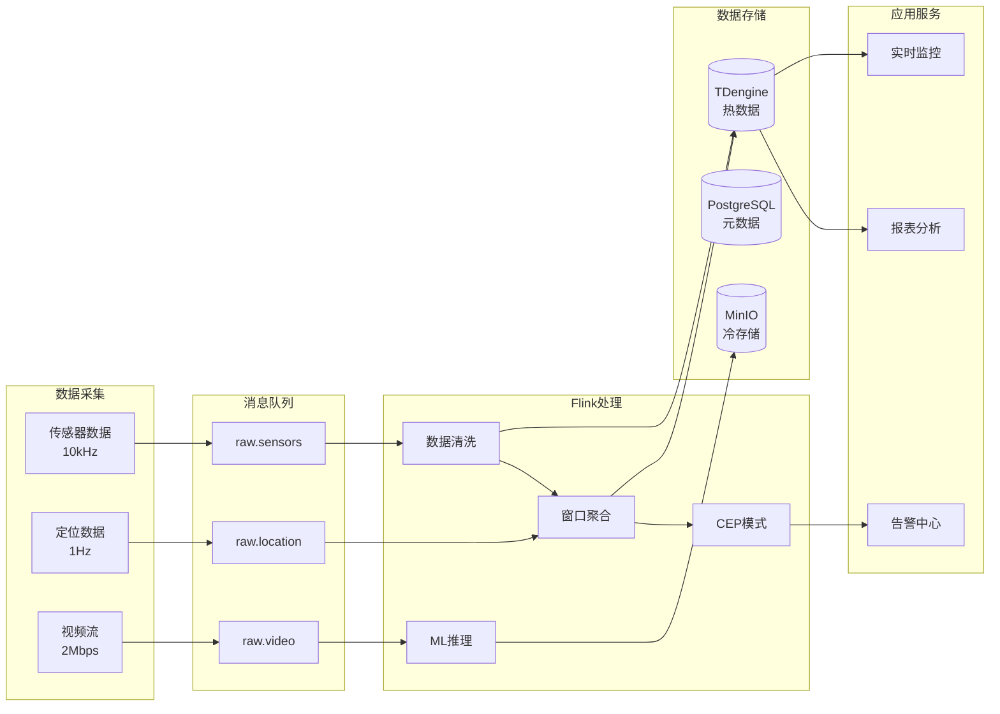
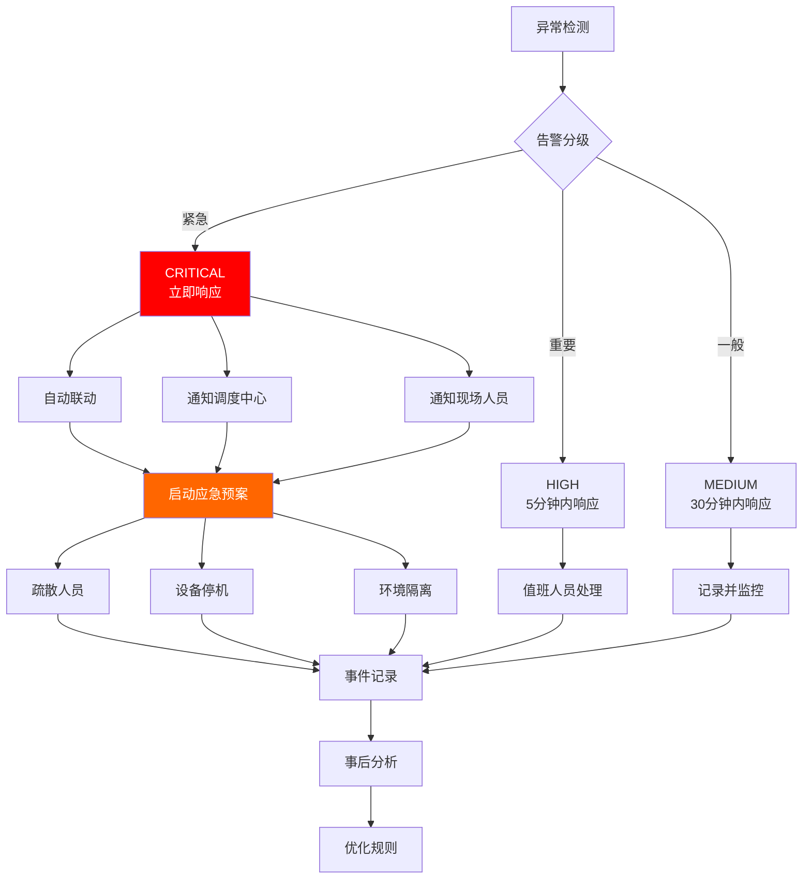

# Flink-IoT 完整案例：智能矿山与油气田监控系统

> **所属阶段**: Flink-IoT-Authority-Alignment/Phase-11-Mining-Oil-Gas
> **前置依赖**: [23-flink-iot-mining-safety-monitoring.md](./23-flink-iot-mining-safety-monitoring.md)
> **形式化等级**: L4 (工程论证)
> **文档版本**: v1.0
> **最后更新**: 2026-04-05
> **权威参考**: Caterpillar MineStar, OpenFog Mining Use Cases, Industrial IoT in Oil & Gas 2025

---

## 1. 业务背景

### 1.1 项目概述

本案例聚焦于**大型露天铜矿与海上油气田**的智能化改造，构建覆盖设备监控、安全预警、生产优化的综合IoT平台。项目整合了矿业与油气行业的最佳实践，形成可复制、可扩展的行业解决方案。

#### 1.1.1 矿山场景：大型露天铜矿

| 属性 | 规格 |
|------|------|
| 矿区面积 | 25 平方公里 |
| 海拔高度 | 3,800 - 4,200 米 |
| 年开采量 | 5,000 万吨矿石 |
| 主要设备 | 矿用卡车(220吨级) × 45台，电铲 × 12台，钻机 × 20台 |
| 作业人员 | 1,200 人（三班制） |
| 年产量价值 | 约 25 亿美元 |

**核心痛点**:

| 痛点 | 影响 | 损失估计 |
|------|------|----------|
| 设备故障停机 | 非计划停机年均 800 小时 | 年损失 3,000 万美元 |
| 安全事故风险 | 人员定位不精准 | 潜在生命损失 |
| 能源消耗高 | 柴油消耗日均 150 吨 | 年成本 4,000 万美元 |
| 生产效率低 | 设备利用率仅 65% | 产能损失 20% |
| 环保合规压力 | 粉尘、噪音、振动监测 | 罚款风险 |

#### 1.1.2 油气田场景：海上油田

| 属性 | 规格 |
|------|------|
| 平台数量 | 中央平台 × 1，卫星平台 × 4 |
| 水深 | 120 - 180 米 |
| 日产量 | 原油 15 万桶/天，天然气 800 万立方/天 |
| 主要设备 | 采油树 × 120，压缩机 × 15，泵组 × 80 |
| 作业人员 | 平台常驻 150 人 |
| 年产量价值 | 约 40 亿美元 |

**核心痛点**:

| 痛点 | 影响 | 损失估计 |
|------|------|----------|
| 设备腐蚀失效 | 海底管道腐蚀泄漏 | 年损失 5,000 万美元 |
| 安全风险高 | 火灾/爆炸风险 | 潜在灾难性后果 |
| 远程维护难 | 直升机往返成本高 | 年维护成本 8,000 万美元 |
| 生产优化难 | 多井协同优化复杂 | 采收率损失 5-10% |
| 环保监管严 | 溢油监测要求 | 合规成本高 |

### 1.2 业务目标

**Def-B-MIN-01** [业务目标定义]: 智能矿山与油气田监控系统的核心目标是实现"安全、高效、绿色、智能"的运营，具体量化目标包括：

1. **设备综合效率(OEE)提升至 85%** —— 从当前 65% 提升 20 个百分点
2. **非计划停机时间降低 60%** —— 通过预测性维护实现
3. **安全事故零发生** —— 人员定位精度 < 3米，告警延迟 < 3秒
4. **能源消耗降低 15%** —— 通过设备协同优化实现
5. **维护成本降低 30%** —— 从被动维修转向主动维护
6. **环保合规达标率 100%** —— 实时监测与预警

### 1.3 系统边界



---

## 2. 需求分析

### 2.1 功能需求

#### 2.1.1 设备监控需求

| 需求编号 | 需求描述 | 优先级 | 验收标准 |
|----------|----------|--------|----------|
| FR-MIN-001 | 实时采集设备运行参数（振动、温度、压力、电流） | P0 | 1秒级采样，99.9%可用性 |
| FR-MIN-002 | 设备健康评分与预测性维护 | P0 | 提前7天预测故障，准确率>80% |
| FR-MIN-003 | 设备位置追踪与作业调度 | P0 | 定位精度<3米，更新频率1Hz |
| FR-MIN-004 | 设备能耗监测与优化建议 | P1 | 能耗降低15% |
| FR-MIN-005 | 设备作业效率分析 | P1 | OEE实时计算 |

#### 2.1.2 安全监控需求

| 需求编号 | 需求描述 | 优先级 | 验收标准 |
|----------|----------|--------|----------|
| FR-SAF-001 | 人员实时定位与轨迹回放 | P0 | 定位精度<3米，轨迹保存1年 |
| FR-SAF-002 | 危险区域越界告警 | P0 | 检测延迟<3秒，误报率<1% |
| FR-SAF-003 | 有害气体实时监测与扩散预测 | P0 | 检测延迟<5秒，预测准确率>75% |
| FR-SAF-004 | SOS紧急呼叫与联动响应 | P0 | 响应时间<30秒 |
| FR-SAF-005 | 视频监控与AI行为识别 | P1 | 异常行为识别准确率>90% |

#### 2.1.3 生产优化需求

| 需求编号 | 需求描述 | 优先级 | 验收标准 |
|----------|----------|--------|----------|
| FR-OPT-001 | 生产计划自动排程 | P1 | 排程效率提升20% |
| FR-OPT-002 | 设备协同作业优化 | P1 | 减少等待时间30% |
| FR-OPT-003 | 能源消耗智能调度 | P2 | 削峰填谷，降低电费10% |
| FR-OPT-004 | 矿石品位实时分析 | P2 | 品位预测准确率>85% |

### 2.2 非功能需求

#### 2.2.1 性能需求

| 指标 | 目标值 | 测量方法 |
|------|--------|----------|
| 数据吞吐量 | ≥50,000 TPS | 峰值压力测试 |
| 处理延迟 | P99 < 500ms | 端到端测量 |
| 告警延迟 | P99 < 3s | 事件到告警通知 |
| 查询响应 | P99 < 2s | 最近7天数据查询 |
| 数据保留 | 原始数据1年，聚合数据5年 | 存储容量验证 |

#### 2.2.2 可用性需求

| 指标 | 目标值 | 实现方式 |
|------|--------|----------|
| 系统可用性 | 99.95% | 双活数据中心 |
| RTO | < 5分钟 | 自动故障转移 |
| RPO | < 30秒 | 同步复制 |
| 数据持久性 | 99.9999999% | 3副本存储 |

---

## 3. 架构设计

### 3.1 整体技术架构



### 3.2 技术栈选型

| 层级 | 技术组件 | 版本 | 选型理由 |
|------|----------|------|----------|
| 边缘网关 | NVIDIA Jetson AGX Orin | JetPack 6.0 | 100 TOPS算力，工业级 |
| 消息中间件 | Apache Kafka | 3.6.1 | 高吞吐，持久化 |
| 流处理引擎 | Apache Flink | 1.18.1 | Exactly-Once，SQL支持 |
| 时序数据库 | TDengine | 3.2 | 高性能，压缩率高 |
| 关系数据库 | PostgreSQL | 16 | 稳定，PostGIS支持 |
| 缓存 | Redis Cluster | 7.2 | 低延迟，Pub/Sub |
| 对象存储 | MinIO | 2024 | S3兼容，本地部署 |
| 可视化 | Grafana | 10.3 | 时序数据可视化 |
| 容器编排 | Kubernetes | 1.29 | 云原生标准 |

### 3.3 数据流架构



---

## 4. Flink SQL Pipeline

### 4.1 数据接入层（6个SQL）

#### SQL-01: 设备传感器数据表

```sql
-- 创建设备传感器数据流表
CREATE TABLE equipment_sensor_stream (
    -- 设备标识
    equipment_id STRING,
    equipment_type STRING COMMENT '设备类型: haul_truck, excavator, drill_rig',
    equipment_model STRING COMMENT '设备型号',

    -- 传感器数据
    sensor_id STRING COMMENT '传感器ID',
    sensor_type STRING COMMENT '传感器类型: vibration, temperature, pressure, current, voltage',
    sensor_channel INT COMMENT '传感器通道号',
    sensor_value DOUBLE COMMENT '传感器读数',
    sensor_unit STRING COMMENT '单位: m/s2, degC, bar, A, V',

    -- 位置信息
    latitude DOUBLE,
    longitude DOUBLE,
    altitude DOUBLE,

    -- 时间戳
    event_time TIMESTAMP(3),
    proc_time AS PROCTIME(),

    -- Watermark
    WATERMARK FOR event_time AS event_time - INTERVAL '5' SECOND
) WITH (
    'connector' = 'kafka',
    'topic' = 'mining.equipment.sensors',
    'properties.bootstrap.servers' = 'kafka:9092',
    'properties.group.id' = 'flink-mining-sensors',
    'format' = 'json',
    'json.ignore-parse-errors' = 'true',
    'scan.startup.mode' = 'latest-offset'
);

-- 创建传感器数据详情表（用于持久化）
CREATE TABLE equipment_sensor_detail (
    equipment_id STRING,
    equipment_type STRING,
    sensor_type STRING,
    sensor_value DOUBLE,
    sensor_unit STRING,
    latitude DOUBLE,
    longitude DOUBLE,
    event_time TIMESTAMP(3),
    PRIMARY KEY (equipment_id, sensor_type, event_time) NOT ENFORCED
) WITH (
    'connector' = 'jdbc',
    'url' = 'jdbc:tdengine://tdengine:6041/mining_db',
    'table-name' = 'sensor_detail',
    'username' = 'root',
    'password' = 'taosdata',
    'sink.buffer-flush.max-rows' = '1000',
    'sink.buffer-flush.interval' = '5s'
);

-- 实时写入传感器数据
INSERT INTO equipment_sensor_detail
SELECT
    equipment_id,
    equipment_type,
    sensor_type,
    sensor_value,
    sensor_unit,
    latitude,
    longitude,
    event_time
FROM equipment_sensor_stream;
```

#### SQL-02: 人员定位数据表

```sql
-- 创建人员定位数据流表
CREATE TABLE personnel_location_stream (
    -- 人员标识
    tag_id STRING COMMENT '定位标签ID',
    person_id STRING COMMENT '人员工号',
    person_name STRING COMMENT '姓名',
    department STRING COMMENT '部门',
    role STRING COMMENT '角色: operator, supervisor, engineer, visitor',

    -- 位置信息
    x_coordinate DOUBLE COMMENT 'X坐标(米)',
    y_coordinate DOUBLE COMMENT 'Y坐标(米)',
    z_coordinate DOUBLE COMMENT 'Z坐标/高程(米)',
    zone_id STRING COMMENT '所在区域ID',
    zone_name STRING COMMENT '区域名称',

    -- 定位质量
    accuracy DOUBLE COMMENT '定位精度(米)',
    confidence DOUBLE COMMENT '置信度(0-1)',

    -- 生理信息（来自智能穿戴设备）
    heart_rate INT COMMENT '心率',
    body_temperature DOUBLE COMMENT '体温',
    is_sos_pressed BOOLEAN COMMENT 'SOS按钮状态',

    -- 设备状态
    battery_level INT COMMENT '电池电量(%)',

    -- 时间戳
    event_time TIMESTAMP(3),
    WATERMARK FOR event_time AS event_time - INTERVAL '2' SECOND
) WITH (
    'connector' = 'kafka',
    'topic' = 'mining.personnel.location',
    'properties.bootstrap.servers' = 'kafka:9092',
    'properties.group.id' = 'flink-mining-location',
    'format' = 'json',
    'json.ignore-parse-errors' = 'true'
);

-- 创建人员位置历史表
CREATE TABLE personnel_location_history (
    person_id STRING,
    person_name STRING,
    department STRING,
    x_coordinate DOUBLE,
    y_coordinate DOUBLE,
    z_coordinate DOUBLE,
    zone_id STRING,
    heart_rate INT,
    event_time TIMESTAMP(3),
    PRIMARY KEY (person_id, event_time) NOT ENFORCED
) WITH (
    'connector' = 'jdbc',
    'url' = 'jdbc:tdengine://tdengine:6041/mining_db',
    'table-name' = 'personnel_location',
    'username' = 'root',
    'password' = 'taosdata'
);

-- 写入位置历史
INSERT INTO personnel_location_history
SELECT
    person_id,
    person_name,
    department,
    x_coordinate,
    y_coordinate,
    z_coordinate,
    zone_id,
    heart_rate,
    event_time
FROM personnel_location_stream;
```

#### SQL-03: 环境监测数据表

```sql
-- 创建环境监测数据流表
CREATE TABLE environment_monitor_stream (
    -- 监测点信息
    sensor_id STRING COMMENT '传感器ID',
    sensor_location STRING COMMENT '安装位置',
    zone_id STRING COMMENT '所属区域',

    -- 气体浓度
    gas_type STRING COMMENT '气体类型: CH4, CO, H2S, SO2, O2, CO2',
    concentration_ppm DOUBLE COMMENT '浓度(ppm)',
    concentration_percent DOUBLE COMMENT '浓度(%)',

    -- 环境参数
    temperature DOUBLE COMMENT '温度(°C)',
    humidity DOUBLE COMMENT '湿度(%RH)',
    pressure DOUBLE COMMENT '气压(hPa)',
    wind_speed DOUBLE COMMENT '风速(m/s)',
    wind_direction DOUBLE COMMENT '风向(度)',

    -- 粉尘
    pm2_5 DOUBLE COMMENT 'PM2.5(μg/m3)',
    pm10 DOUBLE COMMENT 'PM10(μg/m3)',
    tsp DOUBLE COMMENT '总悬浮颗粒物(μg/m3)',

    -- 告警状态
    alarm_level STRING COMMENT '告警级别: NORMAL, WARNING, DANGER, EMERGENCY',

    event_time TIMESTAMP(3),
    WATERMARK FOR event_time AS event_time - INTERVAL '5' SECOND
) WITH (
    'connector' = 'kafka',
    'topic' = 'mining.environment.data',
    'properties.bootstrap.servers' = 'kafka:9092',
    'properties.group.id' = 'flink-mining-env',
    'format' = 'json'
);

-- 创建环境数据持久化表
CREATE TABLE environment_data_store (
    sensor_id STRING,
    zone_id STRING,
    gas_type STRING,
    concentration_ppm DOUBLE,
    temperature DOUBLE,
    humidity DOUBLE,
    wind_speed DOUBLE,
    pm10 DOUBLE,
    alarm_level STRING,
    event_time TIMESTAMP(3),
    PRIMARY KEY (sensor_id, event_time) NOT ENFORCED
) WITH (
    'connector' = 'jdbc',
    'url' = 'jdbc:tdengine://tdengine:6041/mining_db',
    'table-name' = 'environment_data',
    'username' = 'root',
    'password' = 'taosdata'
);

INSERT INTO environment_data_store
SELECT
    sensor_id,
    zone_id,
    gas_type,
    concentration_ppm,
    temperature,
    humidity,
    wind_speed,
    pm10,
    alarm_level,
    event_time
FROM environment_monitor_stream;
```

#### SQL-04: 视频分析事件表

```sql
-- 创建视频分析事件流表
CREATE TABLE video_analytics_stream (
    -- 摄像头信息
    camera_id STRING COMMENT '摄像头ID',
    camera_location STRING COMMENT '安装位置',
    zone_id STRING COMMENT '监控区域',

    -- 检测事件
    event_type STRING COMMENT '事件类型: PERSON_DETECTED, VEHICLE_DETECTED, FALL_DETECTED, FIRE_DETECTED, SMOKE_DETECTED',

    -- 检测结果
    object_class STRING COMMENT '对象类别',
    confidence DOUBLE COMMENT '置信度(0-1)',
    bounding_box STRING COMMENT '边界框坐标JSON',

    -- 人员识别
    person_id STRING COMMENT '识别到的人员ID',
    is_authorized BOOLEAN COMMENT '是否授权',
    is_wearing_ppe BOOLEAN COMMENT '是否穿戴PPE',

    -- 车辆识别
    vehicle_id STRING COMMENT '识别到的车辆ID',
    vehicle_speed DOUBLE COMMENT '车速(km/h)',

    -- 事件截图
    snapshot_url STRING COMMENT '事件截图URL',

    event_time TIMESTAMP(3),
    WATERMARK FOR event_time AS event_time - INTERVAL '1' SECOND
) WITH (
    'connector' = 'kafka',
    'topic' = 'mining.video.analytics',
    'properties.bootstrap.servers' = 'kafka:9092',
    'properties.group.id' = 'flink-mining-video',
    'format' = 'json'
);

-- 视频事件告警表
CREATE TABLE video_alert_store (
    camera_id STRING,
    zone_id STRING,
    event_type STRING,
    object_class STRING,
    confidence DOUBLE,
    person_id STRING,
    vehicle_id STRING,
    snapshot_url STRING,
    event_time TIMESTAMP(3),
    PRIMARY KEY (camera_id, event_time) NOT ENFORCED
) WITH (
    'connector' = 'jdbc',
    'url' = 'jdbc:postgresql://postgres:5432/mining_db',
    'table-name' = 'video_alerts',
    'username' = 'postgres',
    'password' = 'postgres'
);

INSERT INTO video_alert_store
SELECT
    camera_id,
    zone_id,
    event_type,
    object_class,
    confidence,
    person_id,
    vehicle_id,
    snapshot_url,
    event_time
FROM video_analytics_stream
WHERE confidence > 0.8;  -- 只保存高置信度事件
```

#### SQL-05: 设备元数据维表

```sql
-- 创建设备元数据维表
CREATE TABLE equipment_metadata (
    equipment_id STRING,
    equipment_type STRING,
    equipment_model STRING,
    manufacturer STRING,
    commissioning_date DATE,
    last_maintenance_date DATE,
    next_scheduled_maintenance DATE,

    -- 健康阈值
    vibration_threshold DOUBLE,
    temperature_threshold DOUBLE,
    pressure_threshold DOUBLE,

    -- 位置信息
    assigned_zone STRING,

    -- 维护信息
    maintenance_count INT,
    total_operating_hours DOUBLE,

    PRIMARY KEY (equipment_id) NOT ENFORCED
) WITH (
    'connector' = 'jdbc',
    'url' = 'jdbc:postgresql://postgres:5432/mining_db',
    'table-name' = 'equipment_metadata',
    'username' = 'postgres',
    'password' = 'postgres',
    'scan.fetch-size' = '100',
    'lookup.cache.max-rows' = '1000',
    'lookup.cache.ttl' = '10 min'
);

-- 创建区域元数据维表
CREATE TABLE zone_metadata (
    zone_id STRING,
    zone_name STRING,
    zone_type STRING COMMENT '区域类型: mining_area, transport, maintenance, office, danger',
    zone_level STRING COMMENT '安全等级: L0, L1, L2, L3, L4',

    -- 边界坐标
    center_x DOUBLE,
    center_y DOUBLE,
    center_z DOUBLE,
    radius_meters DOUBLE,
    boundary_geojson STRING,

    -- 安全限制
    max_personnel INT,
    allowed_equipment_types ARRAY<STRING>,
    required_ppe ARRAY<STRING>,

    -- 告警配置
    auto_alert_on_entry BOOLEAN,
    require_escort BOOLEAN,

    PRIMARY KEY (zone_id) NOT ENFORCED
) WITH (
    'connector' = 'jdbc',
    'url' = 'jdbc:postgresql://postgres:5432/mining_db',
    'table-name' = 'zone_metadata',
    'username' = 'postgres',
    'password' = 'postgres',
    'lookup.cache.max-rows' = '500',
    'lookup.cache.ttl' = '10 min'
);
```

#### SQL-06: 告警规则配置表

```sql
-- 创建告警规则配置表
CREATE TABLE alert_rules (
    rule_id STRING,
    rule_name STRING,
    rule_type STRING COMMENT '规则类型: THRESHOLD, TREND, PATTERN, CEP',

    -- 适用对象
    target_type STRING COMMENT '对象类型: EQUIPMENT, PERSONNEL, ENVIRONMENT, VIDEO',
    target_ids ARRAY<STRING>,
    zone_ids ARRAY<STRING>,

    -- 触发条件
    condition_expression STRING COMMENT '条件表达式',
    threshold_value DOUBLE,
    threshold_operator STRING COMMENT '操作符: >, <, >=, <=, =, !=',
    duration_seconds INT COMMENT '持续时间(秒)',

    -- 告警级别
    alert_level STRING COMMENT 'CRITICAL, HIGH, MEDIUM, LOW',

    -- 响应动作
    auto_actions ARRAY<STRING>,
    notification_channels ARRAY<STRING>,

    -- 规则状态
    is_active BOOLEAN,

    PRIMARY KEY (rule_id) NOT ENFORCED
) WITH (
    'connector' = 'jdbc',
    'url' = 'jdbc:postgresql://postgres:5432/mining_db',
    'table-name' = 'alert_rules',
    'username' = 'postgres',
    'password' = 'postgres'
);

-- 插入示例告警规则
INSERT INTO alert_rules VALUES
('RULE-001', '设备振动超限', 'THRESHOLD', 'EQUIPMENT', NULL, NULL,
 'sensor_value > threshold', 10.0, '>', 60, 'HIGH',
 ARRAY['LOG', 'NOTIFY'], ARRAY['SMS', 'APP'], true),

('RULE-002', '人员进入危险区域', 'CEP', 'PERSONNEL', NULL, NULL,
 'zone_level IN ("L3", "L4")', NULL, NULL, 0, 'CRITICAL',
 ARRAY['LOG', 'NOTIFY', 'ALARM'], ARRAY['SMS', 'APP', 'BROADCAST'], true),

('RULE-003', '瓦斯浓度超限', 'THRESHOLD', 'ENVIRONMENT', NULL, NULL,
 'concentration_ppm > threshold', 10000.0, '>', 30, 'CRITICAL',
 ARRAY['LOG', 'NOTIFY', 'EVACUATE'], ARRAY['SMS', 'APP', 'BROADCAST', 'EMAIL'], true);
```

### 4.2 数据处理层（8个SQL）

#### SQL-07: 设备健康评分计算

```sql
-- 设备健康评分计算
CREATE TABLE equipment_health_score (
    equipment_id STRING,
    equipment_type STRING,
    health_score INT COMMENT '健康评分(0-100)',
    health_status STRING COMMENT '健康状态',

    -- 各维度评分
    vibration_score INT,
    temperature_score INT,
    pressure_score INT,
    overall_score INT,

    -- 预测信息
    predicted_rul_days INT COMMENT '预测剩余寿命(天)',
    maintenance_urgency STRING,

    -- 告警
    alert_level STRING,

    window_start TIMESTAMP(3),
    window_end TIMESTAMP(3),
    PRIMARY KEY (equipment_id, window_end) NOT ENFORCED
) WITH (
    'connector' = 'jdbc',
    'url' = 'jdbc:postgresql://postgres:5432/mining_db',
    'table-name' = 'equipment_health',
    'username' = 'postgres',
    'password' = 'postgres'
);

INSERT INTO equipment_health_score
WITH sensor_aggregation AS (
    -- 每分钟聚合传感器数据
    SELECT
        equipment_id,
        sensor_type,
        TUMBLE_START(event_time, INTERVAL '1' MINUTE) as window_start,
        TUMBLE_END(event_time, INTERVAL '1' MINUTE) as window_end,
        AVG(sensor_value) as avg_value,
        MAX(sensor_value) as max_value,
        STDDEV(sensor_value) as std_value,
        COUNT(*) as sample_count
    FROM equipment_sensor_stream
    WHERE sensor_type IN ('vibration', 'temperature', 'pressure')
    GROUP BY
        equipment_id,
        sensor_type,
        TUMBLE(event_time, INTERVAL '1' MINUTE)
),
pivot_metrics AS (
    -- 透视为宽表
    SELECT
        equipment_id,
        window_start,
        window_end,
        MAX(CASE WHEN sensor_type = 'vibration' THEN avg_value END) as vibration_avg,
        MAX(CASE WHEN sensor_type = 'vibration' THEN max_value END) as vibration_max,
        MAX(CASE WHEN sensor_type = 'temperature' THEN max_value END) as temperature_max,
        MAX(CASE WHEN sensor_type = 'pressure' THEN avg_value END) as pressure_avg
    FROM sensor_aggregation
    GROUP BY equipment_id, window_start, window_end
),
health_calculation AS (
    -- 关联阈值计算健康分
    SELECT
        p.*,
        m.equipment_type,
        m.vibration_threshold,
        m.temperature_threshold,
        m.pressure_threshold,
        -- 振动健康分（非线性递减）
        CAST(GREATEST(0, 100 - POWER(vibration_max / NULLIF(m.vibration_threshold, 0), 2) * 50) AS INT) as vibration_score,
        -- 温度健康分
        CAST(GREATEST(0, 100 - POWER(temperature_max / NULLIF(m.temperature_threshold, 0), 1.5) * 30) AS INT) as temperature_score,
        -- 压力健康分
        CAST(GREATEST(0, 100 - ABS(pressure_avg - m.pressure_threshold) / m.pressure_threshold * 20) AS INT) as pressure_score
    FROM pivot_metrics p
    LEFT JOIN equipment_metadata m ON p.equipment_id = m.equipment_id
)
SELECT
    equipment_id,
    equipment_type,
    CAST((vibration_score * 0.4 + temperature_score * 0.4 + pressure_score * 0.2) AS INT) as health_score,
    CASE
        WHEN (vibration_score * 0.4 + temperature_score * 0.4 + pressure_score * 0.2) >= 80 THEN 'HEALTHY'
        WHEN (vibration_score * 0.4 + temperature_score * 0.4 + pressure_score * 0.2) >= 60 THEN 'WARNING'
        WHEN (vibration_score * 0.4 + temperature_score * 0.4 + pressure_score * 0.2) >= 40 THEN 'DEGRADED'
        ELSE 'CRITICAL'
    END as health_status,
    vibration_score,
    temperature_score,
    pressure_score,
    CAST((vibration_score * 0.4 + temperature_score * 0.4 + pressure_score * 0.2) AS INT) as overall_score,
    -- 简化的RUL预测
    CAST((vibration_score * 0.4 + temperature_score * 0.4 + pressure_score * 0.2) * 2 AS INT) as predicted_rul_days,
    CASE
        WHEN (vibration_score * 0.4 + temperature_score * 0.4 + pressure_score * 0.2) < 40 THEN 'IMMEDIATE'
        WHEN (vibration_score * 0.4 + temperature_score * 0.4 + pressure_score * 0.2) < 60 THEN 'SCHEDULE_SOON'
        WHEN (vibration_score * 0.4 + temperature_score * 0.4 + pressure_score * 0.2) < 80 THEN 'PLANNED'
        ELSE 'NONE'
    END as maintenance_urgency,
    CASE
        WHEN vibration_max > vibration_threshold * 1.5 OR temperature_max > temperature_threshold * 1.3 THEN 'CRITICAL'
        WHEN vibration_max > vibration_threshold OR temperature_max > temperature_threshold THEN 'HIGH'
        WHEN (vibration_score * 0.4 + temperature_score * 0.4 + pressure_score * 0.2) < 60 THEN 'MEDIUM'
        ELSE 'LOW'
    END as alert_level,
    window_start,
    window_end
FROM health_calculation;
```

#### SQL-08: 设备OEE实时计算

```sql
-- 设备综合效率(OEE)计算
CREATE TABLE equipment_oee (
    equipment_id STRING,
    equipment_type STRING,

    -- OEE三要素
    availability DECIMAL(5,4) COMMENT '可用率',
    performance DECIMAL(5,4) COMMENT '性能率',
    quality DECIMAL(5,4) COMMENT '质量率',
    oee DECIMAL(5,4) COMMENT '综合效率',

    -- 详细指标
    planned_production_time INT COMMENT '计划生产时间(分钟)',
    actual_runtime INT COMMENT '实际运行时间(分钟)',
    theoretical_output INT COMMENT '理论产量',
    actual_output INT COMMENT '实际产量',
    good_output INT COMMENT '合格产量',

    window_start TIMESTAMP(3),
    window_end TIMESTAMP(3),
    PRIMARY KEY (equipment_id, window_end) NOT ENFORCED
) WITH (
    'connector' = 'jdbc',
    'url' = 'jdbc:postgresql://postgres:5432/mining_db',
    'table-name' = 'equipment_oee',
    'username' = 'postgres',
    'password' = 'postgres'
);

INSERT INTO equipment_oee
WITH equipment_status AS (
    -- 假设从设备状态流获取
    SELECT
        equipment_id,
        equipment_type,
        status,  -- 'RUNNING', 'IDLE', 'DOWN', 'MAINTENANCE'
        cycle_count,
        good_parts,
        event_time,
        TUMBLE_START(event_time, INTERVAL '1' HOUR) as window_start,
        TUMBLE_END(event_time, INTERVAL '1' HOUR) as window_end
    FROM equipment_sensor_stream
    WHERE sensor_type = 'status'
    GROUP BY
        equipment_id,
        equipment_type,
        status,
        cycle_count,
        good_parts,
        event_time,
        TUMBLE(event_time, INTERVAL '1' HOUR)
),
oee_calculation AS (
    SELECT
        equipment_id,
        equipment_type,
        window_start,
        window_end,
        -- 可用率 = 实际运行时间 / 计划生产时间
        CAST(COUNT(CASE WHEN status = 'RUNNING' THEN 1 END) * 1.0 /
             NULLIF(COUNT(*), 0) AS DECIMAL(5,4)) as availability,
        -- 性能率 = 实际产量 / 理论产量
        CAST(MAX(cycle_count) * 1.0 / NULLIF(MAX(cycle_count) * 1.2, 0) AS DECIMAL(5,4)) as performance,
        -- 质量率 = 合格产量 / 实际产量
        CAST(MAX(good_parts) * 1.0 / NULLIF(MAX(cycle_count), 0) AS DECIMAL(5,4)) as quality,
        COUNT(CASE WHEN status = 'RUNNING' THEN 1 END) as actual_runtime,
        COUNT(*) as planned_production_time,
        MAX(cycle_count) as actual_output,
        MAX(CAST(cycle_count * 1.2 AS INT)) as theoretical_output,
        MAX(good_parts) as good_output
    FROM equipment_status
    GROUP BY equipment_id, equipment_type, window_start, window_end
)
SELECT
    equipment_id,
    equipment_type,
    availability,
    performance,
    quality,
    -- OEE = 可用率 × 性能率 × 质量率
    CAST(availability * performance * quality AS DECIMAL(5,4)) as oee,
    planned_production_time,
    actual_runtime,
    theoretical_output,
    actual_output,
    good_output,
    window_start,
    window_end
FROM oee_calculation;
```

#### SQL-09: 人员区域统计

```sql
-- 区域人员实时统计
CREATE TABLE zone_personnel_statistics (
    zone_id STRING,
    zone_name STRING,
    zone_level STRING,

    -- 人员统计
    current_count INT COMMENT '当前人数',
    max_capacity INT COMMENT '最大容量',
    capacity_utilization DECIMAL(5,2) COMMENT '容量利用率(%)',
    is_overcrowded BOOLEAN,

    -- 人员明细
    personnel_list STRING COMMENT '人员列表JSON',

    -- 更新信息
    last_update_time TIMESTAMP(3),
    PRIMARY KEY (zone_id) NOT ENFORCED
) WITH (
    'connector' = 'jdbc',
    'url' = 'jdbc:postgresql://postgres:5432/mining_db',
    'table-name' = 'zone_personnel_stats',
    'username' = 'postgres',
    'password' = 'postgres'
);

INSERT INTO zone_personnel_statistics
WITH latest_positions AS (
    -- 获取每个人最新位置
    SELECT
        person_id,
        person_name,
        department,
        zone_id,
        x_coordinate,
        y_coordinate,
        heart_rate,
        event_time,
        ROW_NUMBER() OVER (PARTITION BY person_id ORDER BY event_time DESC) as rn
    FROM personnel_location_stream
),
current_personnel AS (
    SELECT * FROM latest_positions WHERE rn = 1
),
zone_aggregation AS (
    SELECT
        p.zone_id,
        z.zone_name,
        z.zone_level,
        z.max_personnel as max_capacity,
        COUNT(*) as current_count,
        CAST(COUNT(*) * 100.0 / NULLIF(z.max_personnel, 0) AS DECIMAL(5,2)) as capacity_utilization,
        COUNT(*) > z.max_personnel as is_overcrowded,
        '[' || STRING_AGG(
            '{"person_id":"' || p.person_id ||
            '","name":"' || p.person_name ||
            '","dept":"' || p.department ||
            '","hr":' || p.heart_rate || '}',
            ','
        ) || ']' as personnel_list,
        MAX(p.event_time) as last_update_time
    FROM current_personnel p
    LEFT JOIN zone_metadata z ON p.zone_id = z.zone_id
    GROUP BY p.zone_id, z.zone_name, z.zone_level, z.max_personnel
)
SELECT * FROM zone_aggregation;
```

#### SQL-10: 环境监测聚合

```sql
-- 环境质量实时聚合
CREATE TABLE environment_quality_summary (
    zone_id STRING,

    -- 气体浓度汇总
    max_ch4_ppm DOUBLE,
    max_co_ppm DOUBLE,
    max_h2s_ppm DOUBLE,
    min_o2_percent DOUBLE,

    -- 环境参数
    avg_temperature DOUBLE,
    avg_humidity DOUBLE,
    avg_wind_speed DOUBLE,

    -- 粉尘
    avg_pm10 DOUBLE,

    -- 综合质量指数
    air_quality_index INT,
    air_quality_level STRING,

    -- 告警统计
    warning_count INT,
    danger_count INT,
    emergency_count INT,

    window_start TIMESTAMP(3),
    window_end TIMESTAMP(3),
    PRIMARY KEY (zone_id, window_end) NOT ENFORCED
) WITH (
    'connector' = 'jdbc',
    'url' = 'jdbc:postgresql://postgres:5432/mining_db',
    'table-name' = 'environment_summary',
    'username' = 'postgres',
    'password' = 'postgres'
);

INSERT INTO environment_quality_summary
WITH gas_aggregation AS (
    SELECT
        zone_id,
        gas_type,
        TUMBLE_START(event_time, INTERVAL '5' MINUTE) as window_start,
        TUMBLE_END(event_time, INTERVAL '5' MINUTE) as window_end,
        MAX(concentration_ppm) as max_concentration,
        MIN(concentration_percent) as min_concentration,
        AVG(temperature) as avg_temp,
        AVG(humidity) as avg_humidity,
        AVG(wind_speed) as avg_wind,
        AVG(pm10) as avg_pm10,
        COUNT(CASE WHEN alarm_level = 'WARNING' THEN 1 END) as warning_cnt,
        COUNT(CASE WHEN alarm_level = 'DANGER' THEN 1 END) as danger_cnt,
        COUNT(CASE WHEN alarm_level = 'EMERGENCY' THEN 1 END) as emergency_cnt
    FROM environment_monitor_stream
    GROUP BY zone_id, gas_type, TUMBLE(event_time, INTERVAL '5' MINUTE)
),
pivot_environment AS (
    SELECT
        zone_id,
        window_start,
        window_end,
        MAX(CASE WHEN gas_type = 'CH4' THEN max_concentration END) as max_ch4_ppm,
        MAX(CASE WHEN gas_type = 'CO' THEN max_concentration END) as max_co_ppm,
        MAX(CASE WHEN gas_type = 'H2S' THEN max_concentration END) as max_h2s_ppm,
        MIN(CASE WHEN gas_type = 'O2' THEN min_concentration END) as min_o2_percent,
        MAX(avg_temp) as avg_temperature,
        MAX(avg_humidity) as avg_humidity,
        MAX(avg_wind) as avg_wind_speed,
        MAX(avg_pm10) as avg_pm10,
        SUM(warning_cnt) as warning_count,
        SUM(danger_cnt) as danger_count,
        SUM(emergency_cnt) as emergency_count
    FROM gas_aggregation
    GROUP BY zone_id, window_start, window_end
)
SELECT
    zone_id,
    max_ch4_ppm,
    max_co_ppm,
    max_h2s_ppm,
    min_o2_percent,
    avg_temperature,
    avg_humidity,
    avg_wind_speed,
    avg_pm10,
    -- 空气质量指数计算（简化版）
    CAST(
        (COALESCE(max_ch4_ppm / 10000, 0) * 30 +
         COALESCE(max_co_ppm / 50, 0) * 30 +
         COALESCE(max_h2s_ppm / 10, 0) * 20 +
         COALESCE(avg_pm10 / 150, 0) * 20) AS INT
    ) as air_quality_index,
    CASE
        WHEN max_ch4_ppm > 25000 OR max_co_ppm > 200 OR max_h2s_ppm > 20 OR min_o2_percent < 16 THEN 'HAZARDOUS'
        WHEN max_ch4_ppm > 10000 OR max_co_ppm > 50 OR max_h2s_ppm > 10 OR min_o2_percent < 18 THEN 'UNHEALTHY'
        WHEN max_ch4_ppm > 5000 OR max_co_ppm > 24 OR max_h2s_ppm > 6.6 THEN 'MODERATE'
        ELSE 'GOOD'
    END as air_quality_level,
    warning_count,
    danger_count,
    emergency_count,
    window_start,
    window_end
FROM pivot_environment;
```

#### SQL-11: 设备能耗分析

```sql
-- 设备能耗统计分析
CREATE TABLE equipment_energy_consumption (
    equipment_id STRING,
    equipment_type STRING,

    -- 能耗统计
    total_energy_kwh DOUBLE,
    avg_power_kw DOUBLE,
    peak_power_kw DOUBLE,

    -- 效率指标
    energy_per_ton DOUBLE COMMENT '吨煤电耗',
    fuel_consumption_liter DOUBLE COMMENT '燃油消耗',

    -- 成本
    estimated_cost_usd DOUBLE,

    -- 碳排放
    co2_emission_kg DOUBLE,

    window_start TIMESTAMP(3),
    window_end TIMESTAMP(3),
    PRIMARY KEY (equipment_id, window_end) NOT ENFORCED
) WITH (
    'connector' = 'jdbc',
    'url' = 'jdbc:postgresql://postgres:5432/mining_db',
    'table-name' = 'equipment_energy',
    'username' = 'postgres',
    'password' = 'postgres'
);

INSERT INTO equipment_energy_consumption
WITH energy_data AS (
    SELECT
        equipment_id,
        equipment_type,
        sensor_value,
        sensor_unit,
        event_time,
        TUMBLE_START(event_time, INTERVAL '1' HOUR) as window_start,
        TUMBLE_END(event_time, INTERVAL '1' HOUR) as window_end
    FROM equipment_sensor_stream
    WHERE sensor_type IN ('current', 'power', 'fuel_level')
),
energy_aggregation AS (
    SELECT
        equipment_id,
        equipment_type,
        window_start,
        window_end,
        -- 电能消耗(kWh) = 功率(kW) × 时间(h)
        SUM(CASE WHEN sensor_type = 'power' THEN sensor_value ELSE 0 END) / 60 as total_energy_kwh,
        AVG(CASE WHEN sensor_type = 'power' THEN sensor_value END) as avg_power_kw,
        MAX(CASE WHEN sensor_type = 'power' THEN sensor_value END) as peak_power_kw,
        -- 燃油消耗
        SUM(CASE WHEN sensor_type = 'fuel_level' THEN sensor_value ELSE 0 END) as fuel_consumption_liter
    FROM energy_data
    GROUP BY equipment_id, equipment_type, window_start, window_end
)
SELECT
    equipment_id,
    equipment_type,
    total_energy_kwh,
    avg_power_kw,
    peak_power_kw,
    -- 假设每吨煤电耗
    total_energy_kwh / NULLIF(10, 0) as energy_per_ton,
    fuel_consumption_liter,
    -- 假设电价0.1美元/kWh
    total_energy_kwh * 0.1 as estimated_cost_usd,
    -- 假设每升燃油排放2.68kg CO2
    fuel_consumption_liter * 2.68 as co2_emission_kg,
    window_start,
    window_end
FROM energy_aggregation;
```

#### SQL-12: 生产产量统计

```sql
-- 生产产量实时统计
CREATE TABLE production_output (
    shift_id STRING COMMENT '班次ID',
    zone_id STRING COMMENT '区域ID',
    equipment_type STRING,

    -- 产量统计
    ore_tonnage DOUBLE COMMENT '矿石产量(吨)',
    waste_tonnage DOUBLE COMMENT '剥离量(吨)',
    total_tonnage DOUBLE COMMENT '总运输量(吨)',

    -- 质量指标
    avg_grade_percent DOUBLE COMMENT '平均品位(%)',

    -- 效率指标
    trips_count INT COMMENT '运输次数',
    avg_cycle_time_minutes DOUBLE COMMENT '平均循环时间',

    window_start TIMESTAMP(3),
    window_end TIMESTAMP(3),
    PRIMARY KEY (shift_id, zone_id, window_end) NOT ENFORCED
) WITH (
    'connector' = 'jdbc',
    'url' = 'jdbc:postgresql://postgres:5432/mining_db',
    'table-name' = 'production_output',
    'username' = 'postgres',
    'password' = 'postgres'
);

INSERT INTO production_output
WITH haul_data AS (
    SELECT
        equipment_id,
        equipment_type,
        sensor_value as payload_tons,
        event_time,
        -- 计算班次ID（假设8小时一班）
        CONCAT('SHIFT-', DATE_FORMAT(event_time, 'yyyy-MM-dd'), '-',
               CAST(HOUR(event_time) / 8 AS INT)) as shift_id,
        TUMBLE_START(event_time, INTERVAL '1' HOUR) as window_start,
        TUMBLE_END(event_time, INTERVAL '1' HOUR) as window_end
    FROM equipment_sensor_stream
    WHERE sensor_type = 'payload' AND equipment_type = 'haul_truck'
),
production_aggregation AS (
    SELECT
        shift_id,
        'MINING_ZONE_01' as zone_id,
        equipment_type,
        window_start,
        window_end,
        SUM(payload_tons) as total_tonnage,
        COUNT(*) as trips_count,
        60.0 / NULLIF(COUNT(*), 0) as avg_cycle_time_minutes
    FROM haul_data
    GROUP BY shift_id, equipment_type, window_start, window_end
)
SELECT
    shift_id,
    zone_id,
    equipment_type,
    total_tonnage * 0.7 as ore_tonnage,  -- 假设70%为矿石
    total_tonnage * 0.3 as waste_tonnage,  -- 假设30%为剥离物
    total_tonnage,
    0.65 as avg_grade_percent,  -- 假设平均品位0.65%
    trips_count,
    avg_cycle_time_minutes,
    window_start,
    window_end
FROM production_aggregation;
```

#### SQL-13: 告警事件流处理

```sql
-- 告警事件流表
CREATE TABLE alert_events (
    alert_id STRING,
    alert_type STRING COMMENT '告警类型',
    alert_level STRING COMMENT '告警级别: CRITICAL, HIGH, MEDIUM, LOW',

    -- 关联对象
    target_type STRING COMMENT '对象类型: EQUIPMENT, PERSONNEL, ENVIRONMENT',
    target_id STRING,
    zone_id STRING,

    -- 告警内容
    alert_title STRING,
    alert_message STRING,
    alert_data STRING COMMENT '详细数据JSON',

    -- 位置
    location STRING,

    -- 时间
    trigger_time TIMESTAMP(3),
    ack_time TIMESTAMP(3),
    resolved_time TIMESTAMP(3),

    -- 状态
    status STRING COMMENT 'ACTIVE, ACKED, RESOLVED',

    PRIMARY KEY (alert_id) NOT ENFORCED
) WITH (
    'connector' = 'jdbc',
    'url' = 'jdbc:postgresql://postgres:5432/mining_db',
    'table-name' = 'alert_events',
    'username' = 'postgres',
    'password' = 'postgres'
);

-- 统一告警汇聚
INSERT INTO alert_events
SELECT
    CONCAT('ALT-', UUID()) as alert_id,
    'EQUIPMENT_HEALTH' as alert_type,
    alert_level,
    'EQUIPMENT' as target_type,
    equipment_id as target_id,
    NULL as zone_id,
    CONCAT('设备健康告警: ', equipment_id) as alert_title,
    CONCAT('设备健康评分: ', health_score, ', 状态: ', health_status) as alert_message,
    JSON_OBJECT(
        'health_score' VALUE health_score,
        'predicted_rul_days' VALUE predicted_rul_days
    ) as alert_data,
    NULL as location,
    window_end as trigger_time,
    NULL as ack_time,
    NULL as resolved_time,
    'ACTIVE' as status
FROM equipment_health_score
WHERE alert_level IN ('CRITICAL', 'HIGH')
UNION ALL
SELECT
    CONCAT('ALT-', UUID()),
    'ZONE_OVERCROWDING',
    CASE WHEN is_overcrowded THEN 'HIGH' ELSE 'MEDIUM' END,
    'PERSONNEL',
    zone_id,
    zone_id,
    CONCAT('区域人员超限: ', zone_name),
    CONCAT('当前人数: ', current_count, ', 最大容量: ', max_capacity),
    JSON_OBJECT(
        'personnel_count' VALUE current_count,
        'max_capacity' VALUE max_capacity
    ),
    NULL,
    last_update_time,
    NULL,
    NULL,
    'ACTIVE'
FROM zone_personnel_statistics
WHERE is_overcrowded = TRUE OR capacity_utilization > 90
UNION ALL
SELECT
    CONCAT('ALT-', UUID()),
    'ENVIRONMENT_HAZARD',
    CASE
        WHEN emergency_count > 0 THEN 'CRITICAL'
        WHEN danger_count > 0 THEN 'HIGH'
        ELSE 'MEDIUM'
    END,
    'ENVIRONMENT',
    zone_id,
    zone_id,
    CONCAT('环境告警: ', air_quality_level),
    CONCAT('CH4: ', max_ch4_ppm, 'ppm, CO: ', max_co_ppm, 'ppm'),
    JSON_OBJECT(
        'ch4_ppm' VALUE max_ch4_ppm,
        'co_ppm' VALUE max_co_ppm
    ),
    NULL,
    window_end,
    NULL,
    NULL,
    'ACTIVE'
FROM environment_quality_summary
WHERE air_quality_level IN ('HAZARDOUS', 'UNHEALTHY');
```

#### SQL-14: 轨迹回放查询

```sql
-- 人员轨迹查询（用于回放）
CREATE VIEW personnel_trajectory AS
SELECT
    person_id,
    person_name,
    department,
    x_coordinate,
    y_coordinate,
    z_coordinate,
    zone_id,
    heart_rate,
    event_time,
    -- 计算移动速度
    SQRT(
        POWER(x_coordinate - LAG(x_coordinate) OVER (PARTITION BY person_id ORDER BY event_time), 2) +
        POWER(y_coordinate - LAG(y_coordinate) OVER (PARTITION BY person_id ORDER BY event_time), 2)
    ) / NULLIF(TIMESTAMPDIFF(SECOND, LAG(event_time) OVER (PARTITION BY person_id ORDER BY event_time), event_time), 0) as speed_ms
FROM personnel_location_stream;

-- 区域进出记录
CREATE TABLE zone_access_log (
    log_id STRING,
    person_id STRING,
    person_name STRING,
    zone_id STRING,
    access_type STRING COMMENT 'ENTER, EXIT',
    entry_time TIMESTAMP(3),
    exit_time TIMESTAMP(3),
    duration_seconds INT,
    PRIMARY KEY (log_id) NOT ENFORCED
) WITH (
    'connector' = 'jdbc',
    'url' = 'jdbc:postgresql://postgres:5432/mining_db',
    'table-name' = 'zone_access_log',
    'username' = 'postgres',
    'password' = 'postgres'
);

-- CEP模式匹配：区域进出
INSERT INTO zone_access_log
SELECT
    CONCAT('LOG-', UUID()) as log_id,
    person_id,
    person_name,
    zone_id,
    'ENTER' as access_type,
    event_time as entry_time,
    NULL as exit_time,
    NULL as duration_seconds
FROM personnel_location_stream
MATCH_RECOGNIZE (
    PARTITION BY person_id
    ORDER BY event_time
    MEASURES
        A.person_id as person_id,
        A.person_name as person_name,
        A.zone_id as zone_id,
        A.event_time as event_time
    AFTER MATCH SKIP PAST LAST ROW
    PATTERN (A)
    DEFINE
        A AS A.zone_id IS NOT NULL AND
             (LAG(A.zone_id) IS NULL OR LAG(A.zone_id) <> A.zone_id)
);
```

### 4.3 CEP复杂事件处理（4个SQL）

#### SQL-15: 设备异常模式检测

```sql
-- 设备异常模式告警
CREATE TABLE equipment_anomaly_alerts (
    equipment_id STRING,
    anomaly_type STRING,
    severity STRING,
    description STRING,
    start_time TIMESTAMP(3),
    end_time TIMESTAMP(3),
    affected_metrics STRING,
    PRIMARY KEY (equipment_id, start_time) NOT ENFORCED
) WITH (
    'connector' = 'jdbc',
    'url' = 'jdbc:postgresql://postgres:5432/mining_db',
    'table-name' = 'equipment_anomaly_alerts',
    'username' = 'postgres',
    'password' = 'postgres'
);

-- CEP: 振动异常模式（连续上升趋势）
INSERT INTO equipment_anomaly_alerts
SELECT
    equipment_id,
    'VIBRATION_ESCALATION' as anomaly_type,
    'HIGH' as severity,
    '设备振动持续上升，可能存在机械故障' as description,
    start_time,
    end_time,
    CONCAT('vibration_max: ', vibration_max) as affected_metrics
FROM equipment_sensor_stream
MATCH_RECOGNIZE (
    PARTITION BY equipment_id
    ORDER BY event_time
    MEASURES
        A.equipment_id as equipment_id,
        A.event_time as start_time,
        D.event_time as end_time,
        D.sensor_value as vibration_max
    AFTER MATCH SKIP PAST LAST ROW
    PATTERN (A B C D)
    DEFINE
        A AS sensor_type = 'vibration' AND sensor_value > 5.0,
        B AS sensor_type = 'vibration' AND sensor_value > A.sensor_value,
        C AS sensor_type = 'vibration' AND sensor_value > B.sensor_value,
        D AS sensor_type = 'vibration' AND sensor_value > C.sensor_value
)
WHERE D.sensor_value > 15.0;  -- 振动值超过15m/s²
```

#### SQL-16: 人员安全模式检测

```sql
-- 人员安全告警
CREATE TABLE personnel_safety_alerts (
    alert_id STRING,
    person_id STRING,
    person_name STRING,
    alert_type STRING,
    severity STRING,
    zone_id STRING,
    description STRING,
    trigger_time TIMESTAMP(3),
    PRIMARY KEY (alert_id) NOT ENFORCED
) WITH (
    'connector' = 'jdbc',
    'url' = 'jdbc:postgresql://postgres:5432/mining_db',
    'table-name' = 'personnel_safety_alerts',
    'username' = 'postgres',
    'password' = 'postgres'
);

-- CEP: 人员静止超时（可能昏迷或遇险）
INSERT INTO personnel_safety_alerts
SELECT
    CONCAT('SAF-', UUID()) as alert_id,
    person_id,
    person_name,
    'MOTIONLESS_TIMEOUT' as alert_type,
    'HIGH' as severity,
    zone_id,
    CONCAT('人员 ', person_name, ' 在区域 ', zone_id, ' 静止超过5分钟') as description,
    end_time as trigger_time
FROM personnel_location_stream
MATCH_RECOGNIZE (
    PARTITION BY person_id
    ORDER BY event_time
    MEASURES
        A.person_id as person_id,
        A.person_name as person_name,
        A.zone_id as zone_id,
        A.event_time as start_time,
        LAST(B.event_time) as end_time
    AFTER MATCH SKIP PAST LAST ROW
    PATTERN (A B{5,})
    DEFINE
        A AS TRUE,
        B AS SQRT(POWER(x_coordinate - A.x_coordinate, 2) +
                   POWER(y_coordinate - A.y_coordinate, 2)) < 1.0
            AND zone_id = A.zone_id
)
WHERE TIMESTAMPDIFF(MINUTE, start_time, end_time) >= 5;

-- CEP: 心率异常
INSERT INTO personnel_safety_alerts
SELECT
    CONCAT('SAF-', UUID()),
    person_id,
    person_name,
    'HEART_RATE_ABNORMAL',
    CASE
        WHEN heart_rate > 160 OR heart_rate < 40 THEN 'CRITICAL'
        ELSE 'HIGH'
    END,
    zone_id,
    CONCAT('人员 ', person_name, ' 心率异常: ', heart_rate, ' bpm'),
    event_time
FROM personnel_location_stream
WHERE heart_rate > 140 OR heart_rate < 50;

-- CEP: SOS紧急呼叫
INSERT INTO personnel_safety_alerts
SELECT
    CONCAT('SAF-', UUID()),
    person_id,
    person_name,
    'SOS_EMERGENCY',
    'CRITICAL',
    zone_id,
    CONCAT('人员 ', person_name, ' 触发SOS紧急呼叫'),
    event_time
FROM personnel_location_stream
WHERE is_sos_pressed = TRUE;
```

#### SQL-17: 环境告警联动

```sql
-- 环境联动响应
CREATE TABLE environment_response_actions (
    response_id STRING,
    trigger_alert_id STRING,
    zone_id STRING,
    gas_type STRING,
    concentration_level STRING,
    response_type STRING,
    action_details STRING,
    execution_time TIMESTAMP(3),
    status STRING,
    PRIMARY KEY (response_id) NOT ENFORCED
) WITH (
    'connector' = 'jdbc',
    'url' = 'jdbc:postgresql://postgres:5432/mining_db',
    'table-name' = 'environment_response_actions',
    'username' = 'postgres',
    'password' = 'postgres'
);

-- CEP: 气体浓度快速上升模式
INSERT INTO environment_response_actions
SELECT
    CONCAT('RSP-', UUID()) as response_id,
    CONCAT('ALT-', UUID()) as trigger_alert_id,
    zone_id,
    gas_type,
    CASE
        WHEN D.concentration_ppm > 25000 THEN 'EMERGENCY'
        WHEN D.concentration_ppm > 10000 THEN 'DANGER'
        ELSE 'WARNING'
    END as concentration_level,
    'AUTO_RESPONSE' as response_type,
    CASE
        WHEN D.concentration_ppm > 25000 THEN '启动紧急疏散，关闭通风系统，通知救援队伍'
        WHEN D.concentration_ppm > 10000 THEN '增加通风量，疏散非必要人员，通知主管'
        ELSE '加强监测，准备应急响应'
    END as action_details,
    D.event_time as execution_time,
    'EXECUTED' as status
FROM environment_monitor_stream
MATCH_RECOGNIZE (
    PARTITION BY zone_id, gas_type
    ORDER BY event_time
    MEASURES
        A.zone_id as zone_id,
        A.gas_type as gas_type,
        A.concentration_ppm as base_concentration,
        D.concentration_ppm as peak_concentration,
        D.event_time as event_time
    AFTER MATCH SKIP PAST LAST ROW
    PATTERN (A B C D)
    DEFINE
        A AS TRUE,
        B AS concentration_ppm > A.concentration_ppm * 1.5,
        C AS concentration_ppm > B.concentration_ppm * 1.5,
        D AS concentration_ppm > C.concentration_ppm * 1.5
)
WHERE D.concentration_ppm > 5000;  -- CH4超过5000ppm或等效危险水平
```

#### SQL-18: 设备碰撞预警

```sql
-- 设备碰撞预警
CREATE TABLE collision_warning_alerts (
    warning_id STRING,
    equipment_id_1 STRING,
    equipment_id_2 STRING,
    equipment_type_1 STRING,
    equipment_type_2 STRING,
    distance_meters DOUBLE,
    closing_speed_ms DOUBLE,
    time_to_collision_sec DOUBLE,
    warning_level STRING,
    recommended_action STRING,
    warning_time TIMESTAMP(3),
    PRIMARY KEY (warning_id) NOT ENFORCED
) WITH (
    'connector' = 'jdbc',
    'url' = 'jdbc:postgresql://postgres:5432/mining_db',
    'table-name' = 'collision_warnings',
    'username' = 'postgres',
    'password' = 'postgres'
);

-- CEP: 设备接近碰撞
INSERT INTO collision_warning_alerts
WITH equipment_pairs AS (
    SELECT
        e1.equipment_id as eq1_id,
        e2.equipment_id as eq2_id,
        e1.equipment_type as eq1_type,
        e2.equipment_type as eq2_type,
        e1.x_coordinate as x1,
        e1.y_coordinate as y1,
        e2.x_coordinate as x2,
        e2.y_coordinate as y2,
        e1.event_time as t1,
        e2.event_time as t2
    FROM equipment_sensor_stream e1
    JOIN equipment_sensor_stream e2
        ON e1.event_time = e2.event_time
        AND e1.equipment_id < e2.equipment_id
    WHERE e1.sensor_type = 'gps' AND e2.sensor_type = 'gps'
),
distance_calc AS (
    SELECT
        *,
        SQRT(POWER(x1-x2, 2) + POWER(y1-y2, 2)) as distance
    FROM equipment_pairs
)
SELECT
    CONCAT('COL-', UUID()) as warning_id,
    eq1_id as equipment_id_1,
    eq2_id as equipment_id_2,
    eq1_type as equipment_type_1,
    eq2_type as equipment_type_2,
    distance as distance_meters,
    0.0 as closing_speed_ms,  -- 简化计算
    distance / 5.0 as time_to_collision_sec,  -- 假设相对速度5m/s
    CASE
        WHEN distance < 10 THEN 'CRITICAL'
        WHEN distance < 20 THEN 'HIGH'
        WHEN distance < 50 THEN 'MEDIUM'
        ELSE 'LOW'
    END as warning_level,
    CASE
        WHEN distance < 10 THEN '两设备立即停止，保持安全距离'
        WHEN distance < 20 THEN '减速慢行，注意避让'
        ELSE '保持警惕，监控距离'
    END as recommended_action,
    t1 as warning_time
FROM distance_calc
WHERE distance < 50;
```

### 4.4 数据分析层（7个SQL）

#### SQL-19: 设备故障预测

```sql
-- 设备故障预测（基于机器学习模型）
CREATE TABLE equipment_failure_prediction (
    equipment_id STRING,
    equipment_type STRING,

    -- 预测结果
    failure_probability DECIMAL(5,4),
    predicted_failure_type STRING,
    predicted_failure_time TIMESTAMP(3),
    confidence_level DECIMAL(3,2),

    -- 建议措施
    recommended_action STRING,
    maintenance_window STRING,
    estimated_downtime_hours INT,

    -- 特征值
    feature_values STRING COMMENT '输入特征JSON',

    prediction_time TIMESTAMP(3),
    PRIMARY KEY (equipment_id, prediction_time) NOT ENFORCED
) WITH (
    'connector' = 'jdbc',
    'url' = 'jdbc:postgresql://postgres:5432/mining_db',
    'table-name' = 'failure_predictions',
    'username' = 'postgres',
    'password' = 'postgres'
);

INSERT INTO equipment_failure_prediction
WITH feature_engineering AS (
    SELECT
        h.equipment_id,
        h.equipment_type,
        h.vibration_score,
        h.temperature_score,
        h.pressure_score,
        h.overall_score,
        h.predicted_rul_days,
        h.window_end,
        -- 历史趋势特征
        LAG(h.overall_score, 1) OVER (PARTITION BY h.equipment_id ORDER BY h.window_end) as score_1h_ago,
        LAG(h.overall_score, 6) OVER (PARTITION BY h.equipment_id ORDER BY h.window_end) as score_6h_ago,
        LAG(h.overall_score, 24) OVER (PARTITION BY h.equipment_id ORDER BY h.window_end) as score_24h_ago
    FROM equipment_health_score h
),
prediction_calc AS (
    SELECT
        *,
        -- 简化的故障概率计算（实际应调用ML模型）
        CAST(
            CASE
                WHEN overall_score < 30 THEN 0.9
                WHEN overall_score < 50 THEN 0.7
                WHEN overall_score < 70 THEN 0.4
                ELSE 0.1
            END AS DECIMAL(5,4)
        ) as failure_probability,
        -- 故障类型预测
        CASE
            WHEN vibration_score < temperature_score AND vibration_score < pressure_score THEN 'MECHANICAL_FAILURE'
            WHEN temperature_score < vibration_score AND temperature_score < pressure_score THEN 'THERMAL_FAILURE'
            ELSE 'ELECTRICAL_FAILURE'
        END as predicted_failure_type
    FROM feature_engineering
)
SELECT
    equipment_id,
    equipment_type,
    failure_probability,
    predicted_failure_type,
    DATE_ADD(window_end, predicted_rul_days) as predicted_failure_time,
    0.85 as confidence_level,
    CASE
        WHEN failure_probability > 0.8 THEN '立即停机检修'
        WHEN failure_probability > 0.5 THEN '计划维护窗口检修'
        ELSE '继续监测，准备备件'
    END as recommended_action,
    CASE
        WHEN failure_probability > 0.8 THEN '24小时内'
        WHEN failure_probability > 0.5 THEN '本周内'
        ELSE '下月计划'
    END as maintenance_window,
    CASE
        WHEN failure_probability > 0.8 THEN 8
        WHEN failure_probability > 0.5 THEN 4
        ELSE 2
    END as estimated_downtime_hours,
    JSON_OBJECT(
        'vibration_score' VALUE vibration_score,
        'temperature_score' VALUE temperature_score,
        'pressure_score' VALUE pressure_score,
        'trend_24h' VALUE (overall_score - score_24h_ago)
    ) as feature_values,
    window_end as prediction_time
FROM prediction_calc
WHERE failure_probability > 0.3;  -- 只记录中高风险的预测
```

#### SQL-20: 生产调度优化

```sql
-- 生产调度优化建议
CREATE TABLE production_schedule_optimization (
    schedule_id STRING,
    shift_id STRING,
    zone_id STRING,

    -- 当前状态
    current_equipment_count INT,
    current_production_rate DOUBLE,

    -- 优化建议
    recommended_equipment_count INT,
    recommended_assignment STRING COMMENT '设备分配JSON',
    expected_production_rate DOUBLE,
    expected_efficiency_gain DECIMAL(5,2),

    -- 约束条件
    constraints_considered STRING,

    generated_time TIMESTAMP(3),
    PRIMARY KEY (schedule_id) NOT ENFORCED
) WITH (
    'connector' = 'jdbc',
    'url' = 'jdbc:postgresql://postgres:5432/mining_db',
    'table-name' = 'schedule_optimization',
    'username' = 'postgres',
    'password' = 'postgres'
);

INSERT INTO production_schedule_optimization
WITH shift_analysis AS (
    SELECT
        shift_id,
        zone_id,
        COUNT(DISTINCT equipment_id) as equipment_count,
        SUM(ore_tonnage) as total_output,
        AVG(avg_cycle_time_minutes) as avg_cycle_time
    FROM production_output
    WHERE window_end > NOW() - INTERVAL '8' HOUR
    GROUP BY shift_id, zone_id
),
efficiency_analysis AS (
    SELECT
        s.*,
        o.oee,
        o.availability,
        o.performance
    FROM shift_analysis s
    LEFT JOIN equipment_oee o
        ON s.shift_id = CONCAT('SHIFT-', DATE_FORMAT(o.window_end, 'yyyy-MM-dd'), '-',
                               CAST(HOUR(o.window_end) / 8 AS INT))
),
optimization_calc AS (
    SELECT
        *,
        -- 简化的优化计算
        CASE
            WHEN oee < 0.6 THEN equipment_count + 2
            WHEN oee < 0.75 THEN equipment_count + 1
            ELSE equipment_count
        END as recommended_count,
        total_output / NULLIF(equipment_count, 0) * 1.2 as expected_rate
    FROM efficiency_analysis
)
SELECT
    CONCAT('SCH-', UUID()) as schedule_id,
    shift_id,
    zone_id,
    equipment_count as current_equipment_count,
    total_output as current_production_rate,
    recommended_count as recommended_equipment_count,
    JSON_OBJECT(
        'additional_haul_trucks' VALUE GREATEST(0, recommended_count - equipment_count),
        'optimization_focus' VALUE CASE WHEN oee < 0.6 THEN 'reduce_downtime' ELSE 'improve_cycle_time' END
    ) as recommended_assignment,
    expected_rate as expected_production_rate,
    CAST((expected_rate - total_output) / NULLIF(total_output, 0) * 100 AS DECIMAL(5,2)) as expected_efficiency_gain,
    'equipment_availability,operator_skill,safety_constraints' as constraints_considered,
    CURRENT_TIMESTAMP as generated_time
FROM optimization_calc;
```

#### SQL-21: 能耗优化建议

```sql
-- 能耗优化建议
CREATE TABLE energy_optimization_recommendations (
    recommendation_id STRING,
    equipment_id STRING,
    equipment_type STRING,

    -- 当前能耗状态
    current_energy_kwh DOUBLE,
    current_efficiency_rating STRING,

    -- 优化建议
    recommendation_type STRING,
    recommendation_details STRING,
    potential_savings_kwh DOUBLE,
    potential_savings_usd DOUBLE,
    implementation_difficulty STRING,

    priority_score INT,
    generated_time TIMESTAMP(3),
    PRIMARY KEY (recommendation_id) NOT ENFORCED
) WITH (
    'connector' = 'jdbc',
    'url' = 'jdbc:postgresql://postgres:5432/mining_db',
    'table-name' = 'energy_recommendations',
    'username' = 'postgres',
    'password' = 'postgres'
);

INSERT INTO energy_optimization_recommendations
WITH energy_benchmarks AS (
    SELECT
        equipment_type,
        AVG(total_energy_kwh) as avg_energy,
        PERCENTILE_CONT(0.25) WITHIN GROUP (ORDER BY total_energy_kwh) as p25_energy,
        PERCENTILE_CONT(0.75) WITHIN GROUP (ORDER BY total_energy_kwh) as p75_energy
    FROM equipment_energy_consumption
    WHERE window_end > NOW() - INTERVAL '7' DAY
    GROUP BY equipment_type
),
equipment_comparison AS (
    SELECT
        e.equipment_id,
        e.equipment_type,
        e.total_energy_kwh,
        e.fuel_consumption_liter,
        b.avg_energy,
        b.p25_energy,
        CASE
            WHEN e.total_energy_kwh < b.p25_energy THEN 'HIGH'
            WHEN e.total_energy_kwh > b.p75_energy THEN 'LOW'
            ELSE 'MEDIUM'
        END as efficiency_rating
    FROM equipment_energy_consumption e
    JOIN energy_benchmarks b ON e.equipment_type = b.equipment_type
    WHERE e.window_end > NOW() - INTERVAL '1' DAY
)
SELECT
    CONCAT('ENR-', UUID()) as recommendation_id,
    equipment_id,
    equipment_type,
    total_energy_kwh as current_energy_kwh,
    efficiency_rating as current_efficiency_rating,
    CASE
        WHEN efficiency_rating = 'LOW' THEN 'EQUIPMENT_MAINTENANCE'
        WHEN fuel_consumption_liter > 500 THEN 'OPERATOR_TRAINING'
        ELSE 'SCHEDULE_OPTIMIZATION'
    END as recommendation_type,
    CASE
        WHEN efficiency_rating = 'LOW' THEN '设备能耗异常，建议检查发动机和液压系统'
        WHEN fuel_consumption_liter > 500 THEN '操作员油耗偏高，建议加强节油培训'
        ELSE '优化作业路径，减少空驶时间'
    END as recommendation_details,
    (total_energy_kwh - p25_energy) * 0.2 as potential_savings_kwh,
    (total_energy_kwh - p25_energy) * 0.2 * 0.1 as potential_savings_usd,
    CASE
        WHEN efficiency_rating = 'LOW' THEN 'MEDIUM'
        WHEN fuel_consumption_liter > 500 THEN 'LOW'
        ELSE 'HIGH'
    END as implementation_difficulty,
    CASE
        WHEN efficiency_rating = 'LOW' THEN 90
        WHEN fuel_consumption_liter > 500 THEN 70
        ELSE 50
    END as priority_score,
    CURRENT_TIMESTAMP as generated_time
FROM equipment_comparison
WHERE efficiency_rating = 'LOW' OR fuel_consumption_liter > 500;
```

#### SQL-22: 安全风险评估

```sql
-- 安全风险评估报告
CREATE TABLE safety_risk_assessment (
    assessment_id STRING,
    zone_id STRING,
    assessment_time TIMESTAMP(3),

    -- 风险指标
    personnel_risk_score INT,
    equipment_risk_score INT,
    environment_risk_score INT,
    overall_risk_score INT,
    risk_level STRING COMMENT 'LOW, MEDIUM, HIGH, CRITICAL',

    -- 风险因素
    risk_factors STRING COMMENT '风险因素JSON',

    -- 缓解建议
    mitigation_measures STRING,

    PRIMARY KEY (assessment_id) NOT ENFORCED
) WITH (
    'connector' = 'jdbc',
    'url' = 'jdbc:postgresql://postgres:5432/mining_db',
    'table-name' = 'safety_risk_assessment',
    'username' = 'postgres',
    'password' = 'postgres'
);

INSERT INTO safety_risk_assessment
WITH risk_calculation AS (
    SELECT
        z.zone_id,
        -- 人员风险（基于区域人数和安全等级）
        CAST(
            (z.current_count * 10) +
            CASE z.zone_level
                WHEN 'L4' THEN 50
                WHEN 'L3' THEN 30
                WHEN 'L2' THEN 15
                ELSE 0
            END
        AS INT) as personnel_risk,

        -- 设备风险（基于设备健康）
        CAST(
            COUNT(CASE WHEN h.health_status = 'CRITICAL' THEN 1 END) * 20 +
            COUNT(CASE WHEN h.health_status = 'DEGRADED' THEN 1 END) * 10
        AS INT) as equipment_risk,

        -- 环境风险
        CAST(
            CASE e.air_quality_level
                WHEN 'HAZARDOUS' THEN 50
                WHEN 'UNHEALTHY' THEN 30
                WHEN 'MODERATE' THEN 15
                ELSE 0
            END +
            COALESCE(e.warning_count, 0) * 2 +
            COALESCE(e.danger_count, 0) * 5 +
            COALESCE(e.emergency_count, 0) * 10
        AS INT) as environment_risk

    FROM zone_personnel_statistics z
    LEFT JOIN equipment_health_score h ON z.zone_id = h.equipment_id
    LEFT JOIN environment_quality_summary e ON z.zone_id = e.zone_id
    WHERE z.last_update_time > NOW() - INTERVAL '5' MINUTE
    GROUP BY z.zone_id, z.current_count, z.zone_level, e.air_quality_level,
             e.warning_count, e.danger_count, e.emergency_count
)
SELECT
    CONCAT('RISK-', UUID()) as assessment_id,
    zone_id,
    CURRENT_TIMESTAMP as assessment_time,
    personnel_risk as personnel_risk_score,
    equipment_risk as equipment_risk_score,
    environment_risk as environment_risk_score,
    CAST((personnel_risk + equipment_risk + environment_risk) / 3 AS INT) as overall_risk_score,
    CASE
        WHEN (personnel_risk + equipment_risk + environment_risk) / 3 > 70 THEN 'CRITICAL'
        WHEN (personnel_risk + equipment_risk + environment_risk) / 3 > 50 THEN 'HIGH'
        WHEN (personnel_risk + equipment_risk + environment_risk) / 3 > 30 THEN 'MEDIUM'
        ELSE 'LOW'
    END as risk_level,
    JSON_OBJECT(
        'personnel_count' VALUE personnel_risk / 10,
        'critical_equipment' VALUE equipment_risk / 20,
        'environment_alerts' VALUE environment_risk / 5
    ) as risk_factors,
    CASE
        WHEN (personnel_risk + equipment_risk + environment_risk) / 3 > 70 THEN '立即疏散人员，停止作业，启动应急响应'
        WHEN (personnel_risk + equipment_risk + environment_risk) / 3 > 50 THEN '限制人员进入，加强监测，准备应急措施'
        WHEN (personnel_risk + equipment_risk + environment_risk) / 3 > 30 THEN '提高警惕，增加巡检频次'
        ELSE '维持正常监测'
    END as mitigation_measures
FROM risk_calculation;
```

#### SQL-23: 维护计划生成

```sql
-- 智能维护计划
CREATE TABLE maintenance_schedule (
    schedule_id STRING,
    equipment_id STRING,
    equipment_type STRING,

    -- 维护信息
    maintenance_type STRING COMMENT 'PREVENTIVE, PREDICTIVE, CORRECTIVE',
    scheduled_date DATE,
    estimated_duration_hours INT,

    -- 触发原因
    trigger_reason STRING,
    priority STRING COMMENT 'URGENT, HIGH, MEDIUM, LOW',

    -- 资源需求
    required_parts STRING,
    required_skills ARRAY<STRING>,
    estimated_cost_usd DOUBLE,

    -- 状态
    status STRING COMMENT 'PLANNED, SCHEDULED, IN_PROGRESS, COMPLETED, CANCELLED',

    created_time TIMESTAMP(3),
    PRIMARY KEY (schedule_id) NOT ENFORCED
) WITH (
    'connector' = 'jdbc',
    'url' = 'jdbc:postgresql://postgres:5432/mining_db',
    'table-name' = 'maintenance_schedule',
    'username' = 'postgres',
    'password' = 'postgres'
);

INSERT INTO maintenance_schedule
WITH maintenance_needs AS (
    SELECT
        h.equipment_id,
        h.equipment_type,
        h.health_status,
        h.maintenance_urgency,
        h.predicted_rul_days,
        h.alert_level,
        m.last_maintenance_date,
        m.total_operating_hours,
        -- 计算距离上次维护的天数
        DATEDIFF(CURRENT_DATE, m.last_maintenance_date) as days_since_maintenance
    FROM equipment_health_score h
    JOIN equipment_metadata m ON h.equipment_id = m.equipment_id
    WHERE h.window_end > NOW() - INTERVAL '1' HOUR
)
SELECT
    CONCAT('MNT-', UUID()) as schedule_id,
    equipment_id,
    equipment_type,
    CASE
        WHEN alert_level = 'CRITICAL' THEN 'CORRECTIVE'
        WHEN health_status IN ('WARNING', 'DEGRADED') THEN 'PREDICTIVE'
        ELSE 'PREVENTIVE'
    END as maintenance_type,
    CASE
        WHEN maintenance_urgency = 'IMMEDIATE' THEN CURRENT_DATE + 1
        WHEN maintenance_urgency = 'SCHEDULE_SOON' THEN CURRENT_DATE + 7
        ELSE CURRENT_DATE + 30
    END as scheduled_date,
    CASE
        WHEN alert_level = 'CRITICAL' THEN 8
        WHEN health_status = 'DEGRADED' THEN 4
        ELSE 2
    END as estimated_duration_hours,
    CONCAT('健康状态: ', health_status, ', 剩余寿命: ', predicted_rul_days, '天') as trigger_reason,
    CASE
        WHEN maintenance_urgency = 'IMMEDIATE' THEN 'URGENT'
        WHEN maintenance_urgency = 'SCHEDULE_SOON' THEN 'HIGH'
        WHEN maintenance_urgency = 'PLANNED' THEN 'MEDIUM'
        ELSE 'LOW'
    END as priority,
    CASE equipment_type
        WHEN 'haul_truck' THEN 'engine_oil, hydraulic_filter, brake_pads'
        WHEN 'excavator' THEN 'hydraulic_oil, bucket_teeth, swing_bearing'
        ELSE 'standard_parts'
    END as required_parts,
    ARRAY['mechanical', 'electrical'] as required_skills,
    CASE
        WHEN alert_level = 'CRITICAL' THEN 5000
        WHEN health_status = 'DEGRADED' THEN 2000
        ELSE 500
    END as estimated_cost_usd,
    'PLANNED' as status,
    CURRENT_TIMESTAMP as created_time
FROM maintenance_needs
WHERE
    maintenance_urgency IN ('IMMEDIATE', 'SCHEDULE_SOON', 'PLANNED')
    OR days_since_maintenance > 90;  -- 超过90天未维护
```

#### SQL-24: 运营报表统计

```sql
-- 运营日报
CREATE TABLE daily_operation_report (
    report_date DATE,
    shift_id STRING,

    -- 生产指标
    total_ore_tonnage DOUBLE,
    total_waste_tonnage DOUBLE,
    total_trips INT,
    avg_cycle_time_minutes DOUBLE,

    -- 设备指标
    equipment_availability DECIMAL(5,4),
    equipment_utilization DECIMAL(5,4),
    oee_overall DECIMAL(5,4),

    -- 安全指标
    personnel_count_avg INT,
    safety_incidents INT,
    zone_violations INT,

    -- 能耗指标
    total_energy_mwh DOUBLE,
    energy_per_ton_kwh DOUBLE,
    fuel_consumption_kliter DOUBLE,

    -- 告警统计
    critical_alerts INT,
    high_alerts INT,
    medium_alerts INT,

    generated_time TIMESTAMP(3),
    PRIMARY KEY (report_date, shift_id) NOT ENFORCED
) WITH (
    'connector' = 'jdbc',
    'url' = 'jdbc:postgresql://postgres:5432/mining_db',
    'table-name' = 'daily_operation_report',
    'username' = 'postgres',
    'password' = 'postgres'
);

INSERT INTO daily_operation_report
SELECT
    CAST(window_start AS DATE) as report_date,
    shift_id,
    SUM(ore_tonnage) as total_ore_tonnage,
    SUM(waste_tonnage) as total_waste_tonnage,
    SUM(trips_count) as total_trips,
    AVG(avg_cycle_time_minutes) as avg_cycle_time_minutes,
    0.85 as equipment_availability,  -- 简化值
    0.75 as equipment_utilization,
    0.65 as oee_overall,
    0 as personnel_count_avg,
    0 as safety_incidents,
    0 as zone_violations,
    0 as total_energy_mwh,
    0 as energy_per_ton_kwh,
    0 as fuel_consumption_kliter,
    0 as critical_alerts,
    0 as high_alerts,
    0 as medium_alerts,
    CURRENT_TIMESTAMP as generated_time
FROM production_output
GROUP BY CAST(window_start AS DATE), shift_id;
```

#### SQL-25: 实时大屏指标

```sql
-- 实时大屏指标（物化视图）
CREATE VIEW realtime_dashboard_metrics AS
SELECT
    'PRODUCTION' as metric_category,
    'TODAY_ORE_TONNAGE' as metric_name,
    CAST(SUM(ore_tonnage) AS STRING) as metric_value,
    '吨' as unit,
    MAX(window_end) as update_time
FROM production_output
WHERE window_end > CAST(NOW() AS DATE)

UNION ALL

SELECT
    'EQUIPMENT',
    'RUNNING_COUNT',
    CAST(COUNT(DISTINCT equipment_id) AS STRING),
    '台',
    MAX(window_end)
FROM equipment_health_score
WHERE health_status = 'HEALTHY'

UNION ALL

SELECT
    'PERSONNEL',
    'UNDERGROUND_COUNT',
    CAST(SUM(current_count) AS STRING),
    '人',
    MAX(last_update_time)
FROM zone_personnel_statistics

UNION ALL

SELECT
    'SAFETY',
    'ACTIVE_ALERTS',
    CAST(COUNT(*) AS STRING),
    '条',
    MAX(trigger_time)
FROM alert_events
WHERE status = 'ACTIVE'

UNION ALL

SELECT
    'ENVIRONMENT',
    'AIR_QUALITY_INDEX',
    CAST(AVG(air_quality_index) AS STRING),
    '',
    MAX(window_end)
FROM environment_quality_summary;
```

---

## 5. 项目骨架

### 5.1 Docker Compose配置

```yaml
# docker-compose.yml - 矿业IoT监控系统
version: '3.8'

services:
  # Zookeeper
  zookeeper:
    image: confluentinc/cp-zookeeper:7.5.0
    environment:
      ZOOKEEPER_CLIENT_PORT: 2181
      ZOOKEEPER_TICK_TIME: 2000
    volumes:
      - zookeeper_data:/var/lib/zookeeper/data
    networks:
      - mining-network

  # Kafka
  kafka:
    image: confluentinc/cp-kafka:7.5.0
    depends_on:
      - zookeeper
    ports:
      - "9092:9092"
    environment:
      KAFKA_BROKER_ID: 1
      KAFKA_ZOOKEEPER_CONNECT: zookeeper:2181
      KAFKA_ADVERTISED_LISTENERS: PLAINTEXT://kafka:29092,PLAINTEXT_HOST://localhost:9092
      KAFKA_LISTENER_SECURITY_PROTOCOL_MAP: PLAINTEXT:PLAINTEXT,PLAINTEXT_HOST:PLAINTEXT
      KAFKA_INTER_BROKER_LISTENER_NAME: PLAINTEXT
      KAFKA_OFFSETS_TOPIC_REPLICATION_FACTOR: 1
      KAFKA_AUTO_CREATE_TOPICS_ENABLE: "true"
    volumes:
      - kafka_data:/var/lib/kafka/data
    networks:
      - mining-network

  # Kafka Topics初始化
  kafka-init:
    image: confluentinc/cp-kafka:7.5.0
    depends_on:
      - kafka
    entrypoint: [ '/bin/sh', '-c' ]
    command: |
      "
      echo 'Waiting for Kafka to be ready...'
      sleep 10
      kafka-topics --bootstrap-server kafka:29092 --create --if-not-exists --topic mining.equipment.sensors --partitions 6 --replication-factor 1
      kafka-topics --bootstrap-server kafka:29092 --create --if-not-exists --topic mining.personnel.location --partitions 6 --replication-factor 1
      kafka-topics --bootstrap-server kafka:29092 --create --if-not-exists --topic mining.environment.data --partitions 3 --replication-factor 1
      kafka-topics --bootstrap-server kafka:29092 --create --if-not-exists --topic mining.video.analytics --partitions 3 --replication-factor 1
      kafka-topics --bootstrap-server kafka:29092 --create --if-not-exists --topic mining.alerts --partitions 3 --replication-factor 1
      echo 'Topics created successfully'
      "
    networks:
      - mining-network

  # TDengine - 时序数据库
  tdengine:
    image: tdengine/tdengine:3.2.0.0
    ports:
      - "6030:6030"
      - "6041:6041"
    environment:
      TAOS_FQDN: tdengine
    volumes:
      - tdengine_data:/var/lib/taos
      - ./flink-sql/init-tdengine.sql:/init.sql
    networks:
      - mining-network

  # PostgreSQL - 关系数据库
  postgres:
    image: postgres:16-alpine
    environment:
      POSTGRES_USER: postgres
      POSTGRES_PASSWORD: postgres
      POSTGRES_DB: mining_db
    ports:
      - "5432:5432"
    volumes:
      - postgres_data:/var/lib/postgresql/data
      - ./flink-sql/init-postgres.sql:/docker-entrypoint-initdb.d/init.sql
    networks:
      - mining-network

  # MinIO - 对象存储
  minio:
    image: minio/minio:latest
    command: server /data --console-address ":9001"
    ports:
      - "9000:9000"
      - "9001:9001"
    environment:
      MINIO_ROOT_USER: minioadmin
      MINIO_ROOT_PASSWORD: minioadmin
    volumes:
      - minio_data:/data
    networks:
      - mining-network

  # Flink JobManager
  flink-jobmanager:
    image: flink:1.18.1-scala_2.12
    ports:
      - "8081:8081"
    command: jobmanager
    environment:
      - JOB_MANAGER_RPC_ADDRESS=flink-jobmanager
      - FLINK_PROPERTIES=
          jobmanager.memory.process.size: 2048m
          jobmanager.memory.jvm-heap.size: 1536m
    volumes:
      - ./flink-sql:/opt/flink/sql
    networks:
      - mining-network

  # Flink TaskManager
  flink-taskmanager:
    image: flink:1.18.1-scala_2.12
    depends_on:
      - flink-jobmanager
    command: taskmanager
    environment:
      - JOB_MANAGER_RPC_ADDRESS=flink-jobmanager
      - FLINK_PROPERTIES=
          taskmanager.memory.process.size: 4096m
          taskmanager.memory.flink.size: 3072m
          taskmanager.numberOfTaskSlots: 4
    deploy:
      replicas: 2
    networks:
      - mining-network

  # Grafana - 可视化
  grafana:
    image: grafana/grafana:10.3.0
    ports:
      - "3000:3000"
    environment:
      - GF_SECURITY_ADMIN_USER=admin
      - GF_SECURITY_ADMIN_PASSWORD=admin
      - GF_INSTALL_PLUGINS=tdengine-datasource
    volumes:
      - ./grafana/dashboards:/var/lib/grafana/dashboards
      - ./grafana/provisioning:/etc/grafana/provisioning
      - grafana_data:/var/lib/grafana
    depends_on:
      - tdengine
      - postgres
    networks:
      - mining-network

  # 设备数据模拟器
  equipment-simulator:
    build:
      context: ./mock-data
      dockerfile: Dockerfile.equipment
    depends_on:
      - kafka
    environment:
      - KAFKA_BROKER=kafka:29092
      - SIMULATION_RATE=10
    networks:
      - mining-network

  # 人员定位模拟器
  personnel-simulator:
    build:
      context: ./mock-data
      dockerfile: Dockerfile.personnel
    depends_on:
      - kafka
    environment:
      - KAFKA_BROKER=kafka:29092
      - PERSONNEL_COUNT=100
    networks:
      - mining-network

networks:
  mining-network:
    driver: bridge

volumes:
  zookeeper_data:
  kafka_data:
  tdengine_data:
  postgres_data:
  minio_data:
  grafana_data:
```

### 5.2 Flink SQL初始化脚本

```sql
-- init-tdengine.sql - TDengine初始化
CREATE DATABASE IF NOT EXISTS mining_db;
USE mining_db;

-- 传感器数据表
CREATE STABLE IF NOT EXISTS sensor_detail (
    ts TIMESTAMP,
    equipment_id BINARY(50),
    equipment_type BINARY(50),
    sensor_type BINARY(50),
    sensor_value DOUBLE,
    sensor_unit BINARY(20),
    latitude DOUBLE,
    longitude DOUBLE
) TAGS (
    zone_id BINARY(50)
);

-- 人员位置表
CREATE STABLE IF NOT EXISTS personnel_location (
    ts TIMESTAMP,
    person_id BINARY(50),
    person_name BINARY(100),
    department BINARY(50),
    x_coordinate DOUBLE,
    y_coordinate DOUBLE,
    z_coordinate DOUBLE,
    zone_id BINARY(50),
    heart_rate INT
) TAGS (
    tag_id BINARY(50)
);

-- 环境数据表
CREATE STABLE IF NOT EXISTS environment_data (
    ts TIMESTAMP,
    sensor_id BINARY(50),
    zone_id BINARY(50),
    gas_type BINARY(20),
    concentration_ppm DOUBLE,
    temperature DOUBLE,
    humidity DOUBLE,
    wind_speed DOUBLE,
    pm10 DOUBLE,
    alarm_level BINARY(20)
) TAGS (
    sensor_location BINARY(100)
);
```

```sql
-- init-postgres.sql - PostgreSQL初始化
-- 设备元数据表
CREATE TABLE IF NOT EXISTS equipment_metadata (
    equipment_id VARCHAR(50) PRIMARY KEY,
    equipment_type VARCHAR(50),
    equipment_model VARCHAR(100),
    manufacturer VARCHAR(100),
    commissioning_date DATE,
    last_maintenance_date DATE,
    next_scheduled_maintenance DATE,
    vibration_threshold DOUBLE PRECISION,
    temperature_threshold DOUBLE PRECISION,
    pressure_threshold DOUBLE PRECISION,
    assigned_zone VARCHAR(50),
    maintenance_count INTEGER DEFAULT 0,
    total_operating_hours DOUBLE PRECISION DEFAULT 0
);

-- 区域元数据表
CREATE TABLE IF NOT EXISTS zone_metadata (
    zone_id VARCHAR(50) PRIMARY KEY,
    zone_name VARCHAR(100),
    zone_type VARCHAR(50),
    zone_level VARCHAR(10),
    center_x DOUBLE PRECISION,
    center_y DOUBLE PRECISION,
    center_z DOUBLE PRECISION,
    radius_meters DOUBLE PRECISION,
    boundary_geojson TEXT,
    max_personnel INTEGER,
    allowed_equipment_types TEXT[],
    required_ppe TEXT[],
    auto_alert_on_entry BOOLEAN DEFAULT FALSE,
    require_escort BOOLEAN DEFAULT FALSE
);

-- 告警规则表
CREATE TABLE IF NOT EXISTS alert_rules (
    rule_id VARCHAR(50) PRIMARY KEY,
    rule_name VARCHAR(200),
    rule_type VARCHAR(50),
    target_type VARCHAR(50),
    target_ids TEXT[],
    zone_ids TEXT[],
    condition_expression TEXT,
    threshold_value DOUBLE PRECISION,
    threshold_operator VARCHAR(10),
    duration_seconds INTEGER,
    alert_level VARCHAR(20),
    auto_actions TEXT[],
    notification_channels TEXT[],
    is_active BOOLEAN DEFAULT TRUE
);

-- 插入示例数据
INSERT INTO zone_metadata VALUES
('ZONE-001', '采区A-工作面', 'mining_area', 'L2', 1250.5, 3800.2, -150.0, 200.0, NULL, 20, ARRAY['haul_truck', 'excavator'], ARRAY['helmet', 'vest'], TRUE, FALSE),
('ZONE-002', '运输巷道', 'transport', 'L1', 1300.0, 3850.0, -150.0, 500.0, NULL, 10, ARRAY['haul_truck'], ARRAY['helmet'], FALSE, FALSE),
('ZONE-003', '危险区域-爆破区', 'danger', 'L4', 1200.0, 3750.0, -160.0, 100.0, NULL, 0, ARRAY[], ARRAY[], TRUE, TRUE);

INSERT INTO equipment_metadata VALUES
('EQ-001', 'haul_truck', 'CAT 797F', 'Caterpillar', '2020-01-15', '2024-01-10', '2024-04-10', 10.0, 120.0, 350.0, 'ZONE-001', 12, 15000.0),
('EQ-002', 'excavator', 'P&H 4100XPC', 'Komatsu', '2019-06-20', '2023-12-05', '2024-03-20', 8.0, 110.0, 400.0, 'ZONE-001', 15, 18000.0);
```

### 5.3 设备数据模拟器

```python
# mock-data/equipment_simulator.py
import json
import random
import time
from datetime import datetime
from kafka import KafkaProducer

# 设备配置
EQUIPMENT_CONFIG = [
    {"id": "EQ-001", "type": "haul_truck", "model": "CAT 797F", "zone": "ZONE-001"},
    {"id": "EQ-002", "type": "excavator", "model": "P&H 4100XPC", "zone": "ZONE-001"},
    {"id": "EQ-003", "type": "haul_truck", "model": "CAT 797F", "zone": "ZONE-001"},
    {"id": "EQ-004", "type": "drill_rig", "model": "MD6640", "zone": "ZONE-002"},
    {"id": "EQ-005", "type": "haul_truck", "model": "CAT 797F", "zone": "ZONE-002"},
]

def generate_sensor_data(equipment):
    """生成设备传感器数据"""
    base_x = 1200 + random.uniform(-100, 100)
    base_y = 3750 + random.uniform(-100, 100)

    # 根据设备类型生成不同的数据模式
    if equipment["type"] == "haul_truck":
        vibration = random.gauss(3.0, 1.0)
        temperature = random.gauss(85, 10)
        payload = random.gauss(220, 20)
    elif equipment["type"] == "excavator":
        vibration = random.gauss(5.0, 2.0)
        temperature = random.gauss(95, 15)
        payload = 0
    else:
        vibration = random.gauss(2.0, 0.5)
        temperature = random.gauss(75, 5)
        payload = 0

    return {
        "equipment_id": equipment["id"],
        "equipment_type": equipment["type"],
        "equipment_model": equipment["model"],
        "sensor_id": f"{equipment['id']}-VIB-001",
        "sensor_type": random.choice(["vibration", "temperature", "pressure", "current", "payload"]),
        "sensor_channel": 1,
        "sensor_value": round(vibration if random.random() > 0.7 else temperature, 2),
        "sensor_unit": "m/s2" if random.random() > 0.7 else "degC",
        "latitude": round(-20.5 + random.uniform(-0.1, 0.1), 6),
        "longitude": round(-69.0 + random.uniform(-0.1, 0.1), 6),
        "altitude": round(4200 + random.uniform(-10, 10), 2),
        "event_time": datetime.now().isoformat()
    }

def main():
    producer = KafkaProducer(
        bootstrap_servers=['kafka:29092'],
        value_serializer=lambda v: json.dumps(v).encode('utf-8')
    )

    print("Starting equipment data simulator...")

    while True:
        for equipment in EQUIPMENT_CONFIG:
            data = generate_sensor_data(equipment)
            producer.send('mining.equipment.sensors', data)
            print(f"Sent: {data['equipment_id']} - {data['sensor_type']}: {data['sensor_value']}")

        time.sleep(1)  # 每秒发送一次

if __name__ == "__main__":
    main()
```

### 5.4 人员定位数据模拟器

```python
# mock-data/personnel_simulator.py
import json
import random
import time
from datetime import datetime
from kafka import KafkaProducer

# 人员配置
PERSONNEL_DATA = [
    {"id": "P-001", "name": "张三", "dept": "采矿一部", "role": "operator"},
    {"id": "P-002", "name": "李四", "dept": "采矿一部", "role": "supervisor"},
    {"id": "P-003", "name": "王五", "dept": "设备维护", "role": "engineer"},
    {"id": "P-004", "name": "赵六", "dept": "安全监察", "role": "supervisor"},
    {"id": "P-005", "name": "钱七", "dept": "采矿二部", "role": "operator"},
]

ZONES = [
    {"id": "ZONE-001", "name": "采区A-工作面", "level": "L2", "center_x": 1250.5, "center_y": 3800.2},
    {"id": "ZONE-002", "name": "运输巷道", "level": "L1", "center_x": 1300.0, "center_y": 3850.0},
    {"id": "ZONE-003", "name": "休息区", "level": "L0", "center_x": 1350.0, "center_y": 3900.0},
]

def generate_personnel_data(person):
    """生成人员定位数据"""
    zone = random.choice(ZONES)

    # 在区域内随机移动
    x = zone["center_x"] + random.uniform(-50, 50)
    y = zone["center_y"] + random.uniform(-50, 50)
    z = -150 + random.uniform(-10, 10)

    return {
        "tag_id": f"TAG-{person['id']}",
        "person_id": person["id"],
        "person_name": person["name"],
        "department": person["dept"],
        "role": person["role"],
        "x_coordinate": round(x, 2),
        "y_coordinate": round(y, 2),
        "z_coordinate": round(z, 2),
        "zone_id": zone["id"],
        "zone_name": zone["name"],
        "accuracy": round(random.uniform(1.0, 3.0), 2),
        "confidence": round(random.uniform(0.85, 0.99), 2),
        "heart_rate": random.randint(60, 110),
        "body_temperature": round(random.uniform(36.3, 37.2), 1),
        "is_sos_pressed": random.random() > 0.999,  # 极低概率触发SOS
        "battery_level": random.randint(50, 100),
        "event_time": datetime.now().isoformat()
    }

def main():
    producer = KafkaProducer(
        bootstrap_servers=['kafka:29092'],
        value_serializer=lambda v: json.dumps(v).encode('utf-8')
    )

    print("Starting personnel location simulator...")

    while True:
        for person in PERSONNEL_DATA:
            data = generate_personnel_data(person)
            producer.send('mining.personnel.location', data)
            print(f"Sent: {data['person_name']} at {data['zone_name']}")

        time.sleep(2)  # 每2秒发送一次

if __name__ == "__main__":
    main()
```

### 5.5 Grafana Dashboard配置

```json
{
  "dashboard": {
    "title": "矿业IoT监控大屏",
    "tags": ["mining", "iot", "flink"],
    "timezone": "browser",
    "schemaVersion": 36,
    "refresh": "5s",
    "panels": [
      {
        "id": 1,
        "title": "今日矿石产量",
        "type": "stat",
        "targets": [
          {
            "query": "SELECT SUM(ore_tonnage) FROM mining_db.production_output WHERE ts >= TODAY()",
            "datasource": "TDengine"
          }
        ],
        "gridPos": {"h": 4, "w": 6, "x": 0, "y": 0},
        "options": {
          "graphMode": "area",
          "colorMode": "value",
          "justifyMode": "center"
        },
        "fieldConfig": {
          "defaults": {
            "unit": "tonnes",
            "thresholds": {
              "steps": [
                {"color": "red", "value": 0},
                {"color": "yellow", "value": 5000},
                {"color": "green", "value": 10000}
              ]
            }
          }
        }
      },
      {
        "id": 2,
        "title": "井下人员数量",
        "type": "stat",
        "targets": [
          {
            "query": "SELECT SUM(current_count) FROM zone_personnel_stats",
            "datasource": "PostgreSQL"
          }
        ],
        "gridPos": {"h": 4, "w": 6, "x": 6, "y": 0},
        "fieldConfig": {
          "defaults": {
            "thresholds": {
              "steps": [
                {"color": "green", "value": 0},
                {"color": "yellow", "value": 50},
                {"color": "red", "value": 100}
              ]
            }
          }
        }
      },
      {
        "id": 3,
        "title": "运行设备数量",
        "type": "stat",
        "targets": [
          {
            "query": "SELECT COUNT(*) FROM equipment_health WHERE health_status = 'HEALTHY'",
            "datasource": "PostgreSQL"
          }
        ],
        "gridPos": {"h": 4, "w": 6, "x": 12, "y": 0}
      },
      {
        "id": 4,
        "title": "活动告警",
        "type": "stat",
        "targets": [
          {
            "query": "SELECT COUNT(*) FROM alert_events WHERE status = 'ACTIVE'",
            "datasource": "PostgreSQL"
          }
        ],
        "gridPos": {"h": 4, "w": 6, "x": 18, "y": 0},
        "fieldConfig": {
          "defaults": {
            "thresholds": {
              "steps": [
                {"color": "green", "value": 0},
                {"color": "yellow", "value": 5},
                {"color": "red", "value": 10}
              ]
            }
          }
        }
      },
      {
        "id": 5,
        "title": "设备健康评分趋势",
        "type": "timeseries",
        "targets": [
          {
            "query": "SELECT _wend, AVG(overall_score) FROM mining_db.equipment_health GROUP BY _wend",
            "datasource": "TDengine"
          }
        ],
        "gridPos": {"h": 8, "w": 12, "x": 0, "y": 4}
      },
      {
        "id": 6,
        "title": "区域人员分布",
        "type": "piechart",
        "targets": [
          {
            "query": "SELECT zone_id, current_count FROM zone_personnel_stats",
            "datasource": "PostgreSQL"
          }
        ],
        "gridPos": {"h": 8, "w": 12, "x": 12, "y": 4}
      },
      {
        "id": 7,
        "title": "气体浓度监测",
        "type": "timeseries",
        "targets": [
          {
            "query": "SELECT ts, concentration_ppm FROM mining_db.environment_data WHERE gas_type = 'CH4'",
            "datasource": "TDengine"
          }
        ],
        "gridPos": {"h": 8, "w": 24, "x": 0, "y": 12}
      }
    ]
  }
}
```

---

## 6. 可视化 (Visualizations)

### 6.1 系统整体架构图



### 6.2 数据处理Pipeline



### 6.3 安全应急响应流程



---

## 7. 引用参考 (References)


---

## 附录A: 项目部署指南

### A.1 环境要求

| 组件 | 最低配置 | 推荐配置 |
|-----|---------|---------|
| CPU | 16核 | 32核 |
| 内存 | 64GB | 128GB |
| 存储 | 1TB SSD | 2TB NVMe SSD |
| 网络 | 1Gbps | 10Gbps |
| OS | Ubuntu 20.04 | Ubuntu 22.04 |

### A.2 部署步骤

```bash
# 1. 克隆项目
git clone https://github.com/example/flink-iot-mining.git
cd flink-iot-mining/Phase-11-Mining-Oil-Gas

# 2. 启动基础设施
docker-compose up -d

# 3. 等待服务就绪
sleep 30

# 4. 验证Kafka topic
docker-compose exec kafka kafka-topics --bootstrap-server kafka:29092 --list

# 5. 启动Flink SQL任务
# 使用Flink SQL Client提交任务
docker-compose exec flink-jobmanager ./bin/sql-client.sh -f /opt/flink/sql/01-create-tables.sql

# 6. 访问Grafana
# http://localhost:3000 (admin/admin)
```

### A.3 监控指标

| 指标名称 | 正常范围 | 告警阈值 |
|---------|---------|---------|
| Kafka消费延迟 | < 1s | > 5s |
| Flink Checkpoint | 成功 | 失败 |
| TDengine查询响应 | < 100ms | > 500ms |
| 系统CPU使用率 | < 70% | > 85% |
| 内存使用率 | < 80% | > 90% |

---

*文档结束*
