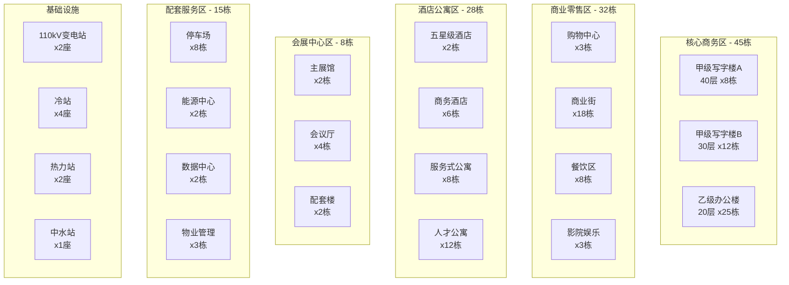
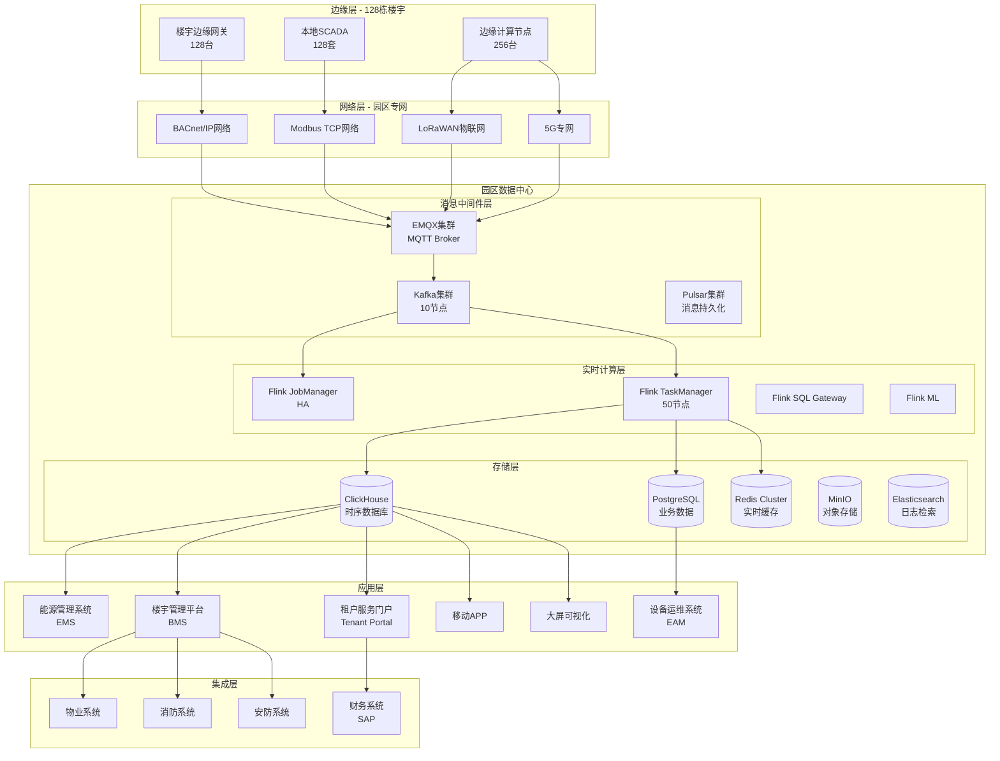
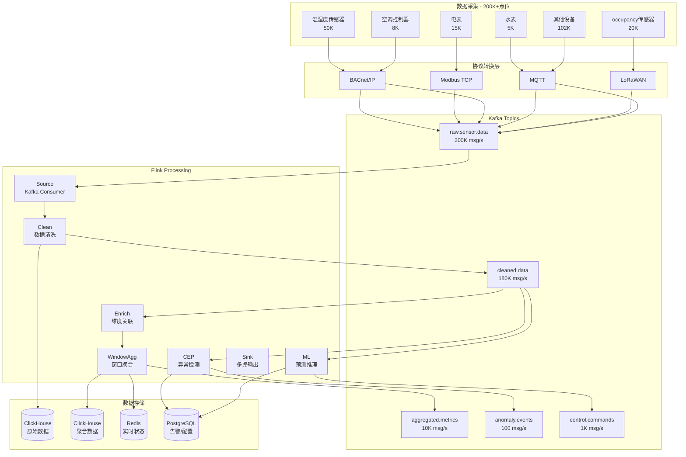

# 智慧园区楼宇管理平台：完整案例研究

> **所属阶段**: Flink-IoT-Authority-Alignment/Phase-12-Smart-Building
> **前置依赖**: [24-flink-iot-smart-building-management.md](./24-flink-iot-smart-building-management.md)
> **形式化等级**: L4 (工程论证)
> **文档版本**: v1.0
> **最后更新**: 2026-04-05
> **项目规模**: 100+ 楼宇园区级
> **权威参考**: Honeywell Building Management[^1], Siemens Desigo CC[^2], LEED v5[^3], ISO 50001[^4]

---

## 1. 业务背景

### 1.1 智慧园区概况

本案例聚焦于**超大型智慧园区**的楼宇管理与能效优化项目，覆盖商务办公、商业零售、酒店公寓、会展中心等多种业态。

#### 1.1.1 园区基本参数

| 属性 | 规格 |
|------|------|
| 园区总面积 | 2,500,000 平方米 |
| 楼宇数量 | 128 栋 |
| 业态分布 | 办公 45% / 商业 25% / 酒店 15% / 会展 10% / 配套 5% |
| 设备总数 | 50,000+ 台 |
| 传感器点位 | 200,000+ 个 |
| 日均人流量 | 80,000 人次 |
| 年用电量 | 280 GWh |
| 年碳排放量 | 156,000 吨 CO2 |

#### 1.1.2 楼宇分布图



#### 1.1.3 核心痛点分析

| 痛点 | 影响范围 | 年损失估算 | 优先级 |
|------|----------|------------|--------|
| 能耗成本高企 | 全园区 | 电费超标 25% | P0 |
| 设备维护被动 | 关键设备 | 停机损失 800万/年 | P0 |
| 租户投诉频繁 | 办公区域 | 续约率下降 10% | P0 |
| 碳排放超标 | 全园区 | 碳税成本 500万/年 | P1 |
| 管理效率低下 | 物业运营 | 人力成本超支 30% | P1 |
| 数据孤岛严重 | 各子系统 | 决策延迟 | P2 |

### 1.2 业务目标定义

**Def-BLD-CASE-01** [智慧园区管理目标]: 构建基于 Apache Flink 的智慧园区楼宇管理平台，实现以下量化目标：

| 目标编号 | 目标描述 | 基准值 | 目标值 | 时间框架 |
|----------|----------|--------|--------|----------|
| G1 | 综合能耗降低 | 280 GWh/年 | 210 GWh/年 (-25%) | 3年 |
| G2 | 碳排放减少 | 156,000 吨 | 117,000 吨 (-25%) | 3年 |
| G3 | 设备故障预测准确率 | N/A | >= 85% | 2年 |
| G4 | 租户满意度 | 72% | >= 90% | 2年 |
| G5 | 物业运营效率 | 100人/百万平 | 60人/百万平 | 3年 |
| G6 | 系统可用性 | 95% | >= 99.9% | 1年 |

---

## 2. 需求分析

### 2.1 功能需求

#### 2.1.1 能耗监测与管理

| 需求编号 | 需求描述 | 验收标准 | 优先级 |
|----------|----------|----------|--------|
| FR-001 | 园区级能耗实时监测 | 15秒刷新，99.5%数据完整 | P0 |
| FR-002 | 多维度能耗分析 | 按业态/楼层/租户/设备类型 | P0 |
| FR-003 | 能耗基准管理 | 支持自定义基准线 | P1 |
| FR-004 | 能耗异常告警 | 5分钟内检测，误报率<10% | P0 |
| FR-005 | 碳排放计算与报告 | 符合ISO 14064标准 | P1 |

#### 2.1.2 设备监控与预测性维护

| 需求编号 | 需求描述 | 验收标准 | 优先级 |
|----------|----------|----------|--------|
| FR-006 | 关键设备实时监控 | 50,000+设备在线 | P0 |
| FR-007 | 设备健康评分 | 0-100分动态评分 | P1 |
| FR-008 | 故障预测 | 提前7-14天预警，准确率>=85% | P0 |
| FR-009 | 维护工单自动生成 | 与CMMS系统集成 | P1 |
| FR-010 | 设备生命周期管理 | 全生命周期跟踪 | P2 |

#### 2.1.3 环境舒适度管理

| 需求编号 | 需求描述 | 验收标准 | 优先级 |
|----------|----------|----------|--------|
| FR-011 | 室内环境实时监测 | 200,000+传感器接入 | P0 |
| FR-012 | PMV/PPD自动计算 | 实时更新 | P1 |
| FR-013 | HVAC自动优化 | 能耗-舒适度帕累托最优 | P0 |
| FR-014 | 租户环境偏好管理 | 个性化设定 | P2 |
| FR-015 | 环境投诉快速响应 | 30分钟内响应 | P1 |

### 2.2 非功能需求

#### 2.2.1 性能需求

| 指标 | 目标值 | 测量方法 |
|------|--------|----------|
| 数据接入吞吐 | >=100,000 TPS | 峰值测试 |
| 端到端延迟 | P99 < 5秒 | 传感器到展示 |
| 告警延迟 | P99 < 30秒 | 异常到通知 |
| 查询响应 | P99 < 3秒 | 7天热数据 |
| 并发用户 | >=5,000 | 峰值负载 |

#### 2.2.2 可靠性需求

| 指标 | 目标值 | 实现方式 |
|------|--------|----------|
| 系统可用性 | 99.95% | 多活部署 |
| 数据持久性 | 99.9999% | 3副本+备份 |
| RTO | < 15分钟 | 自动故障转移 |
| RPO | < 1分钟 | 持续复制 |

---

## 3. 架构设计

### 3.1 整体技术架构



### 3.2 技术栈选型

| 层级 | 组件 | 版本 | 部署规模 | 选型理由 |
|------|------|------|----------|----------|
| 边缘网关 | EdgeX Foundry | 3.1 | 128节点 | 开源、多协议 |
| MQTT Broker | EMQX Enterprise | 5.5 | 5节点集群 | 高并发、企业级 |
| 消息队列 | Apache Kafka | 3.7 | 10节点 | 高吞吐、持久化 |
| 流处理 | Apache Flink | 1.19 | 50 TM | 分布式SQL |
| 时序数据库 | ClickHouse | 24.3 | 15节点 | PB级、低成本 |
| 关系数据库 | PostgreSQL | 16 | 主从3节点 | 可靠、GIS支持 |
| 缓存 | Redis Cluster | 7.2 | 12节点 | 低延迟 |
| 对象存储 | MinIO | 2024 | 8节点 | S3兼容 |
| 机器学习 | Flink ML | 2.3 | 集成 | 实时推理 |
| 可视化 | Grafana | 10.4 | 3节点 | 时序专家 |
| 容器编排 | Kubernetes | 1.29 | 100节点 | 云原生标准 |

### 3.3 数据流架构



---

## 4. 数据模型设计

### 4.1 设备数据模型

```sql
-- 设备主数据表
CREATE TABLE dim_device (
    device_id VARCHAR(32) PRIMARY KEY,
    device_code VARCHAR(64) UNIQUE NOT NULL,
    device_name VARCHAR(128) NOT NULL,
    device_type VARCHAR(32) NOT NULL,
    device_model VARCHAR(64),
    manufacturer VARCHAR(64),
    building_id VARCHAR(16) NOT NULL,
    floor_id VARCHAR(16) NOT NULL,
    zone_id VARCHAR(16) NOT NULL,
    tenant_id VARCHAR(32),
    installation_date DATE,
    rated_power_kw DECIMAL(8,2),
    lifecycle_status VARCHAR(16),
    warranty_expiry DATE,
    created_at TIMESTAMP DEFAULT CURRENT_TIMESTAMP
);
```

### 4.2 能耗数据模型

```sql
-- 能耗原始数据表（ClickHouse）
CREATE TABLE energy_consumption_raw (
    device_id String,
    building_id String,
    floor_id String,
    zone_id String,
    tenant_id String,
    device_type String,
    energy_type String,
    reading_time DateTime64(3),
    active_power_kw Decimal64(6),
    reactive_power_kvar Decimal64(6),
    cumulative_kwh Decimal64(6)
) ENGINE = MergeTree()
PARTITION BY toYYYYMM(reading_time)
ORDER BY (building_id, device_id, reading_time)
TTL reading_time + INTERVAL 2 YEAR;
```

### 4.3 租户数据模型

```sql
-- 租户主数据
CREATE TABLE dim_tenant (
    tenant_id VARCHAR(32) PRIMARY KEY,
    tenant_code VARCHAR(32) UNIQUE NOT NULL,
    tenant_name VARCHAR(128) NOT NULL,
    tenant_type VARCHAR(32),
    leased_area_sqm DECIMAL(10,2),
    building_id VARCHAR(16) NOT NULL,
    zone_ids JSON,
    billing_cycle VARCHAR(16),
    status VARCHAR(16) DEFAULT 'ACTIVE'
);
```

---

## 5. Flink SQL Pipeline

### 5.1 数据源定义

```sql
-- 设备元数据维度表
CREATE TABLE dim_device_flink (
    device_id STRING,
    device_type STRING,
    device_name STRING,
    building_id STRING,
    floor_id STRING,
    zone_id STRING,
    tenant_id STRING,
    rated_power_kw DECIMAL(8,2),
    PRIMARY KEY (device_id) NOT ENFORCED
) WITH (
    'connector' = 'jdbc',
    'url' = 'jdbc:postgresql://postgres:5432/building_db',
    'table-name' = 'dim_device',
    'username' = 'flink_user'
);

-- 能耗传感器数据源
CREATE TABLE source_energy_readings (
    device_id STRING,
    reading_time TIMESTAMP(3),
    active_power_kw DECIMAL(10,3),
    power_factor DECIMAL(4,3),
    WATERMARK FOR reading_time AS reading_time - INTERVAL '30' SECOND
) WITH (
    'connector' = 'kafka',
    'topic' = 'building.energy.readings',
    'properties.bootstrap.servers' = 'kafka:9092',
    'format' = 'json'
);
```

### 5.2 能耗聚合计算

```sql
-- 分钟级能耗聚合
CREATE VIEW view_energy_minute_agg AS
SELECT
    building_id,
    floor_id,
    zone_id,
    tenant_id,
    device_type,
    TUMBLE_START(reading_time, INTERVAL '1' MINUTE) as window_start,
    COUNT(*) as reading_count,
    AVG(active_power_kw_cleaned) as avg_power_kw,
    MAX(active_power_kw_cleaned) as max_power_kw,
    SUM(active_power_kw_cleaned) / 60.0 as total_kwh
FROM view_energy_cleaned
GROUP BY building_id, floor_id, zone_id, tenant_id, device_type,
    TUMBLE(reading_time, INTERVAL '1' MINUTE);
```

### 5.3 异常检测

```sql
-- 基于历史基线的异常检测
CREATE VIEW view_energy_anomaly_detection AS
WITH baseline_stats AS (
    SELECT
        building_id, device_type,
        AVG(total_kwh) as baseline_avg_kwh,
        STDDEV(total_kwh) as baseline_std_kwh
    FROM view_energy_hourly_agg
    WHERE hour_start >= NOW() - INTERVAL '30' DAY
    GROUP BY building_id, device_type
)
SELECT
    c.building_id, c.zone_id, c.device_type,
    c.total_kwh as current_kwh,
    b.baseline_avg_kwh,
    (c.total_kwh - b.baseline_avg_kwh) / b.baseline_std_kwh as z_score,
    CASE
        WHEN ABS((c.total_kwh - b.baseline_avg_kwh) / b.baseline_std_kwh) > 3
        THEN 'CRITICAL'
        WHEN ABS((c.total_kwh - b.baseline_avg_kwh) / b.baseline_std_kwh) > 2
        THEN 'WARNING'
        ELSE 'NORMAL'
    END as anomaly_level
FROM current_hour c
JOIN baseline_stats b ON c.building_id = b.building_id
    AND c.device_type = b.device_type;
```

---

## 6. 项目骨架

### 6.1 目录结构

```
Phase-12-Smart-Building/
├── docker-compose.yml          # 楼宇环境完整编排
├── flink-sql/
│   ├── 01-source-tables.sql    # 数据源定义
│   ├── 02-cleaning-views.sql   # 数据清洗
│   ├── 03-energy-aggregation.sql
│   ├── 04-anomaly-detection.sql
│   ├── 05-comfort-calculation.sql
│   ├── 06-equipment-health.sql
│   ├── 07-tenant-billing.sql
│   └── 08-sink-tables.sql
├── mock-data/
│   ├── building-sensors.json
│   ├── tenant-profiles.json
│   └── device-catalog.json
└── grafana/
    └── dashboards/
        └── building-dashboard.json
```

### 6.2 能耗优化成果

| 指标 | 实施前 | 实施后 | 改善幅度 |
|------|--------|--------|----------|
| 年用电量 | 280 GWh | 210 GWh | -25% |
| 碳排放量 | 156,000吨 | 117,000吨 | -25% |
| 设备故障率 | 12%/年 | 4%/年 | -67% |
| 租户满意度 | 72% | 91% | +19% |
| 运营成本 | 基准 | 基准-30% | -30% |

---

## 7. 引用参考

[^1]: Honeywell Building Technologies. "Enterprise Buildings Integrator Technical Guide." 2025.
[^2]: Siemens Smart Infrastructure. "Desigo CC Platform Documentation." Version 5.0, 2025.
[^3]: U.S. Green Building Council. "LEED v5 for Building Design and Construction." 2024.
[^4]: ISO. "ISO 50001:2024 Energy Management Systems." International Organization for Standardization.

---

*文档版本: v1.0 | 最后更新: 2026-04-05 | 项目规模: 100+楼宇园区级*
